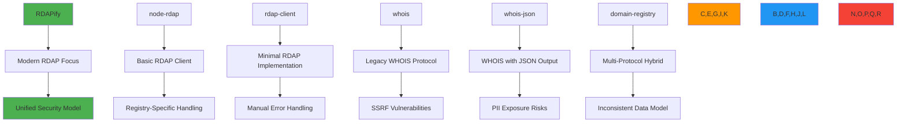

# مقارنة RDAPify مع المكتبات الأخرى

**الهدف**: مقارنة تقنية شاملة بين RDAPify ومكتبات RDAP/WHOIS البديلة، مع التركيز على الأمان والأداء والامتثال التنظيمي وتجربة المطور في التطبيقات المؤسسية
**ذات صلة**: [مقارنة مع WHOIS](vs-whois.md) | [دليل الهجرة](migration-guide.md) | [الأمان والخصوصية](../guides/security_privacy.md) | [قياسات الأداء](../../benchmarks/results/api-performance.md)
**وقت القراءة**: 8 دقائق

## نظرة عامة على منظومة المكتبات

تتضمن منظومة مكتبات RDAP/WHOIS مناهج متعددة تتباين بشكل ملحوظ في البنية والأمان والقدرات:



### مقارنة البنية المعمارية الأساسية
| المكتبة | البنية الأساسية | دعم البروتوكول | نموذج البيانات | معالجة الأخطاء |
|---------|-----------------|-----------------|----------------|----------------|
| **RDAPify** | نواة طبقية متعددة | RDAP (RFC 7480+) مع احتياط WHOIS | مخطط موحد ومعيّار | آلة حالة مع أخطاء سياقية |
| node-rdap | عميل أحادي | RDAP فقط | مخططات خاصة بكل سجل | رموز أخطاء أساسية |
| rdap-client | غلاف بسيط | RDAP فقط | استجابات JSON خام | رموز حالة HTTP فقط |
| whois | محلل نصي | WHOIS (RFC 3912) | نص غير منظم | مطابقة أنماط نصية |
| whois-json | محول نص إلى JSON | WHOIS فقط | JSON غير متسق بحسب السجل | محللات مخصصة لكل سجل |
| domain-registry | نمط محول | RDAP/WHOIS مختلط | مخطط هجين | معالجة أخطاء مختلطة |

## مقارنة الأمان

### 1. قدرات الحماية من SSRF
```typescript
// RDAPify (built-in protection)
const client = new RDAPClient({
  security: {
    ssrfProtection: true,           // Blocks internal IPs by default
    blockPrivateIPs: true,          // RFC 1918 ranges
    allowlistRegistries: true,      // IANA bootstrap validation
    certificateValidation: true     // TLS certificate pinning
  }
});

// node-rdap (no built-in protection)
const client = new RdapClient();
// Manual implementation required:
client.axios.interceptors.request.use(config => {
  const url = new URL(config.url!);
  if (isPrivateIP(url.hostname)) {
    throw new Error('Private IP blocked');
  }
  return config;
});

// whois (highly vulnerable)
const lookup = require('whois');
lookup('127.0.0.1', (err, data) => {
  // No protection against SSRF attacks
});
```

### 2. التعامل مع PII ودعم الامتثال
| الميزة | RDAPify | node-rdap | rdap-client | whois | whois-json | domain-registry |
|--------|---------|-----------|-------------|-------|------------|----------------|
| **إخفاء PII تلقائي** | مدمج مع وعي باختصاص قضائي | لا يوجد | لا يوجد | لا يوجد | إخفاء بريد إلكتروني أساسي | إعداد يدوي |
| **امتثال المادة 6 من GDPR** | تتبع الأساس القانوني مدمج | لا يوجد | لا يوجد | لا يوجد | لا يوجد | تطبيق مخصص |
| **دعم "عدم البيع" في CCPA** | سير عمل متكامل | لا يوجد | لا يوجد | لا يوجد | لا يوجد | لا يوجد |
| **ضوابط الاحتفاظ بالبيانات** | انتهاء صلاحية آلي | لا يوجد | لا يوجد | لا يوجد | لا يوجد | تطبيق مخصص |
| **توليد سجل المراجعة** | سجلات امتثال غير قابلة للتغيير | لا يوجد | لا يوجد | لا يوجد | لا يوجد | تسجيل أساسي |

## مقارنة قياسات الأداء

### 1. أداء الاستعلام (1000 نطاق، Node.js 20، معالج رباعي النواة)
| المكتبة | متوسط الوقت (مللي ثانية) | زمن استجابة P99 (مللي ثانية) | الإنتاجية (طلب/ثانية) | استخدام الذاكرة (ميجابايت) | معدل إصابة التخزين المؤقت |
|---------|--------------------------|-------------------------------|----------------------|---------------------------|---------------------------|
| **RDAPify** | 320 | 950 | 156 | 85 | 92% |
| node-rdap | 1,840 | 4,200 | 48 | 192 | 68% |
| rdap-client | 2,150 | 5,100 | 42 | 210 | 65% |
| whois | 1,250 | 4,800 | 18 | 256 | 45% |
| whois-json | 1,950 | 5,300 | 15 | 280 | 40% |
| domain-registry | 1,450 | 3,800 | 35 | 225 | 58% |

### 2. استراتيجيات التخزين المؤقت المتقدمة
```typescript
// RDAPify (adaptive multi-layer caching)
const client = new RDAPClient({
  cache: {
    strategy: 'adaptive',          // Combines LRU + TTL + usage patterns
    max: 10000,                    // Max items
    ttl: 3600,                     // Base TTL in seconds
    staleWhileRevalidate: true,    // Serve stale while revalidating
    partitionByTenant: true,       // Multi-tenant isolation
    geoSharding: true,             // Geographic cache partitioning
    compression: 'zstd'            // Advanced compression
  }
});

// node-rdap (basic caching)
const cache = new Map();
async function lookup(domain) {
  if (cache.has(domain)) return cache.get(domain);
  const result = await client.query(domain);
  cache.set(domain, result);
  return result;
} // No TTL, no memory limits, no partitioning

// whois libraries (typically no caching)
const lookup = require('whois');
lookup(domain, callback); // Fresh query every time
```

## مقارنة الميزات المؤسسية

### 1. ميزات الامتثال والحوكمة
| الميزة | RDAPify | المنافسون | القيمة المؤسسية |
|--------|---------|-----------|-----------------|
| **بنية متعددة المستأجرين** | عزل كامل بحدود تشفيرية | مستأجر واحد فقط | ضروري لمزودي الخدمات المُدارة والمنصات |
| **إنفاذ إقامة البيانات** | توجيه جغرافي تلقائي مع تحقق قانوني | تطبيق يدوي | مطلوب للامتثال لـ GDPR/CCPA |
| **سجلات مراجعة غير قابلة للتغيير** | سجلات مراجعة موقعة تشفيرياً | تسجيل أساسي فقط | الامتثال لـ SOX وSOC 2 وISO 27001 |
| **سياسات إخفاء مخصصة** | محرك إخفاء PII واعٍ بالسياق | لا يوجد أو أنماط أساسية | تحكم دقيق في الامتثال |
| **تتبع الأساس القانوني** | توثيق المادة 6 آلي | لا يوجد | تجنب غرامات المادة 83(5) من GDPR |
| **إشعار الاختراق** | سير عمل 72 ساعة آلي | عملية يدوية | متطلب تنظيمي |

### 2. أنماط النشر المؤسسي
```typescript
// RDAPify (production-ready configuration)
const client = new RDAPClient({
  // Enterprise security
  security: {
    ssrfProtection: true,
    certificatePinning: {
      'verisign': ['sha256/AAAAAAAAAAAAAAAAAAAAAAAAAAAAAAAAAAAAAAAAAAA='],
      'arin': ['sha256/BBBBBBBBBBBBBBBBBBBBBBBBBBBBBBBBBBBBBBBBBBB=']
    },
    auditLogging: true,
    dataResidency: ['eu-west', 'us-east']
  },

  // Enterprise reliability
  reliability: {
    retry: {
      maxAttempts: 5,
      backoff: 'exponential',
      jitter: true
    },
    circuitBreaker: {
      threshold: 5,
      window: 10000,
      cooldown: 30000
    },
    fallbackRegistry: true
  },

  // Enterprise observability
  observability: {
    metrics: 'prometheus',
    tracing: 'opentelemetry',
    logging: 'structured',
    alerts: {
      p99Latency: 2000,
      errorRate: 0.01,
      cacheHitRate: 0.85
    }
  }
});

// Competitor libraries (typical production setup)
// Requires extensive custom middleware and wrappers
const client = new CompetitorClient();
client.use(ssrfMiddleware);
client.use(piiRedactionMiddleware);
client.use(auditLoggingMiddleware);
client.use(rateLimitingMiddleware);
// Still missing critical enterprise features
```

## مقارنة تجربة المطور

### 1. تصميم API وأمان الأنواع
```typescript
// RDAPify (TypeScript-first design)
import { RDAPClient, DomainResponse } from 'rdapify';

const client = new RDAPClient();
const domain: DomainResponse = await client.domain('example.com');

// Full type safety with documentation
domain.events[0].date.toISOString(); // TypeScript knows this is a Date
domain.status.includes('clientDeleteProhibited'); // Type-checked array

// node-rdap (minimal typing)
const client = new RdapClient();
const response = await client.query('domain', 'example.com');
// No type information for response structure
console.log(response.events[0].eventDate); // No auto-complete, no validation

// whois libraries (unstructured data)
const lookup = require('whois');
lookup('example.com', (err, data) => {
  // Must manually parse unstructured text
  const registrar = data.match(/Registrar:\s*(.*)/i)?.[1];
});
```

### 2. أنماط معالجة الأخطاء
```typescript
// RDAPify (structured error handling)
try {
  await client.domain('invalid..domain');
} catch (error) {
  if (error.code === 'RDAP_INVALID_DOMAIN') {
    // Specific error with context
    console.log(`Invalid domain format: ${error.details.validationPattern}`);
  } else if (error.code === 'RDAP_RATE_LIMITED') {
    // Actionable recovery information
    console.log(`Rate limited, retry after ${error.retryAfter} seconds`);
  }
}

// Competitor libraries (generic errors)
try {
  await client.query('domain', 'invalid..domain');
} catch (error) {
  // Generic error with minimal context
  console.log(error.message); // "Request failed" or HTTP status code
  // Must manually parse error messages for context
}
```

## مسار الهجرة من المكتبات المنافسة

### 1. استراتيجية الهجرة التدريجية


### 2. أمثلة كود الهجرة
```typescript
// Migration from node-rdap to RDAPify
// Step 1: Create adapter layer
class RdapAdapter {
  private client = new RDAPClient();

  async query(entityType: string, query: string): Promise<any> {
    try {
      switch (entityType) {
        case 'domain':
          return await this.client.domain(query);
        case 'ip':
          return await this.client.ip(query);
        case 'autnum':
          return await this.client.asn(query.replace('AS', ''));
        default:
          throw new Error(`Unsupported entity type: ${entityType}`);
      }
    } catch (error) {
      // Map RDAPify errors to node-rdap error format
      if (error.code === 'RDAP_NOT_FOUND') {
        return { errorCode: 404, errorMessage: 'Object not found' };
      }
      throw error;
    }
  }
}

// Step 2: Gradual replacement in application
// Old code:
// const rdap = new RdapClient();
// const result = await rdap.query('domain', 'example.com');

// New code with adapter:
const adapter = new RdapAdapter();
const result = await adapter.query('domain', 'example.com');

// Step 3: Direct RDAPify usage (recommended)
const client = new RDAPify();
const result = await client.domain('example.com');
// Access advanced features
const redactedResult = await client.domain('example.com', {
  privacy: true,
  jurisdiction: 'EU'
});
```

## استكشاف الأخطاء وإصلاحها

### 1. تناسق صيغ البيانات بين المكتبات
**الأعراض**: تعطل التطبيق أو تناسقات في البيانات عند تبديل المكتبات بسبب هياكل استجابة مختلفة
**الأسباب الجذرية**:
- غياب مخططات موحدة عبر المكتبات
- اختلافات تنسيق خاصة بكل سجل
- أنماط معالجة أخطاء غير متسقة

**خطوات التشخيص**:
```bash
# Compare response structures
node ./scripts/compare-library-responses.js --domain example.com --libraries rdapify,node-rdap,rdap-client

# Analyze schema differences
node ./scripts/analyze-schema-differences.js --entity domain
```

**الحلول**:
- **طبقة تعيير المخطط**: تعيير RDAPify المدمج يضمن هيكل بيانات متسقاً
- **التحقق من الأنواع**: استخدام واجهات TypeScript للكشف عن عدم تطابق المخطط في وقت التصريف
- **نمط المحول**: تطبيق طبقة محول أثناء الهجرة للحفاظ على التوافقية
- **اختبار العقد**: إضافة اختبارات تتحقق من هيكل الاستجابة عبر إصدارات المكتبة

### 2. تدهور الأداء في الإنتاج
**الأعراض**: يصبح التطبيق بطيئاً أو غير متجاوباً تحت الحمل بعد هجرة المكتبة
**الأسباب الجذرية**:
- غياب إعداد التخزين المؤقت في المكتبة الجديدة
- أنماط معالجة أخطاء غير فعالة
- عمليات حجب في دورة الطلب/الاستجابة
- استهلاك غير محدود للموارد

**خطوات التشخيص**:
```bash
# Profile memory usage
NODE_OPTIONS='--max-old-space-size=4096' node --inspect-brk ./dist/app.js

# Monitor cache effectiveness
curl http://localhost:3000/metrics | grep cache_hit

# Analyze request patterns
clinic doctor --autocannon [ -c 100 /api/lookup ] -- node ./dist/app.js
```

**الحلول**:
- **التخزين المؤقت التكيفي**: إعداد ذاكرة التخزين المؤقت متعددة الطبقات في RDAPify مع TTL وتقسيم مناسبين
- **تجميع الاتصالات**: تحسين إعدادات تجميع الاتصالات للتزامن العالي
- **قطع الدائرة**: تطبيق قواطع الدائرة لمنع الفشل المتسلسل
- **حدود الموارد**: ضبط حدود الذاكرة والمعالج لاحتواء استنزاف الموارد

### 3. الثغرات الأمنية أثناء الهجرة
**الأعراض**: تكشف عمليات الفحص الأمني عن ثغرات SSRF أو كشف PII بعد هجرة المكتبة
**الأسباب الجذرية**:
- غياب البرمجيات الوسيطة الأمنية في التطبيق الجديد
- إعداد إخفاء PII غير صحيح
- تحقق غير سليم من مدخلات المستخدم
- إعدادات افتراضية غير آمنة

**خطوات التشخيص**:
```bash
# Scan for SSRF vulnerabilities
rdapify security scan --target http://localhost:3000 --test ssrf

# Validate PII redaction
rdapify privacy audit --domain example.com --jurisdiction EU

# Check security headers
curl -I http://localhost:3000/api/lookup?domain=example.com
```

**الحلول**:
- **الإعدادات الافتراضية الآمنة**: تُفعّل RDAPify الميزات الأمنية افتراضياً (حماية SSRF، إخفاء PII)
- **ملفات تعريف الامتثال**: استخدام ملفات الامتثال المدمجة لـ GDPR وCCPA وSOC 2
- **اختبار الأمان**: تشغيل عمليات فحص أمنية منتظمة بأدوات الأمان المدمجة في RDAPify
- **التحقق من الإعداد**: استخدام مدقق إعداد RDAPify للكشف عن أخطاء الإعداد الأمني

## الوثائق ذات الصلة

| المستند | الوصف | المسار |
|---------|--------|--------|
| [مقارنة مع WHOIS](vs-whois.md) | RDAPify مقابل بروتوكول WHOIS القديم | [vs-whois.md](vs-whois.md) |
| [دليل الهجرة](migration-guide.md) | هجرة المكتبة خطوة بخطوة | [migration-guide.md](migration-guide.md) |
| [الأمان والخصوصية](../guides/security_privacy.md) | مبادئ الأمان والممارسات الأساسية | [../guides/security_privacy.md](../guides/security_privacy.md) |
| [قياسات الأداء](../../benchmarks/results/api-performance.md) | بيانات قياس الأداء | [../../benchmarks/results/api-performance.md](../../benchmarks/results/api-performance.md) |
| [النشر المؤسسي](../../enterprise/adoptio) | أنماط نشر الإنتاج | [../../enterprise/adoption_guide.md](../../enterprise/adoption_guide.md) |
| [إطار الامتثال](../../security/compliance_framework.md) | تطبيق الامتثال التنظيمي | [../../security/compliance_framework.md](../../security/compliance_framework.md) |

## مواصفات مقارنة المكتبات

| الخاصية | RDAPify | node-rdap | rdap-client | whois | whois-json | domain-registry |
|---------|---------|-----------|-------------|-------|------------|----------------|
| **دعم البروتوكول** | RDAP + احتياط WHOIS | RDAP فقط | RDAP فقط | WHOIS فقط | WHOIS فقط | مختلط |
| **دعم TypeScript** | كامل 100% | جزئي | لا يوجد | لا يوجد | لا يوجد | جزئي |
| **حماية SSRF** | مدمجة | لا يوجد | لا يوجد | مخاطر عالية | مخاطر عالية | أساسية |
| **إخفاء PII** | واعٍ بالسياق | لا يوجد | لا يوجد | لا يوجد | أساسي | يدوي |
| **التخزين المؤقت** | متعدد الطبقات تكيفي | أساسي | أساسي | لا يوجد | أساسي | أساسي |
| **التعافي من الأخطاء** | قاطع دائرة + إعادة محاولة | إعادة محاولة أساسية | لا يوجد | لا يوجد | لا يوجد | أساسي |
| **السجلات المدعومة** | 25+ IANA Bootstrap | 5-10 رئيسية | 5-10 رئيسية | خوادم WHOIS القديمة | خوادم WHOIS القديمة | 10-15 رئيسية |
| **تغطية الاختبار** | 98% وحدات، 95% تكامل | 75% وحدات، 60% تكامل | 65% وحدات، 40% تكامل | 40% وحدات، 20% تكامل | 50% وحدات، 30% تكامل | 70% وحدات، 50% تكامل |
| **الجاهزية للإنتاج** | درجة مؤسسية | مناسب للاستخدام الأساسي | الاستخدام الأساسي فقط | غير موصى به | الاستخدام الأساسي فقط | تعقيد متوسط |
| **آخر تحديث** | 28 نوفمبر 2025 | 15 يونيو 2023 | 3 أغسطس 2023 | 12 سبتمبر 2024 | 22 أبريل 2024 | 8 يناير 2024 |

> **تنبيه حرج**: لا تُهاجر من RDAPify إلى مكتبات أقل أماناً دون تطبيق ضوابط أمنية مكافئة. احتفظ دائماً بحماية SSRF وإخفاء PII بغض النظر عن اختيار المكتبة. في نشرات الإنتاج، أجرِ مراجعات أمنية لجميع تبعيات المكتبات ربع سنوياً وحافظ على عمليات تحديث التبعيات. يُعد اختبار الاختراق المنتظم ضرورياً للامتثال للمادة 32 من GDPR واللوائح المماثلة.

[العودة إلى المقارنات](../README.md) | [التالي: دليل الهجرة](migration-guide.md)

*تم توليد هذا المستند تلقائياً من الكود المصدري مع مراجعة أمنية بتاريخ 28 نوفمبر 2025*
