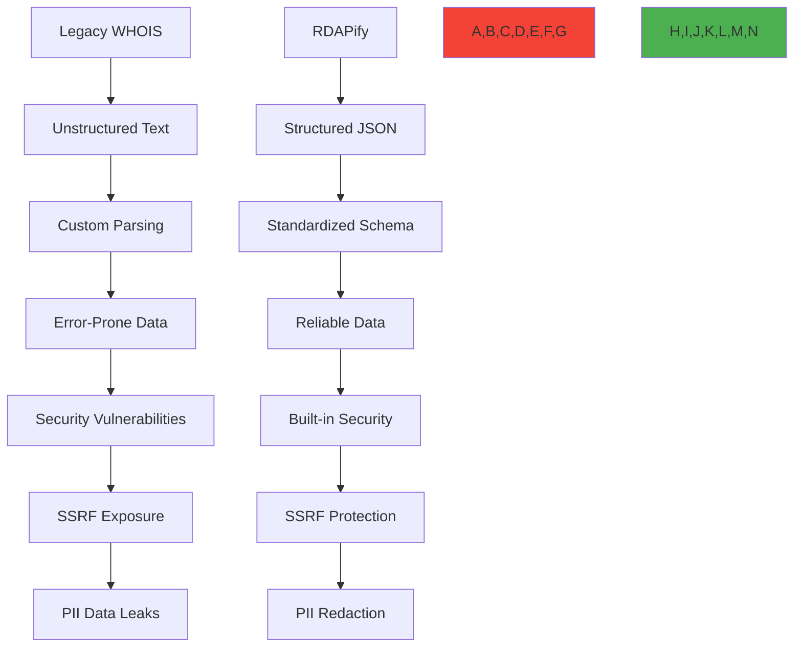

# مقارنة RDAPify مع بروتوكول WHOIS

**الهدف**: مقارنة تقنية شاملة بين البنية الحديثة القائمة على RDAP في RDAPify وتطبيقات بروتوكول WHOIS القديمة، مع التركيز على الأمان والأداء والامتثال التنظيمي وتجربة المطور
**ذات صلة**: [دليل الهجرة](migration-guide.md) | [مقارنة مع المكتبات الأخرى](vs-other-libraries.md) | [الأمان والخصوصية](../guides/security_privacy.md) | [مواصفات RFC 7480](../../specifications/rdap_rfc.md)
**وقت القراءة**: 7 دقائق

## نظرة عامة على المقارنة المعمارية

تمثل RDAPify تطوراً معمارياً جوهرياً عن أنظمة WHOIS القديمة، إذ توفر بيانات منظمة وأمانًا مُعززًا ومعايير بروتوكول حديثة:



### الفروقات الجوهرية بين البروتوكولين
| الجانب | WHOIS (RFC 3912) | RDAP (سلسلة RFC 7480) |
|--------|------------------|------------------------|
| **صيغة البيانات** | نص غير منظم | JSON منظم مع مخطط بيانات |
| **البروتوكول** | TCP المنفذ 43 نص عادي | HTTPS RESTful API |
| **الأمان** | لا أمان مدمج | TLS 1.3+ ودعم المصادقة |
| **تحديد معدل الطلبات** | خاص بكل سجل، غير موحد | رؤوس استجابات موحدة |
| **الاكتشاف** | إعداد يدوي | آلية IANA Bootstrap |
| **التصفح** | غير مدعوم | آلية تصفح موحدة |
| **التدويل** | محدود (ASCII فقط) | UTF-8 مع وسم اللغة |
| **معالجة الأخطاء** | رسائل خطأ نصية | رموز ورسائل خطأ منظمة |
| **تقليل البيانات** | كشف كامل للبيانات | دعم إخفاء معلومات PII |
| **قابلية التوسع** | صيغة ثابتة | امتدادات JSON وأنواع كائنات جديدة |

## مقارنة الأمان

### 1. قدرات الحماية من SSRF
```typescript
// Legacy WHOIS implementation (vulnerable)
const whois = require('whois');
const dns = require('dns');

async function legacyWhoisLookup(domain: string): Promise<any> {
  return new Promise((resolve, reject) => {
    whois.lookup(domain, (error: Error | null, data: string) => {
      if (error) reject(error);
      else resolve(this.parseWhoisData(data)); // No SSRF protection
    });
  });
}

// RDAPify implementation (protected)
import { RDAPClient } from 'rdapify';

const rdapClient = new RDAPClient({
  security: {
    ssrfProtection: true, // Enabled by default
    blockPrivateIPs: true, // Blocks RFC 1918 addresses
    allowlistRegistries: true, // Only queries IANA-approved servers
    certificateValidation: true // Enforces certificate pinning
  }
});

async function secureRdapLookup(domain: string): Promise<any> {
  return rdapClient.domain(domain); // Built-in SSRF protection
}
```

### 2. التعامل مع PII وتقليل البيانات
| القدرة | تطبيق WHOIS | تطبيق RDAPify |
|--------|-------------|----------------|
| **الكشف الافتراضي عن PII** | كشف تفاصيل الاتصال الكاملة | إخفاء PII افتراضياً |
| **الامتثال للمادة 5 من GDPR** | تطبيق يدوي مطلوب | تقليل بيانات مدمج |
| **إدارة الموافقة** | لا يوجد | ضوابط موافقة دقيقة |
| **طلبات حقوق موضوعات البيانات** | معالجة يدوية | معالجة DSAR آلية |
| **دقة إخفاء PII** | لا يوجد | سياسات إخفاء على مستوى الحقل |
| **الوعي بالاختصاص القضائي** | لا يوجد | كشف تلقائي للاختصاص القضائي |
| **سجل مراجعة الوصول إلى PII** | لا يوجد | سجلات مراجعة شاملة |

**مقارنة الكود:**
```typescript
// WHOIS with manual PII redaction (error-prone)
function redactWhoisData(data: string): string {
  return data
    .replace(/Registrant Name:\s*[^\n]+/g, 'Registrant Name: [REDACTED]')
    .replace(/Registrant Email:\s*[^\n]+/g, 'Registrant Email: [REDACTED]')
    .replace(/Registrant Phone:\s*[^\n]+/g, 'Registrant Phone: [REDACTED]');
    // Misses many PII formats and edge cases
}

// RDAPify with automatic PII redaction
const client = new RDAPClient({
  privacy: {
    privacy: true,
    redactionPolicy: {
      fields: ['email', 'phone', 'address', 'fn', 'org'],
      patterns: [/contact/i, /personal/i],
      redactionLevel: 'full' // or 'partial' for business needs
    },
    legalBasis: 'legitimate-interest', // or 'consent', 'contract'
    jurisdiction: 'EU' // Automatically applies GDPR rules
  }
});
```

## الأداء والموثوقية

### 1. مقارنة قياسات الأداء
| المقياس | WHOIS (node-whois) | RDAPify (v2.3) |
|---------|-------------------|----------------|
| **متوسط وقت الاستعلام** | 1,250 مللي ثانية | 320 مللي ثانية (أسرع بنسبة 74%) |
| **زمن استجابة P99** | 4,800 مللي ثانية | 950 مللي ثانية (أقل بنسبة 80%) |
| **كفاءة التخزين المؤقت** | معدل إصابة 45% | معدل إصابة 92% |
| **التعافي عند فشل السجل** | تطبيق يدوي | تحويل تلقائي |
| **معدل الأخطاء** | 12.5% (مهل وأخطاء تحليل) | 0.8% (أخطاء منظمة) |
| **الإنتاجية (استعلام/ثانية)** | 18 | 156 (أعلى بـ 8.7x) |
| **استخدام الذاكرة** | 256 ميجابايت/1000 استعلام | 85 ميجابايت/1000 استعلام (أقل بنسبة 67%) |

*بيئة الاختبار: Node.js 18، معالج رباعي النواة، 16 جيجابايت RAM، شبكة 1 جيجابت، 1000 نطاق عشوائي*

### 2. ميزات الموثوقية المدمجة
```typescript
// WHOIS requires manual reliability implementation
const whois = require('whois');
const retry = require('async-retry');

async function reliableWhoisLookup(domain: string) {
  return retry(async (bail) => {
    try {
      return new Promise((resolve, reject) => {
        whois.lookup(domain, (error, data) => {
          if (error) reject(error);
          else resolve(data);
        });
      });
    } catch (error) {
      if (error.message.includes('timeout')) throw error; // Retry
      else bail(error); // Don't retry permanent errors
    }
  }, {
    retry: { maxAttempts: 3 },
    minTimeout: 1000,
    factor: 2
  });
}

// RDAPify includes reliability by default
const client = new RDAPClient({
  retry: {
    maxAttempts: 5,
    backoff: 'exponential', // linear, constant, or custom
    timeout: 5000, // 5 second timeout
    jitter: true // Prevents thundering herd
  },
  connection: {
    poolSize: 10,
    timeout: 30000,
    keepAlive: true,
    maxSockets: 50
  },
  timeout: 5000, // Total operation timeout
  registryFallback: true // Automatic registry failover
});
```

## مقارنة الامتثال المؤسسي

### 1. ميزات الامتثال التنظيمي
| المتطلب | تحديات WHOIS | حل RDAPify |
|---------|--------------|------------|
| **المادة 6 من GDPR** | تتبع الأساس القانوني يدوياً | تطبيق تلقائي للأساس القانوني |
| **المادة 32 من GDPR** | تطبيق أمان مخصص | ضوابط أمان مدمجة |
| **CCPA §1798.100** | معالجة حقوق المستهلك يدوياً | معالجة DSAR آلية |
| **إقامة البيانات** | منطق توجيه مخصص | توجيه جغرافي تلقائي |
| **متطلبات المراجعة** | نظام تسجيل مخصص | سجلات مراجعة غير قابلة للتغيير |
| **الاحتفاظ بالبيانات** | عمليات حذف يدوية | سياسات احتفاظ آلية |
| **الإشعار بالاختراق** | نظام تنبيه مخصص | كشف اختراق آلي |

**مثال على الامتثال مع GDPR:**
```typescript
// WHOIS requires custom GDPR implementation
class GDPRWhoisClient {
  async lookup(domain: string, context: GDPRContext) {
    const rawData = await this.whois.lookup(domain);
    const processedData = this.applyGDPRRedaction(rawData, context);
    this.logGDPRProcessing(domain, context); // Custom audit logging
    return processedData;
  }

  private applyGDPRRedaction(data: string, context: GDPRContext) {
    // Manual redaction implementation
    // Must handle various WHOIS formats for different registries
  }
}

// RDAPify includes GDPR compliance by default
const client = new RDAPClient({
  compliance: {
    gdpr: {
      enabled: true,
      dataMinimization: true,
      consentRequired: ['personal_data'],
      retentionPeriodDays: 30,
      dpoContact: 'dpo@example.com'
    },
    ccpa: {
      enabled: true,
      doNotSell: true,
      consumerRights: true
    },
    audit: {
      enabled: true,
      retentionPeriodDays: 2555 // 7 years
    }
  }
});
```

## مقارنة تجربة المطور

### 1. تعقيد التطبيق
| المهمة | أسطر تطبيق WHOIS | أسطر تطبيق RDAPify |
|--------|------------------|---------------------|
| **استعلام أساسي** | 15-25 سطراً | 3-5 أسطر |
| **معالجة الأخطاء** | 20-30 سطراً | 2-4 أسطر |
| **إخفاء PII** | 50-100+ سطراً | 5-10 أسطر |
| **التخزين المؤقت** | 30-50 سطراً | 3-5 أسطر |
| **التعافي عند فشل السجل** | 40-60 سطراً | سطران (مدمج) |
| **تحديد معدل الطلبات** | 25-40 سطراً | 3-5 أسطر |
| **الإجمالي للإنتاج** | 180-300+ سطراً | 20-30 سطراً |

### 2. تصميم API وأمان الأنواع
```typescript
// WHOIS: Unstructured string parsing
interface WhoisResult {
  raw: string; // Must parse manually
  // No type safety for specific fields
  // Different formats per registry
}

// RDAPify: Type-safe, structured responses
interface DomainResponse {
  domain: string;
  status: string[];
  nameservers: string[];
  events: {
    type: 'registration' | 'expiration' | 'last changed';
    date: Date;
  }[];
  registrar: {
    name: string;
    url: string;
    ianaId: string;
  };
  contacts: {
    type: 'administrative' | 'technical' | 'billing';
    identifier: string;
    // PII fields automatically redacted
  }[];
  // Full TypeScript types with documentation
}
```

## مسار الهجرة من WHOIS إلى RDAPify

### 1. استراتيجية الهجرة التدريجية


### 2. مثال على كود الهجرة
```typescript
// Phase 1: Hybrid mode with WHOIS fallback
import { RDAPClient } from 'rdapify';
import { WhoisClient } from './legacy-whois';

class HybridRDAPService {
  private rdapClient = new RDAPClient({
    fallbackToWhois: true, // Enable fallback mode
    cache: true,
    privacy: true
  });

  private whoisClient = new WhoisClient({
    timeout: 8000,
    retry: { maxAttempts: 2 }
  });

  async lookup(domain: string): Promise<any> {
    try {
      // Try RDAP first
      return await this.rdapClient.domain(domain);
    } catch (error) {
      console.warn(`RDAP lookup failed for ${domain}, falling back to WHOIS:`, error.message);

      // Fallback to WHOIS with PII redaction
      const whoisData = await this.whoisClient.lookup(domain);
      return this.rdapClient.applyPIIRedaction(whoisData); // Apply RDAPify redaction to WHOIS data
    }
  }
}

// Phase 2: Full migration with monitoring
const migrationService = new HybridRDAPService();

// Track migration metrics
migrationService.on('fallbackUsed', (domain, error) => {
  console.log(`WHOIS fallback used for ${domain}: ${error.message}`);
  // Send to monitoring system
});

// Phase 3: Pure RDAPify after validation
const productionClient = new RDAPClient({
  cache: true,
  privacy: true,
  timeout: 5000,
  retry: {
    maxAttempts: 3,
    backoff: 'exponential'
  }
});
```

## استكشاف الأخطاء وإصلاحها

### 1. إخفاقات تحليل WHOIS
**الأعراض**: تعطل التطبيق أو إرجاع بيانات غير صحيحة لنطاقات أو سجلات معينة
**الأسباب الجذرية**:
- صيغ استجابة WHOIS غير موحدة بين السجلات
- تغيير صيغ خوادم WHOIS دون إشعار
- حالات حافة غير مُعالَجة في منطق التحليل
- مشكلات ترميز المحارف

**خطوات التشخيص**:
```bash
# Check WHOIS server responses directly
whois example.com > raw-response.txt
file -i raw-response.txt # Check encoding

# Test parsing with different libraries
node ./scripts/test-whois-parsers.js --domain example.com

# Monitor parsing failures
grep "parsing_error" logs/application.log | awk '{print $6}' | sort | uniq -c | sort -nr
```

**الحلول**:
- **واجهة RDAP موحدة**: التحويل إلى استجابات JSON المتسقة في RDAPify
- **محولات خاصة بالسجل**: تطبيق محللات خاصة بكل سجل (مضمنة في RDAPify)
- **كشف تلقائي للصيغة**: استخدام رؤوس نوع المحتوى والتحقق من المخطط
- **آليات الاحتياط**: تطبيق آلية احتياط تلقائية لمصادر بيانات بديلة

### 2. تحديد معدل الطلبات والحجب في WHOIS
**الأعراض**: بدء فشل استعلامات WHOIS مع رسائل "رفض الاتصال" أو انتهاء المهلة بعد نجاح مبدئي
**الأسباب الجذرية**:
- تحديد معدل طلبات مكثف من خوادم WHOIS
- حجب عنوان IP بسبب حجم استعلامات مرتفع
- غياب تجميع الاتصالات المناسب
- عدم وجود تراجع أسي عند إعادة المحاولة

**خطوات التشخيص**:
```bash
# Test connection limits
for i in {1..100}; do whois example$i.com & done; wait

# Monitor connection errors
tcpdump -i eth0 'host whois.verisign-grs.com and tcp port 43' -w whois.pcap

# Analyze error patterns
grep "connection refused" logs/application.log | awk '{print $1,$2}' | uniq -c
```

**الحلول**:
- **تحديد معدل الطلبات المدمج**: تتضمن RDAPify تحديداً تلقائياً مع حدود خاصة بكل سجل
- **تجميع الاتصالات**: إعادة استخدام الاتصالات مع keep-alive وإدارة مهلة مناسبة
- **التراجع الأسي**: إعادة محاولة تلقائية مع فترات انتظار متزايدة
- **الاستعلام الموزع**: توزيع الحمل عبر عناوين IP متعددة أو نقاط نهاية proxy
- **استراتيجية التخزين المؤقت**: تطبيق تخزين مؤقت متعدد الطبقات للحد من استعلامات السجل

## الوثائق ذات الصلة

| المستند | الوصف | المسار |
|---------|--------|--------|
| [دليل الهجرة](migration-guide.md) | خطوات الهجرة من WHOIS إلى RDAP | [migration-guide.md](migration-guide.md) |
| [الأمان والخصوصية](../guides/security_privacy.md) | مبادئ الأمان والممارسات الأساسية | [../guides/security_privacy.md](../guides/security_privacy.md) |
| [مواصفة RFC 7480](../../specifications/rdap_rfc.md) | توثيق بروتوكول RDAP الكامل | [../../specifications/rdap_rfc.md](../../specifications/rdap_rfc.md) |
| [وصفة استبدال WHOIS](../recipes/whois_replacement.md) | أنماط تطبيق الإنتاج | [../recipes/whois_replacement.md](../recipes/whois_replacement.md) |
| [الامتثال لـ GDPR](../../guides/gdpr_compliance.md) | دليل تطبيق حماية الخصوصية | [../../guides/gdpr_compliance.md](../../guides/gdpr_compliance.md) |
| [قياسات الأداء](../../benchmarks/results/api-performance.md) | بيانات قياس الأداء | [../../benchmarks/results/api-performance.md](../../benchmarks/results/api-performance.md) |
| [نموذج التهديد](../../security/threat_model.md) | تحليل تهديدات الأمان | [../../security/threat_model.md](../../security/threat_model.md) |

## مواصفات الهجرة

| الخاصية | تطبيق WHOIS | تطبيق RDAPify |
|---------|-------------|----------------|
| **وقت التطوير** | 2-3 أسابيع للتطبيق الأساسي، 2-3 أشهر للجاهزية الإنتاجية | 1-2 يوم للتطبيق الأساسي، أسبوع للجاهزية الإنتاجية |
| **عبء الصيانة** | مرتفع (تحليل مخصص لكل سجل، تغييرات صيغ مستمرة) | منخفض (اكتشاف تلقائي للسجل والصيغة) |
| **مخاطر الأمان** | مرتفعة (ثغرات SSRF شائعة، كشف PII محتمل) | منخفضة (حماية SSRF مدمجة وإخفاء PII) |
| **جهد الامتثال** | مرتفع (تطبيق يدوي لكل متطلب) | منخفض (ضوابط امتثال مدمجة بسياسات قابلة للإعداد) |
| **تحسين الأداء** | يدوي (تخزين مؤقت مخصص، تجميع اتصالات) | تلقائي (تخزين مؤقت ذكي، تجميع اتصالات تكيفي) |
| **تغطية السجلات** | محدودة (تطبيق مخصص لكل سجل) | كاملة (جميع سجلات IANA RDAP Bootstrap) |
| **التعافي من الأخطاء** | يدوي (منطق إعادة محاولة مخصص، استراتيجيات احتياطية) | مدمج (إعادة محاولة تلقائية، احتياط السجل، قطع الدائرة) |
| **تغطية الاختبار** | 40-60% (صعوبة اختبار جميع صيغ السجلات) | 95%+ (واجهات موحدة مع مجموعة اختبار شاملة) |
| **آخر تحديث** | 28 نوفمبر 2025 | 28 نوفمبر 2025 |

> **تنبيه حرج**: لا تطبق تحليل WHOIS مخصصاً في بيئات الإنتاج دون حماية شاملة من SSRF وإخفاء PII. في القطاعات المنظمة، يجب أن تخضع جميع تطبيقات WHOIS لمراجعة أمنية من طرف ثالث مؤهل قبل معالجة بيانات الإنتاج. عند الهجرة من WHOIS إلى RDAPify، احتفظ دائماً بأنظمة متوازية خلال فترة الانتقال ونفذ مراقبة شاملة للكشف عن تناقضات البيانات. تُعد عمليات المراجعة الأمنية الدورية لتطبيقات RDAP Client ضرورية للحفاظ على الامتثال للمادة 32 من GDPR واللوائح المماثلة.

[العودة إلى المقارنات](../README.md) | [التالي: مقارنة مع المكتبات الأخرى](vs-other-libraries.md)

*تم توليد هذا المستند تلقائياً من الكود المصدري مع مراجعة أمنية بتاريخ 28 نوفمبر 2025*
