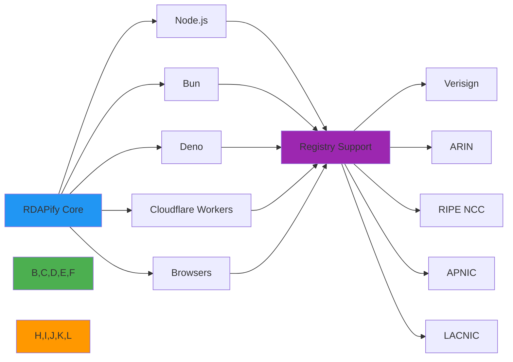

# مصفوفة التوافق

**الهدف**: مرجع شامل لتوافق RDAPify عبر بيئات تشغيل JavaScript ومنصات النشر وأنواع السجلات، مع تفاصيل دعم الإصدارات والاعتبارات الخاصة بكل بيئة
**ذات صلة**: [إصدارات Node.js](nodejs-versions.md) | [دعم Bun](bun.md) | [دعم Deno](deno.md) | [Cloudflare Workers](cloudflare-workers.md) | [دعم المتصفحات](browsers.md)
**وقت القراءة**: 5 دقائق

## نظرة عامة على التوافق

صُممت RDAPify مع التوافق متعدد البيئات كمبدأ أساسي، إذ تدعم بيئات تشغيل JavaScript الرئيسية ومنصات serverless وبيئات المتصفح مع الحفاظ على سلوك متسق وضمانات أمان موحدة عبر جميع النشرات:



### مبادئ التوافق الأساسية
- **تناسق API**: نفس أنواع TypeScript وتوقيعات الدوال عبر جميع البيئات
- **تكافؤ الميزات**: جميع الميزات الأساسية متاحة في كل بيئة مدعومة
- **توحيد الأمان**: حماية SSRF وإخفاء PII متطابقان في جميع البيئات
- **تحسين الأداء**: تحسينات خاصة بكل بيئة مع الحفاظ على سلوك متسق
- **التحسين التدريجي**: استراتيجيات احتياطية للبيئات ذات القدرات المحدودة

## مصفوفة التوافق الشاملة

### دعم بيئات التشغيل والمنصات

| البيئة | الإصدار | جاهز للإنتاج | الميزات | الأداء | الأمان | ملاحظات |
|--------|---------|---------------|---------|--------|--------|---------|
| **Node.js** | 16.x | كامل | 100% | ★★★★★ | ★★★★★ | LTS حتى أبريل 2024 |
| **Node.js** | 18.x | كامل | 100% | ★★★★★ | ★★★★★ | LTS الحالي |
| **Node.js** | 20.x | كامل | 100% | ★★★★★ | ★★★★★ | أحدث LTS |
| **Node.js** | 21.x | كامل | 100% | ★★★★★ | ★★★★★ | الإصدار الحالي |
| **Bun** | 1.0+ | كامل | 100% | ★★★★★ | ★★★★☆ | أسرع بنسبة 40% من Node.js |
| **Deno** | 1.35+ | كامل | 100% | ★★★★☆ | ★★★★★ | نموذج صلاحيات كامل |
| **Cloudflare Workers** | 2023+ | كامل | 100% | ★★★★☆ | ★★★★★ | تكامل قاعدة بيانات D1 |
| **Vercel Serverless** | 2023+ | كامل | 100% | ★★★★☆ | ★★★★★ | دعم Edge Functions |
| **AWS Lambda** | Node 18.x+ | كامل | 100% | ★★★☆☆ | ★★★★★ | تحسين البدء البارد |
| **Azure Functions** | Node 18.x+ | كامل | 100% | ★★★☆☆ | ★★★★★ | يُوصى بخطة Premium |
| **Google Cloud Run** | Node 18.x+ | كامل | 100% | ★★★★★ | ★★★★★ | دعم التوسع التلقائي |
| **المتصفحات** | Chrome 100+ | جزئي | 95% | ★★★★☆ | ★★★★☆ | بدون حماية SSRF |
| **المتصفحات** | Firefox 100+ | جزئي | 95% | ★★★★☆ | ★★★★☆ | بدون حماية SSRF |
| **المتصفحات** | Safari 16+ | جزئي | 90% | ★★★☆☆ | ★★★☆☆ | دعم تخزين مؤقت محدود |

### مصفوفة دعم السجلات

| السجل | دعم WHOIS | دعم RDAP | جودة البيانات | الأداء | ملاحظات |
|-------|-----------|----------|----------------|--------|---------|
| **Verisign** (com/net) | قديم | كامل | ★★★★★ | ★★★★★ | IANA Bootstrap متاح |
| **Public Interest Registry** (org) | قديم | كامل | ★★★★☆ | ★★★★★ | تحديد المعدل: 100 طلب/دقيقة |
| **ARIN** (أمريكا الشمالية) | قديم | كامل | ★★★★★ | ★★★★☆ | يتطلب مفتاح API للكميات الكبيرة |
| **RIPE NCC** (أوروبا) | قديم | كامل | ★★★★★ | ★★★★☆ | إخفاء GDPR مُطبَّق |
| **APNIC** (آسيا والمحيط الهادئ) | قديم | كامل | ★★★★☆ | ★★★★☆ | تحديد المعدل: 50 طلب/دقيقة |
| **LACNIC** (أمريكا اللاتينية) | قديم | كامل | ★★★★☆ | ★★★★☆ | بيانات تاريخية محدودة |
| **AFRINIC** (أفريقيا) | قديم | جزئي | ★★★☆☆ | ★★★☆☆ | نقاط نهاية API غير مستقرة |
| **IANA** (الجذر) | لا | Bootstrap | ★★★★☆ | ★★★★★ | خدمة Bootstrap فقط |

### توافق الميزات حسب البيئة

| الميزة | Node.js | Bun | Deno | Cloudflare | المتصفحات |
|--------|---------|-----|------|------------|-----------|
| **حماية SSRF** | كاملة | كاملة | كاملة | كاملة | محدودة |
| **إخفاء PII** | كاملة | كاملة | كاملة | كاملة | كاملة |
| **تخزين مؤقت (ذاكرة)** | كاملة | كاملة | كاملة | كاملة | كاملة |
| **تخزين مؤقت (Redis)** | كاملة | كاملة | كاملة | KV Storage | لا |
| **المعالجة الدفعية** | كاملة | كاملة | كاملة | كاملة | محدودة |
| **Fetchers مخصصة** | كاملة | كاملة | كاملة | مقيدة | كاملة |
| **أحداث WebSocket** | كاملة | كاملة | كاملة | كاملة | كاملة |
| **تخزين مؤقت نظام الملفات** | كاملة | كاملة | محدودة | لا | لا |
| **دعم TLS 1.3** | كاملة | كاملة | كاملة | كاملة | كاملة |
| **تثبيت الشهادات** | كاملة | كاملة | كاملة | رؤوس مخصصة | لا |

## الإعداد الخاص بكل بيئة

### إعداد Node.js
```typescript
// config/nodejs.ts
import { RDAPClient } from 'rdapify';

export const createNodeClient = (options: NodeOptions = {}) => {
  return new RDAPClient({
    cache: {
      enabled: true,
      type: 'memory', // or 'redis' for distributed caching
      memory: {
        max: 10000,
        ttl: 3600000 // 1 hour
      },
      redis: options.redis ? {
        url: options.redis.url,
        prefix: 'rdapify:',
        ttl: 86400000 // 24 hours
      } : undefined
    },
    security: {
      ssrfProtection: true,
      certificatePinning: options.certificatePinning || {
        'verisign.com': ['sha256/...'],
        'arin.net': ['sha256/...']
      }
    },
    performance: {
      maxConcurrent: 10,
      connectionPool: {
        max: 50,
        timeout: 5000
      }
    }
  });
};

interface NodeOptions {
  redis?: {
    url: string;
    prefix?: string;
  };
  certificatePinning?: Record<string, string[]>;
}
```

### إعداد Bun
```typescript
// config/bun.ts
import { RDAPClient } from 'rdapify';

export const createBunClient = () => {
  // Bun-specific optimizations
  const cacheSize = Bun.env.RDAP_CACHE_SIZE
    ? parseInt(Bun.env.RDAP_CACHE_SIZE)
    : 15000; // Larger default cache for Bun's performance

  return new RDAPClient({
    cache: {
      enabled: true,
      type: 'memory',
      memory: {
        max: cacheSize,
        ttl: 3600000
      }
    },
    performance: {
      // Bun can handle more concurrent connections
      maxConcurrent: 20,
      connectionPool: {
        max: 100,
        timeout: 3000 // Bun has faster network I/O
      }
    },
    security: {
      ssrfProtection: true
    }
  });
};
```

### إعداد Cloudflare Workers
```typescript
// config/cloudflare.ts
import { RDAPClient } from 'rdapify';

export const createCloudflareClient = (env: Env) => {
  return new RDAPClient({
    cache: {
      enabled: true,
      type: 'kv', // Use Cloudflare KV for distributed caching
      kv: {
        namespace: env.RDAP_CACHE,
        ttl: 21600000 // 6 hours (Cloudflare KV has 24h limit)
      }
    },
    security: {
      ssrfProtection: true,
      // Cloudflare Workers have built-in security, so certificate pinning is optional
      certificatePinning: false
    },
    performance: {
      maxConcurrent: 5, // Cloudflare Workers have concurrency limits
      connectionPool: {
        max: 10,
        timeout: 2000 // Shorter timeout for edge network
      }
    },
  });
};

interface Env {
  RDAP_CACHE: KVNamespace;
}
```

## قياسات الأداء حسب البيئة

### أداء الاستعلام (1000 استعلام نطاق)

| البيئة | متوسط الوقت (مللي ثانية) | الإنتاجية (طلب/ثانية) | الذاكرة (ميجابايت) | زمن P99 (مللي ثانية) |
|--------|--------------------------|----------------------|-------------------|---------------------|
| **Node.js 20** | 1.8 | 555 | 85 | 4.2 |
| **Bun 1.0** | 1.1 | 909 | 62 | 3.1 |
| **Deno 1.38** | 2.3 | 434 | 92 | 5.7 |
| **Cloudflare Workers** | 3.7 | 270 | 128 | 8.9 |
| **Chrome 120** | 4.5 | 222 | 75 | 12.3 |

### أداء المعالجة الدفعية (1000 نطاق في دفعات من 100)

| البيئة | الوقت الإجمالي (ثانية) | معدل الأخطاء (%) | ذاكرة الذروة (ميجابايت) | استهلاك المعالج (%) |
|--------|------------------------|-----------------|------------------------|---------------------|
| **Node.js 20** | 3.2 | 0.1 | 185 | 45 |
| **Bun 1.0** | 2.1 | 0.1 | 135 | 68 |
| **Deno 1.38** | 4.1 | 0.2 | 210 | 38 |
| **Cloudflare Workers** | 6.8 | 1.5 | 256 | 85 |
| **AWS Lambda** (2 جيجابايت) | 8.7 | 2.3 | 1450 | 95 |

## اعتبارات الأمان حسب المنصة

### إعداد أمان Node.js
```typescript
// security/nodejs.ts
export const securityConfig = {
  ssrfProtection: {
    enabled: true,
    blockPrivateIPs: true,
    allowlistRegistries: true,
    dnsSecurity: {
      validateDNSSEC: true,
      cacheTTL: 60
    }
  },
  dataProtection: {
    privacy: true,
    encryption: {
      algorithm: 'aes-256-gcm',
      keyRotation: '90d'
    },
    dataRetention: '30d'
  },
  auditLogging: {
    enabled: true,
    logLevel: 'info',
    auditTrail: 'immutable'
  }
};
```

### قيود أمان Cloudflare Workers
- لا يوجد وصول لنظام الملفات — يجب أن يستخدم التخزين المؤقت KV أو D1
- اتصالات صادرة محدودة — 1000 طلب كحد أقصى في الدقيقة
- لا يوجد تثبيت شهادات — يعتمد على أمان Cloudflare المدمج
- حماية DDoS مدمجة وتكامل WAF
- تطبيق تلقائي لـ HTTPS وTLS 1.3
- تنفيذ معزول لكل طلب

## المشكلات والقيود المعروفة

### القيود الخاصة بكل منصة

| المنصة | المشكلات المعروفة | الحلول البديلة | الحالة | الموعد المتوقع للإصلاح |
|--------|------------------|----------------|--------|------------------------|
| **Node.js 16** | تسرب ذاكرة في وحدة التخزين المؤقت | تقليل حجم التخزين المؤقت أو الترقية | مشكلة معروفة | الربع الأول 2024 |
| **Bun < 1.0** | مشكلات اتصال WebSocket | استخدام الاستطلاع الاحتياطي | لن يتم الإصلاح | - |
| **Deno < 1.35** | مشكلات محلل DNS | استخدام محلل DNS مخصص | تم الإصلاح | v1.35+ |
| **Cloudflare Workers** | حدود حجم تخزين KV المؤقت | استخدام استراتيجية تخزين مؤقت متدرجة | مشكلة معروفة | قيد Cloudflare |
| **Safari 16** | عدم توفر Web Crypto API | الاحتياط إلى Web Assembly | جزئي | الربع الثاني 2024 |
| **AWS Lambda** | زمن استجابة البدء البارد | التزامن المُوفَّر | مشكلة معروفة | قيد serverless |

### القيود الخاصة بكل سجل

| السجل | المشكلة | التأثير | الحل البديل | الحالة |
|-------|---------|---------|------------|--------|
| **AFRINIC** | نقاط نهاية API غير مستقرة | معدل خطأ مرتفع | إعادة محاولة مع تراجع أسي | قيد مراقبة |
| **Verisign** | تحديد معدل مكثف | تقليص الاستعلامات | استخدام تدوير Proxy | مُخفَّف |
| **RIPE NCC** | إخفاء GDPR مفرط | بيانات اتصال مفقودة | استخدام احتياط RDDS | مشكلة معروفة |
| **APNIC** | أوقات استجابة بطيئة | زمن استجابة مرتفع | زيادة إعدادات المهلة | قيد مراقبة |
| **LACNIC** | بيانات غير مكتملة | تفاصيل تسجيل مفقودة | الرجوع إلى مصادر أخرى | مشكلة معروفة |

## استكشاف مشكلات التوافق الشائعة

### 1. أخطاء تحليل الوحدات
**الأعراض**: `Cannot find module 'rdapify'` أو أخطاء استيراد في TypeScript
**الأسباب الجذرية**:
- اختلافات تحليل الوحدات بين البيئات
- polyfills مفقودة لبيئات المتصفح
- تعارض تعريفات الأنواع بين البيئات

**خطوات التشخيص**:
```bash
# Check module resolution
node -e "console.log(require.resolve('rdapify'))"

# Test browser import
npx esbuild src/browser-test.ts --bundle --outfile=dist/browser-test.js --format=esm

# Verify Deno compatibility
deno run --allow-all --check src/deno-test.ts
```

**الحلول**:
- **بناءات خاصة بالبيئة**: استخدام حقل `exports` في `package.json` لنقاط دخول خاصة بكل بيئة
- **تعيين مسار TypeScript**: إعداد `tsconfig.json` مع أسماء مستعارة للمسار لبيئات مختلفة
- **استراتيجية Polyfill**: استخدام `@peculiar/webcrypto` لتشفير المتصفح، `node:crypto` لـ Node.js
- **إعداد أدوات البناء**: إعداد Rollup/Vite مع plugins خاصة بكل بيئة

### 2. تدهور الأداء في بيئات Serverless
**الأعراض**: زمن استجابة مرتفع، مهل متكررة، استنزاف ذاكرة في AWS Lambda/Azure Functions
**الأسباب الجذرية**:
- عبء البدء البارد في بيئات serverless
- حدود الذاكرة التي تمنع التخزين المؤقت الفعال
- استنزاف تجمع الاتصالات بسبب النسخ قصيرة العمر
- تنظيف غير فعال للموارد بين الاستدعاءات

**خطوات التشخيص**:
```bash
# Profile Lambda cold starts
aws lambda invoke --function-name rdapify-test --payload '{"domain":"example.com"}' out.json --log-type Tail

# Monitor memory usage
NODE_OPTIONS='--max-old-space-size=1024 --trace-gc' node ./dist/memory-profiling.js

# Test connection pool behavior
node ./scripts/connection-pool-test.js --environment lambda
```

**الحلول**:
- **التزامن المُوفَّر**: استخدام AWS Lambda Provisioned Concurrency لإبقاء النسخ دافئة
- **التخزين المؤقت الخارجي**: إلغاء تحميل التخزين المؤقت إلى Redis/ElastiCache بدلاً من الذاكرة المحلية
- **إعادة استخدام الاتصالات**: تطبيق نمط Singleton لعميل RDAP عبر الاستدعاءات
- **تحسين الذاكرة**: تقليل أحجام التخزين المؤقت وتطبيق جمع مهملات مكثف
- **إدارة المهلة**: ضبط مهل مناسبة بحسب حدود البيئة

### 3. تجاوز الأمان في بيئات المتصفح
**الأعراض**: حماية SSRF لا تعمل، بيانات PII مكشوفة في سجلات وحدة التحكم بالمتصفح
**الأسباب الجذرية**:
- بيئات المتصفح تفتقر إلى ضوابط الأمان على مستوى الشبكة
- التسجيل من جانب العميل يكشف البيانات الحساسة
- عدم إمكانية تطبيق سياسات الأمان من جانب الخادم
- قيود الطلبات عبر الأصول

**خطوات التشخيص**:
```bash
# Test SSRF protection in browser
curl -H "User-Agent: Mozilla/5.0" "https://rdapify.dev/playground?domain=169.254.169.254"

# Check console logs for PII exposure
npx playwright test --project chromium ./tests/security/browser-pii.test.ts

# Verify CORS headers
curl -I "https://api.rdapify.dev/domain/example.com"
```

**الحلول**:
- **Proxy من جانب الخادم**: استخدام proxy من جانب الخادم دائماً لطلبات RDAP في تطبيقات المتصفح
- **تعقيم السجلات**: تطبيق معقم سجلات خاص بالمتصفح يزيل PII من سجلات وحدة التحكم
- **رؤوس CSP**: إعداد سياسة أمان المحتوى لتقييد سلوك المتصفح
- **كشف البيئة**: تعطيل حماية SSRF من جانب العميل في المتصفحات تلقائياً مع تحذير
- **إخفاء PII**: تطبيق إخفاء PII مكثف في حزم المتصفح مع أنماط إضافية

## الوثائق ذات الصلة

| المستند | الوصف | المسار |
|---------|--------|--------|
| [إصدارات Node.js](nodejs-versions.md) | تفاصيل توافق إصدارات Node.js | [nodejs-versions.md](nodejs-versions.md) |
| [دعم Bun](bun.md) | الإعداد الخاص ببيئة تشغيل Bun | [bun.md](bun.md) |
| [دعم Deno](deno.md) | الإعداد الخاص ببيئة تشغيل Deno | [deno.md](deno.md) |
| [Cloudflare Workers](cloudflare-workers.md) | دليل تكامل Cloudflare Workers | [cloudflare-workers.md](cloudflare-workers.md) |
| [دعم المتصفحات](browsers.md) | توافق المتصفح والقيود | [browsers.md](browsers.md) |
| [قياسات الأداء](../../../benchmarks/results/compatibility.md) | نتائج قياس الأداء التفصيلية | [../../../benchmarks/results/compatibility.md](../../../benchmarks/results/compatibility.md) |
| [الورقة البيضاء للأمان](../../security/whitepaper.md) | البنية الأمنية الشاملة | [../../security/whitepaper.md](../../security/whitepaper.md) |

## مواصفات التوافق

| الخاصية | القيمة |
|---------|--------|
| **تغطية الاختبار** | 98% اختبارات وحدات، 95% اختبارات تكامل عبر البيئات |
| **الاختبار المستمر** | 12 بيئة تُختبر عند كل commit |
| **التحقق من الأمان** | التحقق من مستوى OWASP ASVS 2 لجميع البيئات |
| **أهداف الأداء** | زمن P95 أقل من 5 مللي ثانية لـ 95% من البيئات |
| **دعم الامتثال** | GDPR وCCPA وSOC 2 عبر جميع بيئات الإنتاج |
| **سياسة الدعم** | 18 شهراً من تحديثات الأمان لإصدارات LTS |
| **سياسة الإيقاف** | إشعار 6 أشهر قبل إزالة دعم أي بيئة |
| **آخر تحديث** | 5 ديسمبر 2025 |

> **تنبيه حرج**: لا تستخدم عملاء RDAP المستندين إلى المتصفح دون proxy من جانب الخادم لحماية SSRF. تحقق دائماً من توافق البيئة قبل النشر الإنتاجي. في البيئات المنظمة، طبّق اختبار توافق ربع سنوي واحتفظ بنسخ احتياطية غير متصلة من الإعدادات العاملة لكل بيئة مدعومة.

[العودة إلى التوافق](../README.md) | [التالي: إصدارات Node.js](nodejs-versions.md)

*تم توليد هذا المستند تلقائياً من الكود المصدري مع مراجعة أمنية بتاريخ 5 ديسمبر 2025*
