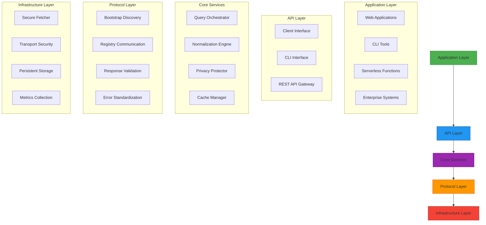
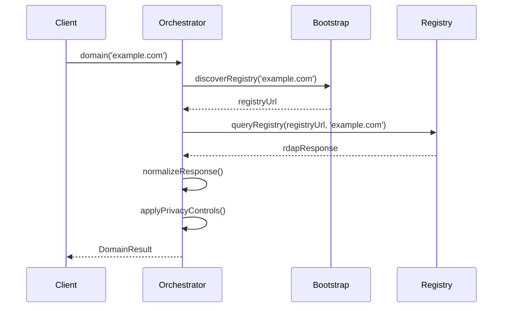
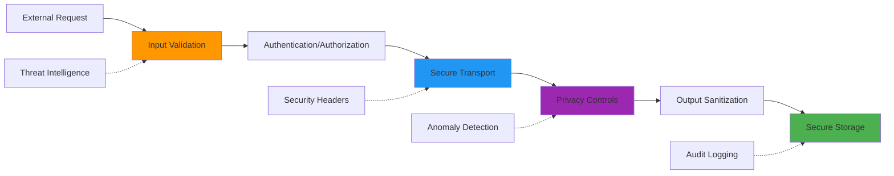
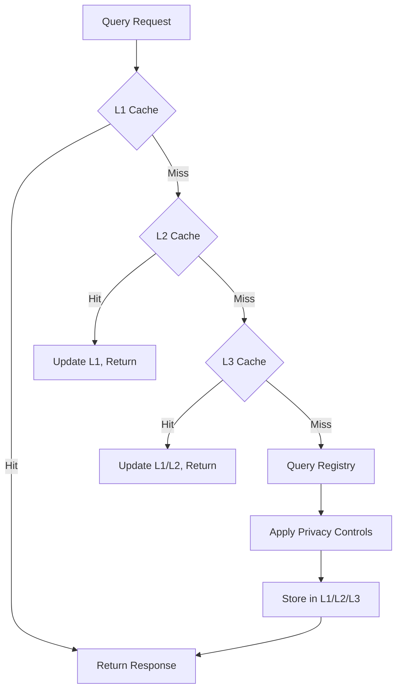
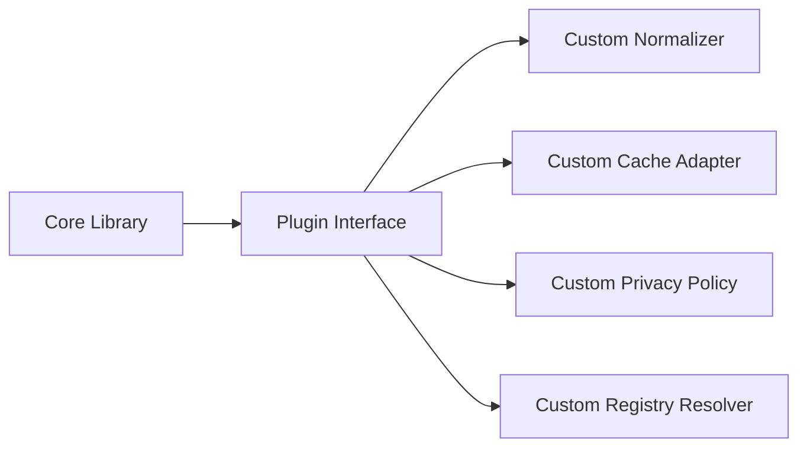
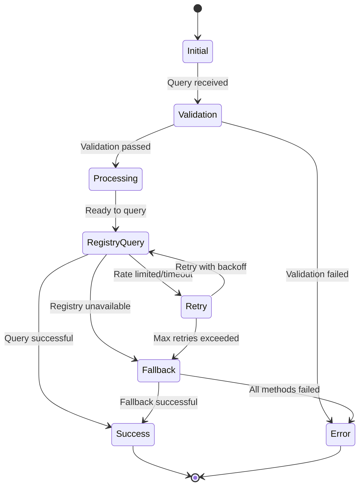

# 🏗️ نظرة عامة على معمارية RDAPify

> **🎯 الهدف:** فهم المعمارية الطبقية والمكونات الأساسية ومبادئ التصميم التي تجعل RDAPify آمنةً وعالية الأداء وحافظةً للخصوصية
> **📚 المتطلب المسبق:** فهم أساسي لـ [ما هو RDAP](./what-is-rdap.md) و[RDAP مقابل WHOIS](./rdap-vs-whois.md)
> **⏱️ وقت القراءة:** 12 دقيقة
> **🔍 نصيحة احترافية:** تتضمن هذه الوثيقة مخططات Mermaid — قم بتفعيل JavaScript في متصفحك لعرضها بشكل تفاعلي

---

## 🗺️ المعمارية على مستوى عالٍ

تتبع RDAPify **معمارية طبقية** مع فصل صارم للمسؤوليات، مما يتيح التطور المستقل للمكونات مع الحفاظ على حدود الأمان. صُممت المعمارية وفق خمسة مبادئ أساسية:

1. **الخصوصية افتراضيًا**: تُحجب البيانات الشخصية تلقائيًا ما لم يُطلب خلاف ذلك صراحةً
2. **سلامة البروتوكول**: الالتزام الصارم بمواصفات RFC الخاصة بـ RDAP
3. **الدفاع المتعمق**: طبقات أمان متعددة تحمي من الثغرات الشائعة
4. **الشبكة الصفرية الثقة**: يخضع كل تفاعل خارجي للتحقق والتعقيم
5. **التدهور اللطيف**: يظل النظام وظيفيًا في حالات الفشل الجزئية



---

## 🔧 تفصيل المكونات الأساسية

### 1. طبقة API: الواجهات الموجهة للمستخدم

توفر طبقة API نقاط وصول متعددة مصممة لحالات استخدام مختلفة:

| الواجهة | حالة الاستخدام | الميزات الرئيسية |
|---------|---------------|-----------------|
| **RDAPClient** | الاستخدام البرمجي | مجموعة ميزات كاملة، دعم TypeScript، async/await |
| **CLI** | العمليات من سطر الأوامر | الوضع التفاعلي، إكمال Tab التلقائي، المخرجات المنسقة |
| **REST Gateway** | تكامل الخدمات المصغرة | تحديد معدل الطلبات، المصادقة، التحقق من الطلبات |

**مبدأ التصميم:** تتقاطع جميع الواجهات على نفس الوظيفة الأساسية، مما يضمن سلوكًا متسقًا عبر جميع طرق الوصول.

```typescript
// Unified API surface example
const client = new RDAPClient(options);
const result = await client.domain('example.com');

// Same core functionality via CLI
rdapify domain example.com --json

// Same core functionality via REST API
GET /api/v1/domain/example.com
```

### 2. طبقة الخدمات الأساسية: منطق الأعمال

#### منسق الاستعلامات (Query Orchestrator)
ينسق دورة حياة الاستعلام الكاملة:
- اكتشاف السجل عبر IANA bootstrap
- توجيه الاستعلام إلى نقاط نهاية السجل المناسبة
- إدارة آليات الاحتياط
- التحكم في التزامن وتحديد معدل الطلبات



#### محرك التطبيع (Normalization Engine)
يحول استجابات السجلات الخاصة بكل جهة إلى نموذج بيانات موحد:
- تحويل بيانات vCard إلى كائنات JavaScript منظمة
- توحيد أسماء الحقول والتنسيقات عبر السجلات المختلفة
- حل علاقات الكيانات والتسلسل الهرمي بينها
- معالجة توحيد Unicode وتحويلات IDN

```typescript
// Before normalization (Verisign RDAP response)
{
  "entities": [{
    "vcardArray": ["vcard", [
      ["fn", {}, "text", "Example Registrar"],
      ["email", {}, "text", "abuse@example.com"]
    ]]
  }]
}

// After normalization (RDAPify standard format)
{
  "registrar": {
    "name": "Example Registrar",
    "email": "abuse@example.com",
    "roles": ["registrar"]
  }
}
```

#### حارس الخصوصية (Privacy Protector)
ينفذ معالجة البيانات المتوافقة مع GDPR/CCPA:
- حجب PII تلقائيًا وفق سياسات قابلة للتهيئة
- تقليل البيانات من خلال تصفية الحقول
- تنفيذ الحق في المحو
- نقاط تكامل إدارة الموافقة

#### مدير ذاكرة التخزين المؤقت (Cache Manager)
استراتيجية تخزين مؤقت ذكية بطبقات متعددة:
- L1: ذاكرة تخزين داخلية (نسخة التطبيق)
- L2: ذاكرة تخزين موزعة (Redis/Memcached)
- L3: تخزين دائم (قاعدة بيانات مشفرة)
- إبطال التخزين المؤقت استنادًا إلى TTL وإشعارات تغيير السجل

### 3. طبقة البروتوكول: تنفيذ RDAP

#### اكتشاف Bootstrap
تنفيذ عملية bootstrap وفق RFC 8521:
- تخزين بيانات IANA bootstrap مع التحديث التلقائي
- معالجة الفشل الانتقالي والاحتياطي للسجل
- دعم نقاط نهاية bootstrap مخصصة للسجلات الخاصة
- التحقق من شهادات السجل مقابل الجهات الموثوقة

#### التواصل مع السجل
اتصال آمن بخوادم RDAP:
- إلزام TLS 1.3+ مع خيار تثبيت الشهادة
- توقيع الطلبات للسجلات التي تشترط المصادقة
- معاملات واستجابات موحدة للاستعلامات والترويسات
- التحقق من الاستجابة مقابل مخططات JSON

#### التحقق من الاستجابة
يضمن تكامل البيانات والأمان:
- التحقق من مخطط JSON وفق مواصفات RFC
- حماية SSRF عبر التحقق من URL وحجب نطاقات IP
- اكتشاف المحتوى الضار في حقول الاستجابة
- حدود الحجم للحماية من هجمات الحرمان من الخدمة

### 4. طبقة البنية التحتية: الخدمات الأساسية

#### المُجلب الآمن (Secure Fetcher)
عميل HTTP محسّن بحمايات أمنية:
- يحجب نطاقات IP الخاصة (RFC 1918، NAT على مستوى المشغل)
- يمنع محاولات الوصول إلى الشبكة الداخلية
- يفرض متطلبات أمان TLS
- ينفذ قواطع دائرية للنقاط الفاشلة

```typescript
// Secure Fetcher protection example
const fetcher = new SecureFetcher({
  blockPrivateIPs: true,
  blockCloudMetadata: true,
});

// This request would be blocked
fetcher.get('http://169.254.169.254/latest/meta-data'); // SSRF attempt blocked
```

#### أمان النقل
حمايات أمنية شاملة من طرف إلى طرف:
- تثبيت الشهادات لنقاط نهاية السجل الحيوية
- تطبيق HSTS على جميع اتصالات HTTPS
- دعم Perfect Forward Secrecy (PFS)
- تدوير تلقائي للشهادات ومراقبتها

#### التخزين الدائم
خيارات آمنة لاستمرارية البيانات:
- تشفير AES-256-GCM للبيانات المخزنة مؤقتًا
- تشفير على مستوى الحقول للمعلومات الحساسة
- انتهاء صلاحية البيانات تلقائيًا بناءً على سياسات الاستبقاء
- سجلات التدقيق لجميع عمليات الوصول إلى البيانات

---

## 🔐 معمارية الأمان

تنفذ RDAPify نموذج أمان **الدفاع المتعمق** مع طبقات حماية متعددة:



### أنماط الأمان الرئيسية

#### 1. الشبكة الصفرية الثقة
- تُعامَل جميع نقاط نهاية السجل كجهات غير موثوقة
- كل استجابة تخضع للتحقق مقابل تعريفات المخطط
- يمنع تصفية عناوين IP الوصول إلى الشبكة الداخلية
- يتجاوز التحقق من الشهادات الفحوصات القياسية لـ TLS

#### 2. الخصوصية بالتصميم
- يجري حجب PII في أبكر مرحلة ممكنة
- يقلص تقليل البيانات من سطح الهجوم
- يقيّد تحديد الغرض سياقات استخدام البيانات
- يفرض تقييد التخزين الحذف التلقائي للبيانات

#### 3. الإعدادات الافتراضية الآمنة
```javascript
// Security-focused default configuration
const client = new RDAPClient({
  // Privacy protections enabled by default
  privacy: true,

  // Security settings

  // Network protections
  fetcher: new SecureFetcher({
    blockPrivateIPs: true,
    timeout: 10000
  }),

  // Caching with protection
  cache: {
    redactBeforeStore: true,
    maxAge: 3600 // 1 hour
  }
});
```

#### 4. الوقاية من SSRF
تنفذ RDAPify حماية شاملة من هجمات Server-Side Request Forgery:
- التحقق من عنوان IP مقابل النطاقات المسموح بها
- الحماية من إعادة ربط DNS عبر تخزين IP مؤقتًا
- إلزام البروتوكول (HTTP/HTTPS فقط)
- التحقق من بنية URL
- خيار وضع قائمة بيضاء لنقاط نهاية السجل

```typescript
// SSRF protection workflow
function validateUrl(url: string): boolean {
  try {
    const parsed = new URL(url);

    // Block non-HTTP protocols
    if (!['http:', 'https:'].includes(parsed.protocol)) return false;

    // Resolve and validate IP address
    const ip = dns.lookup(parsed.hostname);
    if (isPrivateIP(ip)) return false;

    // Block cloud metadata endpoints
    if (isCloudMetadataEndpoint(parsed.hostname)) return false;

    return true;
  } catch (error) {
    return false;
  }
}
```

---

## ⚡ معمارية الأداء

### استراتيجية التخزين المؤقت
تنفذ RDAPify استراتيجية تخزين مؤقت متعددة المستويات لتحسين الأداء وتقليل الحمل على السجل:

| مستوى التخزين المؤقت | التقنية | TTL | حالة الاستخدام | معدل الإصابة المستهدف |
|---------------------|---------|-----|----------------|----------------------|
| L1: الذاكرة | LRU Cache | 5-60 دقيقة | نسخة واحدة | 60-70% |
| L2: Redis | Redis Cluster | 1-24 ساعة | موزّع | 85-90% |
| L3: قاعدة البيانات | SQL مشفّر | 24-72 ساعة | دائم | 95%+ |
| التخزين السلبي | ذاكرة/Redis | 5-30 دقيقة | الاستعلامات الفاشلة | 50% |



### إدارة الموارد
- تجميع الاتصالات لطلبات HTTP
- وعي بضغط الذاكرة مع تحجيم التخزين المؤقت التكيفي
- تحديد أولويات الطلبات الحيوية مقابل الاستعلامات الخلفية
- آليات الضغط العكسي للحماية من الإفراط في التحميل

### معمارية وضع الاتصال المنقطع

> **ميزة مخططة** — لا يتوفر وضع الاتصال المنقطع المخصص بعد في الإصدار v0.1.8.

من أجل المرونة، تخدم ذاكرة التخزين المؤقت المضمنة في RDAPify الاستجابات أثناء انقطاع السجل المؤقت. قم بتهيئة TTL أطول لتوسيع نطاق التغطية:

```typescript
const client = new RDAPClient({
  cache: { strategy: 'memory', ttl: 86400 }, // keep responses for 24 hours
});

const result = await client.domain('example.com');
```

---

## 🧩 معمارية قابلية التوسع

صُممت RDAPify للتوسع دون الحاجة إلى التفرع:

### نظام الإضافات (Plugin System)


### نمط المحول (Adapter Pattern)
كل تبعية خارجية معزولة خلف واجهة محول:

```typescript
interface CacheAdapter {
  get(key: string): Promise<any | null>;
  set(key: string, value: any, ttl?: number): Promise<void>;
  delete(key: string): Promise<boolean>;
  clear(): Promise<void>;
}

// Redis implementation
class RedisAdapter implements CacheAdapter {
  constructor(options: RedisOptions) { /* ... */ }
  // Implementation details
}

// Memory implementation
class MemoryAdapter implements CacheAdapter {
  // Simpler implementation for development
}
```

### خط أنابيب الوسيط (Middleware Pipeline)
تستخدم معالجة الطلبات/الاستجابات نمط الوسيط:

```typescript
client.use(async (ctx, next) => {
  console.log(`Starting query for ${ctx.domain}`);
  await next();
  console.log(`Completed query in ${Date.now() - ctx.startTime}ms`);
});

client.use(privacyMiddleware({
  redactionPolicy: 'gdpr-compliant'
}));
```

---

## ⚠️ معمارية معالجة الأخطاء

تنفذ RDAPify آلة حالة لمعالجة الأخطاء:



### نظام تصنيف الأخطاء
تُصنَّف الأخطاء للمعالجة الملائمة:

| الفئة | الأمثلة | استراتيجية المعالجة |
|------|---------|-------------------|
| **أخطاء العميل** | فشل التحقق، نطاقات غير صالحة | فشل فوري، لا إعادة محاولة |
| **الأخطاء العابرة** | مهل الانتظار، تحديد المعدل | تراجع أسي، إعادة محاولة |
| **أخطاء السجل** | الخدمة غير متاحة، استجابات غير صالحة | احتياط إلى سجل بديل |
| **أخطاء الأمان** | محاولات SSRF، فشل الشهادة | فشل فوري، تسجيل تدقيق |
| **أخطاء البيانات** | فشل التحقق من المخطط | عزل، إشعار للمطورين |

### كائنات الأخطاء الموحدة
تتبع جميع الأخطاء بنية متسقة:
```typescript
class RDAPError extends Error {
  constructor(
    public code: string,          // Standardized error code
    public message: string,       // Human-readable message
    public details?: any,         // Additional context
    public registryUrl?: string   // Source registry if relevant
  ) {
    super(message);
    this.name = 'RDAPError';
  }
}

// Example usage
throw new RDAPError(
  'RDAP_RATE_LIMITED',
  'Registry rate limit exceeded',
  {
    retryAfter: 60,
    limit: 100,
    remaining: 0
  },
  'https://rdap.verisign.com'
);
```

---

## 📊 معمارية المراقبة والرصد

توفر RDAPify رصدًا شاملًا من خلال:

### جمع المقاييس
- معدلات نجاح/فشل الاستعلامات
- نسب إصابة/إخفاق التخزين المؤقت
- نسب التأخر (P50, P90, P99)
- توزيعات أخطاء السجل
- استخدام الموارد (الذاكرة، الاتصالات)

### استراتيجية التسجيل
تسجيل متعدد المستويات مع معلومات سياقية:
```typescript
logger.debug('Bootstrap lookup', {
  domain: 'example.com',
  registryType: 'gtld',
  cacheHit: false
});

logger.error('Registry query failed', {
  domain: 'example.com',
  registry: 'https://rdap.verisign.com',
  errorCode: 'RDAP_TIMEOUT',
  durationMs: 15000
});
```

### دعم التتبع
تكامل التتبع الموزع:
- تتبع متوافق مع OpenTelemetry
- معرّفات ارتباط شاملة للطلبات
- تحديد الاختناقات في الأداء
- تكامل مع Datadog وNew Relic وPrometheus

---

## 🔄 معمارية التحديث والصيانة

صُممت RDAPify للصيانة المستدامة على المدى الطويل:

### تحديثات بيانات Bootstrap
- مزامنة تلقائية لبيانات IANA bootstrap
- بيانات bootstrap ذات إصدارات مع إمكانية التراجع
- التحقق من التوقيع لسلامة bootstrap
- الاحتياط إلى آخر بيانات bootstrap معروفة بأنها جيدة

### إدارة التبعيات
- عملية تحديث تبعيات تركّز على الأمان
- فحص الثغرات في خط CI
- إصدارات دلالية مع ضمانات التوافق
- عزل التبعيات من خلال أنماط المحول

### تطور الإعدادات
- تغييرات إعدادات متوافقة مع الإصدارات السابقة
- تحذيرات الإهمال مع مسارات الترحيل
- إعادة تحميل الإعدادات في وقت التشغيل
- إعدادات افتراضية مدركة للبيئة

---

## 🔮 التطور المعماري المستقبلي

### التحسينات المخططة
- **نواة WebAssembly**: تحسين المسار ذي الأداء الحيوي
- **التخزين المؤقت الموزع**: مشاركة التخزين المؤقت بين النسخ نظير إلى نظير
- **اكتشاف الشذوذ بالتعلم الآلي**: تحديد أنماط التسجيل غير المعتادة
- **التحقق بسلسلة الكتل**: مسارات تدقيق ثابتة للنطاقات الحيوية
- **إثباتات عدم الكشف**: التحقق من ملكية النطاق دون الكشف عن PII

### مقايضات معمارية
| القرار | المقايضة | المبرر |
|--------|---------|--------|
| **لا وكيل مركزي** | تعقيد جانب العميل أعلى | الحفاظ على الخصوصية، عدم جمع البيانات |
| **متطلبات TLS صارمة** | توافق أقل مع السجلات القديمة | نهج الأمان أولًا |
| **حجب PII تلقائيًا** | ثراء أقل في البيانات | الامتثال للوائح العالمية |
| **التخزين المؤقت في الذاكرة افتراضيًا** | فقدان البيانات عند إعادة التشغيل | الأمان عبر تخزين البيانات العابر |
| **لا تحليلات افتراضيًا** | رؤى استخدام محدودة | إعدادات افتراضية مراعية للخصوصية |

---

## 📚 الوثائق ذات الصلة

| الوثيقة | الوصف | المسار |
|--------|------|-------|
| **خط أنابيب التطبيع** | استعراض معمق لتحويل البيانات | [./normalization.md](./normalization.md) |
| **اكتشاف Bootstrap** | آليات اكتشاف السجل | [./discovery.md](./discovery.md) |
| **آلة حالة الأخطاء** | تفاصيل تدفق معالجة الأخطاء | [./error-state-machine.md](./error-state-machine.md) |
| **استراتيجيات التخزين المؤقت** | إعدادات متقدمة للتخزين المؤقت | [../guides/caching-strategies.md](../guides/caching-strategies.md) |
| **الورقة البيضاء للأمان** | المعمارية الأمنية الكاملة | [../security/whitepaper.md](../security/whitepaper.md) |

---

## 🏗️ سجلات قرارات المعمارية (ADRs)

توثَّق القرارات المعمارية الرئيسية في [سجلات قرارات المعمارية](../../architecture/decision-records.md) مع المبررات والبدائل المدروسة:

1. [ADR-001: المعمارية الطبقية](../../architecture/decision-records/001-layered-architecture.md)
2. [ADR-002: الخصوصية افتراضيًا](../../architecture/decision-records/002-privacy-by-default.md)
3. [ADR-003: استراتيجية الوقاية من SSRF](../../architecture/decision-records/003-ssrf-prevention.md)
4. [ADR-004: استراتيجية التخزين المؤقت](../../architecture/decision-records/004-caching-strategy.md)
5. [ADR-005: نهج معالجة الأخطاء](../../architecture/decision-records/005-error-handling.md)

---

> **🔐 تذكير أمني:** تضع المعمارية الأمانَ والخصوصيةَ فوق الراحة. بينما قد يتطلب ذلك إعدادًا إضافيًا لبعض حالات الاستخدام، فإنه يضمن الامتثال للوائح العالمية ويحمي البيانات الشخصية للمستخدمين النهائيين. لا تعطّل ميزات الأمان كـ `redactPII` أو حمايات SSRF دون أساس قانوني موثق وموافقة مسؤول حماية البيانات.

[← العودة إلى المفاهيم الأساسية](../core-concepts/README.md) | [التالي: عملية التطبيع →](./normalization.md)

*تاريخ آخر تحديث للوثيقة: 5 ديسمبر 2025*
*إصدار المعمارية: 2.3.0*
*تاريخ مراجعة الأمان: 28 نوفمبر 2025*
