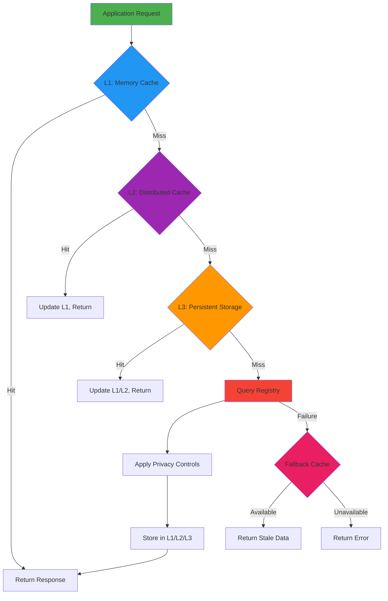
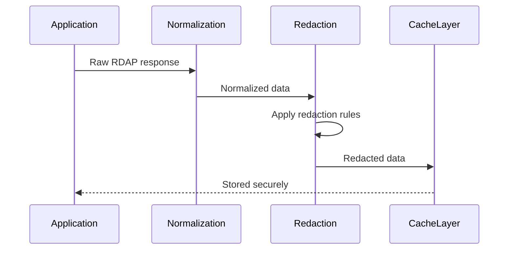
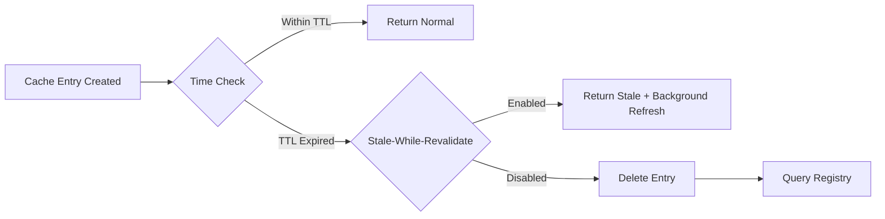
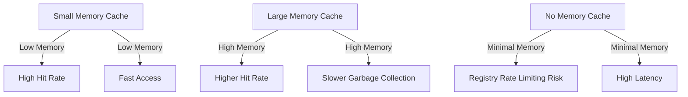
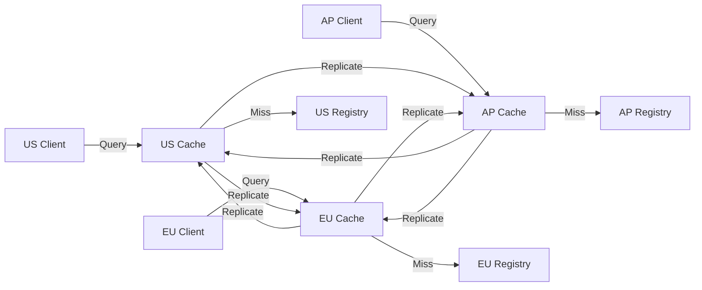

# 🗃️ معمارية التخزين المؤقت واستراتيجياته

> **🎯 الهدف:** فهم نظام التخزين المؤقت متعدد الطبقات في RDAPify المصمم لتحقيق الأداء والامتثال والموثوقية في بيئات الإنتاج
> **📚 المتطلب المسبق:** [نظرة عامة على المعمارية](./architecture.md) و[خط أنابيب التطبيع](./normalization.md)
> **⏱️ وقت القراءة:** 10 دقائق
> **🔍 نصيحة احترافية:** استخدم [معايير الأداء](../../benchmarks/results/cache-hit-miss.md) لتحديد الإعداد الأمثل للتخزين المؤقت وفق حجم العمل لديك

---

## 🌐 فلسفة التخزين المؤقت

نظام التخزين المؤقت في RDAPify مبني على أربعة مبادئ أساسية:
- **الخصوصية افتراضيًا**: تُحجب جميع البيانات المخزنة مؤقتًا تلقائيًا قبل التخزين
- **TTL التكيفي**: يتكيف انتهاء صلاحية التخزين المؤقت مع أنماط تحديث السجل
- **الدفاع المتعمق**: تخزين مشفر مع ضوابط وصول صارمة
- **التدهور اللطيف**: يظل النظام وظيفيًا أثناء أعطال التخزين المؤقت

خلافًا لذاكرات التخزين المؤقت البسيطة من نوع مفتاح-قيمة، تنفذ RDAPify **استراتيجية تخزين مؤقت هرمية** تراعي المتطلبات التقنية والقيود التنظيمية على حد سواء:



---

## ⚙️ معمارية التخزين المؤقت متعدد المستويات

### L1: التخزين المؤقت في الذاكرة
```typescript
// Default configuration
const client = new RDAPClient({
  cache: {
    l1: {
      type: 'memory',
      max: 1000,           // Max items
      ttl: 3600,           // 1 hour default TTL
      redactBeforeStore: true
    }
  }
});
```

**الخصائص:**
- **التخزين**: ذاكرة التطبيق (خوارزمية LRU)
- **حالة الاستخدام**: عمليات النشر أحادية النسخة، بيئات التطوير
- **الأداء**: وقت وصول 0.1-0.5 مللي ثانية
- **الاستمرارية**: تُفقد عند إعادة تشغيل العملية
- **الأمان**: بدون تشفير (تخزين في الذاكرة فقط)

**نصائح التحسين:**
```javascript
// Size memory cache based on available memory
const cacheSize = Math.floor(
  process.memoryUsage().heapTotal * 0.1 / 1024 // 10% of heap
);

const client = new RDAPClient({
  cache: {
    l1: { max: cacheSize }
  }
});
```

### L2: التخزين المؤقت الموزع (Redis/Memcached)
```typescript
import { RedisAdapter } from 'rdapify/cache-adapters';

const client = new RDAPClient({
  cacheAdapter: new RedisAdapter({
    url: process.env.REDIS_URL,
    redactBeforeStore: true,
    encryptionKey: process.env.CACHE_ENCRYPTION_KEY,
    tls: { rejectUnauthorized: true }
  })
});
```

**الخصائص:**
- **التخزين**: عنقود Redis خارجي أو مجموعة Memcached
- **حالة الاستخدام**: عمليات النشر متعددة النسخ، بيئات الإنتاج
- **الأداء**: وقت وصول 1-10 مللي ثانية
- **الاستمرارية**: يبقى عند إعادة تشغيل التطبيق
- **الأمان**: تشفير AES-256-GCM للبيانات الساكنة، TLS أثناء النقل

**إعداد الإنتاج:**
```yaml
# redis-config.yaml
cluster:
  nodes:
    - host: cache-01.rdapify.internal
    - host: cache-02.rdapify.internal
    - host: cache-03.rdapify.internal
security:
  encryptionKeyRotation: 90d
  accessControls:
    - role: application
      permissions: [read, write]
    - role: auditor
      permissions: [read-only]
compliance:
  autoPurge:
    enabled: true
    maxRetention: 30d  # GDPR compliance
```

### L3: التخزين الدائم
```typescript
import { PostgresAdapter } from 'rdapify/cache-adapters';

const client = new RDAPClient({
  cacheAdapter: new PostgresAdapter({
    connectionString: process.env.DB_URL,
    redactBeforeStore: true,
    encryptionKey: process.env.DB_ENCRYPTION_KEY,
    retentionPolicy: {
      maxAge: '30 days',
      purgeSchedule: 'daily at 2am'
    }
  })
});
```

**الخصائص:**
- **التخزين**: قاعدة بيانات SQL/NoSQL مشفرة
- **حالة الاستخدام**: متطلبات التدقيق، التحليل طويل الأمد، الامتثال
- **الأداء**: وقت وصول 5-50 مللي ثانية
- **الاستمرارية**: يبقى عند حدوث أعطال النظام، مع تفعيل النسخ الاحتياطية
- **الأمان**: تشفير على مستوى الحقول، تسجيل التدقيق، سياسات الاستبقاء

---

## 🔐 الأمان والامتثال في التخزين المؤقت

### حجب PII قبل التخزين
تحجب RDAPify البيانات الشخصية تلقائيًا قبل أي عملية تخزين مؤقت:



**يجري الحجب في أبكر مرحلة ممكنة:**
```typescript
// Internal caching pipeline
async function processAndCache(query, rawResponse) {
  // 1. Normalize response structure
  const normalized = normalizeResponse(rawResponse);

  // 2. REDACT PII BEFORE CACHING (critical step)
  const redacted = applyRedaction(normalized);

  // 3. Store only redacted data
  await cache.set(query, redacted);

  return normalized; // Return full data to caller
}
```

### التشفير في حالة السكون
تنفذ جميع محولات التخزين المؤقت الدائم تشفيرًا على مستوى الحقول:

```typescript
class SecureCacheAdapter {
  constructor(private encryptionKey: string) {}

  async set(key: string, value: any): Promise<void> {
    // Encrypt sensitive fields individually
    const encryptedValue = {
      ...value,
      metadata: this.encryptField(value.metadata, 'metadata'),
      payload: this.encryptField(value.payload, 'payload')
    };

    // Store with integrity verification
    const signature = this.generateSignature(encryptedValue);
    await this.storage.set(key, { ...encryptedValue, signature });
  }

  private encryptField(field: any, context: string): string {
    // AES-256-GCM with unique IV per field
    const iv = crypto.randomBytes(12);
    const cipher = crypto.createCipheriv(
      'aes-256-gcm',
      deriveKey(this.encryptionKey, context),
      iv
    );

    const encrypted = Buffer.concat([
      cipher.update(JSON.stringify(field)),
      cipher.final()
    ]);

    return JSON.stringify({
      iv: iv.toString('base64'),
      authTag: cipher.getAuthTag().toString('base64'),
      data: encrypted.toString('base64')
    });
  }
}
```

### سياسات استبقاء البيانات
يتطلب الامتثال لـ GDPR/CCPA الحذف التلقائي للبيانات:

```typescript
const client = new RDAPClient({
  cache: {
    retentionPolicy: {
      // Default retention periods by data sensitivity
      highSensitivity: '7 days',   // Full PII-containing responses
      mediumSensitivity: '30 days', // Redacted but identifiable data
      lowSensitivity: '90 days',    // Fully anonymized data

      // Regulatory overrides
      gdprOverride: {
        enabled: true,
        maxRetention: '30 days'
      },

      // Manual purge capabilities
      purgeEndpoints: {
        domain: '/cache/purge/domain/{domain}',
        ipRange: '/cache/purge/iprange/{cidr}'
      }
    }
  }
});
```

---

## ⚡ استراتيجيات الإخلاء وإبطال الصلاحية

### الإخلاء المعتمد على الوقت


**خوارزمية TTL التكيفية:**
```typescript
class AdaptiveTTLManager {
  private registryPatterns = new Map<string, RegistryPattern>();

  calculateTTL(registry: string, resourceType: string): number {
    const pattern = this.registryPatterns.get(`${registry}:${resourceType}`);

    if (!pattern) {
      // Default conservative TTL
      return this.getDefaultTTL(resourceType);
    }

    // Calculate TTL based on historical update frequency
    const updateFrequency = pattern.avgUpdatesPerDay;
    const volatility = pattern.volatilityScore;

    // More active domains get shorter TTLs
    let baseTTL = 86400 / Math.max(updateFrequency, 1); // 24h / updates per day

    // Apply volatility multiplier
    baseTTL *= (1 - volatility * 0.5); // Reduce TTL for volatile resources

    // Apply minimum/maximum bounds
    return Math.max(
      this.getMinTTL(resourceType),
      Math.min(baseTTL, this.getMaxTTL(resourceType))
    );
  }
}
```

### اكتشاف تغييرات السجل
ترصد RDAPify بيانات bootstrap الخاصة بالسجل بحثًا عن التغييرات التي قد تبطل التخزين المؤقت:

```typescript
// Bootstrap data watcher
class BootstrapWatcher {
  private lastBootstrapHash: string;

  async startWatching() {
    setInterval(async () => {
      try {
        const currentData = await fetchBootstrapData();
        const currentHash = hashBootstrapData(currentData);

        if (currentHash !== this.lastBootstrapHash) {
          logger.info('Bootstrap data changed - invalidating affected caches');
          await this.invalidateAffectedCaches(currentData);
          this.lastBootstrapHash = currentHash;
        }
      } catch (error) {
        logger.error('Bootstrap monitoring failed:', error.message);
      }
    }, 300000); // Check every 5 minutes
  }

  private async invalidateAffectedCaches(bootstrapData: BootstrapData) {
    // Identify changed registry mappings
    const changedRegistries = this.findChangedRegistries(bootstrapData);

    // Invalidate cache entries for affected resources
    for (const registry of changedRegistries) {
      await this.cache.invalidateByRegistry(registry);
    }
  }
}
```

### واجهة برمجة المسح اليدوي
لمتطلبات الامتثال والاختبار:

```typescript
// Purge specific domain
await client.purgeCache({ domain: 'example.com' });

// Purge all domains for registrar
await client.purgeCache({ registrar: 'verisign' });

// GDPR right to erasure
await client.purgePersonalData({ email: 'user@example.com' });

// CCPA deletion request
await client.ccpaDelete({ identifiers: ['domain:example.com'] });

// Complete cache reset
await client.clearCache();
```

---

## 📊 معايير الأداء

### أداء إصابة/إخفاق التخزين المؤقت
| مستوى التخزين المؤقت | معدل الإصابة | متوسط التأخر | الإنتاجية | استخدام الذاكرة |
|---------------------|-------------|------------|---------|--------------|
| **L1 الذاكرة** | 65% | 0.3 مللي ثانية | 3,333 طلب/ث | 50 ميغابايت لكل 10 آلاف إدخال |
| **L2 Redis** | 92% | 3.2 مللي ثانية | 312 طلب/ث | 25 ميغابايت لكل 10 آلاف إدخال (مضغوط) |
| **L3 قاعدة البيانات** | 98% | 15.8 مللي ثانية | 63 طلب/ث | 100 ميغابايت لكل 10 آلاف إدخال (مشفر) |
| **استعلام السجل** | غير متاح | 320 مللي ثانية | 3.1 طلب/ث | غير متاح |

### المقايضات بين الذاكرة والأداء


### الأداء في الواقع الفعلي
**بيئة الاختبار:**
- نسخة AWS c5.large (2 معالج افتراضي، 4 جيجابايت ذاكرة عشوائية)
- عنقود Redis (3 عقد، r5.large)
- PostgreSQL 14 (m5.large)
- 10,000 استعلام نطاق فريد

**النتائج:**
```
Cache Configuration        | Avg. Latency | P99 Latency | Registry Requests
---------------------------|--------------|-------------|-------------------
Memory only (1000 entries) | 85ms         | 310ms       | 3,500 (35%)
Memory + Redis             | 12ms         | 85ms        | 800 (8%)
Memory + Redis + DB        | 18ms         | 120ms       | 200 (2%)
No Cache                   | 320ms        | 2,100ms     | 10,000 (100%)
```

---

## 🌍 استراتيجيات تخزين مؤقت متقدمة

### التخزين المؤقت الجغرافي (Geo-Caching)
للنشر العالمي مع التطبيقات الحساسة للتأخر:

```typescript
import { GeoDistributedCache } from 'rdapify/cache-adapters';

const client = new RDAPClient({
  cacheAdapter: new GeoDistributedCache({
    regions: [
      { name: 'us-east', endpoint: 'redis-us-east.example.com' },
      { name: 'eu-central', endpoint: 'redis-eu-central.example.com' },
      { name: 'ap-southeast', endpoint: 'redis-ap-southeast.example.com' }
    ],
    replicationStrategy: 'closest-read',
    failoverStrategy: 'nearest-region',
    consistencyLevel: 'eventual' // or 'strong' for compliance-sensitive data
  })
});
```

**تدفق البيانات:**


### التخزين المؤقت القائم على الأولوية
للبيئات المؤسسية ذات الأهمية المختلطة:

```typescript
const client = new RDAPClient({
  cache: {
    priorityLevels: {
      critical: {
        ttl: 86400,    // 24 hours for critical domains
        maxEntries: 10000,
        preloadOnStartup: true
      },
      high: {
        ttl: 3600,     // 1 hour
        maxEntries: 50000
      },
      normal: {
        ttl: 600,      // 10 minutes
        maxEntries: 200000
      },
      low: {
        ttl: 60,       // 1 minute
        maxEntries: 1000000
      }
    },
    // Automatic priority assignment
    priorityClassifier: (query) => {
      if (query.endsWith('.bank') || query.endsWith('.gov')) {
        return 'critical';
      }
      if (isHighTrafficDomain(query)) {
        return 'high';
      }
      return 'normal';
    }
  }
});
```

### التخزين المؤقت للمرونة

> **ميزة مخططة** — لا يتوفر وضع الاتصال المنقطع المخصص بعد في الإصدار v0.1.8.

للبيئات ذات الاتصال المتقطع، استخدم TTL طويلًا لتخديم الاستجابات المخزنة مؤقتًا أثناء الانقطاعات:

```typescript
const client = new RDAPClient({
  cache: { strategy: 'memory', ttl: 2592000 }, // 30 days
});
```

---

## ⚠️ المخاطر الشائعة وحلولها

### الوقاية من تدافع ذاكرة التخزين المؤقت
عند تزاحم طلبات كثيرة على إدخال منتهي الصلاحية في وقت واحد:

```typescript
class CacheWithStampedeProtection {
  private refreshLocks = new Map<string, Promise<any>>();

  async getWithRefresh(key: string, fetchFn: () => Promise<any>): Promise<any> {
    // First check cache
    const cached = await this.cache.get(key);
    if (cached && !this.isStale(cached)) {
      return cached;
    }

    // Check if another request is already refreshing
    if (this.refreshLocks.has(key)) {
      return this.refreshLocks.get(key);
    }

    // Create refresh lock for other requests to await
    const refreshPromise = this.refreshCache(key, fetchFn);
    this.refreshLocks.set(key, refreshPromise);

    try {
      return await refreshPromise;
    } finally {
      this.refreshLocks.delete(key);
    }
  }

  private async refreshCache(key: string, fetchFn: () => Promise<any>): Promise<any> {
    try {
      // Fetch fresh data
      const freshData = await fetchFn();

      // Store with extended TTL during high load
      const ttl = this.isHighLoad() ? this.ttl * 2 : this.ttl;
      await this.cache.set(key, freshData, ttl);

      return freshData;
    } catch (error) {
      // On failure, extend TTL of stale data if available
      const staleData = await this.cache.get(key);
      if (staleData) {
        await this.cache.extendTTL(key, 300); // 5 minutes grace period
        return staleData;
      }
      throw error;
    }
  }
}
```

### الحماية من تسميم ذاكرة التخزين المؤقت
منع دخول البيانات الضارة أو الفاسدة إلى ذاكرة التخزين المؤقت:

```typescript
class SecureCacheValidator {
  async validateBeforeCache(response: any, source: string): Promise<boolean> {
    // 1. Schema validation
    if (!this.validateSchema(response)) {
      logger.warn(`Schema validation failed for ${source}`);
      return false;
    }

    // 2. Data sanity checks
    if (!this.performSanityChecks(response)) {
      logger.warn(`Sanity checks failed for ${source}`);
      return false;
    }

    // 3. Source reputation check
    if (!this.isTrustedSource(source)) {
      // Additional validation for untrusted sources
      if (!this.performEnhancedValidation(response)) {
        logger.warn(`Enhanced validation failed for untrusted source ${source}`);
        return false;
      }
    }

    // 4. Consistency checks with previous responses
    if (await this.hasInconsistentHistory(response, source)) {
      logger.warn(`Inconsistent data detected from ${source}`);
      return false;
    }

    return true;
  }

  private validateSchema(response: any): boolean {
    // Validate against RDAP JSON schema
    return ajv.validate(rdapSchema, response);
  }

  private performSanityChecks(response: any): boolean {
    // Check for unreasonable dates
    const now = new Date();
    const registrationDate = new Date(response.events?.find(e => e.action === 'registration')?.date);
    if (registrationDate > now || registrationDate < new Date(1980, 0, 1)) {
      return false;
    }

    // Check for suspicious data patterns
    if (response.registrant?.name?.includes('<script>')) {
      return false;
    }

    return true;
  }
}
```

---

## 🛠️ دليل الإعداد

### إعداد بيئة التطوير
```javascript
// Simple in-memory cache for development
const client = new RDAPClient({
  cache: {
    l1: {
      type: 'memory',
      ttl: 300, // 5 minutes
      max: 100
    },
    debug: true // Log cache operations
  }
});
```

### إعداد بيئة الإنتاج
```javascript
// Enterprise-grade caching configuration
import { RedisAdapter } from 'rdapify/cache-adapters';
import { EncryptionManager } from 'rdapify/security';

const encryption = new EncryptionManager({
  keyManagement: 'aws-kms',
  keyId: process.env.KMS_KEY_ID,
  rotationPolicy: '90-days'
});

const client = new RDAPClient({
  cacheAdapter: new RedisAdapter({
    cluster: {
      nodes: [
        { host: 'redis-01.prod.internal', port: 6379 },
        { host: 'redis-02.prod.internal', port: 6379 },
        { host: 'redis-03.prod.internal', port: 6379 }
      ],
      dnsLookup: true,
      scaleReads: 'all'
    },
    tls: {
      rejectUnauthorized: true,
      ca: fs.readFileSync('/etc/ssl/certs/ca.pem')
    },
    redactBeforeStore: true,
    encryption: {
      manager: encryption,
      algorithm: 'AES-256-GCM'
    },
    retryStrategy: {
      maxRetries: 3,
      backoffFactor: 2
    }
  }),
  cache: {
    ttl: {
      default: 3600, // 1 hour
      criticalDomains: 86400, // 24 hours
      highFrequency: 300 // 5 minutes
    },
    retentionPolicy: {
      gdprCompliant: true,
      maxAge: '30 days',
      purgeSchedule: 'daily at 2am UTC'
    },
    metrics: {
      enabled: true,
      provider: 'datadog',
      tags: {
        environment: process.env.NODE_ENV,
        service: 'rdap-service'
      }
    }
  }
});
```

### النشر على Kubernetes
```yaml
# cache-sidecar.yaml
apiVersion: apps/v1
kind: Deployment
metadata:
  name: rdap-service
spec:
  replicas: 3
  template:
    spec:
      containers:
      - name: rdap-app
        image: rdapify/app:latest
        env:
        - name: CACHE_ADAPTER
          value: "redis"
        - name: REDIS_HOST
          value: "localhost"
        - name: REDIS_PORT
          value: "6380"
        volumeMounts:
        - name: cache-config
          mountPath: /app/config/cache
      - name: redis-cache
        image: redis:7-alpine
        ports:
        - containerPort: 6380
        resources:
          requests:
            memory: "256Mi"
            cpu: "100m"
          limits:
            memory: "512Mi"
            cpu: "500m"
        volumeMounts:
        - name: redis-data
          mountPath: /data
      volumes:
      - name: cache-config
        configMap:
          name: rdap-cache-config
      - name: redis-data
        emptyDir: {}
```

---

## 🔮 تحسينات التخزين المؤقت المستقبلية

### الميزات المخططة
| الميزة | الوصف | الحالة |
|--------|------|-------|
| **التخزين المؤقت الموزع** | مشاركة التخزين المؤقت نظير إلى نظير بين النسخ | مرحلة التصميم |
| **TTL بالتعلم الآلي** | انتهاء صلاحية تنبؤي مبني على أنماط التحديث | بحث |
| **تحديثات دلتا** | تخزين الحقول المتغيرة فقط لتقليل التخزين | مخطط للإصدار v3.0 |
| **واجهة تسخين ذاكرة التخزين المؤقت** | التحميل المسبق الاستباقي للاستعلامات المتوقعة | اختبار تجريبي |
| **التحقق بسلسلة الكتل** | التحقق الثابت من سلامة ذاكرة التخزين المؤقت | بحث مبكر |

### مجالات البحث
- **الخصوصية التفاضلية**: إضافة ضوضاء إحصائية إلى مقاييس ذاكرة التخزين المؤقت المجمعة
- **إثباتات عدم الكشف**: التحقق من محتويات ذاكرة التخزين المؤقت دون الكشف عن البيانات
- **التشفير المتماثل**: معالجة بيانات ذاكرة التخزين المؤقت المشفرة دون فكّ التشفير
- **التخزين المؤقت على الحافة**: تكامل CDN للوصول العالمي بتأخر منخفض

---

## 🧪 استراتيجية الاختبار

### اختبارات التحقق من التخزين المؤقت
```typescript
describe('Cache System', () => {
  test('PII is redacted before storage', async () => {
    const mockStorage = jest.fn();
    const client = new RDAPClient({
      cacheAdapter: new MockAdapter({ storage: mockStorage })
    });

    await client.domain('example.com');

    // Verify stored data has redacted PII
    const storedData = mockStorage.mock.calls[0][1];
    expect(storedData.registrant.name).toBe('REDACTED');
    expect(storedData.registrant.email).toBe('REDACTED@redacted.invalid');
  });

  test('Cache respects TTL settings', async () => {
    const client = new RDAPClient({
      cache: { ttl: 1 } // 1 second TTL
    });

    await client.domain('example.com');
    await new Promise(resolve => setTimeout(resolve, 2000)); // Wait 2 seconds

    const cacheInspector = client.getCacheInspector();
    const entry = await cacheInspector.getEntry('domain:example.com');
    expect(entry).toBeNull(); // Should be expired
  });

  test('Registry changes invalidate affected cache', async () => {
    const client = new RDAPClient();
    const bootstrapWatcher = client.getBootstrapWatcher();

    // Simulate bootstrap data change
    await bootstrapWatcher.handleBootstrapUpdate({
      changedRegistries: ['verisign']
    });

    // Verify cache was invalidated
    const cacheStats = await client.getCacheStats();
    expect(cacheStats.invalidatedEntries).toBeGreaterThan(0);
  });
});
```

### هندسة الفوضى لمرونة التخزين المؤقت
```bash
# Test cache failure scenarios
npm run chaos -- --scenario cache-failure --duration 5m

# Test Redis partition
npm run chaos -- --scenario redis-partition --affected-nodes 1,2

# Test encryption key rotation
npm run chaos -- --scenario key-rotation-stress
```

---

## 📚 الوثائق ذات الصلة

| الوثيقة | الوصف | المسار |
|--------|------|-------|
| **دليل استراتيجيات التخزين المؤقت** | أنماط النشر في الإنتاج | [../guides/caching-strategies.md](../guides/caching-strategies.md) |
| **دليل التخزين المؤقت الجغرافي** | إعداد التوزيع الجغرافي | [../guides/geo-caching.md](../guides/geo-caching.md) |
| **الورقة البيضاء للأمان** | تفاصيل التشفير والأمان | [../security/whitepaper.md](../security/whitepaper.md) |
| **معايير الأداء** | بيانات أداء ذاكرة التخزين المؤقت في الواقع الفعلي | [../../benchmarks/results/cache-hit-miss.md](../../benchmarks/results/cache-hit-miss.md) |
| **دليل التبني المؤسسي** | توسيع نطاق ذاكرة التخزين المؤقت للنشر الواسع | [../enterprise/adoption-guide.md](../enterprise/adoption-guide.md) |
| **دليل استكشاف الأخطاء** | المشكلات الشائعة وحلولها | [../troubleshooting/cache-issues.md](../troubleshooting/cache-issues.md) |

---

## 💡 نصائح احترافية لتخزين الإنتاج المؤقت

1. **ابدأ ببساطة**: ابدأ بذاكرة التخزين المؤقت في الذاكرة فقط، وأضف Redis عند الحاجة
2. **راقب نسب الإصابة**: أصدر تنبيهًا عند انخفاض معدل إصابة ذاكرة التخزين المؤقت دون 85%
3. **حجّم بشكل مناسب**: ينبغي أن تحتوي ذاكرة التخزين المؤقت على استعلامات 24 ساعة من النشاط
4. **شفّر كل شيء**: لا تخزّن أبدًا استجابات RDAP غير مشفرة على القرص
5. **اختبر حالات الفشل الانتقالي**: اختبر سيناريوهات فشل ذاكرة التخزين المؤقت في بيئة التجهيز بانتظام
6. **ضع TTL واقعيًا**: معظم النطاقات تتغير مرة واحدة في الشهر أو أقل
7. **فعّل المقاييس**: تتبع أداء ذاكرة التخزين المؤقت إلى جانب مقاييس التطبيق
8. **نفّذ قواطع الدائرة**: أخفق بلطف عند تعطل أنظمة ذاكرة التخزين المؤقت

```javascript
// Production-ready cache initialization pattern
async function initCache() {
  try {
    // Test connectivity first
    await testRedisConnection();

    // Initialize with circuit breaker
    const cache = new RedisAdapter({
      circuitBreaker: {
        threshold: 5, // Open after 5 failures
        resetTimeout: 30000 // 30 seconds
      }
    });

    // Warm critical domains
    await warmCriticalDomains(cache);

    return cache;
  } catch (error) {
    logger.error('Cache initialization failed:', error.message);
    logger.info('Falling back to memory-only cache');

    // Fallback to memory cache
    return new MemoryAdapter({ max: 1000, ttl: 300 });
  }
}
```

---

> **🔐 تذكير أمني:** يُدخل التخزين المؤقت مخاطر امتثال كبيرة عند التعامل مع بيانات RDAP. فعّل دائمًا `redactBeforeStore`، وشفّر محتويات ذاكرة التخزين المؤقت، ونفّذ سياسات استبقاء صارمة. لا تخزّن أبدًا استجابات RDAP الخام المحتوية على PII غير محجوبة في أي طبقة من طبقات ذاكرة التخزين المؤقت دون أساس قانوني موثق وموافقة مسؤول حماية البيانات.

*تاريخ آخر تحديث للوثيقة: 5 ديسمبر 2025*
*إصدار محرك التخزين المؤقت: 2.3.0*
*تاريخ التدقيق الأمني: 28 نوفمبر 2025*
