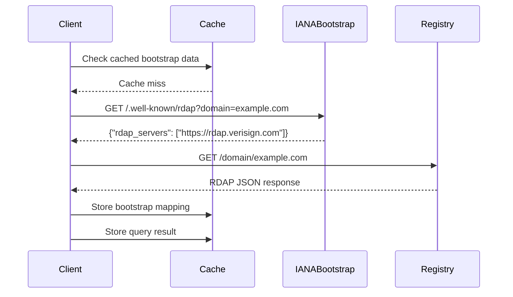
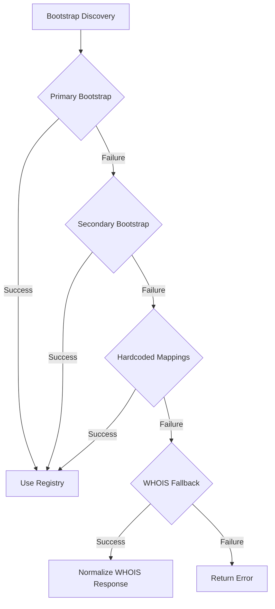

# 🔍 آلية اكتشاف Bootstrap

> **🎯 الهدف:** فهم كيفية اكتشاف RDAPify لخوادم RDAP الموثوقة للنطاقات وعناوين IP والأنظمة المستقلة
> **📚 المتطلب المسبق:** [ما هو RDAP](./what-is-rdap.md) و[نظرة عامة على المعمارية](./architecture.md)
> **⏱️ وقت القراءة:** 8 دقائق

---

## 🌐 تحدي اكتشاف Bootstrap

يواجه عملاء RDAP تحديًا جوهريًا: **كيفية إيجاد خادم السجل الصحيح** لمورد معين (نطاق، أو IP، أو ASN). خلافًا لـ WHOIS التي غالبًا ما تعتمد على تعيينات خوادم مُرمَّزة مسبقًا، يوظّف RDAP **آلية اكتشاف bootstrap ديناميكية** محددة في [RFC 7484](https://tools.ietf.org/html/rfc7484).

التحدي ليس بسيطًا، إذ يستلزم مراعاة ما يلي:
- ✅ **النطاق العالمي:** ملايين النطاقات عبر مئات السجلات
- ✅ **التعيينات الديناميكية:** تتغير مهام السجل بمرور الوقت
- ✅ **أنواع موارد متعددة:** خدمات bootstrap مختلفة للنطاقات وعناوين IP وأرقام ASN
- ✅ **تنوع السجلات:** كل سجل ينفذ RDAP بتباينات خاصة به
- ✅ **متطلبات الأمان:** الحماية من إعادة توجيه السجل الضارة

---

## 📋 عملية اكتشاف Bootstrap

تتبع عملية اكتشاف RDAP bootstrap تدفقًا موحدًا:



### شرح تفصيلي خطوة بخطوة

1. **بدء الاستعلام**
   - يتلقى العميل استعلامًا عن `example.com`
   - يحدد نوع المورد (اسم النطاق)

2. **التحقق من ذاكرة تخزين Bootstrap المؤقتة**
   - يفحص الذاكرة المؤقتة المحلية بحثًا عن بيانات bootstrap موجودة لـ `.com` TLD
   - يؤدي غياب البيانات إلى تشغيل عملية اكتشاف bootstrap

3. **استعلام IANA Bootstrap**
   - يُنشئ عنوان URL: `https://data.iana.org/rdap/dns.json`
   - يُحلل بيانات bootstrap للعثور على السجل المختص بنطاقات `.com`
   - يُحدد Verisign بوصفها السجل الموثوق

4. **استعلام السجل**
   - يُنشئ عنوان URL خاصًا بالسجل: `https://rdap.verisign.com/com/domain/example.com`
   - يُنفذ الاستعلام مع الترويسات والمصادقة الملائمة

5. **معالجة النتائج**
   - يُطبّع استجابة السجل
   - يُطبّق ضوابط الخصوصية
   - يُخزّن النتائج مؤقتًا بـ TTL مناسب

---

## ⚙️ تفاصيل التنفيذ التقني

### بنية بيانات Bootstrap

تحتفظ IANA بثلاثة مجموعات بيانات bootstrap رئيسية:

| نوع المورد | عنوان URL لـ Bootstrap | التنسيق | تكرار التحديث |
|-----------|----------------------|--------|--------------|
| **أسماء النطاقات** | `https://data.iana.org/rdap/dns.json` | JSON | أسبوعيًا |
| **عناوين IP** | `https://data.iana.org/rdap/ip.json` | JSON | أسبوعيًا |
| **أرقام AS** | `https://data.iana.org/rdap/asn.json` | JSON | أسبوعيًا |

**مثال على بيانات Bootstrap للنطاقات:**
```json
{
  "description": "RDAP Bootstrap Service for Domain Names",
  "publication": "2023-11-28T00:00:00Z",
  "services": [
    [
      ["com", "net", "edu", "org"],
      ["https://rdap.verisign.com"]
    ],
    [
      ["uk", "co.uk", "org.uk"],
      ["https://rdap.nominet.uk"]
    ],
    [
      ["de"],
      ["https://rdap.denic.de"]
    ]
  ]
}
```

### خوارزمية الاكتشاف في RDAPify

```typescript
async function discoverRegistry(resource: string, type: 'domain' | 'ip' | 'asn'): Promise<string> {
  // 1. Determine resource category
  const category = getResourceCategory(resource, type);

  // 2. Check cache first
  const cached = await bootstrapCache.get(category);
  if (cached && !isStale(cached)) {
    return cached.registryUrl;
  }

  // 3. Fetch bootstrap data
  const bootstrapData = await fetchBootstrapData(type);

  // 4. Find matching registry
  const registryInfo = findRegistryForCategory(bootstrapData, category);
  if (!registryInfo) {
    throw new RDAPError('REGISTRY_NOT_FOUND', `No registry found for ${category}`);
  }

  // 5. Cache result with appropriate TTL
  await bootstrapCache.set(category, registryInfo, {
    ttl: registryInfo.cacheTTL || DEFAULT_BOOTSTRAP_TTL
  });

  return registryInfo.registryUrl;
}
```

### منطق اختيار السجل

تستخدم RDAPify نهجًا متعدد الطبقات لاختيار السجل:

1. **التعيين القائم على TLD** للنطاقات
   - `.com`/`.net` → Verisign
   - `.org` → Public Interest Registry
   - `.uk` → Nominet

2. **التعيين القائم على CIDR** لعناوين IP
   - `192.0.0.0/24` → ARIN
   - `2001:67c::/32` → RIPE NCC

3. **تعيين نطاق ASN** للأنظمة المستقلة
   - `AS1-AS9999` → ARIN
   - `AS10000-AS19999` → RIPE NCC

4. **آليات الاحتياط** عند تعطل السجل الأساسي
   - نقاط نهاية السجل الثانوية
   - احتياط WHOIS مع التطبيع

---

## 🔐 اعتبارات الأمان

اكتشاف Bootstrap هو حد أمني بالغ الأهمية يستلزم حماية خاصة:

### نموذج التهديد
| التهديد | التأثير | التخفيف |
|--------|---------|--------|
| **بيانات bootstrap ضارة** | إعادة التوجيه إلى سجل يتحكم فيه المهاجم | التحقق من التوقيع |
| **تسميم ذاكرة التخزين المؤقت** | إعادة توجيه دائمة إلى خوادم ضارة | عزل ذاكرة التخزين المؤقت والتحقق منها |
| **انتحال DNS** | اختراق سجل رجل في المنتصف | تثبيت شهادة TLS |
| **انتحال هوية السجل** | استجابات RDAP مزيفة بمحتوى ضار | التحقق من الشهادات |
| **استغلال SSRF** | الوصول إلى الشبكة الداخلية عبر عناوين URL للسجل | التحقق من URL وحجب IP |

### تنفيذ الأمان

```typescript
class SecureBootstrapDiscoverer {
  constructor(private readonly options: {
    enableSignatureValidation: boolean;
    trustedCertificateAuthorities: string[];
    allowedIPRanges: string[];
    cacheIsolation: boolean;
  }) {}

  async discover(resource: string, type: ResourceType): Promise<RegistryInfo> {
    // 1. Validate resource format
    if (!this.isValidResourceFormat(resource, type)) {
      throw new ValidationError('Invalid resource format');
    }

    // 2. Fetch bootstrap data with signature validation
    const bootstrapData = await this.fetchWithValidation(
      this.getBootstrapURL(type)
    );

    // 3. Validate registry URLs before use
    const registryURL = this.findRegistryURL(bootstrapData, resource);
    if (!this.isValidRegistryURL(registryURL)) {
      throw new SecurityError('Invalid registry URL');
    }

    // 4. Additional security checks for high-risk domains
    if (this.isHighRiskDomain(resource)) {
      return this.verifyWithSecondarySource(registryURL);
    }

    return registryURL;
  }

  private isValidRegistryURL(url: string): boolean {
    try {
      const parsed = new URL(url);

      // Block non-HTTPS protocols
      if (parsed.protocol !== 'https:') return false;

      // Block private IP ranges
      const ip = dns.lookup(parsed.hostname);
      if (isPrivateIP(ip)) return false;

      // Block cloud metadata endpoints
      if (isCloudMetadataEndpoint(parsed.hostname)) return false;

      return true;
    } catch (error) {
      return false;
    }
  }
}
```

### تثبيت الشهادات للسجلات الحيوية

للبيئات عالية الأمان، تدعم RDAPify تثبيت الشهادات:

```javascript
const client = new RDAPClient({
  bootstrapOptions: {
    certificatePins: {
      'rdap.verisign.com': 'sha256/AAAAAAAAAAAAAAAAAAAAAAAAAAAAAAAAAAAAAAAAAAA=',
      'rdap.arin.net': 'sha256/BBBBBBBBBBBBBBBBBBBBBBBBBBBBBBBBBBBBBBBBBBB=',
      'rdap.ripe.net': 'sha256/CCCCCCCCCCCCCCCCCCCCCCCCCCCCCCCCCCCCCCCCCCC='
    },
    pinValidationMode: 'strict' // or 'report-only'
  }
});
```

---

## ⚡ تحسين الأداء

يمكن أن يشكّل اكتشاف Bootstrap عنق زجاجة في الأداء إذا لم يُحسَّن بشكل صحيح:

### استراتيجية التخزين المؤقت

| مستوى التخزين المؤقت | TTL | معدل الإصابة المستهدف | نوع التخزين |
|---------------------|-----|----------------------|-----------|
| **L1: الذاكرة** | ساعة واحدة | 95% | ذاكرة LRU داخلية |
| **L2: دائم** | 24 ساعة | 99% | Redis مشفر |
| **L3: احتياطي** | 7 أيام | 99.9% | نظام الملفات مع التحقق من التوقيع |

**مُشغّلات إبطال صلاحية التخزين المؤقت:**
- تغيير تاريخ نشر بيانات bootstrap
- تغييرات عنوان URL للسجل في بيانات bootstrap
- أعطال اتصال السجل (تقليل TTL التكيفي)
- أوامر مسح يدوي لذاكرة التخزين المؤقت

### أنماط التحميل المسبق

تنفذ RDAPify التحميل المسبق الذكي لتقليل تأخر الاكتشاف:

```typescript
// Prefetch bootstrap data for common TLDs at startup
async function prefetchCommonRegistries() {
  const commonTLDs = ['com', 'net', 'org', 'io', 'dev', 'app'];
  await Promise.all(commonTLDs.map(tld =>
    discoverRegistry(tld, 'domain').catch(e =>
      console.warn(`Prefetch failed for ${tld}:`, e.message)
    )
  ));
}

// Background refresh of expiring bootstrap data
function setupBootstrapRefresh() {
  setInterval(async () => {
    const expiringCategories = await bootstrapCache.getExpiringItems(300); // 5 minutes
    await Promise.all(expiringCategories.map(category =>
      discoverRegistry(category, getResourceType(category)).catch(() => {})
    ));
  }, 60000); // Check every minute
}
```

### معايير الأداء

| السيناريو | متوسط وقت الاكتشاف | وقت P95 | الإنتاجية |
|----------|-------------------|--------|---------|
| **البدء البارد** | 320 مللي ثانية | 450 مللي ثانية | 2.2 عملية/ث |
| **إصابة ذاكرة L1** | 0.8 مللي ثانية | 2.1 مللي ثانية | 1250 عملية/ث |
| **إصابة ذاكرة L2** | 3.2 مللي ثانية | 8.7 مللي ثانية | 312 عملية/ث |
| **الاحتياط التكيفي** | 185 مللي ثانية | 290 مللي ثانية | 3.8 عملية/ث |

---

## 🚨 معالجة الأخطاء والاحتياطات

موثوقية الشبكة أمر بالغ الأهمية لاكتشاف bootstrap. تنفذ RDAPify معالجة شاملة للأخطاء:

### تصنيف الأخطاء

| نوع الخطأ | الأمثلة | استراتيجية المعالجة |
|----------|---------|-------------------|
| **أخطاء الشبكة** | فشل DNS، مهلة الاتصال | إعادة محاولة بتراجع أسي |
| **أخطاء السجل** | استجابات 5xx، بيانات bootstrap غير صالحة | احتياط إلى مصادر ثانوية |
| **أخطاء التحقق** | توقيعات غير صالحة، فشل الشهادة | فشل مغلق مع تسجيل تدقيق |
| **أخطاء البيانات** | تعيينات سجل مفقودة، JSON مشوه | احتياط إلى تعيينات مُرمَّزة |
| **أخطاء الأمان** | محاولات SSRF، فشل تثبيت الشهادة | فشل فوري مع تنبيه |

### التسلسل الهرمي للاحتياط

تنفذ RDAPify استراتيجية احتياط متعددة المستويات:



**تنفيذ الاحتياط:**
```typescript
async function robustDiscovery(resource: string, type: ResourceType): Promise<RegistryInfo> {
  const strategies = [
    { name: 'primary', method: () => fetchPrimaryBootstrap(type) },
    { name: 'secondary', method: () => fetchSecondaryBootstrap(type) },
    { name: 'hardcoded', method: () => getHardcodedMappings(type) },
    { name: 'whois', method: () => getWhoisFallback(type) }
  ];

  for (const strategy of strategies) {
    try {
      const result = await strategy.method();
      if (isValidRegistryInfo(result, resource)) {
        return result;
      }
    } catch (error) {
      logger.warn(`Strategy ${strategy.name} failed:`, error.message);
      if (error instanceof SecurityError) {
        // Security errors skip remaining fallbacks
        throw error;
      }
    }
  }

  throw new RDAPError('DISCOVERY_FAILED', 'All discovery strategies failed');
}
```

### معالجة الأعطال التكيفية

تتعلم RDAPify من الأعطال لتحسين الاكتشافات المستقبلية:

```typescript
class AdaptiveDiscoveryEngine {
  private failureHistory = new Map<string, { count: number; lastFailure: Date }>();

  async discover(resource: string): Promise<RegistryInfo> {
    const category = getResourceCategory(resource);
    const failureCount = this.getFailureCount(category);

    // Gradually reduce TTL for failing categories
    const baseTTL = this.getBaseTTL(category);
    const adaptiveTTL = failureCount > 0 ?
      Math.max(baseTTL / (failureCount + 1), MIN_TTL) :
      baseTTL;

    try {
      const result = await this.basicDiscovery(resource);
      // Reset failure counter on success
      this.resetFailureCount(category);
      return result;
    } catch (error) {
      this.recordFailure(category);

      // For repeated failures, try alternative strategies sooner
      if (failureCount >= 3) {
        return this.fastFallbackDiscovery(resource);
      }

      throw error;
    }
  }
}
```

---

## 🌍 اعتبارات عالمية

يجب أن يأخذ اكتشاف Bootstrap في الحسبان حقائق البنية التحتية للإنترنت العالمي:

### التباينات الإقليمية

| المنطقة | التحدي | الحل في RDAPify |
|--------|-------|----------------|
| **الصين** | قيود جدار الحماية على bootstrap IANA | نسخ بيانات bootstrap باستخدام مصادر معتمدة محليًا |
| **روسيا** | متطلبات سجل النطاقات الوطنية | تعيينات bootstrap مخصصة لنطاقات .ru |
| **الاتحاد الأوروبي** | قيود GDPR على نقل البيانات | مرايا bootstrap أوروبية مع SCCs |
| **الشرق الأوسط** | سجلات الإنترنت الإقليمية | تعيينات bootstrap إضافية للـ TLD الإقليمية |

### تكامل CDN

للنشر العالمي، تدعم RDAPify بيانات bootstrap مدعومة بـ CDN:

```typescript
const client = new RDAPClient({
  bootstrapOptions: {
    cdnEndpoints: [
      'https://bootstrap.rdapify-cdn.net/dns.json',
      'https://bootstrap.rdapify-cdn.eu/dns.json',
      'https://bootstrap.rdapify-cdn.apac/dns.json'
    ],
    failoverStrategy: 'geographic'
  }
});
```

### دعم وضع عدم الاتصال

للبيئات المعزولة أو المنفصلة، توفر RDAPify بيانات bootstrap غير متصلة:

```bash
# Update offline bootstrap data
rdapify bootstrap update --offline

# Verify bootstrap data signatures
rdapify bootstrap verify --offline
```

```typescript
const client = new RDAPClient({
  offlineMode: {
    enabled: true,
    bootstrapPath: '/var/lib/rdapify/bootstrap',
    maxStaleAge: 604800 // 7 days
  }
});
```

---

## 🔭 الميزات المتقدمة

### تحديثات Bootstrap في الوقت الفعلي

يمكن لـ RDAPify الاشتراك في تغييرات بيانات bootstrap:

```typescript
const client = new RDAPClient();

// Subscribe to bootstrap updates
client.bootstrap.on('update', (event) => {
  console.log(`Bootstrap data updated for ${event.resourceType}`);
  console.log(`Changed categories: ${event.changedCategories.join(', ')}`);

  // Clear affected cache entries
  event.changedCategories.forEach(category => {
    client.cache.clearBootstrap(category);
  });
});

// Enable real-time updates via WebSocket
client.bootstrap.enableRealtimeUpdates({
  endpoint: 'wss://bootstrap.rdapify.dev/updates',
  reconnectInterval: 5000
});
```

### مصادر Bootstrap مخصصة

يمكن للمؤسسات توفير مصادر بيانات bootstrap خاصة بها:

```typescript
const client = new RDAPClient({
  bootstrapOptions: {
    customSources: [
      {
        name: 'enterprise-policy',
        url: 'https://internal.bootstrap.company.com/rdap.json',
        priority: 1,
        validation: {
          signatureKey: process.env.BOOTSTRAP_SIGNATURE_KEY,
          requiredCategories: ['com', 'net', 'org']
        }
      },
      {
        name: 'compliance-override',
        url: 'https://compliance.bootstrap.company.com/rdap.json',
        priority: 2,
        // This source only overrides specific categories
        categoryFilter: ['bank', 'insurance', 'gov']
      }
    ],
    failoverStrategy: 'priority'
  }
});
```

### التحميل المسبق التنبؤي

تحميل مسبق مدعوم بالتعلم الآلي للبيئات عالية الأداء:

```typescript
// Enable predictive prefetching
const client = new RDAPClient({
  discovery: {
    enablePredictivePrefetching: true,
    predictionModel: 'usage-patterns', // or 'temporal', 'geographic'
    maxPrefetchConcurrent: 10
  }
});

// Train model with historical usage patterns
client.discovery.trainModel({
  historicalQueries: [
    { domain: 'example.com', timestamp: '2023-11-28T14:30:00Z' },
    { domain: 'google.com', timestamp: '2023-11-28T14:31:15Z' },
    // ... more historical data
  ]
});
```

---

## 🧪 الاختبار والتحقق

تتضمن RDAPify اختبارًا شاملًا لاكتشاف bootstrap:

### متجهات الاختبار

تتضمن مجموعة الاختبارات متجهات اختبار لاكتشاف bootstrap:

```json
[
  {
    "description": "Standard .com domain discovery",
    "input": {
      "resource": "example.com",
      "type": "domain"
    },
    "expectedOutput": {
      "registryUrl": "https://rdap.verisign.com",
      "bootstrapSource": "iana",
      "ttl": 3600
    }
  },
  {
    "description": "ARIN IP range discovery",
    "input": {
      "resource": "8.8.8.8",
      "type": "ip"
    },
    "expectedOutput": {
      "registryUrl": "https://rdap.arin.net",
      "bootstrapSource": "iana",
      "ttl": 3600
    }
  }
]
```

### اختبار الفوضى

تُجري RDAPify هندسة الفوضى على آليات الاكتشاف:

```bash
# Simulate network partitions
npm run test:chaos -- --scenario network-partition

# Simulate bootstrap service failure
npm run test:chaos -- --scenario bootstrap-failure

# Simulate registry certificate rotation
npm run test:chaos -- --scenario certificate-rotation
```

### التحقق الأمني

التحقق الأمني المستمر من بيانات bootstrap:

```bash
# Validate bootstrap signatures
npm run security:bootstrap-validate

# Check for certificate expiration
npm run security:cert-check -- --days 30

# Validate URL allowlists
npm run security:url-validate
```

---

## 📚 الوثائق ذات الصلة

| الوثيقة | الوصف | المسار |
|--------|------|-------|
| **نظرة عامة على المعمارية** | سياق تصميم النظام | [./architecture.md](./architecture.md) |
| **خط أنابيب التطبيع** | كيفية معالجة استجابات السجل | [./normalization.md](./normalization.md) |
| **الورقة البيضاء للأمان** | المعمارية الأمنية الكاملة | [../security/whitepaper.md](../security/whitepaper.md) |
| **آلة حالة الأخطاء** | تفاصيل تدفق معالجة الأخطاء | [./error-state-machine.md](./error-state-machine.md) |
| **استراتيجيات التخزين المؤقت** | إعدادات متقدمة للتخزين المؤقت | [../guides/caching-strategies.md](../guides/caching-strategies.md) |

### موارد خارجية
- [RFC 7484: Finding the Authoritative RDAP Server](https://tools.ietf.org/html/rfc7484)
- [IANA RDAP Bootstrap Service](https://www.iana.org/assignments/rdap-dns/rdap-dns.xhtml)
- [ICANN RDAP Requirements](https://www.icann.org/resources/pages/rdap-requirements-2017-05-13-en)
- [RDAP Security Services (RFC 7481)](https://tools.ietf.org/html/rfc7481)

---

> **🔐 تذكير أمني:** اكتشاف Bootstrap هو حد أمني بالغ الأهمية. فعّل دائمًا التحقق من توقيع بيانات bootstrap وتثبيت الشهادات لنقاط نهاية السجل. لا تعطّل أبدًا الفحوصات الأمنية لاعتبارات الأداء دون تقييم مخاطر شامل وموافقة مسؤول حماية البيانات.

[← العودة إلى المفاهيم الأساسية](../core-concepts/README.md) | [التالي: آلة حالة الأخطاء →](./error-state-machine.md)

*تاريخ آخر تحديث للوثيقة: 5 ديسمبر 2025*
*إصدار محرك الاكتشاف: 2.3.0*
*تاريخ التحقق من بيانات Bootstrap: 28 نوفمبر 2025*
