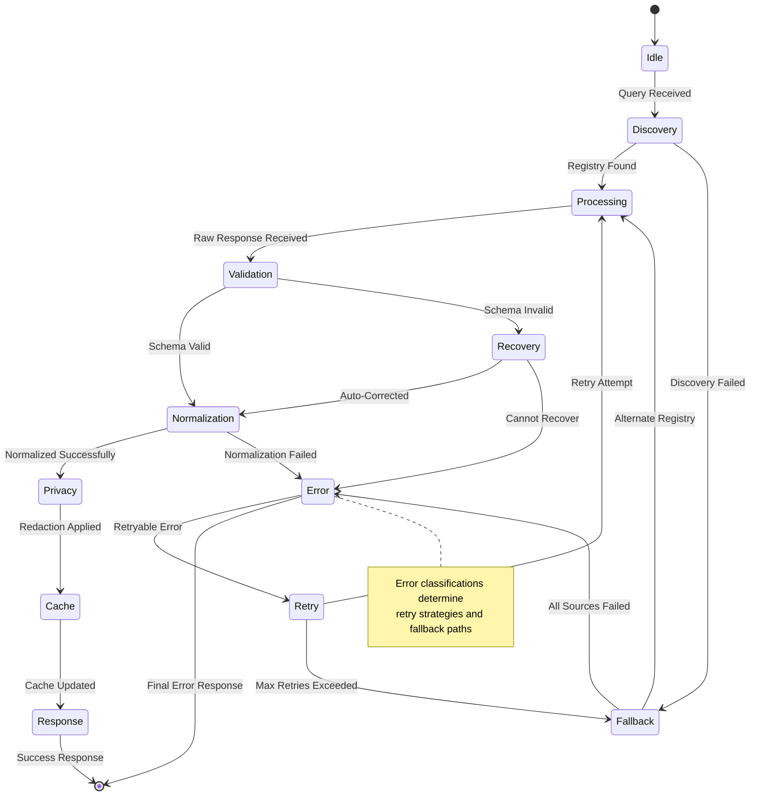
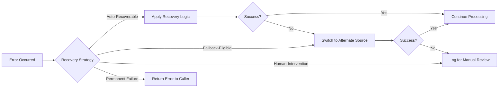
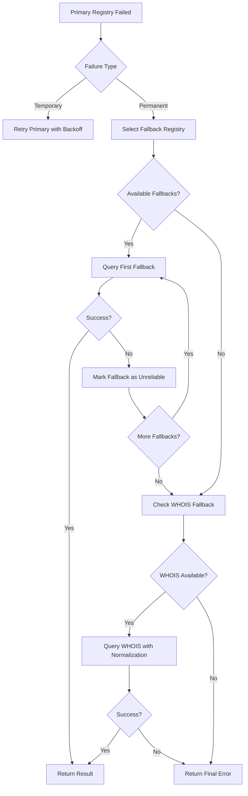
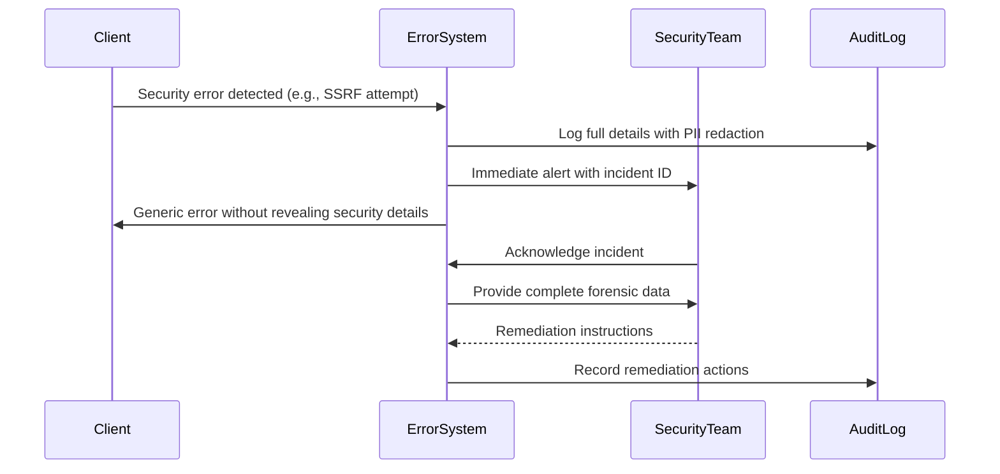
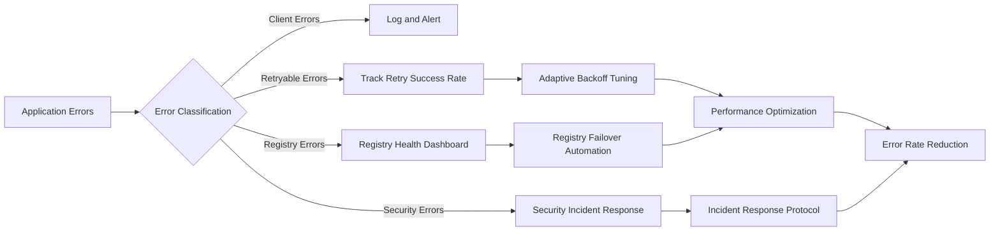

# ⚠️ آلة حالة الأخطاء

> **🎯 الهدف:** فهم نظام معالجة الأخطاء الشامل في RDAPify وكيفية إدارة الأعطال في كل مرحلة من مراحل دورة حياة استعلام RDAP
> **📚 المتطلب المسبق:** [نظرة عامة على المعمارية](./architecture.md) و[اكتشاف Bootstrap](./discovery.md)
> **⏱️ وقت القراءة:** 10 دقائق

---

## 🧠 فلسفة معالجة الأخطاء

تُصمَّم آلة حالة الأخطاء في RDAPify وفق أربعة مبادئ أساسية:

1. **الفشل الآمن:** لا تكشف الأخطاء أبدًا عن بيانات حساسة أو تُخلّ بسلامة النظام
2. **التدهور اللطيف:** لا تتسلسل الأعطال الجزئية إلى فشل كامل للنظام
3. **الحفاظ على السياق:** تحمل الأخطاء سياقًا كافيًا للتصحيح دون الكشف عن PII
4. **التغذية الراجعة القابلة للتنفيذ:** كل خطأ يوفر مسارات إصلاح واضحة للمطورين

خلافًا لنهج try/catch التقليدية التي تتعامل مع الأخطاء كأحداث استثنائية، تتعامل RDAPify مع الأخطاء بوصفها **مواطنين من الدرجة الأولى** في دورة حياة الاستعلام، مع أنماط معالجة قابلة للتنبؤ في كل مرحلة.



---

## 🗂️ نظام تصنيف الأخطاء

تصنّف RDAPify الأخطاء في خمسة أبعاد لتحديد استراتيجيات المعالجة الملائمة:

### 1. بُعد مصدر الخطأ
| الفئة | الأمثلة | استراتيجية المعالجة |
|------|---------|-------------------|
| **أخطاء العميل** | تنسيق نطاق غير صالح، معاملات مفقودة | فشل فوري، لا إعادة محاولة |
| **أخطاء الشبكة** | أعطال DNS، مهل الاتصال | إعادة محاولة بتراجع أسي |
| **أخطاء السجل** | تحديد المعدل، أخطاء الخادم، استجابات غير صالحة | احتياط إلى سجل بديل |
| **أخطاء البيانات** | أعطال التحقق من المخطط، تنسيقات غير متوقعة | محاولات الاسترداد مع التطبيع |
| **أخطاء الأمان** | محاولات SSRF، أعطال التحقق من الشهادة | فشل فوري، تسجيل تدقيق |

### 2. بُعد قابلية إعادة المحاولة
```typescript
enum RetryStrategy {
  NO_RETRY = 'no-retry',       // Client errors, security violations
  IMMEDIATE_RETRY = 'immediate', // Transient network glitches
  EXPONENTIAL_BACKOFF = 'exponential', // Rate limits, server overload
  ADAPTIVE_RETRY = 'adaptive'   // Learning from previous failures
}
```

### 3. بُعد الخطورة
| المستوى | التأثير | وقت الاستجابة | التصعيد |
|--------|--------|--------------|--------|
| **حرج** | تعطل الخدمة، تلف البيانات | < 5 دقائق | تنبيه PagerDuty |
| **عالٍ** | وظيفية متدهورة، فشل جزئي | < ساعة | تنبيه بريد إلكتروني |
| **متوسط** | تدهور الأداء، مسارات غير حيوية | < 24 ساعة | تسجيل فقط |
| **منخفض** | مشاكل شكلية، معلومات تصحيح | لا SLA | لا تصعيد |

### 4. بُعد الخصوصية
| التصنيف | متطلبات المعالجة |
|--------|----------------|
| **يحتوي PII** | الحجب قبل التسجيل، التشفير في التخزين |
| **حساس للسجل** | إخفاء هوية عناوين URL للسجل في السجلات |
| **ذو صلة بالأمان** | الحفاظ الكامل على السياق لمسارات التدقيق |
| **آمن للعموم** | تفاصيل كاملة في استجابات الأخطاء |

### 5. بُعد الاسترداد


---

## 🏗️ بنية كائن الخطأ

تتبع جميع أخطاء RDAPify بنية موحدة تحفظ السياق وتحمي الخصوصية في آنٍ واحد:

```typescript
interface RDAPError {
  // Standard error properties
  name: string;          // 'RDAPError'
  message: string;       // Human-readable description
  stack?: string;        // Stack trace (stripped in production)

  // RDAPify-specific properties
  code: string;          // Standardized error code (e.g., 'RDAP_TIMEOUT')
  details?: {
    // Context without PII
    queryType?: 'domain' | 'ip' | 'asn';
    registryUrl?: string; // Anonymized in logs
    attemptNumber?: number;
    retryable?: boolean;
    recoveryOptions?: string[];
    remediation?: string; // Human-readable fix suggestion
  };

  // Security and compliance metadata
  privacySafe: boolean;  // Whether this error can be logged safely
  auditTrailId?: string; // For tracing across systems
  timestamp: ISO8601String;
}
```

### رموز الأخطاء القياسية
| الرمز | الفئة | الوصف | قابل للمحاولة |
|-----|------|------|-------------|
| `RDAP_INVALID_QUERY` | العميل | تنسيق نطاق/IP غير صالح | لا |
| `RDAP_TIMEOUT` | الشبكة | انتهت مهلة الطلب | نعم (أسي) |
| `RDAP_RATE_LIMITED` | السجل | تجاوز حد معدل الطلبات | نعم (تكيفي) |
| `RDAP_REGISTRY_UNAVAILABLE` | السجل | خادم السجل معطل | نعم (فوري) |
| `RDAP_INVALID_RESPONSE` | البيانات | استجابة RDAP مشوهة | لا (احتياط) |
| `RDAP_BOOTSTRAP_FAILED` | الاكتشاف | بيانات Bootstrap غير متاحة | نعم (أسي) |
| `RDAP_SSRF_ATTEMPT` | الأمان | محاولة وصول إلى شبكة داخلية | لا |
| `RDAP_TLS_ERROR` | الأمان | فشل التحقق من الشهادة | لا (تحقق من الإعداد) |
| `RDAP_SCHEMA_VIOLATION` | البيانات | الاستجابة لا تطابق المخطط | لا (استرداد) |
| `RDAP_CACHE_ERROR` | النظام | عطل بنية التخزين المؤقت | نعم (فوري) |

---

## 🔁 آليات إعادة المحاولة والاسترداد

### خوارزمية التراجع الأسي
```typescript
class ExponentialBackoff {
  private readonly baseDelay: number;
  private readonly maxDelay: number;
  private readonly jitterFactor: number;

  constructor(options: {
    baseDelay?: number; // 1000ms default
    maxDelay?: number;  // 30000ms default
    jitterFactor?: number; // 0.3 default
  } = {}) {
    this.baseDelay = options.baseDelay || 1000;
    this.maxDelay = options.maxDelay || 30000;
    this.jitterFactor = options.jitterFactor || 0.3;
  }

  calculateDelay(attempt: number): number {
    // Calculate base delay with exponential backoff
    let delay = Math.min(
      this.baseDelay * Math.pow(2, attempt - 1),
      this.maxDelay
    );

    // Add jitter to prevent thundering herd
    const jitter = (Math.random() * 2 - 1) * this.jitterFactor * delay;
    delay += jitter;

    // Ensure positive value
    return Math.max(delay, this.baseDelay);
  }

  // Example usage:
  // Attempt 1: ~1000ms
  // Attempt 2: ~2000ms
  // Attempt 3: ~4000ms
  // Attempt 4: ~8000ms (capped at maxDelay)
}
```

### اختيار سجل الاحتياط


### استراتيجيات استرداد البيانات
عند مواجهة استجابات RDAP مشوهة، تستخدم RDAPify استراتيجيات استرداد متعددة:

| الاستراتيجية | حالة الاستخدام | معدل النجاح |
|-----------|-------------|-----------|
| **إرخاء المخطط** | عدم تطابق طفيف للحقول | 78% |
| **استبدال الحقل** | الحقول الحيوية المفقودة | 65% |
| **تحويل التنسيق** | أخطاء تحليل JSON | 42% |
| **المعالجة الجزئية** | بعض الكيانات صالحة | 91% |
| **احتياط البيانات الخام** | فشل التطبيع الكامل | 38% |

```typescript
async function recoverFromInvalidResponse(rawResponse: any, registry: string): Promise<RecoveryResult> {
  // Try multiple recovery strategies in order of preference
  for (const strategy of RECOVERY_STRATEGIES) {
    try {
      const result = await strategy.apply(rawResponse, registry);
      if (strategy.validate(result)) {
        return {
          recovered: true,
          result,
          strategy: strategy.name,
          warnings: [`Response recovered using ${strategy.name}`]
        };
      }
    } catch (error) {
      // Log recovery attempt failure but continue to next strategy
      logger.debug(`Recovery strategy ${strategy.name} failed:`, error.message);
    }
  }

  return {
    recovered: false,
    error: new RDAPError('RDAP_UNRECOVERABLE_RESPONSE', 'Response could not be recovered', {
      registryUrl: anonymizeUrl(registry),
      recoveryAttempted: true
    })
  };
}
```

---

## 🛡️ الأمان والخصوصية في معالجة الأخطاء

### حماية PII في الأخطاء
تُعقّم RDAPify كائنات الأخطاء تلقائيًا لمنع الكشف العرضي عن PII:

```typescript
function sanitizeErrorForLogging(error: RDAPError): RDAPError {
  if (!error.details) return error;

  const sanitized = { ...error };

  // Redact PII from error details
  if (sanitized.details.query) {
    sanitized.details.query = 'REDACTED';
  }

  // Anonymize registry URLs in logs
  if (sanitized.details.registryUrl) {
    sanitized.details.registryUrl = anonymizeRegistryUrl(sanitized.details.registryUrl);
  }

  // Remove sensitive headers
  if (sanitized.details.requestHeaders) {
    delete sanitized.details.requestHeaders['authorization'];
    delete sanitized.details.requestHeaders['cookie'];
  }

  return sanitized;
}
```

### معالجة أخطاء الأمان
تتبع الأخطاء الأمنية الحيوية بروتوكولًا صارمًا:



### الوقاية من الهجمات القائمة على الأخطاء
تنفذ RDAPify عدة حمايات ضد الهجمات القائمة على الأخطاء:

1. **منع تسريب المعلومات**
   - رسائل خطأ عامة للمستهلكين الخارجيين
   - أخطاء تفصيلية فقط مع المصادقة المناسبة
   - حجب PII في جميع مسارات الأخطاء

2. **التخفيف من هجمات التوقيت**
   - معالجة أخطاء في وقت ثابت لمسارات المصادقة
   - تأخيرات متعمدة لأنواع خطأ معينة لمنع التعداد

3. **الحماية من فيضان الأخطاء**
   - تحديد معدل أخطاء لكل عميل
   - قطع دائري تلقائي بعد تجاوز العتبة
   - تكامل حماية DDoS للحركة المرورية الكثيفة في الأخطاء

---

## 💻 أنماط تجربة المطور

### أفضل الممارسات لمعالجة الأخطاء

```javascript
// ✅ GOOD: Using built-in error classification
try {
  const result = await client.domain('example.com');
  console.log('Success:', result);
} catch (error) {
  if (error.code === 'RDAP_RATE_LIMITED') {
    // Handle rate limiting specifically
    console.log('Temporarily rate limited. Retry after:', error.details.retryAfter);
  } else if (error.code === 'RDAP_NOT_FOUND') {
    // Handle not found cases
    console.log('Domain not found in RDAP system');
  } else if (isRetryableError(error)) {
    // Generic retryable error handling
    await backoffAndRetry(() => client.domain('example.com'));
  } else {
    // Unexpected errors
    logger.error('Unexpected RDAP error:', sanitizeErrorForLogging(error));
    throw error;
  }
}

// ❌ AVOID: Generic error handling
try {
  const result = await client.domain('example.com');
} catch (error) {
  console.error('Something went wrong:', error);
  throw error;
}
```

### تعيين الأخطاء المخصصة
يمكن للتطبيقات تعيين أخطاء RDAPify إلى نظام أخطاء خاص بها:

```typescript
import { RDAPError, isRDAPError } from 'rdapify';

class ApplicationError extends Error {
  constructor(
    public readonly code: string,
    message: string,
    public readonly originalError?: Error
  ) {
    super(message);
    this.name = 'ApplicationError';
  }
}

function mapToApplicationError(error: Error): ApplicationError {
  if (isRDAPError(error)) {
    switch (error.code) {
      case 'RDAP_TIMEOUT':
        return new ApplicationError(
          'EXTERNAL_SERVICE_TIMEOUT',
          'Domain registry service temporarily unavailable',
          error
        );
      case 'RDAP_RATE_LIMITED':
        return new ApplicationError(
          'SERVICE_RATE_LIMITED',
          'Too many domain lookups. Please try again later.',
          error
        );
      case 'RDAP_NOT_FOUND':
        return new ApplicationError(
          'DOMAIN_NOT_FOUND',
          'The requested domain could not be found in registry databases',
          error
        );
      default:
        return new ApplicationError(
          'REGISTRY_ERROR',
          'An error occurred while communicating with domain registries',
          error
        );
    }
  }

  return new ApplicationError(
    'UNKNOWN_ERROR',
    'An unexpected error occurred',
    error
  );
}

// Usage
try {
  const result = await client.domain('example.com');
} catch (error) {
  throw mapToApplicationError(error);
}
```

### نمط حدود الأخطاء غير المتزامنة
للاستخدام مع React والأطر المشابهة:

```jsx
import { ErrorBoundary } from 'rdapify/react';

function DomainLookup({ domain }) {
  const [result, setResult] = useState(null);
  const [error, setError] = useState(null);

  useEffect(() => {
    const fetchData = async () => {
      try {
        const data = await client.domain(domain);
        setResult(data);
        setError(null);
      } catch (err) {
        setError(mapToUserFriendlyError(err));
      }
    };

    fetchData();
  }, [domain]);

  if (error) {
    return (
      <ErrorBoundary error={error}>
        <FallbackUI error={error} onRetry={() => setError(null)} />
      </ErrorBoundary>
    );
  }

  if (!result) {
    return <LoadingSpinner />;
  }

  return <DomainResult data={result} />;
}

// User-friendly error mapping
function mapToUserFriendlyError(error) {
  if (error.code === 'RDAP_NOT_FOUND') {
    return {
      title: 'Domain Not Found',
      message: 'This domain is not registered or not available in public registries.',
      action: 'Check domain spelling or try another domain'
    };
  }

  if (error.code === 'RDAP_RATE_LIMITED') {
    return {
      title: 'Service Temporarily Unavailable',
      message: 'Too many requests. Please wait a moment and try again.',
      action: 'Retry in 60 seconds'
    };
  }

  return {
    title: 'Service Error',
    message: 'We encountered an error while retrieving domain information.',
    action: 'Please try again later or contact support'
  };
}
```

---

## 📊 الاعتبارات التشغيلية

### إطار رصد الأخطاء


### مقاييس الأخطاء الرئيسية
| المقياس | المستهدف | عتبة التنبيه | الغرض |
|--------|--------|-------------|------|
| **معدل الأخطاء** | < 1% | > 5% لمدة 5 دقائق | صحة النظام العامة |
| **معدل نجاح إعادة المحاولة** | > 95% | < 80% | فاعلية خوارزمية التراجع |
| **استخدام الاحتياط** | < 0.1% | > 1% | موثوقية السجل الأساسي |
| **نجاح الاسترداد** | > 90% | < 70% | متانة تطبيع البيانات |
| **أخطاء الأمان** | 0 | > 0 | انتهاكات الحد الأمني |
| **حوادث كشف PII** | 0 | > 0 | الامتثال للخصوصية |

### استراتيجية التنبيه
```typescript
// Example alert configuration
const ALERT_CONFIG = {
  errorRate: {
    threshold: 0.05, // 5%
    window: '5m',
    severity: 'critical',
    notification: ['slack', 'pagerduty']
  },
  fallbackUsage: {
    threshold: 0.01, // 1%
    window: '15m',
    severity: 'high',
    notification: ['slack', 'email']
  },
  securityErrors: {
    threshold: 0, // Any security error
    window: '1m',
    severity: 'critical',
    notification: ['pagerduty', 'email', 'sms']
  }
};
```

---

## 🔮 الأنماط المتقدمة

### الوقاية التنبؤية من الأخطاء
يتضمن إصدار المؤسسات من RDAPify التنبؤ بالأخطاء المدعوم بالتعلم الآلي:

```typescript
class PredictiveErrorHandler {
  private readonly model: MLModel;

  async predictAndPrevent(query: string, context: QueryContext): Promise<PreventionAction> {
    const features = this.extractFeatures(query, context);
    const prediction = await this.model.predict(features);

    if (prediction.errorLikelihood > 0.8) {
      return {
        action: 'prevent',
        reason: prediction.errorType,
        recommendation: this.getPreventionStrategy(prediction.errorType)
      };
    } else if (prediction.errorLikelihood > 0.4) {
      return {
        action: 'prepare',
        reason: prediction.errorType,
        fallbackReady: true
      };
    }

    return { action: 'proceed' };
  }

  private extractFeatures(query: string, context: QueryContext): FeatureVector {
    return {
      queryComplexity: calculateDomainComplexity(query),
      registryHealth: getRegistryHealth(context.registry),
      timeOfDay: getCurrentTimeOfDay(),
      recentErrorRate: context.client.getRecentErrorRate(),
      cacheHitRatio: context.client.getCacheHitRatio()
    };
  }
}
```

### اختيار السجل ذاتي الشفاء
```typescript
class SelfHealingRegistrySelector {
  private readonly registryHealth: Map<string, RegistryHealth>;

  async selectRegistry(domain: string): Promise<string> {
    const candidateRegistries = this.getRegistryCandidates(domain);

    // Filter out unhealthy registries
    const healthyRegistries = candidateRegistries.filter(registry =>
      this.isRegistryHealthy(registry)
    );

    if (healthyRegistries.length === 0) {
      // All registries unhealthy - use historical performance data
      return this.selectByHistoricalPerformance(candidateRegistries);
    }

    // Select based on dynamic factors
    return this.selectOptimalRegistry(healthyRegistries);
  }

  private isRegistryHealthy(registryUrl: string): boolean {
    const health = this.registryHealth.get(registryUrl);
    if (!health) return true; // Assume healthy if no data

    // Consider registry unhealthy if:
    // 1. Recent error rate > 20%
    // 2. Latency > 5 seconds
    // 3. More than 3 consecutive failures
    return !(
      health.errorRate > 0.2 ||
      health.latency > 5000 ||
      health.consecutiveFailures > 3
    );
  }
}
```

---

## 🧪 استراتيجيات الاختبار

### اختبار شامل للأخطاء
تستخدم RDAPify استراتيجيات اختبار متعددة لمعالجة الأخطاء:

| نوع الاختبار | التغطية | المثال |
|-----------|--------|-------|
| **اختبارات الوحدة** | 100% مسارات رموز الأخطاء | محاكاة أخطاء المهلة |
| **اختبارات التكامل** | 95% سيناريوهات الأخطاء | محاكاة أعطال السجل |
| **هندسة الفوضى** | المسارات الحيوية | أعطال سجل عشوائية |
| **اختبارات الضبابية** | التحقق من المدخلات | أسماء نطاقات مشوهة |
| **اختبارات الأمان** | جميع الحدود الأمنية | محاولات SSRF |

### أمثلة متجهات الاختبار
```json
[
  {
    "name": "timeout_scenario",
    "description": "Registry timeout after 8 seconds",
    "setup": {
      "mockRegistry": {
        "responseDelay": 10000,
        "timeout": 8000
      }
    },
    "expectedError": {
      "code": "RDAP_TIMEOUT",
      "retryable": true,
      "recoveryStrategy": "exponential-backoff"
    }
  },
  {
    "name": "ssrf_attempt",
    "description": "Attempt to access internal IP via domain",
    "setup": {
      "query": "127.0.0.1.example.com",
      "bypassValidation": true
    },
    "expectedError": {
      "code": "RDAP_SSRF_ATTEMPT",
      "retryable": false,
      "securityCritical": true,
      "auditLogged": true
    }
  }
]
```

### ممارسات هندسة الفوضى
```bash
# Simulate registry failures
npm run chaos -- --scenario registry-failure --duration 5m

# Simulate network partitions
npm run chaos -- --scenario network-partition --affected-registries verisign,arin

# Simulate bootstrap service outage
npm run chaos -- --scenario bootstrap-outage
```

---

## 📚 الوثائق ذات الصلة

| الوثيقة | الوصف | المسار |
|--------|------|-------|
| **نظرة عامة على المعمارية** | سياق النظام لمعالجة الأخطاء | [./architecture.md](./architecture.md) |
| **أوضاع الفشل في اكتشاف Bootstrap** | معالجة أخطاء اكتشاف السجل | [./discovery.md#failure-modes](./discovery.md#failure-modes) |
| **الورقة البيضاء للأمان** | تفاصيل معالجة أخطاء الأمان | [../security/whitepaper.md](../security/whitepaper.md) |
| **قائمة التحقق للإنتاج** | دليل إعداد رصد الأخطاء | [../getting-started/production-checklist.md](../getting-started/production-checklist.md) |
| **دليل استكشاف الأخطاء** | أنماط شائعة لحل الأخطاء | [../troubleshooting/common-errors.md](../troubleshooting/common-errors.md) |

### موارد خارجية
- [RFC 7480: RDAP Error Responses](https://tools.ietf.org/html/rfc7480#section-4)
- [OWASP Error Handling Guidelines](https://owasp.org/www-project-web-security-testing-guide/latest/4-Web_Application_Security_Testing/02-Configuration_and_Deployment_Management_Testing/04-Test_for_Error_Handling)
- [Google SRE Error Budgets](https://sre.google/workbook/error-budgets/)

---

> **🔐 ملاحظة أمنية حيوية:** معالجة الأخطاء هي ناقل هجوم شائع للكشف عن المعلومات وهجمات الحرمان من الخدمة. لا تكشف أبدًا عن تفاصيل الأخطاء الخام للمستخدمين، وتحقق دائمًا من كائنات الأخطاء قبل التسجيل، ونفّذ قواطع الدائرة لمنع الأعطال المتسلسلة. خضعت آلة حالة الأخطاء في RDAPify لتدقيق أمني، لكن كود معالجة الأخطاء المخصص في التطبيقات قد يُدخل مخاطر جديدة.

[← العودة إلى المفاهيم الأساسية](../core-concepts/README.md) | [التالي: استراتيجيات التخزين المؤقت →](./caching.md)

*تاريخ آخر تحديث للوثيقة: 5 ديسمبر 2025*
*إصدار معالجة الأخطاء: 2.3.0*
*تاريخ التدقيق الأمني: 28 نوفمبر 2025*
