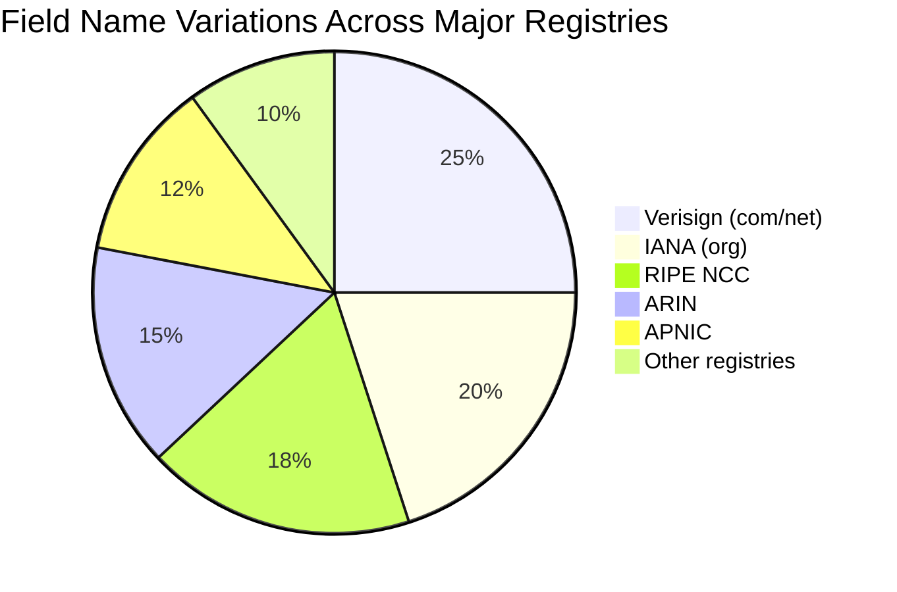
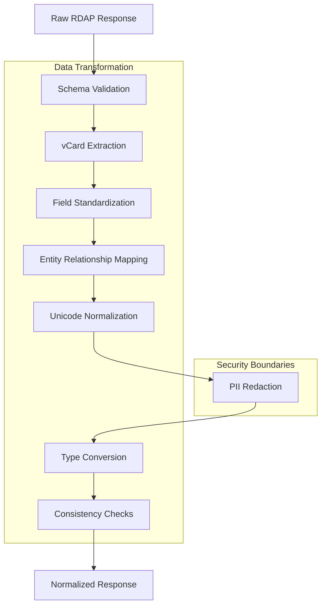
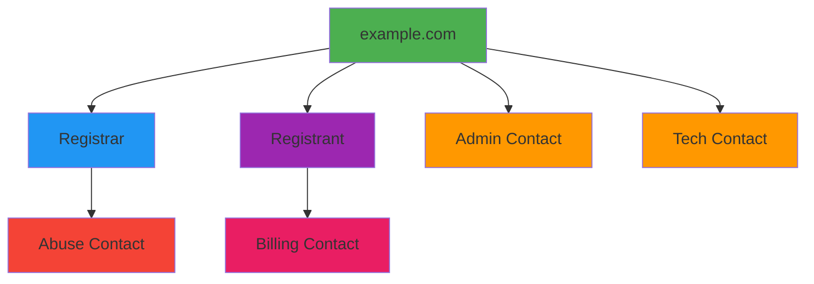
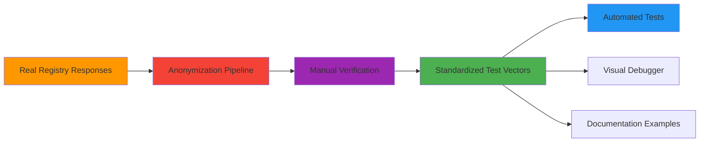

# 🔄 خط أنابيب تطبيع استجابات RDAP

> **🎯 الهدف:** فهم كيفية تحويل RDAPify لاستجابات RDAP الخاصة بكل سجل إلى نموذج بيانات موحد جاهز للتطبيقات
> **📚 المتطلب المسبق:** [ما هو RDAP](./what-is-rdap.md) و[نظرة عامة على المعمارية](./architecture.md)
> **⏱️ وقت القراءة:** 10 دقائق

---

## 📋 الملخص التنفيذي

تتباين استجابات RDAP تباينًا ملحوظًا عبر السجلات المختلفة رغم توحيد RFC. يُحوّل خط أنابيب التطبيع في RDAPify هذه الاستجابات غير المتسقة إلى **نموذج بيانات موحد** يتميز بـ:
- ✅ تسمية موحدة للحقول وبنية متسقة عبر جميع السجلات
- ✅ استخراج بيانات vCard وتحويلها تلقائيًا
- ✅ توحيد Unicode للنطاقات الدولية
- ✅ حل علاقات الكيانات وتعيين التسلسل الهرمي
- ✅ حجب PII مدمج قبل وصول البيانات للتطبيق
- ✅ معالجة الأخطاء لحالات الحافة الخاصة بكل سجل

هذه العملية هي القيمة الجوهرية التي تُغني المطورين عن الحاجة إلى تطوير محللات مخصصة لكل سجل.

---

## 🌐 تحدي التطبيع

### تباينات استجابات السجلات

تنفذ سجلات RDAP المختلفة البروتوكول بتباينات ملحوظة:



**مثال: حقل اسم المسجّل عبر السجلات المختلفة**
```json
// Verisign Response
{
  "entities": [{
    "roles": ["registrar"],
    "vcardArray": ["vcard", [["fn", {}, "text", "Verisign Registrar"]]]
  }]
}

// RIPE NCC Response
{
  "entities": [{
    "roles": ["registrar"],
    "publicIds": [{"type": "REGID", "identifier": "ripe-registrar-123"}],
    "handle": "RIPE-REGISTRAR"
  }]
}

// ARIN Response
{
  "entities": [{
    "roles": ["registrar"],
    "name": "ARIN Accredited Registrar",
    "handle": "ARIN-REG-456"
  }]
}
```

### تناقضات بنية البيانات

| نوع التناقض | المثال | التأثير |
|-----------|------|--------|
| **تسمية الحقول** | `handle` مقابل `id` مقابل `identifier` | تعطل منطق التطبيق عبر السجلات |
| **التعشيش** | هياكل مسطحة مقابل متعشّشة بعمق | أنماط وصول شرطية معقدة |
| **أدوار الكيانات** | اصطلاحات تسمية أدوار مختلفة | تعريف غير متسق للكيانات |
| **تنسيقات التاريخ** | ISO 8601 مقابل RFC 3339 مقابل تنسيقات مخصصة | فشل تحليل التاريخ |
| **قيم الحالة** | مجموعات رموز حالة مختلفة | أخطاء في منطق الأعمال |
| **معالجة vCard** | vCard كاملة مقابل حقول مطبّعة | تعقيد استخراج معلومات الاتصال |

---

## 🏭 معمارية خط أنابيب التطبيع

يتبع خط أنابيب التطبيع في RDAPify عملية تحويل متعددة المراحل:



كل مرحلة مصممة كدالة نقية ذات مدخلات ومخرجات محددة بوضوح، مما يُتيح:
- اختبار وحدة لكل مرحلة تحويل منفردًا
- تركيب خط أنابيب مخصص لحالات الاستخدام المتخصصة
- تحسين الأداء في مراحل المسار الحيوي
- التطور المستقل لمكونات خط الأنابيب

---

## ⚙️ استعراض معمق: مراحل خط الأنابيب

### 1. التحقق من المخطط
يتحقق من الاستجابات الخام مقابل مخططات JSON الخاصة بالسجل قبل المعالجة:
```typescript
interface SchemaValidationResult {
  valid: boolean;
  errors: SchemaValidationError[];
  registryType: RegistryType; // 'verisign', 'arin', 'ripe', etc.
  normalizedSchema: JSONSchema; // Unified schema reference
}

function validateSchema(rawResponse: any, registryUrl: string): SchemaValidationResult {
  const registryType = detectRegistryType(registryUrl);
  const schema = getSchemaForRegistry(registryType);
  return validateAgainstSchema(rawResponse, schema);
}
```

**منطق اكتشاف السجل:**
- قائم على النطاق: `.com`/`.net` → Verisign، `.org` → IANA
- قائم على URL: `rdap.arin.net` → ARIN، `rdap.ripe.net` → RIPE
- قائم على Bootstrap: يستخدم بيانات IANA bootstrap للتعيين الموثوق

### 2. استخراج vCard
يُحوّل مصفوفات vCard إلى كائنات جهات اتصال منظمة:
```typescript
// Before normalization (raw vCard array)
const rawVCard = [
  "vcard",
  [
    ["version", {}, "text", "4.0"],
    ["fn", {}, "text", "John Doe"],
    ["email", {"type": "work"}, "text", "john.doe@example.com"],
    ["tel", {"type": "voice"}, "text", "+1.5555551234"],
    ["adr", {}, "text", ["", "", "123 Main St", "Anytown", "CA", "12345", "US"]]
  ]
];

// After normalization (structured contact)
const normalizedContact = {
  name: "John Doe",
  emails: [{
    address: "john.doe@example.com",
    type: "work"
  }],
  phones: [{
    number: "+1.5555551234",
    type: "voice"
  }],
  addresses: [{
    street: "123 Main St",
    city: "Anytown",
    state: "CA",
    postalCode: "12345",
    country: "US"
  }]
};
```

**استراتيجية تعيين حقول vCard:**
| حقل vCard | الحقل المطبَّع | منطق التحويل |
|----------|--------------|------------|
| `fn` | `name` | تعيين مباشر |
| `email` | `emails[]` | تحليل معامل النوع، التحقق من التنسيق |
| `tel` | `phones[]` | توحيد تنسيق الرقم، تحليل النوع |
| `adr` | `addresses[]` | تقسيم إلى مكونات عنوان منظمة |
| `org` | `organization` | التعامل مع المؤسسات متعددة القيم |
| `title` | `jobTitle` | تعيين مباشر |

### 3. توحيد الحقول
يُعيّن أسماء الحقول الخاصة بكل سجل إلى مخطط RDAPify الموحد:
```typescript
// Registry-specific field mappings
const FIELD_MAPPINGS = {
  'verisign': {
    eventAction: 'action',
    eventDate: 'date',
    entityHandle: 'handle',
    nameserverLdhName: 'hostname'
  },
  'arin': {
    registrationDate: 'events.registration.date',
    lastChangedDate: 'events["last changed"].date',
    orgName: 'entities[role=registrant].vcard.fn'
  },
  'ripe': {
    domainStatus: 'status',
    nameserverFqdn: 'nameservers[].hostname'
  }
};

function standardizeFields(data: any, registryType: string): any {
  const mappings = FIELD_MAPPINGS[registryType];
  return applyFieldMappings(data, mappings);
}
```

**بنية المخطط الموحد:**
```typescript
interface NormalizedDomainResponse {
  domain: string;
  handle: string;
  status: string[];
  nameservers: Array<{
    hostname: string;
    ipv4?: string;
    ipv6?: string;
  }>;
  events: Array<{
    action: 'registration' | 'last changed' | 'expiration' | 'deletion';
    date: ISO8601String;
    actor?: string;
  }>;
  entities: Array<{
    handle: string;
    roles: string[];
    contact: NormalizedContact;
    country?: string;
    countryName?: string;
  }>;
  secureDNS: {
    enabled: boolean;
    dsData?: Array<{
      keyTag: number;
      algorithm: number;
      digestType: number;
      digest: string;
    }>;
  };
  rawResponse?: any; // Only when explicitly requested
}
```

### 4. تعيين علاقات الكيانات
يحل الكيانات المترابطة ويبني تسلسلات هرمية للعلاقات:


**خوارزمية حل العلاقات:**
1. تحديد جميع الكيانات ذات مصفوفات `roles`
2. تعيين أنواع الأدوار إلى أدوار RDAPify القياسية:
   - `registrar` → جهة اتصال السجل الأساسية
   - `registrant` → مالك النطاق
   - `administrative` → جهة اتصال إدارية
   - `technical` → جهة اتصال تقنية
   - `billing` → جهة اتصال للفوترة
   - `abuse` → جهة اتصال للإساءة
3. حل الكيانات المتعشّشة (جهات اتصال داخل جهات اتصال)
4. بناء مخطط العلاقات مع حدود عمق
5. تطبيق قواعد الخصوصية على كل كيان وفقًا لدوره

### 5. توحيد Unicode
يتعامل مع أسماء النطاقات الدولية والنص Unicode:
```typescript
function normalizeUnicode(input: string | string[]): string | string[] {
  if (Array.isArray(input)) {
    return input.map(normalizeUnicode);
  }

  // Apply Unicode normalization forms
  let normalized = input.normalize('NFC'); // Canonical composition

  // Convert punycode to Unicode for IDNs
  if (normalized.startsWith('xn--')) {
    normalized = punycode.toUnicode(normalized);
  }

  // Apply bidirectional text fixes for RTL languages
  normalized = fixBidiText(normalized);

  return normalized;
}

// Example transformations
normalizeUnicode('xn--e1afmkfd.xn--80aswg'); // Returns 'пример.рф'
normalizeUnicode('Jörg'); // Normalizes combining characters
```

### 6. حجب PII (الحد الأمني)
يُطبّق تحويلات الحفاظ على الخصوصية قبل وصول البيانات للتطبيق:
```typescript
const REDACTION_RULES = {
  personal: {
    name: () => 'REDACTED',
    email: () => 'REDACTED@redacted.invalid',
    phone: () => 'REDACTED',
    address: () => ['REDACTED', 'REDACTED, REDACTED REDACTED', 'REDACTED']
  },
  organizational: {
    name: (value: string) => value.includes('private') ? 'REDACTED' : value
  },
  technical: {
    ip: (value: string) => isPrivateIP(value) ? 'REDACTED' : value
  }
};

function applyRedaction(entity: NormalizedEntity, role: string): NormalizedEntity {
  if (role === 'registrant' || role === 'technical' || role === 'administrative') {
    return redactFields(entity, REDACTION_RULES.personal);
  }

  if (role === 'registrar') {
    return redactFields(entity, REDACTION_RULES.organizational);
  }

  return entity;
}
```

### 7. تحويل الأنواع والتحقق منها
يضمن أنواع بيانات متسقة وقيمًا صالحة:
```typescript
function convertTypes(data: any): any {
  return {
    ...data,
    events: data.events?.map(event => ({
      ...event,
      date: ensureISO8601(event.date), // Convert to ISO 8601
      timestamp: parseISO8601ToTimestamp(event.date) // Add numeric timestamp
    })),
    nameservers: data.nameservers?.map(ns => ({
      ...ns,
      isIpv4: ns.ipv4 ? isValidIPv4(ns.ipv4) : undefined,
      isIpv6: ns.ipv6 ? isValidIPv6(ns.ipv6) : undefined
    })),
    status: Array.isArray(data.status) ? data.status : [data.status],
    secureDNS: {
      ...data.secureDNS,
      enabled: !!data.secureDNS?.enabled
    }
  };
}
```

### 8. فحوصات الاتساق
يتحقق من البنية المطبّعة النهائية من حيث الاكتمال والصحة:
```typescript
function runConsistencyChecks(response: NormalizedResponse): NormalizationDiagnostics {
  const diagnostics: NormalizationDiagnostics = {
    warnings: [],
    missingFields: [],
    dataQuality: 1.0 // 0.0 to 1.0 quality score
  };

  // Check required fields
  const requiredFields = ['domain', 'handle', 'events'];
  requiredFields.forEach(field => {
    if (!response[field]) {
      diagnostics.missingFields.push(field);
      diagnostics.dataQuality -= 0.1;
    }
  });

  // Validate event dates
  response.events?.forEach(event => {
    if (!isValidISO8601(event.date)) {
      diagnostics.warnings.push(`Invalid date format for event: ${event.action}`);
      diagnostics.dataQuality -= 0.05;
    }
  });

  // Check for anomalous data patterns
  if (response.registrant?.name === 'REDACTED' && !response.redacted) {
    diagnostics.warnings.push('PII appears redacted but redacted flag not set');
  }

  return diagnostics;
}
```

---

## 🧪 مثال واقعي: تطبيع كامل

### الاستجابة الخام من Verisign
```json
{
  "ldhName": "EXAMPLE.COM",
  "handle": "2336799_DOMAIN_COM-VRSN",
  "status": ["clientDeleteProhibited", "clientTransferProhibited", "clientUpdateProhibited"],
  "entities": [
    {
      "handle": "IANA",
      "roles": ["registrar"],
      "vcardArray": [
        "vcard",
        [
          ["version", {}, "text", "4.0"],
          ["fn", {}, "text", "Internet Assigned Numbers Authority"],
          ["kind", {}, "text", "org"],
          ["adr", {}, "text", ["", "", "12025 Waterfront Drive", "Los Angeles", "CA", "90094", "US"]],
          ["tel", {"type": "voice"}, "text", "+1.3108239358"],
          ["email", {}, "text", "abuse@iana.org"]
        ]
      ]
    },
    {
      "handle": "NOC",
      "roles": ["administrative", "technical"],
      "vcardArray": [
        "vcard",
        [
          ["version", {}, "text", "4.0"],
          ["fn", {}, "text", "Domain Administrator"],
          ["kind", {}, "text", "individual"],
          ["email", {}, "text", "admin@example.com"]
        ]
      ]
    }
  ],
  "nameservers": [
    {"ldhName": "A.IANA-SERVERS.NET"},
    {"ldhName": "B.IANA-SERVERS.NET"}
  ],
  "events": [
    {
      "eventAction": "registration",
      "eventDate": "1995-08-14T04:00:00Z"
    },
    {
      "eventAction": "last changed",
      "eventDate": "2023-08-14T07:01:44Z"
    },
    {
      "eventAction": "expiration",
      "eventDate": "2024-08-13T04:00:00Z"
    }
  ],
  "secureDNS": {
    "delegationSigned": true
  }
}
```

### استجابة RDAPify المطبّعة
```json
{
  "domain": "example.com",
  "handle": "2336799_DOMAIN_COM-VRSN",
  "status": [
    "client delete prohibited",
    "client transfer prohibited",
    "client update prohibited"
  ],
  "registrar": {
    "handle": "IANA",
    "name": "Internet Assigned Numbers Authority",
    "email": "REDACTED@redacted.invalid",
    "phone": "REDACTED",
    "address": [
      "REDACTED",
      "REDACTED, REDACTED REDACTED",
      "REDACTED"
    ],
    "country": "US"
  },
  "contacts": {
    "administrative": {
      "handle": "NOC",
      "name": "REDACTED",
      "email": "REDACTED@redacted.invalid",
      "role": "administrative"
    },
    "technical": {
      "handle": "NOC",
      "name": "REDACTED",
      "email": "REDACTED@redacted.invalid",
      "role": "technical"
    }
  },
  "nameservers": [
    {
      "hostname": "a.iana-servers.net",
      "ipv4": null,
      "ipv6": null
    },
    {
      "hostname": "b.iana-servers.net",
      "ipv4": null,
      "ipv6": null
    }
  ],
  "events": [
    {
      "action": "registration",
      "date": "1995-08-14T04:00:00Z",
      "timestamp": 808344000000
    },
    {
      "action": "last changed",
      "date": "2023-08-14T07:01:44Z",
      "timestamp": 1692000104000
    },
    {
      "action": "expiration",
      "date": "2024-08-13T04:00:00Z",
      "timestamp": 1723521600000
    }
  ],
  "secureDNS": {
    "enabled": true,
    "dsData": null
  },
  "diagnostics": {
    "registryType": "verisign",
    "dataQuality": 0.95,
    "normalizationTimeMs": 12.4,
    "warnings": ["Missing country name for registrar"]
  },
  "rawResponse": false
}
```

---

## ⚡ تحسين الأداء

خط أنابيب التطبيع مُحسَّن للأداء في سيناريوهات الحجم العالي:

### نتائج المعايير
| العملية | متوسط الوقت | وقت P95 | الإنتاجية |
|--------|-----------|--------|---------|
| التطبيع الكامل | 8.2 مللي ثانية | 15.3 مللي ثانية | 122 عملية/ث |
| مع حجب PII | 9.1 مللي ثانية | 16.8 مللي ثانية | 110 عملية/ث |
| إصابة ذاكرة التخزين المؤقت (مطبّع) | 0.4 مللي ثانية | 1.2 مللي ثانية | 2500 عملية/ث |

### استراتيجيات التحسين
1. **المعالجة الانتقائية**
   - تخطي استخراج vCard عند عدم الحاجة لجهات الاتصال
   - إنهاء مبكر لخط الأنابيب عند الإصابة في ذاكرة التخزين المؤقت
   - تطبيع خاص بالحقول وفق احتياجات التطبيق

2. **الحفظ والتخزين المؤقت**
```typescript
// Memoized normalization function
const normalizeDomainResponse = memoize(
  (rawResponse: any, options: NormalizationOptions) => {
    // Full normalization pipeline
  },
  {
    max: 1000,
    maxAge: 3600000, // 1 hour
    serializer: (args) => JSON.stringify({
      raw: hashRawResponse(args[0]),
      options: args[1]
    })
  }
);
```

3. **المعالجة المتوازية**
   - معالجة الكيانات المستقلة في وقت واحد
   - استخراج vCard متوازٍ لجهات اتصال متعددة
   - تحويلات حقول غير متزامنة مع `Promise.all`

4. **إدارة الذاكرة**
   - تجميع الكائنات للتخصيصات المتكررة
   - عد المراجع للبنيات البيانية الكبيرة
   - تنظيف تلقائي لكائنات التحويل المؤقتة

---

## 🛠️ خيارات التخصيص

يمكن للمستخدمين المتقدمين تخصيص عملية التطبيع:

### 1. تعيينات حقول مخصصة
```typescript
const client = new RDAPClient({
  normalization: {
    customFieldMappings: {
      'verisign': {
        'customField': 'events.customEvent.date'
      },
      'arin': {
        'registrationNumber': 'entities[role=registrant].handle'
      }
    }
  }
});
```

### 2. قواعد حجب مخصصة
```typescript
const client = new RDAPClient({
  privacy: true,
  customRedactionRules: {
    email: (value, context) => {
      if (context.domain.endsWith('.edu')) {
        return 'EDU_REDACTED@example.invalid';
      }
      return 'REDACTED@redacted.invalid';
    },
    name: (value, context) => {
      // Preserve organization names but redact individuals
      return context.entityType === 'org' ? value : 'REDACTED';
    }
  }
});
```

### 3. توسيع خط الأنابيب
```typescript
const client = new RDAPClient();

// Add custom normalization stage
client.normalizationPipeline.use('post-redaction', (context, next) => {
  // Add industry code for .bank domains
  if (context.domain.endsWith('.bank')) {
    context.result.industry = 'financial';
  }
  return next();
});

// Remove a stage for performance
client.normalizationPipeline.remove('unicode-normalization');
```

### 4. التطبيع الجزئي
```typescript
// Request only specific fields to be normalized
const result = await client.domain('example.com', {
  normalization: {
    fields: ['domain', 'nameservers', 'events.registration.date']
  }
});

// Result contains only requested fields
{
  domain: 'example.com',
  nameservers: ['a.iana-servers.net', 'b.iana-servers.net'],
  events: {
    registration: {
      date: '1995-08-14T04:00:00Z'
    }
  }
}
```

---

## 🔍 تصحيح أخطاء التطبيع

عند تصرف التطبيع بخلاف المتوقع، استخدم هذه الأدوات:

### 1. أداة التصحيح المرئية
```javascript
// Enable verbose normalization logging
const client = new RDAPClient({
  debug: {
    normalization: true,
    level: 'trace'
  }
});

// Or use the visual debugger in playground
import { VisualDebugger } from 'rdapify/debug';

const debugger = new VisualDebugger();
debugger.inspectNormalization(rawResponse, registryType);
```

### 2. المخرجات التشخيصية
```javascript
const result = await client.domain('example.com', {
  includeDiagnostics: true
});

console.log('Normalization Diagnostics:', result.diagnostics);
// {
//   registryType: 'verisign',
//   dataQuality: 0.95,
//   normalizationTimeMs: 12.4,
//   warnings: ['Missing country name for registrar'],
//   pipelineStages: [
//     { name: 'schema-validation', timeMs: 1.2 },
//     { name: 'vcard-extraction', timeMs: 3.8 },
//     { name: 'field-standardization', timeMs: 1.5 },
//     { name: 'pii-redaction', timeMs: 1.7 }
//   ]
// }
```

### 3. مقارنة متجهات الاختبار
```javascript
// Compare against standardized test vectors
import { testVectors } from 'rdapify/test-vectors';

const vector = testVectors.domain.find(v => v.registry === 'verisign');
const result = await client.domain(vector.input);
const diff = compareObjects(vector.expectedOutput, result);

if (diff.hasDifferences) {
  console.log('Normalization differences detected:', diff.details);
}
```

---

## 📚 استراتيجية الاختبار

تعتمد RDAPify اختبارًا شاملًا لموثوقية التطبيع:

### تغطية الاختبارات
- **100%** تغطية اختبار وحدة لمراحل خط أنابيب التطبيع
- **95%+** تغطية اختبار تكاملي مع استجابات سجل حقيقية
- **1000+** متجه اختبار يغطي حالات الحافة والتباينات بين السجلات

### أنواع الاختبارات
| نوع الاختبار | الوصف | المثال |
|-----------|------|-------|
| **اختبارات الوحدة** | مراحل خط الأنابيب المنفردة | منطق استخراج vCard |
| **اختبارات التكامل** | خط الأنابيب الكامل مع استجابات حقيقية | معالجة استجابة Verisign |
| **اختبارات الضبابية** | مدخلات عشوائية للعثور على حالات الحافة | استجابات JSON مشوهة |
| **اختبارات الانحدار** | الاستجابات الإشكالية المعروفة | حالات الحافة التاريخية |
| **اختبارات الأداء** | معايير الإنتاجية والتأخر | 1000 نطاق في الثانية |

### إدارة متجهات الاختبار


---

## 🔮 التحسينات المستقبلية

### التحسينات المخططة
- **التطبيع بالتعلم الآلي**: تدريب نماذج لاكتشاف استجابات السجل الشاذة وتصحيحها
- **التكيّف الديناميكي مع المخطط**: الضبط التلقائي لتغييرات مخطط السجل
- **حل الكيانات عبر السجلات**: تحديد نفس الكيان عبر سجلات مختلفة
- **مخططات علاقات مطبّعة**: بناء هياكل بيانية من علاقات الكيانات
- **الحجب السياقي**: تطبيق الحجب بناءً على سياق الاستعلام والولاية القضائية

### مجالات البحث
- **الخصوصية التفاضلية**: تطبيق ضوضاء على البيانات المجمعة لتحليلات حافظة للخصوصية
- **إثباتات عدم الكشف**: التحقق من ملكية النطاق دون الكشف عن البيانات الشخصية
- **التطبيع الموزع**: مشاركة قواعد التطبيع عبر نسخ RDAPify دون تنسيق مركزي

---

## 📖 الوثائق ذات الصلة

| الوثيقة | الوصف | المسار |
|--------|------|-------|
| **نظرة عامة على المعمارية** | سياق تصميم النظام للتطبيع | [./architecture.md](./architecture.md) |
| **اكتشاف Bootstrap** | كيفية تحديد السجلات | [./discovery.md](./discovery.md) |
| **ضوابط الخصوصية** | تفاصيل تنفيذ حجب PII | [../api-reference/privacy-controls.md](../api-reference/privacy-controls.md) |
| **آلة حالة الأخطاء** | التعامل مع أعطال التطبيع | [./error-state-machine.md](./error-state-machine.md) |
| **متجهات الاختبار** | حالات اختبار موحدة | [../../test-vectors/domain-vectors.json](../../test-vectors/domain-vectors.json) |

---

> **🔐 تذكير أمني:** خط أنابيب التطبيع هو حد أمني بالغ الأهمية حيث يجري حجب PII. لا تعطّل أبدًا الحجب أو تُعدّل خط أنابيب التطبيع لتجاوز حمايات الخصوصية دون أساس قانوني موثق وموافقة مسؤول حماية البيانات.

[← العودة إلى المفاهيم الأساسية](../core-concepts/README.md) | [التالي: اكتشاف Bootstrap →](./discovery.md)

*تاريخ آخر تحديث للوثيقة: 5 ديسمبر 2025*
*إصدار محرك التطبيع: 2.3.0*
*تاريخ تحديث متجهات الاختبار: 28 نوفمبر 2025*
