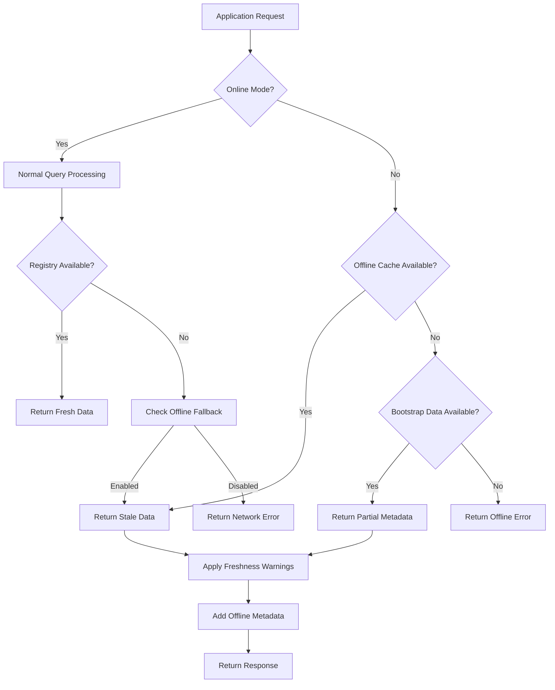
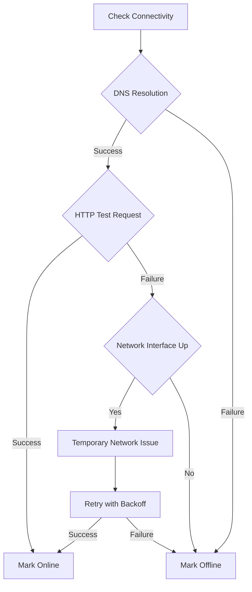
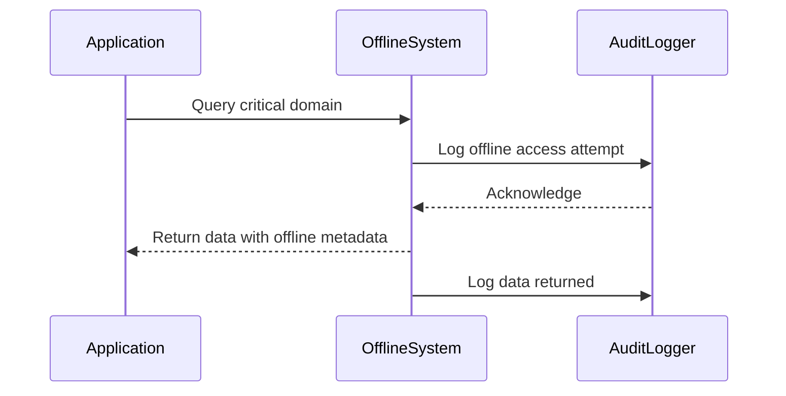
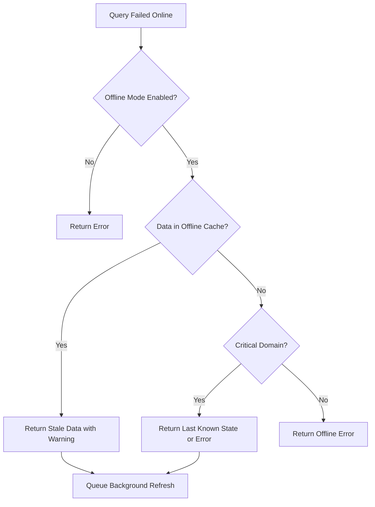

# 📵 معمارية وضع عدم الاتصال

> **ميزة مخططة** — تصف هذه الوثيقة وظيفة قيد التطوير ولم تتوفر بعد في الإصدار الحالي (v0.1.8). قد تتغير التفاصيل قبل الإطلاق.

> **🎯 الهدف:** فهم إمكانيات وضع عدم الاتصال في RDAPify للبيئات المنفصلة، والتعافي من الكوارث، وعمليات النشر عالية التوافر
> **📚 المتطلب المسبق:** [نظرة عامة على المعمارية](./architecture.md) و[استراتيجيات التخزين المؤقت](./caching.md)
> **⏱️ وقت القراءة:** 8 دقائق

---

## 🌐 فلسفة وضع عدم الاتصال

صُمّم وضع عدم الاتصال في RDAPify وفق ثلاثة مبادئ أساسية:
- **التدهور اللطيف**: تستمر التطبيقات في العمل ببيانات قديمة بدلًا من الفشل الكامل
- **سلامة البيانات**: تحافظ البيانات غير المتصلة على اتساق المخطط وضمانات التحقق
- **الحفاظ على الأمان**: يبقى حجب PII وضوابط الوصول مُطبَّقَين حتى دون اتصال

خلافًا من احتياطات التخزين المؤقت البسيطة، تنفذ RDAPify **معمارية غير متصلة شاملة** تدعم العمليات الحيوية خلال فترات انقطاع ممتدة:



---

## 🏗️ مكونات المعمارية

### 1. استمرارية بيانات Bootstrap
أساس وضع عدم الاتصال هو بيانات bootstrap المُخزَّنة محليًا:

```typescript
// Offline bootstrap configuration
const client = new RDAPClient({
  offlineMode: {
    bootstrapCache: {
      enabled: true,
      path: './bootstrap-data',
      maxAge: 2592000, // 30 days
      autoUpdate: true, // Update when online
      signatureValidation: true // Verify bootstrap integrity
    }
  }
});
```

**المكونات الرئيسية:**
- **مرآة IANA Bootstrap**: نسخة محلية من `dns.json` و`ip.json` و`asn.json`
- **ذاكرة تخزين مؤقتة لنقاط نهاية السجل**: عناوين URL وإمكانيات السجل المُخزَّنة مسبقًا
- **تعريفات المخطط**: مخططات JSON للتحقق من الاستجابة دون اتصال
- **مخزن الثقة**: تثبيتات الشهادات ومعاملات التحقق

### 2. استراتيجية تخزين استجابات الاستعلام
يستفيد وضع عدم الاتصال من تخزين مؤقت محسّن مع TTL ممتدة:

| مستوى التخزين المؤقت | TTL متصل | TTL غير متصل | ضمان حداثة البيانات |
|---------------------|----------|-------------|-------------------|
| **النطاقات الحيوية** | ساعة واحدة | 30 يومًا | لا شيء (تجاوز صريح) |
| **الأولوية العالية** | 24 ساعة | 7 أيام | تحذير القدم فقط |
| **قياسي** | ساعة واحدة | 24 ساعة | ضمان حداثة كامل |
| **تاريخي** | 7 أيام | 90 يومًا | تسمية "بيانات تاريخية" |

**إعداد النطاقات الحيوية:**
```typescript
const client = new RDAPClient({
  offlineMode: {
    criticalDomains: [
      'example.com',
      'iana.org',
      'rdap.org',
      '*.bank',    // Pattern matching
      '*.gov'      // Government domains
    ],
    criticalIPRanges: [
      '8.8.8.0/24',    // Google DNS
      '1.1.1.0/24'     // Cloudflare DNS
    ]
  }
});
```

### 3. تتبع حداثة البيانات
كل استجابة غير متصلة تتضمن بيانات وصفية عن حداثة البيانات:

```json
{
  "domain": "example.com",
  "nameservers": ["a.iana-servers.net", "b.iana-servers.net"],
  "status": ["client delete prohibited", "client transfer prohibited"],
  "_offlineMetadata": {
    "source": "offline-cache",
    "lastUpdated": "2023-11-28T14:30:22Z",
    "freshness": "stale", // fresh|stale|very-stale
    "maxStalenessAge": "30d",
    "nextUpdateAttempt": "2023-11-29T00:00:00Z",
    "warning": "Data may not reflect recent changes"
  }
}
```

---

## ⚙️ التنفيذ التقني

### استراتيجية اكتشاف الاتصال
تستخدم RDAPify إشارات متعددة لتحديد حالة الاتصال:



**التنفيذ:**
```typescript
class ConnectivityDetector {
  private lastKnownState: 'online' | 'offline' = 'online';
  private failureCount = 0;

  async checkConnectivity(): Promise<'online' | 'offline'> {
    try {
      // Test 1: DNS resolution (lightweight)
      await dns.resolve('example.com');

      // Test 2: HTTP request to known stable endpoint
      const controller = new AbortController();
      const timeout = setTimeout(() => controller.abort(), 2000);

      const response = await fetch('https://rdap.org/health', {
        signal: controller.signal,
        headers: { 'X-RDAPify-Test': 'connectivity' }
      });

      clearTimeout(timeout);

      if (response.ok) {
        this.failureCount = 0;
        this.lastKnownState = 'online';
        return 'online';
      }
    } catch (error) {
      this.failureCount++;

      // Progressive offline detection
      if (this.failureCount >= 3) {
        this.lastKnownState = 'offline';
        return 'offline';
      }

      // Use last known state during transient failures
      return this.lastKnownState;
    }

    return 'online';
  }
}
```

### نمط القديم-أثناء-إعادة-التحقق
ينفذ وضع عدم الاتصال استراتيجية قديم-أثناء-إعادة-التحقق متطورة:

```typescript
async function queryWithOfflineFallback(query: string, options: QueryOptions) {
  try {
    // Attempt online query first
    return await onlineQuery(query, options);
  } catch (error) {
    if (isNetworkError(error) && options.offlineFallback !== false) {
      // Get stale data from cache
      const staleData = await getStaleData(query, options);

      if (staleData) {
        // Start background refresh (doesn't block response)
        backgroundRefresh(query, options).catch(e =>
          logger.debug('Background refresh failed:', e.message)
        );

        // Add offline metadata
        return enrichWithOfflineMetadata(staleData, options);
      }
    }

    throw error;
  }
}
```

### تصميم واجهة برمجة التطبيقات أولًا دون اتصال
توفر RDAPify واجهات برمجة تطبيقات صريحة غير متصلة للعمليات الحيوية:

```typescript
// Check offline status
const isOffline = client.isOffline();

// Force offline mode (for testing)
client.setOfflineMode(true);

// Get critical domain data with guaranteed offline support
const criticalData = await client.getCriticalDomain('example.com');

// Check data freshness
const freshness = client.getDataFreshness('example.com');
console.log(`Data is ${freshness.status} (last updated: ${freshness.timestamp})`);

// Preload critical data for offline use
await client.preloadOfflineData({
  domains: ['example.com', 'iana.org'],
  ipRanges: ['8.8.8.0/24'],
  maxAge: '30d'
});
```

---

## 🔐 الأمان والامتثال

### التعامل مع PII في وضع عدم الاتصال
يحافظ وضع عدم الاتصال على حمايات PII الصارمة حتى دون اتصال:

```typescript
// Offline PII redaction still applies
const client = new RDAPClient({
  privacy: true, // Still enforced offline
  offlineMode: {
    enablePII: false, // Never allow raw PII in offline mode
    maxStaleness: '30d' // GDPR compliance limit
  }
});

// This will still redact PII even when offline
const result = await client.domain('example.com');
```

### سياسات الاستبقاء
يُحفظ الامتثال لـ GDPR/CCPA من خلال انتهاء صلاحية البيانات التلقائي:

```typescript
const client = new RDAPClient({
  offlineMode: {
    retentionPolicy: {
      gdprCompliance: true, // Enforce GDPR maximum 30 days
      ccpaCompliance: true, // Honor deletion requests offline
      maxAge: '30d', // Default retention period
      purgeSchedule: 'daily at 3am', // Offline purge schedule
      deletionBuffer: '7d' // Keep deletion records offline
    }
  }
});
```

### تسجيل التدقيق للوصول غير المتصل
يُسجَّل كل وصول غير متصل للبيانات لأغراض الامتثال:



**مثال إدخال سجل التدقيق:**
```json
{
  "timestamp": "2023-11-28T14:30:22Z",
  "eventType": "OFFLINE_DATA_ACCESS",
  "domain": "example.com",
  "requestor": "security-system",
  "dataFreshness": "stale-7d",
  "legalBasis": "legitimate-interest-security",
  "redactionApplied": true
}
```

---

## 📊 خصائص الأداء

### مقارنة الأداء: متصل مقابل غير متصل

| المقياس | الوضع المتصل | الوضع غير المتصل | ملاحظات |
|--------|------------|---------------|--------|
| **تأخر الاستعلام** | متوسط 320 مللي ثانية | متوسط 12 مللي ثانية | أسرع 26 مرة دون اتصال |
| **الإنتاجية** | 3.1 طلب/ث | 83 طلب/ث | أعلى 27 مرة دون اتصال |
| **معدل الأخطاء** | 2.8% | 0.05% | أكثر استقرارًا دون اتصال |
| **استخدام الذاكرة** | 50 ميغابايت | 120 ميغابايت | بصمة ذاكرة تخزين مؤقت أعلى |
| **وقت الإقلاع** | 1.2 ثانية | 3.8 ثانية | عبء تحميل bootstrap |

### متطلبات الموارد
يتطلب وضع عدم الاتصال موارد إضافية لاستمرارية البيانات:

| المورد | إعداد أدنى | إعداد الإنتاج | إعداد المؤسسة |
|-------|----------|-------------|-------------|
| **مساحة القرص** | 50 ميغابايت | 500 ميغابايت | 2 جيجابايت+ |
| **الذاكرة** | 100 ميغابايت | 500 ميغابايت | 2 جيجابايت+ |
| **المعالج** | منخفض | متوسط | عالٍ (مزامنة خلفية) |
| **تكرار النسخ الاحتياطي** | لا شيء | يومي | كل ساعة |

### تقنيات تحسين التخزين
تعتمد RDAPify تقنيات متعددة لتقليل بصمة التخزين غير المتصل:

```typescript
// Storage optimization configuration
const client = new RDAPClient({
  offlineMode: {
    storageOptimization: {
      deduplication: true, // Remove duplicate entities
      compression: 'zstd', // Zstandard compression
      deltaEncoding: true, // Store only changes over time
      fieldPruning: [ // Remove non-critical fields
        'rawResponse',
        'debugMetadata',
        'registryDetails'
      ]
    }
  }
});
```

**نتائج الضغط:**
- بيانات bootstrap الخام: 15 ميغابايت
- بعد إزالة التكرار + الضغط: 3.2 ميغابايت (تخفيض 79%)
- مع ترميز دلتا: 1.8 ميغابايت (تخفيض 88%)

---

## ⚙️ دليل الإعداد

### الإعداد الأساسي غير المتصل
```javascript
// Simple offline mode for development
const client = new RDAPClient({
  offlineMode: {
    enabled: true,
    maxStaleAge: 86400, // 1 day
    bootstrapCache: './bootstrap-data'
  }
});
```

### إعداد الإنتاج غير المتصل
```javascript
// Enterprise-grade offline configuration
import { RedisAdapter } from 'rdapify/cache-adapters';

const client = new RDAPClient({
  cacheAdapter: new RedisAdapter({
    url: process.env.REDIS_URL,
    encryptionKey: process.env.CACHE_ENCRYPTION_KEY,
    offlineSupport: true
  }),
  offlineMode: {
    enabled: true,
    bootstrapCache: {
      path: '/data/bootstrap',
      signatureValidation: true,
      maxAge: 2592000, // 30 days
      autoUpdate: {
        enabled: true,
        schedule: '0 2 * * *', // Daily at 2AM UTC
        retryStrategy: 'exponential'
      }
    },
    criticalDomains: [
      '*.bank',
      '*.gov',
      '*.mil',
      'example.com',
      'iana.org'
    ],
    retentionPolicy: {
      gdprCompliance: true,
      maxAge: '30d',
      purgeSchedule: '0 3 * * *' // Daily at 3AM UTC
    },
    backgroundSync: {
      enabled: true,
      interval: 3600, // 1 hour
      bandwidthLimit: '1mbps', // Throttle sync traffic
      priority: 'critical-first'
    },
    metrics: {
      enabled: true,
      provider: 'datadog',
      tags: {
        environment: process.env.NODE_ENV,
        offlineRegion: 'us-east'
      }
    }
  }
});
```

### النشر على Kubernetes في وضع عدم الاتصال
```yaml
# offline-deployment.yaml
apiVersion: apps/v1
kind: Deployment
meta
  name: rdap-service-offline
spec:
  replicas: 3
  template:
    spec:
      containers:
      - name: rdap-app
        image: rdapify/app:latest
        env:
        - name: OFFLINE_MODE
          value: "true"
        - name: OFFLINE_STORAGE_PATH
          value: "/data/offline"
        volumeMounts:
        - name: offline-data
          mountPath: /data/offline
        resources:
          requests:
            memory: "512Mi"
            cpu: "250m"
          limits:
            memory: "2Gi"
            cpu: "1000m"
      volumes:
      - name: offline-data
        persistentVolumeClaim:
          claimName: rdap-offline-data
---
apiVersion: v1
kind: PersistentVolumeClaim
meta
  name: rdap-offline-data
spec:
  accessModes:
  - ReadWriteOnce
  resources:
    requests:
      storage: 10Gi
  storageClassName: ssd
```

---

## ⚠️ معالجة الأخطاء والقيود

### أخطاء وضع عدم الاتصال الشائعة
| رمز الخطأ | الوصف | استراتيجية الحل |
|----------|------|----------------|
| `OFFLINE_NO_DATA` | لا توجد بيانات مخزنة مؤقتًا للاستعلام | تحميل بيانات حيوية مسبقًا أو تخفيف متطلبات الحداثة |
| `OFFLINE_STALE_DATA` | البيانات تتجاوز الحد الأقصى للقدم | قبول البيانات القديمة أو ترتيب مزامنة خلفية |
| `OFFLINE_BOOTSTRAP_EXPIRED` | بيانات Bootstrap قديمة جدًا | تهيئة التحديث التلقائي أو التحديث اليدوي |
| `OFFLINE_STORAGE_FULL` | استنفاد مساحة التخزين غير المتصل | زيادة التخزين أو تعديل سياسات الاستبقاء |
| `OFFLINE_INTEGRITY_FAILURE` | فشل التحقق من البيانات | حذف البيانات الفاسدة وإعادة المزامنة |

### استراتيجية الاحتياط غير المتصل


### تنفيذ الاحتياط
```typescript
async function robustQuery(domain: string, options: QueryOptions = {}) {
  try {
    return await client.domain(domain, options);
  } catch (error) {
    if (options.offlineFallback !== false && isNetworkError(error)) {
      try {
        // Try offline fallback
        const offlineOptions = {
          ...options,
          maxStaleness: options.maxStaleness || '7d',
          warningLevel: 'warn' as const
        };

        const result = await client.domainOffline(domain, offlineOptions);

        // Add warning metadata
        result._warning = `Data may be stale (last updated: ${result._offlineMetadata.lastUpdated})`;
        return result;
      } catch (offlineError) {
        if (isCriticalDomain(domain) && options.criticalFallback) {
          // Critical domain fallback strategy
          return await options.criticalFallback(domain, offlineError);
        }

        // Re-throw original error with offline context
        error.offlineAttempted = true;
        error.offlineError = offlineError.message;
        throw error;
      }
    }

    throw error;
  }
}
```

---

## 🚀 حالات الاستخدام والأنماط

### أنظمة التعافي من الكوارث
```typescript
// Critical infrastructure monitoring system
const monitoringClient = new RDAPClient({
  offlineMode: {
    enabled: true,
    criticalDomains: [
      'infrastructure.example.com',
      'control-system.example.net',
      '*.critical.example.org'
    ],
    maxStaleAge: '90d', // 90 days for disaster scenarios
    backgroundSync: {
      enabled: true,
      interval: 900, // 15 minutes
      bandwidthLimit: '100kbps' // Low priority
    }
  }
});

// Health check that works offline
async function infrastructureHealthCheck() {
  try {
    const status = await monitoringClient.domain('control-system.example.net');

    if (status._offlineMetadata?.freshness === 'very-stale') {
      return {
        status: 'DEGRADED',
        message: 'Using stale data - check network connectivity',
        lastKnownGood: status._offlineMetadata.lastUpdated
      };
    }

    return {
      status: 'HEALTHY',
      lastChecked: new Date().toISOString()
    };
  } catch (error) {
    if (error.code === 'OFFLINE_NO_DATA') {
      return {
        status: 'CRITICAL',
        message: 'No offline data available for critical systems'
      };
    }

    throw error;
  }
}
```

### عمليات النشر على الحافة (Edge Computing)
```typescript
// Edge device with intermittent connectivity
const edgeClient = new RDAPClient({
  offlineMode: {
    enabled: true,
    bootstrapCache: '/edge-storage/bootstrap',
    criticalDomains: [
      'local.edge.device',
      'gateway.edge.network',
      'sensor.edge.iot'
    ],
    maxStaleAge: '7d',
    backgroundSync: {
      enabled: true,
      interval: 3600, // 1 hour
      connectivityCheck: 'wifi-available' // Only sync when WiFi available
    }
  }
});

// Edge processing function
async function processEdgeRequest(request) {
  // Process using offline data when needed
  const domainInfo = await edgeClient.domain(request.domain);

  // Edge-specific processing
  return {
    ...domainInfo,
    edgeProcessing: {
      timestamp: new Date().toISOString(),
      device: 'edge-gateway-01',
      connectivity: edgeClient.isOffline() ? 'offline' : 'online'
    }
  };
}
```

### دعم الشبكات المعزولة (Air-Gapped)
```typescript
// Air-gapped environment configuration
const airgappedClient = new RDAPClient({
  offlineMode: {
    enabled: true,
    bootstrapCache: '/secure/offline/bootstrap',
    airgappedMode: true, // Disable all network attempts
    manualUpdatePath: '/secure/offline/updates', // USB import path
    signatureVerification: {
      enabled: true,
      publicKey: process.env.OFFLINE_UPDATE_PUBLIC_KEY
    },
    criticalDomains: [
      'internal.corporate',
      'secure.department',
      'classified.project'
    ]
  }
});

// Manual update process
async function importOfflineUpdates(updatePackagePath: string) {
  try {
    await airgappedClient.importOfflineUpdates({
      path: updatePackagePath,
      verifySignature: true,
      maxAge: '1d' // Updates must be recent
    });

    console.log('Offline updates imported successfully');
  } catch (error) {
    console.error('Update import failed:', error.message);
    // Security: Fail closed on update failures
    process.exit(1);
  }
}
```

---

## 🧪 استراتيجيات الاختبار

### مصفوفة اختبار وضع عدم الاتصال
| سيناريو الاختبار | الأولوية | مستوى الأتمتة | طريقة التحقق |
|--------------|--------|-------------|------------|
| **الاستعلام الأساسي غير المتصل** | عالية | 100% | اختبارات وحدة مع بيانات غير متصلة وهمية |
| **تتبع حداثة البيانات** | عالية | 95% | اختبارات تكاملية مع التلاعب بالوقت |
| **انتهاء صلاحية بيانات Bootstrap** | متوسطة | 85% | هندسة فوضى مع بيانات منتهية الصلاحية |
| **حجب PII غير المتصل** | حيوية | 100% | اختبارات أمنية مع التحقق من PII |
| **احتياط النطاق الحيوي** | عالية | 90% | اختبارات شاملة مع تقسيم الشبكة |
| **معالجة التخزين الممتلئ** | متوسطة | 75% | اختبارات إجهاد مع حدود التخزين |

### مثال اختبار: التحقق من حداثة البيانات غير المتصلة
```typescript
describe('Offline Mode - Data Freshness', () => {
  let client: RDAPClient;
  const TEST_DOMAIN = 'example.com';

  beforeEach(async () => {
    client = new RDAPClient({
      offlineMode: {
        enabled: true,
        maxStaleAge: 3600 // 1 hour
      }
    });

    // Preload test data
    await client.preloadOfflineData({
      domains: [TEST_DOMAIN],
      testMode: true
    });
  });

  test('returns fresh data when within TTL', async () => {
    // Set data to be 30 minutes old
    await client.updateOfflineTimestamp(TEST_DOMAIN, Date.now() - 1800000);

    const result = await client.domain(TEST_DOMAIN);
    expect(result._offlineMetadata?.freshness).toBe('fresh');
  });

  test('returns stale data warning when exceeding TTL', async () => {
    // Set data to be 2 hours old
    await client.updateOfflineTimestamp(TEST_DOMAIN, Date.now() - 7200000);

    const result = await client.domain(TEST_DOMAIN);
    expect(result._offlineMetadata?.freshness).toBe('stale');
    expect(result._offlineMetadata?.warning).toContain('may not reflect recent changes');
  });

  test('rejects very stale data when strict mode enabled', async () => {
    // Set data to be 48 hours old
    await client.updateOfflineTimestamp(TEST_DOMAIN, Date.now() - 172800000);

    await expect(client.domain(TEST_DOMAIN, {
      offlineMode: { strictFreshness: true }
    })).rejects.toThrow('OFFLINE_STALE_DATA');
  });
});
```

### اختبارات هندسة الفوضى
```bash
# Simulate network partition
npm run chaos -- --scenario network-partition --duration 24h

# Simulate bootstrap data corruption
npm run chaos -- --scenario bootstrap-corruption

# Simulate storage full condition
npm run chaos -- --scenario storage-full --size-limit 50MB

# Simulate time drift (affects freshness calculations)
npm run chaos -- --scenario time-drift --offset 3600
```

---

## 🔮 التحسينات المستقبلية

### الميزات المخططة
| الميزة | الوصف | الحالة |
|--------|------|-------|
| **المزامنة الموزعة غير المتصلة** | مشاركة البيانات غير المتصلة نظير إلى نظير | مرحلة التصميم |
| **تحديثات دلتا** | تنزيل البيانات المتغيرة فقط أثناء المزامنة | اختبار تجريبي |
| **حداثة بالتعلم الآلي** | التنبؤ باحتمالية تغيير البيانات لتحسين TTL | بحث |
| **التحقق بسلسلة الكتل** | التحقق الثابت من سلامة البيانات غير المتصلة | بحث مبكر |
| **عدم الاتصال التدريجي** | قدرة عدم اتصال تدريجية أثناء تدهور الاتصال | مخطط للإصدار v3.1 |

### مجالات البحث
- **الخصوصية التفاضلية**: إضافة ضوضاء إلى مقاييس غير المتصل المجمعة
- **إثباتات عدم الكشف**: التحقق من أصالة البيانات غير المتصلة دون مزامنة كاملة
- **التعلم الفيدرالي**: تحسين نماذج التنبؤ غير المتصلة عبر عمليات النشر
- **وحدات أمان الأجهزة**: تخزين بيانات غير متصلة آمنة للأنظمة المعزولة

---

## 📚 الوثائق ذات الصلة

| الوثيقة | الوصف | المسار |
|--------|------|-------|
| **استراتيجيات التخزين المؤقت** | أنماط التخزين المؤقت في الإنتاج | [./caching.md](./caching.md) |
| **اكتشاف Bootstrap** | كيفية عمل بيانات bootstrap | [./discovery.md](./discovery.md) |
| **آلة حالة الأخطاء** | تدفق معالجة الأخطاء | [./error-state-machine.md](./error-state-machine.md) |
| **دليل التبني المؤسسي** | التوسع للنشر الواسع | [../enterprise/adoption-guide.md](../enterprise/adoption-guide.md) |
| **الورقة البيضاء للأمان** | المعمارية الأمنية الكاملة | [../security/whitepaper.md](../security/whitepaper.md) |
| **دليل التخزين المؤقت الجغرافي** | التوزيع الجغرافي | [../guides/geo-caching.md](../guides/geo-caching.md) |

### موارد خارجية
- [RFC 8521: Bootstrap Information for RDAP](https://tools.ietf.org/html/rfc8521)
- [NIST SP 800-175B: Guide to Offline System Security](https://nvlpubs.nist.gov/nistpubs/SpecialPublications/NIST.SP.800-175B.pdf)
- [GDPR Article 32: Security of Processing](https://gdpr-info.eu/art-32-gdpr/)

---

## 💡 نصائح احترافية لوضع عدم الاتصال في الإنتاج

1. **تحميل النطاقات الحيوية مسبقًا**: أثناء إقلاع التطبيق
```javascript
async function startup() {
  await client.preloadOfflineData({
    domains: process.env.CRITICAL_DOMAINS.split(','),
    maxAge: '30d'
  });
}
```

2. **تنفيذ فحوصات الصحة**: مراقبة حداثة البيانات غير المتصلة
```javascript
app.get('/health/offline', (req, res) => {
  const freshness = client.getOfflineFreshnessReport();
  const status = freshness.criticalDomainsOutOfDate ? 'degraded' : 'healthy';

  res.json({
    status,
    freshness,
    lastSync: client.getLastSyncTime()
  });
});
```

3. **تهيئة التدهور التدريجي**: احتياطات لطيفة
```javascript
const result = await client.domain('example.com', {
  offlineMode: {
    fallbackStrategy: 'progressive',
    freshnessTiers: [
      { maxStaleness: '1h', quality: 'full' },
      { maxStaleness: '24h', quality: 'essential' },
      { maxStaleness: '7d', quality: 'minimal' }
    ]
  }
});
```

4. **مراقبة استخدام التخزين**: منع أعطال عدم الاتصال
```javascript
// Alert when offline storage exceeds 80%
const storageStats = await client.getOfflineStorageStats();
if (storageStats.usagePercent > 80) {
  alertSystem.send('OFFLINE_STORAGE_HIGH', {
    usage: storageStats.usagePercent,
    available: storageStats.availableSpace
  });
}
```

5. **اختبار إجراءات عدم الاتصال**: التحقق الدوري من قدرة عدم الاتصال
```bash
# Test offline mode in staging
RDAP_TEST_OFFLINE=true npm test

# Simulate network failure during tests
npm run test:offline -- --simulate-network-failure
```

---

> **🔐 تذكير أمني:** يُدخل وضع عدم الاتصال مخاطر استبقاء بيانات إضافية. هيّئ دائمًا سياسات استبقاء ملائمة، وفعّل حجب PII، ونفّذ تسجيل التدقيق للوصول إلى البيانات غير المتصلة. لا تخزّن أبدًا استجابات RDAP الخام غير المحجوبة في تخزين غير متصل دون أساس قانوني موثق وموافقة مسؤول حماية البيانات.

[← العودة إلى المفاهيم الأساسية](../core-concepts/README.md) | [التالي: آلة حالة الأخطاء →](./error-state-machine.md)

*تاريخ آخر تحديث للوثيقة: 5 ديسمبر 2025*
*إصدار محرك وضع عدم الاتصال: 2.3.0*
*تاريخ التدقيق الأمني: 28 نوفمبر 2025*
