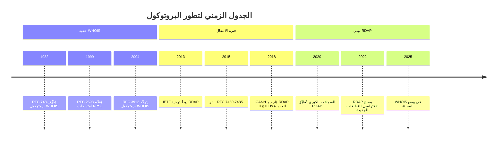
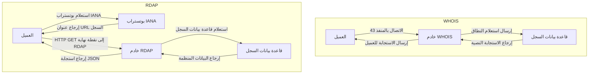
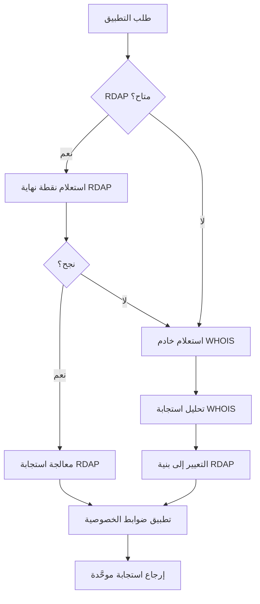

# RDAP مقابل WHOIS: تطور البروتوكول والمقارنة التقنية

> **الغرض:** فهم الفروق التقنية والمعمارية وما يتعلق بالامتثال بين بروتوكولَي RDAP وWHOIS
> **المتطلبات الأساسية:** فهم أساسي لـ [ما هو RDAP](./what-is-rdap.md)
> **وقت القراءة:** 10 دقائق
> **نصيحة:** للتجربة العملية، جرِّب [البدء السريع في 5 دقائق](../getting-started/five-minutes.md) مع كلا البروتوكولين

---

## ملخص تنفيذي

يمثل RDAP (بروتوكول الوصول إلى بيانات التسجيل) تطورًا جوهريًا عن بروتوكول WHOIS القديم، إذ يعالج قيوده الأساسية في البنية والتدويل والأمان والخصوصية. في حين أدّى WHOIS دوره لعقود بنهجه النصي البسيط، يُقدِّم RDAP بنية RESTful حديثة مع استجابات JSON موحدة تخدم بشكل أفضل النظام البيئي للإنترنت العالمي المراعي للامتثال اليوم.

بالنسبة للمطورين، يعني هذا الانتقال:
- **بيانات منظمة** بدلًا من تحليل نص غير منظم
- **استجابات موحدة** عبر السجلات بدلًا من التنسيقات الخاصة بكل سجل
- **ضوابط خصوصية مدمجة** بدلًا من الكشف الكلي أو لا شيء
- **بيانات وصفية قابلة للقراءة الآلية** بدلًا من استجابات للبشر فحسب
- **دعم أحرف دولية** بدلًا من القيود الخاصة بـ ASCII

غير أن الانتقال غير مكتمل — لا تزال كثير من الأنظمة تعتمد على WHOIS، مما يستلزم استراتيجيات توافق للأنظمة القديمة خلال مرحلة الهجرة.

---

## السياق التاريخي

### WHOIS: البروتوكول القديم (1982 - الحاضر)
طُوِّر في حقبة ARPANET المبكرة (RFC 748، 1982)، وصُمِّم لإنترنت أبسط:
- بروتوكول نصي بسيط عبر المنفذ TCP رقم 43
- تنسيق مقروء بشريًا مُحسَّن لمستخدمي الطرفية
- لا توحيد قياسي عبر السجلات
- محدود بأحرف ASCII
- لا آليات خصوصية أو أمان مدمجة
- لا تحديد معدل أو ضوابط وصول

### RDAP: البديل الحديث (2015 - الحاضر)
موحَّد عبر وثائق RFC 7480-7485 الصادرة عام 2015 وإلزامي من ICANN للـ gTLDs الجديدة:
- بنية معمارية RESTful API مستندة إلى HTTP/HTTPS
- استجابات JSON قابلة للقراءة الآلية بمخطط موحَّد
- دعم مدمج لمجموعات الأحرف الدولية (Unicode)
- مُصمَّم مع ضوابط خصوصية وقدرات الحجب
- رموز أخطاء موحدة وآليات تحديد معدل
- آلية اكتشاف بوتستراب لتحديد موقع السجل



---

## مقارنة البنية التقنية

### تصميم البروتوكول

| الميزة | WHOIS | RDAP |
|---------|-------|------|
| **بروتوكول النقل** | المنفذ TCP 43 (بروتوكول مخصص) | HTTP/HTTPS (بروتوكول ويب قياسي) |
| **طريقة الاستعلام** | سلسلة نصية بسيطة عبر اتصال دائم | نقاط نهاية RESTful URL مع معاملات الاستعلام |
| **تنسيق الاستجابة** | نص غير منظم بتنسيقات خاصة بكل سجل | JSON موحَّد بمخطط معرَّف |
| **ترميز الأحرف** | ASCII فحسب | UTF-8 مع دعم كامل لـ Unicode |
| **البيانات الوصفية** | ضئيلة أو معدومة | بيانات وصفية قابلة للقراءة الآلية لجميع الحقول |
| **معالجة الأخطاء** | رسائل خطأ نصية | رموز حالة HTTP موحَّدة وكائنات أخطاء JSON |
| **الاكتشاف** | تهيئة يدوية أو خوادم معروفة | اكتشاف بوتستراب تلقائي عبر IANA |

### مقارنة بنية البيانات

**مثال استجابة WHOIS (نص غير منظم):**
```
Domain Name: EXAMPLE.COM
Registry Domain ID: 2336799_DOMAIN_COM-VRSN
Registrar WHOIS Server: whois.iana.org
Registrar URL: http://www.iana.org
Updated Date: 2023-08-14T07:01:44Z
Creation Date: 1995-08-14T04:00:00Z
Registry Expiry Date: 2024-08-13T04:00:00Z
Registrar: ICANN
Registrar IANA ID: 376
Registrar Abuse Contact Email: abuse@iana.org
Registrar Abuse Contact Phone: +1.3108239358
Domain Status: clientDeleteProhibited
Domain Status: clientTransferProhibited
Domain Status: clientUpdateProhibited
Name Server: A.IANA-SERVERS.NET
Name Server: B.IANA-SERVERS.NET
DNSSEC: signedDelegation
```

**مثال استجابة RDAP (JSON منظم):**
```json
{
  "domain": "example.com",
  "handle": "2336799_DOMAIN_COM-VRSN",
  "ldhName": "example.com",
  "unicodeName": "example.com",
  "status": [
    "client delete prohibited",
    "client transfer prohibited",
    "client update prohibited"
  ],
  "events": [
    {
      "action": "registration",
      "date": "1995-08-14T04:00:00Z"
    },
    {
      "action": "last changed",
      "date": "2023-08-14T07:01:44Z"
    },
    {
      "action": "expiration",
      "date": "2024-08-13T04:00:00Z"
    }
  ],
  "entities": [
    {
      "handle": "IANA",
      "roles": ["registrar"],
      "vcardArray": [
        "vcard",
        [
          ["version", {}, "text", "4.0"],
          ["fn", {}, "text", "Internet Assigned Numbers Authority"],
          ["kind", {}, "text", "org"],
          ["adr", {}, "text", ["", "", "12025 Waterfront Drive", "Los Angeles", "CA", "90094", "US"]],
          ["tel", {"type": "voice"}, "text", "+1 310 823 9358"],
          ["email", {}, "text", "abuse@iana.org"]
        ]
      ]
    }
  ],
  "nameservers": [
    {
      "ldhName": "a.iana-servers.net",
      "unicodeName": "a.iana-servers.net"
    },
    {
      "ldhName": "b.iana-servers.net",
      "unicodeName": "b.iana-servers.net"
    }
  ],
  "secureDNS": {
    "delegationSigned": true
  }
}
```

### مقارنة تدفق الاستعلام



---

## مقارنة الأمان والخصوصية

### ضوابط الخصوصية المدمجة

| الميزة | WHOIS | RDAP |
|---------|-------|------|
| **حجب البيانات** | لا شيء (وصول كلي أو لا شيء) | حجب على مستوى الحقل الموحَّد |
| **ضوابط الوصول** | لا شيء (وصول عام) | آليات مصادقة اختيارية |
| **تسجيل الاستعلامات** | تطبيق مخصص | تتبع طلبات موحَّد |
| **تحديد المعدل** | تطبيق خاص بالسجل | ترويسات HTTP موحَّدة |
| **تقليل البيانات** | غير مدعوم | قدرة الاستجابة الجزئية (RFC 9083) |
| **قيد الغرض** | غير مدعوم | آليات تبرير الاستعلام |

### ثغرات الأمان

**مشكلات أمان WHOIS:**
- لا تشفير نقل بشكل افتراضي (إرسال بنص صريح)
- لا آليات مصادقة
- لا حماية من هجمات التعداد
- لا تحديد معدل موحَّد
- عرضة لهجمات DDoS الانعكاسية/التضخيمية
- لا حماية من SSRF (تزوير الطلبات من جانب الخادم)

**تحسينات أمان RDAP:**
- TLS 1.2+ إلزامي لجميع التطبيقات الرسمية
- تحديد معدل موحَّد عبر ترويسات HTTP
- لا بروتوكول UDP (يُزيل هجمات التضخيم)
- حماية مدمجة من SSRF عبر التحقق من صحة URL
- دعم رموز المصادقة للوصول المتميز
- رموز أخطاء موحَّدة تمنع تسرب المعلومات

### تداعيات الامتثال

**تحديات الامتثال مع WHOIS:**
- صعوبة إثبات المادة 6 من GDPR (الأساس القانوني)
- لا آليات مدمجة لحقوق أصحاب البيانات
- صعوبة تطبيق مبدأ تقليل البيانات
- لا سياسات احتفاظ موحَّدة
- آليات نقل البيانات عبر الحدود محدودة

**مزايا الامتثال مع RDAP:**
- الحجب على مستوى الحقل يدعم تقليل البيانات
- آليات موحَّدة لحق المحو
- قيد الغرض عبر تبرير الاستعلام
- بيانات وصفية للاحتفاظ المدمجة للحذف التلقائي
- البيانات المنظمة تُمكِّن ضوابط وصول أفضل
- مسارات التدقيق عبر التسجيل الموحَّد

---

## مقارنة التطبيق للمطورين

### تطبيق الاستعلام الأساسي

**تطبيق WHOIS (Node.js):**
```javascript
import { createSocket } from 'dgram';
import { promisify } from 'util';

async function whoisLookup(domain, server = 'whois.verisign.com') {
  return new Promise((resolve, reject) => {
    const socket = createSocket('udp4');
    const timeout = setTimeout(() => {
      socket.close();
      reject(new Error('WHOIS query timeout'));
    }, 5000);

    socket.on('message', (msg) => {
      clearTimeout(timeout);
      socket.close();
      resolve(msg.toString().trim());
    });

    socket.on('error', (err) => {
      clearTimeout(timeout);
      socket.close();
      reject(err);
    });

    socket.send(`${domain}\r\n`, 43, server, (err) => {
      if (err) reject(err);
    });
  });
}

// الاستخدام
try {
  const result = await whoisLookup('example.com');
  console.log('WHOIS Result:', result);

  // يتطلب تحليلًا يدويًا
  const registrarMatch = result.match(/Registrar:\s*(.*)/i);
  const registrar = registrarMatch ? registrarMatch[1] : 'Unknown';

  console.log('Registrar:', registrar);
} catch (error) {
  console.error('WHOIS Error:', error.message);
}
```

**تطبيق RDAP (RDAPify):**
```javascript
import { RDAPClient } from 'rdapify';

const client = new RDAPClient({
  privacy: true,
  cache: { ttl: 3600 }
});

try {
  // استجابة منظمة مع تحليل تلقائي
  const result = await client.domain('example.com');

  // وصول مباشر إلى البيانات المعيَّرة
  console.log('Domain:', result.domain);
  console.log('Registrar:', result.registrar?.name || 'REDACTED');
  console.log('Creation Date:',
    result.events.find(e => e.action === 'registration')?.date
  );
  console.log('Nameservers:', result.nameservers.map(ns => ns.hostname));

  // حماية الخصوصية مدمجة
  console.log('Registrant Email:', result.registrant?.email); // دائمًا REDACTED@redacted.invalid
} catch (error) {
  console.error('RDAP Error:', error.message);
  if (error.code === 'RDAP_NOT_FOUND') {
    console.log('Domain not found in RDAP system - falling back to WHOIS');
    // الرجوع إلى WHOIS إذا لزم
  }
}
```

### النمط المتقدم: استراتيجية الرجوع متعدد البروتوكولات

```javascript
import { RDAPClient, WHOISClient } from 'rdapify';

class RegistrationLookupService {
  constructor() {
    this.rdapClient = new RDAPClient({
      privacy: true,
      timeout: 8000,
      retry: { maxAttempts: 2 }
    });

    this.whoisClient = new WHOISClient({
      timeout: 10000,
      enableParser: true // استخدام محلل WHOIS المعيَّر
    });
  }

  async lookupDomain(domain) {
    try {
      // محاولة RDAP أولًا (المفضَّل)
      return {
        source: 'rdap',
        data: await this.rdapClient.domain(domain)
      };
    } catch (rdapError) {
      console.warn(`RDAP lookup failed for ${domain}:`, rdapError.message);

      try {
        // الرجوع إلى WHOIS مع التعيير
        const whoisData = await this.whoisClient.domain(domain);

        // تعيير بيانات WHOIS لتتطابق مع بنية RDAP
        const normalizedData = this.normalizeWHOISToRDAP(whoisData);

        return {
          source: 'whois',
          data: normalizedData,
          warning: 'Using legacy WHOIS protocol - consider migrating to RDAP'
        };
      } catch (whoisError) {
        console.error(`WHOIS fallback also failed for ${domain}:`, whoisError.message);
        throw new Error(`Failed to lookup ${domain} via both RDAP and WHOIS`);
      }
    }
  }

  normalizeWHOISToRDAP(whoisData) {
    // تحويل حقول WHOIS إلى بنية RDAP
    return {
      domain: whoisData.domainName,
      registrar: {
        name: whoisData.registrar || 'REDACTED',
        handle: whoisData.registrarId || 'UNKNOWN'
      },
      events: [
        { action: 'registration', date: whoisData.creationDate },
        { action: 'last changed', date: whoisData.updatedDate },
        { action: 'expiration', date: whoisData.expiryDate }
      ],
      nameservers: whoisData.nameServers.map(ns => ({
        hostname: ns,
        ipv4: null,
        ipv6: null
      })),
      // حجب البيانات الشخصية بشكل افتراضي في الرجوع
      registrant: {
        name: 'REDACTED',
        organization: 'REDACTED',
        email: 'REDACTED@redacted.invalid',
        phone: 'REDACTED'
      },
      status: (whoisData.domainStatus || []).map(s =>
        s.replace(/([A-Z])/g, ' $1').toLowerCase().trim()
      )
    };
  }
}

// الاستخدام
const service = new RegistrationLookupService();
const result = await service.lookupDomain('example.com');
console.log(`Data source: ${result.source}`);
console.log('Normalized data:', result.data);
```

---

## مصفوفة التبني والدعم

### حالة تبني RDAP عالميًا (2025)

| نوع السجل | دعم RDAP | دعم WHOIS | ملاحظات |
|---------------|--------------|---------------|-------|
| **gTLDs** | 100% | 100% | ICANN يُلزم بـ RDAP لجميع gTLDs الجديدة منذ 2018 |
| **ccTLDs** | ~85% | 100% | يختلف حسب البلد؛ ccTLDs الأوروبية تقود التبني |
| **سجلات IP** | 100% | 100% | ARIN وRIPE وAPNIC وLACNIC وAFRINIC تدعم RDAP |
| **سجلات ASN** | 100% | 100% | نفس سجلات IP |
| **النطاقات القديمة** | 70% | 100% | النطاقات القديمة قد تحتوي على بيانات RDAP غير مكتملة |

### نقاط نهاية RDAP للسجلات الكبرى

| السجل | عنوان URL الأساسي لـ RDAP | خادم WHOIS | ملاحظات |
|----------|---------------|--------------|-------|
| Verisign (com/net) | `https://rdap.verisign.com` | `whois.verisign.com` | WHOIS محدود بسبب GDPR |
| IANA (org) | `https://rdap.publicinterestregistry.org` | `whois.pir.org` | تطبيق كامل لـ RDAP |
| RIPE NCC | `https://rdap.ripe.net` | `whois.ripe.net` | امتدادات RDAP موسَّعة |
| ARIN | `https://rdap.arin.net` | `whois.arin.net` | امتثال كامل لـ RDAP |
| APNIC | `https://rdap.apnic.net` | `whois.apnic.net` | إيقاف تدريجي لـ WHOIS |

---

## استراتيجيات الهجرة

### النهج الهجين (موصى به)
لمعظم الأنظمة الإنتاجية، يوفر النهج الهجين أفضل توازن بين القدرات الحديثة والتوافق مع الأنظمة القديمة:



### توصيات الجدول الزمني للهجرة

| المرحلة | الجدول الزمني | الإجراءات |
|-------|----------|---------|
| **الإعداد** | الشهر 1-2 | تدقيق استخدام WHOIS الحالي، تحديد التبعيات، توثيق تدفقات البيانات |
| **التشغيل الموازي** | الشهر 3-4 | تطبيق RDAP جنبًا إلى جنب مع WHOIS، جمع المقاييس، تحديد الفجوات |
| **تكافؤ الميزات** | الشهر 5-6 | تطبيق الميزات المفقودة في مسار RDAP، إضافة آليات الرجوع |
| **التحويل التدريجي** | الشهر 7-9 | توجيه نسبة متزايدة من حركة المرور إلى RDAP، مراقبة الجودة |
| **إيقاف WHOIS** | الشهر 10-12 | التخلص من WHOIS لمعظم حالات الاستخدام، الحفاظ على رجوع الطوارئ |

### مثال هجرة الكود

**كود WHOIS القديم (قبل):**
```javascript
// كود قديم مع تحليل يدوي
function getDomainRegistrar(domain) {
  const raw = whoisLookup(domain);
  const lines = raw.split('\n');
  for (const line of lines) {
    if (line.match(/registrar:/i)) {
      return line.replace(/registrar:\s*/i, '').trim();
    }
  }
  return null;
}
```

**كود RDAP الحديث (بعد):**
```javascript
// كود حديث مع بيانات منظمة
async function getDomainRegistrar(domain) {
  const client = getRDAPClient(); // مثيل وحيد بإعداد صحيح
  const result = await client.domain(domain);
  return result.registrar?.name || null;
}

// مع رجوع للنطاقات القديمة
async function getDomainRegistrarWithFallback(domain) {
  try {
    return await getDomainRegistrar(domain);
  } catch (error) {
    if (error.code === 'RDAP_NOT_FOUND' || error.code === 'RDAP_REGISTRY_UNAVAILABLE') {
      console.warn(`RDAP not available for ${domain}, using WHOIS fallback`);
      return getDomainRegistrarLegacy(domain);
    }
    throw error;
  }
}
```

---

## النظرة المستقبلية

### خارطة طريق تطور RDAP

**المدى القريب (2025-2026):**
- **RFC 9083 (الاستجابة الجزئية):** طلب الحقول المطلوبة فقط لتقليل النطاق الترددي وانكشاف الخصوصية
- **RFC 9535 (امتدادات الاستعلام):** قدرات بحث محسَّنة للعمليات المجمَّعة
- **امتدادات أمان RDAP:** آليات مصادقة محسَّنة ومسارات تدقيق

**المدى المتوسط (2027-2028):**
- **التحديثات الفورية:** إشعارات دفعية لتغييرات النطاق
- **رسم علاقات محسَّن:** تصوير أفضل لعلاقات الكيانات
- **تكامل التعلم الآلي:** الكشف عن الشذوذات لأنماط التسجيل المشبوهة

**المدى البعيد (2029+):**
- **تكامل البلوكشين:** مسارات تدقيق غير قابلة للتغيير للنطاقات الحرجة
- **إثباتات معرفة الصفر:** التحقق من ملكية النطاق دون الكشف عن بيانات شخصية
- **الهوية الموحَّدة:** تسجيل دخول موحَّد للوصول إلى السجلات عبر الموفِّرين

### الجدول الزمني لإيقاف WHOIS

نشرت معظم السجلات الكبرى خارطة طريق لإيقاف WHOIS:
- **2025:** طلبات WHOIS محدودة بـ 100/يوم لكل IP دون مصادقة
- **2026:** حقول بيانات WHOIS محجوبة لتتطابق مع مستويات خصوصية RDAP
- **2027:** خدمة WHOIS متاحة فقط للأنظمة القديمة بترخيص خاص
- **2028:** بروتوكول WHOIS مُوقَف رسميًا، وضع الصيانة فحسب
- **2030:** خدمة WHOIS مُسحوبة من معظم السجلات الكبرى

---

## أفضل الممارسات للمطورين

### إرشادات التطبيق

1. **الافتراضي هو RDAP:** استخدم دائمًا RDAP كبروتوكول أساسي
2. **طبِّق آليات الرجوع:** اجعل WHOIS رجوعًا للنطاقات القديمة وفشل السجل
3. **عيِّر الاستجابات:** حوِّل جميع البيانات إلى بنية داخلية متسقة
4. **طبِّق ضوابط الخصوصية:** احجب البيانات الشخصية بغض النظر عن البروتوكول المصدر
5. **خزِّن بذكاء:** طبِّق تخزين مؤقت متعدد الطبقات لتقليل الحمل على السجل
6. **راقب صحة البروتوكول:** تتبع معدلات النجاح والأداء حسب البروتوكول/السجل

### أنماط جودة الكود

```javascript
// ✅ جيد: واجهة غير مرتبطة بالبروتوكول
class DomainRegistryService {
  constructor(options = {}) {
    this.rdapClient = new RDAPClient(options.rdap || {});
    this.whoisClient = new WHOISClient(options.whois || {});
    this.fallbackStrategy = options.fallbackStrategy || 'rdap-first';
  }

  async lookup(domain, options = {}) {
    if (this.fallbackStrategy === 'rdap-first') {
      return this._lookupRDAPFirst(domain, options);
    }
    return this._lookupWHOISFirst(domain, options);
  }

  // تفاصيل التطبيق الخاصة مخفية عن المستهلكين
  async _lookupRDAPFirst(domain, options) {
    try {
      return await this.rdapClient.domain(domain, options);
    } catch (error) {
      if (this._isFallbackWarranted(error)) {
        return this.whoisClient.domain(domain, {
          ...options,
          normalize: true // التحويل إلى بنية مشابهة لـ RDAP
        });
      }
      throw error;
    }
  }
}

// ❌ تجنب: تسرب التطبيق الخاص بالبروتوكول إلى المستهلكين
function badLookup(domain) {
  if (useRDAP) {
    const rdapResult = await fetch(`https://rdap.example.com/domain/${domain}`);
    // تحليل يدوي هنا...
  } else {
    const whoisResult = await whoisLookup(domain);
    // تحليل يدوي مختلف هنا...
  }
}
```

### تحسين الأداء

- **خزِّن بيانات البوتستراب مؤقتًا:** بيانات بوتستراب IANA تتغير نادرًا (خزِّنها 24 ساعة)
- **طبِّق التخزين المؤقت السلبي:** خزِّن نتائج "غير موجود" مؤقتًا لتقليل الحمل على السجل
- **استخدم تجميع الاتصالات:** أعِد استخدام اتصالات HTTP لاستعلامات RDAP المتعددة
- **جمِّع الاستعلامات ذات الصلة:** جلب الكيانات ذات الصلة بالتوازي قدر الإمكان
- **طبِّق قواطع الدائرة:** فشِل بسرعة عند عدم توفر السجلات

### قائمة مراجعة الامتثال

- [ ] تفعيل حجب البيانات الشخصية بشكل افتراضي في جميع البيئات
- [ ] تطبيق سياسات الاحتفاظ بالبيانات للنتائج المخزَّنة مؤقتًا
- [ ] إضافة تسجيل التدقيق لجميع عمليات الوصول إلى بيانات التسجيل
- [ ] توثيق الأساس القانوني للمعالجة في سياسة الخصوصية
- [ ] تطبيق إجراءات التعامل مع طلبات أصحاب البيانات
- [ ] إجراء تقييمات أثر الخصوصية للميزات الجديدة
- [ ] تشفير البيانات المخزَّنة مؤقتًا في حالة السكون وأثناء النقل
- [ ] مراجعة دورية لمتطلبات الامتثال مع السجل

---

## موارد إضافية

### المعايير الرسمية
- [RFC 7480: استجابات JSON لـ RDAP](https://tools.ietf.org/html/rfc7480)
- [RFC 7481: خدمات الأمان لـ RDAP](https://tools.ietf.org/html/rfc7481)
- [RFC 7482: تنسيق استعلام اسم النطاق](https://tools.ietf.org/html/rfc7482)
- [RFC 7483: تنسيق استعلام عنوان IP ورقم النظام المستقل](https://tools.ietf.org/html/rfc7483)
- [RFC 7484: العثور على خادم RDAP الموثوق](https://tools.ietf.org/html/rfc7484)
- [RFC 9083: الاستجابة الجزئية لـ RDAP](https://tools.ietf.org/html/rfc9083)

### الأدوات والمكتبات
- [RDAPify](https://rdapify.dev) - عميل RDAP حديث مع رجوع إلى WHOIS
- [RDAP Explorer](https://rdap.org) - أداة استعلام RDAP على الإنترنت
- [خدمة بوتستراب IANA](https://data.iana.org/rdap/) - بيانات البوتستراب الرسمية
- [RDAP Validator](https://github.com/arineng/rdap_validator) - أداة التحقق من صحة الاستجابة

### موارد المجتمع
- [صفحة RDAP في ICANN](https://www.icann.org/rdap)
- [المنتدى التقني لـ RDAP](https://mm.icann.org/pipermail/rdap/)
- [خدمة بوتستراب RDAP في IANA](https://www.iana.org/assignments/rdap-dns/rdap-dns.xhtml)
- [دليل تطبيق RDAP](https://github.com/RIPE-NCC/rdap-implementation-guide)

---

> **تذكير حرج:** بينما يوفر RDAP ضوابط خصوصية أفضل من WHOIS، إلا أنه لا يزال يتعامل مع بيانات شخصية حساسة. فعِّل دائمًا حجب البيانات الشخصية بشكل افتراضي وطبِّق حوكمة البيانات الصحيحة بغض النظر عن البروتوكول المستخدم. يجب ألا تُعطَّل إعداد `privacy: true` في RDAPify دون أساس قانوني موثَّق وموافقة مسؤول حماية البيانات.

[← العودة إلى المفاهيم الأساسية](../core-concepts/README.md) | [التالي: نظرة عامة على البنية المعمارية ←](./architecture.md)

*آخر تحديث للوثيقة: 5 ديسمبر 2025*
*إصدار RDAPify المشار إليه: 2.3.0*
*الامتثال للمعايير: سلسلة RFC 7480 + RFC 9083*
