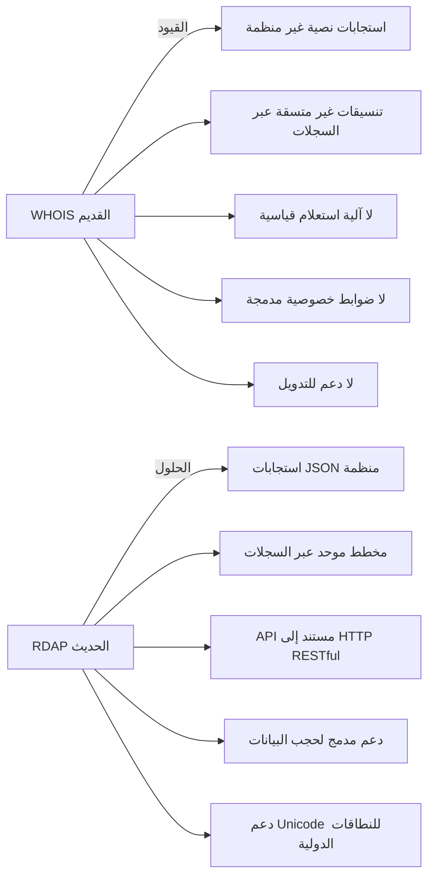
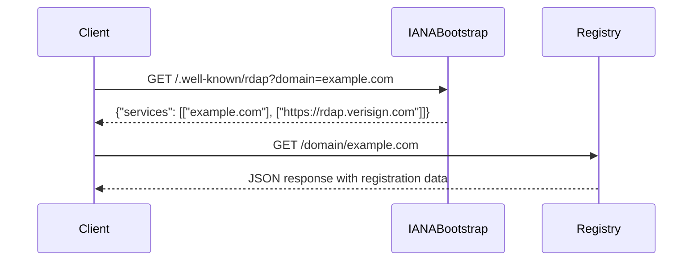

# ما هو RDAP؟

> **الغرض:** فهم أساسيات بروتوكول الوصول إلى بيانات التسجيل (RDAP)، ومزاياه على WHOIS، ودوره في البنية التحتية للإنترنت
> **المتطلبات الأساسية:** فهم أساسي لمفاهيم تسجيل النطاقات
> **وقت القراءة:** 8 دقائق
> **نصيحة:** للبدء العملي بعد قراءة هذه الوثيقة، جرِّب [البدء السريع في 5 دقائق](../getting-started/five-minutes.md)

---

## نظرة عامة على RDAP

**RDAP (بروتوكول الوصول إلى بيانات التسجيل)** هو بروتوكول حديث وموحَّد للاستعلام عن بيانات تسجيل الموارد الإنترنتية (النطاقات، وعناوين IP، والأنظمة المستقلة). معرَّف في [RFC 7480](https://tools.ietf.org/html/rfc7480) والمواصفات ذات الصلة، يحلّ RDAP محل بروتوكول WHOIS القديم بنهج أكثر تنظيمًا وقابلية للقراءة الآلية، يدعم المتطلبات الحديثة للخصوصية والأمان والتدويل.

على خلاف استجابات WHOIS النصية غير المتسقة عبر السجلات المختلفة، يوفر RDAP بيانات JSON منظمة بأسماء حقول موحدة وعلاقات بين الكيانات ودعم مدمج لمجموعات الأحرف الدولية.

```json
{
  "domain": "example.com",
  "handle": "12345678_DOMAIN_COM-VRSN",
  "ldhName": "example.com",
  "unicodeName": "example.com",
  "status": ["client delete prohibited", "client transfer prohibited", "client update prohibited"],
  "entities": [
    {
      "handle": "IANA",
      "roles": ["registrar"],
      "vcardArray": [
        "vcard",
        [
          ["version", {}, "text", "4.0"],
          ["fn", {}, "text", "Internet Assigned Numbers Authority"],
          ["kind", {}, "text", "individual"]
        ]
      ]
    }
  ]
}
```

---

## RDAP مقابل WHOIS: تطور الوصول إلى بيانات التسجيل



### الفروق الرئيسية

| الميزة | WHOIS | RDAP |
|---------|-------|------|
| **البروتوكول** | نصي، بروتوكول مخصص | HTTP/HTTPS مع مبادئ REST |
| **تنسيق الاستجابة** | نص غير منظم، يتباين حسب السجل | JSON موحد |
| **طريقة الاستعلام** | المنفذ 43 لـ WHOIS أو نماذج ويب | نقاط نهاية REST API |
| **بنية البيانات** | حقول مسطحة وغير متسقة | كيانات هرمية بعلاقات |
| **التدويل** | دعم ASCII محدود | دعم كامل لـ Unicode |
| **ضوابط الخصوصية** | لا شيء مدمج | آليات حجب موحدة |
| **اكتشاف البوتستراب** | تهيئة يدوية | اكتشاف تلقائي عبر IANA |
| **تحديد المعدل** | تطبيق مخصص | ترويسات ورموز أخطاء موحدة |

---

## كيف يعمل RDAP: غوص تقني عميق

### 1. عملية اكتشاف البوتستراب
يستخدم RDAP عملية اكتشاف ثنائية الخطوة للعثور على السجل الموثوق لمورد ما:



1. يستعلم العميل خادم بوتستراب IANA لاكتشاف السجل الذي يدير النطاق
2. يُعيد خادم البوتستراب عنوان URL الأساسي لخادم RDAP الموثوق
3. يستعلم العميل خادم RDAP الخاص بالسجل عن المورد المحدد
4. يُعيد السجل بيانات التسجيل المنظمة بتنسيق JSON

### 2. بنية استجابة RDAP
تتبع استجابات RDAP بنية JSON متسقة معرَّفة في وثائق RFC:

```typescript
interface RDAPResponse {
  // حقول خاصة بالمورد
  domain?: string;
  handle?: string;
  ipRange?: string;
  asn?: number;

  // الحقول المشتركة
  status?: string[];
  events?: {
    action: string; // registration, last changed, expiration
    date: string;  // تاريخ ISO 8601
  }[];

  // الكيانات ذات الصلة (جهات التسجيل، الأصحاب، جهات الاتصال)
  entities?: {
    handle: string;
    roles: string[]; // registrant, registrar, admin, tech, billing
    vcardArray: any[]; // معلومات الاتصال بتنسيق vCard
  }[];

  // خوادم الأسماء للنطاقات
  nameservers?: {
    ldhName: string;
    unicodeName?: string;
  }[];

  // روابط الموارد ذات الصلة
  links?: {
    href: string;
    rel: string; // self, alternate, related
    type?: string; // application/rdap+json
    value?: string;
  }[];
}
```

### 3. ميزات الأمان والخصوصية
يتضمن RDAP عدة آليات مدمجة للأمان والخصوصية:

- **الحجب الموحَّد:** يمكن حجب الحقول المحتوية على بيانات شخصية بعلامات متسقة
- **تحديد المعدل:** ترويسات HTTP قياسية (`Retry-After`، `X-RateLimit-Limit`) للاستخدام العادل
- **المصادقة:** مصادقة اختيارية بالرمز المميز للوصول المتميز
- **تقليل البيانات:** تحتوي الاستجابات على حقول البيانات الضرورية فحسب
- **قيد الغرض:** تتطلب بعض السجلات تبرير الاستعلام للوصول الكامل إلى البيانات

---

## النظام البيئي لـ RDAP والتبني

### دعم السجلات
يتفاوت تبني RDAP عبر السجلات المختلفة:

| نوع السجل | دعم RDAP | ملاحظات |
|---------------|--------------|-------|
| **gTLDs** | 100% مطلوب | ICANN يُلزم بـ RDAP لجميع gTLDs الجديدة |
| **ccTLDs** | ~70% | يختلف حسب البلد، التبني في تزايد |
| **سجلات IP** | 100% | ARIN وRIPE NCC وAPNIC وLACNIC وAFRINIC تدعم RDAP |
| **سجلات ASN** | 100% | نفس سجلات IP |

### البنية التحتية للبوتستراب العالمية
يعتمد RDAP على بيانات بوتستراب تُديرها IANA:

- **بوتستراب النطاقات:** `https://data.iana.org/rdap/dns.json`
- **بوتستراب IP:** `https://data.iana.org/rdap/ip.json`
- **بوتستراب ASN:** `https://data.iana.org/rdap/asn.json`

تُعيِّن هذه الملفات بتنسيق JSON أنواع الموارد إلى خوادم RDAP الموثوقة.

---

## تحديات تطبيق RDAP الخام

يطرح العمل مباشرة مع RDAP عدة تحديات:

### 1. التباينات الخاصة بكل سجل
على الرغم من جهود التوحيد القياسي، تُطبِّق السجلات RDAP بتباينات:
- مستويات مختلفة من اكتمال البيانات
- امتدادات مخصصة تتجاوز مواصفات RFC
- معالجة غير متسقة لعمليات حجب الخصوصية
- سياسات متفاوتة لتحديد المعدل

### 2. تعيير البيانات المعقد
تتطلب استجابات RDAP معالجة مكثفة:
- تحويل بيانات vCard إلى تنسيقات قابلة للاستخدام
- التعامل مع عمليات البحث متعددة السجلات للنطاقات المعقدة
- تعيير أسماء الحقول وهياكلها المتناقضة عبر السجلات
- إدارة العلاقات بين الكيانات

### 3. تعقيد الامتثال للخصوصية
يتطلب تطبيق RDAP المباشر:
- فهم تداعيات GDPR/CCPA لعمليات الوصول إلى البيانات
- تطبيق ممارسات تقليل البيانات المناسبة
- إدارة سياسات الاحتفاظ بالبيانات
- ضمان التخزين الآمن للمعلومات الحساسة

### 4. مخاوف الموثوقية
يستلزم استخدام RDAP في الإنتاج:
- استراتيجيات التخزين المؤقت لتقليل الحمل على السجل
- آليات الرجوع للسجلات غير المتاحة
- تحديد المعدل لتجنب الحجب
- معالجة الأخطاء للحالات الاستثنائية الكثيرة

---

## كيف يحل RDAPify هذه التحديات

يُخفي RDAPify تعقيدات RDAP مع الحفاظ على الخصوصية والامتثال:

### 1. واجهة موحَّدة
```javascript
// مع RDAPify: واجهة متسقة بغض النظر عن السجل
import { RDAPClient } from 'rdapify';

const client = new RDAPClient({ privacy: true });
const domainData = await client.domain('example.com');
const ipData = await client.ip('8.8.8.8');
const asnData = await client.asn(15169);
```

### 2. التعيير التلقائي
يحوّل RDAPify الاستجابات الخاصة بكل سجل إلى نموذج بيانات متسق:
- يحوّل بيانات vCard إلى كائنات JavaScript قياسية
- يُعيِّر أسماء الحقول وهياكلها عبر السجلات
- يحل علاقات الكيانات تلقائيًا
- يتعامل مع تحويلات Unicode/IDN بسلاسة

### 3. التصميم المراعي للخصوصية بشكل افتراضي
```javascript
const client = new RDAPClient({
  privacy: true, // مفعَّل بشكل افتراضي
  cache: {
    redactBeforeStore: true // الحجب قبل التخزين المؤقت
  }
});
```
- حجب تلقائي للبيانات الشخصية وفق مبادئ GDPR/CCPA
- سياسات حجب قابلة للإعداد
- تسجيل التدقيق لوصول البيانات
- ضوابط الاحتفاظ بالبيانات

### 4. موثوقية جاهزة للإنتاج
- تخزين مؤقت ذكي مع دعم Redis/الذاكرة
- تحديد معدل تلقائي وإعادة محاولة
- آليات رجوع لفشل السجل
- تحسين الأداء للاستعلامات عالية الحجم

---

## مستقبل RDAP

يتطور RDAP باستمرار لتلبية متطلبات الإنترنت الحديثة:

### المعايير الناشئة
- **RDAP Partial Response** (RFC 9083): طلب الحقول المطلوبة فقط
- **RDAP Query Extensions** (RFC 9535): قدرات بحث محسَّنة
- **RDAP Object Tags** (مسودة): تصنيف بيانات قابل للقراءة الآلية
- **RDAP Security Extensions** (مسودة): أساليب مصادقة محسَّنة

### تطور الخصوصية
- **نماذج الوصول المتدرج:** مستويات بيانات مختلفة بناءً على تبرير الاستعلام
- **الوصول المقيَّد بالغرض:** رموز API مرتبطة بحالات استخدام محددة
- **معايير حجب محسَّنة:** تحكم أكثر دقة في البيانات الحساسة

### تحسينات الأداء
- **دعم الاستعلامات المجمَّعة:** جلب موارد متعددة في طلبات مفردة
- **الإشعارات الدفعية:** تحديثات بادئة من السجل للموارد المُراقَبة
- **تكامل CDN:** تخزين مؤقت موزَّع للبحث بتوفر عالٍ

---

## مثال عملي: RDAP في الميدان

مثال كامل على استرداد بيانات RDAP مع RDAPify:

```javascript
import { RDAPClient } from 'rdapify';

async function checkDomainSecurity(domain) {
  const client = new RDAPClient({
    privacy: true,
    cache: { ttl: 3600 } // ذاكرة مؤقتة لساعة واحدة
  });

  try {
    // الحصول على بيانات تسجيل النطاق
    const result = await client.domain(domain);

    // استخراج المعلومات ذات الصلة بالأمان
    const securityInfo = {
      domain: result.domain,
      registrar: result.registrar?.name || 'REDACTED',
      creationDate: result.events.find(e => e.action === 'registration')?.date,
      lastChanged: result.events.find(e => e.action === 'last changed')?.date,
      nameServers: result.nameservers.map(ns => ns.hostname),
      status: result.status
    };

    // التحقق من مؤشرات الأمان
    const isRecentlyRegistered = new Date(securityInfo.creationDate) > new Date(Date.now() - 30 * 86400000); // 30 يومًا
    const hasSuspiciousStatus = securityInfo.status.some(s => s.includes('hold') || s.includes('lock'));

    return {
      ...securityInfo,
      securityAssessment: {
        recentlyRegistered: isRecentlyRegistered,
        suspiciousStatus: hasSuspiciousStatus,
        riskScore: (isRecentlyRegistered ? 50 : 0) + (hasSuspiciousStatus ? 30 : 0)
      }
    };
  } catch (error) {
    console.error(`Error checking domain ${domain}:`, error);
    throw new Error(`Domain security check failed: ${error.message}`);
  }
}

// الاستخدام
checkDomainSecurity('example.com')
  .then(result => console.log('Security assessment:', result))
  .catch(error => console.error('Operation failed:', error));
```

يوضح هذا المثال كيف يمكن استخدام بيانات RDAP لأغراض أمنية مع الحفاظ على حمايات الخصوصية.

---

## مزيد من التعلم

### المعايير الرسمية
- [RFC 7480: استجابات JSON لـ RDAP](https://tools.ietf.org/html/rfc7480)
- [RFC 7481: خدمات الأمان لـ RDAP](https://tools.ietf.org/html/rfc7481)
- [RFC 7482: تنسيق استعلام اسم النطاق](https://tools.ietf.org/html/rfc7482)
- [RFC 7483: تنسيق استعلام عنوان IP ورقم النظام المستقل](https://tools.ietf.org/html/rfc7483)
- [RFC 7484: العثور على خادم RDAP الموثوق](https://tools.ietf.org/html/rfc7484)

### توثيق RDAPify ذو الصلة
- [دليل المقارنة بين RDAP وWHOIS](./rdap-vs-whois.md)
- [نظرة عامة على البنية المعمارية](./architecture.md)
- [عملية تعيير البيانات](./normalization.md)
- [آلية اكتشاف البوتستراب](./discovery.md)
- [دليل ضوابط الخصوصية](../api-reference/privacy-controls.md)

### موارد المجتمع
- [خدمة بوتستراب RDAP لـ IANA](https://www.iana.org/assignments/rdap-dns/rdap-dns.xhtml)
- [سياسة RDAP الخاصة بـ ICANN](https://www.icann.org/rdap)
- [المنتدى التقني لـ RDAP](https://mm.icann.org/pipermail/rdap/)
- [دليل تطبيق RDAP](https://github.com/RIPE-NCC/rdap-implementation-guide)

---

> **تذكير الخصوصية:** بينما يوفر RDAP وصولًا منظمًا إلى بيانات التسجيل، غالبًا ما تحتوي هذه البيانات على معلومات شخصية محمية بموجب لوائح في جميع أنحاء العالم. يوفر RDAPify أدوات للامتثال، لكن المطورين يبقون مسؤولين عن الاستخدام السليم في سياق تطبيقاتهم. فعِّل دائمًا حجب البيانات الشخصية ما لم يكن لديك أساس قانوني موثَّق للوصول الكامل إلى البيانات.

[← العودة إلى المفاهيم الأساسية](../core-concepts/README.md) | [التالي: RDAP مقابل WHOIS ←](./rdap-vs-whois.md)

*آخر تحديث للوثيقة: 5 ديسمبر 2025*
*إصدار RDAPify المشار إليه: 2.3.0*
*الامتثال للمعايير: سلسلة RFC 7480*
