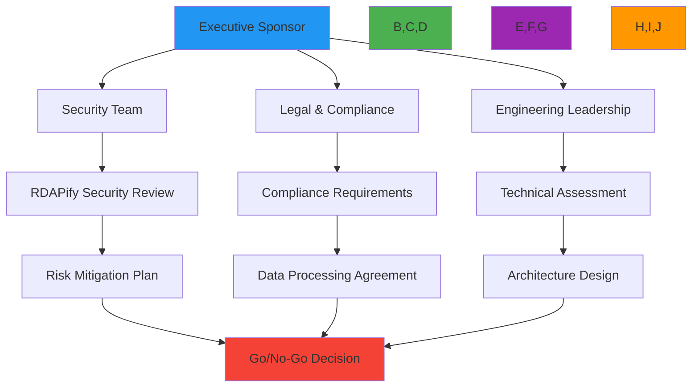

# دليل اعتماد المؤسسات

**الغرض**: دليل شامل للمؤسسات لاعتماد RDAPify بنجاح لمعالجة بيانات التسجيل مع التركيز على الأمان والامتثال وقابلية التوسع والتميز التشغيلي
**ذات صلة**: [دعم اتفاقية مستوى الخدمة](sla_support.md) | [معمارية متعددة المستأجرين](multi_tenant.md) | [تسجيل التدقيق](audit_logging.md) | [إقامة البيانات](../../security/data_residency.md)
**وقت القراءة**: 10 دقائق

## ملخص تنفيذي

يوفر RDAPify للمؤسسات حلاً آمناً ومتوافقاً وعالي الأداء لمعالجة بيانات التسجيل على نطاق واسع. يحدد هذا الدليل إطار اعتماد مُجرَّباً نُفِّذ بنجاح من قِبل شركات Fortune 500 والمؤسسات المالية والوكالات الحكومية حول العالم.

### فوائد الاعتماد الرئيسية
- **تقليل المخاطر**: القضاء على ثغرات SSRF ومخاطر كشف البيانات الشخصية الموجودة في تطبيقات WHOIS القديمة
- **تمكين الامتثال**: أدوات مدمجة لمتطلبات GDPR وCCPA وSOC 2 وISO 27001
- **الكفاءة التشغيلية**: تقليل تكاليف البنية التحتية بنسبة 40-60% مقارنة بصيانة تطبيقات RDAP/WHOIS المخصصة
- **سرعة المطورين**: تسريع تطوير الميزات بواجهات API متسقة وتوثيق شامل
- **استمرارية الأعمال**: اتفاقيات مستوى خدمة على مستوى المؤسسات مع ضمانات وقت تشغيل 99.99% وقدرات التعافي من الكوارث

### الجدول الزمني للاعتماد
| المرحلة | المدة | الأنشطة الرئيسية | مقاييس النجاح |
|--------|-------|----------------|--------------|
| التقييم | 2-4 أسابيع | جمع المتطلبات وتعيين الامتثال ومراجعة المعمارية | توثيق المتطلبات وتحديد ثغرات الامتثال |
| التجريب | 4-6 أسابيع | النشر المحدود واختبار التكامل والتحقق الأمني | تغطية اختبار 95%+، اجتياز المراجعة الأمنية |
| طرح الإنتاج | 2-4 أسابيع | هجرة تدريجية للحركة وإعداد المراقبة وتدريب الفريق | هجرة بدون توقف، اكتمال شهادة الفريق |
| التحسين | مستمر | ضبط الأداء وتوسيع الميزات وتحسين العمليات | تحسين الأداء 20%+، التوسع إلى حالات استخدام جديدة |

## إطار الاعتماد

### 1. مرحلة التقييم والتخطيط

#### استراتيجية مشاركة أصحاب المصلحة


#### مناطق التقييم الحرجة
| المنطقة | أسئلة التقييم | الأدوات والقوالب |
|--------|--------------|----------------|
| **الأمان** | ما هي متطلبات حماية SSRF؟ كيف تتعامل مع البيانات الشخصية في بيانات التسجيل؟ ما هي سياسات التحقق من الشهادات المطلوبة؟ | قائمة التحقق من متطلبات الأمان، قالب نموذج التهديد |
| **الامتثال** | ما الاختصاصات القضائية التي تتطلب اتفاقيات معالجة بيانات؟ ما سياسات الاحتفاظ المنطبقة على بيانات التسجيل؟ كيف تُعالَج طلبات الوصول إلى بيانات الموضوع؟ | ورقة عمل تعيين الامتثال، قالب DPA |
| **التقني** | ما هي اتفاقيات مستوى خدمة الأداء؟ ما معماريات النشر المدعومة؟ كيف تُعالَج تغييرات المخطط؟ | دليل التقييم التقني، قالب سجل قرار المعمارية |
| **التشغيلي** | ما المراقبة والتنبيه المطلوبان؟ كيف تُصعَّد الحوادث؟ ما مسؤوليات الاستعداد؟ | قالب دفتر تشغيل العمليات، خطة الاستجابة للحوادث |

#### تخطيط الموارد
```typescript
// src/enterprise/adoption-planner.ts
interface AdoptionResourcePlan {
  teamComposition: {
    securityEngineers: number;
    complianceOfficers: number;
    seniorDevelopers: number;
    devOpsEngineers: number;
    qaEngineers: number;
  };
  infrastructure: {
    environments: string[]; // ['dev', 'staging', 'prod']
    regions: string[];     // ['us-east-1', 'eu-west-1']
    redundancy: string;    // 'active-active', 'active-passive'
  };
  timeline: {
    assessment: number;    // weeks
    pilot: number;         // weeks
    rollout: number;       // weeks
    optimization: number;  // ongoing months
  };
  budget: {
    licensing: number;     // annual
    infrastructure: number; // monthly
    training: number;      // one-time
    consulting: number;    // one-time
  };
}

export class AdoptionPlanner {
  calculateResourcePlan(complexity: 'simple' | 'standard' | 'complex', scale: number): AdoptionResourcePlan {
    const basePlan = {
      teamComposition: {
        securityEngineers: complexity === 'complex' ? 2 : 1,
        complianceOfficers: complexity === 'complex' ? 2 : 1,
        seniorDevelopers: Math.max(2, Math.ceil(scale / 10)),
        devOpsEngineers: complexity === 'complex' ? 2 : 1,
        qaEngineers: Math.max(1, Math.floor(scale / 15))
      },
      infrastructure: {
        environments: ['dev', 'staging', 'prod'],
        regions: complexity === 'complex' ? ['us-east-1', 'eu-west-1', 'ap-southeast-1'] : ['us-east-1', 'eu-west-1'],
        redundancy: complexity === 'complex' ? 'active-active' : 'active-passive'
      },
      timeline: {
        assessment: complexity === 'complex' ? 4 : 2,
        pilot: complexity === 'complex' ? 6 : 4,
        rollout: complexity === 'complex' ? 4 : 2,
        optimization: 3
      },
      budget: {
        licensing: scale * (complexity === 'complex' ? 15000 : complexity === 'standard' ? 10000 : 5000),
        infrastructure: scale * (complexity === 'complex' ? 5000 : complexity === 'standard' ? 3000 : 1500),
        training: complexity === 'complex' ? 20000 : complexity === 'standard' ? 10000 : 5000,
        consulting: complexity === 'complex' ? 50000 : complexity === 'standard' ? 25000 : 10000
      }
    };

    // Scale adjustments
    if (scale > 100) {
      basePlan.timeline.assessment += 2;
      basePlan.timeline.pilot += 2;
      basePlan.teamComposition.seniorDevelopers += Math.floor(scale / 50);
    }

    return basePlan;
  }

  generateExecutiveSummary(plan: AdoptionResourcePlan, complexity: string, scale: number): string {
    return `
Executive Adoption Summary
===========================

Organization Complexity: ${complexity}
Deployment Scale: ${scale} domains/queries per day
Estimated Timeline: ${plan.timeline.assessment + plan.timeline.pilot + plan.timeline.rollout} weeks
Total Investment: $${(plan.budget.licensing +
                  plan.budget.infrastructure * 12 +
                  plan.budget.training +
                  plan.budget.consulting).toLocaleString()}/year

Key Resource Requirements:
• ${plan.teamComposition.seniorDevelopers} Senior Developers
• ${plan.teamComposition.securityEngineers} Security Engineers
• ${plan.teamComposition.complianceOfficers} Compliance Officers
• ${plan.teamComposition.devOpsEngineers} DevOps Engineers
• ${plan.teamComposition.qaEngineers} QA Engineers
    `;
  }
}
```

### 2. مرحلة التجريب والتحقق

#### قائمة فحص التحقق الأمني
| الفئة | عنصر الفحص | الحالة المطلوبة |
|------|------------|----------------|
| **حماية SSRF** | جميع طلبات الشبكة عبر المحدد المحمي | مُنفَّذ ومُختبَر |
| **اختزال البيانات الشخصية** | معالجة متوافقة مع GDPR لبيانات الاتصال | مُفعَّل بشكل افتراضي |
| **TLS** | التحقق من الشهادات مُفعَّل | لا يُسمح بالتجاوز أبداً |
| **التدقيق** | التسجيل الشامل لجميع استعلامات السجل | مُفعَّل ومُراجَع |
| **تحديد المعدل** | الحماية من إساءة استخدام السجل | إعداد مُخصَّص للمؤسسة |
| **التحكم في الوصول** | صلاحيات مستندة إلى الأدوار | مُدمَج مع موفر الهوية |

### 3. مرحلة الطرح للإنتاج

**نهج النشر التدريجي**:
1. **أسبوع 1-2**: نشر في بيئة التطوير مع فريق مصغَّر
2. **أسبوع 3-4**: توسيع نطاق التجريب بحركة إنتاج محدودة (5%)
3. **أسبوع 5-6**: زيادة تدريجية (25% → 50% → 100%)
4. **ما بعد الطرح**: مراقبة ومقارنة مستمرة

[← العودة إلى المؤسسات](../README.md)
