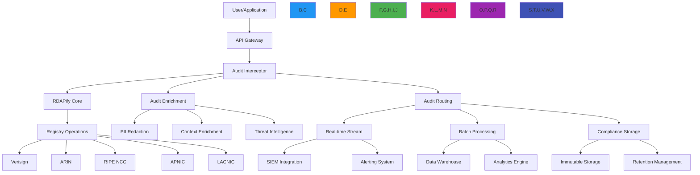

# معمارية تسجيل التدقيق

**الغرض**: دليل شامل لتطبيق أنظمة تسجيل تدقيق على مستوى المؤسسات مع RDAPify لضمان الامتثال التنظيمي والمراقبة الأمنية والرؤية التشغيلية لمعالجة بيانات التسجيل
**ذات صلة**: [معمارية متعددة المستأجرين](multi_tenant.md) | [دعم اتفاقية مستوى الخدمة](sla_support.md) | [إقامة البيانات](../../security/data_residency.md) | [إطار الامتثال](../../security/compliance_framework.md)
**وقت القراءة**: 8 دقائق

## نظرة عامة على معمارية تسجيل التدقيق

يوفر RDAPify معمارية تسجيل تدقيق موحدة تلتقط مسارات نشاط شاملة مع الحفاظ على حدود الامتثال الصارمة وخصائص الأداء:



### المبادئ الأساسية لتسجيل التدقيق
- **السجلات غير القابلة للتغيير**: لا يمكن تعديل سجلات التدقيق أو حذفها بعد الكتابة
- **حدود الامتثال**: تطبيق متطلبات التسجيل الخاصة بالاختصاص القضائي عند المصدر
- **الحفاظ على السياق**: السياق الكامل بما في ذلك هوية المستخدم والأذونات وتفاصيل الجلسة
- **حماية البيانات الشخصية**: الاختزال التلقائي للمعلومات الشخصية في مسارات التدقيق
- **دليل التلاعب**: التوقيعات التشفيرية وسلسلة حفظ الحقوق لسلامة الأدلة الجنائية
- **التوافق التنظيمي**: قوالب مُهيَّأة مسبقاً لمتطلبات GDPR وCCPA وSOC 2 وISO 27001

## أنماط التطبيق

### 1. محرك معالجة أحداث التدقيق
```typescript
// src/enterprise/audit-engine.ts
import { AuditEvent, ComplianceContext, SecurityContext } from '../types';
import { PIIRedactionEngine } from '../security/pii-redaction';
import { ThreatIntelligenceService } from '../security/threat-intelligence';
import { ComplianceEngine } from '../security/compliance';

export class AuditEngine {
  private piiRedaction: PIIRedactionEngine;
  private threatIntelligence: ThreatIntelligenceService;
  private complianceEngine: ComplianceEngine;
  private auditLoggers = new Map<string, AuditLogger>();

  constructor(options: {
    piiRedaction?: PIIRedactionEngine;
    threatIntelligence?: ThreatIntelligenceService;
    complianceEngine?: ComplianceEngine;
    loggers?: Record<string, AuditLogger>;
  } = {}) {
    this.piiRedaction = options.piiRedaction || new PIIRedactionEngine();
    this.threatIntelligence = options.threatIntelligence || new ThreatIntelligenceService();
    this.complianceEngine = options.complianceEngine || new ComplianceEngine();

    // Initialize default loggers
    this.initializeLoggers(options.loggers || {});
  }

  private initializeLoggers(loggers: Record<string, AuditLogger>) {
    // Real-time logger for security events
    this.auditLoggers.set('security', loggers.security || new SecurityAuditLogger());

    // Compliance logger for regulatory requirements
    this.auditLoggers.set('compliance', loggers.compliance || new ComplianceAuditLogger());

    // Operational logger for system monitoring
    this.auditLoggers.set('operational', loggers.operational || new OperationalAuditLogger());

    // Debug logger for development environments
    if (process.env.NODE_ENV !== 'production') {
      this.auditLoggers.set('debug', loggers.debug || new DebugAuditLogger());
    }
  }

  async processAuditEvent(event: AuditEvent, context: AuditContext): Promise<AuditResult> {
    try {
      // Enrich event with contextual information
      const enrichedEvent = await this.enrichAuditEvent(event, context);

      // Apply compliance transformations
      const compliantEvent = await this.complianceEngine.applyComplianceTransformations(enrichedEvent, context);

      // Route to appropriate loggers
      const results = await Promise.all(
        Array.from(this.auditLoggers.entries()).map(([type, logger]) =>
          this.routeToLogger(type, logger, compliantEvent, context)
        )
      );

      // Generate audit result
      return this.generateAuditResult(results, compliantEvent, context);
    } catch (error) {
      // Fallback to emergency logging
      await this.emergencyLogging(event, context, error);
      throw error;
    }
  }

  private async enrichAuditEvent(event: AuditEvent, context: AuditContext): Promise<EnrichedAuditEvent> {
    const enriched: EnrichedAuditEvent = {
      ...event,
      timestamp: event.timestamp || new Date().toISOString(),
      eventId: `audit-${Date.now()}-${Math.random().toString(36).slice(2, 8)}`,
      context: {
        ...context,
        sessionId: context.sessionId || this.generateSessionId(),
        userIdentity: await this.getUserIdentity(context),
        systemInfo: this.getSystemInfo(),
        threatScore: await this.threatIntelligence.getThreatScore(event, context),
        complianceLevel: this.getComplianceLevel(context)
      }
    };

    // Apply PII redaction
    enriched.context.redactedData = await this.piiRedaction.redactAuditData(enriched, context);

    // Add digital signature
    enriched.signature = await this.signAuditEvent(enriched);

    return enriched;
  }
}
```

### 2. أنواع أحداث التدقيق

| نوع الحدث | الوصف | مستوى التسجيل | الاحتفاظ |
|----------|-------|--------------|---------|
| **استعلام السجل** | جميع عمليات استعلام RDAP | تشغيلي | 90 يوم |
| **حدث أمني** | محاولات SSRF، فشل التحقق من الشهادات | أمني | 1 سنة |
| **انتهاك الامتثال** | عمليات بيانات شخصية مشبوهة | امتثال | 3 سنوات |
| **وصول المستخدم** | جميع عمليات تسجيل الدخول والوصول إلى البيانات | امتثال | 1 سنة |
| **تصدير البيانات** | جميع عمليات تصدير السجلات والتقارير | امتثال | 5 سنوات |
| **تغيير التهيئة** | التعديلات على إعدادات النظام | تدقيق | 5 سنوات |

### 3. التكامل مع SIEM
```typescript
// src/enterprise/siem-integration.ts
export class SIEMIntegration {
  async forwardSecurityEvents(
    events: AuditEvent[],
    config: SIEMConfig
  ): Promise<ForwardingResult> {
    // Format events for SIEM consumption
    const siemEvents = events
      .filter(e => e.severity >= config.minimumSeverity)
      .map(e => this.formatForSIEM(e, config.format));

    // Apply final PII scrubbing before SIEM forwarding
    const scrubedEvents = siemEvents.map(e =>
      this.scrubSensitiveData(e, config.dataPolicy)
    );

    // Forward via configured transport
    return this.transport.send(scrubedEvents, config);
  }

  private formatForSIEM(event: AuditEvent, format: 'CEF' | 'LEEF' | 'JSON'): string {
    switch (format) {
      case 'CEF':
        return `CEF:0|RDAPify|AuditEngine|1.0|${event.eventType}|${event.description}|${event.severity}|` +
          `cs1=${event.domain} cs1Label=domain ` +
          `cs2=${event.registrar} cs2Label=registrar ` +
          `cat=${event.category}`;
      case 'JSON':
        return JSON.stringify(event);
      default:
        return JSON.stringify(event);
    }
  }
}
```

### 4. إرشادات الاحتفاظ بالبيانات

| اللائحة | الحد الأدنى للاحتفاظ | الحد الأقصى للاحتفاظ | ملاحظات |
|---------|---------------------|---------------------|---------|
| **GDPR** | مدة الضرورة فقط | بموجب القانون | حقوق المحو تنطبق |
| **SOC 2** | 1 سنة | 7 سنوات | مطلوب للتدقيق |
| **ISO 27001** | 1 سنة | حسب السياسة | مراجعة سنوية مطلوبة |
| **PCI DSS** | 1 سنة | 5 سنوات | ينطبق على بيانات الدفع |
| **قانوني** | حتى حل النزاع | بموجب القانون | مقيّد بطلب قانوني |

[← العودة إلى المؤسسات](../README.md)
