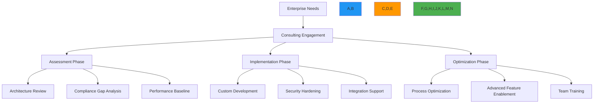

# خيارات استشارات المؤسسات

> **ميزة مخطط لها** — يصف هذا التوثيق وظائف قيد التطوير وغير متوفرة في الإصدار الحالي (v0.1.8). قد تتغير التفاصيل قبل الإطلاق.

**الغرض**: دليل شامل لخدمات استشارات المؤسسات في RDAPify لمراجعة المعمارية ودعم التطبيق وتحقق الامتثال وتحسين أنظمة معالجة بيانات التسجيل
**ذات صلة**: [دليل الاعتماد](adoption_guide.md) | [دعم اتفاقية مستوى الخدمة](sla_support.md) | [إقامة البيانات](../../security/data_residency.md) | [إطار الامتثال](../../security/compliance_framework.md)
**وقت القراءة**: 7 دقائق

## نظرة عامة على خدمة الاستشارات

يوفر RDAPify خدمات استشارات متخصصة للمؤسسات لمساعدة المؤسسات على تطبيق وتحسين وصيانة أنظمة معالجة بيانات التسجيل بتوجيه خبراء من قدامى المحترفين في الصناعة:



### المبادئ الأساسية للاستشارات
- **التركيز على النتائج**: تقاس التعاقدات بالنتائج التجارية وليس فقط المخرجات التقنية
- **نقل المعرفة**: ضمان بناء فريقك خبرة دائمة من خلال التعاون العملي
- **الأمان أولاً**: جميع التوصيات تُعطي الأولوية للأمان والامتثال بالتصميم
- **الحلول القابلة للتوسع**: معمارية مصممة للنمو من اليوم الأول
- **الاستقلالية عن البائع**: نصيحة موضوعية بدون تحيز تقني أو أجندات خفية

## عروض الخدمات

### 1. مراجعة وتصميم المعمارية
```typescript
// src/enterprise/architecture-review.ts
export interface ArchitectureReviewScope {
  infrastructure: boolean;
  securityControls: boolean;
  dataFlow: boolean;
  complianceAlignment: boolean;
  scalabilityAssessment: boolean;
  disasterRecovery: boolean;
}

export interface ArchitectureReviewDeliverables {
  executiveSummary: string;
  riskAssessment: RiskAssessment[];
  architectureDiagrams: ArchitectureDiagram[];
  gapAnalysis: GapAnalysis[];
  remediationPlan: RemediationPlan;
  complianceValidation: ComplianceValidation[];
}

export class ArchitectureReviewService {
  private expertPool = new Map<string, ExpertProfile>();

  constructor(private options: ArchitectureReviewOptions = {}) {
    this.loadExpertProfiles();
  }

  private loadExpertProfiles() {
    // Load expert profiles based on specialization
    this.expertPool.set('networking', {
      name: 'Sarah Chen',
      title: 'Principal Network Engineer',
      expertise: ['DNS infrastructure', 'BGP routing', 'DDoS mitigation', 'TLS optimization'],
      certifications: ['CCIE', 'AWS Networking Specialty', 'GCP Professional Network Engineer'],
      experience: '15+ years in global network operations'
    });

    this.expertPool.set('security', {
      name: 'Marcus Johnson',
      title: 'Lead Security Architect',
      expertise: ['SSRF protection', 'PII redaction', 'threat modeling', 'compliance validation'],
      certifications: ['CISSP', 'CISM', 'OSCP', 'GDPR Practitioner'],
      experience: '12+ years in security architecture for financial services'
    });

    this.expertPool.set('compliance', {
      name: 'Elena Rodriguez',
      title: 'Compliance Director',
      expertise: ['GDPR Article 32', 'CCPA Section 1798.100', 'NIST frameworks', 'audit preparation'],
      certifications: ['CIPP/E', 'CIPM', 'FIP', 'ISO 27001 Lead Auditor'],
      experience: '10+ years in regulatory compliance for technology companies'
    });
  }

  async conductReview(scope: ArchitectureReviewScope, context: ReviewContext): Promise<ArchitectureReviewDeliverables> {
    // Assign appropriate experts based on scope
    const experts = this.assignExperts(scope);

    // Conduct comprehensive review
    const findings = await this.executeReviewPhases(experts, scope, context);

    // Generate deliverables
    return this.generateDeliverables(findings, context);
  }
}
```

#### حزم مراجعة المعمارية
| الحزمة | المدة | الخبراء | المخرجات | الاستثمار |
|--------|-------|---------|---------|----------|
| **الأساسية** | 3-5 أيام | مهندس معمارة أول | تقرير تقييم المعمارية، تحديد المخاطر الحرجة، التوصيات ذات الأولوية العالية | 15,000-25,000 دولار |
| **الشاملة** | 1-2 أسبوع | 3 خبراء في المجال | توثيق كامل للمعمارية، تحليل ثغرات الأمان والامتثال، خارطة طريق تطبيق مفصلة، خطة تحسين الأداء | 40,000-65,000 دولار |
| **للمؤسسات** | 3-4 أسابيع | 5+ متخصصين | تصميم نظام شامل، التحقق من الامتثال التنظيمي، تخطيط التعافي من الكوارث، برنامج نقل معرفة الفريق، دعم 30 يوم بعد التعاقد | 90,000-150,000 دولار |

### 2. دعم التطبيق
```typescript
// src/enterprise/implementation-support.ts
export interface ImplementationEngagement {
  phases: ImplementationPhase[];
  teamComposition: TeamComposition;
  successMetrics: SuccessMetric[];
  timeline: Timeline;
  budget: BudgetRange;
}

export interface ImplementationPhase {
  name: string;
  duration: string;
  activities: string[];
  deliverables: string[];
  successCriteria: string[];
}

export class ImplementationSupportService {
  createEngagementPlan(
    requirements: EnterpriseRequirements,
    timeline: Timeline
  ): ImplementationEngagement {
    const phases: ImplementationPhase[] = [
      {
        name: 'Foundation Setup',
        duration: '2 weeks',
        activities: [
          'Environment configuration and validation',
          'Security control implementation',
          'Compliance framework setup',
          'Monitoring and alerting configuration'
        ],
        deliverables: [
          'Configured RDAPify deployment',
          'Security review sign-off',
          'Compliance documentation',
          'Runbook and operations guide'
        ],
        successCriteria: [
          'All security tests passing',
          'GDPR compliance validated',
          'Performance SLAs met'
        ]
      }
    ];

    return {
      phases,
      teamComposition: this.calculateTeamComposition(requirements),
      successMetrics: this.defineSuccessMetrics(requirements),
      timeline,
      budget: this.calculateBudget(requirements, timeline)
    };
  }
}
```

### 3. برامج التدريب وبناء الكفاءات

| البرنامج | المدة | المشاركون | المحتوى | الشهادة |
|---------|-------|----------|---------|---------|
| **التشغيل الأساسي** | يومان | المطورون والمشغلون | تشغيل RDAPify وإعداده ومراقبته | شهادة عامل RDAPify |
| **الأمان والامتثال** | 3 أيام | فريق الأمان، مسؤولو الامتثال | حماية SSRF، اختزال البيانات الشخصية، التدقيق | شهادة محترف الأمان |
| **هندسة المؤسسات** | 5 أيام | كبار المهندسين | معمارية متعددة المستأجرين، الأداء على نطاق واسع، نمذجة التهديدات | شهادة مهندس المؤسسات |
| **تدريب المدربين** | 3 أيام | قادة الفريق | تدريب المدربين للتوسع الداخلي | شهادة المدرب المعتمد |

[← العودة إلى المؤسسات](../README.md)
