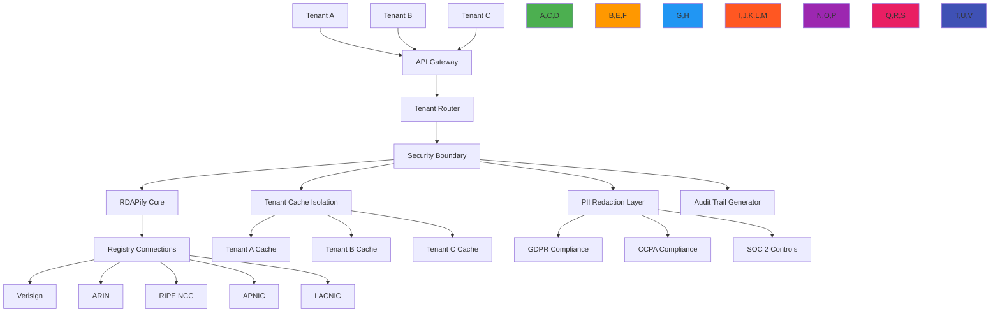

# دليل المعمارية متعددة المستأجرين

**الغرض**: دليل شامل لتطبيق معماريات آمنة وقابلة للتوسع ومتوافقة متعددة المستأجرين مع RDAPify لمعالجة بيانات التسجيل عبر حدود تنظيمية متعددة
**ذات صلة**: [دعم اتفاقية مستوى الخدمة](sla_support.md) | [دليل الاعتماد](adoption_guide.md) | [إقامة البيانات](../../security/data_residency.md) | [تسجيل التدقيق](audit_logging.md)
**وقت القراءة**: 9 دقائق

## نظرة عامة على المعمارية متعددة المستأجرين

توفر المعمارية متعددة المستأجرين في RDAPify منصة موحدة لمعالجة بيانات التسجيل عبر الحدود التنظيمية مع الحفاظ على العزل الصارم وحدود الامتثال وضمانات الأداء:



### المبادئ الأساسية لتعدد المستأجرين
- **ضمان عزل البيانات**: صفر تسرب بيانات بين المستأجرين من خلال الحدود التشفيرية والمعمارية
- **تطبيق حدود الامتثال**: تطبيق قواعد الامتثال الخاصة بالاختصاص القضائي على مستوى المستأجر
- **عدالة الموارد**: اتفاقيات مستوى خدمة أداء يمكن التنبؤ بها بصرف النظر عن نشاط المستأجرين الآخرين
- **انتشار سياق الأمان**: سياق أمان المستأجر يتدفق عبر خط أنابيب المعالجة بالكامل
- **الاستقلالية التشغيلية**: يمكن إدارة المستأجرين وترقيتهم واستكشاف أخطائهم بشكل مستقل
- **شفافية التكاليف**: إمكانات واضحة لنسب الموارد والفوترة لكل مستأجر

## أنماط التطبيق

### 1. انتشار سياق المستأجر
```typescript
// src/enterprise/tenant-context.ts
import { Session } from 'express-session';
import { IncomingMessage } from 'http';

export interface TenantContext {
  id: string;                    // Unique tenant identifier
  name: string;                  // Human-readable tenant name
  dataResidency: string[];       // Allowed geographic regions for data storage
  complianceProfile: {
    gdpr: boolean;               // GDPR compliance enabled
    ccpa: boolean;               // CCPA compliance enabled
    pdpl: boolean;               // Saudi PDPL compliance
  };
  securityProfile: {
    allowPrivateIPs: boolean;    // SSRF protection settings
    redactPII: boolean;          // PII redaction level
    maxConcurrentRequests: number; // Rate limiting configuration
    certificatePinning: boolean; // TLS certificate pinning
  };
  isolationLevel: 'strict' | 'standard' | 'development'; // Isolation boundaries
  encryptionKey?: string;        // Tenant-specific encryption key (rotated)
  auditTrail: boolean;           // Audit logging requirements
  businessCriticality: 'critical' | 'high' | 'medium' | 'low'; // SLA tier
}

export class TenantContextManager {
  private static instance: TenantContextManager;
  private contextStore = new WeakMap<IncomingMessage | Session, TenantContext>();

  // Singleton pattern
  public static getInstance(): TenantContextManager {
    if (!TenantContextManager.instance) {
      TenantContextManager.instance = new TenantContextManager();
    }
    return TenantContextManager.instance;
  }

  // Extract tenant context from HTTP request
  public extractFromRequest(req: IncomingMessage): TenantContext {
    // Extract from JWT token
    const token = this.extractToken(req);
    if (token) {
      return this.validateToken(token);
    }

    // Extract from API key
    const apiKey = this.extractAPIKey(req);
    if (apiKey) {
      return this.validateAPIKey(apiKey);
    }

    // Fallback to default tenant (development only)
    if (process.env.NODE_ENV === 'development') {
      return this.getDefaultTenant();
    }

    throw new Error('Tenant context required but not provided');
  }

  // Enforce isolation boundaries
  public enforceIsolation(context: TenantContext, data: any, registry: string): any {
    // Apply tenant-specific PII redaction
    if (context.securityProfile.redactPII) {
      data = this.applyPIIRedaction(data, context);
    }

    // Enforce data residency requirements
    if (context.dataResidency.length > 0) {
      data = this.enforceDataResidency(data, context.dataResidency, registry);
    }

    // Apply tenant-specific security policies
    data = this.applySecurityPolicies(data, context);

    return data;
  }

  private applyPIIRedaction(data: any, context: TenantContext): any {
    // Context-aware PII redaction based on tenant compliance profile
    const redactionPolicy = {
      gdpr: context.complianceProfile.gdpr,
      ccpa: context.complianceProfile.ccpa,
      fields: context.securityProfile.redactPII ?
        ['email', 'tel', 'adr', 'fn', 'org'] : [],
      patterns: context.securityProfile.redactPII ?
        [/contact/i, /personal/i, /address/i] : []
    };

    return redactPII(data, redactionPolicy);
  }
}
```

### 2. عزل التخزين المؤقت للمستأجرين
```typescript
// src/enterprise/tenant-cache.ts
export class TenantIsolatedCache {
  private caches = new Map<string, LRUCache>();

  getCacheForTenant(tenantId: string, options: CacheOptions): LRUCache {
    if (!this.caches.has(tenantId)) {
      // Create isolated cache instance for this tenant
      this.caches.set(tenantId, new LRUCache({
        max: options.maxSize || 1000,
        ttl: options.ttl || 3600000,
        // Tenant-specific encryption for cached data
        serialize: (value) => this.encryptForTenant(value, tenantId),
        deserialize: (value) => this.decryptForTenant(value, tenantId)
      }));
    }

    return this.caches.get(tenantId)!;
  }

  invalidateTenantCache(tenantId: string): void {
    const cache = this.caches.get(tenantId);
    if (cache) {
      cache.clear();
    }
  }

  async getTenantCacheStats(tenantId: string): Promise<CacheStats> {
    const cache = this.caches.get(tenantId);
    if (!cache) {
      return { size: 0, hitRate: 0, missRate: 0 };
    }

    return {
      size: cache.size,
      hitRate: cache.hits / (cache.hits + cache.misses),
      missRate: cache.misses / (cache.hits + cache.misses)
    };
  }

  private encryptForTenant(value: any, tenantId: string): string {
    // Encrypt cached data with tenant-specific key
    const key = this.getEncryptionKey(tenantId);
    return encrypt(JSON.stringify(value), key);
  }

  private decryptForTenant(encrypted: string, tenantId: string): any {
    const key = this.getEncryptionKey(tenantId);
    return JSON.parse(decrypt(encrypted, key));
  }
}
```

### 3. هياكل إدارة المستأجرين

| مستوى العزل | الوصف | حالة الاستخدام | مستوى الأمان |
|------------|-------|---------------|-------------|
| **صارم** | عزل كامل للموارد لكل مستأجر | البيانات المالية والحكومية الحرجة | أعلى |
| **قياسي** | موارد مشتركة مع عزل منطقي | بيئات المؤسسات العامة | عالي |
| **تطوير** | حد أدنى من العزل للاختبار | بيئات التطوير والاختبار | منخفض |

[← العودة إلى المؤسسات](../README.md)
