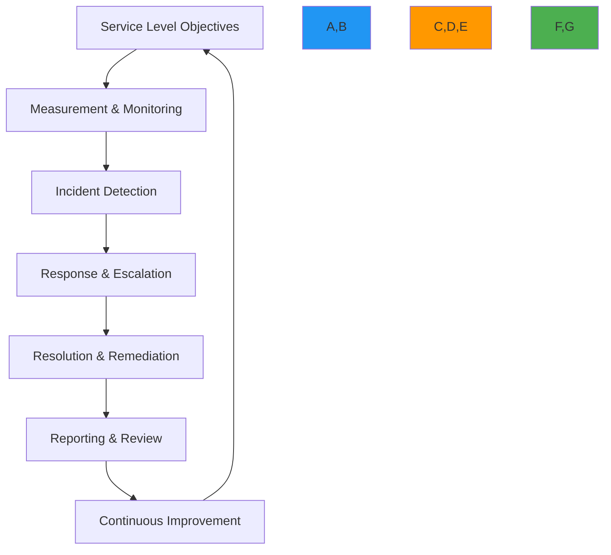

# دليل دعم اتفاقية مستوى الخدمة

> **ميزة مخطط لها** — يصف هذا التوثيق وظائف قيد التطوير وغير متوفرة في الإصدار الحالي (v0.1.8). قد تتغير التفاصيل قبل الإطلاق.

**الغرض**: دليل شامل لتطبيق وإدارة اتفاقيات مستوى الخدمة (SLA) للمؤسسات مع RDAPify، لضمان الأداء المتوقع والاستجابة السريعة للحوادث واستمرارية الأعمال لمعالجة بيانات التسجيل المهمة
**ذات صلة**: [دليل الاعتماد](adoption_guide.md) | [معمارية متعددة المستأجرين](multi_tenant.md) | [تسجيل التدقيق](audit_logging.md) | [إقامة البيانات](../../security/data_residency.md)
**وقت القراءة**: 8 دقائق

## إطار SLA للمؤسسات

يوفر إطار SLA في RDAPify هيكلاً شاملاً لالتزامات خدمة المؤسسات مع مقاييس واضحة ومسارات تصعيد وإجراءات معالجة:



### مبادئ SLA الأساسية
- **أهداف مدفوعة بالأعمال**: أهداف SLA مُوافَقة مع حرجية الأعمال بدلاً من القدرات التقنية
- **قابلة للقياس وشفافة**: جميع المقاييس مُجمَّعة ومُخزَّنة ومُبلَّغ عنها مع مسارات تدقيق كاملة
- **استجابة متوقعة**: مسارات تصعيد واضحة مع أوقات استجابة مضمونة حسب الشدة
- **معالجة ذات معنى**: رصيد الخدمة مرتبط بالتأثير الفعلي على الأعمال وليس فقط بالمقاييس التقنية
- **التحسين المستمر**: دورات مراجعة منتظمة مع بنود عمل موثقة وتحليل الاتجاهات

## هيكل SLA ومكوناته

### 1. أهداف مستوى الخدمة (SLOs)
```typescript
// src/enterprise/sla-definition.ts
export interface SLADefinition {
  serviceTier: 'standard' | 'business' | 'enterprise' | 'mission-critical';
  uptimeSLA: UptimeSLA;
  performanceSLA: PerformanceSLA;
  supportSLA: SupportSLA;
  dataSLA: DataSLA;
  complianceSLA: ComplianceSLA;
  remediationPolicy: RemediationPolicy;
  exclusions: SLAExclusion[];
  measurementMethodology: MeasurementMethodology;
}

export interface UptimeSLA {
  target: number; // Percentage (e.g., 99.95)
  measurementWindow: string; // 'monthly', 'quarterly'
  calculationMethod: 'total-minutes' | 'sampled-minutes';
  downtimeAllowance: {
    maintenance: number; // Minutes per month
    forceMajeure: number; // Minutes per quarter
  };
}

export interface PerformanceSLA {
  p95Latency: {
    domainQuery: number; // milliseconds
    batchProcessing: number; // milliseconds per domain
    apiResponse: number; // milliseconds
  };
  throughput: {
    queriesPerSecond: number;
    domainsPerHour: number;
  };
  errorRate: {
    maxPercentage: number; // 0.1 = 0.1%
    calculationWindow: string; // 'rolling-5m', 'hourly'
  };
}

export interface SupportSLA {
  responseTimes: {
    critical: number; // minutes
    high: number; // minutes
    medium: number; // hours
    low: number; // business days
  };
  resolutionTimes: {
    critical: number; // hours
    high: number; // business hours
    medium: number; // business days
    low: number; // business days
  };
  escalationPath: {
    l1: ContactInfo;
    l2: ContactInfo;
    l3: ContactInfo;
    executive: ContactInfo;
  };
  supportChannels: string[]; // 'phone', 'email', 'chat', 'portal'
}

export interface DataSLA {
  dataFreshness: number; // minutes
  dataAccuracy: number; // percentage
  dataRetention: {
    minimumDays: number;
    maximumDays: number;
  };
  dataRecovery: {
    rto: number; // Recovery Time Objective in minutes
    rpo: number; // Recovery Point Objective in minutes
  };
}

export interface ComplianceSLA {
  auditResponseTime: number; // business days
  breachNotificationTime: number; // hours
  dataSubjectRequestTime: number; // business days
  regulatoryReportingTime: number; // business days
}

export class SLAManager {
  private slaDefinitions = new Map<string, SLADefinition>();
  private currentMetrics = new Map<string, SLAMetrics>();
  private incidents = new Map<string, SLAIncident[]>();

  constructor(private options: SLAOptions = {}) {
    this.loadDefaultSLAs();
  }

  private loadDefaultSLAs() {
    // Enterprise tier SLA
    this.slaDefinitions.set('enterprise', {
      serviceTier: 'enterprise',
      uptimeSLA: {
        target: 99.99,
        measurementWindow: 'monthly',
        calculationMethod: 'sampled-minutes',
        downtimeAllowance: {
          maintenance: 60, // 1 hour per month
          forceMajeure: 240 // 4 hours per quarter
        }
      },
      performanceSLA: {
        p95Latency: {
          domainQuery: 500,
          batchProcessing: 200,
          apiResponse: 300
        },
        throughput: {
          queriesPerSecond: 100,
          domainsPerHour: 360000
        },
        errorRate: {
          maxPercentage: 0.1,
          calculationWindow: 'rolling-5m'
        }
      }
    });
  }
}
```

### 2. مستويات SLA ومعايير الأداء

| المستوى | هدف وقت التشغيل | كمون P95 | وقت الاستجابة الحرج | الدعم |
|--------|----------------|---------|---------------------|-------|
| **قياسي** | 99.9% | < 1000 مللي ثانية | 4 ساعات | البريد الإلكتروني فقط |
| **للأعمال** | 99.95% | < 750 مللي ثانية | 2 ساعة | البريد الإلكتروني + الدردشة |
| **للمؤسسات** | 99.99% | < 500 مللي ثانية | 30 دقيقة | الهاتف + البريد + الدردشة + البوابة |
| **مهم للمهمة** | 99.999% | < 250 مللي ثانية | 15 دقيقة | 24/7 خط ساخن مخصص |

### 3. إجراءات الاستجابة للحوادث
```typescript
// src/enterprise/incident-response.ts
export class IncidentResponseManager {
  async handleIncident(
    incident: SLAIncident,
    context: TenantContext
  ): Promise<IncidentResponse> {
    // Classify incident severity
    const severity = this.classifyIncident(incident, context);

    // Get SLA definition for this tenant
    const sla = await this.getSLADefinition(context.id);

    // Determine response requirements
    const responseRequirements = {
      maxResponseTime: sla.supportSLA.responseTimes[severity],
      maxResolutionTime: sla.supportSLA.resolutionTimes[severity],
      escalationPath: sla.supportSLA.escalationPath,
      notificationRequirements: this.getNotificationRequirements(severity, context)
    };

    // Trigger notifications
    await this.notifyStakeholders(incident, severity, responseRequirements, context);

    // Create incident record
    const record = await this.createIncidentRecord(incident, severity, responseRequirements);

    // Start SLA timer
    await this.startSLATimer(record.id, responseRequirements);

    return {
      incidentId: record.id,
      severity,
      responseDeadline: new Date(Date.now() + responseRequirements.maxResponseTime * 60000).toISOString(),
      resolutionDeadline: new Date(Date.now() + responseRequirements.maxResolutionTime * 60000 * 60).toISOString(),
      assignedTeam: this.assignTeam(severity, context)
    };
  }

  private classifyIncident(incident: SLAIncident, context: TenantContext): SeverityLevel {
    // Critical: complete service outage or data breach
    if (incident.type === 'outage' || incident.type === 'data_breach') {
      return 'critical';
    }

    // High: significant performance degradation or security event
    if (incident.impact > 0.5 || incident.type === 'security_event') {
      return 'high';
    }

    // Medium: partial degradation
    if (incident.impact > 0.2) {
      return 'medium';
    }

    return 'low';
  }
}
```

### 4. سياسة رصيد الخدمة

| حجم انتهاك SLA | رصيد الخدمة | طريقة الحساب |
|---------------|------------|--------------|
| وقت التشغيل 99.0-99.9% | 10% من الرسوم الشهرية | رصيد تلقائي |
| وقت التشغيل 95-99.0% | 25% من الرسوم الشهرية | رصيد تلقائي |
| وقت التشغيل < 95% | 50% من الرسوم الشهرية | طلب يدوي |
| انتهاك SLA الأمان | 100% من الرسوم الشهرية | مراجعة قانونية |
| انتهاك SLA الامتثال | مخصص حسب تأثير الأعمال | تفاوض |

[← العودة إلى المؤسسات](../README.md)
