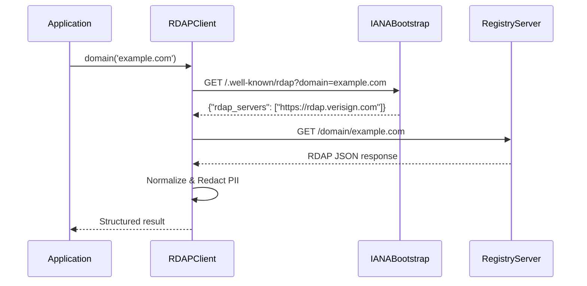

# استعلامك الأول مع RDAPify

> **الهدف:** تنفيذ وفهم أول استعلام RDAP مع الحمايات الكاملة للخصوصية
> **الوقت المطلوب:** 3-5 دقائق
> **المتطلبات الأساسية:** معرفة أساسية بـ Node.js/JavaScript وتثبيت RDAPify [مسبقًا](./installation.md)
> **ذات صلة:** [البدء السريع في 5 دقائق](./five-minutes.md) | [المفاهيم الأساسية](../core-concepts/what-is-rdap.md)

---

## فهم أول استعلام

قبل كتابة الكود، دعنا نفهم تدفق البروتوكول في استعلام RDAP:



يُظهر هذا المخطط التدفق الكامل:
1. تطلب تطبيقك بيانات لنطاق ما
2. يستعلم RDAPify خادم بوتستراب IANA للعثور على السجل الصحيح
3. يستعلم RDAPify نقطة نهاية RDAP الخاصة بالسجل
4. تُعيَّر الاستجابة إلى تنسيق متسق
5. تُحجب المعلومات الشخصية تلقائيًا للامتثال
6. تتلقى استجابة نظيفة ومنظمة

---

## إعداد العميل

أنشئ ملفًا باسم `first-query.js` بهذا الإعداد الآمن:

```javascript
import { RDAPClient } from 'rdapify';

// تهيئة العميل بإعدادات افتراضية تحمي الخصوصية
const client = new RDAPClient({
  // حماية الخصوصية (مفعلة بشكل افتراضي)
  privacy: true,

  // إعدادات الأمان

  // إعدادات الموثوقية
  timeout: 8000, // 8 ثوانٍ
  retry: { maxAttempts: 2 },

  // التخزين المؤقت لتقليل الحمل على السجل
  cache: {
    ttl: 3600, // ساعة واحدة
    maxSize: 100
  }
});

console.log('✅ RDAP client initialized with security defaults');
```

> **ملاحظة أمنية:** هذه الإعدادات الافتراضية مُختارة بعناية لتلبية متطلبات أمان المؤسسات. لا تُعطِّل `privacy` أبدًا دون أساس قانوني موثق وموافقة مسؤول حماية البيانات.

---

## تنفيذ الاستعلام الأول

أضف هذا الكود إلى ملف `first-query.js`:

```javascript
async function lookupDomain(domain) {
  console.log(`🔍 Querying RDAP data for: ${domain}`);

  try {
    // تنفيذ الاستعلام مع معالجة كاملة للأخطاء
    const result = await client.domain(domain);

    console.log('✅ Query successful!');
    console.log('\n📋 Normalized response structure:');
    console.log(JSON.stringify({
      domain: result.domain,
      registrar: result.registrar,
      nameservers: result.nameservers,
      events: result.events.map(e => ({
        action: e.action,
        date: e.date
      })),
      // ملاحظة: معلومات المسجِّل محجوبة بشكل افتراضي
      registrant: result.registrant
    }, null, 2));

    return result;
  } catch (error) {
    console.error('❌ Query failed with error:');
    console.error(`• Type: ${error.name}`);
    console.error(`• Code: ${error.code || 'UNKNOWN'}`);
    console.error(`• Message: ${error.message}`);
    console.error(`• Registry URL: ${error.registryUrl || 'N/A'}`);

    // تضمين تفاصيل التصحيح إذا كانت متاحة
    if (error.details) {
      console.error('• Details:', JSON.stringify(error.details, null, 2));
    }

    // في بيئة الإنتاج، قد ترغب في إعادة الطرح أو المعالجة بشكل مختلف
    throw error;
  }
}

// التنفيذ مع نطاق اختباري (آمن للعرض العام)
lookupDomain('example.com')
  .then(() => console.log('\n🎉 First query completed successfully!'))
  .catch(() => process.exit(1));
```

تشغيل الكود:
```bash
node first-query.js
```

---

## فهم الاستجابة

### مثال على المخرجات (محجوب للخصوصية)
```json
{
  "domain": "example.com",
  "registrar": "REDACTED",
  "registrant": {
    "name": "REDACTED",
    "organization": "Internet Corporation for Assigned Names and Numbers",
    "email": "REDACTED@redacted.invalid",
    "phone": "REDACTED",
    "address": [
      "REDACTED",
      "REDACTED, REDACTED REDACTED",
      "REDACTED"
    ]
  },
  "nameservers": [
    "a.iana-servers.net",
    "b.iana-servers.net"
  ],
  "events": [
    {
      "action": "registration",
      "date": "1995-08-14T04:00:00Z"
    },
    {
      "action": "last changed",
      "date": "2023-08-14T07:01:44Z"
    },
    {
      "action": "expiration",
      "date": "2024-08-13T04:00:00Z"
    }
  ],
  "status": [
    "client delete prohibited",
    "client transfer prohibited",
    "client update prohibited"
  ],
  "rawResponse": false
}
```

### شرح بنية الاستجابة
| الحقل | الوصف | حالة الخصوصية |
|-------|-------------|----------------|
| `domain` | اسم النطاق المستعلَم عنه | بيانات عامة |
| `registrar` | معلومات مشغّل السجل | محجوب بشكل افتراضي |
| `registrant` | معلومات مالك النطاق | محجوب بالكامل (بيانات شخصية) |
| `nameservers` | خوادم DNS للنطاق | بيانات عامة |
| `events` | أحداث دورة حياة التسجيل | التواريخ محفوظة، الجهات محجوبة |
| `status` | علامات حالة النطاق | بيانات عامة |
| `rawResponse` | الاستجابة الأصلية من الخادم (إذا كانت مفعَّلة) | معطل بشكل افتراضي |

---

## الخصوصية والامتثال بعمق

يتعامل RDAPify تلقائيًا مع حجب البيانات الشخصية (PII):

```javascript
// خلف الكواليس: عملية حجب البيانات الشخصية
const redactionRules = {
  email: (value) => 'REDACTED@redacted.invalid',
  phone: (value) => 'REDACTED',
  name: (value) => 'REDACTED',
  address: (value) => ['REDACTED', 'REDACTED, REDACTED REDACTED', 'REDACTED'],
  organization: (value) => value.includes('private') ? 'REDACTED' : value
};

// يحدث هذا تلقائيًا في خط أنابيب التعيير
const safeResult = applyRedactionRules(rawResult, redactionRules);
```

**الأثر على الامتثال:**
- المادة 5(1)(c) من اللائحة GDPR - مبدأ تقليل البيانات
- دعم "الحق في الحذف" وفق CCPA من خلال إدارة الذاكرة المؤقتة
- حمايات COPPA للتطبيقات الموجهة للأطفال
- تقليل سطح المسؤولية القانونية لتطبيقك

> **تذكير هام:** لا تُعطِّل حجب البيانات الشخصية أبدًا دون أساس قانوني موثق واستشارة مسؤول حماية البيانات.

---

## أنماط معالجة الأخطاء

يمكن أن تفشل استعلامات RDAP لأسباب عديدة. دعنا نحسّن معالجة الأخطاء:

```javascript
async function robustDomainLookup(domain) {
  try {
    return await client.domain(domain);
  } catch (error) {
    // معالجة أنواع محددة من الأخطاء
    switch (error.code) {
      case 'RDAP_NOT_FOUND':
        console.warn(`Domain not found in RDAP system: ${domain}`);
        return null;

      case 'RDAP_RATE_LIMITED':
        console.error('⚠️ Registry rate limit exceeded. Implement exponential backoff.');
        throw new Error('Temporary rate limit exceeded. Please try again later.');

      case 'RDAP_TIMEOUT':
        console.error('⚠️ Query timed out. Consider increasing timeout or checking network connectivity.');
        throw error;

      case 'RDAP_REGISTRY_UNAVAILABLE':
        console.error('⚠️ Registry server unavailable. Implement fallback to WHOIS if critical.');
        // الرجوع إلى WHOIS (يتطلب إعدادًا إضافيًا)
        return await fallbackToWhois(domain);

      default:
        console.error(`Unexpected error querying ${domain}:`, error);
        throw error;
    }
  }
}
```

رموز الأخطاء الشائعة التي يجب التعامل معها:
| رمز الخطأ | السبب | الإجراء الموصى به |
|------------|-------|---------------------|
| `RDAP_NOT_FOUND` | النطاق غير مسجَّل أو غير موجود في نظام RDAP | الرجوع إلى WHOIS أو إبلاغ المستخدم |
| `RDAP_RATE_LIMITED` | طلبات كثيرة جدًا للسجل | تطبيق تراجع أسي |
| `RDAP_TIMEOUT` | استجابة بطيئة من الشبكة أو السجل | زيادة المهلة الزمنية أو تطبيق إعادة المحاولة |
| `RDAP_REGISTRY_UNAVAILABLE` | خادم السجل معطل | تطبيق آليات الرجوع |
| `RDAP_INVALID_RESPONSE` | السجل أعاد بيانات مشوهة | الإبلاغ للسجل، استخدام البيانات المؤقتة إن توفرت |
| `RDAP_SSRF_ATTEMPT` | محاولة وصول إلى الشبكة الداخلية | حجب الطلب، تدقيق التطبيق |

---

## الاختبار مع نطاقات متعددة

دعنا نوسّع الاختبار ليشمل نطاقات متعددة بأمان:

```javascript
async function testMultipleDomains() {
  const testDomains = [
    'example.com',     // نطاق اختباري تديره IANA
    'ietf.org',        // هيئة هندسة الإنترنت
    'w3.org',          // اتحاد الشبكة العالمية
    'rdap.org',        // نطاق اختبار بروتوكول RDAP
    'example.test'     // يجب أن يفشل (امتداد غير صالح)
  ];

  for (const domain of testDomains) {
    console.log(`\n🔍 Testing domain: ${domain}`);
    try {
      const result = await client.domain(domain);
      console.log(`✅ ${domain} - Registrar: ${result.registrar?.name || 'REDACTED'}`);
      console.log(`   Nameservers: ${result.nameservers.join(', ')}`);
    } catch (error) {
      console.log(`❌ ${domain} - Error: ${error.code || error.name}`);
      if (error.code === 'RDAP_NOT_FOUND') {
        console.log('   ℹ️ هذا متوقع للنطاقات غير الصالحة مثل example.test');
      }
    }
  }
}

testMultipleDomains();
```

> **ملاحظة بروتوكولية:** تطبّق سجلات مختلفة RDAP بتباينات. يُعيِّر RDAPify هذه الاختلافات، لكن بعض الحالات الاستثنائية قد تتطلب معالجة مخصصة.

---

## الخطوات التالية: ما وراء الأساسيات

### 1. استكشاف الاستجابات الخام (بحذر)
```javascript
// فقط للتطوير أو مع الأساس القانوني
const rawResult = await client.domain('example.com', {
  privacy: false, // ⚠️ خطر أمني
  includeRaw: true
});
console.log('Raw RDAP response:', JSON.stringify(rawResult.rawResponse, null, 2));
```

### 2. البحث عن عنوان IP
```javascript
const ipResult = await client.ip('8.8.8.8');
console.log('IP lookup result:', {
  entity: ipResult.entity.name,
  country: ipResult.country,
  cidr: ipResult.cidr,
  events: ipResult.events
});
```

### 3. اختبار سلوك التخزين المؤقت
```javascript
// الاستعلام الأول (خطأ في التخزين المؤقت)
await client.domain('example.com');

// الاستعلام الثاني (إصابة في التخزين المؤقت)
const start = Date.now();
await client.domain('example.com');
console.log(`Cache hit response time: ${Date.now() - start}ms`);
```

---

## التعمق أكثر

اختر مسار التعلم التالي:

### للتركيز على الأمان والامتثال
- [ ] [الورقة البيضاء للأمان](../security/whitepaper.md) - غوص عميق في البنية المعمارية
- [ ] [دليل الامتثال مع GDPR](../security/gdpr-compliance.md) - تفاصيل التطبيق القانوني
- [ ] [الوقاية من SSRF](../security/ssrf-prevention.md) - الحماية من تزوير الطلبات من جانب الخادم

### للتركيز على البروتوكول والبنية المعمارية
- [ ] [غوص عميق في بروتوكول RDAP](../core-concepts/what-is-rdap.md) - مواصفات RFC
- [ ] [خط أنابيب التعيير](../core-concepts/normalization.md) - عملية تحويل البيانات
- [ ] [اكتشاف البوتستراب](../core-concepts/discovery.md) - كيفية تحديد موقع السجلات

### للتطبيق في بيئة الإنتاج
- [ ] [قائمة مراجعة الإنتاج](./production-checklist.md) - دليل الجاهزية للمؤسسات
- [ ] [استراتيجيات التخزين المؤقت](../guides/caching-strategies.md) - إعدادات التخزين المتقدمة
- [ ] [تحديد المعدل](../guides/rate-limiting.md) - أنماط الاستعلام الصديقة للسجل

---

## نصائح للمستخدمين لأول مرة

1. **ابدأ بنطاقات اختبارية** مثل `example.com` و`example.net` و`rdap.org`
2. **فعِّل تسجيل التصحيح** مؤقتًا لفهم تدفق الاستعلام:
   ```javascript
   process.env.RDAP_DEBUG = 'full';
   ```
3. **استخدم بيئة اللعب** للتجربة قبل كتابة كود الإنتاج:
   ```bash
   npm install -g rdapify-cli
   rdapify playground
   ```
4. **احترم سياسات السجل** — لا تقم أبدًا بالزحف إلى النطاقات أو تجاهل حدود المعدل
5. **احجب دائمًا البيانات الشخصية** في السجلات ورسائل الخطأ:
   ```javascript
   console.error('Query failed for domain:', domain.replace(/./g, '*'));
   ```

---

## استكشاف المشكلات الشائعة وإصلاحها

| المشكلة | التشخيص | الحل |
|-------|-----------|----------|
| `ECONNREFUSED` | اتصال شبكي أو جدار حماية يحجب | التحقق من الوصول إلى خوادم السجل |
| `CERT_HAS_EXPIRED` | فشل التحقق من شهادة TLS | تحديث شهادات النظام أو التحقق من مزامنة الساعة |
| بيانات المسجِّل فارغة | حجب البيانات الشخصية يعمل كما هو متوقع | هذا طبيعي مع `privacy: true` |
| استعلامات بطيئة | تأخر شبكي أو أداء السجل | تفعيل التخزين المؤقت، زيادة المهلة الزمنية |
| `RDAP_NOT_FOUND` لنطاقات صالحة | السجل لا يدعم RDAP | تطبيق الرجوع إلى WHOIS |

للمساعدة الإضافية:
- راجع [دليل استكشاف الأخطاء](../troubleshooting/common-errors.md)
- انضم إلى [نقاشات المجتمع](https://github.com/rdapify/rdapify/discussions)
- احضر [ساعات المكتب الأسبوعية](https://rdapify.dev/community/office-hours) (أيام الخميس الساعة 2 مساءً UTC)

---

> **تذكير أخير:** غالبًا ما تحتوي بيانات RDAP على معلومات شخصية محمية بموجب لوائح في جميع أنحاء العالم. يوفر RDAPify أدوات للامتثال، لكنك تبقى مسؤولًا عن الاستخدام السليم في سياق تطبيقك. عند الشك، أبقِ `privacy: true` مفعَّلًا واستشر المستشار القانوني.

[← العودة إلى البدء](./README.md) | [التالي: دليل بيئة اللعب ←](./playground-guide.md)

*آخر تحديث للوثيقة: 5 ديسمبر 2025*
*إصدار RDAPify المشار إليه: 2.3.0*
*مراجعة الامتثال من قِبل مسؤول حماية البيانات: 30 نوفمبر 2025*
