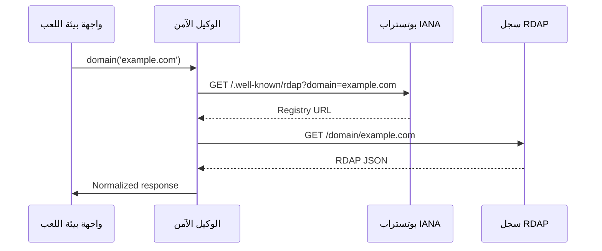
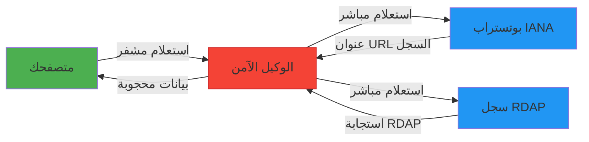

# دليل بيئة اللعب RDAPify

> **ميزة مخططة** — تصف هذه الوثيقة وظيفة قيد التطوير وغير متاحة في الإصدار الحالي (v0.1.8). قد تتغير التفاصيل قبل الإطلاق.


> **الهدف:** استكشاف قدرات RDAPify بشكل تفاعلي دون إعداد محلي
> **الوقت المطلوب:** 5-10 دقائق
> **الوصول:** [https://rdapify.dev/playground](https://rdapify.dev/playground)
> **نصيحة:** بيئة اللعب مثالية للتعلم والتصحيح ومشاركة أمثلة قابلة للتكرار مع المجتمع

---

## ما هي بيئة اللعب RDAPify؟

بيئة اللعب RDAPify هي **بيئة تفاعلية تعمل في المتصفح** تتيح لك:

- تنفيذ استعلامات RDAP بأمان دون تثبيت محلي
- تصوير الاستجابات المعيَّرة وبيانات RDAP الخام
- التجربة مع خيارات الإعداد المختلفة
- تصحيح مشكلات الاستعلام بأدوات تصوير مدمجة
- مشاركة أمثلة قابلة للتكرار عبر معاملات URL
- تصدير مقتطفات الكود الجاهزة إلى بيئتك المحلية

على خلاف بيئات اللعب التقليدية، تُحافظ بيئتنا على **ضوابط خصوصية صارمة** من خلال:
- حجب البيانات الشخصية بشكل افتراضي في جميع الاستجابات
- عدم تخزين نتائج الاستعلامات على خوادمنا
- استخدام جلسات مؤقتة تنتهي بعد 30 دقيقة من عدم النشاط
- توجيه الاستعلامات عبر وكيل آمن محمي من SSRF

---

## البدء

### الوصول إلى بيئة اللعب
ببساطة قم بزيارة [https://rdapify.dev/playground](https://rdapify.dev/playground) في أي متصفح حديث. لا يلزم تسجيل الدخول للاستخدام الأساسي.

### نظرة عامة على واجهة بيئة اللعب


1. **محرر الاستعلامات (اللوحة اليسرى)**
   - محرر كود JavaScript/TypeScript مع تمييز الصياغة
   - IntelliSense لأساليب API الخاصة بـ RDAPify
   - شريط جانبي لخيارات الإعداد

2. **تصوير النتائج (اللوحة اليمنى)**
   - واجهة بعلامات تبويب لعروض مختلفة:
     - `Normalized`: بيانات نظيفة ومنظمة (افتراضي)
     - `Raw Response`: استجابة خادم RDAP الأصلية
     - `Visualization`: رسم بياني تفاعلي للعلاقات
     - `Metrics`: إحصائيات الأداء والتخزين المؤقت

3. **شريط التحكم (في الأعلى)**
   - أزرار التشغيل/الإيقاف
   - خيارات التصدير
   - وظيفة المشاركة
   - إدارة الجلسة

---

## أمثلة الاستخدام الأساسي

### المثال 1: استعلام نطاق بسيط
1. في محرر الاستعلامات، الصق هذا الكود:
```javascript
const client = new RDAPClient({
  privacy: true,
  cache: false // تعطيل التخزين المؤقت للاختبار
});

const result = await client.domain('example.com');
return result;
```

2. انقر على زر **Run** (أو اضغط Ctrl+Enter)
3. اعرض الاستجابة المعيَّرة في لوحة النتائج

✅ **نجاح:** يجب أن ترى بيانات تسجيل النطاق المحجوبة مع خوادم الأسماء والأحداث.

### المثال 2: البحث عن عنوان IP
```javascript
const client = new RDAPClient({ privacy: true });

const ipResult = await client.ip('8.8.8.8');
return {
  organization: ipResult.entity.name,
  country: ipResult.country,
  network: ipResult.cidr,
  events: ipResult.events
};
```

### المثال 3: عرض معالجة الأخطاء
```javascript
const client = new RDAPClient({
  timeout: 2000,
  retry: { maxAttempts: 1 }
});

try {
  // هذا النطاق غير موجود
  const result = await client.domain('nonexistent-domain-123456789.com');
  return result;
} catch (error) {
  return {
    error: error.name,
    message: error.message,
    code: error.code,
    details: error.details
  };
}
```

---

## الميزات المتقدمة في بيئة اللعب

### المصحح البصري
يساعدك المصحح البصري على فهم دورة حياة استعلام RDAP:



**لاستخدام المصحح البصري:**
1. افتح محرر الاستعلامات
2. انقر على مُبدِّل "Debug Mode" في الشريط العلوي
3. شغِّل استعلامك
4. تجوَّل في كل مرحلة من مراحل دورة حياة الطلب
5. افحص الترويسات والحمولات والتوقيت في كل خطوة

### رسم خرائط العلاقات
للاستعلامات المعقدة التي تتضمن كيانات متعددة، فعِّل رسم الخرائط:

```javascript
const client = new RDAPClient({
  privacy: true,
  relationshipDepth: 2 // تتبع العلاقات بعمق مستويين
});

const result = await client.domain('example.com');
return client.mapRelationships(result);
```

ستتحول لوحة النتائج إلى **تصوير رسومي** يُظهر الروابط بين:
- أسماء النطاقات
- جهات التسجيل
- أصحاب النطاقات
- خوادم الأسماء
- شبكات IP

### معاينة الكشف عن الشذوذات
يمكن لمستخدمي المؤسسات معاينة ميزات الكشف عن الشذوذات:

```javascript
const client = new RDAPClient({
  privacy: true,
  enableAnomalyDetection: true
});

const result = await client.batchDomainLookup([
  'example.com',
  'google.com',
  'facebook.com'
]);

// إبراز أنماط التسجيل غير المعتادة
return client.detectAnomalies(result);
```

---

## خيارات الإعداد

توفر بيئة اللعب شريطًا جانبيًا مريحًا للإعداد:

| الإعداد | الافتراضي | الوصف |
|---------|---------|-------------|
| **حجب البيانات الشخصية** | مفعَّل | حجب المعلومات الشخصية تلقائيًا |
| **وضع التخزين المؤقت** | الذاكرة | الخيارات: بلا، ذاكرة، جلسة |
| **المهلة الزمنية** | 8000 مللي ثانية | الحد الأقصى للوقت لكل استعلام |
| **إعادة المحاولات** | 2 | عدد محاولات إعادة المحاولة عند الفشل |
| **تفضيل السجل** | اكتشاف تلقائي | تحديد سجل RDAP المفضل |
| **الاستجابة الخام** | معطل | تضمين استجابة الخادم الأصلية |

**نصيحة:** ادخل إلى الإعدادات المتقدمة بالنقر على أيقونة الترس في الشريط الجانبي للإعداد.

---

## الخصوصية والأمان في بيئة اللعب

### أمان تدفق البيانات


تضمن بنية بيئة اللعب:
- توجيه جميع الاستعلامات عبر **وكيلنا المحمي من SSRF** الذي:
  - يحجب نطاقات IP الخاصة (RFC 1918)
  - يمنع الوصول إلى الشبكة الداخلية
  - يحدد معدل الطلبات لكل جلسة
  - يتحقق من سلاسل الشهادات
- **حجب تلقائي للبيانات الشخصية** قبل وصول الاستجابات إلى متصفحك
- **عدم تخزين دائم** لنتائج الاستعلامات على خوادمنا
- **جلسات مؤقتة** تنتهي بعد 30 دقيقة من عدم النشاط
- ترويسات **سياسة أمان المحتوى** التي تمنع هجمات XSS

### الإعدادات الافتراضية المراعية للخصوصية
على خلاف كثير من بيئات اللعب، بيئتنا:
- لا تجمع إحصاءات عن النطاقات التي تستعلم عنها
- لا تتطلب تسجيل الدخول للاستخدام الأساسي
- توفر مؤشرات بصرية واضحة عند حجب البيانات الشخصية
- تتيح زر "مسح الجلسة" بنقرة واحدة لمحو جميع البيانات المحلية
- تقدم مُبدِّل "الوضع الخاص" الذي يعطل التخزين المحلي كليًا

---

## التصدير والمشاركة

### التصدير إلى التطوير المحلي
عند الاستعداد للانتقال من بيئة اللعب إلى الإنتاج:

1. انقر على زر **Export** في الشريط العلوي
2. اختر البيئة المستهدفة:
   - تطبيق Node.js
   - سكريبت المتصفح (CDN)
   - سكريبت Bun/Deno
   - مكوِّن React/Vue
3. انسخ الكود المُنشأ مع الاستيرادات والإعداد الصحيحين

مثال تصدير Node.js:
```javascript
// مُنشأ بواسطة RDAPify Playground
// https://rdapify.dev/playground?session=abc123

import { RDAPClient } from 'rdapify';

async function lookupDomain(domain) {
  const client = new RDAPClient({
    privacy: true,
    cache: {
      ttl: 3600
    },
    timeout: 8000
  });

  try {
    return await client.domain(domain);
  } catch (error) {
    console.error(`Error looking up ${domain}:`, error.message);
    throw error;
  }
}

// الاستخدام
lookupDomain('example.com')
  .then(result => console.log(result))
  .catch(error => process.exit(1));
```

### مشاركة أمثلة قابلة للتكرار
لمشاركة جلسة بيئة اللعب:
1. انقر على زر **Share**
2. اختر خيارات المشاركة:
   - **رابط**: عنوان URL قابل للمشاركة مع الاستعلام المُشفَّر
   - **تضمين**: مقتطف HTML للتوثيق
   - **الكود فقط**: كود JavaScript فحسب
3. انسخ المحتوى المُنشأ

**ملاحظة أمنية:** الروابط المشتركة تحتوي على إعداد الكود فحسب، وليس نتائج الاستعلامات أو البيانات الحساسة.

---

## القيود وأفضل الممارسات

### تحديد المعدل
تُطبِّق بيئة اللعب حدودًا صارمة للمعدل لحماية سجلات RDAP:
- 10 طلبات في الدقيقة لكل جلسة
- 50 طلبًا في الساعة لكل عنوان IP
- الاستعلامات المجمَّعة محدودة بـ 5 نطاقات في المرة الواحدة

للاستخدام بحجم أكبر:
- صدِّر الكود للتشغيل في بيئتك الخاصة
- هيِّئ التخزين المؤقت المناسب لتقليل الحمل على السجل
- طبِّق استراتيجية تحديد المعدل الخاصة بك

### قيود الميزات
بعض الميزات المتقدمة محدودة في بيئة اللعب:
- لا يوجد تخزين مؤقت دائم يتجاوز عمر الجلسة
- لا تُدعم محوِّلات التخزين المؤقت المخصصة (Redis، إلخ)
- لا إشعارات Webhook
- لا استعلامات مجدوَلة
- عمق الكشف عن الشذوذات محدود

### أفضل الممارسات
1. **استخدم نطاقات اختبارية** مثل `example.com` و`example.net` و`rdap.example`
2. **تجنب الاستعلام عن نطاقات حساسة** تديرها في بيئة الإنتاج
3. **امسح جلستك** بعد استكشاف الإعدادات الحساسة
4. **صدِّر بدلًا من النسخ واللصق** للحصول على معالجة أخطاء وإعداد صحيحين
5. **احترم سياسات السجل** - تُطبِّق بيئة اللعب نفس متطلبات الامتثال المعمول بها في الإنتاج

---

## استكشاف المشكلات الشائعة وإصلاحها

### أخطاء "فشل الاستعلام"
| الخطأ | الحل |
|-------|----------|
| `RDAP_TIMEOUT` | زيادة المهلة الزمنية في الشريط الجانبي للإعداد |
| `RDAP_NOT_FOUND` | التحقق من وجود النطاق ودعمه لـ RDAP |
| `REGISTRY_UNAVAILABLE` | إعادة المحاولة بعد 5 دقائق أو استخدام سجل مختلف |
| `SSRF_BLOCKED` | قد يحاول استعلامك الوصول إلى الشبكة الداخلية |

### مشكلات الأداء
- **استعلامات بطيئة:** فعِّل التخزين المؤقت في الشريط الجانبي للإعداد
- **تجمد واجهة المستخدم:** قلِّل `relationshipDepth` للاستعلامات المعقدة
- **انتهاء الجلسة:** انقر على "New Session" في الزاوية العلوية اليمنى

### مخاوف الخصوصية
- **بيانات شخصية غير متوقعة في النتائج:** تحقق من تفعيل `redactPII` في الإعداد
- **استمرار بيانات الجلسة:** انقر على "Clear Session" وعطِّل التخزين المحلي في إعدادات المتصفح
- **سلوك مريب:** أبلِّغ فورًا على `security@rdapify.com`

---

## نصائح للمستخدمين المتمرسين

### اختصارات لوحة المفاتيح
| الاختصار | الإجراء |
|----------|--------|
| `Ctrl+Enter` | تشغيل الاستعلام |
| `Ctrl+S` | الحفظ في تخزين الجلسة |
| `Ctrl+Shift+E` | فتح نافذة التصدير |
| `Ctrl+/` | تبديل التعليقات |
| `Ctrl+Space` | تفعيل IntelliSense |

### ميزات الوكيل المتقدمة
الوصول إليها عبر معاملات URL:
```
https://rdapify.dev/playground?proxy=strict&debug=true&registry=arin
```
- `proxy=strict`: تطبيق حمايات SSRF إضافية
- `debug=true`: تفعيل التسجيل التفصيلي
- `registry=arin`: إجبار سجل ARIN على جميع الاستعلامات
- `cache=redis`: تفعيل تخزين Redis المحاكى

### معرض القوالب
الوصول إلى القوالب الجاهزة:
1. انقر على "Templates" في الشريط الجانبي الأيسر
2. اختر من بين:
   - **لوحة مراقبة النطاقات**
   - **مدقق الامتثال مع GDPR**
   - **محلل سمعة IP**
   - **بديل WHOIS المجمَّع**
   - **رسام علاقات المؤسسات**

كل قالب يتضمن:
- إعدادات عميل جاهزة
- خيارات تصوير تفاعلية
- كود قابل للتصدير مع تعليقات
- توثيق لنقاط التخصيص

---

## الموارد ذات الصلة

| المورد | الوصف | الرابط |
|----------|-------------|------|
| **مرجع API التفاعلي** | استكشاف الأساليب مع أمثلة حية | [../api-reference/client.md] |
| **قائمة مراجعة الإنتاج** | الانتقال من بيئة اللعب إلى الإنتاج | [./production-checklist.md] |
| **الورقة البيضاء للأمان** | تفاصيل بنية نظام الوكيل | [../security/whitepaper.md] |

---

> **تذكير هام:** بينما توفر بيئة اللعب بيئة آمنة للتعلم والاستكشاف، لا تستعلم **أبدًا** عن نطاقات تحتوي على معلومات تجارية حساسة أو بيانات شخصية دون ترخيص مناسب وحجب. عند الشك، أبقِ `privacy: true` مفعَّلًا.

[← العودة إلى البدء](./README.md) | [التالي: الاستعلام الأول ←](./first-query.md)

*آخر تحديث للوثيقة: 5 ديسمبر 2025*
*إصدار بيئة اللعب: 2.3.0*
*تاريخ التدقيق الأمني: 15 نوفمبر 2025*
