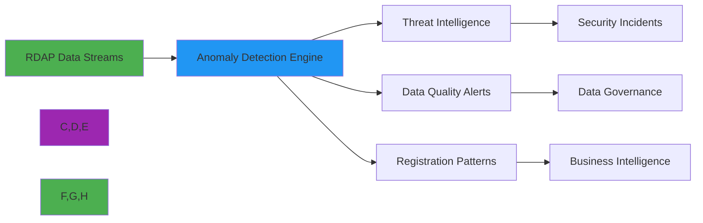

# دليل اكتشاف الشذوذات

> **يتطلب `@rdapify/pro`** — الميزات الموصوفة في هذا الدليل مقدَّمة من الحزمة التجارية [`@rdapify/pro`](https://github.com/rdapify/RDAPify-Pro). ثبّتها بجانب `rdapify` لاستخدام هذه الوظيفة.

> **الغرض:** دليل شامل لتطبيق أنظمة اكتشاف الشذوذات لبيانات RDAP لتحديد التهديدات الأمنية ومشكلات جودة البيانات وأنماط التسجيل
> **مراجع ذات صلة:** [الأمان والخصوصية](security-privacy.md) | [المعالجة الدُفعية](batch-processing.md)

---

## لماذا يهم اكتشاف الشذوذات في RDAP

تحتوي بيانات RDAP على إشارات قيّمة حول أنماط تسجيل النطاقات والتغييرات في البنية التحتية والتهديدات الأمنية. يحوّل اكتشاف الشذوذات هذه البيانات من سجلات ثابتة إلى استخبارات قابلة للتنفيذ:



**حالات الاستخدام الحرجة لاكتشاف الشذوذات:**
- **التهديدات الأمنية**: اختطاف النطاقات، حملات التصيد الاحتيالي، الاستضافة المحمية من الرصانة
- **مشكلات جودة البيانات**: تلف بيانات التسجيل، السجلات غير المكتملة
- **استخبارات الأعمال**: مراقبة المنافسين، أنماط حماية العلامة التجارية
- **مراقبة الامتثال**: انتهاكات الامتثال التنظيمي، استخدام TLD المحظور
- **الصحة التشغيلية**: مشكلات بنية السجل التحتية، أنماط تحديد المعدل

---

## أنماط الاكتشاف الأساسية

### 1. اكتشاف الشذوذات الإحصائية
```typescript
import { AnomalyDetector, StatisticalModel } from 'rdapify/analytics';

const detector = new AnomalyDetector({
  model: new StatisticalModel({
    algorithm: 'isolation-forest', // أو 'z-score'، 'grubbs-test'
    featureEngineering: {
      temporalFeatures: true,         // الأنماط الزمنية
      registrationVelocity: true,     // النطاقات المسجلة لكل فترة زمنية
      infrastructureChanges: true     // تغييرات خادم الأسماء/IP
    },
    sensitivity: {
      threshold: 3.5,                 // 3.5 انحراف معياري
      minimumSamples: 1000,           // الحد الأدنى للعينات للاكتشاف الموثوق
      falsePositiveRate: 0.01         // معدل 1% للإيجابيات الكاذبة المقبولة
    }
  }),
  features: [
    'registration_date_frequency',
    'nameserver_changes',
    'registrar_changes',
    'status_changes',
    'contact_changes'
  ],
  temporalWindows: {
    shortTerm: '1h',    // الشذوذات الحديثة
    mediumTerm: '24h',  // الأنماط اليومية
    longTerm: '30d'     // الاتجاهات التاريخية
  }
});

// اكتشاف الشذوذات في محفظة النطاقات
const anomalies = await detector.detectAnomalies({
  domains: ['example.com', 'microsoft.com', 'google.com'],
  timeRange: { start: new Date(Date.now() - 86400000), end: new Date() }
});

console.log(`Detected ${anomalies.length} anomalies`);
anomalies.forEach(anomaly => {
  console.log(`- ${anomaly.domain}: ${anomaly.type} (score: ${anomaly.score.toFixed(2)})`);
});
```

### 2. التعرف على الأنماط السلوكية
```typescript
class RegistrationBehaviorClassifier {
  private readonly patterns = {
    // أنماط التسجيل المشبوهة
    rapidRegistration: {
      domainsPerHour: 10,
      sameRegistrar: true,
      sameContact: true
    },
    bulletproofHosting: {
      privacyProtection: true,
      rapidNameserverChanges: 3,
      highRiskTLDs: ['.xyz', '.top', '.club']
    },
    domainHijacking: {
      recentStatusChanges: ['clientTransferProhibited', 'serverTransferProhibited'],
      recentContactChanges: true
    },
    phishingCampaign: {
      newRegistrant: true,
      similarToLegitimate: true,
      highRiskKeywords: ['login', 'secure', 'account', 'verify']
    }
  };

  classify(domainData: DomainData): BehaviorProfile {
    const profile = {
      riskScore: 0,
      patterns: [] as string[],
      confidence: 0.0
    };

    if (this.isRapidRegistration(domainData)) {
      profile.riskScore += 30;
      profile.patterns.push('rapid-registration');
    }

    if (this.isBulletproofHosting(domainData)) {
      profile.riskScore += 45;
      profile.patterns.push('bulletproof-hosting');
    }

    if (this.isDomainHijacking(domainData)) {
      profile.riskScore += 60;
      profile.patterns.push('domain-hijacking');
    }

    profile.confidence = this.calculateConfidence(profile);
    return profile;
  }
}
```

---

## الأمان والخصوصية في اكتشاف الشذوذات

### اكتشاف الشذوذات المدرك للبيانات الشخصية
يجب أن توازن أنظمة اكتشاف الشذوذات بين فعالية الأمان والامتثال للخصوصية:

| نوع البيانات | قيمة الاكتشاف | مخاطر الخصوصية | استراتيجية التخفيف |
|-----------|-------------------------|--------------|---------------------|
| **أسماء النطاقات** | عالية (أنماط، تشابهات) | منخفضة | آمن للمعالجة |
| **أسماء المسجّلين** | متوسطة (سرعة التسجيل) | عالية | الحجب قبل المعالجة |
| **عناوين البريد الإلكتروني** | متوسطة (أنماط الاتصال) | عالية | التجزئة أو التجميع |
| **عناوين IP** | عالية (تحليل الشبكة) | متوسطة | إخفاء الهوية حتى /24 |
| **خوادم الأسماء** | عالية (أنماط البنية التحتية) | منخفضة | آمن للمعالجة |
| **تواريخ التسجيل** | عالية (الأنماط الزمنية) | منخفضة | آمن للمعالجة |

```typescript
const privacyAwareDetector = new AnomalyDetector({
  privacy: {
    redactionLevel: 'strict',       // المعالجة المتوافقة مع GDPR
    aggregatePII: true,             // تجميع البيانات الشخصية بدلاً من التحليل الفردي
    anonymizeNetworks: true,        // إخفاء هوية شبكات IP حتى /24
    consentRequired: true           // اشتراط الموافقة الصريحة لمعالجة البيانات الشخصية
  },
  detection: {
    focusOnTechnicalData: true      // إعطاء أولوية للبيانات التقنية على البيانات الشخصية
  }
});

const results = await privacyAwareDetector.detectAnomalies({
  domains: monitoredDomains,
  consent: {
    granted: true,
    purpose: 'security monitoring',
    timestamp: new Date(),
    withdrawalUrl: 'https://yourapp.com/consent/withdraw'
  }
});
```

---

## استراتيجيات التطبيق

### 1. الاكتشاف في الوقت الفعلي عبر البث
```typescript
import { StreamAnomalyDetector, KafkaSource } from 'rdapify/analytics';

const streamDetector = new StreamAnomalyDetector({
  source: new KafkaSource({
    brokers: ['kafka1.example.com:9092'],
    topic: 'rdap-queries',
    groupId: 'anomaly-detection'
  }),
  model: {
    type: 'online-learning',
    algorithm: 'hoeffding-tree',
    updateFrequency: '10s',
    driftDetection: true
  },
  alerting: {
    webhook: 'https://security.example.com/alerts',
    severityThresholds: {
      critical: 90,
      high: 75,
      medium: 60,
      low: 45
    }
  }
});

streamDetector.start();

streamDetector.on('anomaly-detected', (alert: SecurityAlert) => {
  if (alert.severity === 'critical') {
    securityTeam.notify(alert);
    incidentResponse.initiate(alert);
  }

  auditLogger.log('anomaly-detection', {
    domain: alert.domain,
    score: alert.score,
    patterns: alert.patterns,
    timestamp: new Date().toISOString()
  });
});
```

### 2. المعالجة الدُفعية للتحليل التاريخي
```typescript
class HistoricalAnomalyAnalyzer {
  async analyzePortfolio(domains: string[], timeRange: TimeRange): Promise<PortfolioAnalysis> {
    // جلب بيانات RDAP التاريخية لجميع النطاقات
    const historicalData = await this.fetchHistoricalData(domains, timeRange);

    // بناء رسوم بيانية للعلاقات
    const relationshipGraph = this.buildRelationshipGraph(historicalData);

    // اكتشاف الشذوذات باستخدام نماذج متعددة
    const anomalies = await Promise.all([
      this.detectRegistrationAnomalies(historicalData),
      this.detectInfrastructureAnomalies(relationshipGraph),
      this.detectTemporalAnomalies(historicalData)
    ]);

    // تجميع الشذوذات وربطها
    return this.correlateAnomalies(anomalies, relationshipGraph);
  }

  private buildRelationshipGraph(data: HistoricalData[]): RelationshipGraph {
    const graph = new NetworkGraph();

    data.forEach(record => {
      graph.addNode(`domain:${record.domain}`, { type: 'domain' });
      graph.addNode(`registrar:${record.registrar}`, { type: 'registrar' });
      record.nameservers.forEach(ns => {
        graph.addNode(`nameserver:${ns}`, { type: 'nameserver' });
      });

      graph.addEdge(`domain:${record.domain}`, `registrar:${record.registrar}`, { type: 'uses' });
      record.nameservers.forEach(ns => {
        graph.addEdge(`domain:${record.domain}`, `nameserver:${ns}`, { type: 'resolves-to' });
      });
    });

    return this.identifyCommunities(graph);
  }
}
```

---

## الأنماط المتقدمة

### ربط الشذوذات عبر السجلات
```typescript
class CrossRegistryAnomalyCorrelator {
  async correlateAnomalies(registryResults: RegistryAnomalyResults[]): Promise<CorrelatedAnomalies> {
    const correlationMatrix = this.buildCorrelationMatrix(registryResults);

    const crossRegistryPatterns = {
      registryHopping: this.detectRegistryHopping(registryResults),
      infrastructureMismatches: this.detectInfrastructureMismatches(registryResults),
      temporalCorrelations: this.detectTemporalCorrelations(registryResults)
    };

    const correlationGraph = this.buildCorrelationGraph(correlationMatrix, crossRegistryPatterns);
    const highPriority = this.identifyHighPriorityAnomalies(correlationGraph);

    return {
      correlationGraph,
      crossRegistryPatterns,
      highPriority,
      confidenceScores: this.calculateConfidence(correlationGraph)
    };
  }

  private detectRegistryHopping(results: RegistryAnomalyResults[]): RegistryHoppingPattern[] {
    const patterns: RegistryHoppingPattern[] = [];
    const registrants = new Map<string, RegistryRegistration[]>();

    results.forEach(result => {
      result.anomalies.forEach(anomaly => {
        if (anomaly.registrantHandle) {
          if (!registrants.has(anomaly.registrantHandle)) {
            registrants.set(anomaly.registrantHandle, []);
          }

          registrants.get(anomaly.registrantHandle)!.push({
            registry: result.registry,
            domain: anomaly.domain,
            timestamp: anomaly.timestamp
          });
        }
      });
    });

    registrants.forEach((registrations, registrant) => {
      registrations.sort((a, b) => a.timestamp - b.timestamp);

      for (let i = 1; i < registrations.length; i++) {
        const timeDiff = registrations[i].timestamp - registrations[i-1].timestamp;

        if (registrations[i].registry !== registrations[i-1].registry && timeDiff < 86400000) {
          patterns.push({
            registrant,
            domains: [registrations[i-1].domain, registrations[i].domain],
            registries: [registrations[i-1].registry, registrations[i].registry],
            timeDiff,
            riskScore: 85
          });
        }
      }
    });

    return patterns;
  }
}
```

---

## المراقبة والإشعار

### ضبط التنبيهات
```typescript
const detector = new AnomalyDetector({
  alerting: {
    enabled: true,
    channels: [
      {
        type: 'webhook',
        url: 'https://security.yourcompany.com/alerts',
        format: 'json'
      },
      {
        type: 'email',
        recipients: ['security@yourcompany.com'],
        minSeverity: 'high'
      }
    ],
    thresholds: {
      critical: { score: 90, action: 'immediate-response' },
      high: { score: 75, action: 'alert' },
      medium: { score: 60, action: 'log' },
      low: { score: 45, action: 'track' }
    },
    cooldown: 300  // 5 دقائق بين نفس التنبيهات
  }
});
```

---

## أفضل الممارسات

### يُنصح بـ:
- **ابدأ بالبيانات التاريخية**: قبل النشر، درّب النماذج على البيانات التاريخية
- **استخدم نماذج متعددة**: جمع نماذج متعددة يُقلل الإيجابيات الكاذبة
- **ضبط عتبات الحساسية**: وازن بين اكتشاف التهديدات ومعدل الإيجابيات الكاذبة
- **حجب البيانات الشخصية**: طبّق حجب البيانات قبل تغذية نماذج الاكتشاف
- **راجع التنبيهات بانتظام**: قيّم دوريًا جودة الاكتشاف وعدّل النماذج

### يُجنب:
- **لا تعالج بيانات شخصية خام**: احجب أو جهّل الهوية قبل المعالجة
- **لا تثق بمعدلات الاكتشاف الصفرية**: راجع عينات عشوائية للتأكد من عمل النماذج
- **لا تتجاهل الانجراف**: أعد تدريب النماذج بانتظام على البيانات الجديدة
- **لا تبالغ في الإشعارات**: ضبط حدود مناسبة لتجنب التعب من التنبيهات

---

## انظر أيضاً

- [الأمان والخصوصية](security-privacy.md)
- [المعالجة الدُفعية](batch-processing.md)
- [دليل الأداء](performance.md)
- [مرجع `@rdapify/pro` API](../api-reference/pro/)
