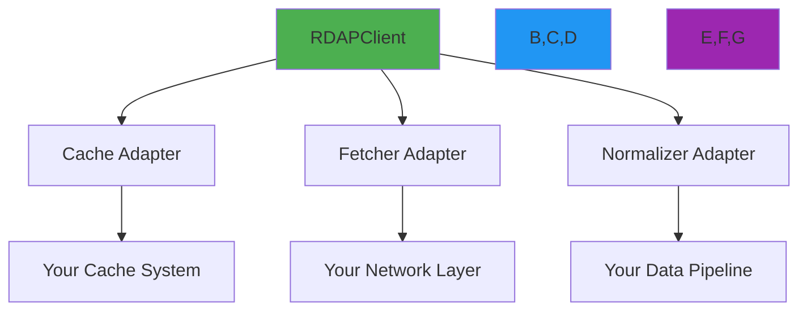

# دليل المحوّلات المخصصة

> **الغرض:** دليل كامل لبناء وتكامل المحوّلات المخصصة للذاكرة المؤقتة وجالب البيانات والمعيار في RDAPify
> **مراجع ذات صلة:** [استراتيجيات التخزين المؤقت](caching-strategies.md) | [نظرة عامة على البنية](../core-concepts/architecture.md) | [ورقة الأمان البيضاء](../security/whitepaper.md)

---

## لماذا تهم المحوّلات المخصصة

يُمكّن نمط المحوّل في RDAPify من التكامل السلس مع بنيتك التحتية الحالية مع الحفاظ على توافق البروتوكول ومعايير الأمان:



**فوائد المحوّلات:**
- **تكامل البنية التحتية**: الاتصال بأنظمة الذاكرة المؤقتة والشبكة الحالية
- **توافق البروتوكول**: الحفاظ على توافق RFC لـ RDAP مع التكيّف مع أنظمتك
- **الحفاظ على الأمان**: تطبيق سياسات أمان متسقة عبر جميع المكونات
- **تحسين الأداء**: الاستفادة من خصائص الأداء الفريدة لبنيتك التحتية
- **إمكانية الرصد**: التكامل مع أنظمة المراقبة والتسجيل الحالية

---

## أنواع المحوّلات الأساسية

### 1. واجهة CacheAdapter
```typescript
interface CacheAdapter {
  /**
   * الحصول على قيمة من الذاكرة المؤقتة
   * @param key - مفتاح الذاكرة المؤقتة
   * @returns وعد يحسم إلى القيمة المخزنة أو null
   */
  get<T>(key: string): Promise<T | null>;

  /**
   * تعيين قيمة في الذاكرة المؤقتة
   * @param key - مفتاح الذاكرة المؤقتة
   * @param value - القيمة المراد تخزينها
   * @param options - خيارات الذاكرة المؤقتة (TTL، إلخ)
   */
  set<T>(key: string, value: T, options?: CacheSetOptions): Promise<void>;

  /**
   * حذف قيمة من الذاكرة المؤقتة
   * @param key - مفتاح الذاكرة المؤقتة
   */
  delete(key: string): Promise<boolean>;

  /**
   * مسح الذاكرة المؤقتة بالكامل
   */
  clear(): Promise<void>;

  /**
   * الحصول على إحصائيات الذاكرة المؤقتة
   */
  stats(): Promise<CacheStats>;
}

interface CacheSetOptions {
  ttl?: number; // وقت الحياة بالثواني
  redactBeforeStore?: boolean; // حجب البيانات الشخصية قبل التخزين
  encryptionKey?: string; // مفتاح التشفير للبيانات الحساسة
}

interface CacheStats {
  hits: number;
  misses: number;
  entries: number;
  sizeInBytes: number;
  evictions: number;
  uptime: number; // بالملي ثانية
}
```

### 2. واجهة FetcherAdapter
```typescript
interface FetcherAdapter {
  /**
   * تنفيذ طلب HTTP مع حماية SSRF
   * @param url - عنوان URL المستهدف (يتم التحقق منه قبل الطلب)
   * @param options - خيارات الطلب
   * @returns وعد يحسم إلى كائن الاستجابة
   * @throws RDAPError إذا فشل الطلب أو اكتُشف انتهاك أمني
   */
  fetch(url: string, options?: FetcherOptions): Promise<FetcherResponse>;

  /**
   * التحقق من صحة URL قبل إرسال الطلب
   * @param url - عنوان URL للتحقق
   * @returns قيمة منطقية تشير إلى ما إذا كان URL آمناً للطلب
   */
  validateUrl(url: string): boolean;

  /**
   * الحصول على السياق الأمني للطلب
   * @param url - عنوان URL المستهدف
   * @returns كائن SecurityContext مع تقييم التهديد
   */
  getSecurityContext(url: string): SecurityContext;
}

interface FetcherOptions {
  method?: 'GET' | 'POST' | 'HEAD';
  headers?: Record<string, string>;
  timeout?: number;
  followRedirects?: boolean;
  abortSignal?: AbortSignal;
}
```

### 3. واجهة NormalizerAdapter
```typescript
interface NormalizerAdapter {
  /**
   * تطبيع استجابة RDAP الخام إلى التنسيق القياسي
   * @param rawResponse - استجابة RDAP JSON الخام
   * @param context - سياق التطبيع
   * @returns استجابة مطبّعة بهيكل متسق
   */
  normalize(rawResponse: any, context: NormalizationContext): NormalizedResponse;

  /**
   * التحقق من صحة الاستجابة المطبّعة مقابل المخطط
   * @param response - الاستجابة المطبّعة
   * @returns ValidationResult يشير إلى الصحة
   */
  validate(response: any): ValidationResult;

  /**
   * تطبيق حجب البيانات الشخصية على الاستجابة المطبّعة
   * @param response - الاستجابة المطبّعة
   * @param options - خيارات الحجب
   * @returns الاستجابة المحجوبة
   */
  redactPII(response: any, options: RedactionOptions): any;
}
```

---

## بناء محوّلات ذاكرة تخزين مؤقتة مخصصة

### النمط الأول: محوّل ذاكرة تخزين Redis
```typescript
import { CacheAdapter, CacheSetOptions, CacheStats } from 'rdapify';
import { createClient } from 'redis';

class RedisCacheAdapter implements CacheAdapter {
  private readonly client;
  private readonly encryptionKey?: string;
  private readonly redactBeforeStore: boolean;

  constructor(options: {
    url: string;
    encryptionKey?: string;
    redactBeforeStore?: boolean;
    tls?: { rejectUnauthorized: boolean };
  }) {
    this.client = createClient({
      url: options.url,
      socket: options.tls ? { tls: options.tls } : undefined
    });
    this.encryptionKey = options.encryptionKey;
    this.redactBeforeStore = options.redactBeforeStore ?? true;

    this.client.on('error', (err) =>
      console.error('Redis Cache Error:', err)
    );
  }

  async get<T>(key: string): Promise<T | null> {
    try {
      const data = await this.client.get(key);
      if (!data) return null;

      const parsed = JSON.parse(data);
      if (parsed.encrypted && this.encryptionKey) {
        return this.decryptData(parsed.value);
      }

      return parsed.value;
    } catch (error) {
      console.error('Cache get failed:', error);
      return null;
    }
  }

  async set<T>(key: string, value: T, options: CacheSetOptions = {}): Promise<void> {
    try {
      // تطبيق حجب البيانات الشخصية قبل التخزين إذا كان مضبوطاً
      let dataToStore = value;
      if (options.redactBeforeStore ?? this.redactBeforeStore) {
        dataToStore = this.redactPII(dataToStore);
      }

      const storageValue = this.encryptionKey
        ? this.encryptData(dataToStore)
        : { value: dataToStore, encrypted: false };

      await this.client.set(
        key,
        JSON.stringify(storageValue),
        { EX: options.ttl || 3600 }
      );
    } catch (error) {
      console.error('Cache set failed:', error);
      // فشل صامت — الذاكرة المؤقتة بذل أفضل الجهود
    }
  }

  // تطبيق باقي طرق الواجهة...
}
```

### النمط الثاني: محوّل ذاكرة تخزين DynamoDB
```typescript
import { CacheAdapter } from 'rdapify';
import { DynamoDBClient, GetItemCommand, PutItemCommand } from '@aws-sdk/client-dynamodb';
import { marshall, unmarshall } from '@aws-sdk/util-dynamodb';

class DynamoDBCacheAdapter implements CacheAdapter {
  private readonly client;
  private readonly tableName;

  constructor(options: {
    region: string;
    tableName: string;
    encryptionKey?: string;
  }) {
    this.client = new DynamoDBClient({ region: options.region });
    this.tableName = options.tableName;
  }

  async get<T>(key: string): Promise<T | null> {
    try {
      const command = new GetItemCommand({
        TableName: this.tableName,
        Key: marshall({ cacheKey: key }),
        ProjectionExpression: 'cacheValue, expiresAt'
      });

      const result = await this.client.send(command);

      if (!result.Item) return null;

      const item = unmarshall(result.Item);
      const now = Math.floor(Date.now() / 1000);

      if (item.expiresAt && item.expiresAt < now) {
        await this.delete(key);
        return null;
      }

      return JSON.parse(item.cacheValue);
    } catch (error) {
      console.error('DynamoDB get failed:', error);
      return null;
    }
  }

  async set<T>(key: string, value: T, options: CacheSetOptions = {}): Promise<void> {
    try {
      const now = Math.floor(Date.now() / 1000);
      const ttl = options.ttl || 3600;
      const expiresAt = now + ttl;

      const command = new PutItemCommand({
        TableName: this.tableName,
        Item: marshall({
          cacheKey: key,
          cacheValue: JSON.stringify(value),
          createdAt: now,
          expiresAt
        })
      });

      await this.client.send(command);
    } catch (error) {
      console.error('DynamoDB set failed:', error);
    }
  }

  // تطبيق باقي طرق الواجهة...
}
```

---

## بناء محوّلات جالب البيانات المخصصة

### النمط الأول: جالب Lambda VPC على AWS
```typescript
import { FetcherAdapter, SecurityContext } from 'rdapify';
import { SSMClient, GetParameterCommand } from '@aws-sdk/client-ssm';

class LambdaVPCFetcher implements FetcherAdapter {
  private readonly ssmClient;

  constructor() {
    this.ssmClient = new SSMClient({ region: process.env.AWS_REGION });
  }

  async fetch(url: string, options: FetcherOptions = {}): Promise<FetcherResponse> {
    if (!this.validateUrl(url)) {
      throw new RDAPError('RDAP_SSRF_ATTEMPT', `Blocked SSRF attempt to ${url}`);
    }

    const proxyEndpoint = await this.getProxyEndpoint();

    const response = await fetch(proxyEndpoint, {
      method: 'POST',
      headers: {
        'Content-Type': 'application/json',
        'x-vpc-proxy-target': url
      },
      body: JSON.stringify({
        method: options.method || 'GET',
        headers: options.headers,
        timeout: options.timeout || 5000
      })
    });

    return {
      status: response.status,
      statusText: response.statusText,
      headers: Object.fromEntries(response.headers.entries()),
      body: await response.text(),
      url,
      redirected: response.redirected
    };
  }

  validateUrl(url: string): boolean {
    try {
      const parsed = new URL(url);

      if (!['http:', 'https:'].includes(parsed.protocol)) return false;
      if (this.isPrivateIP(parsed.hostname)) return false;
      if (this.isCloudMetadataEndpoint(parsed.hostname)) return false;

      return this.isApprovedRDAPServer(parsed.hostname);
    } catch {
      return false;
    }
  }

  private isApprovedRDAPServer(hostname: string): boolean {
    const approvedServers = [
      'rdap.verisign.com',
      'rdap.arin.net',
      'rdap.ripe.net',
      'rdap.apnic.net',
      'rdap.lacnic.net',
      'rdap.afrinic.net'
    ];

    return approvedServers.some(server =>
      hostname.endsWith(server) ||
      hostname === server
    );
  }

  // تطبيق باقي طرق الواجهة...
}
```

### النمط الثاني: جالب Cloudflare Workers
```typescript
import { FetcherAdapter } from 'rdapify';

class CloudflareWorkersFetcher implements FetcherAdapter {
  private readonly fetch: typeof fetch;

  constructor(env: { fetch: typeof fetch }) {
    this.fetch = env.fetch;
  }

  async fetch(url: string, options: FetcherOptions = {}): Promise<FetcherResponse> {
    if (!this.validateUrl(url)) {
      throw new RDAPError('RDAP_SSRF_ATTEMPT', `Blocked SSRF attempt to ${url}`);
    }

    const response = await this.fetch(url, {
      method: options.method || 'GET',
      headers: {
        ...options.headers,
        'User-Agent': 'RDAPify/1.0 (+https://rdapify.dev)'
      },
      signal: options.abortSignal,
      redirect: options.followRedirects ? 'follow' : 'manual'
    });

    return {
      status: response.status,
      statusText: response.statusText,
      headers: Object.fromEntries(response.headers.entries()),
      body: await response.text(),
      url,
      redirected: response.redirected
    };
  }

  validateUrl(url: string): boolean {
    try {
      const parsed = new URL(url);
      if (!['http:', 'https:'].includes(parsed.protocol)) return false;
      return true; // يتمتع Cloudflare Workers بحماية SSRF مدمجة
    } catch {
      return false;
    }
  }

  getSecurityContext(url: string): SecurityContext {
    return {
      isPrivateIP: false,
      isCloudMeta: false,
      threatLevel: 'low'
    };
  }
}
```

---

## استخدام المحوّلات المخصصة

### تسجيل محوّل الذاكرة المؤقتة
```typescript
import { RDAPClient } from 'rdapify';

const customCache = new RedisCacheAdapter({
  url: process.env.REDIS_URL,
  encryptionKey: process.env.CACHE_ENCRYPTION_KEY,
  redactBeforeStore: true,
  tls: { rejectUnauthorized: true }
});

const client = new RDAPClient({
  cacheAdapter: customCache
});
```

### تسجيل محوّل الجالب
```typescript
import { RDAPClient } from 'rdapify';

const customFetcher = new LambdaVPCFetcher();

const client = new RDAPClient({
  fetcherAdapter: customFetcher
});
```

---

## اختبار المحوّلات المخصصة

### اختبار محوّل الذاكرة المؤقتة
```typescript
describe('Custom Cache Adapter', () => {
  let adapter: RedisCacheAdapter;

  beforeEach(async () => {
    adapter = new RedisCacheAdapter({
      url: 'redis://localhost:6379',
      redactBeforeStore: true
    });
    await adapter.clear();
  });

  test('stores and retrieves values correctly', async () => {
    await adapter.set('test-key', { domain: 'example.com' }, { ttl: 60 });
    const result = await adapter.get('test-key');

    expect(result).not.toBeNull();
    expect(result.domain).toBe('example.com');
  });

  test('redacts PII before storage', async () => {
    const data = {
      domain: 'example.com',
      registrant: { email: 'user@example.com', name: 'John Doe' }
    };

    await adapter.set('test-pii', data, { redactBeforeStore: true });

    // التحقق من الذاكرة المؤقتة الخام
    const rawData = await redisClient.get('test-pii');
    const parsed = JSON.parse(rawData);

    expect(parsed.value.registrant.email).not.toBe('user@example.com');
    expect(parsed.value.registrant.name).not.toBe('John Doe');
  });

  test('respects TTL expiration', async () => {
    await adapter.set('ttl-test', { value: 'test' }, { ttl: 1 });

    await new Promise(resolve => setTimeout(resolve, 1500));

    const result = await adapter.get('ttl-test');
    expect(result).toBeNull();
  });
});
```

---

## أفضل الممارسات للمحوّلات المخصصة

### الأمان
- **طبّق التحقق من URL دائماً**: لا تثق أبداً بالمدخلات في محوّلات الجالب
- **فعّل حجب البيانات الشخصية**: احجب البيانات الحساسة قبل التخزين
- **استخدم التشفير**: للبيانات الحساسة في الذاكرة المؤقتة
- **طبّق التسجيل**: للإجراءات الحرجة للتدقيق

### الأداء
- **تطبيق الفشل الصامت**: الذاكرة المؤقتة يجب أن تفشل بأمان دون الإخلال بالطلبات
- **تجنب الحجب**: استخدم العمليات غير المتزامنة
- **تطبيق إحصائيات مناسبة**: للمراقبة وتصحيح الأخطاء

### الاختبار
- **اكتب اختبارات وحدة**: لكل طريقة في الواجهة
- **اختبر حالات الحافة**: القيم الفارغة، انتهاء صلاحية TTL، أعطال الشبكة
- **اختبر التكامل**: مع العميل الفعلي لـ RDAPify

---

## انظر أيضاً

- [استراتيجيات التخزين المؤقت](caching-strategies.md)
- [نظرة عامة على البنية](../core-concepts/architecture.md)
- [ورقة الأمان البيضاء](../security/whitepaper.md)
- [دليل التكامل المؤسسي](../enterprise/adoption-guide.md)
