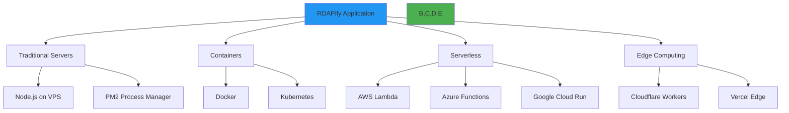

# دليل النشر

> **الغرض:** دليل شامل لنشر RDAPify في بيئات الإنتاج
> **مراجع ذات صلة:** [قائمة تحقق الإنتاج](../getting-started/production_checklist.md) | [الأداء](performance.md) | [الرصد والمراقبة](observability.md)

---

## نظرة عامة على النشر

تدعم RDAPify استراتيجيات نشر متعددة عبر منصات متنوعة:



---

## قائمة التحقق قبل النشر

### المتطلبات الأساسية

- [ ] Node.js 16+ مثبت (أو بيئة تشغيل متوافقة)
- [ ] متغيرات البيئة مضبوطة
- [ ] شهادات SSL/TLS جاهزة
- [ ] أدوات المراقبة مضبوطة
- [ ] استراتيجية النسخ الاحتياطي محددة
- [ ] تحديد المعدل مضبوط
- [ ] استراتيجية التخزين المؤقت مطبّقة
- [ ] معالجة الأخطاء مختبرة
- [ ] تدقيق الأمان مكتمل
- [ ] معايير الأداء محققة

---

## النشر على خادم تقليدي

### Node.js مع PM2

```bash
# تثبيت PM2 عالمياً
npm install -g pm2

# تثبيت التبعيات
npm install --production

# بناء التطبيق
npm run build

# بدء التشغيل مع PM2
pm2 start dist/index.js --name rdapify-app \
  --instances max \
  --exec-mode cluster \
  --max-memory-restart 500M

# حفظ ضبط PM2
pm2 save

# إعداد نص بدء تشغيل PM2
pm2 startup
```

### ملف نظام بيئة PM2

```javascript
// ecosystem.config.js
module.exports = {
  apps: [{
    name: 'rdapify-app',
    script: './dist/index.js',
    instances: 'max',
    exec_mode: 'cluster',
    max_memory_restart: '500M',
    env: {
      NODE_ENV: 'production',
      PORT: 3000,
      CACHE_ENABLED: 'true',
      CACHE_TTL: '3600',
      RATE_LIMIT_ENABLED: 'true'
    },
    error_file: './logs/err.log',
    out_file: './logs/out.log',
    log_date_format: 'YYYY-MM-DD HH:mm:ss Z',
    merge_logs: true,
    autorestart: true,
    watch: false,
    max_restarts: 10,
    min_uptime: '10s'
  }]
};
```

---

## النشر على Docker

### Dockerfile

```dockerfile
# بناء متعدد المراحل للحصول على حجم صورة مثالي
FROM node:18-alpine AS builder

WORKDIR /app

# نسخ ملفات الحزمة
COPY package*.json ./
COPY tsconfig.json ./

# تثبيت التبعيات
RUN npm ci --only=production

# نسخ الكود المصدري
COPY src ./src

# بناء التطبيق
RUN npm run build

# صورة الإنتاج
FROM node:18-alpine

WORKDIR /app

# نسخ التطبيق المبني
COPY --from=builder /app/dist ./dist
COPY --from=builder /app/node_modules ./node-modules
COPY --from=builder /app/package.json ./

# إنشاء مستخدم غير جذري
RUN addgroup -g 1001 -S nodejs && \
    adduser -S nodejs -u 1001

USER nodejs

# كشف المنفذ
EXPOSE 3000

# فحص الصحة
HEALTHCHECK --interval=30s --timeout=3s --start-period=5s --retries=3 \
  CMD node -e "require('http').get('http://localhost:3000/health', (r) => {process.exit(r.statusCode === 200 ? 0 : 1)})"

# بدء التطبيق
CMD ["node", "dist/index.js"]
```

### Docker Compose

```yaml
version: '3.8'

services:
  rdapify:
    build: .
    ports:
      - "3000:3000"
    environment:
      - NODE_ENV=production
      - CACHE_ENABLED=true
      - REDIS_URL=redis://redis:6379
    depends_on:
      - redis
    restart: unless-stopped
    networks:
      - rdapify-network
    healthcheck:
      test: ["CMD", "node", "-e", "require('http').get('http://localhost:3000/health')"]
      interval: 30s
      timeout: 3s
      retry: { maxAttempts: 3 }

  redis:
    image: redis:7-alpine
    ports:
      - "6379:6379"
    volumes:
      - redis-data:/data
    restart: unless-stopped
    networks:
      - rdapify-network

volumes:
  redis-data:

networks:
  rdapify-network:
    driver: bridge
```

### البناء والتشغيل

```bash
# بناء الصورة
docker build -t rdapify:latest .

# تشغيل الحاوية
docker run -d \
  --name rdapify-app \
  -p 3000:3000 \
  -e NODE_ENV=production \
  -e CACHE_ENABLED=true \
  --restart unless-stopped \
  rdapify:latest

# أو استخدام Docker Compose
docker-compose up -d
```

---

## النشر على Kubernetes

### بيان النشر

```yaml
apiVersion: apps/v1
kind: Deployment
metadata:
  name: rdapify
  labels:
    app: rdapify
spec:
  replicas: 3
  selector:
    matchLabels:
      app: rdapify
  template:
    metadata:
      labels:
        app: rdapify
    spec:
      containers:
      - name: rdapify
        image: rdapify:latest
        ports:
        - containerPort: 3000
        env:
        - name: NODE_ENV
          value: "production"
        - name: CACHE_ENABLED
          value: "true"
        - name: REDIS_URL
          valueFrom:
            secretKeyRef:
              name: rdapify-secrets
              key: redis-url
        resources:
          requests:
            memory: "256Mi"
            cpu: "250m"
          limits:
            memory: "512Mi"
            cpu: "500m"
        livenessProbe:
          httpGet:
            path: /health
            port: 3000
          initialDelaySeconds: 30
          periodSeconds: 10
        readinessProbe:
          httpGet:
            path: /ready
            port: 3000
          initialDelaySeconds: 5
          periodSeconds: 5
---
apiVersion: v1
kind: Service
metadata:
  name: rdapify-service
spec:
  selector:
    app: rdapify
  ports:
  - protocol: TCP
    port: 80
    targetPort: 3000
  type: LoadBalancer
```

### تطبيق الضبط

```bash
# إنشاء فضاء الأسماء
kubectl create namespace rdapify

# تطبيق الأسرار
kubectl create secret generic rdapify-secrets \
  --from-literal=redis-url=redis://redis:6379 \
  -n rdapify

# تطبيق النشر
kubectl apply -f k8s/deployment.yaml -n rdapify

# فحص الحالة
kubectl get pods -n rdapify
kubectl get services -n rdapify
```

---

## النشر بدون خادم (Serverless)

### AWS Lambda

```javascript
// lambda/handler.js
const { RDAPClient } = require('rdapify');

const client = new RDAPClient({
  cache: { enabled: true, ttl: 3600 }
});

exports.handler = async (event) => {
  try {
    const { domain, ip, asn } = JSON.parse(event.body);

    let result;
    if (domain) {
      result = await client.domain(domain);
    } else if (ip) {
      result = await client.ip(ip);
    } else if (asn) {
      result = await client.asn(asn);
    } else {
      return {
        statusCode: 400,
        body: JSON.stringify({ error: 'Missing query parameter' })
      };
    }

    return {
      statusCode: 200,
      headers: {
        'Content-Type': 'application/json',
        'Cache-Control': 'public, max-age=3600'
      },
      body: JSON.stringify(result)
    };
  } catch (error) {
    return {
      statusCode: error.statusCode || 500,
      body: JSON.stringify({ error: error.message })
    };
  }
};
```

### ضبط إطار عمل Serverless

```yaml
# serverless.yml
service: rdapify-service

provider:
  name: aws
  runtime: nodejs18.x
  region: us-east-1
  memorySize: 512
  timeout: 30
  environment:
    NODE_ENV: production
    CACHE_ENABLED: true

functions:
  rdapQuery:
    handler: lambda/handler.handler
    events:
      - http:
          path: /query
          method: post
          cors: true

plugins:
  - serverless-offline

package:
  exclude:
    - node_modules/**
    - test/**
```

### النشر على AWS Lambda

```bash
# تثبيت إطار عمل Serverless
npm install -g serverless

# النشر
serverless deploy

# الاختبار
serverless invoke -f rdapQuery --data '{"body":"{\"domain\":\"example.com\"}"}'
```

---

## النشر على حافة الشبكة (Edge Computing)

### Cloudflare Workers

```javascript
// worker.js
import { RDAPClient } from 'rdapify';

const client = new RDAPClient({
  cache: { enabled: true, ttl: 3600 }
});

addEventListener('fetch', event => {
  event.respondWith(handleRequest(event.request));
});

async function handleRequest(request) {
  const url = new URL(request.url);
  const domain = url.searchParams.get('domain');
  const ip = url.searchParams.get('ip');
  const asn = url.searchParams.get('asn');

  try {
    let result;
    if (domain) {
      result = await client.domain(domain);
    } else if (ip) {
      result = await client.ip(ip);
    } else if (asn) {
      result = await client.asn(parseInt(asn));
    } else {
      return new Response('Missing query parameter', { status: 400 });
    }

    return new Response(JSON.stringify(result), {
      headers: {
        'Content-Type': 'application/json',
        'Cache-Control': 'public, max-age=3600'
      }
    });
  } catch (error) {
    return new Response(JSON.stringify({ error: error.message }), {
      status: error.statusCode || 500,
      headers: { 'Content-Type': 'application/json' }
    });
  }
}
```

### النشر على Cloudflare

```bash
# تثبيت Wrangler
npm install -g wrangler

# تسجيل الدخول
wrangler login

# النشر
wrangler publish
```

---

## ضبط البيئة

### متغيرات البيئة

```bash
# .env.production
NODE_ENV=production
PORT=3000

# ضبط التخزين المؤقت
CACHE_ENABLED=true
CACHE_TTL=3600
REDIS_URL=redis://localhost:6379

# تحديد المعدل
RATE_LIMIT_ENABLED=true
RATE_LIMIT_REQUESTS_PER_SECOND=10
RATE_LIMIT_BURST_SIZE=20

# الأمان
SSRF_PROTECTION_ENABLED=true
PII_REDACTION_ENABLED=true

# المراقبة
LOG_LEVEL=info
METRICS_ENABLED=true
TRACING_ENABLED=true

# الأداء
MAX_CONCURRENT_REQUESTS=100
REQUEST_TIMEOUT=30000
```

---

## فحوصات الصحة

### نقطة نهاية فحص الصحة

```javascript
// health.js
export async function healthCheck() {
  const checks = {
    status: 'healthy',
    timestamp: new Date().toISOString(),
    uptime: process.uptime(),
    checks: {}
  };

  // فحص اتصال الذاكرة المؤقتة
  try {
    await cacheClient.ping();
    checks.checks.cache = 'healthy';
  } catch (error) {
    checks.checks.cache = 'unhealthy';
    checks.status = 'degraded';
  }

  // فحص اتصال RDAP
  try {
    await client.domain('example.com');
    checks.checks.rdap = 'healthy';
  } catch (error) {
    checks.checks.rdap = 'unhealthy';
    checks.status = 'degraded';
  }

  return checks;
}
```

---

## النشر بدون توقف

### النشر الأزرق والأخضر

```bash
# نشر الإصدار الجديد (أخضر)
kubectl apply -f k8s/deployment-green.yaml

# الانتظار حتى يصبح الأخضر جاهزاً
kubectl wait --for=condition=ready pod -l version=green

# تحويل الطلبات إلى الأخضر
kubectl patch service rdapify-service -p '{"spec":{"selector":{"version":"green"}}}'

# إزالة الإصدار القديم (أزرق)
kubectl delete deployment rdapify-blue
```

### التحديث المتدرج

```bash
# تحديث الصورة
kubectl set image deployment/rdapify rdapify=rdapify:v0.1.8

# متابعة حالة التحديث
kubectl rollout status deployment/rdapify

# التراجع عند الحاجة
kubectl rollout undo deployment/rdapify
```

---

## موارد إضافية

- [قائمة تحقق الإنتاج](../getting-started/production_checklist.md)
- [دليل الرصد والمراقبة](observability.md)
- [تحسين الأداء](performance.md)
- [أفضل ممارسات الأمان](security-privacy.md)
- [قوالب Kubernetes](../../templates/kubernetes/)
- [أدلة النشر على السحابة](../integrations/cloud/)

---

**هل تحتاج مساعدة في النشر؟** راجع [دليل استكشاف الأخطاء](../troubleshooting/common_errors.md) أو [احصل على الدعم](../support/getting_help.md).
