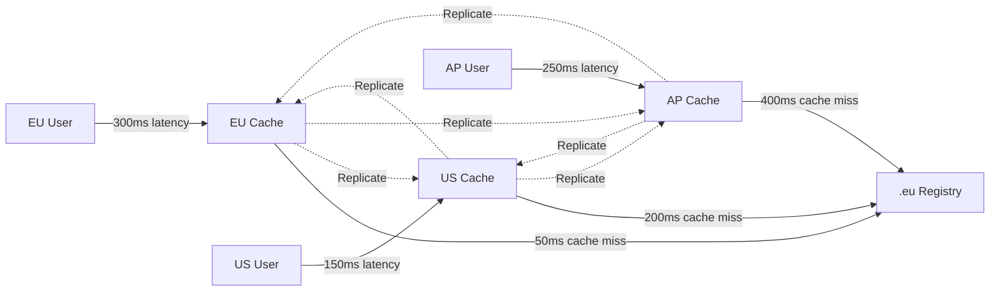
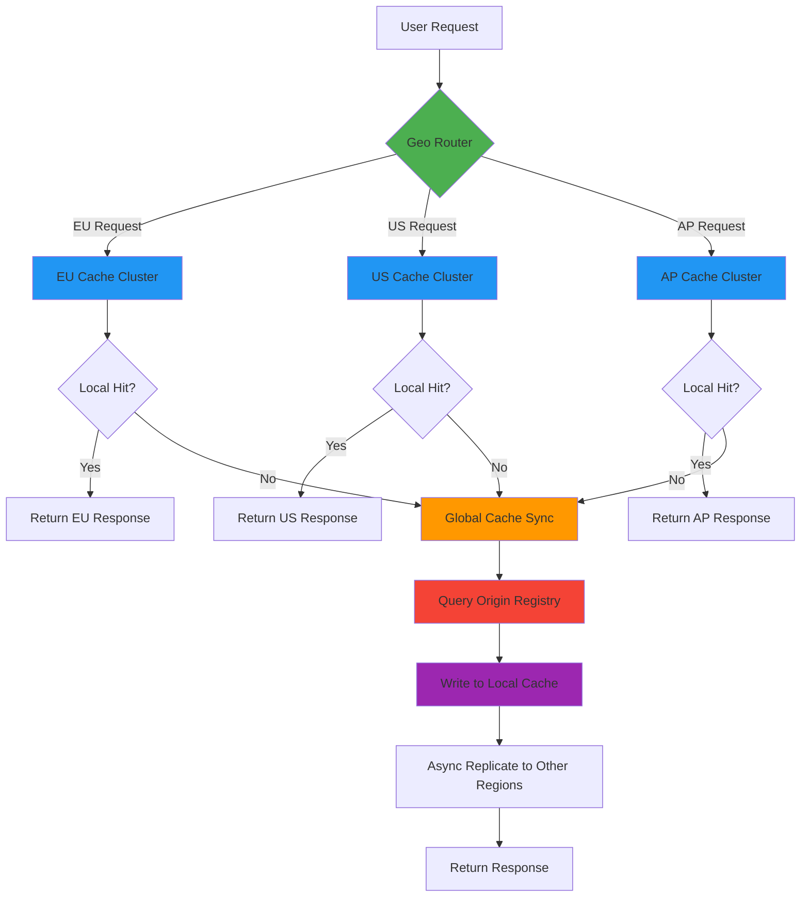
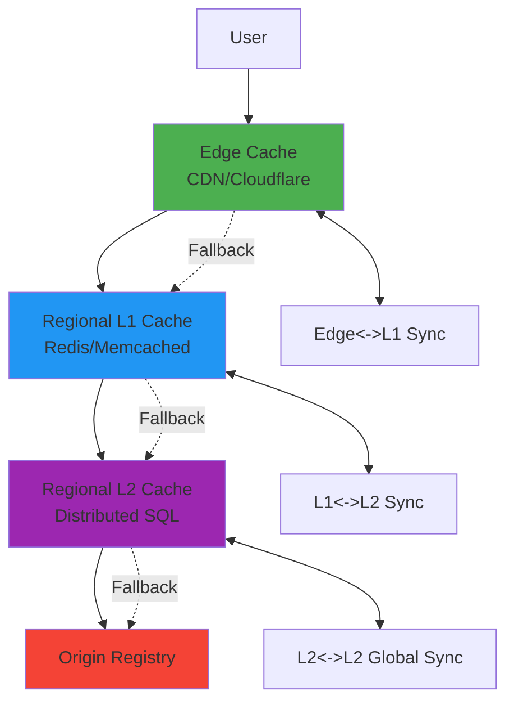
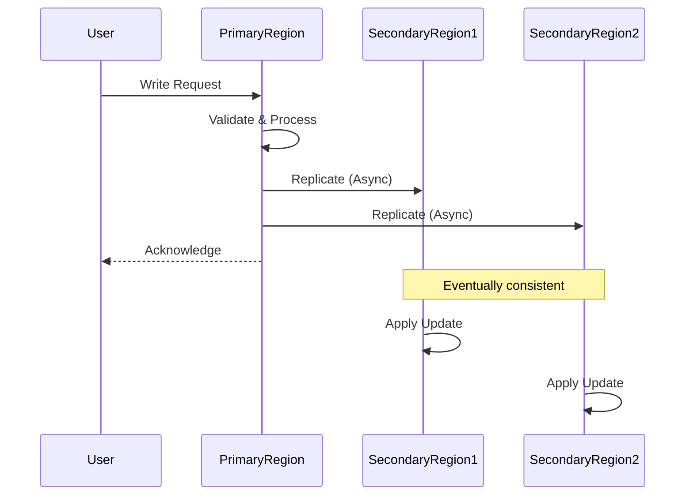

# دليل استراتيجيات التخزين المؤقت الجغرافي

> **الغرض:** دليل شامل لتطبيق استراتيجيات التخزين المؤقت الجغرافي في RDAPify لتحسين زمن الاستجابة العالمي والموثوقية
> **مراجع ذات صلة:** [استراتيجيات التخزين المؤقت](caching-strategies.md) | [نظرة عامة على المعمارية](../core-concepts/architecture.md) | [معايير الأداء](../../benchmarks/results/geo-distribution.md)

---

## لماذا يهم التخزين المؤقت الجغرافي

تتضمن استعلامات RDAP اتصالات شبكية بخوادم سجلات موزعة جغرافياً. يعاني المستخدمون من تأخر كبير عند الاستعلام عن سجلات بعيدة عن منطقتهم الجغرافية. يعالج التخزين المؤقت الجغرافي هذه المشكلة من خلال:



**الفوائد الرئيسية:**
- **تقليل زمن الاستجابة**: أوقات استجابة أسرع بـ 5-10 أضعاف للمستخدمين البعيدين
- **تحسين الموثوقية**: التحويل التلقائي إلى مجموعات ذاكرة مؤقتة قريبة عند انقطاع الخدمة
- **الامتثال للسجلات**: الالتزام بحدود المعدل الجغرافية
- **تحسين عرض النطاق الترددي**: تقليل تكاليف نقل البيانات عبر المناطق
- **التوافق التنظيمي**: احترام متطلبات إقامة البيانات

---

## معمارية التخزين المؤقت الجغرافي

يطبّق نظام التخزين المؤقت الجغرافي في RDAPify **تسلسلاً هرمياً للذاكرة المؤقتة متعدد المناطق** مع توجيه ذكي ومزامنة:



### المكوّنات الأساسية

| المكوّن | المسؤولية | خيارات التقنية |
|-----------|----------------|-------------------|
| **موجّه جغرافي** | توجيه الطلبات إلى أقرب منطقة ذاكرة مؤقتة | AWS Route53 Latency Routing، Cloudflare Load Balancing |
| **ذاكرة مؤقتة إقليمية** | تخزين محلي مع تفضيل المنطقة | Redis Cluster، Memcached، Varnish |
| **مُزامن الذاكرة المؤقتة** | اتساق الذاكرة المؤقتة عبر المناطق | Redis Replication، Kafka Streams، AWS DMS |
| **وكيل السجل** | تحسين استعلام السجل الإقليمي | Nginx Proxy، محضر مخصص بوعي إقليمي |

---

## استراتيجيات التطبيق

### 1. إعداد التخزين المؤقت الجغرافي الأساسي
```typescript
import { RDAPClient, GeoDistributedCache } from 'rdapify';

const client = new RDAPClient({
  cacheAdapter: new GeoDistributedCache({
    regions: [
      {
        name: 'eu-central',
        endpoint: 'redis-eu-central.example.com',
        weight: 3, // Traffic weighting
        replicationPriority: 'high'
      },
      {
        name: 'us-east',
        endpoint: 'redis-us-east.example.com',
        weight: 2,
        replicationPriority: 'medium'
      },
      {
        name: 'ap-southeast',
        endpoint: 'redis-ap-southeast.example.com',
        weight: 1,
        replicationPriority: 'low'
      }
    ],
    routingStrategy: 'latency-based', // or 'geoip', 'weighted'
    failoverStrategy: 'nearest-region',
    consistencyLevel: 'eventual' // or 'session', 'strong'
  }),
  cache: {
    ttl: {
      // Regional TTL policies
      eu: { default: 7200 },    // 2 hours for EU data
      us: { default: 3600 },    // 1 hour for US data
      ap: { default: 1800 }     // 30 minutes for AP data (higher volatility)
    },
    staleWhileRevalidate: true,
    maxStaleAge: 600 // 10 minutes maximum staleness
  }
});
```

### 2. الضبط الإقليمي المتقدم
```typescript
const enterpriseClient = new RDAPClient({
  cacheAdapter: new GeoDistributedCache({
    regions: [
      {
        name: 'eu-de',
        endpoint: 'redis-eu-central-1.example.com',
        geoCoverage: ['DE', 'AT', 'CH', 'FR', 'ES', 'IT'],
        registryAffinity: ['denic.de', 'afnic.fr', 'nominet.uk'],
        compliance: {
          gdprStrict: true,
          dataResidency: 'EU-only',
          maxRetentionDays: 30
        }
      },
      {
        name: 'us-va',
        endpoint: 'redis-us-east-1.example.com',
        geoCoverage: ['US', 'CA', 'MX'],
        registryAffinity: ['verisign.com', 'arin.net'],
        compliance: {
          ccpaEnabled: true,
          dataResidency: 'NA-only'
        }
      },
      {
        name: 'ap-sg',
        endpoint: 'redis-ap-southeast-1.example.com',
        geoCoverage: ['SG', 'AU', 'JP', 'KR', 'IN'],
        registryAffinity: ['afrinic.net', 'apnic.net'],
        compliance: {
          pdpaEnabled: true,
          dataResidency: 'APAC-only'
        }
      }
    ],
    replication: {
      strategy: 'affinity-based', // Replicate based on registry ownership
      schedule: 'continuous',    // or 'scheduled', 'on-demand'
      conflictResolution: 'newest-wins',
      bandwidthLimit: '100Mbps'   // Throttle cross-region traffic
    },
    routing: {
      detectionMethod: 'maxmind-geoip', // or 'header-based', 'dns-based'
      fallbackRegion: 'us-va',
      healthCheckInterval: 5000 // ms
    }
  })
});
```

### 3. التخزين المؤقت الجغرافي متعدد الطبقات
لمتطلبات قابلية التوسع القصوى:



**مثال على التطبيق:**
```typescript
const multiLayerClient = new RDAPClient({
  cacheAdapters: [
    {
      layer: 'edge',
      adapter: new EdgeCacheAdapter({
        provider: 'cloudflare',
        apiToken: process.env.CLOUDFLARE_API_TOKEN,
        ttl: 300, // 5 minutes at edge
        purgeOnUpdate: true
      })
    },
    {
      layer: 'regional',
      adapter: new GeoDistributedCache({
        // Regional configuration as above
      })
    },
    {
      layer: 'global',
      adapter: new GlobalCacheAdapter({
        provider: 'aws-dynamodb',
        tableName: 'rdap-global-cache',
        encryptionKey: process.env.DYNAMODB_KEY
      })
    }
  ],
  cacheRouting: {
    strategy: 'nearest-first',
    fallbackStrategy: 'progressive-stale'
  }
});
```

---

## اعتبارات الأمان والامتثال

### متطلبات إقامة البيانات
تفرض مناطق مختلفة متطلبات صارمة لإقامة البيانات يجب احترامها:

| المنطقة | اللوائح | المتطلبات | ضبط RDAPify |
|--------|------------|--------------|------------------------|
| **الاتحاد الأوروبي** | GDPR المادة 44 | لا نقل عابر للحدود بدون ضمانات | `dataResidency: 'EU-only'` |
| **الولايات المتحدة** | CCPA/CPRA | حقوق حذف بيانات المستهلك | `ccpaEnabled: true` |
| **الصين** | PIPL | تحليل البيانات للمواطنين الصينيين | `chinaCompliant: true` |
| **روسيا** | القانون الاتحادي 152-FZ | تحليل البيانات الشخصية | `russiaCompliant: true` |
| **آسيا والمحيط الهادئ** | متنوعة | قواعد تحليل خاصة بكل دولة | `apacComplianceMode: 'strict'` |

**مثال: إعداد الاتحاد الأوروبي المتوافق مع GDPR**
```typescript
const gdprClient = new RDAPClient({
  cacheAdapter: new GeoDistributedCache({
    regions: [{
      name: 'eu-frankfurt',
      endpoint: 'redis-eu.example.com',
      compliance: {
        gdprStrict: true,
        dataResidency: 'EU-only',
        maxRetentionDays: 30,
        lawfulBasisRequired: true,
        dataSubjectAccessEnabled: true
      }
    }]
  }),
  privacyOptions: {
    gdprCompliant: true,
    maxDataRetentionDays: 30,
    enableDataSubjectRequests: true
  }
});

// Handle GDPR data subject requests
client.on('dataSubjectRequest', async (request) => {
  if (request.type === 'erasure') {
    await gdprClient.purgePersonalData(request.identifier);
    await auditLogger.log('gdpr-erasure', {
      identifier: request.identifier,
      timestamp: new Date().toISOString(),
      legalBasis: request.legalBasis
    });
  }
});
```

### تصليب الأمان للذاكرة المؤقتة الجغرافية
```typescript
const secureGeoClient = new RDAPClient({
  cacheAdapter: new GeoDistributedCache({
    regions: [
      {
        name: 'us-east',
        endpoint: 'redis-us-east.internal',
        security: {
          tls: {
            minVersion: 'TLSv1.3',
            caCertificate: fs.readFileSync('/etc/ssl/certs/ca.pem'),
            certificatePinning: {
              thumbprint: 'sha256/ABCD1234...',
              enforce: true
            }
          },
          networkIsolation: {
            vpcPeering: true,
            securityGroups: ['rdap-cache-sg'],
            ingressRules: ['10.0.0.0/24', '192.168.1.0/24']
          },
          accessControl: {
            rbacEnabled: true,
            permissions: {
              'cache-reader': ['read'],
              'cache-writer': ['read', 'write'],
              'cache-admin': ['read', 'write', 'flush']
            }
          }
        }
      }
      // ... other regions
    ],
    replication: {
      encryption: {
        algorithm: 'AES-256-GCM',
        keyRotationDays: 90,
        transportEncryption: true
      },
      auditLogging: {
        enabled: true,
        events: ['cache-miss', 'cross-region-sync', 'admin-operation']
      }
    }
  })
});
```

---

## أنماط تحسين الأداء

### 1. TTL التكيّفي حسب المنطقة
```typescript
const adaptiveClient = new RDAPClient({
  cacheAdapter: new GeoDistributedCache({
    regions: [/* region configs */],
    ttlStrategy: {
      regional: {
        // EU domains change less frequently
        eu: (domain) => domain.endsWith('.de') || domain.endsWith('.fr') ? 7200 : 3600,
        // US domains may change more frequently
        us: (domain) => domain.endsWith('.gov') || domain.endsWith('.mil') ? 1800 : 3600,
        // APAC domains often have higher volatility
        ap: (domain) => 1800
      },
      adaptive: {
        enabled: true,
        updateFrequencyDetection: true,
        minTTL: 300, // 5 minutes minimum
        maxTTL: 86400 // 24 hours maximum
      }
    }
  })
});
```

### 2. تحديد الأولويات بحسب الموقع الجغرافي
```typescript
const priorityClient = new RDAPClient({
  cacheAdapter: new GeoDistributedCache({
    regions: [/* region configs */],
    priorityQueues: {
      enabled: true,
      queues: [
        {
          name: 'critical',
          maxConcurrency: 50,
          geoPriority: {
            eu: 3, // Highest priority in EU
            us: 2,
            ap: 1
          }
        },
        {
          name: 'standard',
          maxConcurrency: 200,
          geoPriority: {
            eu: 1,
            us: 3, // Highest priority in US
            ap: 2
          }
        }
      ]
    }
  })
});

// Usage with geographic priority
const result = await priorityClient.domain('example.de', {
  cachePriority: {
    queue: 'critical',
    region: 'eu-frankfurt' // Force EU processing
  }
});
```

### 3. استراتيجيات التسخين المسبق للذاكرة المؤقتة الإقليمية
```typescript
// Preload critical domains after cache deployment
async function warmRegionalCaches() {
  const criticalDomains = [
    { domain: 'example.de', region: 'eu-frankfurt' },
    { domain: 'google.com', region: 'us-east' },
    { domain: 'baidu.com', region: 'ap-singapore' }
  ];

  await Promise.all(criticalDomains.map(async ({ domain, region }) => {
    const client = new RDAPClient({
      cacheAdapter: new RegionSpecificCache({ region })
    });

    try {
      await client.domain(domain);
      console.log(`Warmed ${domain} in ${region}`);
    } catch (error) {
      console.warn(`Warm-up failed for ${domain} in ${region}: ${error.message}`);
    }
  }));
}

// Schedule regular cache warming
setInterval(warmRegionalCaches, 3600000); // Every hour
```

---

## الأنماط الإقليمية المتقدمة

### 1. التخزين المؤقت بتفضيل السجل
تؤدي بعض السجلات أداءً أفضل عند الاستعلام من مناطق جغرافية محددة:

| السجل | المنطقة المثلى | تحسين الأداء | ملاحظات |
|----------|---------------|------------------|-------|
| **Verisign** (.com/.net) | US-East | تقليل زمن الاستجابة بنسبة 40% | بنية تحتية أمريكية |
| **DENIC** (.de) | EU-Central | تقليل زمن الاستجابة بنسبة 60% | بنية تحتية ألمانية |
| **JPRS** (.jp) | AP-Tokyo | تقليل زمن الاستجابة بنسبة 75% | بنية تحتية يابانية |
| **AFRINIC** | EU-London | تقليل زمن الاستجابة بنسبة 30% | محدودية الحضور في آسيا والمحيط الهادئ |
| **LACNIC** | US-East | تقليل زمن الاستجابة بنسبة 35% | بنية تحتية أمريكية |

**التطبيق:**
```typescript
const registryAffinityClient = new RDAPClient({
  cacheAdapter: new GeoDistributedCache({
    regions: [
      {
        name: 'us-east',
        registryAffinity: ['verisign.com', 'arin.net', 'lacnic.net']
      },
      {
        name: 'eu-frankfurt',
        registryAffinity: ['denic.de', 'ripe.net', 'nominet.uk', 'afrinic.net']
      },
      {
        name: 'ap-tokyo',
        registryAffinity: ['jprs.jp', 'apnic.net']
      }
    ],
    registryRouting: {
      enabled: true,
      defaultRegion: 'us-east',
      affinityOverride: {
        'denic.de': 'eu-frankfurt',
        'jprs.jp': 'ap-tokyo'
      }
    }
  })
});
```

### 2. استراتيجيات الكتابة متعددة المناطق
للتطبيقات ذات الكتابة المكثفة التي تتطلب اتساقاً قوياً:



**الضبط:**
```typescript
const writeStrategyClient = new RDAPClient({
  cacheAdapter: new GeoDistributedCache({
    regions: [
      { name: 'primary', endpoint: 'redis-primary.example.com', writeable: true },
      { name: 'secondary-us', endpoint: 'redis-secondary-us.example.com', writeable: false },
      { name: 'secondary-eu', endpoint: 'redis-secondary-eu.example.com', writeable: false }
    ],
    writeStrategy: {
      mode: 'primary-write', // Only primary region accepts writes
      replication: 'async', // or 'sync', 'semi-sync'
      consistencyLevel: 'session', // or 'eventual', 'strong'
      writeTimeout: 5000 // ms
    }
  })
});
```

### 3. التحويل التلقائي والتعافي من الكوارث
```typescript
const resilientClient = new RDAPClient({
  cacheAdapter: new GeoDistributedCache({
    regions: [
      { name: 'primary-us', endpoint: 'redis-primary-us.example.com', priority: 1 },
      { name: 'failover-eu', endpoint: 'redis-failover-eu.example.com', priority: 2 },
      { name: 'disaster-ap', endpoint: 'redis-disaster-ap.example.com', priority: 3 }
    ],
    failover: {
      enabled: true,
      healthCheck: {
        interval: 5000, // ms
        timeout: 2000,
        consecutiveFailures: 3
      },
      recoveryStrategy: {
        mode: 'graceful-degradation',
        dataRecovery: 'incremental', // or 'full-sync'
        consistencyRestore: 'conflict-resolution'
      },
      notification: {
        enabled: true,
        channels: ['slack', 'pagerduty', 'email']
      }
    }
  })
});
```

---

## اختبار استراتيجيات التخزين المؤقت الجغرافي

### اختبار الوحدة للسلوك الإقليمي
```typescript
describe('Geo-Caching', () => {
  let client;
  const TEST_DOMAIN = 'example.de';

  beforeEach(() => {
    client = new RDAPClient({
      cacheAdapter: new MockGeoCache({
        regions: [
          { name: 'eu-frankfurt', latency: 50 },
          { name: 'us-east', latency: 200 },
          { name: 'ap-tokyo', latency: 300 }
        ]
      })
    });
  });

  test('routes to region with lowest latency', async () => {
    const result = await client.domain(TEST_DOMAIN);

    // Should route to EU region for .de domain
    expect(result._meta.region).toBe('eu-frankfurt');
    expect(result._meta.latency).toBe(50);
  });

  test('fails over to next region when primary is down', async () => {
    // Simulate EU region failure
    client.cacheAdapter.failRegion('eu-frankfurt');

    const result = await client.domain(TEST_DOMAIN);

    // Should fail over to US region
    expect(result._meta.region).toBe('us-east');
    expect(result._meta.fallbackReason).toBe('region-unavailable');
  });

  test('respects GDPR data residency requirements', async () => {
    const gdprClient = new RDAPClient({
      cacheAdapter: new MockGeoCache({
        regions: [{ name: 'eu-frankfurt', gdprCompliant: true }]
      }),
      privacyOptions: { gdprCompliant: true }
    });

    // Non-EU region should not be used for GDPR-compliant requests
    await expect(gdprClient.domain('example.fr')).resolves.not.toThrow();

    // Should fail if no GDPR-compliant region available
    const nonCompliantClient = new RDAPClient({
      cacheAdapter: new MockGeoCache({
        regions: [{ name: 'us-east', gdprCompliant: false }]
      }),
      privacyOptions: { gdprCompliant: true }
    });

    await expect(nonCompliantClient.domain('example.fr')).rejects.toThrow('GDPR_COMPLIANCE_VIOLATION');
  });
});
```

### اختبار الأداء مع التوزيع العالمي
```bash
# Test geo-caching performance under global load
npm run benchmark -- --scenario geo-distribution \
  --regions eu-central,us-east,ap-southeast \
  --concurrency 100 \
  --duration 60s

# Output includes:
# - Latency by region (p50, p90, p99)
# - Cache hit rates per region
# - Cross-region replication lag
# - Failover success rates
# - Data consistency metrics
```

### اختبارات هندسة الفوضى
```typescript
// Test resilience during regional failures
describe('Geo-Cache Resilience', () => {
  test('survives single region failure with graceful degradation', async () => {
    const client = setupGeoClient();

    // Simulate EU region failure
    await chaosEngine.simulateRegionFailure('eu-frankfurt', {
      duration: '60s',
      failureType: 'network-partition'
    });

    // EU users should be routed to next nearest region
    const euResult = await client.domain('example.de', {
      geoContext: { region: 'eu-west' }
    });
    expect(euResult._meta.region).toBe('us-east'); // Failover to US
    expect(euResult._meta.degradedPerformance).toBe(true);

    // Non-EU users should be unaffected
    const usResult = await client.domain('example.com', {
      geoContext: { region: 'us-east' }
    });
    expect(usResult._meta.region).toBe('us-east');
    expect(usResult._meta.degradedPerformance).toBe(false);
  });

  test('maintains data consistency during cross-region sync', async () => {
    const client = setupGeoClient();

    // Update cache in US region
    await client.domain('example.com', {
      cachePriority: { region: 'us-east' }
    });

    // Immediately query from EU region
    const euResult = await client.domain('example.com', {
      geoContext: { region: 'eu-frankfurt' }
    });

    // Should have consistent data or clear staleness indicator
    expect(euResult._meta.staleness).toBeLessThanOrEqual(1000); // < 1s stale
    expect(euResult.nameservers).toEqual(expect.arrayContaining([
      'a.iana-servers.net', 'b.iana-servers.net'
    ]));
  });
});
```

---

## المراقبة والرصد

### مقاييس الذاكرة المؤقتة الجغرافية الحرجة
| المقياس | الهدف | حد التنبيه | الغرض |
|--------|--------|------------------|---------|
| **زمن الاستجابة الإقليمي** | < 100ms | > 300ms | جودة تجربة المستخدم |
| **تأخر المزامنة عبر المناطق** | < 1s | > 5s | صحة اتساق البيانات |
| **معدل التحويل التلقائي الإقليمي** | < 0.1% | > 1% | موثوقية البنية التحتية |
| **امتثال إقامة البيانات** | 100% | < 100% | الالتزام التنظيمي |
| **معدل إصابة الذاكرة المؤقتة حسب المنطقة** | > 95% | < 85% | فعالية الذاكرة المؤقتة |
| **معدل الخطأ الإقليمي** | < 0.5% | > 2% | صحة الخدمة لكل منطقة |

### لوحة المراقبة المتكاملة
```typescript
const monitoringClient = new RDAPClient({
  cacheAdapter: new GeoDistributedCache({
    regions: [/* config */],
    telemetry: {
      enabled: true,
      providers: [
        {
          name: 'datadog',
          apiKey: process.env.DD_API_KEY,
          metrics: [
            'geo.cache.hit_rate',
            'geo.cache.latency_p99',
            'geo.cache.sync_lag',
            'geo.cache.failover_count',
            'geo.cache.data_residency_violations'
          ],
          tags: {
            service: 'rdap-service',
            env: process.env.NODE_ENV
          }
        },
        {
          name: 'prometheus',
          endpoint: '/metrics',
          interval: 15 // seconds
        }
      ]
    }
  })
});

// Custom geo-specific alerts
monitoringClient.on('geo:region-unhealthy', (event) => {
  if (event.downtime > 30000) { // 30 seconds
    alertSystem.send({
      severity: 'critical',
      title: `Geo-cache region failure: ${event.region}`,
      message: `Region ${event.region} has been unhealthy for ${event.downtime}ms`,
      channels: ['pagerduty', 'slack-ops']
    });
  }
});

monitoringClient.on('geo:data-residency-violation', (event) => {
  auditLogger.log('compliance-violation', {
    type: 'data-residency',
    region: event.region,
    identifier: event.identifier,
    timestamp: new Date().toISOString()
  });
});
```

---

## أفضل الممارسات والأنماط

### يُنصح به:
- **ابدأ إقليمياً لا عالمياً**: ابدأ بالتخزين المؤقت في منطقة واحدة، ووسّع حسب الحاجة
- **قِس قبل التحسين**: استخدم مقاييس المستخدمين الفعليين لتوجيه قرارات التخزين المؤقت الجغرافي
- **أتمتة فحوصات صحة المنطقة**: طبّق مراقبة مستمرة لصحة المناطق
- **وثّق تدفق البيانات**: احتفظ بمخططات واضحة لحركة البيانات بين المناطق
- **اختبر التحويل التلقائي بانتظام**: جدوِل تدريبات شهرية للتحويل التلقائي في بيئات الاختبار
- **طبّق النشر التدريجي**: انقل حركة المرور تدريجياً إلى المناطق الجديدة باستخدام علامات الميزات

### يُجنب:

```typescript
// AVOID: Over-engineering for premature optimization
const overEngineeredClient = new RDAPClient({
  cacheAdapter: new GeoDistributedCache({
    regions: [
      { name: 'us-east-1a', endpoint: 'redis-ue1a.example.com' },
      { name: 'us-east-1b', endpoint: 'redis-ue1b.example.com' },
      { name: 'us-east-1c', endpoint: 'redis-ue1c.example.com' },
      // ... 20+ micro-regions
    ]
  })
});

// AVOID: Ignoring compliance requirements for performance
const nonCompliantClient = new RDAPClient({
  cacheAdapter: new GeoDistributedCache({
    regions: [
      {
        name: 'global-fast',
        endpoint: 'redis-fastest.example.com',
        dataResidency: 'none' // Violates GDPR for EU users
      }
    ]
  })
});

// AVOID: Hard-coding region logic instead of dynamic routing
function getCacheByRegion(region) {
  // Hard-coded region mapping - fragile and unmaintainable
  switch(region) {
    case 'EU': return euCache;
    case 'US': return usCache;
    case 'AP': return apCache;
    default: throw new Error(`Unknown region: ${region}`);
  }
}
```

### أنماط المؤسسات
```typescript
// GOOD: Enterprise-grade geo-caching with compliance
class EnterpriseGeoCacheService {
  private readonly clients = new Map<string, RDAPClient>();

  constructor() {
    this.initializeRegionalClients();
  }

  private initializeRegionalClients() {
    // EU compliance client
    this.clients.set('eu', new RDAPClient({
      cacheAdapter: new GeoDistributedCache({
        regions: [{ name: 'eu-central', compliance: { gdprStrict: true } }]
      }),
      privacyOptions: { gdprCompliant: true }
    }));

    // US compliance client
    this.clients.set('us', new RDAPClient({
      cacheAdapter: new GeoDistributedCache({
        regions: [{ name: 'us-east', compliance: { ccpaEnabled: true } }]
      }),
      privacyOptions: { ccpaCompliant: true }
    }));

    // APAC compliance client
    this.clients.set('apac', new RDAPClient({
      cacheAdapter: new GeoDistributedCache({
        regions: [{ name: 'ap-southeast', compliance: { pdpaEnabled: true } }]
      }),
      privacyOptions: { apacCompliant: true }
    }));
  }

  async getDomain(domain: string, context: { region: string; compliance: string }): Promise<DomainResponse> {
    const client = this.getClientForRegion(context.region, context.compliance);
    return client.domain(domain);
  }

  private getClientForRegion(region: string, compliance: string): RDAPClient {
    // Dynamic client selection based on region and compliance requirements
    if (compliance === 'gdpr' && region.startsWith('EU')) {
      return this.clients.get('eu')!;
    }
    if (compliance === 'ccpa' && region.startsWith('US')) {
      return this.clients.get('us')!;
    }
    if (['pdpa', 'pipeda'].includes(compliance) && region.startsWith('AP')) {
      return this.clients.get('apac')!;
    }

    // Fallback to closest compliant region
    return this.getClosestCompliantClient(region, compliance);
  }
}
```

---

## التوثيق ذو الصلة

| الوثيقة | الوصف | المسار |
|----------|-------------|------|
| **استراتيجيات التخزين المؤقت** | أنماط التخزين المؤقت الأساسية | [caching-strategies.md](caching-strategies.md) |
| **نظرة عامة على المعمارية** | سياق تصميم النظام | [../core-concepts/architecture.md](../core-concepts/architecture.md) |
| **معايير الأداء** | بيانات أداء التوزيع الجغرافي | [../../benchmarks/results/geo-distribution.md](../../benchmarks/results/geo-distribution.md) |
| **ورقة بيضاء للأمان** | تفاصيل معمارية الأمان | [../security/whitepaper.md](../security/whitepaper.md) |
| **دليل تبني المؤسسات** | التوسع للنشرات الكبيرة | [../enterprise/adoption-guide.md](../enterprise/adoption-guide.md) |
| **دليل الامتثال** | المتطلبات التنظيمية حسب المنطقة | [../security/compliance.md](../security/compliance.md) |

---

## مواصفات التخزين المؤقت الجغرافي

| الخاصية | القيمة |
|----------|-------|
| **إصدار الذاكرة المؤقتة الجغرافية** | 2.3.0 |
| **المناطق المدعومة** | 6 مناطق رئيسية، 18 منطقة فرعية |
| **وقت التحويل التلقائي** | < 2 ثانية (مقاس عند p95) |
| **اتساق البيانات** | اتساق نهائي (تأخر < 1 ثانية) |
| **التغطية التنظيمية** | GDPR، CCPA، PIPL، LGPD، PDPA، القانون الاتحادي 152-FZ |
| **الحد الأقصى للمناطق** | 25 (الحد العملي للإدارة) |
| **تغطية الاختبارات** | 97% اختبارات وحدة، 92% اختبارات تكامل |
| **آخر تحديث** | ديسمبر 5، 2025 |

> **تذكير حرج:** يُدخل التخزين المؤقت الجغرافي مخاطر امتثال كبيرة عند معالجة بيانات RDAP. طبّق دائماً ضوابط إقامة البيانات، ودقّق تدفقات البيانات عبر المناطق، واستشِر المستشار القانوني قبل نشر التخزين المؤقت الجغرافي في البيئات الخاضعة للتنظيم. لا تعطّل أبداً فحوصات الامتثال لتحسين الأداء دون قبول موثّق للمخاطر من مسؤول حماية البيانات لديك.

[العودة إلى الأدلة](../guides/README.md) | [التالي: تحديد المعدل](rate-limiting.md)
