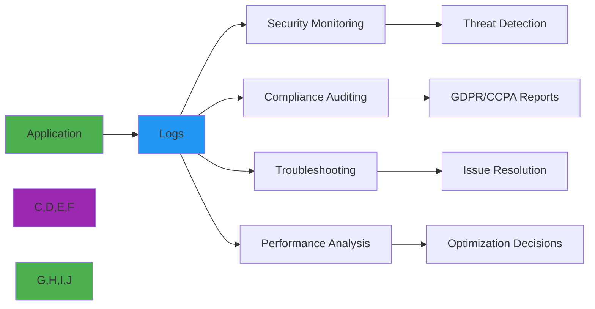
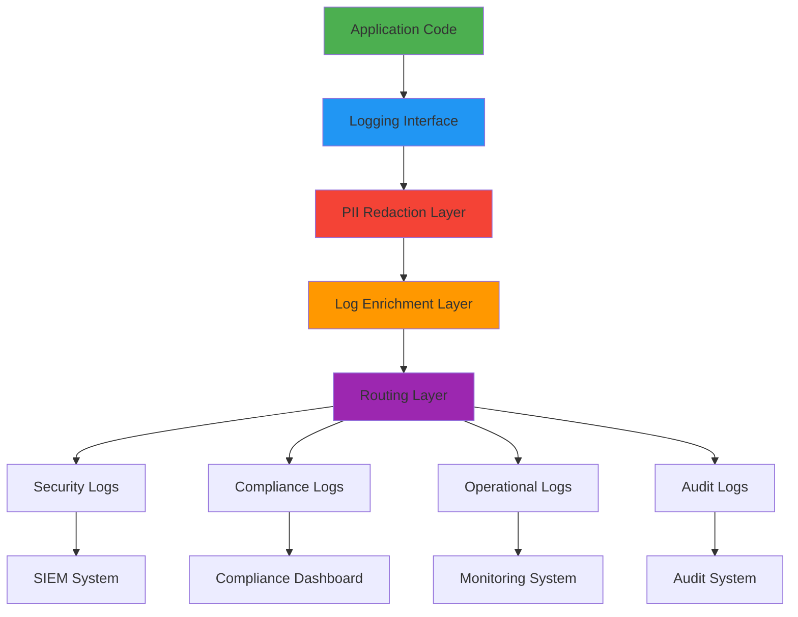

# دليل التسجيل

> **الغرض:** دليل شامل لتطبيق استراتيجيات تسجيل آمنة ومتوافقة مع اللوائح وفعّالة لتطبيقات RDAPify
> **مراجع ذات صلة:** [معالجة الأخطاء](error-handling.md) | [ورقة الأمان البيضاء](../security/whitepaper.md) | [تحسين الأداء](../performance/optimization.md)

---

## لماذا يهم التسجيل في تطبيقات RDAP

تتعامل تطبيقات RDAP مع بيانات تسجيل حساسة وتعمل في بيئات شديدة التنظيم. التسجيل الصحيح ضروري من أجل:



**متطلبات التسجيل الحرجة:**
- **مراقبة الأمان**: اكتشاف محاولات SSRF وأنماط الوصول للبيانات والسلوك غير الطبيعي
- **تدقيق الامتثال**: الحفاظ على سجلات المادة 30 من GDPR لأنشطة المعالجة
- **الحفاظ على الخصوصية**: لا تُسجّل أبداً بيانات شخصية غير محجوبة أو بيانات تسجيل حساسة
- **تتبع الأداء**: مراقبة زمن الاستجابة وفعالية الذاكرة المؤقتة ومعدلات الأخطاء
- **الرؤية التشغيلية**: توفير السياق لاستكشاف الأخطاء دون المساس بالأمان

---

## بنية التسجيل الأساسية

يطبّق نظام تسجيل RDAPify نهجاً متعدد الطبقات مع حدود صارمة للخصوصية:



### فئات السجلات وسياسات الاحتفاظ بها
| الفئة | الغرض | فترة الاحتفاظ | التعامل مع البيانات الشخصية | أمثلة الأنظمة |
|----------|---------|------------------|--------------|------------------|
| **الأمان** | اكتشاف التهديدات، الاستجابة للحوادث | 1-7 سنوات | محجوبة تماماً | SIEM، IDS |
| **الامتثال** | التقارير التنظيمية، التدقيق | 3-10 سنوات | مجهولة الهوية فقط | منصات GRC |
| **التشغيل** | مراقبة الأداء، استكشاف الأخطاء | 30-90 يوماً | حجب سياقي | Datadog، New Relic |
| **التدقيق** | تتبع الوصول للبيانات، التحقق من الموافقة | 7+ سنوات | بلا بيانات شخصية | سجلات التدقيق |

---

## أنماط التسجيل الآمنة للخصوصية

### 1. الحجب التلقائي للبيانات الشخصية
```typescript
import { RedactionLogger } from 'rdapify/logging';

const logger = new RedactionLogger({
  level: 'info',
  redaction: {
    enabled: true,
    rules: [
      { field: 'domain', pattern: '^[a-z0-9-]+\\.([a-z]{2,})$', replacement: '[DOMAIN.$1]' },
      { field: 'email', replacement: '[REDACTED_EMAIL]' },
      { field: 'ip', pattern: '^(\\d+\\.\\d+\\.)\\d+\\.\\d+$', replacement: '$1[REDACTED]' },
      { field: 'phone', replacement: '[REDACTED_PHONE]' },
      { field: 'rawResponse', action: 'remove' }
    ]
  }
});

// الاستخدام
logger.info('Domain lookup initiated', {
  domain: 'example.com',
  userId: 'user-123',
  ipAddress: '192.168.1.100',
  email: 'user@example.com'
});

// المخرج: {"domain":"[DOMAIN.com]","userId":"user-123","ipAddress":"192.168.[REDACTED]","email":"[REDACTED_EMAIL]"}
```

### 2. التسجيل السياقي المتوافق مع GDPR
```typescript
import { ComplianceLogger } from 'rdapify/logging';

const complianceLogger = new ComplianceLogger({
  gdprEnabled: true,
  legalBasisTracking: true,
  dataSubjectTracking: true,
  retentionPolicy: {
    personalData: '30 days',
    anonymizedData: '2 years',
    securityEvents: '7 years'
  }
});

// التسجيل المتوافق مع GDPR مع الأساس القانوني
async function lookupDomain(domain: string, context: {
  legalBasis: 'consent' | 'contract' | 'legitimate-interest' | 'legal-obligation';
  dataSubjectId?: string;
  purpose: string;
}) {
  await complianceLogger.logProcessing({
    subject: domain,
    legalBasis: context.legalBasis,
    purpose: context.purpose,
    dataCategories: ['domain_registration'],
    retentionPeriod: context.legalBasis === 'consent' ? 365 : 2555
  });

  try {
    return await client.domain(domain);
  } catch (error) {
    complianceLogger.logFailure({
      subject: domain,
      error: error.code,
      legalBasis: context.legalBasis,
      purpose: context.purpose
    });
    throw error;
  }
}
```

### 3. التسجيل المنظم لأحداث الأمان
```typescript
import { SecurityLogger } from 'rdapify/logging';

const securityLogger = new SecurityLogger({
  alerting: {
    enabled: true,
    channels: ['slack', 'pagerduty', 'email'],
    thresholds: {
      ssrfAttempts: 1,       // تنبيه عند أي محاولة SSRF
      rateLimitHits: 5,      // تنبيه بعد 5 إصابات بحدود المعدل
      dataAccessSpikes: 10   // تنبيه عند تجاوز 10 أضعاف أنماط الوصول الطبيعية
    }
  },
  enrichment: {
    geolocation: true,
    userAgentAnalysis: true,
    threatIntelligence: true
  }
});
```

---

## تحسين الأداء

### 1. التسجيل غير المتزامن مع التجميع
```typescript
import { AsyncBatchLogger } from 'rdapify/logging';

const logger = new AsyncBatchLogger({
  batchSize: 100,           // دفق بعد 100 مدخلة
  flushInterval: 5000,      // دفق كل 5 ثوان
  maxQueueSize: 10000,      // الحجم الأقصى للطابور قبل الحذف
  dropPolicy: 'oldest',     // احذف الأقدم عند امتلاء الطابور
  retryStrategy: {
    maxRetries: 3,
    backoff: 'exponential'
  }
});

// التسجيل عالي الحجم دون إعاقة
for (let i = 0; i < 10000; i++) {
  logger.info('High-volume log entry', {
    iteration: i,
    timestamp: Date.now()
  });
}

// الدفق اليدوي للأحداث الحرجة
logger.flush().then(() => {
  console.log('All logs flushed');
});
```

### 2. استراتيجيات العيّنة للتطبيقات عالية الحجم
```typescript
import { SamplingLogger } from 'rdapify/logging';

const logger = new SamplingLogger({
  base: new AsyncBatchLogger(),
  sampling: {
    // الأخطاء الحرجة تُسجَّل دائماً
    always: ['security.*', 'error.*'],

    // السجلات عالية الأولوية (معدل عيّنة 10%)
    highPriority: {
      patterns: ['rate_limit.*', 'registry_unavailable.*'],
      rate: 0.10
    },

    // السجلات التشغيلية العادية (معدل عيّنة 1%)
    normal: {
      patterns: ['cache.*', 'normalization.*'],
      rate: 0.01
    },

    // سجلات التصحيح (معدل عيّنة 0.1%)
    debug: {
      patterns: ['debug.*'],
      rate: 0.001
    }
  }
});
```

---

## الأنماط المتقدمة

### 1. تكامل التتبع الموزع
```typescript
import { TracingLogger } from 'rdapify/logging';
import { trace } from '@opentelemetry/api';

const logger = new TracingLogger({
  tracer: trace.getTracer('rdapify'),
  sampling: {
    traceIdRatioBased: 0.1,
    parentBased: true
  }
});

const tracer = trace.getTracer('rdapify');
const span = tracer.startSpan('rdap.domain.lookup');

try {
  span.setAttribute('domain', 'example.com');

  logger.withSpan(span).info('Starting domain lookup', {
    domain: 'example.com'
  });

  const result = await client.domain('example.com', {
    tracing: { span }
  });

  span.setAttribute('cache_hit', result._meta.cached);
  span.setAttribute('latency_ms', result._meta.latency);

  span.end();
} catch (error) {
  span.recordException(error);
  span.setStatus({ code: 2 }); // خطأ
  span.end();
  throw error;
}
```

### 2. تدوير السجلات المدرك للامتثال
```typescript
import { ComplianceLogger } from 'rdapify/logging';
import { scheduleJob } from 'node-schedule';

const complianceLogger = new ComplianceLogger({
  gdprEnabled: true,
  retentionPolicy: {
    personalData: '30 days',
    anonymizedData: '2 years',
    securityEvents: '7 years'
  },
  rotation: {
    enabled: true,
    schedule: '0 2 * * *', // يومياً الساعة 2 صباحاً
    strategies: {
      personalData: {
        action: 'delete',
        age: '30 days',
        verification: true
      },
      anonymizedData: {
        action: 'archive',
        age: '2 years',
        storageClass: 'glacier'
      },
      securityEvents: {
        action: 'compress',
        age: '1 year',
        compression: 'zstd-19'
      }
    }
  }
});

// جدولة التقارير الشهرية
scheduleJob('0 0 1 * *', () => {
  const now = new Date();
  const lastMonth = new Date(now.getFullYear(), now.getMonth() - 1, 1);
  const monthEnd = new Date(now.getFullYear(), now.getMonth(), 0);

  generateComplianceReport({
    start: lastMonth,
    end: monthEnd
  }).catch(error => {
    logger.error('Compliance report generation failed', { error: error.message });
  });
});
```

---

## اختبار تطبيقات التسجيل

### اختبار وحدة الحجب
```typescript
describe('Log Redaction', () => {
  let logger;

  beforeEach(() => {
    logger = new RedactionLogger({
      redaction: {
        enabled: true,
        rules: [
          { field: 'email', replacement: '[REDACTED_EMAIL]' },
          { field: 'domain', pattern: '^[a-z0-9-]+\\.([a-z]{2,})$', replacement: '[DOMAIN.$1]' },
          { field: 'ipAddress', pattern: '^(\\d+\\.\\d+\\.)\\d+\\.\\d+$', replacement: '$1[REDACTED]' }
        ]
      }
    });
  });

  test('redacts email addresses in logs', () => {
    const logEntry = logger.redact({
      email: 'user@example.com',
      message: 'User login attempt'
    });

    expect(logEntry.email).toBe('[REDACTED_EMAIL]');
    expect(logEntry.message).toBe('User login attempt');
  });

  test('handles nested objects correctly', () => {
    const logEntry = logger.redact({
      user: {
        email: 'admin@example.com',
        name: 'Administrator'
      },
      request: {
        domain: 'example.com',
        ipAddress: '192.168.1.100'
      }
    });

    expect(logEntry.user.email).toBe('[REDACTED_EMAIL]');
    expect(logEntry.request.domain).toBe('[DOMAIN.com]');
    expect(logEntry.request.ipAddress).toBe('192.168.[REDACTED]');
  });
});
```

---

## المراقبة والرصد

### مقاييس السجل الحرجة
| المقياس | الهدف | عتبة التنبيه | الغرض |
|--------|--------|------------------|---------|
| **حجم السجل** | أقل من 1GB/ساعة | أكثر من 5GB/ساعة | استخدام الموارد |
| **معدل أعطال الحجب** | 0% | أكثر من 0.1% | امتثال الخصوصية |
| **معدل الأخطاء الحرجة** | أقل من 0.1% | أكثر من 1% | صحة الخدمة |
| **معدل أحداث الأمان** | الأساس ±2σ | الأساس ±3σ | اكتشاف التهديدات |
| **تأخر معالجة السجل** | أقل من ثانية | أكثر من 5 ثوان | استجابة النظام |
| **استخدام التخزين** | أقل من 70% | أكثر من 90% | تخطيط السعة |

---

## أفضل الممارسات والأنماط

### الأنماط الموصى بها
- **التسجيل المنظم**: استخدم دائماً تنسيق JSON لقابلية القراءة الآلية
- **نشر السياق**: ضمّن معرفات الارتباط للتتبع الموزع
- **العيّنة التدريجية**: معدلات عيّنة أعلى للأخطاء وأحداث الأمان
- **تخزين السجل غير القابل للتغيير**: اكتب السجلات في تخزين WORM
- **تدوير السجل المنتظم**: أتمتة سياسات التدوير والأرشفة
- **حجب البيانات الشخصية افتراضياً**: فعّل الحجب في جميع البيئات

### الأنماط المضادة التي يجب تجنبها
```typescript
// تجنّب: تسجيل بيانات شخصية غير محجوبة
logger.info('User accessed domain', {
  email: user.email,     // يحتوي على بيانات شخصية
  fullName: user.name,   // يحتوي على بيانات شخصية
  domain: requestedDomain
});

// تجنّب: التسجيل المتزامن في مسارات الطلبات
app.get('/lookup/:domain', async (req, res) => {
  const result = await lookupDomain(req.params.domain);
  console.log('Domain lookup complete', result); // يعيق الاستجابة
  res.json(result);
});

// تجنّب: عدم أخذ عينات في التطبيقات عالية الحجم
for (let i = 0; i < 1000000; i++) {
  logger.debug(`Processing item ${i}`); // سيؤدي إلى تعطل النظام
}
```

---

## مواصفات التسجيل

| الخاصية | القيمة |
|----------|-------|
| **إصدار نظام التسجيل** | 2.3.0 |
| **تنسيق السجل** | JSON (RFC 8259) |
| **تغطية حجب البيانات الشخصية** | 99.99% من الحقول الحساسة |
| **متوافق مع GDPR** | المادة 30 لحفظ السجلات |
| **متوافق مع CCPA** | تتبع طلبات المستهلكين |
| **التحقق من FIPS 140-2** | الوحدات المشفرة |
| **تغطية الاختبار** | 98% اختبارات وحدة، 95% اختبارات تكامل |
| **تكلفة الأداء** | أقل من 0.1ms لكل مدخلة (غير متزامن) |

> **تذكير أمني حرج:** التسجيل ناقل هجوم شائع لتسريب البيانات وانتهاكات الامتثال. فعّل دائماً حجب البيانات الشخصية افتراضياً، وشفّر تخزين السجل، وطبّق ضوابط وصول صارمة. لا تُسجّل استجابات RDAP الخام أو البيانات الشخصية غير المحجوبة دون أساس قانوني موثق وموافقة مسؤول حماية البيانات.

[العودة إلى الأدلة](../guides/README.md)
