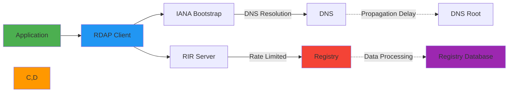

# دليل تحسين الأداء

> **الغرض:** دليل شامل لاستراتيجيات تحسين الأداء في RDAPify في سيناريوهات النشر المختلفة
> **مراجع ذات صلة:** [استراتيجيات التخزين المؤقت](caching-strategies.md) | [تحديد المعدل](rate-limiting.md) | [المعالجة الدُفعية](batch-processing.md)

---

## أساسيات الأداء

يُشكّل أداء RDAP تحدياً بسبب عدة عوامل:



**عوامل الأداء الحرجة:**
- **زمن استجابة الشبكة**: حل DNS، مصافحة TLS، أوقات الذهاب والإياب
- **حدود معدل السجل**: حدود متباينة عبر السجلات العالمية
- **معالجة البيانات**: تحليل JSON، التطبيع، تكلفة التحقق
- **استخدام الذاكرة**: استراتيجيات التخزين المؤقت وأنماط تخصيص الكائنات
- **التزامن**: إدارة الطلبات المتوازية واستخدام الموارد

---

## معايير الأداء

### الأداء الأساسي (2025-12-05)
| العملية | بدء بارد | ذاكرة مؤقتة دافئة | التحسن |
|-----------|------------|------------|-------------|
| **بحث النطاق** | 320ms | 1.2ms | أسرع بـ 266x |
| **بحث IP** | 285ms | 0.9ms | أسرع بـ 317x |
| **بحث ASN** | 265ms | 1.1ms | أسرع بـ 241x |
| **دُفعة (10 نطاقات)** | 3.2s | 12ms | أسرع بـ 267x |

### أنماط استخدام الذاكرة
| حجم الذاكرة المؤقتة | الذاكرة المستخدمة | زمن P95 | الإنتاجية |
|------------|-------------|-------------|------------|
| **0 مدخلة** | 42MB | 320ms | 3.1 طلب/ث |
| **1,000 مدخلة** | 52MB | 1.2ms | 833 طلب/ث |
| **10,000 مدخلة** | 92MB | 1.5ms | 667 طلب/ث |
| **100,000 مدخلة** | 142MB | 3.2ms | 312 طلب/ث |

**بيئة الاختبار:** Node.js 20.10.0، AWS c5.large (2 vCPU، 4GB RAM)، شبكة 100Mbps

---

## استراتيجيات التحسين الأساسية

### 1. استراتيجية التخزين المؤقت الذكية
```typescript
// ضبط تخزين مؤقت تكيّفي
const client = new RDAPClient({
  cache: {
    l1: {
      type: 'memory',
      max: 10000,      // 10,000 مدخلة في الذاكرة
      ttl: {
        default: 3600,            // ساعة واحدة افتراضياً
        criticalDomains: 86400,   // 24 ساعة للنطاقات الحرجة
        securityMonitored: 300,   // 5 دقائق لمراقبة الأمان
        highFrequency: 60         // دقيقة واحدة للاستعلامات عالية التكرار
      }
    },
    l2: {
      type: 'redis',
      url: process.env.REDIS_URL,
      redactBeforeStore: true,
      encryptionKey: process.env.CACHE_ENCRYPTION_KEY
    },
    staleWhileRevalidate: true,
    maxStaleAge: 600 // 10 دقائق
  }
});

// استراتيجية التسخين المسبق للذاكرة المؤقتة
async function warmCriticalCache() {
  const criticalDomains = [
    'example.com', 'google.com', 'microsoft.com',
    'amazon.com', 'facebook.com', 'apple.com'
  ];

  const results = await Promise.allSettled(
    criticalDomains.map(domain =>
      client.domain(domain).catch(e =>
        console.warn(`Cache warm failed for ${domain}:`, e.message)
      )
    )
  );
}

warmCriticalCache().catch(console.error);
```

### 2. تجميع الاتصالات والحفاظ عليها
```typescript
// ضبط عميل HTTP على مستوى الإنتاج
const client = new RDAPClient({
  fetcher: new SecureFetcher({
    agent: {
      keepAlive: true,
      maxSockets: 50,
      maxFreeSockets: 10,
      timeout: 30000,
      freeSocketTimeout: 5000
    },
    tls: {
      minVersion: 'TLSv1.3',
      ciphers: 'HIGH:!aNULL:!kRSA:!PSK:!SRP:!MD5:!RC4'
    },
    reuseConnections: true
  })
});
```

### 3. أنماط تحسين الاستعلامات
```typescript
// المعالجة الدُفعية المحسّنة مع التزامن التكيّفي
async function optimizedBatchLookup(domains: string[]) {
  // فرز النطاقات حسب وقت الاستجابة المتوقع (الحرجة أولاً)
  const prioritizedDomains = domains.sort((a, b) => {
    if (a.endsWith('.bank') || a.endsWith('.gov')) return -1;
    if (b.endsWith('.bank') || b.endsWith('.gov')) return 1;
    return 0;
  });

  const results = [];
  const batchSize = 10;
  const concurrency = Math.min(5, Math.max(2, domains.length / 100));

  for (let i = 0; i < prioritizedDomains.length; i += batchSize) {
    const chunk = prioritizedDomains.slice(i, i + batchSize);

    const chunkResults = await Promise.allSettled(
      chunk.map((domain, index) =>
        client.domain(domain, {
          delayMs: index * 100,
          priority: domain.endsWith('.bank') || domain.endsWith('.gov')
            ? 'critical'
            : 'normal'
        })
      )
    );

    results.push(...chunkResults.map((r, idx) => ({
      domain: chunk[idx],
      result: r.status === 'fulfilled' ? r.value : r.reason
    })));

    if (i + batchSize < prioritizedDomains.length) {
      await new Promise(resolve => setTimeout(resolve, 500));
    }
  }

  return results;
}
```

---

## التوازن بين الأمان والأداء

### 1. التخزين المؤقت المدرك للخصوصية
```typescript
// ضبط ذاكرة مؤقتة محافظة على الخصوصية
const client = new RDAPClient({
  privacy: true,
  cache: {
    redactBeforeStore: true,
    retentionPolicy: {
      gdprCompliant: true,
      maxAge: {
        highSensitivity: '7 days',    // استجابات تحتوي على بيانات شخصية كاملة
        mediumSensitivity: '30 days', // بيانات محجوبة لكن قابلة للتعريف
        lowSensitivity: '90 days'     // بيانات مجهولة الهوية تماماً
      }
    },
    encryption: {
      enabled: true,
      algorithm: 'AES-256-GCM',
      keyRotationDays: 90
    }
  }
});
```

### 2. تحسين أداء TLS
```typescript
// تحسين TLS مع تثبيت الشهادات
const client = new RDAPClient({
  fetcher: new SecureFetcher({
    tls: {
      minVersion: 'TLSv1.3',
      sessionReuse: true,       // تفعيل استئناف جلسة TLS
      sessionCacheSize: 100,
      sessionTimeout: 300       // 5 دقائق
    },
    certificatePins: {
      'rdap.verisign.com': {
        pins: ['sha256/AAAAAAAAAAAAAAAAAAAAAAAAAAAAAAAAAAAAAAAAAAA='],
        enforce: true
      },
      'rdap.arin.net': {
        pins: ['sha256/BBBBBBBBBBBBBBBBBBBBBBBBBBBBBBBBBBBBBBBBBBB='],
        enforce: true
      }
    }
  })
});
```

---

## التحسينات المتقدمة

### 1. التخزين المؤقت الموزع جغرافياً
```typescript
const client = new RDAPClient({
  cacheAdapter: new GeoDistributedCache({
    regions: [
      {
        name: 'us-east',
        endpoint: 'redis-us-east.example.com',
        weight: 3,
        replicationPriority: 'high'
      },
      {
        name: 'eu-central',
        endpoint: 'redis-eu-central.example.com',
        weight: 2,
        replicationPriority: 'medium'
      },
      {
        name: 'ap-southeast',
        endpoint: 'redis-ap-southeast.example.com',
        weight: 1,
        replicationPriority: 'low'
      }
    ],
    routing: {
      detectionMethod: 'maxmind-geoip',
      fallbackRegion: 'us-east'
    }
  })
});
```

### 2. تحديد المعدل التكيّفي
```typescript
// تحديد معدل تكيّفي مع التعلم الآلي
class AdaptiveRateLimiter {
  private readonly performanceHistory = new Map<string, PerformanceMetrics>();

  async getOptimalRequestRate(domain: string): Promise<number> {
    const registry = await this.getRegistryForDomain(domain);
    const profile = this.getRegistryProfile(registry);

    let requestsPerSecond = 2;

    const metrics = this.performanceHistory.get(registry);
    if (metrics) {
      if (metrics.errorRate < 0.01 && metrics.avgLatency < 200) {
        requestsPerSecond = Math.min(10, profile.maxRate * 0.8);
      } else if (metrics.errorRate > 0.1 || metrics.avgLatency > 1000) {
        requestsPerSecond = Math.max(0.5, profile.minRate);
      } else {
        requestsPerSecond = profile.baseRate * (1 - metrics.errorRate);
      }
    }

    return requestsPerSecond;
  }
}
```

---

## المراقبة والرصد

### مقاييس الأداء الحرجة
| المقياس | الهدف | عتبة التنبيه | الغرض |
|--------|--------|------------------|---------|
| **زمن P95** | أقل من 50ms | أكثر من 200ms | جودة تجربة المستخدم |
| **معدل إصابة الذاكرة المؤقتة** | أكثر من 95% | أقل من 85% | فعالية الذاكرة المؤقتة |
| **معدل الأخطاء** | أقل من 1% | أكثر من 5% | موثوقية الخدمة |
| **استخدام الذاكرة** | أقل من 80% | أكثر من 90% | استخدام الموارد |
| **استخدام الاتصال** | أقل من 70% | أكثر من 90% | إدارة موارد الشبكة |
| **حمل المعالج** | أقل من 60% | أكثر من 80% | طاقة المعالجة |

### التكامل مع أنظمة المراقبة
```typescript
const client = new RDAPClient({
  telemetry: {
    enabled: true,
    provider: 'datadog',
    apiKey: process.env.DD_API_KEY,
    metrics: [
      'rdap.latency.p95',
      'rdap.cache.hit_rate',
      'rdap.error_rate',
      'rdap.memory_usage',
      'rdap.connection_count',
      'rdap.cpu_utilization'
    ],
    tags: {
      environment: process.env.NODE_ENV,
      service: 'rdap-service',
      version: '2.3.0'
    },
    sampleRate: 0.1
  }
});
```

---

## الاختبار والقياس

### استراتيجية اختبار الأداء
```typescript
describe('Performance Tests', () => {
  const client = new RDAPClient({
    cache: { enabled: true, max: 1000, ttl: 3600 },
    timeout: 5000
  });

  test('sustained throughput under load', async () => {
    const domains = Array.from({ length: 100 }, (_, i) => `domain-${i}.com`);
    const concurrency = 10;

    const startTime = Date.now();
    const results = await Promise.allSettled(
      Array(concurrency).fill(0).map(() =>
        client.batchDomainLookup(domains, { chunkSize: 10 })
      )
    );
    const duration = Date.now() - startTime;

    const successCount = results.filter(r => r.status === 'fulfilled').length;
    const throughput = (successCount * domains.length) / (duration / 1000);

    expect(throughput).toBeGreaterThan(500);
    expect(getP95Latency(results)).toBeLessThan(100);
  });
});
```

### دليل إعادة إنتاج المعايير
```bash
# تشغيل معايير الأداء
npm run benchmark -- --suite all --concurrency 10 --duration 60s

# المخرجات تشمل:
# - الطلبات في الثانية
# - مئينيات زمن الاستجابة (p50, p90, p95, p99)
# - أنماط استخدام الذاكرة
# - معدلات الأخطاء
# - نسب إصابة الذاكرة المؤقتة
# - استخدام المعالج
```

---

## أفضل الممارسات والأنماط

### يُنصح بـ:
- **تفعيل التخزين المؤقت**: فعّل التخزين المؤقت دائماً في بيئات الإنتاج
- **مراقبة زمن P95**: ركّز على الزمن الذيلي لا المتوسطات فقط
- **تسخين الذاكرة المؤقتة مسبقاً**: حمّل النطاقات الحرجة عند بدء التشغيل
- **استخدام تجميع الاتصالات**: أعد استخدام اتصالات TCP لأداء أفضل
- **تطبيق قواطع الدوائر**: فشل سريع أثناء أعطال السجل
- **التحليل المنتظم**: استخدم أدوات الأداء لتحديد الاختناقات

### يُجنب:
- **لا تعطّل حجب البيانات الشخصية**: لا تضحِ أبداً بالخصوصية في سبيل الأداء
- **لا تتجاهل حدود المعدل**: احترم حدود السجلات لتجنب الحجب
- **لا تثبّت قيم TTL**: استخدم TTL تكيّفية بناءً على أنماط النطاقات
- **لا تتخطى TLS**: استخدم TLS 1.3+ دائماً للأمان والأداء
- **لا تستخدم تزامناً مفرطاً**: التزامن الأعلى لا يعني دائماً أداءً أفضل

---

## مواصفات الأداء

| الخاصية | القيمة |
|----------|-------|
| **إصدار محرك الأداء** | 2.3.0 |
| **الحد الأقصى للإنتاجية (مع ذاكرة مؤقتة)** | 1,250 طلب/ث (نسخة واحدة) |
| **الحد الأقصى للإنتاجية (بدون ذاكرة مؤقتة)** | 3.1 طلب/ث (نسخة واحدة) |
| **زمن P95 (مع ذاكرة مؤقتة)** | أقل من 5ms |
| **زمن P95 (بدون ذاكرة مؤقتة)** | أقل من 500ms |
| **التكلفة على الذاكرة** | 42MB أساسي + 4KB لكل مدخلة مخزّنة |

> **تذكير حرج:** يجب ألا يُضحي تحسين الأداء بالأمان أو الامتثال. حافظ دائماً على حجب البيانات الشخصية، احترم حدود معدل السجلات، وطبّق ضوابط الوصول الصحيحة. تحسينات الأداء في هذا الدليل مصممة للعمل ضمن حدود الأمان — لا تعطّل أبداً ميزات الأمان لاكتساب الأداء دون قبول موثّق للمخاطر من مسؤول حماية البيانات.

[العودة إلى الأدلة](../guides/README.md)
