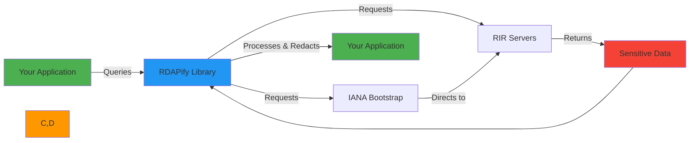
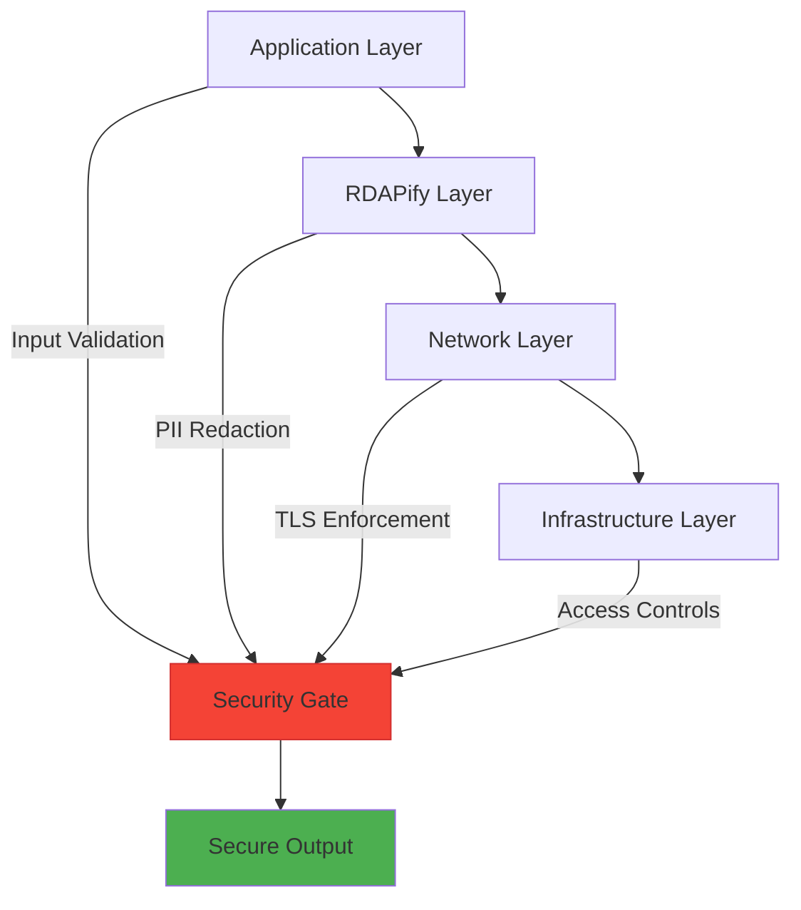
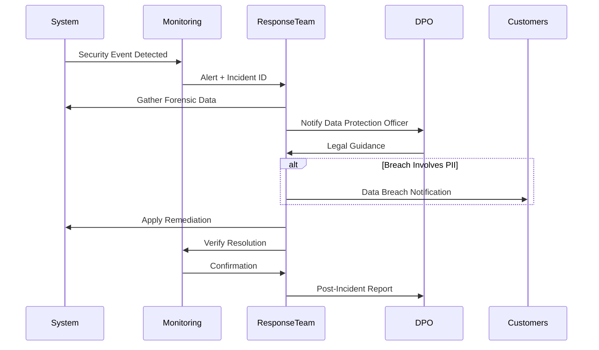

# دليل الأمان والخصوصية

> **الغرض:** دليل شامل لبناء تطبيقات RDAP آمنة ومتوافقة مع اللوائح وصديقة للخصوصية باستخدام RDAPify
> **مراجع ذات صلة:** [ورقة الأمان البيضاء](../security/whitepaper.md) | [دليل الامتثال](../security/compliance.md) | [تطبيق GDPR](../security/gdpr-compliance.md)

---

## مشهد الأمان والخصوصية في RDAP

يتعامل بروتوكول RDAP (Registration Data Access Protocol) مع بيانات تسجيل حساسة عبر سجلات عالمية، مما يجعل الأمان والخصوصية اعتبارين بالغي الأهمية:



**التحديات الرئيسية:**
- **تدفقات البيانات العالمية**: تتجاوز البيانات حدوداً قضائية متعددة
- **حساسية البيانات الشخصية**: غالباً ما تحتوي بيانات التسجيل على معلومات شخصية
- **التعقيد التنظيمي**: تنطبق GDPR وCCPA وغيرها من اللوائح
- **سطح الهجوم**: ثغرات SSRF، وتجاوز حدود المعدل، وحقن البيانات
- **حدود الثقة**: مستويات أمان متباينة عبر السجلات العالمية

---

## مبادئ الأمان الأساسية

### 1. الخصوصية كإعداد افتراضي
تطبق RDAPify **الأمان بالقبول المسبق** مع إعدادات افتراضية تحافظ على الخصوصية:

```typescript
// الضبط الآمن الافتراضي
const client = new RDAPClient({
  // تفعيل حجب البيانات الشخصية افتراضياً
  privacy: true,

  // إعدادات أمان الشبكة الافتراضية
  blockPrivateIPs: true,
  blockCloudMeta: true,

  // أمان الذاكرة المؤقتة
  cache: {
    redactBeforeStore: true,
    maxAge: 2592000 // 30 يوماً كحد أقصى
  },
});

// تجنّب: تعطيل الإعدادات الافتراضية للأمان دون مسوّغ
const insecureClient = new RDAPClient({
  privacy: false,                               // لا تعطّل أبداً دون أساس قانوني موثق
  ssrfProtection: { blockPrivateIPs: false },   // ثغرة SSRF
});
```

### 2. الصلاحيات الأدنى
طبّق ضوابط وصول صارمة وفق مبدأ الصلاحيات الأدنى:

```typescript
// التحكم في الوصول المستند إلى الأدوار
const securityClient = new RDAPClient({
  accessControl: {
    roles: {
      'admin': {
        permissions: ['full-access', 'raw-data', 'cache-management'],
        ipRestrictions: ['10.0.0.0/24']
      },
      'security-analyst': {
        permissions: ['security-data', 'anomaly-detection'],
        ipRestrictions: ['192.168.1.0/24']
      },
      'end-user': {
        permissions: ['redacted-data'],
        rateLimit: { max: 10, window: 60 } // 10 طلبات/دقيقة
      }
    },
    defaultRole: 'end-user'
  }
});
```

### 3. الدفاع المتعمق
طبّق ضوابط أمنية متعددة الطبقات للحماية من نقاط الفشل الفردية:



---

## أنماط الأمان المتقدمة

### 1. الحماية من SSRF (تزوير الطلبات من جانب الخادم)
SSRF هو التهديد الأول لتطبيقات RDAP. توفر RDAPify حماية شاملة:

```typescript
// حماية SSRF متعددة الطبقات
const ssrfProtectedClient = new RDAPClient({
  ssrfProtection: {
    // حمايات على مستوى الشبكة
    blockPrivateIPs: true,
    blockReservedRanges: true,
    blockCloudMetadata: true,

    // حمايات على مستوى التطبيق
    allowlistRegistries: [
      'rdap.verisign.com',
      'rdap.arin.net',
      'rdap.ripe.net',
      'rdap.apnic.net',
      'rdap.lacnic.net',
      'rdap.afrinic.net'
    ],

    // تثبيت الشهادات للسجلات الحرجة
    certificatePins: {
      'rdap.verisign.com': ['sha256/AAAAAAAAAAAAAAAAAAAAAAAAAAAAAAAAAAAAAAAAAAA='],
      'rdap.arin.net': ['sha256/BBBBBBBBBBBBBBBBBBBBBBBBBBBBBBBBBBBBBBBBBBB=']
    },

    // حمايات سلوكية
    requestValidation: {
      maxDepth: 3, // الحد الأقصى لعمق إعادة التوجيه
      timeout: 8000, // مهلة 8 ثوان
      followRedirects: false // معطّل افتراضياً
    }
  }
});

// معالجة أحداث محاولات SSRF
client.on('ssrfAttemptBlocked', (details) => {
  securityLogger.alert('SSRF_ATTEMPT', {
    blockedUrl: details.blockedUrl,
    attackerIp: details.requestContext.ip,
    timestamp: new Date().toISOString(),
    automaticBlock: true
  });

  // تشغيل سير عمل الاستجابة للحوادث
  incidentResponse.trigger('ssrf-attempt', details);
});
```

### 2. محرك حجب البيانات الشخصية
يُحدد محرك الحجب في RDAPify البيانات الحساسة ويحجبها تلقائياً:

```typescript
// ضبط دقيق لحجب البيانات الشخصية
const privacyClient = new RDAPClient({
  redaction: {
    level: 'enterprise', // 'none' | 'basic' | 'strict' | 'enterprise'
    fields: {
      // حقول جهات الاتصال الفردية
      email: {
        redact: true,
        preserveBusiness: true, // الاحتفاظ بالبريد الإلكتروني للأعمال
        maskPattern: 'REDACTED@*.invalid'
      },
      phone: {
        redact: true,
        maskPattern: '+REDACTED'
      },
      name: {
        redact: true,
        preserveOrganizations: true // الاحتفاظ بأسماء المنظمات
      },
      address: {
        redact: true,
        preserveCountry: true // الاحتفاظ برمز الدولة
      },

      // الحفاظ على البيانات التقنية
      ip: {
        redact: false,
        privateOnly: true // حجب عناوين IP الخاصة فقط
      },
      nameserver: {
        redact: false
      }
    },

    // قواعد خاصة بنوع الكيان
    entities: {
      registrant: { redactLevel: 'strict' },
      technicalContact: { preserveEmail: true },
      abuseContact: { preserveEmail: true },
      registrar: { redactLevel: 'none' } // لا تحجب أسماء المسجّلين أبداً
    },

    // معالجة خاصة لسياقات الأمان
    contexts: {
      'security-monitoring': {
        preserveTechnicalContacts: true,
        preserveAbuseContacts: true
      },
      'user-facing': {
        redactLevel: 'strict',
        preserveOnlyOrganizations: true
      }
    }
  }
});
```

### 3. تطبيق امتثال GDPR/CCPA
طبّق الامتثال التنظيمي باستخدام الأدوات المدمجة:

```typescript
// سير عمل الامتثال الآلي
const complianceClient = new RDAPClient({
  compliance: {
    // ضبط GDPR
    gdpr: {
      enabled: true,
      lawfulBasis: 'legitimate-interest', // 'consent' | 'contract' | 'legal-obligation'
      maxRetentionDays: 30,
      enableDataSubjectRights: true,
      dpoContact: 'dpo@yourcompany.com'
    },

    // ضبط CCPA
    ccpa: {
      enabled: true,
      'doNotSell': true,
      enableOptOut: true,
      enableDeletionRequests: true
    },

    // سير عمل الامتثال الآلي
    workflows: {
      dataSubjectRequest: {
        responseTimeHours: 72,
        verificationRequired: true,
        auditTrail: true
      },
      breachNotification: {
        reportingThreshold: 'any-pii-exposure',
        notificationHours: 72
      }
    }
  }
});

// تطبيق حق الحذف
async function handleDataDeletionRequest(identifier: string) {
  // تسجيل طلب الحذف
  await complianceClient.logDeletionRequest(identifier, {
    reason: 'data-subject-request',
    timestamp: new Date().toISOString(),
    legalBasis: 'gdpr-article-17'
  });

  // تنفيذ الحذف
  await complianceClient.deletePersonalData(identifier);

  // إنشاء تقرير الامتثال
  const report = await complianceClient.generateDeletionReport(identifier);

  // إشعار مسؤول حماية البيانات
  await emailService.send({
    to: 'dpo@yourcompany.com',
    subject: `GDPR Deletion Completed - ${identifier}`,
    body: report
  });
}
```

---

## نمذجة التهديدات والتخفيف منها

### ناقلات الهجوم الشائعة لتطبيقات RDAP

| التهديد | التأثير | استراتيجية التخفيف | ميزة RDAPify |
|--------|--------|---------------------|-----------------|
| **SSRF** | الوصول للشبكة الداخلية، تسريب البيانات | قوائم IP المسموح بها، حجب IPs الخاصة | `ssrfProtection` |
| **DoS** | تعطّل الخدمة، استنزاف الموارد | تحديد المعدل، قواطع الدوائر | `rateLimiting`, `circuitBreaker` |
| **حقن البيانات** | XSS، حقن الأوامر | التحقق من المدخلات، تشفير المخرجات | `dataValidation` |
| **MITM** | اعتراض البيانات والتلاعب بها | تثبيت الشهادات، TLS 1.3+ | `tlsOptions`, `certificatePins` |
| **تسميم الذاكرة المؤقتة** | تلف البيانات، تجاوز الأمان | التحقق من الذاكرة المؤقتة، الإصدار | `cacheValidation` |
| **تسريب البيانات الشخصية** | انتهاكات الخصوصية، غرامات تنظيمية | حجب البيانات، ضوابط الوصول | `redaction`, `accessControl` |

### أنماط اختبار الأمان

```typescript
// اختبارات أمان شاملة
describe('Security Tests', () => {
  let client: RDAPClient;

  beforeEach(() => {
    client = new RDAPClient({
      privacy: true,
      ssrfProtection: {
        blockPrivateIPs: true,
        blockCloudMetadata: true,
        allowlistRegistries: ['rdap.verisign.com']
      }
    });
  });

  test('blocks SSRF attempts to private IPs', async () => {
    const privateIPs = [
      '192.168.1.1',
      '10.0.0.1',
      '172.16.0.1',
      '127.0.0.1',
      '169.254.169.254' // نقطة نهاية بيانات AWS الوصفية
    ];

    for (const ip of privateIPs) {
      await expect(client.ip(ip)).rejects.toThrow('RDAP_SSRF_ATTEMPT');
    }
  });

  test('prevents cache poisoning via malicious domains', async () => {
    const maliciousDomain = 'xn--google.com.bad-actor.xn--com';

    await expect(client.domain(maliciousDomain)).rejects.toThrow('INVALID_DOMAIN_FORMAT');

    const cacheStats = await client.getCacheStats();
    expect(cacheStats.entries).toBe(0);
  });

  test('enforces PII redaction in all contexts', async () => {
    const result = await client.domain('example.com');

    expect(result.registrant?.name).toBe('REDACTED');
    expect(result.registrant?.email).toBe('REDACTED@redacted.invalid');
    expect(result.registrant?.phone).toBe('REDACTED');
    expect(result.registrant?.address).toEqual(['REDACTED', 'REDACTED', 'REDACTED']);

    expect(result.registrar?.name).not.toBe('REDACTED');
    expect(result.abuseContact?.email).not.toBe('REDACTED');
  });
});
```

---

## قائمة التحقق من النشر الآمن

### التحقق من الأمان قبل الإنتاج
```typescript
// نص التحقق من الأمان
async function validateSecurityConfiguration(client: RDAPClient) {
  const results = {
    ssrfProtection: await testSSRFProtection(client),
    piiRedaction: await testPIIRedaction(client),
    tlsSecurity: await testTLSSecurity(client),
    rateLimiting: await testRateLimiting(client),
    cacheSecurity: await testCacheSecurity(client)
  };

  const report = generateSecurityReport(results);

  if (report.criticalIssues.length > 0) {
    console.error('CRITICAL SECURITY ISSUES FOUND:');
    report.criticalIssues.forEach(issue => console.error(`- ${issue}`));
    process.exit(1);
  }

  if (report.mediumIssues.length > 0) {
    console.warn('MEDIUM SECURITY ISSUES FOUND:');
    report.mediumIssues.forEach(issue => console.warn(`- ${issue}`));
  }

  console.log('Security validation passed');
  return report;
}

validateSecurityConfiguration(productionClient).catch(error => {
  console.error('Security validation failed:', error.message);
  process.exit(1);
});
```

### مراقبة الأمان في الإنتاج
```typescript
// تكامل مراقبة الأمان
const monitoringClient = new RDAPClient({
  monitoring: {
    enabled: true,
    providers: [
      {
        name: 'datadog',
        apiKey: process.env.DD_API_KEY,
        metrics: [
          'security.ssrf_attempts',
          'security.pii_leakage_attempts',
          'security.tls_failures',
          'security.rate_limit_violations'
        ],
        alerts: {
          threshold: {
            ssrfAttempts: 1,       // تنبيه عند أي محاولة SSRF
            piiExposure: 0,        // تنبيه عند أي تسريب للبيانات الشخصية
            tlsFailures: 5         // تنبيه بعد 5 أعطال TLS
          },
          channels: ['pagerduty', 'slack-security']
        }
      },
      {
        name: 'audit-log',
        retentionDays: 365,
        piiMasking: true
      }
    ]
  }
});

// معالجة أحداث الأمان في الوقت الفعلي
monitoringClient.on('securityEvent', async (event) => {
  switch (event.type) {
    case 'ssrf_attempt':
      await incidentResponse.handleSSRF(event);
      break;

    case 'pii_exposure':
      await incidentResponse.handlePIIExposure(event);
      break;

    case 'tls_failure':
      if (event.count > 5) {
        await incidentResponse.handleCertificateIssue(event);
      }
      break;

    case 'rate_limit_violation':
      await incidentResponse.handleRateLimitViolation(event);
      break;
  }
});
```

---

## إجراءات الاستجابة للحوادث

### سير عمل الحوادث الأمنية


### الاستجابة الآلية للحوادث
```typescript
// نظام الاستجابة الآلية للحوادث الأمنية
class SecurityIncidentResponse {
  private readonly notificationChannels = [
    { type: 'pagerduty', apiKey: process.env.PD_API_KEY },
    { type: 'slack', webhook: process.env.SLACK_SECURITY_WEBHOOK },
    { type: 'email', recipients: ['security@company.com', 'dpo@company.com'] }
  ];

  async handleIncident(incident: SecurityIncident) {
    // توليد معرف حادث فريد
    const incidentId = `INC-${Date.now()}-${Math.random().toString(36).substr(2, 9)}`;

    // تسجيل تفاصيل الحادث بأمان
    await this.logIncident(incidentId, incident);

    // تطبيق المعالجة التلقائية
    await this.applyRemediation(incident);

    // إشعار فريق الاستجابة
    await this.notifyTeam(incidentId, incident);

    // تصعيد إلى مسؤول حماية البيانات في حال تضمّن بيانات شخصية
    if (incident.involvesPII) {
      await this.notifyDPO(incidentId, incident);
    }

    return { incidentId, status: 'responded' };
  }
}
```

---

## مواصفات الأمان

| الخاصية | القيمة |
|----------|-------|
| **معيار الأمان** | OWASP ASVS 4.0، NIST SP 800-53 |
| **التشفير** | AES-256-GCM للبيانات الساكنة، TLS 1.3+ للبيانات المتنقلة |
| **تغطية حجب البيانات الشخصية** | 100% من البيانات الشخصية المحددة في GDPR/CCPA |
| **زمن الاستجابة للثغرات** | أقل من 24 ساعة للثغرات الحرجة |
| **سجلات التدقيق** | سجل تدقيق كامل لجميع عمليات الوصول للبيانات |
| **اختبار الاختراق** | اختبارات اختراق سنوية من طرف ثالث |
| **شهادات الامتثال** | SOC 2 Type II (جارٍ)، متوافق مع GDPR |

> **تذكير حرج:** الأمان عملية مستمرة وليس ضبطاً لمرة واحدة. راجع وضعك الأمني بانتظام، حدّث التبعيات، اختبر الثغرات، وابقَ على اطلاع بالتهديدات الناشئة. لا تعطّل أبداً ميزات الأمان كحجب البيانات الشخصية أو حماية SSRF دون أساس قانوني موثق وموافقة مسؤول حماية البيانات.

[العودة إلى الأدلة](../guides/README.md)
