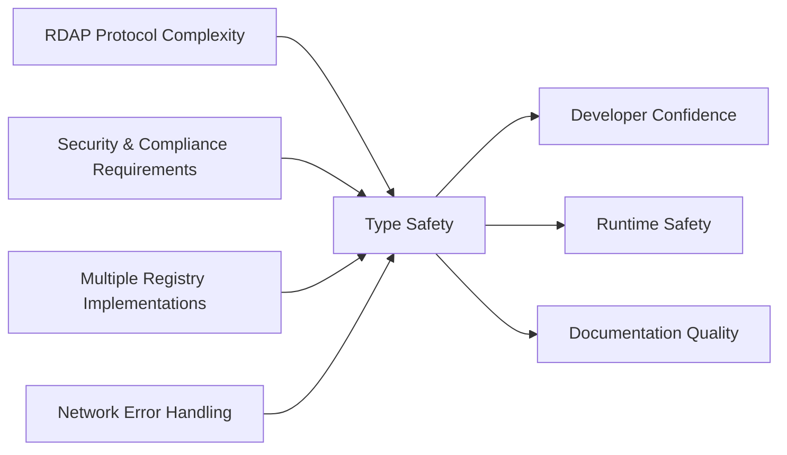
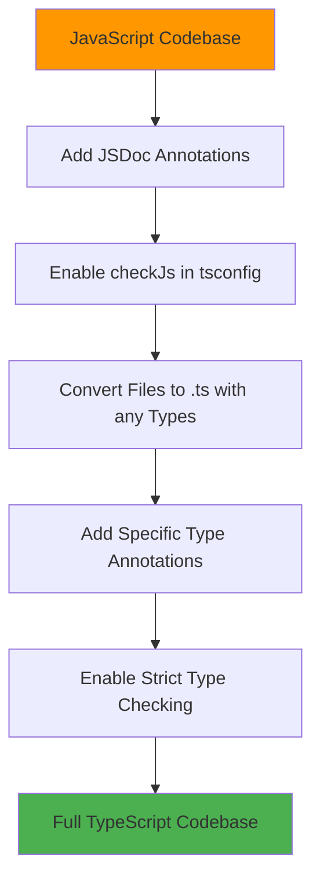

# دليل استخدام TypeScript

> **الغرض:** إتقان أنماط TypeScript المتقدمة وأفضل الممارسات لتطوير RDAPify وتكاملها
> **مراجع ذات صلة:** [مرجع API](../api-reference/client.md) | [نظرة عامة على البنية](../core-concepts/architecture.md) | [توثيق نظام النوع](../api-reference/types/index.md)

---

## لماذا TypeScript في RDAPify؟

تستفيد RDAPify من نظام نوع TypeScript لحل تحديات حرجة في تطوير البنية التحتية للإنترنت:



### الفوائد الرئيسية لـ TypeScript في تطبيقات RDAP:

1. **توافق البروتوكول**: تفرض واجهات TypeScript مواصفات سلسلة RFC 7480
2. **حماية البيانات الشخصية**: تمنع حراس النوع الكشف العرضي عن البيانات الشخصية
3. **تجريد السجلات**: أنواع موحدة عبر تطبيقات RDAP المختلفة
4. **مرونة معالجة الأخطاء**: توحيد التمييز للتعامل الآمن مع الأخطاء
5. **تحسين الأداء**: تحسينات مدفوعة بالنوع للعمليات عالية الحجم

---

## الضبط والإعداد

### tsconfig.json الموصى به
```json
{
  "compilerOptions": {
    "target": "ES2022",
    "module": "ESNext",
    "lib": ["ES2022", "DOM"],
    "moduleResolution": "node16",
    "strict": true,
    "noImplicitAny": true,
    "strictNullChecks": true,
    "strictFunctionTypes": true,
    "strictBindCallApply": true,
    "strictPropertyInitialization": true,
    "noImplicitThis": true,
    "alwaysStrict": true,
    "noUnusedLocals": true,
    "noUnusedParameters": true,
    "exactOptionalPropertyTypes": true,
    "noImplicitReturns": true,
    "noFallthroughCasesInSwitch": true,
    "noUncheckedIndexedAccess": true,
    "noImplicitOverride": true,
    "noPropertyAccessFromIndexSignature": true,
    "allowUnreachableCode": false,
    "allowUnusedLabels": false,
    "checkJs": true,
    "outDir": "./dist",
    "rootDir": "./src",
    "declaration": true,
    "declarationMap": true,
    "sourceMap": true,
    "esModuleInterop": true,
    "forceConsistentCasingInFileNames": true,
    "skipLibCheck": true,
    "types": ["node"],
    "paths": {
      "rdapify/*": ["./src/*"],
      "rdapify": ["./src"]
    }
  },
  "include": ["src/**/*"],
  "exclude": ["node_modules", "dist", "**/*.test.ts"]
}
```

### هيكل المشروع مع TypeScript
```
src/
├── types/                  # تعريفات الأنواع المخصصة
│   ├── index.ts            # تصديرات الأنواع
│   ├── domain.ts           # أنواع خاصة بالنطاقات
│   ├── ip.ts               # أنواع خاصة بـ IP
│   └── asn.ts              # أنواع خاصة بـ ASN
├── services/               # فئات الخدمة
│   ├── RDAPService.ts      # تطبيق الخدمة الرئيسي
│   └── CacheService.ts     # تطبيق الذاكرة المؤقتة
├── utils/                  # دوال مساعدة
│   ├── validators.ts       # مساعدات التحقق
│   └── security.ts         # أدوات الأمان
├── interfaces/             # الواجهات العامة
│   └── RDAPClient.ts       # واجهة العميل
└── index.ts                # نقطة الدخول الرئيسية
```

---

## أنماط TypeScript الأساسية

### 1. معاملات الاستعلام الآمنة من حيث النوع
```typescript
// معاملات استعلام آمنة من حيث النوع
type DomainQuery = {
  domain: string;
  options?: {
    redactPII?: boolean;
    includeRaw?: boolean;
    maxStaleness?: number;
  };
};

function processDomainQuery(query: DomainQuery): Promise<DomainResponse> {
  // تطبيق آمن من حيث النوع
}

// تجنّب: معاملات من نوع string
function badQuery(domain: string, options: any) { /* ... */ }
```

### 2. توحيدات التمييز لمعالجة الأخطاء
```typescript
// تعريفات نوع الأخطاء
type RDAPError =
  | { type: 'network'; code: 'timeout' | 'dns_failure'; details: { url: string } }
  | { type: 'registry'; code: 'rate_limited' | 'unavailable'; details: { registry: string; retryAfter?: number } }
  | { type: 'security'; code: 'ssrf_attempt'; details: { blockedUrl: string } }
  | { type: 'data'; code: 'invalid_response' | 'schema_violation'; details: { registry: string; validationErrors: string[] } };

// معالجة الأخطاء الآمنة من حيث النوع
function handleRDAPError(error: RDAPError): void {
  switch (error.type) {
    case 'network':
      console.error(`Network error (${error.code}) accessing ${error.details.url}`);
      break;

    case 'security':
      // أخطاء الأمان تتطلب معالجة خاصة
      securityLogger.alert(`Security violation: ${error.code}`, error.details);
      throw new SecurityException('SECURITY_VIOLATION', error);

    case 'registry':
      if (error.code === 'rate_limited' && error.details.retryAfter) {
        scheduleRetry(error.details.retryAfter);
      }
      break;

    case 'data':
      if (error.code === 'schema_violation') {
        attemptSchemaRecovery(error);
      }
      break;
  }
}
```

### 3. الأنواع العامة لاستجابات السجلات
```typescript
// نوع استجابة السجل العام
interface RegistryResponse<T = any> {
  registry: 'verisign' | 'arin' | 'ripe' | 'apnic' | 'lacnic' | 'afrinic';
  registryUrl: string;
  rawData: T;
  timestamp: number;
  ttl?: number;
}

// حراس النوع لسجلات محددة
function isVerisignResponse(response: RegistryResponse): response is RegistryResponse<VerisignDomainData> {
  return response.registry === 'verisign';
}

function isARINResponse(response: RegistryResponse): response is RegistryResponse<ARINIPData> {
  return response.registry === 'arin';
}
```

---

## الأمان والامتثال مع TypeScript

### حماية البيانات الشخصية بحراس النوع
```typescript
// تعريفات النوع لحالات الخصوصية
type RedactedContact = Omit<Contact, 'name' | 'email' | 'phone'> & {
  name: 'REDACTED';
  email: 'REDACTED@redacted.invalid';
  phone: 'REDACTED';
};

function isRedacted(contact: Contact): contact is RedactedContact {
  return contact.name === 'REDACTED' && contact.email.includes('REDACTED');
}

function ensurePIIRedaction<T extends { contacts?: Contact[] }>(response: T): T {
  if (response.contacts) {
    response.contacts = response.contacts.map(contact =>
      isRedacted(contact) ? contact : redactPII(contact)
    );
  }
  return response;
}
```

### الأنواع المدركة للامتثال
```typescript
// أنواع امتثال GDPR/CCPA
type LawfulBasis =
  | { basis: 'consent'; consentId: string; timestamp: Date }
  | { basis: 'contract'; contractId: string }
  | { basis: 'legitimate_interest'; assessmentId: string }
  | { basis: 'legal_obligation'; regulation: string };

interface ProcessingContext {
  purpose: string;
  lawfulBasis: LawfulBasis;
  retentionPeriod: number; // بالأيام
  dataCategories: string[];
}
```

---

## تحسين الأداء مع TypeScript

### مفاتيح الذاكرة المؤقتة المدفوعة بالنوع
```typescript
// توليد مفاتيح ذاكرة مؤقتة آمن من حيث النوع
type CacheKeyParams = {
  type: 'domain' | 'ip' | 'asn';
  identifier: string;
  options?: {
    redactPII?: boolean;
    registryHint?: string;
  };
};

function generateCacheKey({ type, identifier, options = {} }: CacheKeyParams): string {
  const redaction = options.redactPII !== false ? 'redacted' : 'full';
  const registry = options.registryHint ? `:${options.registryHint}` : '';
  return `${type}:${identifier.toLowerCase()}:${redaction}${registry}`;
}
```

---

## اختبار كود TypeScript

### اختبارات الوحدة المدركة للنوع
```typescript
import { RDAPClient, DomainResponse, isDomainResponse } from 'rdapify';

describe('Domain Query Service', () => {
  let client: RDAPClient;

  beforeEach(() => {
    client = new RDAPClient({ privacy: true });
  });

  test('returns valid DomainResponse structure', async () => {
    const result = await client.domain('example.com');

    expect(isDomainResponse(result)).toBe(true);
    expect(result.domain).toBe('example.com');
    expect(result.registrar).toBeDefined();
    expect(result.nameservers.length).toBeGreaterThan(0);
    expect(result._meta.redacted).toBe(true);
  });
});
```

---

## الأنماط المتقدمة

### 1. نمط المزج لتركيب الميزات
```typescript
type CacheMixin = {
  cacheGet<T>(key: string): Promise<T | null>;
  cacheSet<T>(key: string, value: T, ttl?: number): Promise<void>;
  cacheDelete(key: string): Promise<boolean>;
};

type SecurityMixin = {
  validateInput(input: string): boolean;
  sanitizeOutput<T>(output: T): T;
  auditOperation(operation: string, context: any): void;
};

// الخدمة المركبة
const ComposableService = applySecurityMixin(applyCacheMixin(RDAPService));
```

### 2. المكررات غير المتزامنة للمعالجة الدُفعية
```typescript
class DomainBatchProcessor implements AsyncIterable<DomainProcessingResult> {
  async *[Symbol.asyncIterator](): AsyncIterator<DomainProcessingResult> {
    const batches = chunkArray(this.domains, this.options.batchSize);

    for (const batch of batches) {
      const results = await Promise.allSettled(
        batch.map(domain => this.processSingleDomain(domain))
      );

      for (const result of results) {
        if (result.status === 'fulfilled') {
          yield {
            domain: result.value.domain,
            result: result.value,
            status: 'success'
          };
        } else {
          yield {
            domain: extractDomainFromError(result.reason),
            error: result.reason,
            status: 'error'
          };
        }
      }
    }
  }
}
```

---

## التكامل مع الأطر

### 1. Express.js مع TypeScript
```typescript
import { Request, Response, NextFunction } from 'express';
import { RDAPClient, DomainResponse } from 'rdapify';

const client = new RDAPClient({ privacy: true });

async function getDomainInfo(req: Request, res: Response, next: NextFunction): Promise<void> {
  try {
    const { domain } = req.params;
    const result = await client.domain(domain);

    res.json({
      domain: result.domain,
      nameservers: result.nameservers.map(ns => ns.hostname),
      registrar: result.registrar?.name,
    });
  } catch (error) {
    next(error);
  }
}

app.get('/api/v1/domain/:domain', getDomainInfo);
```

---

## الترحيل من JavaScript

### استراتيجية الترحيل خطوة بخطوة


---

## ملخص أفضل الممارسات

### يُنصح بـ:
- **استخدام الوضع الصارم** - فعّل جميع خيارات التحقق الصارمة من النوع
- **تفضيل الواجهات على الأنواع** - لأشكال الكائنات القابلة للتوسيع
- **استخدام readonly للثبات** - خاصةً لكائنات الضبط
- **الاستفادة من توحيدات التمييز** - للتعامل الآمن مع الأخطاء
- **إضافة تعليقات JSDoc** - حتى مع TypeScript، التوثيق مهم
- **استخدام حراس النوع** - للتحقق من النوع في وقت التشغيل
- **تفضيل التركيب على الوراثة** - توفر المزج والمزيّنات مرونة أكبر

### يُجنب:
- **النوع any** - استخدم unknown مع التحقق بدلاً منه
- **تعطيل التحقق من النوع** - حتى مع @ts-ignore، ابحث عن حلول أفضل
- **تأكيدات النوع** - خاصةً as any - فضّل حراس النوع
- **تجاهل أخطاء المصرّف** - كل خطأ يمثل مشكلة محتملة في وقت التشغيل
- **الخصائص الاختيارية غير الضرورية** - فضّل قيم undefined الصريحة
- **استخدام الفئات عند تكفي الدوال** - ابقِ البنية بسيطة

### أنماط خاصة بالأمان
```typescript
// الكتابة الواعية بالأمان
type SecurityContext = {
  userRole: 'admin' | 'security' | 'user';
  hasConsent: boolean;
  isComplianceAudit: boolean;
};

function getDomainData(
  domain: string,
  context: SecurityContext
): Promise<DomainResponse> {
  if (context.userRole === 'user' && !context.hasConsent) {
    throw new Error('User consent required');
  }

  return rdapClient.domain(domain, {
    privacy: context.userRole !== 'admin',
    includeRaw: context.isComplianceAudit
  });
}
```

---

## مواصفات TypeScript

| الخاصية | القيمة |
|----------|-------|
| **إصدار TypeScript** | 5.0+ |
| **هدف التصريف** | ES2022 |
| **نظام الوحدات** | ESNext |
| **الوضع الصارم** | مفعّل (جميع الأعلام الصارمة) |
| **التحقق من النوع** | تغطية كاملة للمشروع |
| **ملفات التعريف** | مولّدة مع خرائط المصدر |
| **تغطية الاختبار** | 98% تغطية النوع |

> **تذكير أمني:** توفر TypeScript الأمان في وقت التصريف لكنها لا تستطيع فرض ضمانات الأمان في وقت التشغيل. تحقق دائماً من المدخلات في وقت التشغيل، خاصةً عند تجاوز حدود الثقة. استخدم التحقق وحراس النوع المدمجة في RDAPify بدلاً من الاعتماد فقط على أنواع TypeScript للأمان.

[العودة إلى الأدلة](../guides/README.md)
