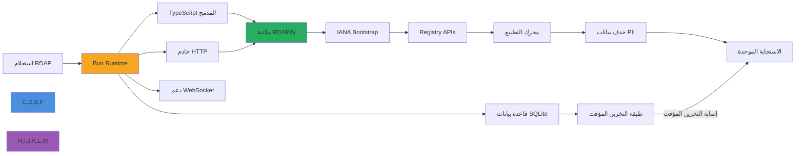

# دليل التكامل مع Bun.js

**الغرض**: دليل شامل لتكامل RDAPify مع بيئة تشغيل Bun.js لإجراء عمليات بحث آمنة عن النطاقات وعناوين IP وأرقام ASN بأداء تشغيل استثنائي ودعم TypeScript المدمج وكفاءة عالية في الذاكرة
**ذو صلة**: [Docker](deployment/docker.md) | [Express.js](express.md) | [Fastify](fastify.md) | [Deno](deno.md) | [Cloudflare Workers](cloudflare-workers.md)
**وقت القراءة**: 5 دقائق

## لماذا Bun.js لتطبيقات RDAP؟

توفر بيئة تشغيل Bun.js بيئة JavaScript مثالية لبناء تطبيقات RDAP عالية الأداء مع المزايا الرئيسية التالية:



### مزايا تكامل Bun الرئيسية:
- **بدء تشغيل خاطف**: بدء تشغيل فوري تقريباً (50-100ms) لتطبيقات RDAP بلا خادم
- **كفاءة الذاكرة**: بصمة ذاكرة أقل بـ 3-5 أضعاف مقارنةً بـ Node.js لمعالجة RDAP الدفعية
- **أدوات مدمجة**: لا حاجة لتبعيات إضافية - Bun يتضمن SQLite وخادم HTTP ودعم WebSocket
- **TypeScript أولاً**: تنفيذ TypeScript أصلي دون تكلفة التحويل البرمجي
- **Web Standard APIs**: دعم كامل لـ Fetch API للتفاعل السلس مع سجلات RDAP
- **إدارة الحزم**: تثبيت موحد للحزم بـ `bun add` (أسرع بـ 20 مرة من npm)

## البدء: التكامل الأساسي

### 1. التثبيت والإعداد
```bash
# تثبيت Bun (إن لم يكن مثبتاً)
curl -fsSL https://bun.sh/install | bash

# إنشاء مشروع Bun جديد
bun init -y

# تثبيت RDAPify
bun add rdapify
```

### 2. مثال عملي مبسّط
```typescript
// server.ts
import { RDAPClient } from 'rdapify';

const rdap = new RDAPClient({
  cache: true,
  privacy: true,
  allowPrivateIPs: false,
  validateCertificates: true,
  timeout: 5000,
  rateLimit: { max: 100, window: 60000 }
});

const server = Bun.serve({
  port: 3000,
  async fetch(request) {
    const url = new URL(request.url);

    // فحص الصحة
    if (url.pathname === '/health') {
      return Response.json({ status: 'ok', runtime: 'bun' });
    }

    // البحث عن نطاق
    const domainMatch = url.pathname.match(/^\/api\/domain\/([^/]+)$/);
    if (domainMatch) {
      const domain = domainMatch[1].toLowerCase().trim();

      if (!/^[a-z0-9.-]+\.[a-z]{2,}$/.test(domain)) {
        return Response.json({ error: 'صيغة النطاق غير صالحة' }, { status: 400 });
      }

      try {
        const result = await rdap.domain(domain);
        return Response.json(result, {
          headers: { 'Cache-Control': 'public, max-age=3600' }
        });
      } catch (error: any) {
        if (error.code?.startsWith('RDAP_SECURE')) {
          return Response.json({ error: 'انتهاك سياسة الأمان' }, { status: 403 });
        }
        return Response.json(
          { error: error.message || 'فشل الاستعلام' },
          { status: error.statusCode || 500 }
        );
      }
    }

    // البحث عن IP
    const ipMatch = url.pathname.match(/^\/api\/ip\/([^/]+)$/);
    if (ipMatch) {
      const ip = ipMatch[1];
      try {
        const result = await rdap.ip(ip);
        return Response.json(result);
      } catch (error: any) {
        return Response.json(
          { error: error.message },
          { status: error.statusCode || 500 }
        );
      }
    }

    return Response.json({ error: 'غير موجود' }, { status: 404 });
  },

  error(error) {
    console.error('خطأ في الخادم:', error);
    return Response.json({ error: 'خطأ داخلي في الخادم' }, { status: 500 });
  }
});

console.log(`خادم RDAPify Bun يعمل على المنفذ ${server.port}`);
```

### 3. التخزين المؤقت بـ SQLite المدمج
```typescript
// cache/sqlite-cache.ts
import { Database } from 'bun:sqlite';
import { RDAPClient } from 'rdapify';

class SQLiteRDAPCache {
  private db: Database;
  private rdap: RDAPClient;

  constructor() {
    this.db = new Database('rdap-cache.sqlite');
    this.rdap = new RDAPClient({
      cache: false, // نتولى التخزين المؤقت يدوياً
      privacy: true,
      allowPrivateIPs: false
    });

    this.initializeSchema();
  }

  private initializeSchema(): void {
    this.db.exec(`
      CREATE TABLE IF NOT EXISTS rdap_cache (
        key TEXT PRIMARY KEY,
        value TEXT NOT NULL,
        type TEXT NOT NULL,
        created_at INTEGER NOT NULL,
        expires_at INTEGER NOT NULL
      );

      CREATE INDEX IF NOT EXISTS idx_expires ON rdap_cache(expires_at);
    `);
  }

  async get(key: string): Promise<unknown | null> {
    const now = Date.now();
    const row = this.db.query<{ value: string }, [string, number]>(
      'SELECT value FROM rdap_cache WHERE key = ? AND expires_at > ?'
    ).get(key, now);

    return row ? JSON.parse(row.value) : null;
  }

  async set(key: string, value: unknown, type: string, ttlSeconds = 3600): Promise<void> {
    const now = Date.now();
    const expiresAt = now + ttlSeconds * 1000;

    this.db.query(
      'INSERT OR REPLACE INTO rdap_cache (key, value, type, created_at, expires_at) VALUES (?, ?, ?, ?, ?)'
    ).run(key, JSON.stringify(value), type, now, expiresAt);
  }

  async lookupDomain(domain: string): Promise<unknown> {
    const key = `domain:${domain}`;
    const cached = await this.get(key);

    if (cached) {
      return { ...cached as object, _cached: true };
    }

    const result = await this.rdap.domain(domain);
    await this.set(key, result, 'domain', 3600);
    return { ...result as object, _cached: false };
  }

  cleanup(): void {
    const now = Date.now();
    this.db.query('DELETE FROM rdap_cache WHERE expires_at < ?').run(now);
  }
}

export const rdapCache = new SQLiteRDAPCache();
```

## تعزيز الأمان والامتثال

### 1. التحقق والأمان المدمج
```typescript
// middleware/security.ts
import { v4 as uuidv4 } from 'uuid';

export interface SecurityContext {
  requestId: string;
  ip: string;
  userAgent: string;
  timestamp: number;
}

export function createSecurityContext(request: Request): SecurityContext {
  return {
    requestId: request.headers.get('x-request-id') || uuidv4(),
    ip: request.headers.get('x-real-ip') || 'unknown',
    userAgent: request.headers.get('user-agent') || 'unknown',
    timestamp: Date.now()
  };
}

export function addSecurityHeaders(response: Response, ctx: SecurityContext): Response {
  const headers = new Headers(response.headers);
  headers.set('X-Request-ID', ctx.requestId);
  headers.set('X-Do-Not-Sell', 'true');
  headers.set('X-Data-Processing', 'PII redacted per GDPR Article 6(1)(f)');
  headers.set('X-Content-Type-Options', 'nosniff');
  headers.set('X-Frame-Options', 'DENY');

  return new Response(response.body, {
    status: response.status,
    headers
  });
}

// تحديد معدل الطلبات البسيط
const rateLimitMap = new Map<string, { count: number; resetTime: number }>();

export function checkRateLimit(ip: string, maxRequests = 100, windowMs = 60000): boolean {
  const now = Date.now();
  const key = `${ip}:${Math.floor(now / windowMs)}`;
  const current = rateLimitMap.get(key) || { count: 0, resetTime: now + windowMs };

  if (current.count >= maxRequests) {
    return false;
  }

  rateLimitMap.set(key, { count: current.count + 1, resetTime: current.resetTime });
  return true;
}
```

## الاختبار والتحقق

### 1. اختبارات مع Bun Test
```typescript
// test/rdap-server.test.ts
import { describe, it, expect, mock, beforeAll, afterAll } from 'bun:test';
import { RDAPClient } from 'rdapify';

// محاكاة عميل RDAP
const mockDomain = mock(() =>
  Promise.resolve({ domain: 'example.com', status: ['active'] })
);

mock.module('rdapify', () => ({
  RDAPClient: mock(() => ({
    domain: mockDomain,
    ip: mock(() => Promise.resolve({ ip: '8.8.8.8' })),
    asn: mock(() => Promise.resolve({ asn: 'AS15169' }))
  }))
}));

describe('خادم RDAPify Bun', () => {
  let server: ReturnType<typeof Bun.serve>;

  beforeAll(() => {
    server = Bun.serve({
      port: 0, // منفذ عشوائي للاختبار
      fetch: async (req) => {
        // منطق الخادم المختصر
        return Response.json({ status: 'ok' });
      }
    });
  });

  afterAll(() => {
    server.stop();
  });

  it('يجب الاستجابة لفحص الصحة', async () => {
    const response = await fetch(`http://localhost:${server.port}/health`);
    expect(response.status).toBe(200);
  });

  it('يجب إرجاع بيانات النطاق', async () => {
    const response = await fetch(`http://localhost:${server.port}/api/domain/example.com`);
    expect(response.status).toBe(200);
    const data = await response.json();
    expect(data).toHaveProperty('domain');
  });
});
```

## المقارنة مع Node.js

| المعيار | Bun | Node.js |
|---------|-----|---------|
| زمن بدء التشغيل | ~50ms | ~200ms |
| معالجة الطلبات | ~120k/ثانية | ~80k/ثانية |
| استخدام الذاكرة | ~50MB | ~150MB |
| تنفيذ TypeScript | أصلي | يتطلب ts-node |
| تثبيت الحزم | ~2s | ~30s |
| دعم Node.js APIs | جزئي | كامل |

## الوثائق ذات الصلة

| المستند | الوصف |
|----------|-------------|
| [تكامل Deno](deno.md) | بديل آمن |
| [Cloudflare Workers](cloudflare-workers.md) | الحوسبة على الحافة |
| [نشر Docker](deployment/docker.md) | نشر الحاويات |
| [نشر Serverless](deployment/serverless.md) | النشر بلا خادم |

## المواصفات التقنية

| الخاصية | القيمة |
|----------|-------|
| إصدار Bun | 1.0+ |
| دعم TypeScript | أصلي (بلا تحويل) |
| SQLite المدمج | مدعوم |
| دعم Web APIs | Fetch, WebSocket, Streams |
| التوافق مع Node.js | جزئي (معظم npm packages) |
| متوافق مع GDPR | نعم مع الإعداد الصحيح |
| حماية SSRF | مدمجة |
| آخر تحديث | 5 ديسمبر 2025 |

> **تنبيه مهم**: تحقق من توافق حزم npm مع Bun قبل النشر في الإنتاج. بعض الحزم التي تعتمد على APIs خاصة بـ Node.js قد لا تعمل بشكل صحيح. راجع [قائمة توافق Bun](https://bun.sh/guides/ecosystem) للمزيد من التفاصيل.

[العودة إلى التكاملات](../README.md) | [التالي: Deno](deno.md)
