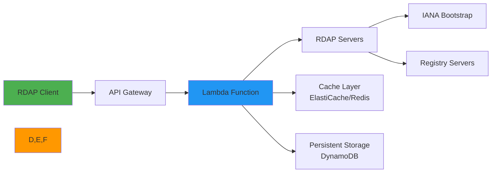

# دليل التكامل مع AWS Lambda

> **الغرض:** دليل شامل لنشر RDAPify وتحسينه في بيئات AWS Lambda بلا خادم
> **ذو صلة:** [البدء السريع](../../getting-started/quick_start.md) | [دليل CLI](../../cli/commands.md) | [نشر Kubernetes](kubernetes.md)
> **وقت القراءة:** 8 دقائق
> **نصيحة احترافية:** استخدم [قائمة تحقق النشر للإنتاج](#قالب-النشر-للإنتاج) لضمان أفضل ممارسات الأمان والأداء

---

## لماذا AWS Lambda لتطبيقات RDAP؟

توفر AWS Lambda منصة بلا خادم مثالية لمعالجة بيانات RDAP مع عدة مزايا رئيسية:



**مزايا البيئة بلا خادم:**
- **التوسع التلقائي**: معالجة موجات استعلامات RDAP دون تخطيط مسبق للسعة
- **كفاءة التكلفة**: الدفع فقط عن وقت معالجة الاستعلامات الفعلي
- **إدارة البنية التحتية**: لا تصحيح للخوادم ولا إدارة للسعة
- **النشر العالمي**: النشر عبر مناطق AWS للوصول بزمن استجابة منخفض
- **المراقبة المدمجة**: مقاييس وتسجيل CloudWatch جاهزة للاستخدام
- **حدود الأمان**: بيئات تنفيذ معزولة بصلاحيات IAM

---

## الإعداد والتكوين الأساسي

### 1. إنشاء دالة Lambda
```bash
# Create Lambda function with Node.js 20.x runtime
aws lambda create-function \
  --function-name rdapify-processor \
  --runtime nodejs20.x \
  --role arn:aws:iam::123456789012:role/rdapify-execution-role \
  --handler index.handler \
  --zip-file fileb://deployment.zip \
  --environment Variables={NODE_ENV=production} \
  --timeout 30 \
  --memory-size 256
```

### 2. معالج Lambda الأساسي
```javascript
// index.js
const { RDAPClient } = require('rdapify');

// تهيئة العميل خارج المعالج لإعادة الاستخدام عبر الاستدعاءات الدافئة
const rdap = new RDAPClient({
  cache: true,
  privacy: true,
  allowPrivateIPs: false,
  validateCertificates: true,
  timeout: 10000,
  rateLimit: { max: 50, window: 60000 }
});

exports.handler = async (event) => {
  const requestId = event.requestContext?.requestId || crypto.randomUUID();

  try {
    // تحليل طلب API Gateway
    const pathParams = event.pathParameters || {};
    const queryParams = event.queryStringParameters || {};
    const path = event.path || event.rawPath || '';

    // البحث عن نطاق
    if (path.match(/\/domain\/([^/]+)/)) {
      const domain = pathParams.domain || path.split('/').pop();

      if (!domain || !/^[a-z0-9.-]+\.[a-z]{2,}$/.test(domain.toLowerCase())) {
        return formatResponse(400, { error: 'صيغة النطاق غير صالحة' }, requestId);
      }

      const result = await rdap.domain(domain.toLowerCase().trim());

      return formatResponse(200, result, requestId, {
        'Cache-Control': 'public, max-age=3600'
      });
    }

    // البحث عن IP
    if (path.match(/\/ip\/([^/]+)/)) {
      const ip = pathParams.ip || path.split('/').pop();
      const result = await rdap.ip(ip);
      return formatResponse(200, result, requestId);
    }

    // البحث عن ASN
    if (path.match(/\/asn\/([^/]+)/)) {
      const asn = pathParams.asn || path.split('/').pop();
      const result = await rdap.asn(asn);
      return formatResponse(200, result, requestId);
    }

    return formatResponse(404, { error: 'غير موجود' }, requestId);

  } catch (error) {
    console.error('Lambda error:', JSON.stringify({
      requestId,
      error: error.message,
      code: error.code
    }));

    if (error.code?.startsWith('RDAP_SECURE')) {
      return formatResponse(403, { error: 'انتهاك سياسة الأمان', requestId }, requestId);
    }

    return formatResponse(
      error.statusCode || 500,
      { error: error.message || 'خطأ داخلي في الخادم', requestId },
      requestId
    );
  }
};

function formatResponse(statusCode, body, requestId, additionalHeaders = {}) {
  return {
    statusCode,
    headers: {
      'Content-Type': 'application/json',
      'X-Request-ID': requestId,
      'X-Content-Type-Options': 'nosniff',
      'X-Do-Not-Sell': 'true',
      'X-Data-Processing': 'PII redacted per GDPR Article 6(1)(f)',
      ...additionalHeaders
    },
    body: JSON.stringify(body)
  };
}
```

### 3. إعداد API Gateway
```yaml
# template.yaml (AWS SAM)
AWSTemplateFormatVersion: '2010-09-09'
Transform: AWS::Serverless-2016-10-31
Description: RDAPify Serverless API

Globals:
  Function:
    Timeout: 30
    MemorySize: 256
    Runtime: nodejs20.x
    Environment:
      Variables:
        NODE_ENV: production
        RDAP_PRIVACY: 'true'
        RDAP_BLOCK_PRIVATE_IPS: 'true'

Resources:
  RDAPifyAPI:
    Type: AWS::Serverless::Api
    Properties:
      StageName: prod
      Auth:
        ApiKeyRequired: true
        UsagePlan:
          CreateUsagePlan: PER_API
          Quota:
            Limit: 10000
            Period: DAY
          Throttle:
            BurstLimit: 100
            RateLimit: 50

  RDAPifyFunction:
    Type: AWS::Serverless::Function
    Properties:
      CodeUri: .
      Handler: index.handler
      Events:
        DomainLookup:
          Type: Api
          Properties:
            RestApiId: !Ref RDAPifyAPI
            Path: /domain/{domain}
            Method: GET
        IPLookup:
          Type: Api
          Properties:
            RestApiId: !Ref RDAPifyAPI
            Path: /ip/{ip}
            Method: GET
        ASNLookup:
          Type: Api
          Properties:
            RestApiId: !Ref RDAPifyAPI
            Path: /asn/{asn}
            Method: GET
```

## تحسين الأداء

### 1. إدارة البدء الدافئ
```javascript
// warm-up.js

// المتغيرات العالمية تُحفظ عبر الاستدعاءات الدافئة
let rdapClient;
let cacheWarmed = false;

function getRDAPClient() {
  if (!rdapClient) {
    rdapClient = new RDAPClient({
      cache: true,
      privacy: true,
      allowPrivateIPs: false,
      timeout: 10000
    });
    console.log('تم إنشاء عميل RDAP جديد (بدء بارد)');
  }
  return rdapClient;
}

// تسخين مسبق لـ IANA Bootstrap
async function warmupCache() {
  if (!cacheWarmed) {
    try {
      const client = getRDAPClient();
      // جلب مسبق لبيانات Bootstrap
      await client.domain('warmup.com').catch(() => {});
      cacheWarmed = true;
      console.log('تم تسخين التخزين المؤقت بنجاح');
    } catch (error) {
      console.warn('فشل تسخين التخزين المؤقت:', error.message);
    }
  }
}

exports.handler = async (event) => {
  await warmupCache();
  const client = getRDAPClient();
  // ... منطق المعالجة
};
```

### 2. التكامل مع ElastiCache
```javascript
// cache/elasticache.js
const Redis = require('ioredis');

let redisClient;

function getRedisClient() {
  if (!redisClient) {
    redisClient = new Redis({
      host: process.env.ELASTICACHE_HOST,
      port: parseInt(process.env.ELASTICACHE_PORT || '6379'),
      tls: process.env.ELASTICACHE_TLS === 'true' ? {} : undefined,
      connectTimeout: 2000,
      commandTimeout: 2000,
      retryStrategy: (times) => {
        if (times > 3) return null;
        return 100;
      }
    });

    redisClient.on('error', (err) => {
      console.error('ElastiCache error:', err.message);
    });
  }
  return redisClient;
}

exports.getCached = async (key) => {
  try {
    const redis = getRedisClient();
    const value = await redis.get(key);
    return value ? JSON.parse(value) : null;
  } catch (err) {
    console.warn('فشل الوصول إلى التخزين المؤقت:', err.message);
    return null;
  }
};

exports.setCached = async (key, value, ttl = 3600) => {
  try {
    const redis = getRedisClient();
    await redis.setex(key, ttl, JSON.stringify(value));
  } catch (err) {
    console.warn('فشل الكتابة في التخزين المؤقت:', err.message);
  }
};
```

## قالب النشر للإنتاج

### قائمة التحقق قبل النشر
```bash
#!/bin/bash
# deploy-checklist.sh

echo "التحقق من إعدادات النشر لـ RDAPify Lambda..."

# التحقق من متغيرات البيئة المطلوبة
required_vars=(
  "RDAP_PRIVACY"
  "RDAP_BLOCK_PRIVATE_IPS"
  "RDAP_TLS_MIN_VERSION"
  "ELASTICACHE_HOST"
  "AWS_LAMBDA_FUNCTION_NAME"
)

for var in "${required_vars[@]}"; do
  if [ -z "${!var}" ]; then
    echo "خطأ: المتغير $var غير مُعرَّف"
    exit 1
  fi
done

# اختبار الاتصال بـ ElastiCache
echo "اختبار الاتصال بـ ElastiCache..."
redis-cli -h $ELASTICACHE_HOST ping || { echo "فشل الاتصال بـ ElastiCache"; exit 1; }

# فحص صلاحيات IAM
echo "التحقق من صلاحيات IAM..."
aws iam get-role --role-name rdapify-execution-role || { echo "دور IAM غير موجود"; exit 1; }

echo "اكتملت قائمة التحقق بنجاح - جاهز للنشر"
```

### تكوين IAM المطلوب
```json
{
  "Version": "2012-10-17",
  "Statement": [
    {
      "Effect": "Allow",
      "Action": [
        "logs:CreateLogGroup",
        "logs:CreateLogStream",
        "logs:PutLogEvents"
      ],
      "Resource": "arn:aws:logs:*:*:*"
    },
    {
      "Effect": "Allow",
      "Action": [
        "elasticache:Connect"
      ],
      "Resource": "arn:aws:elasticache:*:*:replicationgroup:rdapify-*"
    },
    {
      "Effect": "Allow",
      "Action": [
        "xray:PutTraceSegments",
        "xray:PutTelemetryRecords"
      ],
      "Resource": "*"
    }
  ]
}
```

## استكشاف المشكلات الشائعة وإصلاحها

### 1. مشكلات البداية الباردة
**الأعراض**: زمن استجابة عالٍ (>2 ثانية) للاستدعاءات الأولى

**الحلول**:
- زيادة حجم الذاكرة (256MB → 512MB) لتحسين أداء CPU
- استخدام Provisioned Concurrency للدوال الحرجة
- تطبيق منطق التسخين المسبق للتخزين المؤقت

```bash
# تفعيل Provisioned Concurrency
aws lambda put-provisioned-concurrency-config \
  --function-name rdapify-processor \
  --qualifier prod \
  --provisioned-concurrent-executions 5
```

### 2. أخطاء مهلة الاتصال
**الأعراض**: `ETIMEDOUT` أو `ECONNREFUSED` للاتصال بـ ElastiCache

**الحل**: تحقق من إعداد VPC وGroups الأمان:
```bash
# التحقق من إعداد VPC للدالة
aws lambda get-function-configuration \
  --function-name rdapify-processor \
  --query 'VpcConfig'
```

## الوثائق ذات الصلة

| المستند | الوصف |
|----------|-------------|
| [Azure Functions](azure-functions.md) | بديل بلا خادم من Microsoft |
| [Google Cloud Run](google-cloud-run.md) | بديل من Google Cloud |
| [Kubernetes](kubernetes.md) | للنشر باستخدام الحاويات |
| [نشر Serverless](../deployment/serverless.md) | الأنماط العامة للنشر بلا خادم |

## المواصفات التقنية

| الخاصية | القيمة |
|----------|-------|
| Runtime | Node.js 20.x |
| حجم الذاكرة الموصى به | 256MB - 512MB |
| الحد الأقصى للمهلة | 30 ثانية |
| أقصى حجم حزمة | 50MB (مضغوط) |
| التكامل مع ElastiCache | Redis 7.x |
| المراقبة | CloudWatch + X-Ray |
| متوافق مع GDPR | نعم مع الإعداد الصحيح |
| حماية SSRF | مدمجة |
| آخر تحديث | 5 ديسمبر 2025 |

> **تنبيه مهم**: تأكد من تشغيل Lambda في VPC مع نفس Subnet وGroups أمان ElastiCache. تحقق من صلاحيات IAM الدنيا وتجنب استخدام صلاحيات واسعة. راجع [دليل أمان AWS Lambda](https://docs.aws.amazon.com/lambda/latest/dg/security.html) للمزيد.

[العودة إلى تكاملات Cloud](../cloud/) | [التالي: Azure Functions](azure-functions.md)
