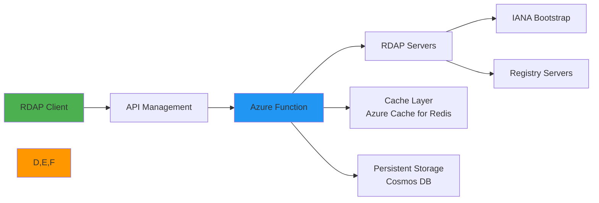

# دليل التكامل مع Azure Functions

> **الغرض:** دليل شامل لنشر RDAPify وتحسينه في بيئات Azure Functions بلا خادم
> **ذو صلة:** [البدء السريع](../../getting-started/quick_start.md) | [دليل CLI](../../cli/commands.md) | [AWS Lambda](aws-lambda.md)
> **وقت القراءة:** 8 دقائق
> **نصيحة احترافية:** استخدم [قائمة تحقق النشر لـ Azure](#قالب-النشر-للإنتاج) لضمان أفضل ممارسات الأمان والأداء

---

## لماذا Azure Functions لتطبيقات RDAP؟

توفر Azure Functions منصة بلا خادم مثالية لمعالجة بيانات RDAP مع عدة مزايا رئيسية:



**مزايا البيئة بلا خادم:**
- **التوسع التلقائي**: معالجة موجات استعلامات RDAP دون تخطيط مسبق للسعة
- **كفاءة التكلفة**: الدفع فقط عن وقت معالجة الاستعلامات الفعلي
- **إدارة البنية التحتية**: لا تصحيح للخوادم ولا إدارة للسعة
- **النشر العالمي**: النشر عبر مناطق Azure للوصول بزمن استجابة منخفض
- **المراقبة المدمجة**: مقاييس وتسجيل Application Insights جاهزة للاستخدام
- **أمان المؤسسات**: تكامل Azure AD والهويات المُدارة وعزل الشبكة

---

## الإعداد والتكوين الأساسي

### 1. إنشاء تطبيق Function
```bash
# Create resource group
az group create --name rdapify-rg --location eastus

# Create Function App with Node.js 20 runtime
az functionapp create \
  --resource-group rdapify-rg \
  --consumption-plan-location eastus \
  --runtime node \
  --runtime-version 20 \
  --functions-version 4 \
  --name rdapify-functions \
  --storage-account rdapifystorage \
  --os-type Linux
```

### 2. معالج Azure Function الأساسي
```javascript
// src/functions/rdap-lookup/index.js
const { RDAPClient } = require('rdapify');
const { app } = require('@azure/functions');

// تهيئة العميل خارج المعالج لإعادة الاستخدام
const rdap = new RDAPClient({
  cache: true,
  privacy: true,
  allowPrivateIPs: false,
  validateCertificates: true,
  timeout: 10000,
  rateLimit: { max: 50, window: 60000 }
});

app.http('rdapDomainLookup', {
  methods: ['GET'],
  authLevel: 'function',
  route: 'domain/{domain}',
  handler: async (request, context) => {
    const requestId = request.headers.get('x-request-id') || crypto.randomUUID();
    context.log(`معالجة استعلام النطاق | ID: ${requestId}`);

    const domain = request.params.domain?.toLowerCase().trim();

    if (!domain || !/^[a-z0-9.-]+\.[a-z]{2,}$/.test(domain)) {
      return {
        status: 400,
        jsonBody: { error: 'صيغة النطاق غير صالحة' },
        headers: getSecurityHeaders(requestId)
      };
    }

    try {
      const result = await rdap.domain(domain);

      return {
        status: 200,
        jsonBody: result,
        headers: {
          ...getSecurityHeaders(requestId),
          'Cache-Control': 'public, max-age=3600'
        }
      };
    } catch (error) {
      context.error(`خطأ في استعلام RDAP: ${error.message} | ID: ${requestId}`);

      if (error.code?.startsWith('RDAP_SECURE')) {
        return {
          status: 403,
          jsonBody: { error: 'انتهاك سياسة الأمان', requestId },
          headers: getSecurityHeaders(requestId)
        };
      }

      return {
        status: error.statusCode || 500,
        jsonBody: { error: error.message, requestId },
        headers: getSecurityHeaders(requestId)
      };
    }
  }
});

app.http('rdapIPLookup', {
  methods: ['GET'],
  authLevel: 'function',
  route: 'ip/{ip}',
  handler: async (request, context) => {
    const requestId = request.headers.get('x-request-id') || crypto.randomUUID();
    const ip = request.params.ip;

    try {
      const result = await rdap.ip(ip);
      return {
        status: 200,
        jsonBody: result,
        headers: getSecurityHeaders(requestId)
      };
    } catch (error) {
      if (error.code?.startsWith('RDAP_SECURE')) {
        return { status: 403, jsonBody: { error: 'انتهاك سياسة الأمان' }, headers: getSecurityHeaders(requestId) };
      }
      return { status: error.statusCode || 500, jsonBody: { error: error.message }, headers: getSecurityHeaders(requestId) };
    }
  }
});

function getSecurityHeaders(requestId) {
  return {
    'X-Request-ID': requestId,
    'X-Content-Type-Options': 'nosniff',
    'X-Frame-Options': 'DENY',
    'X-Do-Not-Sell': 'true',
    'X-Data-Processing': 'PII redacted per GDPR Article 6(1)(f)'
  };
}
```

### 3. إعداد Azure API Management
```yaml
# api-management-policy.xml
<policies>
  <inbound>
    <base />
    <!-- التحقق من مفتاح API -->
    <validate-jwt header-name="Authorization" failed-validation-httpcode="401">
      <openid-config url="https://login.microsoftonline.com/{tenant-id}/v2.0/.well-known/openid-configuration" />
    </validate-jwt>
    <!-- تحديد معدل الطلبات -->
    <rate-limit-by-key calls="100" renewal-period="60"
      counter-key="@(context.Request.Headers.GetValueOrDefault("x-client-id","anonymous"))" />
    <!-- إضافة معرف الطلب -->
    <set-header name="X-Request-ID" exists-action="skip">
      <value>@(Guid.NewGuid().ToString())</value>
    </set-header>
  </inbound>
  <outbound>
    <base />
    <!-- رؤوس الأمان -->
    <set-header name="X-Content-Type-Options" exists-action="override">
      <value>nosniff</value>
    </set-header>
    <set-header name="X-Frame-Options" exists-action="override">
      <value>DENY</value>
    </set-header>
  </outbound>
</policies>
```

## تحسين الأداء

### 1. التكامل مع Azure Cache for Redis
```javascript
// cache/azure-redis.js
const { createClient } = require('redis');

let redisClient;

async function getRedisClient() {
  if (!redisClient || !redisClient.isOpen) {
    redisClient = createClient({
      url: `rediss://${process.env.AZURE_REDIS_HOST}:6380`,
      password: process.env.AZURE_REDIS_KEY,
      socket: {
        tls: true,
        connectTimeout: 5000
      }
    });

    redisClient.on('error', (err) => console.error('Azure Redis error:', err));
    await redisClient.connect();
  }

  return redisClient;
}

exports.getCachedRDAP = async (key) => {
  try {
    const client = await getRedisClient();
    const value = await client.get(`rdap:${key}`);
    return value ? JSON.parse(value) : null;
  } catch (err) {
    console.warn('فشل الوصول إلى Azure Redis Cache:', err.message);
    return null;
  }
};

exports.cacheRDAPResult = async (key, value, ttl = 3600) => {
  try {
    const client = await getRedisClient();
    await client.setEx(`rdap:${key}`, ttl, JSON.stringify(value));
  } catch (err) {
    console.warn('فشل التخزين في Azure Redis Cache:', err.message);
  }
};
```

### 2. التخزين الدائم مع Cosmos DB
```javascript
// storage/cosmos-db.js
const { CosmosClient } = require('@azure/cosmos');

const cosmos = new CosmosClient({
  endpoint: process.env.COSMOS_ENDPOINT,
  key: process.env.COSMOS_KEY
});

const database = cosmos.database('rdapify');
const container = database.container('rdap-results');

exports.storeRDAPResult = async (domain, result) => {
  try {
    await container.items.upsert({
      id: domain,
      domain,
      result,
      storedAt: new Date().toISOString(),
      ttl: 86400 // يوم واحد
    });
  } catch (err) {
    console.error('فشل التخزين في Cosmos DB:', err.message);
  }
};

exports.getStoredResult = async (domain) => {
  try {
    const { resource } = await container.item(domain, domain).read();
    return resource?.result || null;
  } catch (err) {
    return null;
  }
};
```

## تكامل Application Insights

### 1. إعداد المراقبة
```javascript
// monitoring/app-insights.js
const appInsights = require('applicationinsights');

appInsights
  .setup(process.env.APPLICATIONINSIGHTS_CONNECTION_STRING)
  .setAutoDependencyCorrelation(true)
  .setAutoCollectRequests(true)
  .setAutoCollectPerformance(true)
  .setAutoCollectExceptions(true)
  .setAutoCollectDependencies(true)
  .setSendLiveMetrics(true)
  .start();

const client = appInsights.defaultClient;

exports.trackRDAPQuery = (type, value, duration, success, cacheHit = false) => {
  client.trackEvent({
    name: 'RDAPQuery',
    properties: {
      queryType: type,
      duration: duration.toString(),
      success: success.toString(),
      cacheHit: cacheHit.toString()
    }
  });

  client.trackMetric({
    name: `RDAP_${type.toUpperCase()}_Duration`,
    value: duration
  });
};

exports.trackCachePerformance = (type, hit) => {
  client.trackMetric({
    name: `RDAP_Cache_${hit ? 'Hit' : 'Miss'}`,
    value: 1,
    properties: { queryType: type }
  });
};
```

## قالب النشر للإنتاج

```bash
#!/bin/bash
# deploy-azure.sh

set -e

RESOURCE_GROUP="rdapify-rg"
FUNCTION_APP="rdapify-functions"
LOCATION="eastus"

echo "بدء نشر RDAPify على Azure Functions..."

# التحقق من تسجيل الدخول
az account show || { echo "يرجى تسجيل الدخول بـ 'az login'"; exit 1; }

# إنشاء الموارد المطلوبة
az group create --name $RESOURCE_GROUP --location $LOCATION

# إنشاء حساب التخزين
az storage account create \
  --name rdapifystorage$RANDOM \
  --resource-group $RESOURCE_GROUP \
  --location $LOCATION \
  --sku Standard_LRS

# نشر الكود
func azure functionapp publish $FUNCTION_APP --javascript

echo "اكتمل النشر بنجاح!"
echo "عنوان URL: https://$FUNCTION_APP.azurewebsites.net"
```

### متغيرات بيئة الإنتاج
```bash
# تعيين متغيرات بيئة الإنتاج
az functionapp config appsettings set \
  --name rdapify-functions \
  --resource-group rdapify-rg \
  --settings \
    RDAP_PRIVACY=true \
    RDAP_BLOCK_PRIVATE_IPS=true \
    RDAP_TLS_MIN_VERSION=TLSv1.3 \
    RDAP_TIMEOUT=10000 \
    NODE_ENV=production \
    APPLICATIONINSIGHTS_CONNECTION_STRING="your-connection-string" \
    AZURE_REDIS_HOST="your-redis-host.redis.cache.windows.net" \
    AZURE_REDIS_KEY="your-redis-key"
```

## استكشاف المشكلات الشائعة وإصلاحها

### 1. مشكلات البداية الباردة
**الأعراض**: زمن استجابة عالٍ للاستدعاءات الأولى

**الحلول**:
- استخدام خطة Premium بدلاً من خطة Consumption
- تمكين Always On للحفاظ على دفء الدوال

```bash
# الترقية إلى خطة Premium
az functionapp update \
  --name rdapify-functions \
  --resource-group rdapify-rg \
  --plan EP1
```

### 2. مشكلات انتهاء مهلة الشبكة
**الأعراض**: فشل الاتصال بخوادم RDAP

**الحل**: تكوين VNet Integration:
```bash
# تكامل الشبكة الافتراضية
az functionapp vnet-integration add \
  --name rdapify-functions \
  --resource-group rdapify-rg \
  --vnet rdapify-vnet \
  --subnet rdapify-subnet
```

## الوثائق ذات الصلة

| المستند | الوصف |
|----------|-------------|
| [AWS Lambda](aws-lambda.md) | بديل بلا خادم من AWS |
| [Google Cloud Run](google-cloud-run.md) | بديل من Google Cloud |
| [Kubernetes](kubernetes.md) | للنشر الكامل بالحاويات |
| [نشر Serverless](../deployment/serverless.md) | الأنماط العامة |

## المواصفات التقنية

| الخاصية | القيمة |
|----------|-------|
| Runtime | Node.js 20 |
| إصدار Azure Functions | 4.x |
| خطة الاستضافة | Consumption / Premium / Dedicated |
| التخزين المؤقت | Azure Cache for Redis 7.x |
| التخزين الدائم | Cosmos DB |
| المراقبة | Application Insights |
| المصادقة | Azure AD + API Keys |
| متوافق مع GDPR | نعم |
| حماية SSRF | مدمجة |
| آخر تحديث | 5 ديسمبر 2025 |

> **تنبيه مهم**: استخدم الهويات المُدارة (Managed Identities) بدلاً من مفاتيح API المشفرة في الكود. فعّل حماية Microsoft Defender للسحابة لمراقبة الأنشطة الأمنية. راجع [دليل أمان Azure Functions](https://docs.microsoft.com/azure/azure-functions/security-concepts) للمزيد.

[العودة إلى تكاملات Cloud](../cloud/) | [التالي: Google Cloud Run](google-cloud-run.md)
