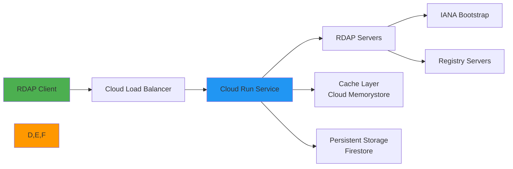

# دليل التكامل مع Google Cloud Run

> **الغرض:** دليل شامل لنشر RDAPify وتحسينه في بيئات Google Cloud Run بلا خادم
> **ذو صلة:** [البدء السريع](../../getting-started/quick_start.md) | [دليل CLI](../../cli/commands.md) | [AWS Lambda](aws-lambda.md) | [Azure Functions](azure-functions.md)
> **وقت القراءة:** 8 دقائق
> **نصيحة احترافية:** استخدم [قائمة تحقق النشر لـ GCP](#قالب-النشر-للإنتاج) لضمان أفضل ممارسات الأمان والأداء

---

## لماذا Google Cloud Run لتطبيقات RDAP؟

يوفر Google Cloud Run منصة بلا خادم مثالية لمعالجة بيانات RDAP مع عدة مزايا رئيسية:



**مزايا البيئة بلا خادم:**
- **التوسع التلقائي**: معالجة موجات استعلامات RDAP من 0 إلى 100+ نسخة تلقائياً
- **كفاءة التكلفة**: الدفع فقط عن وقت معالجة الاستعلامات الفعلي
- **إدارة البنية التحتية**: لا تصحيح للخوادم ولا إدارة للسعة
- **النشر العالمي**: النشر عبر مناطق Google Cloud للوصول بزمن استجابة منخفض
- **المراقبة المدمجة**: Cloud Monitoring وCloud Logging جاهزان للاستخدام
- **أمان المؤسسات**: VPC Service Controls وBinary Authorization وتوحيد هوية عبء العمل

---

## الإعداد والتكوين الأساسي

### 1. إنشاء خدمة Cloud Run
```bash
# Set up gcloud configuration
gcloud config set project your-gcp-project
gcloud config set run/region us-central1

# Build container image
gcloud builds submit --tag gcr.io/your-gcp-project/rdapify-processor

# Deploy to Cloud Run
gcloud run deploy rdapify-processor \
  --image gcr.io/your-gcp-project/rdapify-processor \
  --platform managed \
  --region us-central1 \
  --allow-unauthenticated \
  --memory 512Mi \
  --cpu 1 \
  --max-instances 100 \
  --min-instances 1 \
  --concurrency 80 \
  --timeout 30s \
  --set-env-vars NODE_ENV=production,RDAP_PRIVACY=true,RDAP_BLOCK_PRIVATE_IPS=true
```

### 2. Dockerfile محسّن لـ Cloud Run
```dockerfile
# Dockerfile
FROM node:20-slim AS base

WORKDIR /app

# تثبيت التبعيات أولاً (استفادة من التخزين المؤقت للطبقات)
COPY package*.json ./
RUN npm ci --only=production && npm cache clean --force

# نسخ كود التطبيق
COPY . .

# إنشاء مستخدم غير مميّز
RUN groupadd -r rdapify && useradd -r -g rdapify rdapify
RUN chown -R rdapify:rdapify /app
USER rdapify

# متغيرات البيئة الافتراضية
ENV NODE_ENV=production
ENV PORT=8080

EXPOSE 8080

# فحص الصحة
HEALTHCHECK --interval=30s --timeout=10s --start-period=5s --retries=3 \
  CMD node -e "require('http').get('http://localhost:8080/health', (r) => process.exit(r.statusCode === 200 ? 0 : 1))"

CMD ["node", "server.js"]
```

### 3. تطبيق Express.js محسّن لـ Cloud Run
```javascript
// server.js
const express = require('express');
const { RDAPClient } = require('rdapify');

const app = express();
const port = parseInt(process.env.PORT || '8080');

// تهيئة عميل RDAP
const rdap = new RDAPClient({
  cache: true,
  privacy: true,
  allowPrivateIPs: false,
  validateCertificates: true,
  timeout: parseInt(process.env.RDAP_TIMEOUT || '10000'),
  rateLimit: {
    max: parseInt(process.env.RDAP_RATE_LIMIT || '100'),
    window: 60000
  }
});

// رؤوس الأمان
app.use((req, res, next) => {
  res.setHeader('X-Content-Type-Options', 'nosniff');
  res.setHeader('X-Frame-Options', 'DENY');
  res.setHeader('X-Do-Not-Sell', 'true');
  res.setHeader('X-Data-Processing', 'PII redacted per GDPR Article 6(1)(f)');
  next();
});

// فحص الصحة - مطلوب لـ Cloud Run
app.get('/health', (req, res) => {
  res.status(200).json({
    status: 'ok',
    runtime: 'cloud-run',
    version: process.env.K_REVISION || 'unknown'
  });
});

// البحث عن نطاق
app.get('/api/domain/:domain', async (req, res) => {
  const domain = req.params.domain.toLowerCase().trim();

  if (!/^[a-z0-9.-]+\.[a-z]{2,}$/.test(domain)) {
    return res.status(400).json({ error: 'صيغة النطاق غير صالحة' });
  }

  try {
    const result = await rdap.domain(domain);
    res.setHeader('Cache-Control', 'public, max-age=3600');
    res.json(result);
  } catch (error) {
    if (error.code?.startsWith('RDAP_SECURE')) {
      return res.status(403).json({ error: 'انتهاك سياسة الأمان' });
    }
    res.status(error.statusCode || 500).json({ error: error.message });
  }
});

// البحث عن IP
app.get('/api/ip/:ip', async (req, res) => {
  try {
    const result = await rdap.ip(req.params.ip);
    res.json(result);
  } catch (error) {
    if (error.code?.startsWith('RDAP_SECURE')) {
      return res.status(403).json({ error: 'انتهاك سياسة الأمان' });
    }
    res.status(error.statusCode || 500).json({ error: error.message });
  }
});

// البحث عن ASN
app.get('/api/asn/:asn', async (req, res) => {
  try {
    const result = await rdap.asn(req.params.asn);
    res.json(result);
  } catch (error) {
    res.status(error.statusCode || 500).json({ error: error.message });
  }
});

// إغلاق متأنٍّ - مهم لـ Cloud Run
process.on('SIGTERM', () => {
  console.log('استلام SIGTERM - إغلاق الخادم بأمان...');
  server.close(() => {
    console.log('تم إغلاق الخادم');
    process.exit(0);
  });

  // إجبار الإغلاق بعد 10 ثوانٍ
  setTimeout(() => {
    process.exit(1);
  }, 10000);
});

const server = app.listen(port, () => {
  console.log(`خادم RDAPify Cloud Run يعمل على المنفذ ${port}`);
  console.log(`المراجعة: ${process.env.K_REVISION || 'unknown'}`);
  console.log(`الخدمة: ${process.env.K_SERVICE || 'unknown'}`);
});
```

## تحسين الأداء

### 1. التكامل مع Cloud Memorystore
```javascript
// cache/memorystore.js
const Redis = require('ioredis');

let redisClient;

function getMemorystoreClient() {
  if (!redisClient) {
    redisClient = new Redis({
      host: process.env.MEMORYSTORE_HOST || '10.0.0.3',
      port: parseInt(process.env.MEMORYSTORE_PORT || '6379'),
      retryStrategy: (times) => {
        if (times > 5) return null;
        return Math.min(times * 100, 2000);
      },
      connectTimeout: 3000,
      commandTimeout: 2000,
      enableOfflineQueue: false
    });

    redisClient.on('error', (err) => {
      console.error('Memorystore error:', err.message);
    });

    redisClient.on('connect', () => {
      console.log('اتصال ناجح بـ Cloud Memorystore');
    });
  }

  return redisClient;
}

exports.getRDAPCache = async (key) => {
  try {
    const client = getMemorystoreClient();
    const value = await client.get(`rdap:${key}`);
    return value ? JSON.parse(value) : null;
  } catch (err) {
    console.warn('فشل الوصول إلى Memorystore:', err.message);
    return null;
  }
};

exports.setRDAPCache = async (key, value, ttl = 3600) => {
  try {
    const client = getMemorystoreClient();
    await client.setex(`rdap:${key}`, ttl, JSON.stringify(value));
  } catch (err) {
    console.warn('فشل الكتابة في Memorystore:', err.message);
  }
};
```

### 2. إعداد Cloud Run للتزامن العالي
```yaml
# cloudrun-service.yaml
apiVersion: serving.knative.dev/v1
kind: Service
metadata:
  name: rdapify-processor
  annotations:
    run.googleapis.com/ingress: all
    run.googleapis.com/execution-environment: gen2
spec:
  template:
    metadata:
      annotations:
        autoscaling.knative.dev/minScale: "1"
        autoscaling.knative.dev/maxScale: "100"
        run.googleapis.com/cpu-throttling: "false"
        run.googleapis.com/startup-cpu-boost: "true"
        run.googleapis.com/vpc-access-connector: projects/your-project/locations/us-central1/connectors/rdapify-connector
        run.googleapis.com/vpc-access-egress: all-traffic
    spec:
      containerConcurrency: 80
      timeoutSeconds: 30
      serviceAccountName: rdapify-sa@your-project.iam.gserviceaccount.com
      containers:
        - image: gcr.io/your-project/rdapify-processor:latest
          resources:
            limits:
              memory: 512Mi
              cpu: "1"
          env:
            - name: NODE_ENV
              value: production
            - name: RDAP_PRIVACY
              value: "true"
            - name: RDAP_BLOCK_PRIVATE_IPS
              value: "true"
          startupProbe:
            httpGet:
              path: /health
              port: 8080
            periodSeconds: 5
            failureThreshold: 12
          livenessProbe:
            httpGet:
              path: /health
              port: 8080
            periodSeconds: 30
```

## تكامل Cloud Monitoring

### 1. المقاييس المخصصة
```javascript
// monitoring/cloud-monitoring.js
const monitoring = require('@google-cloud/monitoring');

const client = new monitoring.MetricServiceClient();
const projectId = process.env.GOOGLE_CLOUD_PROJECT;

exports.recordRDAPMetric = async (metricType, value, labels = {}) => {
  try {
    const now = new Date();
    const dataPoint = {
      interval: {
        endTime: { seconds: Math.floor(now.getTime() / 1000) }
      },
      value: { doubleValue: value }
    };

    const timeSeriesData = {
      metric: {
        type: `custom.googleapis.com/rdapify/${metricType}`,
        labels
      },
      resource: {
        type: 'global',
        labels: { project_id: projectId }
      },
      points: [dataPoint]
    };

    await client.createTimeSeries({
      name: client.projectPath(projectId),
      timeSeries: [timeSeriesData]
    });
  } catch (err) {
    console.warn('فشل تسجيل المقياس:', err.message);
  }
};
```

## قالب النشر للإنتاج

```bash
#!/bin/bash
# deploy-gcp.sh

set -e

PROJECT_ID="your-gcp-project"
REGION="us-central1"
SERVICE_NAME="rdapify-processor"
IMAGE="gcr.io/$PROJECT_ID/$SERVICE_NAME"

echo "بدء نشر RDAPify على Google Cloud Run..."

# التحقق من المصادقة
gcloud auth print-access-token > /dev/null || { echo "يرجى تسجيل الدخول بـ 'gcloud auth login'"; exit 1; }

gcloud config set project $PROJECT_ID

# بناء ونشر الصورة
echo "بناء صورة Docker..."
gcloud builds submit --tag $IMAGE:latest .

# نشر على Cloud Run
echo "نشر على Cloud Run..."
gcloud run deploy $SERVICE_NAME \
  --image $IMAGE:latest \
  --platform managed \
  --region $REGION \
  --memory 512Mi \
  --cpu 1 \
  --max-instances 100 \
  --min-instances 1 \
  --concurrency 80 \
  --timeout 30s \
  --set-env-vars NODE_ENV=production,RDAP_PRIVACY=true,RDAP_BLOCK_PRIVATE_IPS=true

echo "اكتمل النشر بنجاح!"
SERVICE_URL=$(gcloud run services describe $SERVICE_NAME --platform managed --region $REGION --format 'value(status.url)')
echo "عنوان الخدمة: $SERVICE_URL"
```

## استكشاف المشكلات الشائعة وإصلاحها

### 1. مشكلات التوسع من الصفر
**الأعراض**: زمن استجابة عالٍ عند أول طلب بعد فترة خمول

**الحلول**:
```bash
# تعيين الحد الأدنى للنسخ = 1
gcloud run services update rdapify-processor \
  --min-instances 1 \
  --region us-central1
```

### 2. مشكلات الاتصال بـ Memorystore
**الأعراض**: `ECONNREFUSED` للاتصال بـ Redis

**الحل**: تأكد من إعداد VPC connector:
```bash
# إنشاء VPC Access connector
gcloud compute networks vpc-access connectors create rdapify-connector \
  --region us-central1 \
  --subnet rdapify-subnet

# تحديث الخدمة لاستخدام الموصل
gcloud run services update rdapify-processor \
  --vpc-connector rdapify-connector \
  --vpc-egress all-traffic
```

## الوثائق ذات الصلة

| المستند | الوصف |
|----------|-------------|
| [AWS Lambda](aws-lambda.md) | بديل بلا خادم من AWS |
| [Azure Functions](azure-functions.md) | بديل من Microsoft |
| [Kubernetes](kubernetes.md) | للنشر الكامل بالحاويات |
| [Docker](../deployment/docker.md) | بناء الصور وتشغيلها محلياً |

## المواصفات التقنية

| الخاصية | القيمة |
|----------|-------|
| Runtime | Node.js 20 |
| الذاكرة الموصى بها | 512Mi |
| التزامن | 80 طلب لكل نسخة |
| أقصى نسخ | 100 (قابل للتعديل) |
| التخزين المؤقت | Cloud Memorystore Redis 7.x |
| التخزين الدائم | Firestore / Cloud SQL |
| المراقبة | Cloud Monitoring + Cloud Logging |
| المصادقة | Cloud IAM + Service Accounts |
| متوافق مع GDPR | نعم |
| حماية SSRF | مدمجة |
| آخر تحديث | 5 ديسمبر 2025 |

> **تنبيه مهم**: استخدم Service Accounts مخصصة بصلاحيات دنيا لكل خدمة Cloud Run. فعّل Binary Authorization لضمان تشغيل الصور الموقّعة فقط. راجع [أفضل ممارسات أمان Cloud Run](https://cloud.google.com/run/docs/securing/security) للمزيد.

[العودة إلى تكاملات Cloud](../cloud/) | [التالي: Kubernetes](kubernetes.md)
