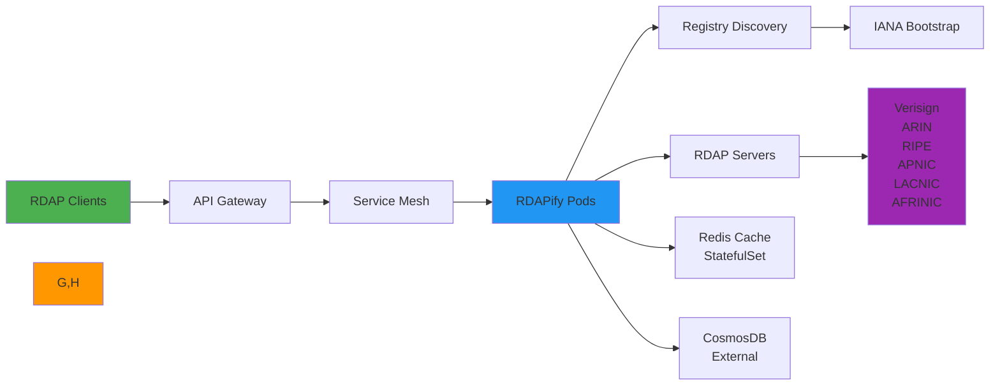

# دليل التكامل مع Kubernetes

> **الغرض:** دليل شامل لنشر RDAPify وتوسيعه في بيئات Kubernetes لتحقيق موثوقية وأداء على مستوى المؤسسات
> **ذو صلة:** [AWS Lambda](aws-lambda.md) | [Azure Functions](azure-functions.md) | [Google Cloud Run](google-cloud-run.md)
> **وقت القراءة:** 8 دقائق

---

## لماذا Kubernetes لتطبيقات RDAP؟

يوفر Kubernetes منصة التنسيق المثالية لمعالجة بيانات RDAP على نطاق واسع، ويقدم:



**مزايا Kubernetes الرئيسية:**
- **التوسع الأفقي**: توسيع معالجة RDAP بناءً على حجم الاستعلام وحصص السجل
- **الإصلاح الذاتي**: استرداد Pod التلقائي أثناء انقطاع السجل أو أقسام الشبكة
- **اتساق بيئات التطوير**: نفس أنماط النشر عبر بيئات dev/staging/prod
- **تكامل Service Mesh**: إدارة حركة المرور المتقدمة وسياسات إعادة المحاولة وقطع الدائرة
- **التخزين المؤقت الدائم**: تخزين مؤقت ذو حالة مع Redis Cluster للتوافر العالي
- **النشر العالمي**: نشر متعدد المناطق مع service mesh لوصول منخفض الزمن

---

## أنماط النشر الأساسية

### 1. نشر Helm الأساسي
```yaml
# values.yaml
replicaCount: 3

image:
  repository: registry.example.com/rdapify
  tag: 2.3.0
  pullPolicy: IfNotPresent

service:
  type: ClusterIP
  port: 3000

resources:
  requests:
    memory: "256Mi"
    cpu: "250m"
  limits:
    memory: "512Mi"
    cpu: "500m"

autoscaling:
  enabled: true
  minReplicas: 3
  maxReplicas: 50
  targetCPUUtilizationPercentage: 70
  targetMemoryUtilizationPercentage: 80

env:
  RDAP_PRIVACY: "true"
  RDAP_BLOCK_PRIVATE_IPS: "true"
  RDAP_TIMEOUT: "10000"
  NODE_ENV: "production"

redis:
  enabled: true
  replicaCount: 3
  persistence:
    enabled: true
    size: 10Gi
```

### 2. بيان النشر الكامل
```yaml
# deployment.yaml
apiVersion: apps/v1
kind: Deployment
metadata:
  name: rdapify-processor
  namespace: rdapify
  labels:
    app: rdapify-processor
    version: "2.3.0"
spec:
  replicas: 3
  selector:
    matchLabels:
      app: rdapify-processor
  strategy:
    type: RollingUpdate
    rollingUpdate:
      maxSurge: 1
      maxUnavailable: 0
  template:
    metadata:
      labels:
        app: rdapify-processor
        version: "2.3.0"
      annotations:
        prometheus.io/scrape: "true"
        prometheus.io/port: "3001"
        prometheus.io/path: "/metrics"
    spec:
      serviceAccountName: rdapify-sa
      securityContext:
        runAsNonRoot: true
        runAsUser: 1000
        fsGroup: 1000
      containers:
        - name: rdapify
          image: registry.example.com/rdapify:2.3.0
          imagePullPolicy: IfNotPresent
          ports:
            - name: http
              containerPort: 3000
            - name: metrics
              containerPort: 3001
          env:
            - name: NODE_ENV
              value: "production"
            - name: RDAP_PRIVACY
              value: "true"
            - name: RDAP_BLOCK_PRIVATE_IPS
              value: "true"
            - name: REDIS_HOST
              valueFrom:
                configMapKeyRef:
                  name: rdapify-config
                  key: redis-host
            - name: REDIS_PASSWORD
              valueFrom:
                secretKeyRef:
                  name: rdapify-secrets
                  key: redis-password
          resources:
            requests:
              memory: "256Mi"
              cpu: "250m"
            limits:
              memory: "512Mi"
              cpu: "500m"
          livenessProbe:
            httpGet:
              path: /health
              port: 3000
            initialDelaySeconds: 30
            periodSeconds: 30
            timeoutSeconds: 10
            failureThreshold: 3
          readinessProbe:
            httpGet:
              path: /ready
              port: 3000
            initialDelaySeconds: 10
            periodSeconds: 10
            timeoutSeconds: 5
            failureThreshold: 3
          startupProbe:
            httpGet:
              path: /health
              port: 3000
            periodSeconds: 5
            failureThreshold: 12
          securityContext:
            allowPrivilegeEscalation: false
            readOnlyRootFilesystem: true
            capabilities:
              drop:
                - ALL
      affinity:
        podAntiAffinity:
          preferredDuringSchedulingIgnoredDuringExecution:
            - weight: 100
              podAffinityTerm:
                labelSelector:
                  matchExpressions:
                    - key: app
                      operator: In
                      values:
                        - rdapify-processor
                topologyKey: kubernetes.io/hostname
```

### 3. الخدمة والـ Ingress
```yaml
# service.yaml
apiVersion: v1
kind: Service
metadata:
  name: rdapify-service
  namespace: rdapify
  labels:
    app: rdapify-processor
spec:
  selector:
    app: rdapify-processor
  ports:
    - name: http
      port: 80
      targetPort: 3000
  type: ClusterIP

---
# ingress.yaml
apiVersion: networking.k8s.io/v1
kind: Ingress
metadata:
  name: rdapify-ingress
  namespace: rdapify
  annotations:
    kubernetes.io/ingress.class: nginx
    cert-manager.io/cluster-issuer: letsencrypt-prod
    nginx.ingress.kubernetes.io/rate-limit: "100"
    nginx.ingress.kubernetes.io/rate-limit-window: "1m"
    nginx.ingress.kubernetes.io/ssl-redirect: "true"
    nginx.ingress.kubernetes.io/proxy-body-size: "1m"
spec:
  tls:
    - hosts:
        - rdap.example.com
      secretName: rdapify-tls
  rules:
    - host: rdap.example.com
      http:
        paths:
          - path: /api
            pathType: Prefix
            backend:
              service:
                name: rdapify-service
                port:
                  number: 80
```

## التوسع التلقائي

### 1. HorizontalPodAutoscaler
```yaml
# hpa.yaml
apiVersion: autoscaling/v2
kind: HorizontalPodAutoscaler
metadata:
  name: rdapify-hpa
  namespace: rdapify
spec:
  scaleTargetRef:
    apiVersion: apps/v1
    kind: Deployment
    name: rdapify-processor
  minReplicas: 3
  maxReplicas: 50
  metrics:
    - type: Resource
      resource:
        name: cpu
        target:
          type: Utilization
          averageUtilization: 70
    - type: Resource
      resource:
        name: memory
        target:
          type: Utilization
          averageUtilization: 80
    - type: Pods
      pods:
        metric:
          name: rdap_requests_per_second
        target:
          type: AverageValue
          averageValue: "100"
  behavior:
    scaleDown:
      stabilizationWindowSeconds: 300
      policies:
        - type: Percent
          value: 25
          periodSeconds: 60
    scaleUp:
      stabilizationWindowSeconds: 60
      policies:
        - type: Percent
          value: 50
          periodSeconds: 30
```

## Redis StatefulSet للتخزين المؤقت الدائم

### 1. نشر Redis Cluster
```yaml
# redis-statefulset.yaml
apiVersion: apps/v1
kind: StatefulSet
metadata:
  name: redis-cluster
  namespace: rdapify
spec:
  serviceName: redis-headless
  replicas: 6
  selector:
    matchLabels:
      app: redis-cluster
  template:
    metadata:
      labels:
        app: redis-cluster
    spec:
      containers:
        - name: redis
          image: redis:7-alpine
          ports:
            - containerPort: 6379
              name: redis
            - containerPort: 16379
              name: cluster
          command:
            - redis-server
            - /etc/redis/redis.conf
            - --cluster-enabled yes
            - --cluster-config-file nodes.conf
            - --cluster-node-timeout 5000
          resources:
            requests:
              memory: "256Mi"
              cpu: "100m"
            limits:
              memory: "512Mi"
              cpu: "250m"
          volumeMounts:
            - name: redis-data
              mountPath: /data
            - name: redis-config
              mountPath: /etc/redis
          livenessProbe:
            exec:
              command:
                - redis-cli
                - ping
            periodSeconds: 15
  volumeClaimTemplates:
    - metadata:
        name: redis-data
      spec:
        accessModes: ["ReadWriteOnce"]
        resources:
          requests:
            storage: 10Gi
```

## تكامل Service Mesh (Istio)

### 1. سياسة حركة المرور
```yaml
# virtual-service.yaml
apiVersion: networking.istio.io/v1alpha3
kind: VirtualService
metadata:
  name: rdapify-vs
  namespace: rdapify
spec:
  hosts:
    - rdapify-service
  http:
    - match:
        - uri:
            prefix: /api/domain
      timeout: 15s
      retries:
        attempts: 3
        perTryTimeout: 5s
        retryOn: connect-failure,reset,retriable-4xx,retriable-status-codes
        retryRemoteStatuses: 503,504
      route:
        - destination:
            host: rdapify-service
            port:
              number: 80

---
# destination-rule.yaml
apiVersion: networking.istio.io/v1alpha3
kind: DestinationRule
metadata:
  name: rdapify-dr
  namespace: rdapify
spec:
  host: rdapify-service
  trafficPolicy:
    connectionPool:
      tcp:
        maxConnections: 100
      http:
        http1MaxPendingRequests: 1000
        http2MaxRequests: 1000
        maxRequestsPerConnection: 100
    outlierDetection:
      consecutive5xxErrors: 5
      interval: 30s
      baseEjectionTime: 30s
      maxEjectionPercent: 50
```

## قالب النشر للإنتاج

```bash
#!/bin/bash
# deploy-k8s.sh

set -e

NAMESPACE="rdapify"
CLUSTER_NAME="rdapify-cluster"

echo "بدء نشر RDAPify على Kubernetes..."

# إنشاء Namespace
kubectl create namespace $NAMESPACE --dry-run=client -o yaml | kubectl apply -f -

# تطبيق Secrets
kubectl create secret generic rdapify-secrets \
  --from-literal=redis-password=$REDIS_PASSWORD \
  --namespace $NAMESPACE \
  --dry-run=client -o yaml | kubectl apply -f -

# تطبيق ConfigMaps
kubectl apply -f k8s/configmap.yaml -n $NAMESPACE

# نشر التطبيق
kubectl apply -f k8s/deployment.yaml -n $NAMESPACE
kubectl apply -f k8s/service.yaml -n $NAMESPACE
kubectl apply -f k8s/ingress.yaml -n $NAMESPACE
kubectl apply -f k8s/hpa.yaml -n $NAMESPACE

# الانتظار حتى اكتمال النشر
echo "انتظار اكتمال النشر..."
kubectl rollout status deployment/rdapify-processor -n $NAMESPACE --timeout=300s

echo "اكتمل النشر بنجاح!"
kubectl get pods -n $NAMESPACE
```

## استكشاف المشكلات الشائعة وإصلاحها

### 1. فشل فحوصات الصحة
**الأعراض**: Pods في حالة CrashLoopBackOff

**التشخيص**:
```bash
# فحص سجلات الـ Pod
kubectl logs -n rdapify deployment/rdapify-processor --previous

# وصف الـ Pod للتحقق من فحوصات الصحة
kubectl describe pod -n rdapify -l app=rdapify-processor

# اختبار مباشر لنقطة نهاية الصحة
kubectl exec -n rdapify deployment/rdapify-processor -- curl -s http://localhost:3000/health
```

### 2. مشكلات الاتصال بـ Redis
**الأعراض**: أخطاء ECONNREFUSED في سجلات التطبيق

**الحل**:
```bash
# التحقق من حالة Redis pods
kubectl get pods -n rdapify -l app=redis-cluster

# اختبار الاتصال من داخل الـ Pod
kubectl exec -n rdapify deployment/rdapify-processor -- \
  redis-cli -h redis-headless -p 6379 ping
```

## الوثائق ذات الصلة

| المستند | الوصف |
|----------|-------------|
| [AWS Lambda](aws-lambda.md) | بديل بلا خادم |
| [Docker](../deployment/docker.md) | بناء الصور |
| [Prometheus](../monitoring/prometheus.md) | المراقبة |
| [متغيرات البيئة](../deployment/environment-vars.md) | إعداد البيئة |

## المواصفات التقنية

| الخاصية | القيمة |
|----------|-------|
| إصدار Kubernetes | 1.28+ |
| إدارة الحزم | Helm 3.x |
| Service Mesh | Istio 1.19+ (اختياري) |
| التوسع التلقائي | HPA + KEDA |
| تخزين Redis | StatefulSet + PVC |
| الشبكات | Nginx Ingress + cert-manager |
| المراقبة | Prometheus + Grafana |
| متوافق مع GDPR | نعم |
| حماية SSRF | مدمجة |
| آخر تحديث | 5 ديسمبر 2025 |

> **تنبيه مهم**: طبّق سياسات الشبكة (NetworkPolicies) لعزل اتصالات Pod. استخدم RBAC بأقل الصلاحيات اللازمة. فعّل PodSecurityAdmission لمنع تشغيل الحاويات المميّزة. راجع [دليل أمان Kubernetes](https://kubernetes.io/docs/concepts/security/) للمزيد.

[العودة إلى تكاملات Cloud](../cloud/) | [العودة إلى التكاملات](../README.md)
