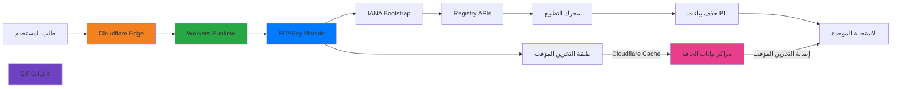

# دليل التكامل مع Cloudflare Workers

**الغرض**: دليل شامل لتكامل RDAPify مع Cloudflare Workers لإجراء عمليات بحث آمنة عن النطاقات وعناوين IP وأرقام ASN بأداء الحوسبة على الحافة وحماية DDoS وتوزيع عالمي
**ذو صلة**: [Deno](deno.md) | [Bun](bun.md) | [Docker](deployment/docker.md)
**وقت القراءة**: 7 دقائق

## لماذا Cloudflare Workers لتطبيقات RDAP؟

توفر Cloudflare Workers منصة حوسبة على الحافة مثالية لبناء خدمات معالجة بيانات RDAP العالمية مع المزايا الرئيسية التالية:



### مزايا الحوسبة على الحافة الرئيسية:
- **زمن استجابة منخفض عالمياً**: تقديم بيانات RDAP من أكثر من 300 موقع حافة حول العالم
- **حماية DDoS**: حماية مدمجة للطبقتين 3/4 و7 لنقاط نهاية RDAP
- **بدء تشغيل فوري**: عزل V8 يتيح تنفيذاً فورياً للبحثات الحساسة للوقت
- **الدفع عند الاستخدام**: لا تكاليف خمول - مثالي لأنماط استعلام RDAP غير المنتظمة
- **تخزين مؤقت مدمج**: تخزين مؤقت على الحافة مع إبطال تلقائي وعلامات تخزين مؤقت
- **آمن بشكل افتراضي**: لا منافذ مفتوحة، TLS تلقائي، ورؤوس CSP صارمة

## البدء: التكامل الأساسي

### 1. إعداد المشروع والتبعيات
```bash
# تثبيت Wrangler CLI
npm install -g wrangler

# إنشاء مشروع جديد
wrangler init rdapify-workers
cd rdapify-workers

# تثبيت RDAPify
npm install rdapify
```

### 2. إعداد Wrangler
```toml
# wrangler.toml
name = "rdapify-worker"
main = "src/index.ts"
compatibility_date = "2024-01-01"
compatibility_flags = ["nodejs_compat"]

[vars]
RDAP_CACHE_TTL = "3600"
RDAP_RATE_LIMIT = "100"

[[kv_namespaces]]
binding = "RDAP_CACHE"
id = "your-kv-namespace-id"

[limits]
cpu_ms = 50
```

### 3. مثال عملي مبسّط
```typescript
// src/index.ts
import { RDAPClient } from 'rdapify';

export interface Env {
  RDAP_CACHE: KVNamespace;
  RDAP_CACHE_TTL: string;
  RDAP_RATE_LIMIT: string;
}

// تهيئة عميل RDAP (يُعاد استخدامه عبر الطلبات في نفس العزل)
const rdap = new RDAPClient({
  cache: false, // نستخدم Cloudflare KV للتخزين المؤقت
  privacy: true,
  allowPrivateIPs: false,
  validateCertificates: true,
  timeout: 5000
});

export default {
  async fetch(request: Request, env: Env): Promise<Response> {
    const url = new URL(request.url);
    const requestId = crypto.randomUUID();

    // رؤوس الأمان الافتراضية
    const securityHeaders = {
      'X-Request-ID': requestId,
      'X-Content-Type-Options': 'nosniff',
      'X-Frame-Options': 'DENY',
      'X-Do-Not-Sell': 'true',
      'X-Data-Processing': 'PII redacted per GDPR Article 6(1)(f)'
    };

    try {
      // فحص الصحة
      if (url.pathname === '/health') {
        return Response.json(
          { status: 'ok', runtime: 'cloudflare-workers' },
          { headers: securityHeaders }
        );
      }

      // البحث عن نطاق
      const domainMatch = url.pathname.match(/^\/api\/domain\/([^/]+)$/);
      if (domainMatch) {
        return await handleDomainLookup(domainMatch[1], env, securityHeaders);
      }

      // البحث عن IP
      const ipMatch = url.pathname.match(/^\/api\/ip\/([^/]+)$/);
      if (ipMatch) {
        return await handleIPLookup(ipMatch[1], env, securityHeaders);
      }

      // البحث عن ASN
      const asnMatch = url.pathname.match(/^\/api\/asn\/([^/]+)$/);
      if (asnMatch) {
        return await handleASNLookup(asnMatch[1], env, securityHeaders);
      }

      return Response.json(
        { error: 'غير موجود' },
        { status: 404, headers: securityHeaders }
      );

    } catch (error: unknown) {
      const err = error as { message?: string };
      console.error('Worker error:', err.message);

      return Response.json(
        { error: 'خطأ داخلي في الخادم', requestId },
        { status: 500, headers: securityHeaders }
      );
    }
  }
};

async function handleDomainLookup(
  domain: string,
  env: Env,
  headers: Record<string, string>
): Promise<Response> {
  const normalizedDomain = decodeURIComponent(domain).toLowerCase().trim();

  if (!/^[a-z0-9.-]+\.[a-z]{2,}$/.test(normalizedDomain)) {
    return Response.json(
      { error: 'صيغة النطاق غير صالحة' },
      { status: 400, headers }
    );
  }

  // التحقق من Cloudflare KV
  const cacheKey = `rdap:domain:${normalizedDomain}`;
  const cached = await env.RDAP_CACHE.get(cacheKey, 'json');

  if (cached) {
    return Response.json(cached, {
      headers: { ...headers, 'X-Cache': 'HIT', 'Cache-Control': 'public, max-age=3600' }
    });
  }

  try {
    const result = await rdap.domain(normalizedDomain);
    const ttl = parseInt(env.RDAP_CACHE_TTL || '3600');

    // تخزين في Cloudflare KV
    await env.RDAP_CACHE.put(cacheKey, JSON.stringify(result), {
      expirationTtl: ttl
    });

    return Response.json(result, {
      headers: {
        ...headers,
        'X-Cache': 'MISS',
        'Cache-Control': `public, max-age=${ttl}`
      }
    });
  } catch (error: unknown) {
    const err = error as { code?: string; statusCode?: number; message?: string };

    if (err.code?.startsWith('RDAP_SECURE')) {
      return Response.json(
        { error: 'انتهاك سياسة الأمان' },
        { status: 403, headers }
      );
    }

    return Response.json(
      { error: err.message || 'فشل الاستعلام' },
      { status: err.statusCode || 500, headers }
    );
  }
}

async function handleIPLookup(
  ip: string,
  env: Env,
  headers: Record<string, string>
): Promise<Response> {
  const cacheKey = `rdap:ip:${ip}`;
  const cached = await env.RDAP_CACHE.get(cacheKey, 'json');

  if (cached) {
    return Response.json(cached, {
      headers: { ...headers, 'X-Cache': 'HIT' }
    });
  }

  try {
    const result = await rdap.ip(ip);
    await env.RDAP_CACHE.put(cacheKey, JSON.stringify(result), { expirationTtl: 1800 });

    return Response.json(result, { headers: { ...headers, 'X-Cache': 'MISS' } });
  } catch (error: unknown) {
    const err = error as { code?: string; statusCode?: number; message?: string };

    if (err.code?.startsWith('RDAP_SECURE')) {
      return Response.json({ error: 'انتهاك سياسة الأمان' }, { status: 403, headers });
    }

    return Response.json(
      { error: err.message },
      { status: err.statusCode || 500, headers }
    );
  }
}

async function handleASNLookup(
  asn: string,
  env: Env,
  headers: Record<string, string>
): Promise<Response> {
  try {
    const result = await rdap.asn(asn);
    return Response.json(result, { headers });
  } catch (error: unknown) {
    const err = error as { message?: string; statusCode?: number };
    return Response.json(
      { error: err.message },
      { status: err.statusCode || 500, headers }
    );
  }
}
```

## تعزيز الأمان والامتثال

### 1. تحديد معدل الطلبات باستخدام Durable Objects
```typescript
// src/rate-limiter.ts
export class RDAPRateLimiter implements DurableObject {
  private state: DurableObjectState;
  private requests: Map<string, number[]> = new Map();

  constructor(state: DurableObjectState) {
    this.state = state;
  }

  async fetch(request: Request): Promise<Response> {
    const url = new URL(request.url);
    const ip = url.searchParams.get('ip') || 'unknown';
    const maxRequests = parseInt(url.searchParams.get('max') || '100');
    const windowMs = parseInt(url.searchParams.get('window') || '60000');

    const now = Date.now();
    const windowStart = now - windowMs;

    // تنظيف الطلبات القديمة
    const ipRequests = (this.requests.get(ip) || []).filter(t => t > windowStart);
    ipRequests.push(now);
    this.requests.set(ip, ipRequests);

    const allowed = ipRequests.length <= maxRequests;
    const remaining = Math.max(0, maxRequests - ipRequests.length);

    return Response.json({ allowed, remaining, resetTime: now + windowMs });
  }
}
```

### 2. Cloudflare WAF Rules
```json
// cloudflare-waf-rules.json
{
  "rules": [
    {
      "expression": "http.request.uri.path matches \"^/api/(domain|ip|asn)/\" and not http.request.headers[\"cf-connecting-ip\"] exists",
      "action": "block",
      "description": "حظر الطلبات بدون معلومات IP"
    },
    {
      "expression": "http.request.uri.path matches \"^/api/\" and http.request.method ne \"GET\"",
      "action": "block",
      "description": "السماح بطريقة GET فقط"
    },
    {
      "expression": "cf.threat_score gt 10",
      "action": "challenge",
      "description": "تحدي الطلبات عالية الخطورة"
    }
  ]
}
```

## التخزين المؤقت على الحافة

### 1. استراتيجية التخزين المؤقت المتقدمة
```typescript
// src/cache-strategies.ts

// استراتيجية Stale-While-Revalidate
export async function getWithSWR(
  key: string,
  kv: KVNamespace,
  fetcher: () => Promise<unknown>,
  staleTTL = 3600,
  maxAge = 86400
): Promise<{ data: unknown; stale: boolean }> {
  const stored = await kv.getWithMetadata<{ data: unknown; fetchedAt: number }>(key, 'json');

  if (stored.value) {
    const age = (Date.now() / 1000) - stored.value.fetchedAt;

    if (age < staleTTL) {
      // البيانات حديثة
      return { data: stored.value.data, stale: false };
    }

    if (age < maxAge) {
      // البيانات قديمة لكن لا تزال صالحة - إعادة التحقق في الخلفية
      const revalidationCtx = { waitUntil: (p: Promise<unknown>) => p };
      revalidationCtx.waitUntil(
        fetcher().then(async (newData) => {
          await kv.put(key, JSON.stringify({
            data: newData,
            fetchedAt: Math.floor(Date.now() / 1000)
          }), { expirationTtl: maxAge });
        }).catch(err => console.error('إعادة التحقق فشلت:', err))
      );

      return { data: stored.value.data, stale: true };
    }
  }

  // جلب بيانات جديدة
  const data = await fetcher();
  await kv.put(key, JSON.stringify({
    data,
    fetchedAt: Math.floor(Date.now() / 1000)
  }), { expirationTtl: maxAge });

  return { data, stale: false };
}
```

## الاختبار والتحقق

### 1. اختبار محلي مع Wrangler
```bash
# تشغيل محلي
wrangler dev

# تشغيل الاختبارات
wrangler dev --test-scheduled

# اختبار نقاط النهاية
curl http://localhost:8787/health
curl http://localhost:8787/api/domain/example.com
curl http://localhost:8787/api/ip/8.8.8.8
```

### 2. اختبارات Workers
```typescript
// test/worker.test.ts
import { describe, it, expect, beforeAll } from 'vitest';
import { unstable_dev } from 'wrangler';

describe('Cloudflare Worker RDAP', () => {
  let worker: Awaited<ReturnType<typeof unstable_dev>>;

  beforeAll(async () => {
    worker = await unstable_dev('src/index.ts', {
      experimental: { disableExperimentalWarning: true }
    });
  });

  afterAll(async () => {
    await worker.stop();
  });

  it('يجب إرجاع استجابة صحيحة لفحص الصحة', async () => {
    const resp = await worker.fetch('/health');
    expect(resp.status).toBe(200);

    const data = await resp.json() as { status: string };
    expect(data.status).toBe('ok');
  });

  it('يجب رفض صيغة النطاق غير الصالحة', async () => {
    const resp = await worker.fetch('/api/domain/invalid!!');
    expect(resp.status).toBe(400);
  });
});
```

## النشر

```bash
# نشر في بيئة الإنتاج
wrangler deploy

# نشر في بيئة تجريبية
wrangler deploy --env staging

# مراقبة السجلات في الوقت الفعلي
wrangler tail rdapify-worker
```

## الوثائق ذات الصلة

| المستند | الوصف |
|----------|-------------|
| [تكامل Deno](deno.md) | بيئة تشغيل آمنة مشابهة |
| [تكامل Bun](bun.md) | بيئة تشغيل عالية الأداء |
| [نشر Serverless](deployment/serverless.md) | أنماط النشر بلا خادم |
| [تكامل Redis](redis.md) | التخزين المؤقت الموزع للخوادم |

## المواصفات التقنية

| الخاصية | القيمة |
|----------|-------|
| إصدار Workers Runtime | بيئة عمل V8 |
| حد CPU | 50ms لكل طلب (الخطة المجانية) |
| Cloudflare KV | للتخزين المؤقت العالمي |
| Durable Objects | لتحديد معدل الطلبات |
| مواقع الحافة | 300+ موقع عالمي |
| حماية DDoS | Layer 3/4 و Layer 7 |
| متوافق مع GDPR | نعم مع إعداد KV الصحيح |
| حماية SSRF | مدمجة |
| آخر تحديث | 5 ديسمبر 2025 |

> **تنبيه مهم**: Workers تعمل في عزلات V8 وليس Node.js. بعض APIs الخاصة بـ Node.js غير متوفرة. استخدم علامة `nodejs_compat` في wrangler.toml لتمكين التوافق. تأكد من اختبار جميع الوظائف محلياً بـ `wrangler dev` قبل النشر.

[العودة إلى التكاملات](../README.md) | [التالي: AWS Lambda](cloud/aws-lambda.md)
