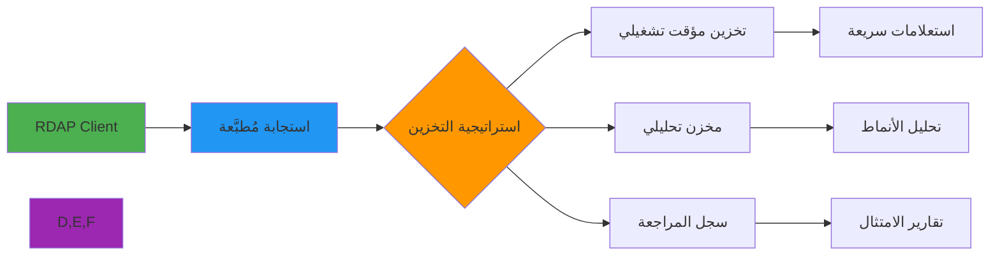

# دليل تصميم مخططات قواعد البيانات

> **الغرض:** دليل شامل لتصميم مخططات قواعد البيانات لتخزين بيانات RDAP وتحليلها والامتثال لمتطلبات القانون
> **ذو صلة:** [تكامل Redis](../redis.md) | [التحقق من البيانات](../../../guides/data_validation.md) | [امتثال GDPR](../../../security/gdpr-compliance.md)
> **وقت القراءة:** 7 دقائق
> **نصيحة احترافية:** استخدم [أداة التحقق من المخطط](./schema-validator.md) للتحقق التلقائي من تصاميم مخططاتك

---

## لماذا يهم تصميم المخطط لبيانات RDAP؟

تطرح بيانات RDAP (بروتوكول الوصول إلى بيانات التسجيل) تحديات فريدة لتصميم مخطط قاعدة البيانات بسبب طبيعتها شبه المهيكلة ومتطلبات الامتثال ومتطلبات الأداء:



**تحديات تصميم المخطط الرئيسية:**
- **البيانات شبه المهيكلة**: استجابات RDAP تختلف حسب السجل ونوع الاستعلام
- **معالجة بيانات PII**: يجب عزل البيانات الشخصية أو حذفها وفق GDPR/CCPA
- **المتطلبات الزمنية**: البيانات التاريخية للامتثال وتحليل الاتجاهات
- **أنماط الاستعلام**: أنماط وصول مختلفة للاستخدامات التشغيلية مقابل التحليلية
- **التوسع**: معالجة ملايين سجلات النطاقات مع قدرات بحث سريعة

---

## أنماط المخطط الأساسية

### 1. المخطط التشغيلي المُطبَّع
```sql
-- PostgreSQL schema for operational queries
CREATE TABLE domains (
    id UUID PRIMARY KEY DEFAULT gen_random_uuid(),
    domain_name TEXT NOT NULL,
    normalized_name TEXT NOT NULL,
    tld VARCHAR(10) NOT NULL,
    registry_source VARCHAR(50) NOT NULL,
    registration_date TIMESTAMPTZ,
    expiration_date TIMESTAMPTZ,
    updated_date TIMESTAMPTZ,
    status JSONB NOT NULL DEFAULT '[]',
    nameservers JSONB NOT NULL DEFAULT '[]',
    -- بيانات RDAP الخام بعد حذف PII
    rdap_data JSONB NOT NULL,
    -- بيانات PII في جدول مُعزَل (للجهات المرخّصة فقط)
    has_pii_data BOOLEAN NOT NULL DEFAULT false,
    -- بيانات الأداء والتخزين المؤقت
    fetched_at TIMESTAMPTZ NOT NULL DEFAULT NOW(),
    cache_expires_at TIMESTAMPTZ NOT NULL,
    query_count INTEGER NOT NULL DEFAULT 0,
    last_queried_at TIMESTAMPTZ,
    -- بيانات الامتثال
    gdpr_compliant BOOLEAN NOT NULL DEFAULT true,
    data_controller TEXT,
    CONSTRAINT domains_name_unique UNIQUE (normalized_name)
);

-- فهارس لأنماط الاستعلام الشائعة
CREATE INDEX idx_domains_name ON domains USING btree (normalized_name);
CREATE INDEX idx_domains_tld ON domains USING btree (tld);
CREATE INDEX idx_domains_expiry ON domains USING btree (expiration_date);
CREATE INDEX idx_domains_status ON domains USING gin (status);
CREATE INDEX idx_domains_fetched ON domains USING btree (fetched_at);
CREATE INDEX idx_domains_cache_expires ON domains USING btree (cache_expires_at)
    WHERE cache_expires_at > NOW();
```

### 2. جدول مُعزَل لبيانات PII
```sql
-- جدول منفصل لبيانات PII مع ضوابط وصول صارمة
CREATE TABLE domain_pii_data (
    id UUID PRIMARY KEY DEFAULT gen_random_uuid(),
    domain_id UUID NOT NULL REFERENCES domains(id) ON DELETE CASCADE,
    -- بيانات مشفّرة
    registrant_name_encrypted BYTEA,
    registrant_email_encrypted BYTEA,
    registrant_phone_encrypted BYTEA,
    registrant_address_encrypted BYTEA,
    -- بيانات المراجعة
    data_source TEXT NOT NULL,
    collected_at TIMESTAMPTZ NOT NULL DEFAULT NOW(),
    retention_expires_at TIMESTAMPTZ NOT NULL,
    legal_basis TEXT NOT NULL, -- مبرر GDPR Article 6
    -- إدارة البيانات
    deletion_requested_at TIMESTAMPTZ,
    deletion_completed_at TIMESTAMPTZ,
    CONSTRAINT fk_domain_pii_domain FOREIGN KEY (domain_id) REFERENCES domains(id)
);

-- تقييد الوصول إلى PII
REVOKE ALL ON domain_pii_data FROM PUBLIC;
GRANT SELECT ON domain_pii_data TO rdapify_pii_reader;
GRANT INSERT, UPDATE ON domain_pii_data TO rdapify_pii_writer;

-- سياسة أمان على مستوى الصف
ALTER TABLE domain_pii_data ENABLE ROW LEVEL SECURITY;

CREATE POLICY pii_access_policy ON domain_pii_data
    FOR SELECT
    TO rdapify_pii_reader
    USING (
        deletion_requested_at IS NULL AND
        retention_expires_at > NOW()
    );
```

### 3. جدول سجل المراجعة
```sql
-- سجل مراجعة للامتثال (للإلحاق فقط)
CREATE TABLE rdap_audit_log (
    id BIGSERIAL PRIMARY KEY,
    event_id UUID NOT NULL DEFAULT gen_random_uuid(),
    event_type TEXT NOT NULL, -- query, cache_hit, pii_access, error
    query_type TEXT, -- domain, ip, asn, nameserver, entity
    query_value_hash TEXT NOT NULL, -- تجزئة SHA256 بدلاً من القيمة الفعلية
    result_status TEXT NOT NULL, -- success, not_found, error, blocked
    response_time_ms INTEGER,
    cache_hit BOOLEAN,
    -- بيانات الطلب (مُعقَّمة)
    client_ip_hash TEXT, -- لا تُخزَّن عناوين IP مباشرةً
    user_agent_hash TEXT,
    request_id UUID,
    -- بيانات الامتثال
    gdpr_lawful_basis TEXT,
    data_processed BOOLEAN NOT NULL DEFAULT false,
    -- الطابع الزمني
    created_at TIMESTAMPTZ NOT NULL DEFAULT NOW()
) PARTITION BY RANGE (created_at);

-- أقسام شهرية للأداء
CREATE TABLE rdap_audit_log_2025_01 PARTITION OF rdap_audit_log
    FOR VALUES FROM ('2025-01-01') TO ('2025-02-01');
CREATE TABLE rdap_audit_log_2025_02 PARTITION OF rdap_audit_log
    FOR VALUES FROM ('2025-02-01') TO ('2025-03-01');
-- ... المزيد من الأقسام

-- فهارس على جدول الأقسام الرئيسي
CREATE INDEX idx_audit_event_type ON rdap_audit_log (event_type, created_at);
CREATE INDEX idx_audit_query_type ON rdap_audit_log (query_type, created_at);
CREATE INDEX idx_audit_request_id ON rdap_audit_log (request_id);
```

### 4. مخطط تحليلي لتحليل بيانات RDAP
```sql
-- جدول حقائق لتحليل RDAP (Star Schema)
CREATE TABLE rdap_query_facts (
    fact_id BIGSERIAL PRIMARY KEY,
    -- مفاتيح الأبعاد
    time_key INTEGER NOT NULL REFERENCES dim_time(time_key),
    domain_key INTEGER REFERENCES dim_domain(domain_key),
    registry_key INTEGER REFERENCES dim_registry(registry_key),
    query_type_key INTEGER REFERENCES dim_query_type(query_type_key),
    -- مقاييس
    query_count INTEGER NOT NULL DEFAULT 1,
    cache_hits INTEGER NOT NULL DEFAULT 0,
    cache_misses INTEGER NOT NULL DEFAULT 0,
    avg_response_time_ms DECIMAL(10,2),
    error_count INTEGER NOT NULL DEFAULT 0,
    -- تجميع يومي
    query_date DATE NOT NULL
) PARTITION BY RANGE (query_date);

-- جداول الأبعاد
CREATE TABLE dim_time (
    time_key INTEGER PRIMARY KEY,
    full_date DATE NOT NULL,
    year INTEGER NOT NULL,
    quarter INTEGER NOT NULL,
    month INTEGER NOT NULL,
    week INTEGER NOT NULL,
    day_of_week INTEGER NOT NULL,
    is_weekend BOOLEAN NOT NULL
);

CREATE TABLE dim_registry (
    registry_key SERIAL PRIMARY KEY,
    registry_name TEXT NOT NULL UNIQUE,
    registry_type TEXT NOT NULL, -- gTLD, ccTLD, RIR
    region TEXT,
    rdap_base_url TEXT
);
```

## هجرة المخطط وتعديله

### 1. هجرة آمنة بالتوافق مع الإصدارات السابقة
```sql
-- V1__initial_schema.sql
-- الإنشاء الأولي للجداول (راجع المخطط أعلاه)

-- V2__add_monitoring_columns.sql
BEGIN;

-- إضافة أعمدة جديدة بقيم افتراضية (آمن للإنتاج)
ALTER TABLE domains
    ADD COLUMN IF NOT EXISTS monitoring_enabled BOOLEAN NOT NULL DEFAULT false,
    ADD COLUMN IF NOT EXISTS alert_threshold_days INTEGER,
    ADD COLUMN IF NOT EXISTS last_monitor_check TIMESTAMPTZ;

-- إنشاء فهرس للنطاقات المراقَبة
CREATE INDEX CONCURRENTLY IF NOT EXISTS idx_domains_monitoring
    ON domains (monitoring_enabled, expiration_date)
    WHERE monitoring_enabled = true;

COMMIT;

-- V3__pii_retention_policy.sql
BEGIN;

-- إضافة إدارة فترة الاحتفاظ
ALTER TABLE domain_pii_data
    ADD COLUMN IF NOT EXISTS retention_days INTEGER NOT NULL DEFAULT 365,
    ADD COLUMN IF NOT EXISTS auto_delete_enabled BOOLEAN NOT NULL DEFAULT true;

-- دالة لتنفيذ حذف PII التلقائي
CREATE OR REPLACE FUNCTION enforce_pii_retention()
RETURNS void AS $$
BEGIN
    -- تحديد السجلات المنتهية الاحتفاظ بها
    UPDATE domain_pii_data
    SET deletion_requested_at = NOW()
    WHERE retention_expires_at < NOW()
      AND deletion_requested_at IS NULL
      AND auto_delete_enabled = true;

    -- حذف بيانات PII المطلوب حذفها
    UPDATE domain_pii_data
    SET
        registrant_name_encrypted = NULL,
        registrant_email_encrypted = NULL,
        registrant_phone_encrypted = NULL,
        registrant_address_encrypted = NULL,
        deletion_completed_at = NOW()
    WHERE deletion_requested_at IS NOT NULL
      AND deletion_completed_at IS NULL;
END;
$$ LANGUAGE plpgsql SECURITY DEFINER;

COMMIT;
```

### 2. التحقق من المخطط والقيود
```sql
-- قيود إضافية للحفاظ على جودة البيانات

-- التحقق من صحة صيغة النطاق
ALTER TABLE domains
    ADD CONSTRAINT chk_domain_name_format
    CHECK (domain_name ~ '^[a-zA-Z0-9][a-zA-Z0-9-_.]*\.[a-zA-Z]{2,}$');

-- التحقق من صحة نوع الاستعلام في سجل المراجعة
ALTER TABLE rdap_audit_log
    ADD CONSTRAINT chk_audit_query_type
    CHECK (query_type IN ('domain', 'ip', 'asn', 'nameserver', 'entity') OR query_type IS NULL);

-- التحقق من صحة حالة النطاق
ALTER TABLE domains
    ADD CONSTRAINT chk_domains_status_format
    CHECK (jsonb_typeof(status) = 'array');

-- تنظيف تلقائي للتخزين المؤقت المنتهي
CREATE OR REPLACE FUNCTION cleanup_expired_cache()
RETURNS void AS $$
BEGIN
    DELETE FROM domains
    WHERE cache_expires_at < NOW()
      AND query_count = 0; -- فقط إذا لم تُستعلَم مطلقاً
END;
$$ LANGUAGE plpgsql;

-- جدولة التنظيف (يتطلب امتداد pg_cron)
SELECT cron.schedule('cleanup-expired-cache', '0 2 * * *', 'SELECT cleanup_expired_cache()');
```

## اعتبارات الأداء

### 1. استراتيجية التقسيم
```sql
-- تقسيم جدول النطاقات حسب TLD للاستعلامات الكبيرة
CREATE TABLE domains_com PARTITION OF domains
    FOR VALUES IN ('com');

CREATE TABLE domains_net PARTITION OF domains
    FOR VALUES IN ('net');

CREATE TABLE domains_org PARTITION OF domains
    FOR VALUES IN ('org');

CREATE TABLE domains_other PARTITION OF domains
    DEFAULT;
```

### 2. التخزين المؤقت في قاعدة البيانات
```sql
-- طريقة عرض مادية للإحصائيات المُجمَّعة (تُحدَّث كل ساعة)
CREATE MATERIALIZED VIEW rdap_domain_stats AS
    SELECT
        tld,
        COUNT(*) as domain_count,
        AVG(EXTRACT(EPOCH FROM (cache_expires_at - fetched_at))) as avg_cache_ttl_seconds,
        COUNT(*) FILTER (WHERE expiration_date < NOW() + INTERVAL '30 days') as expiring_soon_count,
        MAX(fetched_at) as last_fetch
    FROM domains
    GROUP BY tld
WITH DATA;

CREATE UNIQUE INDEX ON rdap_domain_stats (tld);

-- تحديث دوري
SELECT cron.schedule('refresh-domain-stats', '0 * * * *',
    'REFRESH MATERIALIZED VIEW CONCURRENTLY rdap_domain_stats');
```

## الوثائق ذات الصلة

| المستند | الوصف |
|----------|-------------|
| [أدوات المزامنة](sync-tools.md) | مزامنة البيانات الموزعة |
| [المُشغِّلات](triggers.md) | التشغيل التلقائي |
| [تكامل Redis](../redis.md) | التخزين المؤقت |
| [امتثال GDPR](../../../security/gdpr-compliance.md) | متطلبات الامتثال |

## المواصفات التقنية

| الخاصية | القيمة |
|----------|-------|
| قاعدة البيانات المدعومة | PostgreSQL 15+, MySQL 8+, SQLite |
| التشفير | AES-256-GCM لبيانات PII |
| التقسيم | Range partitioning للبيانات الزمنية |
| أدوات الهجرة | Flyway / Liquibase |
| امتثال GDPR | نعم - مع عزل PII |
| سجل المراجعة | للإلحاق فقط مع TTL |
| آخر تحديث | 5 ديسمبر 2025 |

> **تنبيه مهم**: لا تخزّن أبداً بيانات PII غير مشفّرة. طبّق Row-Level Security في PostgreSQL لضمان عزل البيانات. راجع سياسات الاحتفاظ بانتظام للامتثال لمتطلبات GDPR Article 5(1)(e).

[العودة إلى تكاملات قواعد البيانات](../databases/) | [التالي: أدوات المزامنة](sync-tools.md)
