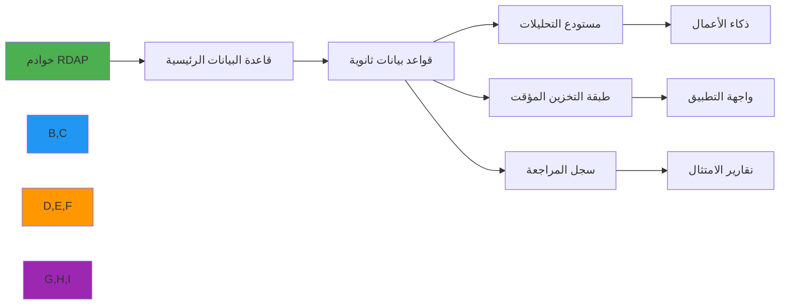

# دليل أدوات المزامنة

> **الغرض:** دليل شامل لتطبيق وإدارة أدوات مزامنة البيانات لبيانات RDAP عبر أنظمة قواعد البيانات الموزعة
> **ذو صلة:** [مخططات قواعد البيانات](schemas.md) | [المُشغِّلات](triggers.md) | [لوحة تحليلات](../../analytics/dashboard_components.md)
> **وقت القراءة:** 7 دقائق
> **نصيحة احترافية:** استخدم [أداة التحقق من المزامنة](./sync-validator.md) للتحقق التلقائي من إعدادات المزامنة

---

## لماذا تهم المزامنة لبيانات RDAP؟

تتطلب بيانات RDAP (بروتوكول الوصول إلى بيانات التسجيل) استراتيجيات مزامنة متطورة بسبب طبيعتها الموزعة ومتطلبات الامتثال والمتطلبات التشغيلية:



**متطلبات المزامنة الحرجة:**
- **الاتساق متعدد المناطق**: الحفاظ على بيانات متسقة عبر المناطق الجغرافية
- **حدود الامتثال**: عزل بيانات PII وفق متطلبات GDPR/CCPA
- **سلامة التسلسل الزمني**: الحفاظ على البيانات التاريخية للامتثال وتحليل الاتجاهات
- **حل النزاعات**: معالجة التحديثات المتزامنة من مصادر متعددة
- **كفاءة الموارد**: تقليل استخدام النطاق الترددي والمعالجة أثناء المزامنة

---

## أنماط المزامنة الأساسية

### 1. تطبيق التقاط بيانات التغيير (CDC)
```javascript
// cdc-synchronizer.js
const { DebeziumConnector } = require('rdapify-cdc');
const { RDAPClient } = require('rdapify');

class RDAPChangeSynchronizer {
  constructor(config) {
    this.client = new RDAPClient(config.client);
    this.debezium = new DebeziumConnector(config.debezium);
    this.targets = config.targets || [];
  }

  async start() {
    await this.debezium.connect({
      connector: 'postgresql',
      database: process.env.PRIMARY_DB_URL,
      tables: ['rdap_domains', 'rdap_ip_networks', 'rdap_asn_ranges'],
      slot: 'rdapify_cdc_slot'
    });

    this.debezium.on('change', async (event) => {
      await this.processChange(event);
    });

    console.log('بدأ نظام CDC للمزامنة');
  }

  async processChange(event) {
    const { table, operation, before, after } = event;

    try {
      // تطبيق التغيير على جميع الأهداف بالتوازي
      await Promise.all(
        this.targets.map(target => this.applyChange(target, { table, operation, before, after }))
      );

      // تسجيل نجاح المزامنة
      await this.logSyncEvent({
        eventId: event.id,
        table,
        operation,
        status: 'success',
        timestamp: new Date().toISOString()
      });
    } catch (error) {
      await this.handleSyncError(event, error);
    }
  }

  async applyChange(target, change) {
    const { table, operation, before, after } = change;

    switch (operation) {
      case 'INSERT':
        await target.insert(table, after);
        break;
      case 'UPDATE':
        // التحقق من تعارض الإصدار
        const current = await target.findById(table, after.id);
        if (current && current.updated_at > after.updated_at) {
          console.warn(`تعارض في المزامنة: ${table}:${after.id} - تجاهل التغيير القديم`);
          return;
        }
        await target.upsert(table, after);
        break;
      case 'DELETE':
        // التحقق من متطلبات الاحتفاظ قبل الحذف
        if (before.gdpr_compliant && before.retention_expires_at > new Date()) {
          console.warn(`منع الحذف: ${table}:${before.id} - فترة الاحتفاظ لم تنتهِ`);
          return;
        }
        await target.delete(table, before.id);
        break;
    }
  }

  async handleSyncError(event, error) {
    console.error(`فشل المزامنة للحدث ${event.id}:`, error.message);

    // إضافة إلى قائمة انتظار إعادة المحاولة
    await this.retryQueue.add({
      event,
      error: error.message,
      attempts: 0,
      nextRetryAt: new Date(Date.now() + 5000)
    });
  }
}

module.exports = RDAPChangeSynchronizer;
```

### 2. المزامنة على أساس الفارق الزمني
```javascript
// delta-sync.js
const { RDAPClient } = require('rdapify');

class DeltaSynchronizer {
  constructor(sourceDB, targetDB, options = {}) {
    this.sourceDB = sourceDB;
    this.targetDB = targetDB;
    this.batchSize = options.batchSize || 1000;
    this.parallelism = options.parallelism || 5;
    this.rdap = new RDAPClient({ privacy: true, allowPrivateIPs: false });
  }

  async syncDomains(lastSyncAt = null) {
    const startTime = new Date();
    console.log(`بدء مزامنة النطاقات منذ: ${lastSyncAt || 'البداية'}`);

    let processed = 0;
    let offset = 0;

    while (true) {
      // جلب دُفعة من التغييرات
      const batch = await this.sourceDB.query(`
        SELECT * FROM domains
        WHERE updated_at > $1
        ORDER BY updated_at ASC
        LIMIT $2 OFFSET $3
      `, [lastSyncAt || new Date(0), this.batchSize, offset]);

      if (batch.rows.length === 0) break;

      // معالجة الدُفعة بالتوازي
      const chunks = this.chunkArray(batch.rows, Math.ceil(batch.rows.length / this.parallelism));
      await Promise.all(chunks.map(chunk => this.syncChunk(chunk)));

      processed += batch.rows.length;
      offset += this.batchSize;

      console.log(`جارٍ المزامنة: ${processed} سجل...`);
    }

    const duration = Date.now() - startTime.getTime();
    console.log(`اكتملت المزامنة: ${processed} سجل في ${duration}ms`);

    return { processed, duration, syncedAt: startTime };
  }

  async syncChunk(records) {
    const operations = records.map(record => ({
      type: 'upsert',
      table: 'domains',
      data: this.stripPII(record) // إزالة PII قبل المزامنة إلى الأهداف غير المرخّصة
    }));

    await this.targetDB.bulkOperation(operations);
  }

  stripPII(record) {
    const { registrant_name, registrant_email, registrant_phone, ...safe } = record;
    return {
      ...safe,
      has_pii_data: !!(registrant_name || registrant_email || registrant_phone)
    };
  }

  chunkArray(array, size) {
    const chunks = [];
    for (let i = 0; i < array.length; i += size) {
      chunks.push(array.slice(i, i + size));
    }
    return chunks;
  }
}

module.exports = DeltaSynchronizer;
```

### 3. المزامنة في الوقت الفعلي عبر قوائم الانتظار
```javascript
// realtime-sync.js
const { RDAPClient } = require('rdapify');
const amqp = require('amqplib');

class RealtimeRDAPSynchronizer {
  constructor(config) {
    this.rdap = new RDAPClient({ privacy: true, allowPrivateIPs: false });
    this.rabbitmqUrl = config.rabbitmqUrl || process.env.RABBITMQ_URL;
    this.queues = {
      domain: 'rdap.domain.updates',
      ip: 'rdap.ip.updates',
      asn: 'rdap.asn.updates'
    };
  }

  async start() {
    const connection = await amqp.connect(this.rabbitmqUrl);
    this.channel = await connection.createChannel();

    // الإعلان عن الطوابير مع إعدادات الموثوقية
    for (const queue of Object.values(this.queues)) {
      await this.channel.assertQueue(queue, {
        durable: true,
        arguments: {
          'x-message-ttl': 86400000, // 24 ساعة
          'x-dead-letter-exchange': 'rdap.dlx'
        }
      });
    }

    // بدء الاستهلاك
    await this.channel.consume(this.queues.domain, async (msg) => {
      if (!msg) return;

      try {
        const event = JSON.parse(msg.content.toString());
        await this.processDomainUpdate(event);
        this.channel.ack(msg);
      } catch (error) {
        console.error('فشل معالجة التحديث:', error.message);
        // إعادة المحاولة 3 مرات قبل الرفض
        const retryCount = (msg.properties.headers?.retryCount || 0) + 1;
        if (retryCount < 3) {
          this.channel.nack(msg, false, true);
        } else {
          this.channel.nack(msg, false, false); // إرسال إلى DLQ
        }
      }
    });

    console.log('بدأ مستهلك المزامنة في الوقت الفعلي');
  }

  async processDomainUpdate(event) {
    const { domain, action, source } = event;

    if (action === 'refresh') {
      const fresh = await this.rdap.domain(domain);
      await this.updateTargetDatabases(domain, fresh, source);
    } else if (action === 'invalidate') {
      await this.invalidateCache(domain);
    }
  }

  async updateTargetDatabases(domain, data, source) {
    // تطبيق التحديث على جميع قواعد البيانات الهدف
    await Promise.all([
      this.updatePrimaryDB(domain, data),
      this.updateCacheLayer(domain, data),
      this.updateAnalyticsStore(domain, data, source)
    ]);
  }
}

module.exports = RealtimeRDAPSynchronizer;
```

## معالجة النزاعات

### 1. حل النزاعات القائم على الإصدار
```javascript
// conflict-resolver.js

class VersionedConflictResolver {
  async resolve(existing, incoming) {
    // آخر-كاتب-يفوز مع التحقق من الإصدار
    if (incoming.version > existing.version) {
      return { action: 'accept', data: incoming };
    }

    if (incoming.version < existing.version) {
      return { action: 'reject', reason: 'إصدار أقدم' };
    }

    // إصدار متساوٍ - دمج حقول محددة
    return {
      action: 'merge',
      data: this.mergeRecords(existing, incoming)
    };
  }

  mergeRecords(a, b) {
    return {
      ...a,
      // حقول يفوز فيها الأحدث
      status: b.status || a.status,
      nameservers: b.nameservers || a.nameservers,
      updated_at: b.updated_at > a.updated_at ? b.updated_at : a.updated_at,
      // حقول يفوز فيها الموثوق
      registration_date: a.registration_date || b.registration_date,
      expiration_date: b.expiration_date || a.expiration_date,
      // بيانات المزامنة
      sync_conflicts: [...(a.sync_conflicts || []), {
        field: 'version_conflict',
        resolvedAt: new Date().toISOString()
      }]
    };
  }
}

module.exports = VersionedConflictResolver;
```

## المراقبة والتشخيص

### 1. مقاييس المزامنة
```javascript
// sync-monitoring.js
const { Counter, Histogram, Gauge } = require('prom-client');

const syncMetrics = {
  recordsSynced: new Counter({
    name: 'rdap_sync_records_total',
    help: 'إجمالي السجلات المتزامنة',
    labelNames: ['type', 'direction', 'status']
  }),

  syncDuration: new Histogram({
    name: 'rdap_sync_duration_seconds',
    help: 'مدة دورة المزامنة',
    labelNames: ['type'],
    buckets: [0.1, 0.5, 1, 5, 10, 30, 60]
  }),

  syncLag: new Gauge({
    name: 'rdap_sync_lag_seconds',
    help: 'تأخر المزامنة بين المصدر والهدف',
    labelNames: ['target']
  }),

  conflictsResolved: new Counter({
    name: 'rdap_sync_conflicts_total',
    help: 'إجمالي نزاعات المزامنة المحلولة',
    labelNames: ['resolution_type']
  })
};

module.exports = syncMetrics;
```

## الوثائق ذات الصلة

| المستند | الوصف |
|----------|-------------|
| [مخططات قواعد البيانات](schemas.md) | تصميم المخطط |
| [المُشغِّلات](triggers.md) | المزامنة عبر Database Triggers |
| [تكامل Redis](../redis.md) | مزامنة التخزين المؤقت |
| [Kubernetes](../cloud/kubernetes.md) | النشر الموزع |

## المواصفات التقنية

| الخاصية | القيمة |
|----------|-------|
| بروتوكولات CDC | Debezium, pglogical, Maxwell |
| قوائم الانتظار | RabbitMQ, Apache Kafka, AWS SQS |
| حجم الدُفعة الافتراضي | 1000 سجل |
| إعادة المحاولة عند الفشل | 3 محاولات مع تراجع أسّي |
| حل النزاعات | آخر-كاتب-يفوز + قائم على الإصدار |
| سجل المراجعة | جميع أحداث المزامنة مسجّلة |
| متوافق مع GDPR | نعم - حذف PII قبل المزامنة |
| آخر تحديث | 5 ديسمبر 2025 |

> **تنبيه مهم**: تحقق دائماً من حذف PII قبل المزامنة إلى أي هدف غير مرخّص. طبّق مراقبة تأخر المزامنة وأنشئ تنبيهات للتأخر الكبير. راجع [دليل امتثال GDPR](../../../security/gdpr-compliance.md) لمتطلبات نقل البيانات.

[العودة إلى تكاملات قواعد البيانات](../databases/) | [التالي: المُشغِّلات](triggers.md)
