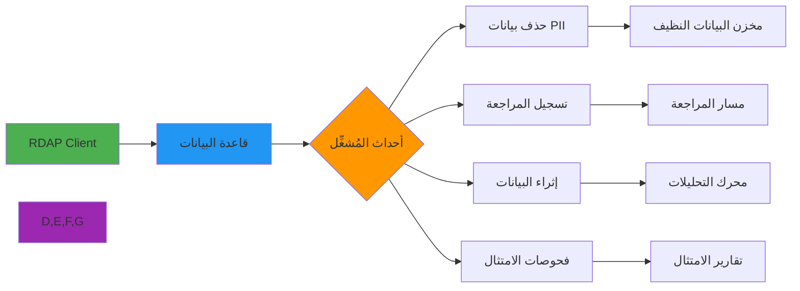

# دليل تكامل المُشغِّلات في قواعد البيانات

> **الغرض:** دليل شامل لتطبيق مُشغِّلات قواعد البيانات لمعالجة بيانات RDAP والامتثال والتحليلات الفورية
> **ذو صلة:** [مخططات قواعد البيانات](schemas.md) | [أدوات المزامنة](sync-tools.md) | [الأمان والخصوصية](../../guides/security_privacy.md)
> **وقت القراءة:** 7 دقائق
> **نصيحة احترافية:** استخدم [أداة التحقق من المُشغِّلات](./trigger-validator.md) للتحقق التلقائي من إعداداتها

---

## لماذا تهم المُشغِّلات لمعالجة بيانات RDAP؟

توفر مُشغِّلات قواعد البيانات أتمتة حرجة لسير عمل بيانات RDAP، مما يتيح المعالجة الفورية دون الحاجة إلى استقصاء من التطبيق. أهميتها تمتد عبر نطاقات متعددة:



**حالات الاستخدام الحرجة للمُشغِّلات:**
- **حذف PII التلقائي**: إخفاء هوية البيانات الشخصية فورياً قبل التخزين
- **تطبيق الامتثال**: الاحتفاظ بالبيانات وحذفها وفق GDPR/CCPA
- **إنفاذ جودة البيانات**: قواعد التحقق والتصحيح التلقائي
- **التقاط بيانات التغيير**: المزامنة الفورية مع الأنظمة الأدنى مستوى
- **تنفيذ قواعد الأعمال**: تنبيهات مراقبة النطاقات وإشعارات انتهاء الصلاحية
- **إنشاء مسار المراجعة**: سجلات غير قابلة للتغيير لتعديلات البيانات للامتثال

---

## أنماط المُشغِّلات الأساسية

### 1. مُشغِّلات حذف بيانات PII
```sql
-- PostgreSQL trigger for automatic PII redaction
CREATE OR REPLACE FUNCTION redact_pii()
RETURNS TRIGGER AS $$
BEGIN
    -- إزالة بيانات جهة اتصال المسجِّل الحساسة
    IF TG_OP = 'INSERT' OR TG_OP = 'UPDATE' THEN
        -- استبدال البريد الإلكتروني برمز مُجزَّأ
        IF NEW.registrant_email IS NOT NULL THEN
            NEW.registrant_email_hash := encode(
                sha256(NEW.registrant_email::bytea), 'hex'
            );
            NEW.registrant_email := NULL;
        END IF;

        -- إزالة معلومات الاتصال الشخصية
        IF NEW.registrant_phone IS NOT NULL THEN
            NEW.registrant_phone := NULL;
        END IF;

        -- إزالة عنوان المسجِّل
        IF NEW.registrant_address IS NOT NULL THEN
            NEW.registrant_address := NULL;
        END IF;

        -- تسجيل حذف البيانات
        INSERT INTO pii_redaction_log (
            table_name, record_id, fields_redacted, redacted_at, reason
        ) VALUES (
            TG_TABLE_NAME,
            NEW.id,
            ARRAY['registrant_email', 'registrant_phone', 'registrant_address'],
            NOW(),
            'GDPR_AUTOMATIC_REDACTION'
        );

        RETURN NEW;
    END IF;

    RETURN NULL;
END;
$$ LANGUAGE plpgsql SECURITY DEFINER;

-- تطبيق المُشغِّل على جدول النطاقات
CREATE TRIGGER trigger_redact_domain_pii
    BEFORE INSERT OR UPDATE ON domains
    FOR EACH ROW
    EXECUTE FUNCTION redact_pii();
```

### 2. مُشغِّلات تسجيل المراجعة
```sql
-- مُشغِّل تسجيل مراجعة شامل
CREATE OR REPLACE FUNCTION log_rdap_audit()
RETURNS TRIGGER AS $$
DECLARE
    v_old_data JSONB;
    v_new_data JSONB;
    v_changed_fields TEXT[];
BEGIN
    IF TG_OP = 'DELETE' THEN
        v_old_data := to_jsonb(OLD);
        v_new_data := NULL;
    ELSIF TG_OP = 'INSERT' THEN
        v_old_data := NULL;
        v_new_data := to_jsonb(NEW);
    ELSE -- UPDATE
        v_old_data := to_jsonb(OLD);
        v_new_data := to_jsonb(NEW);

        -- حساب الحقول المتغيرة
        SELECT array_agg(key)
        INTO v_changed_fields
        FROM (
            SELECT key
            FROM jsonb_each(v_new_data)
            WHERE value != (v_old_data->key)
        ) AS changed;
    END IF;

    -- إدراج سجل المراجعة
    INSERT INTO rdap_audit_log (
        table_name,
        operation,
        record_id,
        old_data,
        new_data,
        changed_fields,
        performed_by,
        performed_at,
        session_user_name
    ) VALUES (
        TG_TABLE_NAME,
        TG_OP,
        COALESCE(NEW.id, OLD.id),
        v_old_data,
        v_new_data,
        v_changed_fields,
        current_user,
        NOW(),
        session_user
    );

    RETURN COALESCE(NEW, OLD);
END;
$$ LANGUAGE plpgsql SECURITY DEFINER;

-- تطبيق مُشغِّل المراجعة على جداول متعددة
CREATE TRIGGER audit_domains
    AFTER INSERT OR UPDATE OR DELETE ON domains
    FOR EACH ROW EXECUTE FUNCTION log_rdap_audit();

CREATE TRIGGER audit_ip_networks
    AFTER INSERT OR UPDATE OR DELETE ON ip_networks
    FOR EACH ROW EXECUTE FUNCTION log_rdap_audit();

CREATE TRIGGER audit_asn_ranges
    AFTER INSERT OR UPDATE OR DELETE ON asn_ranges
    FOR EACH ROW EXECUTE FUNCTION log_rdap_audit();
```

### 3. مُشغِّلات التحقق من الامتثال
```sql
-- التحقق من امتثال GDPR عند الإدراج/التحديث
CREATE OR REPLACE FUNCTION enforce_gdpr_compliance()
RETURNS TRIGGER AS $$
BEGIN
    -- التحقق من وجود الأساس القانوني إذا كانت هناك بيانات PII
    IF (NEW.has_pii_data = true) AND (NEW.legal_basis IS NULL OR NEW.legal_basis = '') THEN
        RAISE EXCEPTION 'انتهاك GDPR: الأساس القانوني مطلوب لتخزين بيانات PII (GDPR Article 6)';
    END IF;

    -- تعيين تاريخ انتهاء الاحتفاظ إذا لم يُعيَّن
    IF NEW.retention_expires_at IS NULL THEN
        NEW.retention_expires_at := NOW() + INTERVAL '1 year';
    END IF;

    -- التحقق من أن تاريخ انتهاء الاحتفاظ ضمن حد مسموح به (5 سنوات)
    IF NEW.retention_expires_at > NOW() + INTERVAL '5 years' THEN
        RAISE EXCEPTION 'انتهاك GDPR: فترة الاحتفاظ تتجاوز الحد المسموح به البالغ 5 سنوات';
    END IF;

    RETURN NEW;
END;
$$ LANGUAGE plpgsql;

CREATE TRIGGER trigger_gdpr_compliance
    BEFORE INSERT OR UPDATE ON domains
    FOR EACH ROW EXECUTE FUNCTION enforce_gdpr_compliance();
```

### 4. مُشغِّلات التحقق من جودة البيانات
```sql
-- التحقق من جودة بيانات RDAP
CREATE OR REPLACE FUNCTION validate_rdap_data()
RETURNS TRIGGER AS $$
BEGIN
    -- التحقق من صحة صيغة النطاق
    IF TG_TABLE_NAME = 'domains' THEN
        IF NEW.domain_name !~ '^[a-zA-Z0-9]([a-zA-Z0-9-]{0,61}[a-zA-Z0-9])?(\.[a-zA-Z]{2,})+$' THEN
            RAISE EXCEPTION 'صيغة نطاق غير صالحة: %', NEW.domain_name;
        END IF;

        -- التأكد من أن تاريخ انتهاء الصلاحية بعد تاريخ التسجيل
        IF NEW.expiration_date IS NOT NULL AND NEW.registration_date IS NOT NULL THEN
            IF NEW.expiration_date <= NEW.registration_date THEN
                RAISE EXCEPTION 'بيانات غير صالحة: تاريخ انتهاء الصلاحية يجب أن يكون بعد تاريخ التسجيل';
            END IF;
        END IF;

        -- تطبيع اسم النطاق
        NEW.normalized_name := lower(trim(NEW.domain_name));
        NEW.tld := split_part(NEW.normalized_name, '.', -1);
    END IF;

    RETURN NEW;
END;
$$ LANGUAGE plpgsql;

CREATE TRIGGER trigger_validate_rdap
    BEFORE INSERT OR UPDATE ON domains
    FOR EACH ROW EXECUTE FUNCTION validate_rdap_data();
```

### 5. مُشغِّلات إبطال التخزين المؤقت
```sql
-- إبطال التخزين المؤقت عند تحديث البيانات
CREATE OR REPLACE FUNCTION invalidate_rdap_cache()
RETURNS TRIGGER AS $$
DECLARE
    v_cache_key TEXT;
BEGIN
    -- إنشاء مفتاح التخزين المؤقت بناءً على نوع الجدول
    IF TG_TABLE_NAME = 'domains' THEN
        v_cache_key := 'rdap:domain:' || COALESCE(NEW.normalized_name, OLD.normalized_name);
    ELSIF TG_TABLE_NAME = 'ip_networks' THEN
        v_cache_key := 'rdap:ip:' || COALESCE(NEW.network_address::text, OLD.network_address::text);
    ELSIF TG_TABLE_NAME = 'asn_ranges' THEN
        v_cache_key := 'rdap:asn:AS' || COALESCE(NEW.asn_number::text, OLD.asn_number::text);
    END IF;

    -- إدراج في جدول إبطال التخزين المؤقت (معالج بواسطة تطبيق Node.js)
    INSERT INTO cache_invalidation_queue (
        cache_key,
        invalidated_at,
        reason,
        table_name,
        operation
    ) VALUES (
        v_cache_key,
        NOW(),
        'DATA_UPDATED',
        TG_TABLE_NAME,
        TG_OP
    );

    RETURN COALESCE(NEW, OLD);
END;
$$ LANGUAGE plpgsql;

CREATE TRIGGER trigger_invalidate_cache
    AFTER INSERT OR UPDATE OR DELETE ON domains
    FOR EACH ROW EXECUTE FUNCTION invalidate_rdap_cache();

CREATE TRIGGER trigger_invalidate_ip_cache
    AFTER INSERT OR UPDATE OR DELETE ON ip_networks
    FOR EACH ROW EXECUTE FUNCTION invalidate_rdap_cache();
```

### 6. مُشغِّلات التنبيه بانتهاء صلاحية النطاق
```sql
-- مُشغِّل جدولة تنبيهات انتهاء الصلاحية
CREATE OR REPLACE FUNCTION schedule_expiry_alerts()
RETURNS TRIGGER AS $$
BEGIN
    IF NEW.expiration_date IS NOT NULL AND (TG_OP = 'INSERT' OR OLD.expiration_date != NEW.expiration_date) THEN
        -- حذف التنبيهات القديمة
        DELETE FROM expiry_alerts WHERE domain_id = NEW.id;

        -- جدولة تنبيهات متعددة
        INSERT INTO expiry_alerts (domain_id, alert_date, alert_type, status)
        VALUES
            (NEW.id, NEW.expiration_date - INTERVAL '90 days', '90_days', 'pending'),
            (NEW.id, NEW.expiration_date - INTERVAL '30 days', '30_days', 'pending'),
            (NEW.id, NEW.expiration_date - INTERVAL '7 days',  '7_days',  'pending'),
            (NEW.id, NEW.expiration_date - INTERVAL '1 day',   '1_day',   'pending');

        -- تجاهل التنبيهات في الماضي
        DELETE FROM expiry_alerts
        WHERE domain_id = NEW.id AND alert_date <= NOW();
    END IF;

    RETURN NEW;
END;
$$ LANGUAGE plpgsql;

CREATE TRIGGER trigger_expiry_alerts
    AFTER INSERT OR UPDATE OF expiration_date ON domains
    FOR EACH ROW EXECUTE FUNCTION schedule_expiry_alerts();
```

## إدارة المُشغِّلات وصيانتها

### 1. مراقبة أداء المُشغِّلات
```sql
-- طريقة عرض لمراقبة أداء المُشغِّلات
CREATE OR REPLACE VIEW trigger_performance AS
SELECT
    schemaname,
    tablename,
    triggername,
    tgtype,
    tgenabled
FROM pg_trigger t
JOIN pg_class c ON t.tgrelid = c.oid
JOIN pg_namespace n ON c.relnamespace = n.oid
WHERE NOT tgisinternal
ORDER BY schemaname, tablename, triggername;

-- فحص إحصائيات المُشغِّلات
SELECT
    schemaname,
    tablename,
    n_trig_dml_queries as trigger_executions,
    n_trig_todo_queries as pending_triggers
FROM pg_stat_user_tables
WHERE n_trig_dml_queries > 0
ORDER BY n_trig_dml_queries DESC;
```

### 2. تعطيل وتمكين المُشغِّلات
```sql
-- تعطيل مُشغِّلات محددة (مثلاً أثناء الاستيراد الكبير)
ALTER TABLE domains DISABLE TRIGGER trigger_redact_domain_pii;
ALTER TABLE domains DISABLE TRIGGER trigger_gdpr_compliance;

-- تعطيل جميع المُشغِّلات (للمدراء فقط)
ALTER TABLE domains DISABLE TRIGGER ALL;

-- إعادة التمكين بعد الانتهاء
ALTER TABLE domains ENABLE TRIGGER ALL;
```

## الوثائق ذات الصلة

| المستند | الوصف |
|----------|-------------|
| [مخططات قواعد البيانات](schemas.md) | تصميم الجداول |
| [أدوات المزامنة](sync-tools.md) | مزامنة البيانات |
| [امتثال GDPR](../../../security/gdpr-compliance.md) | متطلبات الامتثال |
| [تكامل Redis](../redis.md) | إبطال التخزين المؤقت |

## المواصفات التقنية

| الخاصية | القيمة |
|----------|-------|
| قواعد البيانات المدعومة | PostgreSQL 15+, MySQL 8+, MariaDB 10.6+ |
| أنواع المُشغِّلات | BEFORE, AFTER, INSTEAD OF |
| أحداث المُشغِّلات | INSERT, UPDATE, DELETE, TRUNCATE |
| مستوى المُشغِّل | FOR EACH ROW, FOR EACH STATEMENT |
| أمان SECURITY DEFINER | مدعوم لتصعيد الصلاحيات المتحكم به |
| تسجيل المراجعة | مُشغِّلات AFTER لضمان الكتابة |
| متوافق مع GDPR | نعم - حذف PII فوري |
| آخر تحديث | 5 ديسمبر 2025 |

> **تنبيه مهم**: اختبر المُشغِّلات دائماً في بيئة تطوير قبل تطبيقها في الإنتاج. المُشغِّلات التي تُخفق ستُفشل العمليات بالكامل (بما فيها عمليات INSERT المشروعة). استخدم `SECURITY DEFINER` بحذر وأعطِ الدالة أقل الصلاحيات الممكنة. راجع [توثيق PostgreSQL للمُشغِّلات](https://www.postgresql.org/docs/current/triggers.html) للمزيد.

[العودة إلى تكاملات قواعد البيانات](../databases/) | [العودة إلى التكاملات](../README.md)
