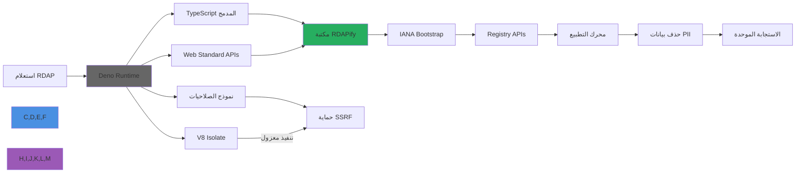

# دليل التكامل مع Deno

**الغرض**: دليل شامل لتكامل RDAPify مع بيئة تشغيل Deno لإجراء عمليات بحث آمنة عن النطاقات وعناوين IP وأرقام ASN بأداء تشغيل استثنائي ودعم TypeScript المدمج و Web Standard APIs
**ذو صلة**: [Bun](bun.md) | [Cloudflare Workers](cloudflare-workers.md) | [Docker](deployment/docker.md) | [Redis](redis.md) | [Next.js](nextjs.md)
**وقت القراءة**: 6 دقائق

## لماذا Deno لتطبيقات RDAP؟

توفر بيئة تشغيل Deno بيئة JavaScript/TypeScript مثالية لبناء تطبيقات RDAP آمنة مع المزايا الرئيسية التالية:



### مزايا تكامل Deno الرئيسية:
- **آمن بشكل افتراضي**: نموذج الأمان القائم على الصلاحيات يمنع هجمات SSRF العرضية
- **TypeScript أصلي**: لا خطوة تحويل مطلوبة - استيراد RDAPify مباشرةً في TypeScript
- **Web Standard APIs**: دعم كامل لـ Fetch API وWeb Crypto وStreams API
- **ملف تنفيذي واحد**: تحويل تطبيق RDAP إلى ملف ثنائي واحد لسهولة النشر
- **لا node_modules**: استيراد التبعيات عبر URLs مع فحص سلامة التكامل
- **أدوات مدمجة**: الاختبار والتنسيق واللين والتوثيق مدمجة

## البدء: التكامل الأساسي

### 1. التثبيت والإعداد
```bash
# تثبيت Deno (إن لم يكن مثبتاً)
curl -fsSL https://deno.land/install.sh | sh

# إنشاء مشروع جديد
mkdir rdapify-deno && cd rdapify-deno
```

### 2. مثال عملي مبسّط
```typescript
// server.ts
import { RDAPClient } from 'npm:rdapify';

// تتطلب الصلاحيات التالية عند التشغيل:
// deno run --allow-net --allow-env server.ts

const rdap = new RDAPClient({
  cache: true,
  privacy: true,
  allowPrivateIPs: false,
  validateCertificates: true,
  timeout: 5000,
  rateLimit: { max: 100, window: 60000 }
});

const handler = async (request: Request): Promise<Response> => {
  const url = new URL(request.url);

  // فحص الصحة
  if (url.pathname === '/health') {
    return Response.json({
      status: 'ok',
      runtime: 'deno',
      version: Deno.version.deno
    });
  }

  // البحث عن نطاق
  const domainMatch = url.pathname.match(/^\/api\/domain\/([^/]+)$/);
  if (domainMatch) {
    const domain = decodeURIComponent(domainMatch[1]).toLowerCase().trim();

    if (!/^[a-z0-9.-]+\.[a-z]{2,}$/.test(domain)) {
      return Response.json({ error: 'صيغة النطاق غير صالحة' }, { status: 400 });
    }

    try {
      const result = await rdap.domain(domain);
      return Response.json(result, {
        headers: { 'Cache-Control': 'public, max-age=3600' }
      });
    } catch (error: unknown) {
      const err = error as { code?: string; statusCode?: number; message?: string };

      if (err.code?.startsWith('RDAP_SECURE')) {
        return Response.json({ error: 'انتهاك سياسة الأمان' }, { status: 403 });
      }

      return Response.json(
        { error: err.message || 'فشل الاستعلام' },
        { status: err.statusCode || 500 }
      );
    }
  }

  // البحث عن IP
  const ipMatch = url.pathname.match(/^\/api\/ip\/([^/]+)$/);
  if (ipMatch) {
    const ip = decodeURIComponent(ipMatch[1]);
    try {
      const result = await rdap.ip(ip);
      return Response.json(result);
    } catch (error: unknown) {
      const err = error as { message?: string; statusCode?: number };
      return Response.json(
        { error: err.message },
        { status: err.statusCode || 500 }
      );
    }
  }

  return Response.json({ error: 'غير موجود' }, { status: 404 });
};

Deno.serve({ port: 3000 }, handler);
console.log('خادم RDAPify Deno يعمل على المنفذ 3000');
```

### 3. تكوين الصلاحيات
```json
// deno.json
{
  "tasks": {
    "start": "deno run --allow-net --allow-env --allow-read=. server.ts",
    "dev": "deno run --watch --allow-net --allow-env --allow-read=. server.ts",
    "test": "deno test --allow-net --allow-env tests/",
    "compile": "deno compile --allow-net --allow-env --output rdapify-server server.ts"
  },
  "imports": {
    "rdapify": "npm:rdapify@latest"
  },
  "lint": {
    "rules": {
      "exclude": ["no-explicit-any"]
    }
  },
  "fmt": {
    "options": {
      "lineWidth": 100,
      "indentWidth": 2,
      "singleQuote": true
    }
  }
}
```

## تعزيز الأمان والامتثال

### 1. نموذج صلاحيات Deno وحماية SSRF
```typescript
// security/permissions.ts

// صلاحيات الشبكة المحددة بدقة
// أفضل من --allow-net العامة
const allowedHosts = [
  'rdap.verisign.com',
  'rdap.arin.net',
  'rdap.ripe.net',
  'rdap.apnic.net',
  'rdap.lacnic.net',
  'rdap.afrinic.net',
  'data.iana.org'
];

// التحقق من صلاحيات الشبكة
async function checkNetworkPermission(host: string): Promise<boolean> {
  const status = await Deno.permissions.query({
    name: 'net',
    host
  });
  return status.state === 'granted';
}

// تسجيل مراجعة آمن
export function auditLog(event: {
  type: string;
  domain?: string;
  ip?: string;
  requestId: string;
  success: boolean;
}): void {
  // لا نسجل بيانات PII
  const sanitized = {
    ...event,
    timestamp: new Date().toISOString(),
    runtime: 'deno'
  };

  console.log(JSON.stringify(sanitized));
}
```

### 2. رؤوس الأمان والامتثال
```typescript
// middleware/security-headers.ts

export function addSecurityHeaders(response: Response, requestId: string): Response {
  const headers = new Headers(response.headers);

  // رؤوس الأمان
  headers.set('X-Content-Type-Options', 'nosniff');
  headers.set('X-Frame-Options', 'DENY');
  headers.set('X-XSS-Protection', '1; mode=block');
  headers.set('Strict-Transport-Security', 'max-age=31536000; includeSubDomains');
  headers.set('Referrer-Policy', 'strict-origin-when-cross-origin');

  // رؤوس الامتثال لـ GDPR/CCPA
  headers.set('X-Do-Not-Sell', 'true');
  headers.set('X-Data-Processing', 'PII redacted per GDPR Article 6(1)(f)');
  headers.set('X-Request-ID', requestId);

  return new Response(response.body, {
    status: response.status,
    statusText: response.statusText,
    headers
  });
}
```

## تحسين الأداء

### 1. التخزين المؤقت باستخدام Deno KV
```typescript
// cache/deno-kv-cache.ts
const kv = await Deno.openKv();

const CACHE_TTL_MS = {
  domain: 3600 * 1000,    // ساعة واحدة
  ip: 1800 * 1000,        // 30 دقيقة
  asn: 7200 * 1000        // ساعتان
};

export async function getCached(type: string, key: string): Promise<unknown | null> {
  const entry = await kv.get<{ data: unknown; expiresAt: number }>([type, key]);

  if (!entry.value) return null;

  if (Date.now() > entry.value.expiresAt) {
    await kv.delete([type, key]);
    return null;
  }

  return entry.value.data;
}

export async function setCached(type: string, key: string, data: unknown): Promise<void> {
  const ttl = CACHE_TTL_MS[type as keyof typeof CACHE_TTL_MS] || 3600 * 1000;

  await kv.set(
    [type, key],
    { data, expiresAt: Date.now() + ttl },
    { expireIn: ttl }
  );
}
```

### 2. المعالجة المتوازية للدُفعات
```typescript
// batch/parallel-lookup.ts
import { RDAPClient } from 'npm:rdapify';

const rdap = new RDAPClient({
  privacy: true,
  allowPrivateIPs: false,
  timeout: 5000
});

export async function batchLookup(domains: string[], concurrency = 5) {
  const results: Array<{ domain: string; data?: unknown; error?: string }> = [];

  // تقسيم إلى مجموعات للتنفيذ المتوازي
  for (let i = 0; i < domains.length; i += concurrency) {
    const batch = domains.slice(i, i + concurrency);

    const batchResults = await Promise.allSettled(
      batch.map(async (domain) => {
        const data = await rdap.domain(domain);
        return { domain, data };
      })
    );

    for (const result of batchResults) {
      if (result.status === 'fulfilled') {
        results.push(result.value);
      } else {
        const domain = batch[batchResults.indexOf(result)];
        results.push({ domain, error: result.reason.message });
      }
    }
  }

  return results;
}
```

## التحويل إلى ملف ثنائي واحد

```bash
# تحويل لـ Linux
deno compile --allow-net --allow-env --target x86_64-unknown-linux-gnu --output rdapify-linux server.ts

# تحويل لـ macOS
deno compile --allow-net --allow-env --target x86_64-apple-darwin --output rdapify-macos server.ts

# تحويل لـ Windows
deno compile --allow-net --allow-env --target x86_64-pc-windows-msvc --output rdapify-windows.exe server.ts
```

## الاختبار والتحقق

### 1. اختبارات مع Deno Test
```typescript
// tests/server_test.ts
import { assertEquals, assertMatch } from 'jsr:@std/assert';

Deno.test('يجب إرجاع استجابة صحيحة لفحص الصحة', async () => {
  const response = await fetch('http://localhost:3000/health');
  assertEquals(response.status, 200);

  const data = await response.json();
  assertEquals(data.status, 'ok');
  assertEquals(data.runtime, 'deno');
});

Deno.test('يجب رفض صيغة النطاق غير الصالحة', async () => {
  const response = await fetch('http://localhost:3000/api/domain/invalid!!domain');
  assertEquals(response.status, 400);

  const data = await response.json();
  assertMatch(data.error, /صيغة النطاق/);
});

Deno.test('يجب حظر عناوين IP الخاصة', async () => {
  const response = await fetch('http://localhost:3000/api/ip/192.168.1.1');
  assertEquals(response.status, 403);
});
```

## الوثائق ذات الصلة

| المستند | الوصف |
|----------|-------------|
| [تكامل Bun](bun.md) | بديل Node.js آخر |
| [Cloudflare Workers](cloudflare-workers.md) | الحوسبة على الحافة |
| [نشر Docker](deployment/docker.md) | نشر الحاويات |
| [نشر Serverless](deployment/serverless.md) | النشر بلا خادم |

## المواصفات التقنية

| الخاصية | القيمة |
|----------|-------|
| إصدار Deno | 1.40+ |
| دعم TypeScript | أصلي (بلا تحويل) |
| نظام الصلاحيات | دقيق (للشبكة والملفات والبيئة) |
| Deno KV | للتخزين المؤقت الدائم |
| التصدير إلى ملف ثنائي | مدعوم لجميع المنصات |
| Web APIs | Fetch, Streams, Crypto, WebSocket |
| متوافق مع GDPR | نعم مع الإعداد الصحيح |
| حماية SSRF | مدمجة + نموذج الصلاحيات |
| آخر تحديث | 5 ديسمبر 2025 |

> **تنبيه مهم**: استخدم دائماً صلاحيات الشبكة المحددة بدقة (مثل `--allow-net=rdap.verisign.com`) بدلاً من `--allow-net` الشامل في الإنتاج. يوفر نموذج صلاحيات Deno طبقة أمان إضافية لمنع هجمات SSRF.

[العودة إلى التكاملات](../README.md) | [التالي: Cloudflare Workers](cloudflare-workers.md)
