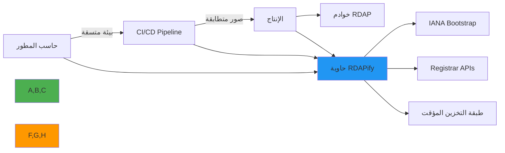

# دليل النشر باستخدام Docker

> **الغرض:** دليل شامل لنشر RDAPify في حاويات Docker لبيئات التطوير والاختبار والإنتاج
> **ذو صلة:** [Kubernetes](../cloud/kubernetes.md) | [Serverless](serverless.md) | [متغيرات البيئة](environment-vars.md)
> **وقت القراءة:** 6 دقائق

---

## لماذا Docker لتطبيقات RDAP؟

يوفر Docker منصة تحجيم مثالية لمعالجة بيانات RDAP مع عدة مزايا رئيسية:



**مزايا التحجيم الرئيسية:**
- **اتساق البيئة**: بيئات متطابقة من التطوير إلى الإنتاج
- **عزل التبعيات**: بيئة RDAPify مكتفية ذاتياً مع جميع التبعيات
- **قيود الموارد**: تحكم دقيق في CPU والذاكرة والشبكة
- **حدود الأمان**: عزل قوي بين معالجة RDAP ونظام المضيف
- **قابلية التوسع**: توسع أفقي سهل لعمليات RDAP كثيفة الحجم

---

## البدء: إعداد Docker الأساسي

### 1. Dockerfile لبيئة التطوير
```dockerfile
# Dockerfile.dev
FROM node:20-slim AS base

# Set working directory
WORKDIR /app

# Copy package files
COPY package*.json ./
RUN npm ci && npm cache clean --force

COPY . .

ENV NODE_ENV=development
ENV PORT=3000

EXPOSE 3000

CMD ["npm", "run", "dev"]
```

### 2. Dockerfile للإنتاج (متعدد المراحل)
```dockerfile
# Dockerfile
FROM node:20-slim AS builder

WORKDIR /app
COPY package*.json ./
RUN npm ci --only=production && npm cache clean --force
COPY . .
RUN npm run build

# ---
FROM node:20-slim AS production

WORKDIR /app

# إنشاء مستخدم غير مميّز
RUN groupadd -r rdapify && useradd -r -g rdapify -s /bin/false rdapify

# نسخ التطبيق المبني فقط
COPY --from=builder /app/dist ./dist
COPY --from=builder /app/node_modules ./node_modules
COPY --from=builder /app/package.json .

# تعيين ملكية الملفات
RUN chown -R rdapify:rdapify /app
USER rdapify

ENV NODE_ENV=production
ENV PORT=3000

EXPOSE 3000

HEALTHCHECK --interval=30s --timeout=10s --start-period=5s --retries=3 \
    CMD node -e "require('http').get('http://localhost:3000/health', (r) => process.exit(r.statusCode === 200 ? 0 : 1))"

CMD ["node", "dist/server.js"]
```

### 3. Docker Compose للتطوير المحلي
```yaml
# docker-compose.yml
version: '3.8'

services:
  rdapify:
    build:
      context: .
      dockerfile: Dockerfile.dev
    ports:
      - "3000:3000"
    environment:
      - NODE_ENV=development
      - RDAP_PRIVACY=true
      - RDAP_BLOCK_PRIVATE_IPS=true
      - REDIS_HOST=redis
      - REDIS_PORT=6379
    volumes:
      - ./src:/app/src
      - ./tests:/app/tests
      - /app/node_modules
    depends_on:
      redis:
        condition: service_healthy
    networks:
      - rdapify-network
    restart: unless-stopped

  redis:
    image: redis:7-alpine
    ports:
      - "6379:6379"
    command: redis-server --maxmemory 256mb --maxmemory-policy allkeys-lru
    healthcheck:
      test: ["CMD", "redis-cli", "ping"]
      interval: 10s
      timeout: 5s
      retries: 5
    networks:
      - rdapify-network
    volumes:
      - redis-data:/data

networks:
  rdapify-network:
    driver: bridge

volumes:
  redis-data:
```

### 4. Docker Compose للإنتاج
```yaml
# docker-compose.prod.yml
version: '3.8'

services:
  rdapify:
    image: registry.example.com/rdapify:${VERSION:-latest}
    deploy:
      replicas: 3
      update_config:
        parallelism: 1
        delay: 10s
        order: start-first
      restart_policy:
        condition: on-failure
        delay: 5s
        max_attempts: 3
        window: 120s
      resources:
        limits:
          memory: 512M
          cpus: '0.5'
        reservations:
          memory: 256M
          cpus: '0.25'
    environment:
      - NODE_ENV=production
      - RDAP_PRIVACY=true
      - RDAP_BLOCK_PRIVATE_IPS=true
      - RDAP_TLS_MIN_VERSION=TLSv1.3
      - REDIS_HOST=redis
      - REDIS_PASSWORD_FILE=/run/secrets/redis_password
    secrets:
      - redis_password
    healthcheck:
      test: ["CMD", "node", "health-check.js"]
      interval: 30s
      timeout: 10s
      retries: 3
      start_period: 40s
    networks:
      - rdapify-network
    logging:
      driver: "json-file"
      options:
        max-size: "50m"
        max-file: "10"

  redis:
    image: redis:7-alpine
    command: >
      redis-server
      --requirepass-file /run/secrets/redis_password
      --maxmemory 1gb
      --maxmemory-policy allkeys-lru
      --save 900 1
      --save 300 10
      --appendonly yes
    secrets:
      - redis_password
    volumes:
      - redis-data:/data
    networks:
      - rdapify-network
    deploy:
      resources:
        limits:
          memory: 1G

  nginx:
    image: nginx:alpine
    ports:
      - "80:80"
      - "443:443"
    volumes:
      - ./nginx/nginx.conf:/etc/nginx/nginx.conf:ro
      - ./nginx/ssl:/etc/nginx/ssl:ro
    depends_on:
      - rdapify
    networks:
      - rdapify-network

secrets:
  redis_password:
    external: true

networks:
  rdapify-network:
    driver: overlay
    encrypted: true

volumes:
  redis-data:
    driver: local
```

## تحسين الأداء

### 1. تحسين طبقات Docker
```dockerfile
# Dockerfile.optimized
FROM node:20-slim AS deps

WORKDIR /app

# نسخ ملفات التبعيات أولاً للاستفادة من التخزين المؤقت للطبقات
COPY package*.json ./
RUN npm ci --only=production \
    && npm cache clean --force \
    # إزالة الأدوات غير الضرورية
    && find /app/node_modules -name "*.md" -delete \
    && find /app/node_modules -name "*.ts" -not -name "*.d.ts" -delete \
    && find /app/node_modules -name "test" -type d -exec rm -rf {} + 2>/dev/null || true

FROM node:20-slim AS runner

WORKDIR /app

# نسخ التبعيات المحسّنة فقط
COPY --from=deps /app/node_modules ./node_modules
COPY dist/ ./dist/
COPY package.json .

RUN groupadd -r rdapify && useradd -r -g rdapify rdapify \
    && chown -R rdapify:rdapify /app

USER rdapify

CMD ["node", "dist/server.js"]
```

### 2. إعداد الشبكة وDNS
```yaml
# docker-compose.dns.yml - إعداد DNS مخصص لخوادم RDAP
services:
  rdapify:
    # ...
    dns:
      - 8.8.8.8
      - 1.1.1.1
    dns_search:
      - []
    sysctls:
      net.core.somaxconn: 1024
      net.ipv4.tcp_keepalive_time: 60
```

## نصوص النشر

### 1. نص النشر الكامل
```bash
#!/bin/bash
# deploy.sh

set -euo pipefail

VERSION=${1:-latest}
REGISTRY=${REGISTRY:-registry.example.com}
IMAGE="$REGISTRY/rdapify:$VERSION"

echo "نشر RDAPify $VERSION..."

# بناء الصورة
docker build \
  --build-arg VERSION=$VERSION \
  --build-arg BUILD_DATE=$(date -u +%Y-%m-%dT%H:%M:%SZ) \
  -t $IMAGE \
  -f Dockerfile .

# فحص الأمان
echo "فحص أمان الصورة..."
docker scout cve $IMAGE --exit-code --only-severity high,critical

# رفع الصورة
docker push $IMAGE

# النشر
echo "تطبيق الإعداد الجديد..."
docker stack deploy \
  -c docker-compose.prod.yml \
  --with-registry-auth \
  rdapify

# انتظار اكتمال النشر
echo "انتظار نشر الخدمات..."
docker stack services rdapify

echo "اكتمل النشر بنجاح!"
```

### 2. التراجع السريع
```bash
#!/bin/bash
# rollback.sh

PREVIOUS_VERSION=${1:-}

if [ -z "$PREVIOUS_VERSION" ]; then
    echo "الاستخدام: ./rollback.sh <الإصدار-السابق>"
    exit 1
fi

echo "التراجع إلى إصدار $PREVIOUS_VERSION..."

docker service update \
  --image registry.example.com/rdapify:$PREVIOUS_VERSION \
  rdapify_rdapify

echo "اكتمل التراجع!"
```

## استكشاف المشكلات الشائعة وإصلاحها

### 1. مشكلات الذاكرة
**الأعراض**: `OOMKilled` أو ارتفاع مستمر في استخدام الذاكرة

```bash
# فحص إحصائيات الحاوية
docker stats rdapify --no-stream

# فحص أحداث OOM
docker events --filter type=container --filter event=oom

# زيادة حد الذاكرة
docker service update --limit-memory 768M rdapify_rdapify
```

### 2. فشل فحص الصحة
**الأعراض**: الحاوية في حالة `unhealthy`

```bash
# فحص نتيجة فحص الصحة
docker inspect rdapify_container --format '{{json .State.Health}}'

# اختبار يدوي لنقطة نهاية الصحة
docker exec rdapify_container curl -s http://localhost:3000/health

# فحص السجلات
docker logs rdapify_container --tail 100
```

## الوثائق ذات الصلة

| المستند | الوصف |
|----------|-------------|
| [Kubernetes](../cloud/kubernetes.md) | تنسيق الحاويات |
| [متغيرات البيئة](environment-vars.md) | الإعداد عبر البيئة |
| [Serverless](serverless.md) | النشر بلا خادم |
| [تكامل Redis](../redis.md) | التخزين المؤقت |

## المواصفات التقنية

| الخاصية | القيمة |
|----------|-------|
| صورة Docker الأساسية | node:20-slim |
| الذاكرة الموصى بها | 256MB - 512MB |
| CPU الموصى به | 0.25 - 0.5 vCPU |
| منفذ التطبيق | 3000 |
| تشغيل بمستخدم غير مميّز | نعم (rdapify:rdapify) |
| نظام ملفات للقراءة فقط | مدعوم |
| فحص الصحة | HTTP GET /health |
| متوافق مع GDPR | نعم |
| حماية SSRF | مدمجة |
| آخر تحديث | 5 ديسمبر 2025 |

> **تنبيه مهم**: لا تشغّل حاويات Docker بصلاحيات root في الإنتاج. استخدم دائماً Docker secrets لتخزين البيانات الحساسة (كلمات المرور والمفاتيح). افحص صور الحاويات بانتظام بحثاً عن الثغرات الأمنية قبل النشر.

[العودة إلى تكاملات النشر](../deployment/) | [التالي: متغيرات البيئة](environment-vars.md)
