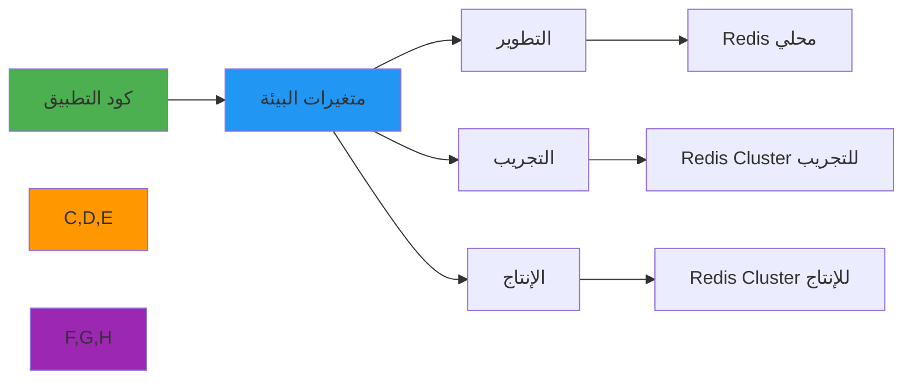

# دليل إعداد متغيرات البيئة

> **الغرض:** دليل شامل لإعداد RDAPify من خلال متغيرات البيئة لجميع بيئات النشر
> **ذو صلة:** [Docker](docker.md) | [Serverless](serverless.md) | [Kubernetes](../cloud/kubernetes.md) | [أفضل ممارسات الأمان](../../guides/security_privacy.md)
> **وقت القراءة:** 6 دقائق

---

## لماذا تهم متغيرات البيئة لتطبيقات RDAP؟

توفر متغيرات البيئة طريقة آمنة ومرنة لإعداد RDAPify عبر بيئات النشر المختلفة دون تغيير الكود:



**المزايا الرئيسية للإعداد عبر البيئة:**
- **الأمان**: إبقاء الأسرار خارج مستودعات الكود والتحكم في الإصدار
- **عزل البيئات**: إعدادات مختلفة لبيئات dev/staging/prod
- **الامتثال**: تطبيق متطلبات GDPR/CCPA من خلال الإعداد
- **المرونة التشغيلية**: تغيير السلوك دون إعادة نشر الكود
- **تدوير الأسرار**: تحديث بيانات الاعتماد دون إعادة تشغيل التطبيق

---

## متغيرات البيئة الأساسية

### 1. إعداد الأمان والامتثال
```bash
# إعدادات الأمان المطلوبة
RDAP_REDACT_PII=true                  # الافتراضي: true - حذف المعلومات الشخصية
RDAP_BLOCK_PRIVATE_IPS=true           # الافتراضي: true - حظر نطاقات IP الداخلية
RDAP_BLOCK_CLOUD_METADATA=true        # الافتراضي: true - حظر نقاط نهاية بيانات السحابة الوصفية
RDAP_TLS_MIN_VERSION=TLSv1.3          # الافتراضي: TLSv1.3 - الحد الأدنى لإصدار TLS

# امتثال GDPR/CCPA
GDPR_ENABLED=true                     # تفعيل ميزات امتثال GDPR
GDPR_RETENTION_DAYS=30                # فترة الاحتفاظ الافتراضية بالأيام
CCPA_OPT_OUT_ENABLED=true             # تفعيل دعم رفض CCPA
DATA_PROCESSING_LEGAL_BASIS=legitimate_interest  # الأساس القانوني للمعالجة

# إعدادات التحقق من الشهادات
RDAP_VALIDATE_CERTS=true              # الافتراضي: true - التحقق من شهادات TLS
RDAP_CA_BUNDLE=/etc/ssl/certs/ca-certificates.crt  # مسار حزمة CA مخصصة
```

### 2. إعداد التخزين المؤقت
```bash
# الإعداد الأساسي للتخزين المؤقت
RDAP_CACHE_ENABLED=true               # الافتراضي: true - تفعيل التخزين المؤقت
RDAP_CACHE_TYPE=redis                 # الخيارات: memory | redis | none
RDAP_CACHE_TTL=3600                   # مدة بقاء التخزين المؤقت بالثواني (الافتراضي: 1 ساعة)
RDAP_CACHE_MAX_ENTRIES=10000          # الحد الأقصى للإدخالات (للتخزين في الذاكرة)

# إعداد Redis
REDIS_HOST=localhost                  # مضيف Redis
REDIS_PORT=6379                       # منفذ Redis
REDIS_PASSWORD=                       # كلمة مرور Redis (موصى بها في الإنتاج)
REDIS_DB=0                            # رقم قاعدة بيانات Redis
REDIS_TLS=false                       # تفعيل TLS لـ Redis (موصى به في الإنتاج)
REDIS_KEY_PREFIX=rdap:                # بادئة مفاتيح Redis
REDIS_CLUSTER_NODES=                  # عقد Redis Cluster (مفصولة بفاصلة)
REDIS_SENTINEL_HOSTS=                 # مضيفات Redis Sentinel (للتوافر العالي)
REDIS_SENTINEL_MASTER=rdapify-master  # اسم Redis Sentinel Master
```

### 3. إعداد الأداء وتحديد معدل الطلبات
```bash
# إعداد مهلة الاتصال
RDAP_TIMEOUT=5000                     # المهلة الكلية بالميلي ثانية
RDAP_CONNECT_TIMEOUT=3000             # مهلة الاتصال بالميلي ثانية
RDAP_READ_TIMEOUT=8000                # مهلة القراءة بالميلي ثانية

# تجميع الاتصالات
RDAP_MAX_CONNECTIONS=100              # أقصى عدد اتصالات لكل خادم
RDAP_KEEP_ALIVE_TIMEOUT=30000         # مهلة الاتصال المستمر بالميلي ثانية
RDAP_IDLE_TIMEOUT=30000               # مهلة الاتصال الخامل بالميلي ثانية

# تحديد معدل الطلبات
RDAP_RATE_LIMIT_ENABLED=true          # الافتراضي: true
RDAP_RATE_LIMIT_MAX=100               # الحد الأقصى للطلبات لكل نافذة
RDAP_RATE_LIMIT_WINDOW=60000          # نافذة التحديد بالميلي ثانية

# إعدادات إعادة المحاولة
RDAP_RETRY_ENABLED=true               # تفعيل إعادة المحاولة التلقائية
RDAP_RETRY_MAX_ATTEMPTS=3             # الحد الأقصى لمحاولات إعادة المحاولة
RDAP_RETRY_DELAY=100                  # التأخير الأولي بالميلي ثانية
RDAP_RETRY_BACKOFF=exponential        # الخيارات: linear | exponential | fixed
```

### 4. إعداد التسجيل والمراقبة
```bash
# إعداد التسجيل
LOG_LEVEL=info                        # الخيارات: error | warn | info | debug | trace
LOG_FORMAT=json                       # الخيارات: json | text | pretty
LOG_INCLUDE_TIMESTAMPS=true           # تضمين الطوابع الزمنية في السجلات
LOG_INCLUDE_REQUEST_ID=true           # تضمين معرّف الطلب في كل سطر
LOG_REDACT_PATTERNS=email,phone,address  # أنماط لتعقيمها من السجلات

# تسجيل المراجعة
AUDIT_LOG_ENABLED=true                # تفعيل تسجيل المراجعة
AUDIT_LOG_DESTINATION=stdout          # الخيارات: stdout | file | database
AUDIT_LOG_FILE=/var/log/rdapify/audit.log  # مسار ملف المراجعة (إذا كان destination=file)
AUDIT_LOG_INCLUDE_PII=false           # لا تسجّل بيانات PII أبداً في الإنتاج

# المراقبة
METRICS_ENABLED=true                  # تفعيل جمع المقاييس
METRICS_PORT=9090                     # منفذ مقاييس Prometheus
METRICS_PATH=/metrics                 # مسار نقطة نهاية المقاييس
DATADOG_ENABLED=false                 # تكامل Datadog
DATADOG_API_KEY=                      # مفتاح Datadog API
NEW_RELIC_ENABLED=false               # تكامل New Relic
NEW_RELIC_LICENSE_KEY=                # مفتاح ترخيص New Relic
```

### 5. إعداد التطبيق
```bash
# إعدادات الخادم
PORT=3000                             # منفذ الخادم
HOST=0.0.0.0                          # عنوان الاستماع
NODE_ENV=production                   # الخيارات: development | staging | production

# إعدادات CORS
ALLOWED_ORIGINS=https://app.example.com,https://api.example.com
CORS_MAX_AGE=86400                    # وقت تخزين مؤقت لـ CORS preflight بالثواني

# إعدادات الأمان
REQUEST_ID_HEADER=X-Request-ID        # اسم رأس معرّف الطلب
TRUST_PROXY=true                      # الثقة بـ proxy headers (للنشر خلف load balancer)
BODY_SIZE_LIMIT=10kb                  # الحد الأقصى لحجم جسم الطلب
```

## ملفات .env حسب البيئة

### 1. بيئة التطوير
```bash
# .env.development
NODE_ENV=development
PORT=3000
LOG_LEVEL=debug
LOG_FORMAT=pretty

# الأمان (تخفيف في التطوير فقط)
RDAP_REDACT_PII=true
RDAP_BLOCK_PRIVATE_IPS=true
RDAP_VALIDATE_CERTS=true

# التخزين المؤقت
RDAP_CACHE_TYPE=memory
RDAP_CACHE_TTL=60

# لا حاجة إلى Redis في التطوير
```

### 2. بيئة الإنتاج
```bash
# .env.production
NODE_ENV=production
PORT=3000
LOG_LEVEL=warn
LOG_FORMAT=json

# الأمان (الإعدادات الصارمة للإنتاج)
RDAP_REDACT_PII=true
RDAP_BLOCK_PRIVATE_IPS=true
RDAP_BLOCK_CLOUD_METADATA=true
RDAP_VALIDATE_CERTS=true
RDAP_TLS_MIN_VERSION=TLSv1.3

# GDPR
GDPR_ENABLED=true
GDPR_RETENTION_DAYS=30

# Redis (يُحمَّل من Secrets Manager)
RDAP_CACHE_TYPE=redis
REDIS_TLS=true

# الأداء
RDAP_TIMEOUT=10000
RDAP_RATE_LIMIT_MAX=100
```

## إدارة الأسرار

### 1. AWS Secrets Manager
```javascript
// secrets/aws-secrets.js
const { SecretsManagerClient, GetSecretValueCommand } = require('@aws-sdk/client-secrets-manager');

const client = new SecretsManagerClient({ region: process.env.AWS_REGION });

async function loadSecrets() {
  const secretName = process.env.AWS_SECRET_NAME || 'rdapify/production';

  try {
    const response = await client.send(
      new GetSecretValueCommand({ SecretId: secretName })
    );

    const secrets = JSON.parse(response.SecretString);

    // تعيين متغيرات البيئة من الأسرار
    process.env.REDIS_PASSWORD = secrets.redis_password;
    process.env.API_SECRET_KEY = secrets.api_secret_key;

    console.log('تم تحميل الأسرار من AWS Secrets Manager');
  } catch (error) {
    console.error('فشل تحميل الأسرار:', error.message);
    throw error;
  }
}

module.exports = { loadSecrets };
```

### 2. HashiCorp Vault
```javascript
// secrets/vault-secrets.js
const vault = require('node-vault');

const client = vault({
  endpoint: process.env.VAULT_ADDR || 'https://vault.example.com',
  token: process.env.VAULT_TOKEN
});

async function loadVaultSecrets() {
  try {
    const { data } = await client.read('secret/data/rdapify/production');

    process.env.REDIS_PASSWORD = data.data.redis_password;
    process.env.RDAP_ENCRYPTION_KEY = data.data.encryption_key;

    console.log('تم تحميل الأسرار من HashiCorp Vault');
  } catch (error) {
    console.error('فشل الاتصال بـ Vault:', error.message);
    throw error;
  }
}

module.exports = { loadVaultSecrets };
```

## التحقق من متغيرات البيئة

### 1. التحقق عند بدء التشغيل
```javascript
// config/env-validator.js
const required = {
  production: [
    'NODE_ENV',
    'REDIS_HOST',
    'REDIS_PASSWORD',
    'RDAP_REDACT_PII',
    'RDAP_BLOCK_PRIVATE_IPS'
  ],
  staging: [
    'NODE_ENV',
    'REDIS_HOST',
    'RDAP_REDACT_PII'
  ],
  development: [
    'NODE_ENV'
  ]
};

function validateEnv() {
  const env = process.env.NODE_ENV || 'development';
  const requiredVars = required[env] || required.development;
  const missing = requiredVars.filter(varName => !process.env[varName]);

  if (missing.length > 0) {
    const message = `متغيرات البيئة المطلوبة غير موجودة: ${missing.join(', ')}`;
    console.error(message);
    process.exit(1);
  }

  // التحقق من القيم الأمنية
  if (process.env.RDAP_REDACT_PII === 'false' && env === 'production') {
    console.error('خطأ أمني: لا يمكن تعطيل RDAP_REDACT_PII في الإنتاج');
    process.exit(1);
  }

  if (process.env.RDAP_BLOCK_PRIVATE_IPS === 'false' && env === 'production') {
    console.error('خطأ أمني: لا يمكن تعطيل RDAP_BLOCK_PRIVATE_IPS في الإنتاج');
    process.exit(1);
  }

  console.log(`تم التحقق من متغيرات البيئة لبيئة: ${env}`);
}

module.exports = { validateEnv };
```

## الوثائق ذات الصلة

| المستند | الوصف |
|----------|-------------|
| [Docker](docker.md) | متغيرات البيئة في حاويات Docker |
| [Serverless](serverless.md) | الإعداد في البيئات بلا خادم |
| [Kubernetes](../cloud/kubernetes.md) | ConfigMaps وSecrets في Kubernetes |
| [أفضل ممارسات الأمان](../../guides/security_privacy.md) | توجيهات الأمان |

## المواصفات التقنية

| الخاصية | القيمة |
|----------|-------|
| الأسرار الحساسة | يجب تحميلها من Secrets Manager |
| ملفات .env | للتطوير فقط، لا تُضمَّن في الصور |
| التحقق | يتم عند بدء التشغيل |
| متغيرات الأمان الحرجة | لا يمكن تعطيلها في الإنتاج |
| تدوير الأسرار | مدعوم دون إعادة نشر |
| تشفير | يُوصى بـ TLS لجميع الاتصالات في الإنتاج |
| متوافق مع GDPR | نعم |
| آخر تحديث | 5 ديسمبر 2025 |

> **تنبيه حرج**: لا تُدرج ملفات .env أو الأسرار أبداً في صور Docker أو مستودعات Git. استخدم إدارة الأسرار المناسبة (AWS Secrets Manager، HashiCorp Vault، Azure Key Vault) في الإنتاج. تحقق من وجود جميع متغيرات الأمان الحرجة (`RDAP_REDACT_PII=true`, `RDAP_BLOCK_PRIVATE_IPS=true`) عند بدء التشغيل.

[العودة إلى تكاملات النشر](../deployment/) | [التالي: Serverless](serverless.md)
