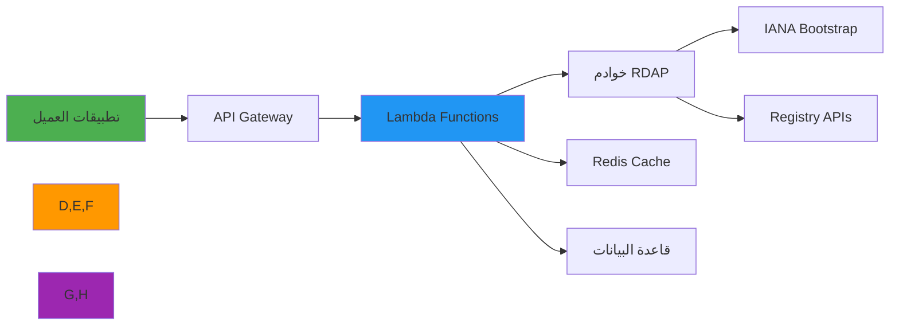

# دليل النشر Serverless

> **الغرض:** دليل شامل لنشر RDAPify في بيئات serverless لعمليات RDAP قابلة للتوسع وفعّالة من حيث التكلفة
> **ذو صلة:** [Docker](docker.md) | [Kubernetes](../cloud/kubernetes.md) | [Cloud Functions](../cloud/)
> **وقت القراءة:** 7 دقائق

---

## لماذا Serverless لتطبيقات RDAP؟

تتيح الحوسبة Serverless منصة مثالية لأحمال عمل معالجة بيانات RDAP مع مزايا فريدة عديدة:



**مزايا Serverless الرئيسية:**
- **التوسع التلقائي**: معالجة موجات استعلامات RDAP دون تخطيط مسبق للسعة
- **كفاءة التكلفة**: الدفع فقط عن وقت معالجة الاستعلامات الفعلي
- **إدارة البنية التحتية**: لا تصحيح للخوادم ولا إدارة للسعة
- **النشر العالمي**: النشر عبر مناطق بوصول منخفض الزمن
- **البنية المحركة بالأحداث**: مثالية للمراقبة والمهام المجدوَلة
- **المراقبة المدمجة**: تكامل مع أدوات المراقبة السحابية الأصيلة

---

## أنماط النشر الأساسية

### 1. AWS Lambda مع API Gateway
```yaml
# serverless.yml
service: rdapify-service

provider:
  name: aws
  runtime: nodejs20.x
  stage: ${opt:stage, 'dev'}
  region: us-east-1
  memorySize: 512
  timeout: 30
  environment:
    NODE_ENV: ${self:provider.stage}
    RDAP_PRIVACY: 'true'
    RDAP_BLOCK_PRIVATE_IPS: 'true'
    RDAP_CACHE_TYPE: redis
    REDIS_HOST: !GetAtt ElastiCacheCluster.RedisEndpoint.Address
  iam:
    role:
      statements:
        - Effect: Allow
          Action:
            - logs:CreateLogGroup
            - logs:CreateLogStream
            - logs:PutLogEvents
          Resource: arn:aws:logs:*:*:*
        - Effect: Allow
          Action:
            - elasticache:Connect
          Resource: '*'

functions:
  domainLookup:
    handler: src/handlers/domain.handler
    events:
      - http:
          path: /api/domain/{domain}
          method: GET
          cors: true
          request:
            parameters:
              paths:
                domain: true
    layers:
      - !Ref RdapifyLayerLambdaLayer

  ipLookup:
    handler: src/handlers/ip.handler
    events:
      - http:
          path: /api/ip/{ip}
          method: GET
          cors: true

  asnLookup:
    handler: src/handlers/asn.handler
    events:
      - http:
          path: /api/asn/{asn}
          method: GET
          cors: true

  # مهمة مجدوَلة لتسخين التخزين المؤقت
  cacheWarmer:
    handler: src/handlers/cache-warmer.handler
    events:
      - schedule:
          rate: rate(5 minutes)
          enabled: true
          input:
            domains:
              - example.com
              - google.com

layers:
  RdapifyLayer:
    path: layer
    name: rdapify-layer
    description: RDAPify node_modules layer
    compatibleRuntimes:
      - nodejs20.x

plugins:
  - serverless-bundle
  - serverless-offline
  - serverless-plugin-warmup

resources:
  Resources:
    ElastiCacheCluster:
      Type: AWS::ElastiCache::CacheCluster
      Properties:
        CacheNodeType: cache.t3.micro
        Engine: redis
        NumCacheNodes: 1

    ApiGatewayUsagePlan:
      Type: AWS::ApiGateway::UsagePlan
      Properties:
        Throttle:
          BurstLimit: 200
          RateLimit: 100
        Quota:
          Limit: 50000
          Period: DAY
```

### 2. معالجات الدوال
```javascript
// src/handlers/domain.js
const { RDAPClient } = require('rdapify');
const { getCached, setCached } = require('../cache/redis');

let rdapClient;

function getClient() {
  if (!rdapClient) {
    rdapClient = new RDAPClient({
      cache: false, // نستخدم Redis يدوياً
      privacy: process.env.RDAP_PRIVACY !== 'false',
      allowPrivateIPs: false,
      validateCertificates: true,
      timeout: parseInt(process.env.RDAP_TIMEOUT || '10000')
    });
  }
  return rdapClient;
}

const headers = {
  'Content-Type': 'application/json',
  'X-Content-Type-Options': 'nosniff',
  'X-Frame-Options': 'DENY',
  'X-Do-Not-Sell': 'true',
  'X-Data-Processing': 'PII redacted per GDPR Article 6(1)(f)'
};

module.exports.handler = async (event) => {
  const requestId = event.requestContext?.requestId || crypto.randomUUID();
  const domain = event.pathParameters?.domain?.toLowerCase().trim();

  if (!domain || !/^[a-z0-9.-]+\.[a-z]{2,}$/.test(domain)) {
    return {
      statusCode: 400,
      headers: { ...headers, 'X-Request-ID': requestId },
      body: JSON.stringify({ error: 'صيغة النطاق غير صالحة' })
    };
  }

  try {
    // التحقق من التخزين المؤقت
    const cached = await getCached(`domain:${domain}`);
    if (cached) {
      return {
        statusCode: 200,
        headers: {
          ...headers,
          'X-Request-ID': requestId,
          'X-Cache': 'HIT',
          'Cache-Control': 'public, max-age=3600'
        },
        body: JSON.stringify(cached)
      };
    }

    // استعلام RDAP
    const client = getClient();
    const result = await client.domain(domain);

    // تخزين النتيجة
    await setCached(`domain:${domain}`, result, 3600);

    return {
      statusCode: 200,
      headers: {
        ...headers,
        'X-Request-ID': requestId,
        'X-Cache': 'MISS',
        'Cache-Control': 'public, max-age=3600'
      },
      body: JSON.stringify(result)
    };

  } catch (error) {
    if (error.code?.startsWith('RDAP_SECURE')) {
      return {
        statusCode: 403,
        headers: { ...headers, 'X-Request-ID': requestId },
        body: JSON.stringify({ error: 'انتهاك سياسة الأمان', requestId })
      };
    }

    return {
      statusCode: error.statusCode || 500,
      headers: { ...headers, 'X-Request-ID': requestId },
      body: JSON.stringify({ error: error.message || 'خطأ داخلي', requestId })
    };
  }
};
```

### 3. Google Cloud Functions
```javascript
// functions/rdap-domain/index.js
const functions = require('@google-cloud/functions-framework');
const { RDAPClient } = require('rdapify');

let rdapClient;

functions.http('rdapDomain', async (req, res) => {
  // رؤوس الأمان
  res.set('X-Content-Type-Options', 'nosniff');
  res.set('X-Frame-Options', 'DENY');
  res.set('X-Do-Not-Sell', 'true');

  if (req.method !== 'GET') {
    return res.status(405).json({ error: 'الطريقة غير مسموح بها' });
  }

  const domain = req.params[0]?.toLowerCase().trim();

  if (!domain || !/^[a-z0-9.-]+\.[a-z]{2,}$/.test(domain)) {
    return res.status(400).json({ error: 'صيغة النطاق غير صالحة' });
  }

  if (!rdapClient) {
    rdapClient = new RDAPClient({
      cache: true,
      privacy: true,
      allowPrivateIPs: false,
      timeout: 10000
    });
  }

  try {
    const result = await rdapClient.domain(domain);
    res.set('Cache-Control', 'public, max-age=3600');
    res.json(result);
  } catch (error) {
    if (error.code?.startsWith('RDAP_SECURE')) {
      return res.status(403).json({ error: 'انتهاك سياسة الأمان' });
    }
    res.status(error.statusCode || 500).json({ error: error.message });
  }
});
```

### 4. Azure Functions (Serverless Framework)
```yaml
# serverless-azure.yml
service: rdapify-azure

provider:
  name: azure
  region: East US
  runtime: nodejs20

plugins:
  - serverless-azure-functions

functions:
  domainLookup:
    handler: src/handlers/domain.handler
    events:
      - http:
          path: api/domain/{domain}
          methods:
            - GET
          authLevel: function
```

## تحسين الأداء

### 1. التخزين المؤقت المشترك بين الاستدعاءات
```javascript
// cache/lambda-cache.js

// الذاكرة المشتركة عبر الاستدعاءات الدافئة
const localCache = new Map();
const CACHE_TTL = 5 * 60 * 1000; // 5 دقائق للتخزين المحلي

module.exports.getLocal = (key) => {
  const entry = localCache.get(key);
  if (!entry) return null;

  if (Date.now() > entry.expiresAt) {
    localCache.delete(key);
    return null;
  }

  return entry.value;
};

module.exports.setLocal = (key, value, ttlMs = CACHE_TTL) => {
  localCache.set(key, {
    value,
    expiresAt: Date.now() + ttlMs
  });

  // تنظيف التخزين المؤقت إذا أصبح كبيراً جداً
  if (localCache.size > 1000) {
    const now = Date.now();
    for (const [k, v] of localCache.entries()) {
      if (now > v.expiresAt) localCache.delete(k);
    }
  }
};
```

### 2. إدارة البداية الباردة
```javascript
// warmup/handler.js
const { RDAPClient } = require('rdapify');

// تسخين مسبق عند الاستدعاءات الباردة
let isWarmed = false;
let rdapClient;

async function warmup() {
  if (isWarmed) return;

  rdapClient = new RDAPClient({
    cache: true,
    privacy: true,
    allowPrivateIPs: false
  });

  // استعلام تجريبي لتسخين الاتصالات وتحميل بيانات Bootstrap
  try {
    await rdapClient.domain('example.com').catch(() => {});
    isWarmed = true;
    console.log('اكتمل التسخين المسبق');
  } catch {
    // تجاهل أخطاء التسخين
  }
}

module.exports.handler = async (event) => {
  await warmup();
  // ... منطق المعالج
};
```

## المراقبة والتنبيه

### 1. مقاييس Lambda مخصصة
```javascript
// monitoring/metrics.js
const { CloudWatchClient, PutMetricDataCommand } = require('@aws-sdk/client-cloudwatch');

const cloudwatch = new CloudWatchClient({ region: process.env.AWS_REGION });

module.exports.recordMetrics = async (metrics) => {
  const metricData = [
    {
      MetricName: 'RDAPQueryDuration',
      Value: metrics.duration,
      Unit: 'Milliseconds',
      Dimensions: [
        { Name: 'QueryType', Value: metrics.queryType },
        { Name: 'CacheHit', Value: metrics.cacheHit ? 'true' : 'false' }
      ]
    },
    {
      MetricName: 'RDAPQueryCount',
      Value: 1,
      Unit: 'Count',
      Dimensions: [
        { Name: 'QueryType', Value: metrics.queryType },
        { Name: 'Status', Value: metrics.success ? 'success' : 'error' }
      ]
    }
  ];

  try {
    await cloudwatch.send(new PutMetricDataCommand({
      Namespace: 'RDAPify/Serverless',
      MetricData: metricData
    }));
  } catch (err) {
    console.warn('فشل إرسال المقاييس:', err.message);
  }
};
```

## استكشاف المشكلات الشائعة وإصلاحها

### 1. مشكلات البداية الباردة
**الأعراض**: زمن استجابة أولى عالٍ (> 2 ثانية)

**الحلول**:
```bash
# تفعيل Provisioned Concurrency في AWS
aws lambda put-provisioned-concurrency-config \
  --function-name rdapify-domainLookup-prod \
  --qualifier prod \
  --provisioned-concurrent-executions 5

# أو استخدام serverless-plugin-warmup
# في serverless.yml:
# custom:
#   warmup:
#     enabled: true
#     events:
#       - schedule: rate(5 minutes)
```

### 2. تجاوز حدود الذاكرة
**الأعراض**: `Runtime.ExitError` أو `MemoryLimitExceeded`

```bash
# زيادة حد الذاكرة
serverless deploy function \
  --function domainLookup \
  --stage prod
# وتحديث في serverless.yml:
# memorySize: 1024
```

## الوثائق ذات الصلة

| المستند | الوصف |
|----------|-------------|
| [AWS Lambda](../cloud/aws-lambda.md) | دليل AWS Lambda المفصّل |
| [Azure Functions](../cloud/azure-functions.md) | دليل Azure Functions المفصّل |
| [Google Cloud Run](../cloud/google-cloud-run.md) | دليل Google Cloud Run المفصّل |
| [متغيرات البيئة](environment-vars.md) | إعداد البيئة |

## المواصفات التقنية

| الخاصية | القيمة |
|----------|-------|
| أُطر العمل المدعومة | Serverless Framework, AWS SAM, CDK |
| أوقات التشغيل | Node.js 18, 20 |
| الذاكرة الموصى بها | 512MB - 1024MB |
| الحد الأقصى للمهلة | 30 ثانية |
| الحجم الأقصى للحزمة | 50MB (مضغوط) |
| التخزين المؤقت | Redis (ElastiCache / Memorystore) |
| متوافق مع GDPR | نعم |
| حماية SSRF | مدمجة |
| آخر تحديث | 5 ديسمبر 2025 |

> **تنبيه مهم**: تأكد من إعادة استخدام مثيل RDAPClient عبر الاستدعاءات الدافئة (خارج المعالج) لتحسين الأداء. استخدم Provisioned Concurrency للدوال الحرجة لتجنب البداية الباردة. راجع [دليل أفضل ممارسات Lambda](https://docs.aws.amazon.com/lambda/latest/dg/best-practices.html) للمزيد.

[العودة إلى تكاملات النشر](../deployment/) | [العودة إلى التكاملات](../README.md)
