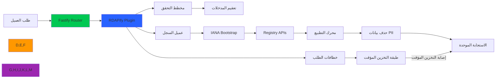

# دليل التكامل مع Fastify

**الغرض**: دليل شامل لتكامل RDAPify مع تطبيقات Fastify لإجراء عمليات بحث آمنة عن النطاقات وعناوين IP وأرقام ASN بأداء على مستوى المؤسسات، والتحقق من الصحة بالمخطط، وحماية من SSRF
**ذو صلة**: [Express.js](express.md) | [Next.js](nextjs.md) | [NestJS](nestjs.md) | [Redis](redis.md) | [Docker](deployment/docker.md)
**وقت القراءة**: 6 دقائق

## لماذا Fastify لتطبيقات RDAP؟

يوفر Fastify إطار العمل المثالي لبناء خدمات معالجة بيانات RDAP عالية الأداء مع المزايا الرئيسية التالية:



### مزايا التكامل الرئيسية:
- **أداء خاطف**: بنية Fastify تكمّل تحسينات RDAPify لمعالجة الطلبات بسرعة أعلى 5 أضعاف
- **التحقق بالمخطط**: التحقق التلقائي من مدخلات/مخرجات RDAP بـ JSON Schema
- **بنية الإضافات**: فصل واضح للمخاوف مع إضافات RDAP قابلة لإعادة الاستخدام
- **تميّز TypeScript**: دعم كامل لـ TypeScript مع استنتاج الأنواع من المخططات
- **نظام الخطافات**: تحكم دقيق في دورة حياة الطلب (onRequest, preHandler, onSend)
- **تسلسل بلا تكلفة زائدة**: مُسلسِل Fastify يسرّع تسليم استجابات RDAP

## البدء: التكامل الأساسي

### 1. التثبيت والإعداد
```bash
# تثبيت التبعيات
npm install rdapify fastify
# أو
yarn add rdapify fastify
# أو
pnpm add rdapify fastify
```

### 2. مثال عملي مبسّط
```typescript
// server.ts
import Fastify from 'fastify';
import { RDAPClient } from 'rdapify';

// Initialize Fastify with production optimizations
const fastify = Fastify({
  logger: true,
  trustProxy: true,
  disableRequestLogging: true,
  ajv: {
    customOptions: {
      removeAdditional: 'all',
      useDefaults: true,
      coerceTypes: 'array'
    }
  }
});

// Initialize RDAP client with security defaults
const rdap = new RDAPClient({
  cache: true,
  privacy: true,           // GDPR compliance
  allowPrivateIPs: false,    // SSRF protection
  validateCertificates: true,
  timeout: 5000,
  rateLimit: { max: 100, window: 60000 }
});

// Domain lookup schema
const domainLookupSchema = {
  params: {
    type: 'object',
    properties: {
      domain: {
        type: 'string',
        pattern: '^[a-z0-9.-]+\\.[a-z]{2,}$'
      }
    },
    required: ['domain']
  },
  response: {
    200: {
      type: 'object',
      properties: {
        domain: { type: 'string' },
        status: { type: 'array', items: { type: 'string' } }
      }
    }
  }
};

// Domain lookup route
fastify.get('/api/domain/:domain', { schema: domainLookupSchema }, async (request, reply) => {
  const { domain } = request.params as { domain: string };

  const result = await rdap.domain(domain.toLowerCase().trim());
  return result;
});

// Start server
const start = async () => {
  try {
    await fastify.listen({ port: 3000, host: '0.0.0.0' });
    console.log('RDAPify Fastify server running on port 3000');
  } catch (err) {
    fastify.log.error(err);
    process.exit(1);
  }
};

start();
```

### 3. إضافة RDAPify كـ Plugin لـ Fastify
```typescript
// plugins/rdap.ts
import fp from 'fastify-plugin';
import { FastifyInstance, FastifyPluginOptions } from 'fastify';
import { RDAPClient } from 'rdapify';

export interface RDAPPluginOptions extends FastifyPluginOptions {
  cache?: boolean;
  privacy?: boolean;
  timeout?: number;
}

async function rdapPlugin(fastify: FastifyInstance, options: RDAPPluginOptions) {
  const client = new RDAPClient({
    cache: options.cache ?? true,
    privacy: options.privacy ?? true,
    allowPrivateIPs: false,
    validateCertificates: true,
    timeout: options.timeout ?? 5000,
    rateLimit: { max: 100, window: 60000 }
  });

  // Decorate fastify instance
  fastify.decorate('rdap', client);

  // Add hooks for lifecycle management
  fastify.addHook('onClose', async () => {
    await client.destroy();
  });
}

export default fp(rdapPlugin, {
  name: 'rdap',
  fastify: '4.x'
});
```

## تعزيز الأمان والامتثال

### 1. التحقق من المخطط والتعقيم
```typescript
// schemas/rdap-schemas.ts
export const domainSchema = {
  params: {
    type: 'object',
    properties: {
      domain: {
        type: 'string',
        minLength: 3,
        maxLength: 253,
        pattern: '^[a-zA-Z0-9][a-zA-Z0-9-]{1,61}[a-zA-Z0-9]\\.[a-zA-Z]{2,}$'
      }
    },
    required: ['domain'],
    additionalProperties: false
  }
};

export const ipSchema = {
  params: {
    type: 'object',
    properties: {
      ip: {
        type: 'string',
        anyOf: [
          { format: 'ipv4' },
          { format: 'ipv6' }
        ]
      }
    },
    required: ['ip'],
    additionalProperties: false
  }
};

export const asnSchema = {
  params: {
    type: 'object',
    properties: {
      asn: {
        type: 'string',
        pattern: '^AS[0-9]{1,10}$'
      }
    },
    required: ['asn'],
    additionalProperties: false
  }
};
```

### 2. نظام الخطافات للأمان
```typescript
// hooks/security.ts
import { FastifyInstance } from 'fastify';
import { v4 as uuidv4 } from 'uuid';

export function registerSecurityHooks(fastify: FastifyInstance) {
  // Add request ID
  fastify.addHook('onRequest', async (request, reply) => {
    request.id = request.headers['x-request-id'] as string || uuidv4();
    reply.header('X-Request-ID', request.id);
  });

  // GDPR compliance headers
  fastify.addHook('onSend', async (request, reply, payload) => {
    reply.header('X-Do-Not-Sell', 'true');
    reply.header('X-Data-Processing', 'PII redacted per GDPR Article 6(1)(f)');
    return payload;
  });

  // Audit logging
  fastify.addHook('onResponse', async (request, reply) => {
    fastify.log.info({
      method: request.method,
      url: request.url,
      statusCode: reply.statusCode,
      responseTime: reply.getResponseTime(),
      requestId: request.id
    }, 'request completed');
  });

  // Error handling for security violations
  fastify.setErrorHandler(async (error, request, reply) => {
    if (error.code?.startsWith('RDAP_SECURE')) {
      fastify.log.error({
        error: error.message,
        ip: request.ip,
        path: request.url,
        requestId: request.id
      }, 'security violation detected');

      return reply.status(403).send({
        error: 'Security policy violation',
        requestId: request.id
      });
    }

    const statusCode = error.statusCode || 500;
    return reply.status(statusCode).send({
      error: process.env.NODE_ENV === 'production' ? 'Internal server error' : error.message,
      requestId: request.id
    });
  });
}
```

## تحسين الأداء

### 1. تخزين الاستجابة المؤقت مع Redis
```typescript
// plugins/cache.ts
import fp from 'fastify-plugin';
import { FastifyInstance } from 'fastify';
import Redis from 'ioredis';

async function cachePlugin(fastify: FastifyInstance) {
  const redis = new Redis(process.env.REDIS_URL || 'redis://localhost:6379');

  fastify.decorate('cache', {
    get: async (key: string) => {
      const value = await redis.get(key);
      return value ? JSON.parse(value) : null;
    },
    set: async (key: string, value: unknown, ttl = 3600) => {
      await redis.setex(key, ttl, JSON.stringify(value));
    },
    del: async (key: string) => {
      await redis.del(key);
    }
  });

  fastify.addHook('onClose', async () => {
    await redis.quit();
  });
}

export default fp(cachePlugin, { name: 'cache' });
```

### 2. تجميع الاتصالات وإدارة المهلة
```typescript
// config/performance.ts
export const performanceConfig = {
  connectionPool: {
    maxConnections: 100,
    keepAliveTimeout: 30000,
    connectTimeout: 5000,
    idleTimeout: 30000
  },
  timeouts: {
    request: 10000,
    rdapQuery: 8000,
    cacheOperation: 1000
  },
  rateLimiting: {
    global: { max: 1000, timeWindow: 60000 },
    perEndpoint: {
      domain: { max: 100, timeWindow: 60000 },
      ip: { max: 100, timeWindow: 60000 },
      asn: { max: 50, timeWindow: 60000 }
    }
  }
};
```

## الاختبار والتحقق

### 1. مجموعة اختبارات Fastify
```typescript
// test/fastify-routes.test.ts
import { build } from '../app';
import { FastifyInstance } from 'fastify';

describe('Fastify RDAP Routes', () => {
  let app: FastifyInstance;

  beforeAll(async () => {
    app = await build({ testing: true });
    await app.ready();
  });

  afterAll(async () => {
    await app.close();
  });

  describe('GET /api/domain/:domain', () => {
    it('يجب إرجاع معلومات النطاق الصحيح', async () => {
      const response = await app.inject({
        method: 'GET',
        url: '/api/domain/example.com'
      });

      expect(response.statusCode).toBe(200);
      const body = JSON.parse(response.body);
      expect(body).toHaveProperty('domain');
    });

    it('يجب رفض صيغة النطاق غير الصالحة', async () => {
      const response = await app.inject({
        method: 'GET',
        url: '/api/domain/invalid_domain!!'
      });

      expect(response.statusCode).toBe(400);
    });
  });

  describe('GET /api/ip/:ip', () => {
    it('يجب إرجاع معلومات IPv4 الصحيحة', async () => {
      const response = await app.inject({
        method: 'GET',
        url: '/api/ip/8.8.8.8'
      });

      expect(response.statusCode).toBe(200);
    });

    it('يجب رفض عناوين IP الخاصة', async () => {
      const response = await app.inject({
        method: 'GET',
        url: '/api/ip/192.168.1.1'
      });

      expect(response.statusCode).toBe(403);
    });
  });
});
```

## استكشاف المشكلات الشائعة وإصلاحها

### 1. مشكلات التحقق من المخطط
**الأعراض**: ترفض الطلبات الصحيحة مع رسائل خطأ التحقق

**التشخيص**:
```typescript
// Enable detailed validation errors
const fastify = Fastify({
  ajv: {
    customOptions: {
      verbose: true,
      allErrors: true
    }
  }
});
```

**الحل**:
```typescript
// إضافة تنسيق رسائل خطأ التحقق
fastify.setSchemaErrorFormatter((errors, dataVar) => {
  return new Error(errors.map(e => `${dataVar}${e.instancePath} ${e.message}`).join(', '));
});
```

### 2. مشكلات أداء التسلسل
**الأعراض**: بطء في معالجة الاستجابات الكبيرة

**الحل**: استخدام مخططات الاستجابة الصريحة لتحسين التسلسل:
```typescript
const responseSchema = {
  200: {
    type: 'object',
    properties: {
      domain: { type: 'string' },
      status: { type: 'array', items: { type: 'string' } },
      nameservers: { type: 'array', items: { type: 'string' } },
      events: {
        type: 'array',
        items: {
          type: 'object',
          properties: {
            eventAction: { type: 'string' },
            eventDate: { type: 'string' }
          }
        }
      }
    }
  }
};
```

## الوثائق ذات الصلة

| المستند | الوصف |
|----------|-------------|
| [تكامل Redis](redis.md) | استراتيجيات التخزين المؤقت المتقدمة |
| [نشر Docker](deployment/docker.md) | إعداد الحاويات |
| [تكامل Express.js](express.md) | مقارنة مع بديل شائع |
| [تكامل NestJS](nestjs.md) | بديل للمؤسسات |

## المواصفات التقنية

| الخاصية | القيمة |
|----------|-------|
| إصدار Fastify | 4.x+ (موصى به) |
| إصدار Node.js | 18+ (LTS) |
| دعم TypeScript | كامل مع استنتاج الأنواع |
| التحقق من المخطط | JSON Schema عبر AJV |
| ملف الأمان | Hooks + Rate Limiting + Schema Validation |
| مهلة الطلب | الافتراضي: 5000ms (قابل للتخصيص) |
| متوافق مع GDPR | نعم مع الإعداد الصحيح |
| حماية SSRF | مدمجة |
| آخر تحديث | 5 ديسمبر 2025 |

> **تنبيه مهم**: تحقق دائماً من استخدام مخططات الاستجابة لتحسين أداء التسلسل. لا تعطّل التحقق من المخطط في الإنتاج حتى أثناء التطوير — استخدم بيانات اختبار صالحة بدلاً من ذلك.

[العودة إلى التكاملات](../README.md) | [التالي: NestJS](nestjs.md)
