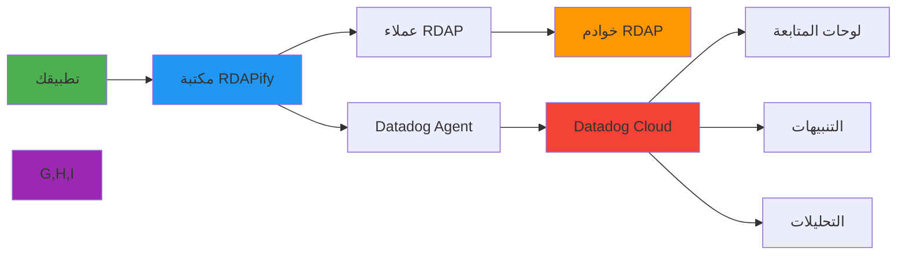

# دليل التكامل مع Datadog

> **الغرض:** دليل شامل لتكامل RDAPify مع Datadog للمراقبة الشاملة والتنبيه وتحليلات الأداء
> **ذو صلة:** [تكامل Prometheus](prometheus.md) | [تكامل New Relic](new-relic.md) | [تحسين الأداء](../../guides/performance.md)
> **وقت القراءة:** 6 دقائق

---

## لماذا مراقبة عمليات RDAP مع Datadog؟

تتطلب عمليات RDAP (بروتوكول الوصول إلى بيانات التسجيل) مراقبة متخصصة بسبب خصائصها الفريدة:



**متطلبات المراقبة الحرجة:**
- **مقاييس خاصة بكل سجل**: سجلات مختلفة (Verisign, ARIN, RIPE) لها خصائص أداء متباينة
- **مراقبة مدركة لـ PII**: تتبع المقاييس مع الحفاظ على امتثال الخصوصية (GDPR/CCPA)
- **تحليل متعدد الأبعاد**: ربط الأداء بفعالية التخزين المؤقت ومعدلات الخطأ وأنماط الاستعلام
- **اكتشاف الشذوذات**: تحديد أنماط استعلام غير عادية قد تشير إلى تهديدات أمنية
- **تتبع SLA/SLO**: مراقبة الامتثال لأهداف مستوى الخدمة

---

## البدء: التكامل الأساسي

### 1. التثبيت والإعداد
```bash
# Install Datadog dependencies
npm install dd-trace @datadog/datadog-api-client
```

```javascript
// datadog-config.js
const tracer = require('dd-trace').init({
  service: 'rdapify-service',
  env: process.env.NODE_ENV || 'production',
  version: process.env.APP_VERSION || '1.0.0',
  logInjection: true,
  runtimeMetrics: true,
  profiling: true,
  analytics: true,
  tags: {
    team: 'infrastructure',
    project: 'rdapify'
  }
});

module.exports = tracer;
```

### 2. تتبع عمليات RDAP
```javascript
// monitoring/rdap-tracer.js
const tracer = require('./datadog-config');
const { RDAPClient } = require('rdapify');

class TracedRDAPClient {
  constructor(config) {
    this.client = new RDAPClient(config);
  }

  async domain(domainName) {
    const span = tracer.startSpan('rdap.domain_lookup', {
      tags: {
        'rdap.query_type': 'domain',
        'rdap.registry': this.extractRegistry(domainName)
      }
    });

    const start = Date.now();

    try {
      const result = await this.client.domain(domainName);

      span.setTag('rdap.cache_hit', result._cached || false);
      span.setTag('rdap.status', 'success');
      span.setTag('rdap.registry', result._registry || 'unknown');

      return result;
    } catch (error) {
      span.setTag('error', true);
      span.setTag('rdap.error_type', error.code || 'unknown');
      span.log({ event: 'error', message: error.message });
      throw error;
    } finally {
      const duration = Date.now() - start;
      span.setTag('rdap.duration_ms', duration);
      span.finish();
    }
  }

  async ip(ipAddress) {
    const span = tracer.startSpan('rdap.ip_lookup', {
      tags: {
        'rdap.query_type': 'ip',
        'rdap.ip_version': ipAddress.includes(':') ? 'ipv6' : 'ipv4'
      }
    });

    try {
      const result = await this.client.ip(ipAddress);
      span.setTag('rdap.rir', result._rir || 'unknown');
      return result;
    } catch (error) {
      span.setTag('error', true);
      throw error;
    } finally {
      span.finish();
    }
  }

  async asn(asnNumber) {
    const span = tracer.startSpan('rdap.asn_lookup', {
      tags: { 'rdap.query_type': 'asn' }
    });

    try {
      return await this.client.asn(asnNumber);
    } catch (error) {
      span.setTag('error', true);
      throw error;
    } finally {
      span.finish();
    }
  }

  extractRegistry(domain) {
    const tld = domain.split('.').pop();
    const registryMap = {
      'com': 'verisign', 'net': 'verisign',
      'org': 'pir', 'io': 'iana'
    };
    return registryMap[tld] || 'unknown';
  }
}

module.exports = TracedRDAPClient;
```

### 3. المقاييس المخصصة
```javascript
// monitoring/custom-metrics.js
const { DogStatsD } = require('hot-shots');

const statsd = new DogStatsD({
  host: process.env.DD_AGENT_HOST || 'localhost',
  port: parseInt(process.env.DD_DOGSTATSD_PORT || '8125'),
  prefix: 'rdapify.',
  globalTags: {
    env: process.env.NODE_ENV || 'production',
    service: 'rdapify',
    version: process.env.APP_VERSION || '1.0.0'
  }
});

const rdapMetrics = {
  // مدة استعلام RDAP
  trackQueryDuration(type, duration, tags = {}) {
    statsd.histogram('query.duration', duration, [
      `query_type:${type}`,
      ...Object.entries(tags).map(([k, v]) => `${k}:${v}`)
    ]);
  },

  // عداد الاستعلامات
  trackQueryCount(type, status, registry = 'unknown') {
    statsd.increment('query.count', 1, [
      `query_type:${type}`,
      `status:${status}`,
      `registry:${registry}`
    ]);
  },

  // أداء التخزين المؤقت
  trackCachePerformance(type, hit) {
    const metric = hit ? 'cache.hit' : 'cache.miss';
    statsd.increment(metric, 1, [`query_type:${type}`]);

    // نسبة إصابة التخزين المؤقت الكلية
    statsd.gauge('cache.hit_rate', hit ? 1 : 0, [`query_type:${type}`]);
  },

  // معدل الخطأ
  trackError(type, errorCode, registry = 'unknown') {
    statsd.increment('error.count', 1, [
      `query_type:${type}`,
      `error_code:${errorCode}`,
      `registry:${registry}`
    ]);
  },

  // عمليات السجل
  trackRegistryOperation(registry, operation, duration, success) {
    statsd.histogram('registry.request_duration', duration, [
      `registry:${registry}`,
      `operation:${operation}`,
      `success:${success}`
    ]);
  },

  // معدل تحديد الطلبات
  trackRateLimit(registry, limited) {
    if (limited) {
      statsd.increment('rate_limit.hit', 1, [`registry:${registry}`]);
    }
  }
};

module.exports = rdapMetrics;
```

## إعداد لوحة متابعة Datadog

### 1. لوحة JSON
```json
{
  "title": "RDAPify Operations Dashboard",
  "description": "مراقبة شاملة لعمليات RDAP",
  "widgets": [
    {
      "definition": {
        "type": "timeseries",
        "title": "معدل استعلامات RDAP",
        "requests": [
          {
            "q": "sum:rdapify.query.count{*} by {query_type}.as_rate()",
            "display_type": "line"
          }
        ]
      }
    },
    {
      "definition": {
        "type": "timeseries",
        "title": "مدة استعلام RDAP (P50/P95/P99)",
        "requests": [
          {
            "q": "p50:rdapify.query.duration{*} by {query_type}",
            "display_type": "line"
          },
          {
            "q": "p95:rdapify.query.duration{*} by {query_type}",
            "display_type": "line"
          },
          {
            "q": "p99:rdapify.query.duration{*} by {query_type}",
            "display_type": "line"
          }
        ]
      }
    },
    {
      "definition": {
        "type": "query_value",
        "title": "نسبة إصابة التخزين المؤقت",
        "requests": [
          {
            "q": "sum:rdapify.cache.hit{*} / (sum:rdapify.cache.hit{*} + sum:rdapify.cache.miss{*}) * 100",
            "aggregator": "avg"
          }
        ],
        "precision": 1,
        "unit": "%"
      }
    },
    {
      "definition": {
        "type": "timeseries",
        "title": "معدل الأخطاء حسب السجل",
        "requests": [
          {
            "q": "sum:rdapify.error.count{*} by {registry}.as_rate()",
            "display_type": "bars"
          }
        ]
      }
    }
  ]
}
```

## إعداد التنبيهات

### 1. تنبيهات مدة الاستعلام
```json
{
  "name": "تحذير: مدة استعلام RDAP مرتفعة",
  "type": "metric alert",
  "query": "avg(last_5m):avg:rdapify.query.duration{env:production} by {query_type} > 3000",
  "message": "متوسط مدة استعلام RDAP تجاوز 3 ثوانٍ للنوع {{query_type.name}}.\n\n@pagerduty-rdapify-critical",
  "thresholds": {
    "warning": 2000,
    "critical": 3000
  }
}
```

### 2. تنبيهات معدل الخطأ
```json
{
  "name": "تحذير: معدل أخطاء RDAP مرتفع",
  "type": "metric alert",
  "query": "sum(last_5m):sum:rdapify.error.count{env:production}.as_rate() > 10",
  "message": "معدل أخطاء RDAP تجاوز 10 خطأ في الدقيقة.\n\n@pagerduty-rdapify-warnings",
  "thresholds": {
    "warning": 5,
    "critical": 10
  }
}
```

### 3. تنبيهات نسبة إصابة التخزين المؤقت
```json
{
  "name": "تحذير: نسبة إصابة التخزين المؤقت منخفضة",
  "type": "metric alert",
  "query": "avg(last_15m):(sum:rdapify.cache.hit{env:production} / (sum:rdapify.cache.hit{env:production} + sum:rdapify.cache.miss{env:production})) * 100 < 70",
  "message": "نسبة إصابة التخزين المؤقت انخفضت دون 70%.\n\n@slack-rdapify-alerts",
  "thresholds": {
    "warning": 70,
    "critical": 50
  }
}
```

## تكامل APM للتتبع الموزع

### 1. إعداد التتبع
```javascript
// اضبط في أول سطر من ملف الدخول
require('./datadog-config');

const express = require('express');
const TracedRDAPClient = require('./monitoring/rdap-tracer');

const app = express();
const rdap = new TracedRDAPClient({
  privacy: true,
  allowPrivateIPs: false,
  timeout: 10000
});

app.get('/api/domain/:domain', async (req, res) => {
  const span = require('dd-trace').scope().active();

  if (span) {
    span.setTag('domain', req.params.domain);
    span.setTag('route', '/api/domain/:domain');
  }

  try {
    const result = await rdap.domain(req.params.domain);
    res.json(result);
  } catch (error) {
    if (span) {
      span.setTag('error', true);
    }
    res.status(error.statusCode || 500).json({ error: error.message });
  }
});
```

## الوثائق ذات الصلة

| المستند | الوصف |
|----------|-------------|
| [تكامل Prometheus](prometheus.md) | بديل مفتوح المصدر |
| [تكامل New Relic](new-relic.md) | منصة مراقبة بديلة |
| [تحسين الأداء](../../guides/performance.md) | توجيهات الأداء |
| [متغيرات البيئة](../deployment/environment-vars.md) | إعداد التتبع |

## المواصفات التقنية

| الخاصية | القيمة |
|----------|-------|
| إصدار dd-trace | 5.x+ |
| بروتوكول DogStatsD | UDP (المنفذ 8125) |
| التتبع الموزع | مدعوم |
| مقاييس Runtime | Node.js heap, GC, event loop |
| تكامل APM | Express, Fastify, NestJS |
| حفظ البيانات | 15 شهر (Enterprise) |
| تنبيهات SLO | مدعومة |
| متوافق مع GDPR | نعم - لا تُرسَل PII |
| آخر تحديث | 5 ديسمبر 2025 |

> **تنبيه مهم**: لا تُرسِل بيانات PII إلى Datadog. تحقق من تطبيق `privacy: true` في RDAPClient لضمان حذف البيانات الشخصية قبل أي تسجيل أو تتبع. راجع [وثائق خصوصية Datadog](https://docs.datadoghq.com/data_security/) للمزيد.

[العودة إلى تكاملات المراقبة](../monitoring/) | [التالي: New Relic](new-relic.md)
