# دليل التكامل مع New Relic

> **الغرض:** دليل شامل لتكامل RDAPify مع New Relic للمراقبة الشاملة والتنبيه وتحليلات الأداء
> **ذو صلة:** [تكامل Datadog](datadog.md) | [تكامل Prometheus](prometheus.md) | [تحسين الأداء](../../guides/performance.md)
> **وقت القراءة:** 6 دقائق

---

## لماذا مراقبة عمليات RDAP مع New Relic؟

تتطلب عمليات RDAP (بروتوكول الوصول إلى بيانات التسجيل) مراقبة متخصصة بسبب خصائصها الفريدة ومتطلباتها التنظيمية:

```mermaid
graph LR
    A[تطبيقك] --> B[مكتبة RDAPify]
    B --> C[عملاء RDAP]
    C --> D[خوادم RDAP]
    B --> E[New Relic Agent]
    E --> F[New Relic One]
    F --> G[لوحات المتابعة]
    F --> H[التنبيهات]
    F --> I[AI Insights]

    style A fill:#4CAF50
    style B fill:#2196F3
    style D fill:#FF9800
    style F fill:#003D5C
    style G,H,I fill:#9C27B0
```



**متطلبات المراقبة الحرجة:**
- **رصد خاص بكل سجل**: سجلات مختلفة (Verisign, ARIN, RIPE) تستلزم مقاييس مخصصة
- **مراقبة مدركة لـ PII**: تتبع المقاييس مع الحفاظ على امتثال GDPR/CCPA
- **تحليل متعدد الأبعاد**: ربط الأداء بفعالية التخزين المؤقت وأنماط الاستعلام
- **اكتشاف الشذوذات**: تحديد أنماط استعلام غير عادية قد تشير إلى تهديدات أمنية
- **تتبع SLA/SLO**: مراقبة الامتثال لأهداف مستوى الخدمة

---

## البدء: التكامل الأساسي

### 1. التثبيت والإعداد
```bash
# Install New Relic dependencies
npm install newrelic @newrelic/browser-agent
```

```javascript
// newrelic.js
const newrelic = require('newrelic');

// إعداد New Relic عبر متغيرات البيئة
// NEW_RELIC_LICENSE_KEY
// NEW_RELIC_APP_NAME
// NEW_RELIC_LOG_LEVEL
```

```javascript
// newrelic-config.js
// newrelic.js يُحمَّل تلقائياً عبر متغيرات البيئة
// أو يمكن إعداده صراحةً:
process.env.NEW_RELIC_LICENSE_KEY = process.env.NEW_RELIC_LICENSE_KEY;
process.env.NEW_RELIC_APP_NAME = 'RDAPify-Service';
process.env.NEW_RELIC_LOG_LEVEL = 'info';
process.env.NEW_RELIC_DISTRIBUTED_TRACING_ENABLED = 'true';
process.env.NEW_RELIC_TRANSACTION_TRACER_ENABLED = 'true';
process.env.NEW_RELIC_ERROR_COLLECTOR_ENABLED = 'true';

// يجب تحميل newrelic أولاً قبل أي شيء آخر
require('newrelic');
```

### 2. تتبع عمليات RDAP
```javascript
// monitoring/rdap-newrelic.js
const newrelic = require('newrelic');
const { RDAPClient } = require('rdapify');

class NewRelicTracedRDAPClient {
  constructor(config) {
    this.client = new RDAPClient(config);
  }

  async domain(domainName) {
    return newrelic.startSegment('RDAP/Domain/Lookup', true, async () => {
      const start = Date.now();

      // إضافة سمات مخصصة للمعاملة
      newrelic.addCustomAttribute('rdap.query_type', 'domain');
      newrelic.addCustomAttribute('rdap.registry', this.extractRegistry(domainName));

      try {
        const result = await this.client.domain(domainName);

        newrelic.addCustomAttribute('rdap.cache_hit', result._cached || false);
        newrelic.addCustomAttribute('rdap.status', 'success');
        newrelic.addCustomAttribute('rdap.duration_ms', Date.now() - start);

        // تسجيل مقياس مخصص
        newrelic.recordMetric('Custom/RDAP/DomainLookup/Duration', Date.now() - start);
        newrelic.incrementMetric('Custom/RDAP/DomainLookup/Count');

        return result;
      } catch (error) {
        newrelic.addCustomAttribute('rdap.error_type', error.code || 'unknown');
        newrelic.noticeError(error, {
          'rdap.query_type': 'domain',
          'rdap.error_code': error.code
        });

        newrelic.incrementMetric('Custom/RDAP/DomainLookup/Error');
        throw error;
      }
    });
  }

  async ip(ipAddress) {
    return newrelic.startSegment('RDAP/IP/Lookup', true, async () => {
      const start = Date.now();
      newrelic.addCustomAttribute('rdap.query_type', 'ip');

      try {
        const result = await this.client.ip(ipAddress);
        newrelic.recordMetric('Custom/RDAP/IPLookup/Duration', Date.now() - start);
        return result;
      } catch (error) {
        newrelic.noticeError(error, { 'rdap.query_type': 'ip' });
        throw error;
      }
    });
  }

  async asn(asnNumber) {
    return newrelic.startSegment('RDAP/ASN/Lookup', true, async () => {
      newrelic.addCustomAttribute('rdap.query_type', 'asn');
      try {
        return await this.client.asn(asnNumber);
      } catch (error) {
        newrelic.noticeError(error, { 'rdap.query_type': 'asn' });
        throw error;
      }
    });
  }

  extractRegistry(domain) {
    const tld = domain.split('.').pop();
    const map = { 'com': 'verisign', 'net': 'verisign', 'org': 'pir' };
    return map[tld] || 'unknown';
  }
}

module.exports = NewRelicTracedRDAPClient;
```

### 3. المقاييس المخصصة عبر API
```javascript
// monitoring/nr-metrics.js
const https = require('https');

const NR_API_KEY = process.env.NEW_RELIC_API_KEY;
const NR_ACCOUNT_ID = process.env.NEW_RELIC_ACCOUNT_ID;

async function sendMetrics(metrics) {
  const payload = [{
    metrics: metrics.map(m => ({
      name: m.name,
      type: m.type || 'gauge',
      value: m.value,
      timestamp: Math.floor(Date.now() / 1000),
      attributes: m.attributes || {}
    }))
  }];

  return new Promise((resolve, reject) => {
    const data = JSON.stringify(payload);
    const options = {
      hostname: 'metric-api.newrelic.com',
      path: '/metric/v1',
      method: 'POST',
      headers: {
        'Content-Type': 'application/json',
        'Api-Key': NR_API_KEY,
        'Content-Length': Buffer.byteLength(data)
      }
    };

    const req = https.request(options, (res) => {
      resolve(res.statusCode);
    });

    req.on('error', reject);
    req.write(data);
    req.end();
  });
}

const rdapNRMetrics = {
  async trackQuery(type, duration, success, cacheHit, registry) {
    await sendMetrics([
      {
        name: 'rdapify.query.duration',
        type: 'gauge',
        value: duration,
        attributes: { queryType: type, registry }
      },
      {
        name: 'rdapify.query.count',
        type: 'count',
        value: 1,
        attributes: { queryType: type, status: success ? 'success' : 'error', registry }
      },
      {
        name: `rdapify.cache.${cacheHit ? 'hit' : 'miss'}`,
        type: 'count',
        value: 1,
        attributes: { queryType: type }
      }
    ]);
  }
};

module.exports = rdapNRMetrics;
```

## استعلامات NRQL للوحات المتابعة

### 1. استعلامات الأداء الأساسية
```sql
-- معدل استعلامات RDAP حسب النوع
SELECT rate(count(*), 1 minute) AS 'Queries/min'
FROM Transaction
WHERE appName = 'RDAPify-Service'
  AND name LIKE 'RDAP/%'
FACET request.rdap_query_type
TIMESERIES AUTO

-- P50/P95/P99 لمدة الاستعلام
SELECT percentile(duration * 1000, 50, 95, 99) AS 'Duration (ms)'
FROM Transaction
WHERE appName = 'RDAPify-Service'
  AND name LIKE 'RDAP/Domain/%'
FACET request.rdap_registry
TIMESERIES AUTO

-- نسبة إصابة التخزين المؤقت
SELECT percentage(count(*), WHERE request.rdap_cache_hit = true) AS 'Cache Hit Rate %'
FROM Transaction
WHERE appName = 'RDAPify-Service'
  AND name LIKE 'RDAP/%'
FACET request.rdap_query_type
TIMESERIES AUTO

-- معدل الأخطاء حسب السجل
SELECT rate(count(*), 1 minute) AS 'Errors/min'
FROM TransactionError
WHERE appName = 'RDAPify-Service'
FACET request.rdap_registry, errorClass
TIMESERIES AUTO
```

### 2. استعلامات SLO
```sql
-- تتبع SLO: 99% من الاستعلامات أقل من 2 ثانية
SELECT percentage(
  count(*),
  WHERE duration < 2
) AS 'SLO Compliance %'
FROM Transaction
WHERE appName = 'RDAPify-Service'
  AND name LIKE 'RDAP/%'

-- متابعة أهداف الخدمة
SELECT
  percentage(count(*), WHERE duration < 1) AS 'P < 1s',
  percentage(count(*), WHERE duration < 2) AS 'P < 2s',
  percentage(count(*), WHERE duration < 5) AS 'P < 5s',
  percentage(count(*), WHERE httpResponseCode < 500) AS 'Success Rate'
FROM Transaction
WHERE appName = 'RDAPify-Service'
SINCE 24 hours ago
```

## إعداد التنبيهات

### 1. شرط تنبيه NRQL
```json
{
  "name": "RDAPify - مدة استعلام مرتفعة",
  "nrql": {
    "query": "SELECT average(duration * 1000) FROM Transaction WHERE appName = 'RDAPify-Service' AND name LIKE 'RDAP/%' FACET request.rdap_query_type"
  },
  "critical": {
    "operator": "ABOVE",
    "threshold": 3000,
    "thresholdDuration": 300,
    "thresholdOccurrences": "ALL"
  },
  "warning": {
    "operator": "ABOVE",
    "threshold": 2000,
    "thresholdDuration": 180,
    "thresholdOccurrences": "ALL"
  }
}
```

### 2. SLO Alerts
```json
{
  "name": "RDAPify - انتهاك SLO",
  "nrql": {
    "query": "SELECT percentage(count(*), WHERE duration < 2 AND httpResponseCode < 500) FROM Transaction WHERE appName = 'RDAPify-Service' AND name LIKE 'RDAP/%'"
  },
  "critical": {
    "operator": "BELOW",
    "threshold": 99,
    "thresholdDuration": 600
  }
}
```

## الوثائق ذات الصلة

| المستند | الوصف |
|----------|-------------|
| [تكامل Datadog](datadog.md) | منصة مراقبة بديلة |
| [تكامل Prometheus](prometheus.md) | حل مفتوح المصدر |
| [تحسين الأداء](../../guides/performance.md) | توجيهات الأداء |

## المواصفات التقنية

| الخاصية | القيمة |
|----------|-------|
| إصدار newrelic | 11.x+ |
| التتبع الموزع | مدعوم |
| مراقبة المستخدم الحقيقي | مدعوم |
| APM | Express, Fastify, NestJS |
| Metrics API | مدعوم |
| NRQL | للاستعلامات المخصصة |
| حفظ البيانات | 8 أيام (Standard) / مخصص (Enterprise) |
| AI Insights | للاكتشاف التلقائي |
| متوافق مع GDPR | نعم - لا تُرسَل PII |
| آخر تحديث | 5 ديسمبر 2025 |

> **تنبيه مهم**: تأكد من تطبيق `privacy: true` في RDAPClient لضمان عدم إرسال بيانات PII إلى New Relic. راجع [وثائق خصوصية بيانات New Relic](https://docs.newrelic.com/docs/security/overview/) للمزيد.

[العودة إلى تكاملات المراقبة](../monitoring/) | [التالي: Prometheus](prometheus.md)
