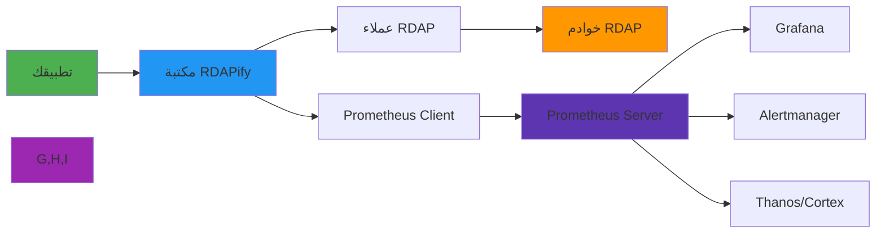

# دليل التكامل مع Prometheus

> **الغرض:** دليل شامل لتكامل RDAPify مع Prometheus للمراقبة الشاملة والتنبيه وتحليلات الأداء
> **ذو صلة:** [تكامل Datadog](datadog.md) | [تكامل New Relic](new-relic.md) | [تحسين الأداء](../../guides/performance.md)
> **وقت القراءة:** 6 دقائق

---

## لماذا مراقبة عمليات RDAP مع Prometheus؟

تتطلب عمليات RDAP (بروتوكول الوصول إلى بيانات التسجيل) مراقبة متخصصة بسبب خصائصها الفريدة ومتطلبات البنية التحتية:



**متطلبات المراقبة الحرجة:**
- **جمع مقاييس متعددة**: جمع عالي الحجم لمقاييس RDAP المخصصة
- **بنية سحب**: جمع فعال للمقاييس مع اكتشاف الخدمات
- **تخزين طويل المدى**: الاحتفاظ بالبيانات التاريخية للامتثال وتحليل الاتجاهات
- **تنبيه على نطاق واسع**: قواعد تنبيه معقدة لمشكلات خاصة بكل سجل
- **مراقبة مدركة لـ PII**: تتبع المقاييس مع الحفاظ على امتثال GDPR/CCPA
- **كفاءة الموارد**: حمل زائد ضئيل أثناء عمليات RDAP كثيفة الحجم

---

## البدء: التكامل الأساسي

### 1. التثبيت والتبعيات
```bash
# Install Prometheus client library
npm install prom-client
```

```javascript
// prometheus-config.js
const promClient = require('prom-client');

// تفعيل جمع المقاييس الافتراضية (استخدام Node.js، إلخ)
const collectDefaultMetrics = promClient.collectDefaultMetrics;
collectDefaultMetrics({
  prefix: 'rdapify_nodejs_',
  labels: {
    service: 'rdapify',
    env: process.env.NODE_ENV || 'production'
  },
  gcDurationBuckets: [0.001, 0.01, 0.1, 1, 2, 5]
});

module.exports = promClient;
```

### 2. مسجّل المقاييس المخصصة
```javascript
// monitoring/prometheus-metrics.js
const promClient = require('prom-client');

const registry = new promClient.Registry();

// إضافة التسميات الافتراضية العالمية
registry.setDefaultLabels({
  service: 'rdapify',
  env: process.env.NODE_ENV || 'production'
});

// مقاييس استعلامات RDAP
const rdapQueryDuration = new promClient.Histogram({
  name: 'rdapify_query_duration_seconds',
  help: 'مدة استعلامات RDAP بالثواني',
  labelNames: ['query_type', 'registry', 'cache_hit', 'status'],
  buckets: [0.01, 0.05, 0.1, 0.25, 0.5, 1, 2, 5, 10],
  registers: [registry]
});

const rdapQueryTotal = new promClient.Counter({
  name: 'rdapify_queries_total',
  help: 'إجمالي استعلامات RDAP',
  labelNames: ['query_type', 'registry', 'status'],
  registers: [registry]
});

const rdapCacheHitTotal = new promClient.Counter({
  name: 'rdapify_cache_hits_total',
  help: 'إجمالي إصابات التخزين المؤقت',
  labelNames: ['query_type'],
  registers: [registry]
});

const rdapCacheMissTotal = new promClient.Counter({
  name: 'rdapify_cache_misses_total',
  help: 'إجمالي خسائر التخزين المؤقت',
  labelNames: ['query_type'],
  registers: [registry]
});

const rdapErrorTotal = new promClient.Counter({
  name: 'rdapify_errors_total',
  help: 'إجمالي أخطاء RDAP',
  labelNames: ['query_type', 'error_type', 'registry'],
  registers: [registry]
});

const rdapRegistryRequestDuration = new promClient.Histogram({
  name: 'rdapify_registry_request_duration_seconds',
  help: 'مدة الطلبات إلى سجلات RDAP',
  labelNames: ['registry', 'rdap_type'],
  buckets: [0.1, 0.25, 0.5, 1, 2, 5, 10, 30],
  registers: [registry]
});

const rdapCacheSize = new promClient.Gauge({
  name: 'rdapify_cache_size_entries',
  help: 'عدد الإدخالات الحالية في التخزين المؤقت',
  labelNames: ['cache_type'],
  registers: [registry]
});

const rdapActiveLookups = new promClient.Gauge({
  name: 'rdapify_active_lookups',
  help: 'عدد عمليات البحث النشطة حالياً',
  labelNames: ['query_type'],
  registers: [registry]
});

const rdapRateLimitHits = new promClient.Counter({
  name: 'rdapify_rate_limit_hits_total',
  help: 'عدد مرات الوصول إلى حد معدل الطلبات',
  labelNames: ['registry', 'limit_type'],
  registers: [registry]
});

// دوال تسجيل المقاييس
const rdapMetrics = {
  recordQuery(type, registry, duration, success, cacheHit) {
    const status = success ? 'success' : 'error';
    const cacheHitStr = cacheHit ? 'true' : 'false';

    rdapQueryDuration
      .labels(type, registry, cacheHitStr, status)
      .observe(duration / 1000); // تحويل من ms إلى ثواني

    rdapQueryTotal.labels(type, registry, status).inc();

    if (cacheHit) {
      rdapCacheHitTotal.labels(type).inc();
    } else {
      rdapCacheMissTotal.labels(type).inc();
    }
  },

  recordError(type, errorType, registry = 'unknown') {
    rdapErrorTotal.labels(type, errorType, registry).inc();
  },

  recordRegistryRequest(registry, rdapType, duration) {
    rdapRegistryRequestDuration
      .labels(registry, rdapType)
      .observe(duration / 1000);
  },

  updateCacheSize(cacheType, size) {
    rdapCacheSize.labels(cacheType).set(size);
  },

  incrementActiveLookups(type) {
    rdapActiveLookups.labels(type).inc();
  },

  decrementActiveLookups(type) {
    rdapActiveLookups.labels(type).dec();
  },

  recordRateLimit(registry, limitType) {
    rdapRateLimitHits.labels(registry, limitType).inc();
  }
};

module.exports = { rdapMetrics, registry };
```

### 3. نقطة نهاية المقاييس
```javascript
// routes/metrics.js
const express = require('express');
const { registry } = require('../monitoring/prometheus-metrics');

const router = express.Router();

// نقطة نهاية مقاييس Prometheus
router.get('/metrics', async (req, res) => {
  // التحقق من الوصول (في الإنتاج استخدم مصادقة قوية)
  const authHeader = req.headers.authorization;
  if (process.env.METRICS_TOKEN && authHeader !== `Bearer ${process.env.METRICS_TOKEN}`) {
    return res.status(401).json({ error: 'غير مرخّص' });
  }

  res.set('Content-Type', registry.contentType);
  res.end(await registry.metrics());
});

module.exports = router;
```

### 4. العميل المُجهَّز بالمقاييس
```javascript
// monitoring/instrumented-client.js
const { RDAPClient } = require('rdapify');
const { rdapMetrics } = require('./prometheus-metrics');

class InstrumentedRDAPClient {
  constructor(config) {
    this.client = new RDAPClient(config);
  }

  async domain(domainName) {
    const registry = this.extractRegistry(domainName);
    rdapMetrics.incrementActiveLookups('domain');
    const start = Date.now();

    try {
      const result = await this.client.domain(domainName);
      const duration = Date.now() - start;

      rdapMetrics.recordQuery(
        'domain',
        registry,
        duration,
        true,
        result._cached || false
      );

      return result;
    } catch (error) {
      const duration = Date.now() - start;
      rdapMetrics.recordQuery('domain', registry, duration, false, false);
      rdapMetrics.recordError('domain', error.code || 'unknown', registry);
      throw error;
    } finally {
      rdapMetrics.decrementActiveLookups('domain');
    }
  }

  async ip(ipAddress) {
    rdapMetrics.incrementActiveLookups('ip');
    const start = Date.now();

    try {
      const result = await this.client.ip(ipAddress);
      rdapMetrics.recordQuery('ip', 'rir', Date.now() - start, true, result._cached || false);
      return result;
    } catch (error) {
      rdapMetrics.recordQuery('ip', 'rir', Date.now() - start, false, false);
      rdapMetrics.recordError('ip', error.code || 'unknown');
      throw error;
    } finally {
      rdapMetrics.decrementActiveLookups('ip');
    }
  }

  async asn(asnNumber) {
    rdapMetrics.incrementActiveLookups('asn');
    const start = Date.now();

    try {
      const result = await this.client.asn(asnNumber);
      rdapMetrics.recordQuery('asn', 'rir', Date.now() - start, true, result._cached || false);
      return result;
    } catch (error) {
      rdapMetrics.recordQuery('asn', 'rir', Date.now() - start, false, false);
      rdapMetrics.recordError('asn', error.code || 'unknown');
      throw error;
    } finally {
      rdapMetrics.decrementActiveLookups('asn');
    }
  }

  extractRegistry(domain) {
    const tld = domain.split('.').pop()?.toLowerCase();
    const map = { 'com': 'verisign', 'net': 'verisign', 'org': 'pir' };
    return map[tld] || 'unknown';
  }
}

module.exports = InstrumentedRDAPClient;
```

## إعداد Prometheus Server

### 1. ملف prometheus.yml
```yaml
# prometheus.yml
global:
  scrape_interval: 15s
  evaluation_interval: 15s
  external_labels:
    cluster: rdapify-production
    env: production

rule_files:
  - "rules/rdapify-alerts.yml"
  - "rules/rdapify-recording.yml"

alerting:
  alertmanagers:
    - static_configs:
        - targets:
            - alertmanager:9093

scrape_configs:
  - job_name: rdapify
    scrape_interval: 10s
    scrape_timeout: 5s
    metrics_path: /metrics
    scheme: http
    static_configs:
      - targets:
          - rdapify-app:3000
        labels:
          service: rdapify
          env: production

  # اكتشاف خدمات Kubernetes
  - job_name: rdapify-k8s
    kubernetes_sd_configs:
      - role: pod
        namespaces:
          names:
            - rdapify
    relabel_configs:
      - source_labels: [__meta_kubernetes_pod_annotation_prometheus_io_scrape]
        action: keep
        regex: "true"
      - source_labels: [__meta_kubernetes_pod_annotation_prometheus_io_path]
        action: replace
        target_label: __metrics_path__
        regex: (.+)
```

### 2. قواعد التنبيه
```yaml
# rules/rdapify-alerts.yml
groups:
  - name: rdapify.performance
    interval: 60s
    rules:
      - alert: RDAPIFYHighQueryDuration
        expr: |
          histogram_quantile(0.95, rate(rdapify_query_duration_seconds_bucket[5m])) > 3
        for: 5m
        labels:
          severity: warning
          team: infrastructure
        annotations:
          summary: "مدة استعلام RDAP مرتفعة"
          description: "P95 لمدة الاستعلام تجاوز 3 ثوانٍ لـ {{ $labels.query_type }} من {{ $labels.registry }}"

      - alert: RDAPIFYHighErrorRate
        expr: |
          rate(rdapify_errors_total[5m]) > 1
        for: 3m
        labels:
          severity: critical
          team: infrastructure
        annotations:
          summary: "معدل أخطاء RDAP مرتفع"
          description: "معدل الأخطاء تجاوز 1/ثانية لـ {{ $labels.query_type }}"

      - alert: RDAPIFYLowCacheHitRate
        expr: |
          rate(rdapify_cache_hits_total[15m]) /
          (rate(rdapify_cache_hits_total[15m]) + rate(rdapify_cache_misses_total[15m])) < 0.7
        for: 15m
        labels:
          severity: warning
        annotations:
          summary: "نسبة إصابة التخزين المؤقت منخفضة"
          description: "نسبة إصابة التخزين المؤقت لـ {{ $labels.query_type }} انخفضت دون 70%"

      - alert: RDAPIFYRegistryDown
        expr: |
          increase(rdapify_errors_total{error_type=~"REGISTRY_.*"}[5m]) > 10
        for: 2m
        labels:
          severity: critical
        annotations:
          summary: "سجل RDAP يعاني من مشكلات"
          description: "سجل {{ $labels.registry }} يُظهر أخطاء متكررة"
```

### 3. قواعد التسجيل
```yaml
# rules/rdapify-recording.yml
groups:
  - name: rdapify.recording
    interval: 60s
    rules:
      # معدل الاستعلام المُجمَّع
      - record: rdapify:query_rate:1m
        expr: sum(rate(rdapify_queries_total[1m])) by (query_type, registry, status)

      # نسبة إصابة التخزين المؤقت
      - record: rdapify:cache_hit_rate:5m
        expr: |
          rate(rdapify_cache_hits_total[5m]) /
          (rate(rdapify_cache_hits_total[5m]) + rate(rdapify_cache_misses_total[5m]))

      # P95 لمدة الاستعلام
      - record: rdapify:query_duration_p95:5m
        expr: histogram_quantile(0.95, rate(rdapify_query_duration_seconds_bucket[5m]))

      # معدل الخطأ
      - record: rdapify:error_rate:5m
        expr: rate(rdapify_errors_total[5m])
```

## لوحة Grafana

### 1. تصدير لوحة JSON
```json
{
  "title": "RDAPify Operations - Prometheus",
  "panels": [
    {
      "title": "معدل الاستعلامات (req/sec)",
      "type": "graph",
      "targets": [
        {
          "expr": "sum(rate(rdapify_queries_total[1m])) by (query_type)",
          "legendFormat": "{{query_type}}"
        }
      ]
    },
    {
      "title": "P95 لمدة الاستعلام (ms)",
      "type": "graph",
      "targets": [
        {
          "expr": "histogram_quantile(0.95, rate(rdapify_query_duration_seconds_bucket[5m])) * 1000",
          "legendFormat": "P95 - {{query_type}}"
        }
      ]
    },
    {
      "title": "نسبة إصابة التخزين المؤقت (%)",
      "type": "gauge",
      "targets": [
        {
          "expr": "sum(rate(rdapify_cache_hits_total[5m])) / (sum(rate(rdapify_cache_hits_total[5m])) + sum(rate(rdapify_cache_misses_total[5m]))) * 100"
        }
      ],
      "thresholds": "50,70"
    },
    {
      "title": "معدل الأخطاء حسب السجل",
      "type": "graph",
      "targets": [
        {
          "expr": "sum(rate(rdapify_errors_total[5m])) by (registry, error_type)",
          "legendFormat": "{{registry}} - {{error_type}}"
        }
      ]
    }
  ]
}
```

## الوثائق ذات الصلة

| المستند | الوصف |
|----------|-------------|
| [تكامل Datadog](datadog.md) | حل متكامل تجاري |
| [تكامل New Relic](new-relic.md) | منصة APM شاملة |
| [تحسين الأداء](../../guides/performance.md) | توجيهات الأداء |
| [Kubernetes](../cloud/kubernetes.md) | اكتشاف الخدمات في K8s |

## المواصفات التقنية

| الخاصية | القيمة |
|----------|-------|
| مكتبة العميل | prom-client 15.x |
| بروتوكول Prometheus | Text exposition format |
| فاصل الجمع الافتراضي | 15 ثانية |
| أنواع المقاييس | Counter, Gauge, Histogram, Summary |
| التخزين طويل المدى | Thanos / Cortex / VictoriaMetrics |
| لوحات المتابعة | Grafana |
| التنبيه | Alertmanager |
| متوافق مع GDPR | نعم - لا تُرسَل PII |
| آخر تحديث | 5 ديسمبر 2025 |

> **تنبيه مهم**: احمِ دائماً نقطة نهاية `/metrics` بمصادقة في الإنتاج. بيانات المقاييس قد تكشف معلومات عن بنية نظامك الداخلية. استخدم شبكات Kubernetes الداخلية أو TLS Mutual Authentication للوصول إلى المقاييس.

[العودة إلى تكاملات المراقبة](../monitoring/) | [العودة إلى التكاملات](../README.md)
