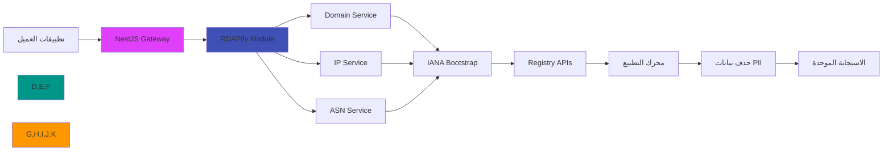

# دليل التكامل مع NestJS

**الغرض**: دليل شامل لتكامل RDAPify مع تطبيقات NestJS لإجراء عمليات بحث آمنة عن النطاقات وعناوين IP وأرقام ASN مع بنية معيارية وحقن التبعيات وأمان على مستوى المؤسسات
**ذو صلة**: [Express.js](express.md) | [Next.js](nextjs.md) | [Fastify](fastify.md)
**وقت القراءة**: 9 دقائق

## لماذا NestJS لتطبيقات RDAP؟

يوفر NestJS إطار العمل الخلفي المثالي للمؤسسات لبناء خدمات معالجة بيانات RDAP مع المزايا الرئيسية التالية:



### مزايا التكامل الرئيسية:
- **البنية المعيارية**: عزل وظائف RDAP في وحدات مخصصة وقابلة لإعادة الاستخدام
- **حقن التبعيات**: حقن عميل RDAP بإعدادات مختلفة عبر السياقات بسلاسة
- **أمان النوع**: TypeScript الشامل مع توثيق OpenAPI لنقاط نهاية RDAP
- **نمط المعترض**: تطبيق المخاوف المشتركة (التخزين المؤقت والتسجيل والأمان) على عمليات RDAP
- **أنماط المؤسسات**: دعم مدمج لـ CQRS والأحداث وبنية الخدمات المصغرة
- **أدوات الاختبار**: إطار اختبار شامل لاختبارات الوحدة واختبارات e2e لخدمات RDAP

## البدء: التكامل الأساسي

### 1. التثبيت والإعداد
```bash
# تثبيت التبعيات
npm install rdapify @nestjs/common @nestjs/core @nestjs/platform-express reflect-metadata rxjs
# أو
yarn add rdapify @nestjs/common @nestjs/core @nestjs/platform-express reflect-metadata rxjs
# أو
pnpm add rdapify @nestjs/common @nestjs/core @nestjs/platform-express reflect-metadata rxjs
```

### 2. إنشاء وحدة RDAP
```typescript
// rdap/rdap.module.ts
import { Module, Global, Logger } from '@nestjs/common';
import { RDAPClient, RDAPResponse } from 'rdapify';
import { RDAPService } from './rdap.service';
import { RDAPController } from './rdap.controller';
import { RDAPConfigService } from './rdap-config.service';

@Global()
@Module({
  providers: [
    RDAPService,
    RDAPConfigService,
    {
      provide: 'RDAP_CLIENT',
      useFactory: (config: RDAPConfigService) => {
        const client = new RDAPClient({
          cache: config.getCacheConfig(),
          privacy: config.getRedactionPolicy(),
          allowPrivateIPs: false, // SSRF protection by default
          validateCertificates: true,
          timeout: config.getTimeout(),
          rateLimit: config.getRateLimitConfig(),
          logger: new Logger('RDAPClient'),
        });

        // Register global event handlers
        client.on('query', (query) => {
          Logger.log(`RDAP query: ${query.type} ${query.value}`, 'RDAPModule');
        });

        client.on('cacheHit', (key) => {
          Logger.debug(`Cache hit: ${key}`, 'RDAPModule');
        });

        return client;
      },
      inject: [RDAPConfigService],
    },
  ],
  controllers: [RDAPController],
  exports: [RDAPService, 'RDAP_CLIENT'],
})
export class RDAPModule {}
```

### 3. خدمة الإعداد
```typescript
// rdap/rdap-config.service.ts
import { Injectable } from '@nestjs/common';
import { ConfigService } from '@nestjs/config';

@Injectable()
export class RDAPConfigService {
  constructor(private config: ConfigService) {}

  getCacheConfig() {
    return {
      type: this.config.get<string>('RDAP_CACHE_TYPE', 'memory'),
      ttl: this.config.get<number>('RDAP_CACHE_TTL', 3600),
      max: this.config.get<number>('RDAP_CACHE_MAX_ENTRIES', 10000)
    };
  }

  getRedactionPolicy() {
    return this.config.get<boolean>('RDAP_PRIVACY', true);
  }

  getTimeout() {
    return this.config.get<number>('RDAP_TIMEOUT', 5000);
  }

  getRateLimitConfig() {
    return {
      max: this.config.get<number>('RDAP_RATE_LIMIT_MAX', 100),
      window: this.config.get<number>('RDAP_RATE_LIMIT_WINDOW', 60000)
    };
  }
}
```

### 4. خدمة RDAP
```typescript
// rdap/rdap.service.ts
import { Injectable, Inject, Logger } from '@nestjs/common';
import { RDAPClient } from 'rdapify';

@Injectable()
export class RDAPService {
  private readonly logger = new Logger(RDAPService.name);

  constructor(
    @Inject('RDAP_CLIENT') private readonly rdapClient: RDAPClient
  ) {}

  async lookupDomain(domain: string) {
    const start = Date.now();
    try {
      const result = await this.rdapClient.domain(domain.toLowerCase().trim());
      this.logger.log(`Domain lookup for ${domain} completed in ${Date.now() - start}ms`);
      return result;
    } catch (error) {
      this.logger.error(`Domain lookup failed for ${domain}:`, error);
      throw error;
    }
  }

  async lookupIP(ip: string) {
    const start = Date.now();
    try {
      const result = await this.rdapClient.ip(ip);
      this.logger.log(`IP lookup for ${ip} completed in ${Date.now() - start}ms`);
      return result;
    } catch (error) {
      this.logger.error(`IP lookup failed for ${ip}:`, error);
      throw error;
    }
  }

  async lookupASN(asn: string) {
    const start = Date.now();
    try {
      const result = await this.rdapClient.asn(asn);
      this.logger.log(`ASN lookup for ${asn} completed in ${Date.now() - start}ms`);
      return result;
    } catch (error) {
      this.logger.error(`ASN lookup failed for ${asn}:`, error);
      throw error;
    }
  }
}
```

### 5. المتحكم
```typescript
// rdap/rdap.controller.ts
import {
  Controller, Get, Param, HttpException, HttpStatus,
  UseGuards, UseInterceptors, ValidationPipe
} from '@nestjs/common';
import { ApiTags, ApiOperation, ApiResponse, ApiParam } from '@nestjs/swagger';
import { RDAPService } from './rdap.service';
import { RateLimitGuard } from '../guards/rate-limit.guard';
import { AuditInterceptor } from '../interceptors/audit.interceptor';

@ApiTags('RDAP Lookups')
@Controller('api/rdap')
@UseGuards(RateLimitGuard)
@UseInterceptors(AuditInterceptor)
export class RDAPController {
  constructor(private readonly rdapService: RDAPService) {}

  @Get('domain/:domain')
  @ApiOperation({ summary: 'البحث عن نطاق' })
  @ApiParam({ name: 'domain', description: 'اسم النطاق للبحث عنه' })
  @ApiResponse({ status: 200, description: 'تم إرجاع معلومات النطاق بنجاح' })
  @ApiResponse({ status: 400, description: 'صيغة نطاق غير صالحة' })
  @ApiResponse({ status: 403, description: 'انتهاك سياسة الأمان' })
  async lookupDomain(@Param('domain') domain: string) {
    if (!/^[a-z0-9.-]+\.[a-z]{2,}$/.test(domain.toLowerCase())) {
      throw new HttpException('صيغة النطاق غير صالحة', HttpStatus.BAD_REQUEST);
    }

    try {
      return await this.rdapService.lookupDomain(domain);
    } catch (error: any) {
      if (error.code?.startsWith('RDAP_SECURE')) {
        throw new HttpException('انتهاك سياسة الأمان', HttpStatus.FORBIDDEN);
      }
      throw new HttpException(
        error.message || 'فشل في الاستعلام عن النطاق',
        error.statusCode || HttpStatus.INTERNAL_SERVER_ERROR
      );
    }
  }

  @Get('ip/:ip')
  @ApiOperation({ summary: 'البحث عن عنوان IP' })
  async lookupIP(@Param('ip') ip: string) {
    try {
      return await this.rdapService.lookupIP(ip);
    } catch (error: any) {
      if (error.code?.startsWith('RDAP_SECURE')) {
        throw new HttpException('انتهاك سياسة الأمان', HttpStatus.FORBIDDEN);
      }
      throw new HttpException(
        error.message || 'فشل في الاستعلام عن عنوان IP',
        error.statusCode || HttpStatus.INTERNAL_SERVER_ERROR
      );
    }
  }

  @Get('asn/:asn')
  @ApiOperation({ summary: 'البحث عن رقم ASN' })
  async lookupASN(@Param('asn') asn: string) {
    try {
      return await this.rdapService.lookupASN(asn);
    } catch (error: any) {
      throw new HttpException(
        error.message || 'فشل في الاستعلام عن ASN',
        error.statusCode || HttpStatus.INTERNAL_SERVER_ERROR
      );
    }
  }
}
```

## تعزيز الأمان والامتثال

### 1. حارس تحديد معدل الطلبات
```typescript
// guards/rate-limit.guard.ts
import { Injectable, CanActivate, ExecutionContext, HttpException, HttpStatus } from '@nestjs/common';
import { Reflector } from '@nestjs/core';

@Injectable()
export class RateLimitGuard implements CanActivate {
  private readonly requests = new Map<string, { count: number; resetTime: number }>();

  async canActivate(context: ExecutionContext): Promise<boolean> {
    const request = context.switchToHttp().getRequest();
    const ip = request.ip;
    const now = Date.now();
    const windowMs = 60000; // 1 minute
    const maxRequests = 100;

    const key = `${ip}:${Math.floor(now / windowMs)}`;
    const current = this.requests.get(key) || { count: 0, resetTime: now + windowMs };

    if (current.count >= maxRequests) {
      throw new HttpException(
        { error: 'عدد كبير جداً من الطلبات، يرجى المحاولة لاحقاً', retryAfter: 60 },
        HttpStatus.TOO_MANY_REQUESTS
      );
    }

    this.requests.set(key, { count: current.count + 1, resetTime: current.resetTime });
    return true;
  }
}
```

### 2. معترض المراجعة
```typescript
// interceptors/audit.interceptor.ts
import {
  Injectable, NestInterceptor, ExecutionContext, CallHandler, Logger
} from '@nestjs/common';
import { Observable } from 'rxjs';
import { tap } from 'rxjs/operators';
import { v4 as uuidv4 } from 'uuid';

@Injectable()
export class AuditInterceptor implements NestInterceptor {
  private readonly logger = new Logger(AuditInterceptor.name);

  intercept(context: ExecutionContext, next: CallHandler): Observable<unknown> {
    const request = context.switchToHttp().getRequest();
    const response = context.switchToHttp().getResponse();

    const requestId = request.headers['x-request-id'] || uuidv4();
    request.requestId = requestId;
    response.setHeader('X-Request-ID', requestId);

    const start = Date.now();

    this.logger.log(
      `[AUDIT] ${request.method} ${request.url} | IP: ${request.ip} | ID: ${requestId}`
    );

    return next.handle().pipe(
      tap({
        next: () => {
          const duration = Date.now() - start;
          this.logger.log(
            `[AUDIT] اكتمل ${response.statusCode} في ${duration}ms | ID: ${requestId}`
          );
        },
        error: (error) => {
          const duration = Date.now() - start;
          this.logger.error(
            `[AUDIT] فشل ${error.status || 500} في ${duration}ms | ID: ${requestId}`,
            error.message
          );
        }
      })
    );
  }
}
```

## أنماط المؤسسات المتقدمة

### 1. وحدة RDAP الديناميكية
```typescript
// rdap/rdap.module.ts - Dynamic module pattern
import { Module, DynamicModule } from '@nestjs/common';
import { RDAPClient } from 'rdapify';

export interface RDAPModuleOptions {
  cache?: boolean;
  privacy?: boolean;
  timeout?: number;
  rateLimit?: { max: number; window: number };
  isGlobal?: boolean;
}

@Module({})
export class RDAPModule {
  static forRoot(options: RDAPModuleOptions = {}): DynamicModule {
    const rdapProvider = {
      provide: 'RDAP_CLIENT',
      useFactory: () => new RDAPClient({
        cache: options.cache ?? true,
        privacy: options.privacy ?? true,
        allowPrivateIPs: false,
        validateCertificates: true,
        timeout: options.timeout ?? 5000,
        rateLimit: options.rateLimit ?? { max: 100, window: 60000 }
      })
    };

    return {
      module: RDAPModule,
      providers: [rdapProvider, RDAPService],
      controllers: [RDAPController],
      exports: [rdapProvider, RDAPService],
      global: options.isGlobal ?? false
    };
  }

  static forFeature(): DynamicModule {
    return {
      module: RDAPModule,
      providers: [RDAPService],
      exports: [RDAPService]
    };
  }
}
```

### 2. الدعم الكامل لـ CQRS
```typescript
// rdap/queries/domain-lookup.query.ts
import { IQuery, IQueryHandler, QueryHandler } from '@nestjs/cqrs';
import { RDAPService } from '../rdap.service';

export class DomainLookupQuery implements IQuery {
  constructor(public readonly domain: string) {}
}

@QueryHandler(DomainLookupQuery)
export class DomainLookupHandler implements IQueryHandler<DomainLookupQuery> {
  constructor(private readonly rdapService: RDAPService) {}

  async execute(query: DomainLookupQuery) {
    return this.rdapService.lookupDomain(query.domain);
  }
}
```

## الاختبار والتحقق

### 1. اختبارات الوحدة
```typescript
// rdap/rdap.service.spec.ts
import { Test, TestingModule } from '@nestjs/testing';
import { RDAPService } from './rdap.service';

describe('RDAPService', () => {
  let service: RDAPService;
  let mockRdapClient: jest.Mocked<any>;

  beforeEach(async () => {
    mockRdapClient = {
      domain: jest.fn(),
      ip: jest.fn(),
      asn: jest.fn()
    };

    const module: TestingModule = await Test.createTestingModule({
      providers: [
        RDAPService,
        { provide: 'RDAP_CLIENT', useValue: mockRdapClient }
      ]
    }).compile();

    service = module.get<RDAPService>(RDAPService);
  });

  describe('lookupDomain', () => {
    it('يجب إرجاع بيانات النطاق بنجاح', async () => {
      const mockResult = { domain: 'example.com', status: ['active'] };
      mockRdapClient.domain.mockResolvedValue(mockResult);

      const result = await service.lookupDomain('example.com');

      expect(result).toEqual(mockResult);
      expect(mockRdapClient.domain).toHaveBeenCalledWith('example.com');
    });

    it('يجب التعامل مع الأخطاء بشكل صحيح', async () => {
      mockRdapClient.domain.mockRejectedValue(new Error('Registry timeout'));

      await expect(service.lookupDomain('example.com')).rejects.toThrow('Registry timeout');
    });
  });
});
```

### 2. اختبارات e2e
```typescript
// test/rdap.e2e-spec.ts
import { Test, TestingModule } from '@nestjs/testing';
import { INestApplication } from '@nestjs/common';
import * as request from 'supertest';
import { AppModule } from '../src/app.module';

describe('RDAP Controller (e2e)', () => {
  let app: INestApplication;

  beforeEach(async () => {
    const moduleFixture: TestingModule = await Test.createTestingModule({
      imports: [AppModule],
    }).compile();

    app = moduleFixture.createNestApplication();
    await app.init();
  });

  afterEach(async () => {
    await app.close();
  });

  it('GET /api/rdap/domain/example.com', () => {
    return request(app.getHttpServer())
      .get('/api/rdap/domain/example.com')
      .expect(200)
      .expect((res) => {
        expect(res.body).toHaveProperty('domain');
      });
  });

  it('يجب رفض صيغة النطاق غير الصالحة', () => {
    return request(app.getHttpServer())
      .get('/api/rdap/domain/invalid!!')
      .expect(400);
  });
});
```

## الوثائق ذات الصلة

| المستند | الوصف |
|----------|-------------|
| [تكامل Express.js](express.md) | بديل أبسط لـ Node.js |
| [تكامل Fastify](fastify.md) | بديل عالي الأداء |
| [نشر Docker](deployment/docker.md) | نشر الحاويات |
| [تكامل Redis](redis.md) | التخزين المؤقت الموزع |

## المواصفات التقنية

| الخاصية | القيمة |
|----------|-------|
| إصدار NestJS | 10.x+ (موصى به) |
| إصدار Node.js | 18+ (LTS) |
| دعم TypeScript | كامل مع الديكوراتور |
| دعم OpenAPI | عبر @nestjs/swagger |
| ملف الأمان | Guards + Interceptors + Pipes |
| مهلة الطلب | الافتراضي: 5000ms (قابل للتخصيص) |
| متوافق مع GDPR | نعم مع الإعداد الصحيح |
| حماية SSRF | مدمجة |
| آخر تحديث | 5 ديسمبر 2025 |

> **تنبيه مهم**: استخدم دائماً الحقن بالرمز (`@Inject('RDAP_CLIENT')`) بدلاً من إنشاء مثيل مباشر لضمان إمكانية الاختبار وإدارة دورة الحياة الصحيحة في NestJS.

[العودة إلى التكاملات](../README.md) | [التالي: Next.js](nextjs.md)
