# دليل التكامل مع Next.js

**الغرض**: دليل شامل لتكامل RDAPify مع تطبيقات Next.js لإجراء عمليات بحث آمنة عن النطاقات وعناوين IP وأرقام ASN مع دعم SSR/SSG وتحسين وقت التشغيل على الحافة وأمان على مستوى المؤسسات
**ذو صلة**: [Express.js](express.md) | [NestJS](nestjs.md) | [Fastify](fastify.md)
**وقت القراءة**: 8 دقائق

## لماذا Next.js لتطبيقات RDAP؟

يوفر Next.js الإطار المثالي لبناء تطبيقات مدعومة بـ RDAP مع المزايا الرئيسية التالية:

```mermaid
graph LR
    A[المستخدم] --> B[تطبيق Next.js]
    B --> C[Edge Runtime]
    B --> D[Server Components]
    B --> E[API Routes]
    C --> F[RDAPify Edge Functions]
    D --> G[RDAPify Server Logic]
    E --> H[RDAPify API Handlers]
    F --> I[IANA Bootstrap]
    G --> I
    H --> I
    I --> J[Registry APIs]
    J --> K[محرك التطبيع]
    K --> L[حذف بيانات PII]
    L --> M[الاستجابة الموحدة]

    style B fill:#000000,stroke:#000
    style C,D,E fill:#1E90FF
    style F,G,H fill:#4CAF50
    style I,J,K,L,M fill:#9C27B0
```



### مزايا التكامل الرئيسية:
- **التصيير الهجين**: استخدام بيانات RDAP في مكونات الخادم أو الإنشاء الثابت أو الخطافات من جانب العميل
- **تحسين الحافة**: تشغيل استعلامات RDAP الخفيفة على الحافة مع شبكة Vercel العالمية
- **حدود الأمان**: عزل عمليات RDAP الحساسة في كود جانب الخادم بعيداً عن حزم العميل
- **إعادة الإنشاء الثابت التدريجي**: تخزين بيانات RDAP مؤقتاً مع تحديثات تلقائية في الخلفية
- **تميّز TypeScript**: أمان النوع الشامل من استجابات RDAP إلى مكونات React

## البدء: التكامل الأساسي

### 1. التثبيت والإعداد
```bash
# تثبيت التبعيات
npm install rdapify next react
# أو
yarn add rdapify next react
# أو
pnpm add rdapify next react
```

### 2. تطبيق مسار API في Next.js
```typescript
// pages/api/domain/[domain].ts
import type { NextApiRequest, NextApiResponse } from 'next';
import { RDAPClient } from 'rdapify';

// Initialize RDAP client with security defaults
const client = new RDAPClient({
  cache: true,
  privacy: true,           // GDPR compliance
  allowPrivateIPs: false,    // SSRF protection
  validateCertificates: true,
  timeout: 5000,
  rateLimit: { max: 100, window: 60000 }
});

export default async function handler(
  req: NextApiRequest,
  res: NextApiResponse
) {
  // Only allow GET requests
  if (req.method !== 'GET') {
    return res.status(405).json({ error: 'Method not allowed' });
  }

  try {
    const domain = req.query.domain as string;

    // Input validation
    if (!domain || !/^[a-z0-9.-]+\.[a-z]{2,}$/.test(domain)) {
      return res.status(400).json({ error: 'Invalid domain format' });
    }

    // Execute RDAP query
    const result = await client.domain(domain.toLowerCase().trim());

    // Set caching headers (1 hour)
    res.setHeader('Cache-Control', 'public, s-maxage=3600, stale-while-revalidate=7200');

    return res.status(200).json(result);
  } catch (error: any) {
    console.error(`RDAP API error for domain ${req.query.domain}:`, error);

    // Map RDAP errors to appropriate HTTP status codes
    const statusCode = error.statusCode ||
                      (error.code?.startsWith('RDAP_') ? 422 : 500);

    return res.status(statusCode).json({
      error: error.message,
      code: error.code || 'RDAP_REQUEST_FAILED'
    });
  }
}
```

### 3. Route Handler في App Router (Next.js 13+)
```typescript
// app/api/domain/[domain]/route.ts
import { NextRequest, NextResponse } from 'next/server';
import { RDAPClient } from 'rdapify';

const rdap = new RDAPClient({
  cache: true,
  privacy: true,
  allowPrivateIPs: false,
  validateCertificates: true,
  timeout: 5000
});

export async function GET(
  request: NextRequest,
  { params }: { params: { domain: string } }
) {
  const { domain } = params;

  if (!domain || !/^[a-z0-9.-]+\.[a-z]{2,}$/.test(domain)) {
    return NextResponse.json({ error: 'صيغة النطاق غير صالحة' }, { status: 400 });
  }

  try {
    const result = await rdap.domain(domain.toLowerCase().trim());

    return NextResponse.json(result, {
      headers: {
        'Cache-Control': 'public, s-maxage=3600, stale-while-revalidate=7200'
      }
    });
  } catch (error: any) {
    if (error.code?.startsWith('RDAP_SECURE')) {
      return NextResponse.json(
        { error: 'انتهاك سياسة الأمان' },
        { status: 403 }
      );
    }

    return NextResponse.json(
      { error: error.message || 'فشل الاستعلام عن RDAP' },
      { status: error.statusCode || 500 }
    );
  }
}
```

## مكونات الخادم و SSR

### 1. مكون خادم مع بيانات RDAP
```typescript
// app/domain/[domain]/page.tsx
import { RDAPClient } from 'rdapify';
import { Suspense } from 'react';

const rdap = new RDAPClient({
  cache: true,
  privacy: true,
  allowPrivateIPs: false,
  timeout: 5000
});

async function DomainInfo({ domain }: { domain: string }) {
  try {
    const data = await rdap.domain(domain);

    return (
      <div className="domain-info">
        <h1>{data.domain}</h1>
        <div className="status">
          الحالة: {data.status?.join(', ')}
        </div>
        <div className="nameservers">
          <h2>خوادم الأسماء</h2>
          <ul>
            {data.nameservers?.map((ns: string) => (
              <li key={ns}>{ns}</li>
            ))}
          </ul>
        </div>
      </div>
    );
  } catch (error) {
    return <div className="error">فشل في تحميل بيانات النطاق</div>;
  }
}

export default function DomainPage({ params }: { params: { domain: string } }) {
  return (
    <main>
      <Suspense fallback={<div>جارٍ التحميل...</div>}>
        <DomainInfo domain={params.domain} />
      </Suspense>
    </main>
  );
}

// إعادة الإنشاء الثابت التدريجي
export const revalidate = 3600; // إعادة التحقق كل ساعة
```

### 2. خطاف مخصص للعميل
```typescript
// hooks/useRDAPLookup.ts
'use client';

import { useState, useCallback } from 'react';

interface RDAPResult {
  data: unknown | null;
  loading: boolean;
  error: string | null;
}

export function useRDAPLookup() {
  const [state, setState] = useState<RDAPResult>({
    data: null,
    loading: false,
    error: null
  });

  const lookup = useCallback(async (type: 'domain' | 'ip' | 'asn', value: string) => {
    setState({ data: null, loading: true, error: null });

    try {
      const response = await fetch(`/api/${type}/${encodeURIComponent(value)}`);

      if (!response.ok) {
        const errorData = await response.json();
        throw new Error(errorData.error || `HTTP ${response.status}`);
      }

      const data = await response.json();
      setState({ data, loading: false, error: null });
      return data;
    } catch (error: any) {
      const errorMessage = error.message || 'فشل في الاستعلام';
      setState({ data: null, loading: false, error: errorMessage });
      throw error;
    }
  }, []);

  return { ...state, lookup };
}
```

## وقت التشغيل على الحافة (Edge Runtime)

### 1. وظيفة RDAP للحافة
```typescript
// app/api/edge/domain/[domain]/route.ts
import { NextRequest, NextResponse } from 'next/server';

export const runtime = 'edge';

export async function GET(
  request: NextRequest,
  { params }: { params: { domain: string } }
) {
  const { domain } = params;

  // Validate domain at edge
  if (!domain || !/^[a-z0-9.-]+\.[a-z]{2,}$/.test(domain)) {
    return NextResponse.json({ error: 'صيغة النطاق غير صالحة' }, { status: 400 });
  }

  // Forward to origin API with edge caching
  const originUrl = new URL(`/api/domain/${domain}`, request.url);
  originUrl.hostname = process.env.ORIGIN_HOST || originUrl.hostname;

  const response = await fetch(originUrl.toString(), {
    headers: {
      'X-Edge-Request': 'true',
      'X-Real-IP': request.ip || 'unknown'
    }
  });

  const data = await response.json();

  return NextResponse.json(data, {
    status: response.status,
    headers: {
      'Cache-Control': 'public, s-maxage=3600',
      'CDN-Cache-Control': 'public, s-maxage=86400',
      'X-Processed-By': 'edge'
    }
  });
}
```

## تعزيز الأمان والامتثال

### 1. Middleware للأمان
```typescript
// middleware.ts
import { NextResponse } from 'next/server';
import type { NextRequest } from 'next/server';

export function middleware(request: NextRequest) {
  // Only process RDAP API routes
  if (!request.nextUrl.pathname.startsWith('/api/')) {
    return NextResponse.next();
  }

  const response = NextResponse.next();

  // Security headers
  response.headers.set('X-Content-Type-Options', 'nosniff');
  response.headers.set('X-Frame-Options', 'DENY');
  response.headers.set('X-XSS-Protection', '1; mode=block');
  response.headers.set('Referrer-Policy', 'strict-origin-when-cross-origin');
  response.headers.set('X-Do-Not-Sell', 'true');
  response.headers.set('X-Data-Processing', 'PII redacted per GDPR Article 6(1)(f)');

  // Rate limiting check (basic implementation)
  const ip = request.ip || 'unknown';
  const requestId = crypto.randomUUID();
  response.headers.set('X-Request-ID', requestId);

  return response;
}

export const config = {
  matcher: '/api/:path*'
};
```

## الاختبار والتحقق

### 1. اختبار مسارات API
```typescript
// __tests__/api/domain.test.ts
import { createMocks } from 'node-mocks-http';
import handler from '../../pages/api/domain/[domain]';

jest.mock('rdapify', () => ({
  RDAPClient: jest.fn().mockImplementation(() => ({
    domain: jest.fn().mockResolvedValue({
      domain: 'example.com',
      status: ['active'],
      nameservers: ['ns1.example.com']
    })
  }))
}));

describe('/api/domain/[domain]', () => {
  it('يجب إرجاع بيانات النطاق بنجاح', async () => {
    const { req, res } = createMocks({
      method: 'GET',
      query: { domain: 'example.com' }
    });

    await handler(req, res);

    expect(res._getStatusCode()).toBe(200);
    const data = JSON.parse(res._getData());
    expect(data).toHaveProperty('domain', 'example.com');
  });

  it('يجب رفض طلبات غير GET', async () => {
    const { req, res } = createMocks({ method: 'POST' });
    await handler(req, res);
    expect(res._getStatusCode()).toBe(405);
  });

  it('يجب رفض صيغة النطاق غير الصالحة', async () => {
    const { req, res } = createMocks({
      method: 'GET',
      query: { domain: 'invalid!!' }
    });

    await handler(req, res);

    expect(res._getStatusCode()).toBe(400);
  });
});
```

## استكشاف المشكلات الشائعة وإصلاحها

### 1. أخطاء استيراد الوحدات على الحافة
**الأعراض**: `Module not found` أو `Edge Runtime doesn't support Node.js built-ins`

**الحل**: استخدم مسارات API القياسية بدلاً من Edge Runtime لعمليات RDAP المعقدة:
```typescript
// next.config.js
module.exports = {
  experimental: {
    serverComponentsExternalPackages: ['rdapify']
  }
};
```

### 2. مشكلات التخزين المؤقت في ISR
**الأعراض**: البيانات القديمة لا تتجدد كما هو متوقع

**الحل**: ضبط `revalidate` المناسب واستخدام `revalidatePath` عند الحاجة:
```typescript
import { revalidatePath } from 'next/cache';

export async function POST(request: Request) {
  const { domain } = await request.json();
  revalidatePath(`/domain/${domain}`);
  return Response.json({ revalidated: true });
}
```

## الوثائق ذات الصلة

| المستند | الوصف |
|----------|-------------|
| [تكامل Express.js](express.md) | للتطبيقات الخلفية البحتة |
| [تكامل NestJS](nestjs.md) | بنية المؤسسات |
| [نشر Serverless](deployment/serverless.md) | النشر بلا خادم |
| [تكامل Redis](redis.md) | التخزين المؤقت الموزع |

## المواصفات التقنية

| الخاصية | القيمة |
|----------|-------|
| إصدار Next.js | 13+ (App Router موصى به) |
| إصدار Node.js | 18+ (LTS) |
| دعم TypeScript | كامل |
| دعم Edge Runtime | محدود - يفضل Standard Runtime |
| إعادة الإنشاء الثابت التدريجي | مدعوم |
| ملف الأمان | Middleware + CSP + Rate Limiting |
| متوافق مع GDPR | نعم مع الإعداد الصحيح |
| حماية SSRF | مدمجة |
| آخر تحديث | 5 ديسمبر 2025 |

> **تنبيه مهم**: ابقِ منطق RDAP دائماً في كود جانب الخادم (Server Components, API Routes, Server Actions). لا تستورد RDAPify أبداً في مكونات العميل (`'use client'`) أو في كود المتصفح لتجنب تسرّب المفاتيح والبيانات الحساسة.

[العودة إلى التكاملات](../README.md) | [التالي: Redis](redis.md)
