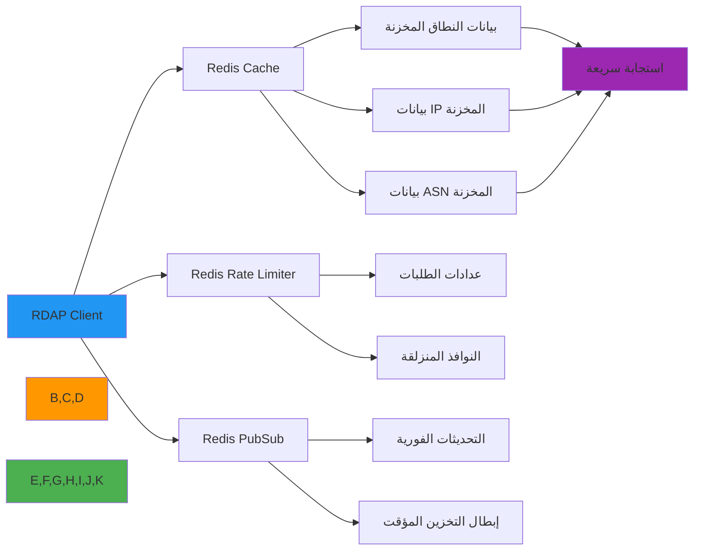

# دليل التكامل مع Redis

**الغرض**: دليل شامل لتكامل RDAPify مع Redis للتخزين المؤقت عالي الأداء وتحديد معدل الطلبات الموزع ومعالجة البيانات الفورية مع أمان على مستوى المؤسسات
**ذو صلة**: [Docker](deployment/docker.md) | [Express.js](express.md) | [Fastify](fastify.md) | [Cloudflare Workers](cloudflare-workers.md) | [Kubernetes](cloud/kubernetes.md)
**وقت القراءة**: 6 دقائق

## لماذا Redis لتطبيقات RDAP؟

يوفر Redis مخزن البيانات في الذاكرة المثالي لمعالجة بيانات RDAP مع المزايا الرئيسية التالية:



### مزايا تكامل Redis الرئيسية:
- **تخزين مؤقت خاطف**: أوقات استجابة بالميلي ثانية لاستعلامات RDAP المخزنة
- **تحديد معدل موزع**: منع حظر السجل مع التحكم الدقيق في الطلبات
- **إبطال التخزين المؤقت**: تحديثات فورية عند تغيّر بيانات التسجيل
- **كفاءة الذاكرة**: إخلاء LRU تلقائي لمنع نفاد الذاكرة
- **خيارات الثبات**: تكوين لقطات RDB أو تسجيل AOF لاسترداد التخزين المؤقت
- **التوافر العالي**: دعم Redis Cluster و Sentinel للنشر بدون توقف
- **التوزيع الجغرافي**: وحدات Redis مثل RedisGears لاستراتيجيات التخزين المؤقت المدركة للموقع

## البدء: التكامل الأساسي

### 1. التثبيت والتبعيات
```bash
# تثبيت التبعيات الأساسية
npm install rdapify ioredis
# أو
yarn add rdapify ioredis
# أو
pnpm add rdapify ioredis
```

### 2. إعداد عميل Redis
```typescript
// lib/redis.ts
import { Redis } from 'ioredis';
import { createClient } from 'redis'; // For Redis 4.x+

interface RedisConfig {
  host: string;
  port: number;
  password?: string;
  tls?: boolean;
  db?: number;
  maxRetriesPerRequest?: number;
  retryStrategy?: (times: number) => number | null;
  connectionName?: string;
  enableOfflineQueue?: boolean;
  enableReadyCheck?: boolean;
}

export class RedisManager {
  private static instance: RedisManager;
  private redis: Redis;
  private config: RedisConfig;

  private constructor() {
    this.config = this.loadConfig();
    this.redis = this.createRedisClient();
    this.setupEventHandlers();
  }

  public static getInstance(): RedisManager {
    if (!RedisManager.instance) {
      RedisManager.instance = new RedisManager();
    }
    return RedisManager.instance;
  }

  private loadConfig(): RedisConfig {
    return {
      host: process.env.REDIS_HOST || 'localhost',
      port: parseInt(process.env.REDIS_PORT || '6379'),
      password: process.env.REDIS_PASSWORD,
      tls: process.env.REDIS_TLS === 'true',
      db: parseInt(process.env.REDIS_DB || '0'),
      maxRetriesPerRequest: 3,
      retryStrategy: (times) => {
        if (times > 10) {
          console.error('Redis: تجاوز الحد الأقصى لمحاولات إعادة الاتصال');
          return null;
        }
        return Math.min(times * 100, 3000);
      },
      connectionName: 'rdapify-client',
      enableOfflineQueue: false,
      enableReadyCheck: true
    };
  }

  private createRedisClient(): Redis {
    return new Redis({
      ...this.config,
      lazyConnect: true
    });
  }

  private setupEventHandlers(): void {
    this.redis.on('connect', () => console.log('Redis: اتصال ناجح'));
    this.redis.on('ready', () => console.log('Redis: جاهز لقبول الأوامر'));
    this.redis.on('error', (err) => console.error('Redis error:', err));
    this.redis.on('close', () => console.warn('Redis: تم إغلاق الاتصال'));
    this.redis.on('reconnecting', () => console.log('Redis: جارٍ إعادة الاتصال...'));
  }

  public getClient(): Redis {
    return this.redis;
  }

  public async connect(): Promise<void> {
    await this.redis.connect();
  }

  public async disconnect(): Promise<void> {
    await this.redis.quit();
  }
}
```

### 3. تكامل RDAPify مع Redis
```typescript
// lib/rdap-with-redis.ts
import { RDAPClient } from 'rdapify';
import { RedisManager } from './redis';

const redis = RedisManager.getInstance();
const rdap = new RDAPClient({
  cache: false, // سنتولى التخزين المؤقت يدوياً
  privacy: true,
  allowPrivateIPs: false,
  validateCertificates: true,
  timeout: 5000
});

const CACHE_TTL = {
  domain: 3600,    // ساعة واحدة
  ip: 1800,        // 30 دقيقة
  asn: 7200        // ساعتان
};

export async function lookupDomainWithCache(domain: string) {
  const cacheKey = `rdap:domain:${domain}`;
  const client = redis.getClient();

  // التحقق من التخزين المؤقت أولاً
  const cached = await client.get(cacheKey);
  if (cached) {
    return { ...JSON.parse(cached), _cached: true };
  }

  // جلب من RDAP
  const result = await rdap.domain(domain);

  // تخزين في Redis
  await client.setex(cacheKey, CACHE_TTL.domain, JSON.stringify(result));

  return { ...result, _cached: false };
}

export async function lookupIPWithCache(ip: string) {
  const cacheKey = `rdap:ip:${ip}`;
  const client = redis.getClient();

  const cached = await client.get(cacheKey);
  if (cached) {
    return { ...JSON.parse(cached), _cached: true };
  }

  const result = await rdap.ip(ip);
  await client.setex(cacheKey, CACHE_TTL.ip, JSON.stringify(result));

  return { ...result, _cached: false };
}
```

## تحديد معدل الطلبات الموزع

### 1. تحديد معدل النافذة المنزلقة
```typescript
// lib/rate-limiter.ts
import { Redis } from 'ioredis';

export class RDAPRateLimiter {
  constructor(
    private readonly redis: Redis,
    private readonly maxRequests: number = 100,
    private readonly windowMs: number = 60000
  ) {}

  async isAllowed(identifier: string): Promise<{ allowed: boolean; remaining: number; resetTime: number }> {
    const now = Date.now();
    const windowStart = now - this.windowMs;
    const key = `ratelimit:${identifier}`;

    const pipeline = this.redis.pipeline();

    // إزالة الطلبات القديمة خارج النافذة
    pipeline.zremrangebyscore(key, 0, windowStart);

    // إضافة الطلب الحالي
    pipeline.zadd(key, now, `${now}-${Math.random()}`);

    // حساب عدد الطلبات في النافذة
    pipeline.zcard(key);

    // تعيين انتهاء الصلاحية
    pipeline.pexpire(key, this.windowMs);

    const results = await pipeline.exec();
    const requestCount = results?.[2]?.[1] as number || 0;

    const allowed = requestCount <= this.maxRequests;
    const remaining = Math.max(0, this.maxRequests - requestCount);
    const resetTime = now + this.windowMs;

    return { allowed, remaining, resetTime };
  }
}
```

### 2. إبطال التخزين المؤقت عبر PubSub
```typescript
// lib/cache-invalidation.ts
import { Redis } from 'ioredis';

export class CacheInvalidationManager {
  private publisher: Redis;
  private subscriber: Redis;

  constructor(redisConfig: object) {
    this.publisher = new Redis(redisConfig);
    this.subscriber = new Redis(redisConfig);
    this.setupSubscriber();
  }

  private setupSubscriber(): void {
    this.subscriber.subscribe('rdap:cache:invalidate', (err) => {
      if (err) console.error('فشل في الاشتراك:', err);
    });

    this.subscriber.on('message', async (channel, message) => {
      if (channel === 'rdap:cache:invalidate') {
        const { type, key } = JSON.parse(message);
        console.log(`إبطال التخزين المؤقت: ${type}:${key}`);
        await this.publisher.del(`rdap:${type}:${key}`);
      }
    });
  }

  async invalidateDomain(domain: string): Promise<void> {
    await this.publisher.publish(
      'rdap:cache:invalidate',
      JSON.stringify({ type: 'domain', key: domain })
    );
  }

  async invalidateIP(ip: string): Promise<void> {
    await this.publisher.publish(
      'rdap:cache:invalidate',
      JSON.stringify({ type: 'ip', key: ip })
    );
  }
}
```

## Redis Cluster للإنتاج

### 1. إعداد Redis Cluster
```typescript
// lib/redis-cluster.ts
import { Cluster } from 'ioredis';

export function createRedisCluster() {
  const cluster = new Cluster(
    [
      { host: process.env.REDIS_NODE_1 || 'redis-1', port: 6379 },
      { host: process.env.REDIS_NODE_2 || 'redis-2', port: 6379 },
      { host: process.env.REDIS_NODE_3 || 'redis-3', port: 6379 }
    ],
    {
      redisOptions: {
        password: process.env.REDIS_PASSWORD,
        tls: process.env.REDIS_TLS === 'true' ? {} : undefined
      },
      clusterRetryStrategy: (times) => {
        if (times > 5) return null;
        return Math.min(times * 200, 2000);
      },
      enableReadyCheck: true,
      maxRedirections: 16,
      retryDelayOnFailover: 100
    }
  );

  cluster.on('error', (err) => console.error('Redis Cluster error:', err));
  cluster.on('ready', () => console.log('Redis Cluster جاهز'));

  return cluster;
}
```

### 2. Redis Sentinel للتوافر العالي
```typescript
// lib/redis-sentinel.ts
import { Redis } from 'ioredis';

export function createRedisSentinel() {
  return new Redis({
    sentinels: [
      { host: process.env.SENTINEL_1 || 'sentinel-1', port: 26379 },
      { host: process.env.SENTINEL_2 || 'sentinel-2', port: 26379 },
      { host: process.env.SENTINEL_3 || 'sentinel-3', port: 26379 }
    ],
    name: process.env.REDIS_MASTER_NAME || 'rdapify-master',
    password: process.env.REDIS_PASSWORD,
    sentinelPassword: process.env.SENTINEL_PASSWORD,
    role: 'master',
    failoverDetector: true
  });
}
```

## الاختبار والتحقق

### 1. اختبار تكامل Redis
```typescript
// test/redis-cache.test.ts
import { RedisManager } from '../lib/redis';
import { lookupDomainWithCache } from '../lib/rdap-with-redis';

jest.mock('rdapify');
jest.mock('ioredis');

describe('Redis RDAP Cache Integration', () => {
  let redis: ReturnType<typeof RedisManager.getInstance>;

  beforeEach(() => {
    redis = RedisManager.getInstance();
  });

  it('يجب إرجاع البيانات من التخزين المؤقت في الاستعلام الثاني', async () => {
    const mockData = { domain: 'example.com', status: ['active'] };

    // استعلام أول - من RDAP
    const result1 = await lookupDomainWithCache('example.com');
    expect(result1._cached).toBe(false);

    // استعلام ثانٍ - من Redis
    const result2 = await lookupDomainWithCache('example.com');
    expect(result2._cached).toBe(true);
  });

  it('يجب احترام TTL التخزين المؤقت', async () => {
    const client = redis.getClient();
    await lookupDomainWithCache('example.com');

    const ttl = await client.ttl('rdap:domain:example.com');
    expect(ttl).toBeGreaterThan(0);
    expect(ttl).toBeLessThanOrEqual(3600);
  });
});
```

## استكشاف المشكلات الشائعة وإصلاحها

### 1. مشكلات الاتصال
**الأعراض**: `ECONNREFUSED` أو أخطاء المهلة

**التشخيص**:
```bash
# اختبار الاتصال بـ Redis
redis-cli -h $REDIS_HOST -p $REDIS_PORT -a $REDIS_PASSWORD ping

# فحص معلومات الخادم
redis-cli info server

# مراقبة الأوامر في الوقت الفعلي
redis-cli monitor
```

**الحل**: تحقق من متغيرات البيئة وقواعد جدار الحماية وصلاحية الشهادات عند استخدام TLS.

### 2. مشكلات الذاكرة
**الأعراض**: `OOM command not allowed` أو ارتفاع استهلاك الذاكرة

**الحل**:
```bash
# ضبط سياسة إخلاء الذاكرة
redis-cli config set maxmemory 512mb
redis-cli config set maxmemory-policy allkeys-lru
```

## الوثائق ذات الصلة

| المستند | الوصف |
|----------|-------------|
| [نشر Docker](deployment/docker.md) | تشغيل Redis في حاويات |
| [تكامل Express.js](express.md) | التكامل مع Express |
| [تكامل Fastify](fastify.md) | التكامل مع Fastify |
| [Kubernetes](cloud/kubernetes.md) | Redis Cluster في Kubernetes |

## المواصفات التقنية

| الخاصية | القيمة |
|----------|-------|
| إصدار Redis | 7.x+ (موصى به) |
| مكتبة العميل | ioredis 5.x |
| دعم Cluster | Redis Cluster + Sentinel |
| دعم TLS | مدعوم |
| أقصى TTL | 86400 ثانية (24 ساعة) |
| سياسة إخلاء الذاكرة | allkeys-lru (موصى به) |
| متوافق مع GDPR | نعم - لا تخزّن بيانات PII |
| آخر تحديث | 5 ديسمبر 2025 |

> **تنبيه مهم**: لا تخزّن أبداً بيانات PII غير المُعالجة في Redis. تحقق من تطبيق إعدادات حذف البيانات في RDAPify (`privacy: true`) قبل تخزين أي نتائج RDAP. استخدم Redis الآمن (TLS + كلمة مرور) في جميع بيئات الإنتاج.

[العودة إلى التكاملات](../README.md) | [التالي: Bun](bun.md)
