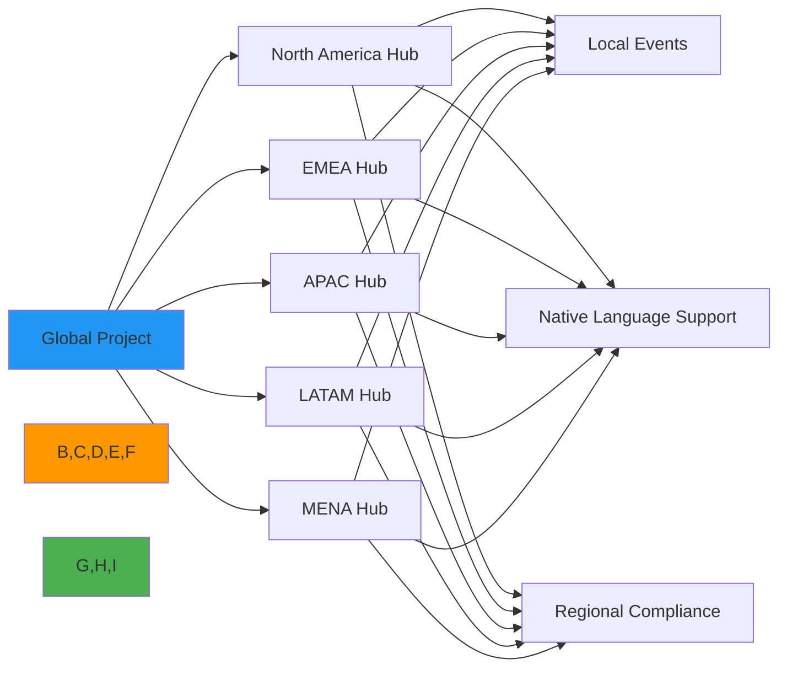
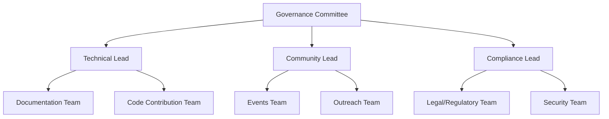
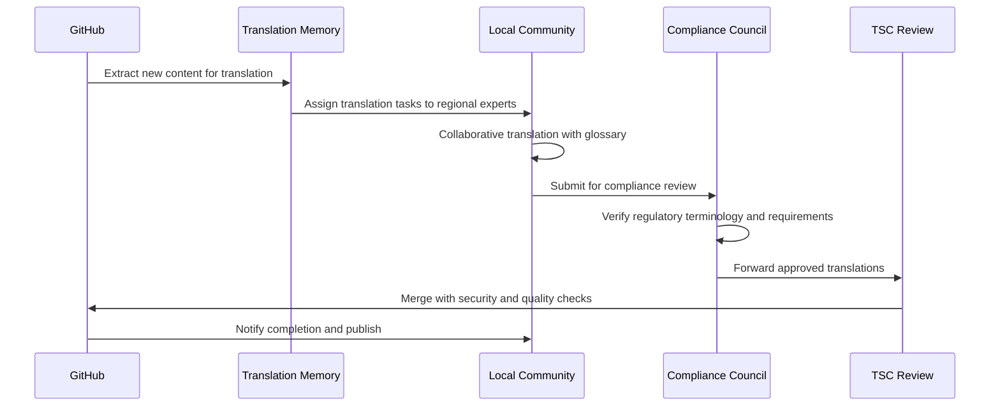
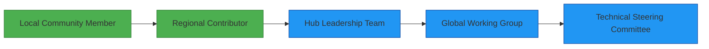

# مراكز المجتمع: بناء مجتمعات RDAPify العالمية

🎯 **الغرض**: دليل لإنشاء والمشاركة في مراكز مجتمع RDAPify الإقليمية التي تعزز التعاون وتبادل المعرفة والدعم المحلي مع الحفاظ على المعايير العالمية
📚 **متعلق**: [دليل الترجمة](translation_guide.md) | [المجتمع الصيني](chinese.md) | [المجتمع الإسباني](spanish.md) | [المجتمع الروسي](russian.md) | [المجتمع العربي](arabic.md)
⏱️ **زمن القراءة**: 7 دقائق

## 🌐 لماذا تهم مراكز المجتمع الإقليمية

تتطلب مهمة RDAPify في بناء بنية تحتية آمنة للإنترنت تحافظ على الخصوصية وجهات نظر عالمية متنوعة. تردم مراكز المجتمع الإقليمية الفجوة بين المعايير العالمية والسياقات المحلية من خلال:



### الفوائد الرئيسية لمراكز المجتمع:
✅ **دعم محلي**: مساعدة مناسبة للمنطقة الزمنية وتواصل باللغة الأم
✅ **وعي تنظيمي**: خبرة امتثال إقليمية لـ GDPR وPIPL وPDPL وأطر أخرى
✅ **السياق الثقافي**: فهم ممارسات التطوير والمتطلبات التجارية المحلية
✅ **خط إمداد المواهب**: تحديد وتوجيه المساهمين الإقليميين للمشاركة العالمية
✅ **تمثيل المعايير**: ضمان أصوات متنوعة في عمليات معايير IETF وICANN

## 🤝 إنشاء مركز مجتمع

### 1. متطلبات المركز
لكي يُعترف بمجموعتك كمركز مجتمع RDAPify رسمي، يجب أن تستوفي هذه المعايير:

| المتطلب | الوصف | طريقة التحقق |
|---------|-------|-------------|
| الحد الأدنى من الأعضاء | 15+ مطور نشط في المنطقة | استطلاع المجتمع |
| أنشطة منتظمة | اجتماعات شهرية أو تبادل المعرفة | مراجعة تقويم الفعاليات |
| دعم اللغة | توثيق/تواصل باللغة الإقليمية | مراجعة المحتوى |
| قواعد السلوك | الالتزام بـ [قواعد السلوك العالمية](../../../CODE_OF_CONDUCT.md) | وثائق الحوكمة |
| ممارسات الأمان | الامتثال لـ [معايير الأمان](../../../SECURITY.md) | مراجعة أمنية |
| الالتزام بالتنوع | إرشادات المشاركة الشاملة | وثائق السياسة |

### 2. عملية التقديم
```bash
# Step 1: Submit hub proposal
curl -X POST https://api.rdapify.dev/community/hubs \
  -H "Content-Type: application/json" \
  -d '{
    "region": "MENA",
    "country": "Saudi Arabia",
    "languages": ["ar", "en"],
    "organizers": [
      {"name": "Ahmed Al-Rashid", "github": "ahmed-rd", "email": "ahmed@example.com"}
    ],
    "proposed_activities": ["monthly-meetups", "documentation-translation", "hackathons"],
    "current_members": 23
  }'

# Step 2: Security and compliance review (7-10 business days)
# Step 3: Community Council approval
# Step 4: Official recognition and resource allocation
```

### 3. موارد المركز
تتلقى مراكز المجتمع المعتمدة:
- **الدعم المالي**: 2,500 دولار ربع سنوي للفعاليات والبنية التحتية
- **الموارد التقنية**: اعتمادات سحابية مخصصة لمشاريع المجتمع
- **أصول العلامة التجارية**: إرشادات وقوالب العلامة التجارية الرسمية لـ RDAPify
- **أدوات الحوكمة**: صلاحية الوصول إلى منصة إدارة المجتمع
- **التقدير**: قائمة مميزة على [rdapify.dev/community](https://rdapify.dev/community)
- **مسار التصعيد**: قناة مباشرة للجنة التوجيه التقني للمشكلات الإقليمية

## 🌍 هيكل المجتمع الإقليمي

### 1. نموذج قيادة المركز
كل مركز مجتمع يتبع هيكل قيادة موزع:



**الأدوار القيادية**:
- **لجنة الحوكمة (3 أعضاء)**: التوجه الاستراتيجي وتخصيص الموارد وحل النزاعات
- **القائد التقني**: جودة الكود وعمليات المساهمة والإرشاد التقني
- **قائد المجتمع**: تنظيم الفعاليات وتفاعل الأعضاء وقنوات التواصل
- **قائد الامتثال**: التوافق التنظيمي والممارسات الأمنية ومعايير الخصوصية

### 2. مجالات التركيز الإقليمية
تُؤكد مناطق مختلفة جوانب محددة من RDAPify بناءً على الاحتياجات المحلية:

| المنطقة | مجالات التركيز الأساسية | اللوائح الرئيسية | الأنشطة البارزة |
|--------|----------------------|----------------|----------------|
| **EMEA** | الامتثال مع GDPR، التكامل B2B | GDPR، توجيه NIS2 | ورش عمل هندسة الخصوصية |
| **APAC** | تحسين الأداء، الأنظمة الحكومية | PIPL (الصين)، PDPA (سنغافورة) | منتديات الامتثال الحكومي |
| **NA** | التكامل السحابي، تبني المؤسسات | CCPA، لوائح قطاعية | أنماط هندسة السحابة |
| **LATAM** | تعليم المطورين، إمكانية الوصول | LFPDPPP (المكسيك)، LGPD (البرازيل) | برامج شراكة جامعية |
| **MENA** | إقامة البيانات، دعم اللغة العربية | PDPL (السعودية)، قانون البيانات الإماراتي | مارثونات توثيق عربية |

## 📚 أنشطة مركز المجتمع

### 1. إطار الفعاليات المنتظمة
```typescript
// hub-activities-calendar.ts
interface HubEvent {
  type: 'meetup' | 'workshop' | 'hackathon' | 'office-hours' | 'translation-sprint';
  region: string;
  languages: string[];
  frequency: 'weekly' | 'bi-weekly' | 'monthly' | 'quarterly';
  complianceRequirements: string[];
  securityClearance: 'public' | 'registered' | 'vetted';
}

const standardActivities: HubEvent[] = [
  {
    type: 'office-hours',
    region: 'global',
    languages: ['en'],
    frequency: 'weekly',
    complianceRequirements: [],
    securityClearance: 'public'
  },
  {
    type: 'translation-sprint',
    region: 'arabic',
    languages: ['ar', 'en'],
    frequency: 'monthly',
    complianceRequirements: ['saudi-pdpl', 'data-localization'],
    securityClearance: 'registered'
  },
  {
    type: 'hackathon',
    region: 'apac',
    languages: ['zh', 'ja', 'ko', 'en'],
    frequency: 'quarterly',
    complianceRequirements: ['pipl', 'data-export-controls'],
    securityClearance: 'vetted'
  }
];
```

### 2. قوالب تبادل المعرفة
تستخدم مراكز المجتمع قوالب موحدة لتبادل المعرفة بشكل متسق:

#### قالب ورشة العمل التقنية
```
# [المنطقة] ورشة عمل تقنية: [الموضوع]

## تفاصيل الجلسة
- **التاريخ/الوقت**: [المنطقة الزمنية المحلية وUTC]
- **الموقع**: [حضوري/افتراضي مع رابط آمن]
- **اللغات**: [اللغات الأساسية والثانوية]
- **علامات الامتثال**: [GDPR/PIPL/CCPA إلخ]

## أهداف التعلم
- [نتيجة تقنية قابلة للقياس 1]
- [نتيجة تقنية قابلة للقياس 2]

## المتطلبات المسبقة
- [المعرفة التقنية المطلوبة]
- [تعليمات الإعداد قبل ورشة العمل]

## جدول الأعمال
1. مقدمة في [الموضوع] (15 دقيقة)
2. اعتبارات الأمان والامتثال (20 دقيقة)
3. تمرين عملي مع حماية الخصوصية (45 دقيقة)
4. أسئلة وأجوبة مع السياق الإقليمي للامتثال (15 دقيقة)

## ما بعد ورشة العمل
- التسجيل متاح خلال 24 ساعة (بموافقة)
- مستودع كود نموذجي مع شروح أمنية
- قائمة مراجعة امتثال إقليمية خاصة بموضوع ورشة العمل
```

### 3. عملية توطين الوثائق
تتبع مراكز المجتمع عملية منظمة لترجمة الوثائق وتوطينها:



## 🔐 متطلبات الأمان والامتثال

### 1. أطر الامتثال الإقليمية
يجب أن تحافظ مراكز المجتمع على الوعي بالمتطلبات التنظيمية الإقليمية:

| المنطقة | معرفة الامتثال المطلوبة | ضوابط الأمان | قواعد التعامل مع البيانات |
|--------|----------------------|-------------|------------------------|
| **الاتحاد الأوروبي/المنطقة الاقتصادية الأوروبية** | مواد GDPR 6، 22، 30، 35 | التشفير أثناء التخزين والنقل | تقليل البيانات، تحديد الغرض |
| **الصين** | PIPL المواد 38-43، DSL | التشفير المعتمد (SM2/3/4) | توطين البيانات، تقييم الأمان |
| **منطقة MENA** | PDPL السعودي، قانون البيانات الإماراتي | وحدات مُعتمدة بـ FIPS 140-2 | المعالجة المحلية، قيود عبر الحدود |
| **أمريكا اللاتينية** | LGPD البرازيل، LFPDPPP المكسيك | TLS 1.3 كحد أدنى | إدارة الموافقة، حقوق ARCO |
| **أمريكا الشمالية** | CCPA/CPRA، لوائح قطاعية | ضوابط SOC 2 Type II | آليات عدم البيع، حقوق المستهلك |

### 2. بروتوكولات الأمان لأنشطة المجتمع
يجب أن تُطبق جميع أنشطة مركز المجتمع ممارسات الأمان الأساسية هذه:

```yaml
# community-security-standards.yml
security_standards:
  communication_channels:
    primary: matrix # Encrypted by default
    backup: signal # E2E encrypted
    public: github_discussions # Moderated

  event_security:
    virtual_meetings:
      platform: jitsi_meet # Open source, no tracking
      authentication: required
      recording_consent: explicit_opt_in
      data_retention: 30_days

  content_sharing:
    code_samples:
      security_review: mandatory
      pii_filtering: automatic
    documentation:
      compliance_review: required
      sensitive_content_marking: mandatory

  member_vetting:
    level_1: github_account_verification
    level_2: community_reference_check
    level_3: identity_verification_for_leadership
```

### 3. بروتوكول الاستجابة للحوادث
تتبع مراكز المجتمع إطار الاستجابة للحوادث هذا:

1. **الكشف والإبلاغ**:
   - الإبلاغ عن حوادث الأمان إلى `security@rdapify.com` مع تشفير PGP
   - الإبلاغ عن المشكلات الخاصة بالمجتمع إلى قائد الامتثال الإقليمي
   - جهة اتصال طارئة 24/7 متاحة للحوادث الحرجة

2. **الاحتواء**:
   - عزل فوري للأنظمة أو الاتصالات المتأثرة
   - تعليق مؤقت للأنشطة العامة إذا لزم
   - الحفاظ على الأدلة وفق سلسلة الحضانة

3. **التقييم والتواصل**:
   - تحليل التأثير بواسطة فريق الأمان العالمي وقائد الامتثال الإقليمي
   - إشعار المستخدمين خلال 72 ساعة إذا تأثرت البيانات الشخصية
   - تقرير حادث شفاف (مجهول الهوية) للمجتمع خلال 14 يومًا

4. **المعالجة**:
   - تدريب إلزامي لأعضاء المجتمع المتأثرين
   - تنفيذ ضوابط تقنية مع التحقق
   - خطة تحسين العملية لمنع التكرار

## 🏆 التقدير ومسار النمو

### 1. مستويات تقدير المساهمين
تُطبق مراكز المجتمع نظام تقدير متدرج:

| المستوى | المتطلبات | الفوائد | دورة المراجعة |
|--------|----------|---------|--------------|
| **مستكشف** | أول مساهمة، حضور 3 فعاليات | شارة رقمية، حزمة ترحيب | فوري |
| **باني** | 5+ مساهمات، مشاركة منتظمة في الفعاليات | بضائع إقليمية، دعم ذو أولوية | ربع سنوي |
| **راعٍ** | 15+ مساهمة، إرشاد 3+ أعضاء | دعم مؤتمر (500$)، مراقبة لجنة التوجيه | نصف سنوي |
| **سفير** | 30+ مساهمة، دور قيادي في المركز | دعوة لقمة عالمية، صلاحية ميزانية مخصصة | سنوي |

### 2. مسار المشاركة العالمية
يتبع أعضاء مركز المجتمع مسار التطور هذا نحو المشاركة العالمية:



**المعالم الرئيسية**:
- **مساهم إقليمي**: مساهمات متسقة في الكود/الوثائق مع السياق الإقليمي
- **قيادة المركز**: قيادة موثَّقة في تنظيم الفعاليات وإرشاد الأعضاء
- **مجموعة العمل العالمية**: المشاركة في المبادرات عبر الإقليمية (الأمان والأداء إلخ)
- **لجنة التوجيه التقني**: مسؤوليات التوجه الاستراتيجي والحوكمة

### 3. مقاييس تأثير المجتمع
تُقاس المساهمات باستخدام مقاييس متوازنة تُقدِّر أشكال المشاركة المتنوعة:

```typescript
// impact-metrics.ts
interface ContributionMetrics {
  // Technical contributions
  codeQuality: number;      // PR reviews, code complexity reduction
  documentationImpact: number; // Reads, translation quality, examples added
  issueResolution: number;  // Bugs fixed, support questions answered

  // Community building
  mentorshipHours: number;  // Hours spent mentoring new contributors
  eventOrganization: number; // Events organized, attendance growth
  inclusionEfforts: number; // Activities supporting underrepresented groups

  // Standards participation
  regulatoryInsights: number; // Regional compliance contributions
  standardsFeedback: number;  // IETF/ICANN participation and feedback
  securityReports: number;    // Vulnerability reports and fixes
}

// Weighted scoring that values community building equally with code
function calculateImpactScore(metrics: ContributionMetrics): number {
  return (
    (metrics.codeQuality * 0.25) +
    (metrics.documentationImpact * 0.20) +
    (metrics.mentorshipHours * 0.30) +  // Higher weight for community building
    (metrics.regulatoryInsights * 0.25)
  );
}
```

## 🤲 الانضمام إلى مركز أو إنشاء مركز جديد

### 1. إيجاد المراكز الموجودة
```bash
# List active community hubs
curl https://api.rdapify.dev/community/hubs

# Example response
{
  "hubs": [
    {
      "id": "emea-01",
      "name": "RDAPify EMEA Community",
      "region": "Europe/Middle East/Africa",
      "languages": ["en", "fr", "de", "es", "ar"],
      "members": 342,
      "next_event": "2025-12-15T18:00:00Z",
      "contact": "emea-community@rdapify.com"
    },
    {
      "id": "apac-03",
      "name": "RDAPify China Community",
      "region": "Asia Pacific",
      "languages": ["zh", "en"],
      "members": 287,
      "next_event": "2025-12-10T09:00:00+08:00",
      "contact": "china-community@rdapify.com"
    }
  ]
}
```

### 2. إنشاء مركز جديد
لإنشاء مركز مجتمع جديد:

1. **جمع مجتمع أولي قابل للتطبيق**:
   - حدد 10+ مطور مهتم في منطقتك
   - استضف اجتماعًا افتراضيًا أوليًا لقياس الاهتمام
   - وثّق الاحتياجات الإقليمية واعتبارات الامتثال

2. **تقديم المقترح**:
   - أكمل [نموذج طلب مركز المجتمع](https://forms.rdapify.dev/community-hub-application)
   - أدرج تحليل المشهد التنظيمي الإقليمي
   - قدّم بيانات اعتماد فريق القيادة ومسؤولياتهم

3. **مراجعة الأمان والامتثال**:
   - خضع للتدريب الأمني لقيادة المركز
   - راجع المتطلبات التنظيمية الإقليمية مع فريق الامتثال العالمي
   - أسّس إجراءات الاستجابة للحوادث الخاصة بمنطقتك

4. **الإطلاق والنمو**:
   - احصل على موارد بداية وإرشاد من المراكز المعتمدة
   - طبّق أهداف نمو ربع سنوية ومقاييس التأثير
   - شارك في اجتماعات تنسيق المجتمع العالمية

## 💬 الاتصال والدعم

### 1. دليل مراكز المجتمع
| المنطقة | قائد المركز | جهة الاتصال | وقت الاجتماع |
|--------|-----------|-----------|------------|
| **EMEA** | Maria Schmidt | emea-community@rdapify.com | الخميس 17:00 UTC |
| **أمريكا الشمالية** | James Rodriguez | na-community@rdapify.com | الأربعاء 19:00 UTC |
| **APAC** | Wei Zhang | apac-community@rdapify.com | الثلاثاء 08:00 UTC |
| **أمريكا اللاتينية** | Sofia Mendez | latam-community@rdapify.com | الاثنين 20:00 UTC |
| **MENA** | Ahmed Al-Farsi | mena-community@rdapify.com | الأحد 16:00 UTC |

### 2. الموارد المجتمعية العالمية
- **مجلس المجتمع**: `community-council@rdapify.com`
- **ساعات عمل الامتثال**: `compliance-office-hours@rdapify.com`
- **تنسيق الأمان**: `security-community@rdapify.com`
- **جهة الاتصال الطارئة**: `community-emergency@rdapify.com` (مشفرة بـ PGP)

### 3. الفعاليات العالمية القادمة
- **القمة السنوية للمجتمع**: 15-17 يونيو 2026 (برلين، ألمانيا)
- **مارثون التوثيق العالمي**: 12-14 يناير 2026 (افتراضي)
- **سلسلة ورش عمل أفضل ممارسات الأمان**: ربع سنوي بدءًا من يناير 2026
- **تدريب المشاركة في المعايير**: 8-9 أبريل 2026 (افتراضي)

## 📜 الحوكمة والسياسات

### 1. متطلبات ميثاق مركز المجتمع
يجب على جميع المراكز المعترف بها رسميًا الاحتفاظ بوثيقة ميثاق تتضمن:

```yaml
hub_charter:
  mission_statement: "Clear purpose aligned with global RDAPify mission"
  governance_structure:
    - leadership_roles_and_responsibilities
    - decision_making_processes
    - conflict_resolution_procedures
  compliance_framework:
    - regional_regulatory_requirements
    - security_standards
    - data_handling_procedures
  participation_guidelines:
    - code_of_conduct_enforcement
    - inclusive_participation_policies
    - accessibility_standards
  resource_management:
    - budget_allocation_process
    - equipment_and_infrastructure_policies
    - reporting_requirements
```

### 2. متطلبات الشفافية المالية
يجب على المراكز المتلقية للتمويل:
- الاحتفاظ بتتبع شفاف للمصروفات مع تقارير ربع سنوية
- استخدام برامج محاسبة مخصصة مع سير عمل الموافقة
- الخضوع لمراجعة مالية سنوية من لجنة المالية العالمية
- الكشف عن الرعايات وتضارب المصالح المحتمل
- اتباع سياسات المشتريات للمعدات والخدمات

### 3. عملية المراجعة السنوية
يخضع كل مركز مجتمع لمراجعة سنوية تشمل:
- **مقاييس النمو**: عدد الأعضاء ومعدلات المشاركة وخط إمداد المساهمين الجدد
- **حالة الامتثال**: الممارسات الأمنية والتوافق التنظيمي وتاريخ الحوادث
- **تقييم التأثير**: المساهمات التقنية وجودة التوثيق وصحة المجتمع
- **استخدام الموارد**: كفاءة الميزانية واستخدام البنية التحتية وفعالية الأدوات
- **التوافق الاستراتيجي**: التقدم في الأهداف الإقليمية والتعاون العالمي والمشاركة في المعايير

## 🏷️ المواصفات

| الخاصية | القيمة |
|---------|--------|
| الحد الأدنى لحجم المركز | 15 عضو نشط |
| القيادة المطلوبة | لجنة حوكمة من 3 أشخاص |
| التدريب الأمني | شهادة سنوية مطلوبة |
| مراجعة الامتثال | تحديثات توثيق ربع سنوية |
| الرقابة المالية | تقارير ربع سنوية، تدقيق سنوي |
| التنسيق العالمي | اجتماعات شهرية لقيادة المراكز |
| دورة التقدير | تقدير مساهمين ربع سنوي |
| الاستجابة للحوادث | بروتوكول 24 ساعة للحوادث الحرجة |
| آخر تحديث للسياسة | 7 ديسمبر 2025 |

> 🔐 **تذكير حرج**: يجب على قادة مركز المجتمع إكمال التدريب على الوعي الأمني وتوقيع [اتفاقية أمان المجتمع](../../../security/community-agreement.md) قبل الوصول إلى أي موارد ذات امتياز. يجب أن تتبع جميع أنشطة المجتمع مبدأ "الخصوصية افتراضيًا" و"الأمان بالتصميم". المتطلبات التنظيمية الإقليمية تسمو على السياسات العالمية عندما توفر حمايات أقوى لأعضاء المجتمع.

[← العودة إلى التوطين](../README.md) | [التالي: دليل المساهمة →](../../community/contributing.md)

*المستند تم إنشاؤه تلقائيًا من مصدر الكود مع مراجعة أمنية في 7 ديسمبر 2025*
