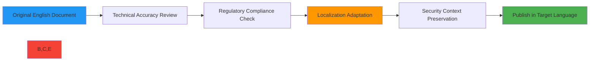
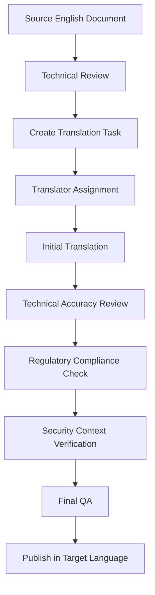

# دليل الترجمة لوثائق RDAPify

🎯 **الغرض**: دليل شامل لترجمة وثائق RDAPify مع الحفاظ على الدقة التقنية وسياق الأمان والامتثال التنظيمي في جميع اللغات المدعومة
📚 **متعلق**: [الوثائق الصينية](chinese.md) | [الوثائق الإسبانية](spanish.md) | [الوثائق الروسية](russian.md) | [الوثائق العربية](arabic.md) | [مراكز المجتمع](community_hubs.md)
⏱️ **زمن القراءة**: 8 دقائق

## 🌐 لماذا تهم جودة الترجمة في RDAPify

يعالج RDAPify بيانات تسجيل حساسة عبر اختصاصات قضائية عالمية ذات متطلبات تنظيمية متباينة. الترجمات عالية الجودة ليست مجرد تمارين لغوية — إنها مكونات أمنية وامتثالية بالغة الأهمية.



### مجالات التأثير الحرجة للترجمة:
✅ **الآثار الأمنية**: الإرشادات الأمنية المترجمة خطأً قد تؤدي إلى ثغرات
✅ **الامتثال التنظيمي**: قوانين GDPR وCCPA وحماية البيانات المحلية تتطلب مصطلحات دقيقة
✅ **الدقة التقنية**: يجب أن تظل مصطلحات بروتوكول RDAP متسقة عبر اللغات
✅ **ثقة المستخدم**: الترجمات الاحترافية تبني الثقة في التعامل مع بيانات التسجيل الحساسة
✅ **تجربة المطور**: الوثائق الواضحة تُقلل أخطاء التنفيذ لدى الفرق العالمية

## 📝 مبادئ الترجمة العامة

### 1. الدقة التقنية فوق الجودة الأدبية
**الأولوية**: الدقة التقنية > الصحة النحوية > الأناقة الأدبية

```markdown
✅ CORRECT (Technical Accuracy):
"The RDAP client automatically redacts PII (Personally Identifiable Information) according to GDPR Article 6(1)(f)."

❌ AVOID (Literary but Inaccurate):
"The RDAP client nicely hides personal details as per GDPR rules."
```

### 2. الحفاظ على سياق الأمان
يجب أن تحتفظ تحذيرات وإرشادات الأمان بإلحاحيتها وتفاصيلها التقنية:

```markdown
✅ CORRECT:
"Failure to validate certificates may expose your application to man-in-the-middle attacks."

❌ AVOID:
"It's not good to skip certificate checks."
```

### 3. الحفاظ على المصطلحات التنظيمية
يجب ترجمة المصطلحات القانونية باستخدام المصطلحات المعتمدة في الاختصاص القضائي:

| المصطلح | العربية | ملاحظات |
|---------|---------|---------|
| Personally Identifiable Information | المعلومات الشخصية المحددة للهوية | استخدم المصطلح العربي الرسمي لـ GDPR |
| Data Subject Rights | حقوق أصحاب البيانات | المصطلح الرسمي في نظام PDPL السعودي |
| Legitimate Interest | المصلحة المشروعة | مفهوم قانوني محدد في المادة 6 من GDPR |
| Data Processing | معالجة البيانات | مصطلح تقني، وليس "استخدام البيانات" |

### 4. عناصر الكود والمصطلحات التقنية
**لا تترجم أبدًا**:
- نماذج الكود وأسماء الدوال ونقاط نهاية API
- متغيرات البيئة ومفاتيح التهيئة
- رموز الأخطاء ورسائل النظام
- أسماء البروتوكولات (RDAP، HTTP، TLS)
- الاختصارات مثل PII وGDPR وCCPA (إلا إذا وُجدت ترجمات رسمية)

```markdown
✅ CORRECT:
```javascript
const client = new RDAPClient({
  privacy: true,
  validateCertificates: true
});
```

❌ AVOID:
```javascript
const client = new عميل_آر_دي_ايه_بي({
  إخفاء_المعلومات_الشخصية: true,
  التحقق_من_الشهادات: true
});
```
```

## 🔐 اعتبارات الأمان والامتثال

### 1. متطلبات ترجمة تحذيرات الأمان
يجب أن تتضمن جميع التحذيرات الأمنية:
- مؤشر واضح لدرجة الخطورة (حرج/عال/متوسط/منخفض)
- نوع الثغرة المحدد
- خطوات تخفيف دقيقة
- مراجع للمعايير أو اللوائح ذات الصلة

```markdown
### 🛑 تحذير أمني حرج
**الثغرة**: تزوير الطلبات من جانب الخادم (SSRF)
**الخطر**: قد يصل المهاجمون إلى البنية التحتية الداخلية عبر استعلامات RDAP
**التخفيف**: عيّن دائمًا `allowPrivateIPs: false` واستخدم أحدث إصدار من RDAPify
**الامتثال**: مطلوب بموجب ISO 27001:2022 A.12.4.1 وPCI DSS Requirement 6.5.10
```

### 2. توحيد مصطلحات الخصوصية
يجب أن تستخدم تعليمات التعامل مع PII (المعلومات الشخصية المحددة للهوية) مصطلحات موحدة:

| المفهوم | المصطلح المطلوب | تجنب |
|---------|----------------|------|
| Data Redaction | "تنقيح"، "إخفاء"، "إخفاء الهوية" | "إخفاء"، "حذف" |
| Data Retention | "فترة الاحتفاظ"، "دورة حياة البيانات" | "مدة الاحتفاظ بالبيانات" |
| Consent Management | "موافقة صريحة"، "اشتراك/إلغاء الاشتراك" | "إذن"، "سماح/رفض" |
| Data Subject Rights | "طلب وصول"، "طلب حذف" | "تنزيل البيانات"، "حذف الحساب" |

### 3. ملاحظات الامتثال القضائي
يجب أن تتضمن الوثائق ملاحظات امتثال خاصة بالاختصاص القضائي:

```markdown
> 📌 **ملاحظة الامتثال الإقليمي للاتحاد الأوروبي**:
> بموجب المادة 22 من GDPR، يتطلب صنع القرار الآلي الذي يؤثر على أصحاب البيانات إشرافًا بشريًا. تتضمن ميزات المعالجة الدفعية في RDAPify مسارات تدقيق للامتثال لهذا المطلب.

> 📌 **ملاحظة الامتثال الإقليمي للصين**:
> تتطلب المادة 23 من PIPL موافقة منفصلة على نقل البيانات عبر الحدود. عند استخدام RDAPify مع أصحاب بيانات صينيين، فعّل `chinaComplianceMode: true` لتقييد تدفقات البيانات.
```

## 🔄 سير عمل التوطين

### 1. نظرة عامة على عملية الترجمة


### 2. الأدوات المطلوبة
- **ذاكرة الترجمة**: نحتفظ بقاعدة بيانات مصطلحات خاصة بالمشروع في [Glossary.md](../../resources/glossary.md)
- **منصة التعاون**: تُدار جميع الترجمات عبر [مشروع RDAPify على Crowdin](https://crowdin.com/project/rdapify)
- **أدوات التحقق**:
  - `npm run validate:translation -- --language=es` (مثال إسباني)
  - `npm run security:check-translation -- --file=docs/localization/spanish.md`
- **الاختبار المرئي**: معاينة الترجمات في [ملعب الوثائق](../../playground/translation-preview.md)

### 3. استراتيجية التحكم في الإصدارات
تتبع جميع الترجمات الإصدار الدلالي متوافقًا مع التوثيق الإنجليزي:
- تغييرات الإصدار الرئيسي (`2.0` → `3.0`) تتطلب إعادة ترجمة كاملة
- تغييرات الإصدار الثانوي (`2.1` → `2.2`) تتطلب مراجعة الأقسام المتغيرة
- تغييرات إصدار التصحيح (`2.1.3` → `2.1.4`) تتطلب التحقق من إصلاحات الأمان

استراتيجية التفريع:
```bash
# For major translation updates
git checkout -b localize/v3.0/es

# For minor updates
git checkout -b localize/v0.1.8/ru

# For urgent security fixes
git checkout -b localize/security-fix/ar
```

## 🧪 عمليات ضمان الجودة

### 1. قائمة مراجعة الدقة التقنية
يجب أن تجتاز كل ترجمة هذا التحقق:

| الفحص | طريقة التحقق | معيار الاجتياز |
|-------|------------|----------------|
| سلامة نماذج الكود | التحقق الآلي من الصياغة | جميع نماذج الكود تُنفَّذ بدون أخطاء |
| اتساق API | المقارنة مع وثائق API | جميع مراجع API تتطابق مع التنفيذ الحالي |
| مصطلحات البروتوكول | مقارنة RFC من IETF | مصطلحات RDAP تتوافق مع RFC 7480-7484 |
| سياق الأمان | مراجعة فريق الأمان | لا إضعاف لإرشادات أو تحذيرات الأمان |
| دقة الامتثال | تحقق الفريق القانوني | المراجع التنظيمية تتطابق مع المتطلبات المحلية |

### 2. مراجعة ترجمة الأمان
يتطلب محتوى الأمان الحرج مراجعة إضافية:
1. عضو في فريق الأمان يُتقن اللغة الهدف
2. مقارنة مع مصطلحات إطار MITRE ATT&CK
3. التحقق من ترجمات OWASP Top 10 للاتساق
4. المراجعة المقطعية مع مصطلحات قاعدة بيانات ثغرات CERT

```markdown
🔍 **قائمة مراجعة الأمان**:
- [ ] جميع مستويات خطورة الثغرات محفوظة (حرج/عال/متوسط/منخفض)
- [ ] لا مصطلحات أمنية مخففة أو منقوصة في الترجمة
- [ ] سيناريوهات الهجوم موصوفة بدقة تقنية مناسبة
- [ ] خطوات التخفيف تظل قابلة للتنفيذ وكاملة
- [ ] مراجع الامتثال محققة مقابل اللوائح المحلية
```

### 3. أدوات التحقق الآلية
شغّل أوامر التحقق هذه قبل تقديم الترجمات:

```bash
# Validate all Spanish translations
npm run validate:translation -- --language=es

# Check security terminology in Chinese documentation
npm run security:check-translation -- --language=zh --file=docs/security/whitepaper.md

# Verify regulatory compliance terms in Russian
npm run compliance:check -- --language=ru --jurisdiction=russia

# Preview Arabic translation with RTL support
npm run preview:translation -- --language=ar --file=docs/getting-started/quick_start.md
```

## 🌍 إرشادات خاصة بكل لغة

### 1. لغات من اليمين إلى اليسار (العربية، الفارسية)
اعتبارات خاصة للغات RTL:

```html
<!-- Correct RTL document structure -->
<div dir="rtl" lang="ar">
  <p>يتضمن هذا المستند إرشادات تقنية حول بروتوكول RDAP</p>
  <div class="code-sample" dir="ltr">
    <code>const client = new RDAPClient({ privacy: true });</code>
  </div>
</div>
```

**إرشادات RTL الرئيسية**:
- المحتوى المختلط يتطلب علامات اتجاه صريحة للكود والمصطلحات التقنية
- الأرقام والتواريخ تتبع التنسيق الغربي (1,2,3 وليس ١,٢,٣)
- عناصر التنقل في المستند يجب أن تكون معكوسة (قوائم محاذاة للاليمين)
- المخططات تتطلب تكييفًا لـ RTL (اتجاهات الأسهم والتدفق معكوسة)
- أيقونات الأمان يجب أن تظل متسقة (⚠️، 🔒، 🛡️ لها معنى عالمي)

### 2. لغات CJK (الصينية، اليابانية، الكورية)
اعتبارات خاصة للغات CJK:
- المصطلحات التقنية كثيرًا ما تتطلب ملاحظات توضيحية
- يجب أن يكون ترميز الأحرف UTF-8 بدون BOM
- ينبغي زيادة تباعد الأسطر بمقدار 1.5x للقراءة
- يجب استخدام علامات الترقيم بعرض كامل حيثما ينبغي
- تعليقات الكود في الأمثلة تبقى بالإنجليزية مع تفسيرات CJK أدناها

```markdown
✅ CORRECT (Chinese example):
```javascript
// 创建RDAP客户端 with security defaults
// 创建 = create, with = 使用, security defaults = 安全默认设置
const client = new RDAPClient({
  privacy: true, // 自动隐藏个人身份信息
  timeout: 5000    // 5秒超时
});
```
```

### 3. اللغات السلافية (الروسية، البولندية، التشيكية)
اعتبارات خاصة للغات السلافية:
- الحالات النحوية تُغيّر صيغ المصطلحات التقنية
- قواعد الجمع تختلف اختلافًا كبيرًا عن الإنجليزية
- الكلمات المركبة التقنية كثيرًا ما تتطلب واصلات
- أوجه الفعل (التام/الناقص) يجب أن تكون متسقة
- صيغة المخاطبة الرسمية أو غير الرسمية يجب أن تكون موحدة في جميع الوثائق

## 🤝 عملية المساهمة

### 1. البدء كمترجم
1. انضم إلى [مجتمع RDAPify](https://github.com/rdapify/rdapify/discussions/categories/translators)
2. أكمل [تقييم كفاءة المترجم](https://forms.rdapify.dev/translator-assessment)
3. اطلب التعيين لقسم وثيقة عبر مشكلة GitHub
4. وقّع [اتفاقية المترجم](https://github.com/rdapify/rdapify/blob/main/CONTRIBUTING.md#translation-contributors)
5. احصل على صلاحية الوصول إلى منصة إدارة الترجمة

### 2. متطلبات التقديم
يجب أن تتضمن جميع مساهمات الترجمة:

```markdown
### قالب تقديم الترجمة
**المستند**: `docs/security/whitepaper.md`
**اللغة الهدف**: الإسبانية (es)
**المترجم**: @username (موثق)
**المراجع التقني**: @tech-reviewer
**التحقق من الامتثال**: @legal-team-member
**مراجعة سياق الأمان**: @security-team-member

**ملخص التغييرات**:
- ترجمة 15 فقرة جديدة
- تحديث المصطلحات للامتثال مع GDPR
- إضافة ملاحظة امتثال إقليمية لأمريكا اللاتينية
- إصلاح مسافات بادئة لنموذج الكود في القسم 3.2

**نتائج التحقق**:
- [x] الدقة التقنية محققة
- [x] سياق الأمان محفوظ
- [x] مصطلحات الامتثال مُصادق عليها
- [x] الاختبارات الآلية نجحت
```

### 3. عملية المراجعة والاعتماد
تتبع الترجمات مراجعة رباعية المراحل:

1. **المراجعة التقنية** (72 ساعة):
   - صحة نماذج الكود
   - دقة مراجع API
   - اتساق مصطلحات البروتوكول

2. **مراجعة سياق الأمان** (48 ساعة):
   - الحفاظ على شدة تحذيرات الأمان
   - وصف سيناريوهات الهجوم بشكل صحيح
   - خطوات التخفيف تظل قابلة للتنفيذ

3. **التحقق من الامتثال** (72 ساعة):
   - التحقق من المراجع التنظيمية
   - معالجة المتطلبات القضائية
   - دقة تعليمات التعامل مع البيانات

4. **ضمان الجودة النهائي** (24 ساعة):
   - فحص القواعد الإملائية والنحوية
   - تقييم القابلية للقراءة
   - التحقق من التخطيط المرئي

## 🛠️ الأدوات والموارد

### 1. قاعدة بيانات ذاكرة الترجمة
الوصول إلى قاعدة بيانات مصطلحات المشروع:
- [Glossary.md](../../resources/glossary.md) - المصطلحات الأساسية
- [قاعدة بيانات المصطلحات الأمنية](../../security/terms-database.json) - مصطلحات خاصة بالأمان
- [دليل المراجع التنظيمية](../../compliance/jurisdiction-guide.md) - مصطلحات الامتثال الإقليمية

### 2. أدوات مساعدة الترجمة المرئية
- **أداة توطين المخططات**: `npm run localize:diagrams -- --language=zh`
- **وضع معاينة RTL**: `npm run preview:rtl -- --language=ar`
- **مدقق المصطلحات**: `npm run check:terms -- --language=ru --file=docs/api-reference/client.md`

### 3. قنوات دعم المجتمع
- **ساعات عمل المترجمين الأسبوعية**: الخميس 14:00 UTC على [Zoom](https://rdapify.dev/community/office-hours)
- **المساعدة الفورية**: [قناة Matrix/Element](https://matrix.to/#/#rdapify-translators:matrix.org)
- **لقاءات المترجمين الإقليمية**: تجمعات افتراضية شهرية لكل مجتمع لغوي
- **إصلاحات الأمان الطارئة**: قناة أولوية مخصصة لتحديثات الوثائق الأمنية العاجلة

## 📖 إدارة المسرد

### 1. عملية تقديم المصطلحات
يجب تقديم المصطلحات التقنية الجديدة إلى المسرد:

```json
{
  "term": "SSRF Protection",
  "en": "Server-Side Request Forgery Prevention",
  "es": "Prevención de Falsificación de Solicitud en el Lado del Servidor",
  "zh": "服务器端请求伪造防护",
  "ru": "Защита от подделки запросов на стороне сервера",
  "ar": "حماية من تزوير الطلبات من جانب الخادم",
  "category": "security",
  "rfc_reference": "RFC 7484 Section 5.3",
  "context_example": "RDAPify implements SSRF protection by blocking queries to private IP ranges."
}
```

### 2. سير عمل اعتماد المصطلحات
1. تقديم المصطلح عبر مشكلة GitHub مع القالب
2. اللجنة التقنية تتحقق من التوافق مع RFC/المعيار
3. فريق الأمان يعتمد المصطلحات الأمنية
4. الفريق القانوني يتحقق من مصطلحات الامتثال
5. إضافة المصطلح إلى المسرد مع تتبع الإصدار
6. إشعار آلي لجميع فرق المترجمين

### 3. إصدار المصطلحات
تتبع جميع المصطلحات الإصدار الدلالي:
- الإصدار الرئيسي (3.0 → 4.0): معنى المصطلح تغيّر بشكل جوهري
- الإصدار الثانوي (3.1 → 3.2): سياق أو أمثلة إضافية مُضافة
- إصدار التصحيح (3.1.4 → 3.1.5): إصلاح أخطاء مطبعية أو توضيحات

```markdown
> 📌 **إشعار إصدار المسرد**
> تم تحديث مصطلح "تنقيح PII" في الإصدار 0.1.8 من المسرد لتوضيح التعامل مع عناوين IP بموجب GDPR. يجب تحديث جميع الترجمات قبل إصدار الوثائق التالي.
```

## 📞 الاتصال والدعم

### 1. جهات اتصال فريق الترجمة
| الدور | الاتصال | وقت الاستجابة |
|-------|---------|--------------|
| قائد الترجمة العالمي | translations@rdapify.com | 24 ساعة عمل |
| منسق المراجعة التقنية | tech-review@rdapify.com | 48 ساعة عمل |
| مراجع سياق الأمان | security-translations@rdapify.com | 24 ساعة للبنود الحرجة |
| متخصص الامتثال الإقليمي | compliance@rdapify.com | 72 ساعة عمل |

### 2. طلبات الترجمة الطارئة
لترجمات إصلاح الأمان العاجلة:
1. ضع علامة مشكلة GitHub بـ `security-translation-priority`
2. أدرج درجة CVSS والاختصاصات القضائية المتأثرة
3. تواصل مع security-translations@rdapify.com برسالة مشفرة بـ PGP
4. توقع ردًا خلال 4 ساعات للمشكلات الحرجة (CVSS ≥ 9.0)

### 3. الملاحظات والتحسين
أرسل ملاحظات جودة الترجمة عبر:
- [استبيان جودة الترجمة](https://forms.rdapify.dev/translation-feedback)
- مشكلات GitHub الموسومة بـ `translation-quality`
- اجتماعات مجتمع المترجمين الشهرية
- ملاحظات مباشرة لقيادة المجتمع الخاصة بكل لغة

## 🏷️ المواصفات

| الخاصية | القيمة |
|---------|--------|
| لغة المصدر الأساسية | الإنجليزية (en-US) |
| اللغات الهدف المدعومة | الصينية (zh)، الإسبانية (es)، الروسية (ru)، العربية (ar) |
| نظام ذاكرة الترجمة | Crowdin + مسرد مخصص |
| ترميز الأحرف | UTF-8 بدون BOM |
| دعم من اليمين إلى اليسار | ✅ دعم كامل للعربية |
| التحقق الآلي | ✅ أكثر من 100 فحص مصطلح تقني |
| تغطية مراجعة الأمان | ✅ جميع المحتوى الحرج |
| التحقق من الامتثال | ✅ GDPR، CCPA، PIPL، PDPL |
| تكرار التحديث | تحديثات ثنائية الأسبوع للمصطلحات |
| مقاييس الجودة | دقة تقنية >95%، درجة قابلية قراءة >90% |
| آخر تحديث | 7 ديسمبر 2025 |

> 🔐 **إشعار مسؤولية المترجم**: بوصفك مترجمًا لـ RDAPify، قد تطّلع على معلومات أمنية حساسة وتفاصيل امتثال تنظيمي. يجب على جميع المترجمين إكمال [تدريب الوعي الأمني](../../security/training.md) وتوقيع [اتفاقية السرية](../../legal/confidentiality-agreement.md) قبل الوصول إلى مواد الترجمة. لا تشارك مسودات الترجمة عبر قنوات غير آمنة.

[← العودة إلى التوطين](../README.md) | [التالي: الوثائق الصينية →](chinese.md)

*المستند تم إنشاؤه تلقائيًا من مصدر الكود مع مراجعة أمنية في 7 ديسمبر 2025*
