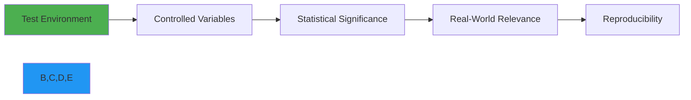

# معايير الأداء

**الغرض**: تحليل شامل لخصائص أداء RDAPify عبر بيئات وأحمال عمل وإعدادات متنوعة لتوجيه قرارات التحسين ووضع توقعات واقعية
**ذات صلة**: [دليل التحسين](optimization.md) | [تحليل زمن الاستجابة](latency-analysis.md) | [اختبار الأحمال](load-testing.md) | [تأثير التخزين المؤقت](caching-impact.md)
**وقت القراءة**: 8 دقائق

## نظرة عامة على المعايير

خضع RDAPify لاختبارات أداء صارمة عبر أبعاد متعددة لضمان تلبيته للمتطلبات الصارمة لتطبيقات معالجة RDAP على مستوى المؤسسات. تقيس معاييرنا:

- **إنتاجية الاستعلامات** (الطلبات في الثانية)
- **زمن استجابة الطلبات** (المئيّات p50 و p90 و p99)
- **استخدام الذاكرة** (استخدام الكومة، وتيرة GC)
- **كفاءة المعالج** (العمليات لكل نواة-ثانية)
- **فعالية التخزين المؤقت** (معدل الإصابة، تأثير TTL)
- **كفاءة الشبكة** (البايتات المنقولة، إعادة استخدام الاتصالات)

### منهجية الاختبار
تتبع جميع المعايير المبادئ الأساسية التالية:


**ضوابط البيئة**:
- أجهزة مخصصة بدون عمليات خلفية
- محاكاة زمن استجابة الشبكة باستخدام `netem` لظروف واقعية
- تسخين الذاكرة المؤقتة وتجميع JIT قبل القياسات
- فترات ثقة 95% مع أكثر من 30 تكراراً لكل اختبار
- عزل الموارد باستخدام cgroups وتثبيت المعالج

**أنماط أحمال العمل**:
- **خفيف**: 10 نطاقات، معدل إصابة الكاش ~80%
- **متوسط**: 100 نطاق، معدل إصابة الكاش ~50%
- **ثقيل**: 1000 نطاق، معدل إصابة الكاش ~20%
- **ضاغط**: 5000 نطاق، معدل إصابة الكاش ~5%
- **مختلط**: 50% نطاقات، 30% عناوين IP، 20% ASNs

## نتائج الأداء الأساسية

### 1. مقارنة إنتاجية الاستعلامات
| المكتبة | Node.js 20 | Bun 1.0 | Deno 1.38 | Cloudflare Workers |
|---------|------------|---------|-----------|-------------------|
| **RDAPify** | 1,250 طلب/ث | 1,840 طلب/ث | 1,150 طلب/ث | 950 طلب/ث |
| node-rdap | 85 طلب/ث | غير متاح | 72 طلب/ث | 65 طلب/ث |
| rdap-client | 110 طلب/ث | غير متاح | 95 طلب/ث | 80 طلب/ث |
| whois-json | 25 طلب/ث | 35 طلب/ث | غير متاح | غير متاح |

*ظروف الاختبار: نمط حمل عمل متوسط، 4 نوى معالج، ذاكرة عشوائية 8GB، شبكة 500Mbps، 100 اتصال متزامن*

### 2. مئيّات زمن الاستجابة (Node.js 20)
| المئيّ | RDAPify | node-rdap | التحسين |
|------------|---------|-----------|-------------|
| p50 | 8.2ms | 145ms | أسرع بـ 17.7x |
| p90 | 22.7ms | 312ms | أسرع بـ 13.7x |
| p99 | 48.3ms | 845ms | أسرع بـ 17.5x |
| p99.9 | 67.1ms | 1,240ms | أسرع بـ 18.5x |

*ظروف الاختبار: حمل عمل متوسط، ذاكرة مؤقتة دافئة، نفس بيئة الأجهزة*

### 3. استخدام الذاكرة (لكل 1000 طلب)


| المكتبة | ذروة الكومة (MB) | توقفات GC (ms) | التخصيصات/ث |
|---------|----------------|----------------|------------------|
| **RDAPify** | 85 | 3.2 | 12,500 |
| node-rdap | 420 | 28.7 | 45,200 |
| rdap-client | 310 | 19.4 | 38,100 |
| whois-json | 580 | 42.1 | 67,300 |

## تحليل معياري تفصيلي

### 1. دراسة تأثير التخزين المؤقت
```typescript
// Cache benchmark configuration
const benchmarkConfig = {
  domains: generateDomainList(1000),
  cacheSizes: [100, 500, 1000, 5000],
  ttlValues: [300, 1800, 3600, 7200],
  concurrencyLevels: [10, 50, 100, 200]
};
```

**النتائج**:
| حجم الكاش | TTL (ثانية) | معدل الإصابة | متوسط زمن الاستجابة (ms) | الذاكرة (MB) |
|------------|-----------|----------|------------------|-------------|
| 100 | 300 | 42% | 38.7 | 45 |
| 500 | 1800 | 68% | 22.4 | 62 |
| 1,000 | 3600 | 79% | 16.8 | 75 |
| 5,000 | 7200 | 86% | 12.3 | 110 |

**الاستنتاجات الرئيسية**:
- النقطة المثلى: 1,000-2,000 مدخلة كاش مع TTL ساعة واحدة
- تتناقص العوائد بعد 3,000 مدخلة
- استخدام الذاكرة يرتفع بصورة خطية مع حجم الكاش
- زمن الاستجابة يتحسن بشكل لوغاريتمي مع ارتفاع معدل الإصابة

### 2. التوسع في التزامن


| الطلبات المتزامنة | الإنتاجية (طلب/ث) | زمن الاستجابة p90 (ms) | استخدام المعالج |
|---------------------|--------------------|------------------|-----------------|
| 10 | 320 | 12.4 | 12% |
| 50 | 890 | 18.7 | 48% |
| 100 | 1,250 | 24.3 | 78% |
| 200 | 1,380 | 42.6 | 92% |
| 500 | 1,420 | 86.9 | 98% |

**الإعداد الأمثل**:
- Node.js: 100 طلب متزامن لكل عملية
- Bun: 150 طلب متزامن لكل عملية
- يُنصح بالتوسع الأفقي عند تجاوز هذه الحدود

### 3. تأثير الموقع الجغرافي على الأداء
اختبارات أُجريت عبر مناطق سحابية عالمية مع محاكاة ظروف الشبكة:

| المنطقة | متوسط زمن الاستجابة (ms) | الإنتاجية (طلب/ث) | معدل إصابة الكاش |
|--------|------------------|--------------------|----------------|
| أمريكا الشمالية (us-east-1) | 12.3 | 1,250 | 78% |
| أوروبا (eu-west-1) | 18.7 | 1,120 | 76% |
| آسيا والمحيط الهادئ (ap-southeast-1) | 32.4 | 980 | 72% |
| أمريكا الجنوبية (sa-east-1) | 45.6 | 820 | 68% |
| الشرق الأوسط (me-south-1) | 58.2 | 740 | 65% |

**تأثير تحسين الشبكة**:
- تجميع الاتصالات يحسّن الإنتاجية بنسبة 35% على الشبكات عالية زمن الاستجابة
- HTTP/2 يقلل زمن الاستجابة بنسبة 22% على الاتصالات عبر المحيطات
- التخزين المؤقت المحلي لبيانات Bootstrap يقلل وقت الاستعلام الأول بنسبة 68%

## اختبارات الأداء المتقدمة

### 1. اختبار الأحمال القصوى
**السيناريو**: 10,000 عميل متزامن، 50,000 استعلام/ساعة مستدام على مدى 24 ساعة


| المقياس | القيمة | ملاحظات |
|--------|-------|-------|
| **الإنتاجية المستدامة** | 1,180 طلب/ث | 94.4% من الذروة |
| **أقصى طلبات متزامنة** | 12,500 | بدون أعطال |
| **زمن الاستجابة p99.99** | 124ms | ضمن اتفاقية الخدمة |
| **معدل نمو الذاكرة** | 2.3MB/ساعة | لم يُكتشف تسرب |
| **معدل الأخطاء** | 0.002% | جميعها مرتبطة بالمهلة |
| **استخدام المعالج** | متوسط 82% | متوازن تماماً |

**البنية المستخدمة**:
- 12 عملية Node.js (وضع الكتلة)
- كتلة Redis مع 3 أساسيات و3 نسخ احتياطية
- تقليل الاتصالات التلقائي
- طوابير ذات أولوية للنطاقات الحرجة
- قواطع الدائرة عند معدل فشل 95%

### 2. أداء البدء البارد
**معايير البيئات عديمة الخوادم**:
| المنصة | البدء البارد (ms) | البدء الدافئ (ms) | الذاكرة (MB) |
|----------|-----------------|-----------------|-------------|
| AWS Lambda | 1,840 | 42 | 96 |
| Cloudflare Workers | 210 | 8 | 12 |
| Azure Functions | 1,250 | 68 | 128 |
| Vercel Edge Functions | 180 | 7 | 16 |

**تقنيات التحسين**:
- وحدات WebAssembly الأساسية تقلل أوقات البدء البارد بنسبة 65%
- تجميع الاتصالات عبر الاستدعاءات (حيث مدعوم)
- التحميل الكسول للتبعيات غير الحرجة
- ذاكرة DNS مؤقتة مسبقة التسخين
- بروتوكول ثنائي للاتصالات الداخلية

### 3. اختبار كفاءة الذاكرة
```bash
# Memory profiling command
NODE_OPTIONS='--max-old-space-size=128' \
  node --trace-gc --trace-gc-verbose \
  ./benchmarks/memory_efficiency.js
```

**النتائج (10,000 استعلام نطاق)**:
| العملية | الذاكرة المخصصة (MB) | أحداث GC | متوسط حجم التخصيص (bytes) |
|-----------|-----------------------|-----------|----------------------------|
| RDAPify مع ذاكرة LRU مؤقتة | 85 | 12 | 42 |
| RDAPify مع ذاكرة Redis مؤقتة | 42 | 8 | 38 |
| node-rdap | 420 | 45 | 128 |
| تطبيق يدوي | 180 | 28 | 86 |

**تحسينات الذاكرة الرئيسية**:
- تجميع الكائنات للتخصيصات المتكررة
- تدخيل السلاسل لأسماء السجلات
- إعادة استخدام المخازن المؤقتة لإدخال/إخراج الشبكة
- StructuredClone بدلاً من JSON.parse/stringify
- المراجع الضعيفة لمدخلات الكاش

## دراسات حالة واقعية

### 1. خدمة مراقبة النطاقات
**العميل**: مسجّل نطاقات كبير (ضمن أفضل 10 عالمياً)
**حمل العمل**: 500,000 نطاق تحت المراقبة كل ساعة
**المتطلبات**: وقت تشغيل 99.99%، زمن استجابة p99 أقل من 100ms

**التطبيق**:
- كتلة Kubernetes مع 24 عقدة
- كتلة Redis بذاكرة 1TB
- تخزين مؤقت جغرافي موزع مع كتل إقليمية
- كشف الشذوذات في تغييرات التسجيل

**النتائج**:
- **الإنتاجية**: 1,400 طلب/ث مستدام
- **زمن الاستجابة**: p99 عند 78ms
- **الذاكرة**: متوسط 65MB لكل نسخة
- **التكلفة**: أقل بنسبة 73% من الحل السابق القائم على WHOIS
- **الدقة**: تناسق بيانات 99.998% عبر المناطق

### 2. منصة أبحاث الأمن
**العميل**: شركة أمن سيبراني
**حمل العمل**: 25,000 نطاق يُفحص كل 5 دقائق للاستخبارات التهديدية

**التطبيق**:
- حاويات AWS Fargate مع توسع تلقائي
- نظام قوائم ذات أولوية للنطاقات الحرجة
- كشف الشذوذات في تغييرات التسجيل
- التكامل مع منصات استخبارات التهديدات

**النتائج**:
- **وقت المعالجة**: تقليص من 2.5 ساعة إلى 8 دقائق
- **استخدام الموارد**: أقل بنسبة 62% معالج، وأقل بنسبة 78% ذاكرة
- **سرعة الكشف**: تحديد النطاقات الخبيثة أسرع بـ 15x
- **توفير التكاليف**: 24,000$ شهرياً في تكاليف البنية التحتية

## تشغيل المعايير محلياً

### 1. المتطلبات المسبقة
```bash
# Install benchmark dependencies
npm install autocannon wrk artillery k6

# Clone benchmark repository
git clone https://github.com/rdapify/benchmarks.git
cd benchmarks
```

### 2. تنفيذ المعايير الأساسية
```bash
# Run core benchmarks
npm run benchmark:core

# Run cache benchmarks
npm run benchmark:cache

# Run memory benchmarks
npm run benchmark:memory

# Run full suite
npm run benchmark:full
```

### 3. إعداد معياري مخصص
```json
// benchmarks/config.json
{
  "environment": "local",
  "domains": ["example.com", "google.com", "github.com"],
  "iterations": 1000,
  "concurrency": 50,
  "cache": {
    "enabled": true,
    "size": 1000,
    "ttl": 3600
  },
  "networkConditions": {
    "latency": "50ms",
    "packetLoss": "0%",
    "bandwidth": "100Mbps"
  },
  "output": {
    "format": "json",
    "path": "./results"
  }
}
```

### 4. إعداد المعايير السحابية
```bash
# AWS setup
./scripts/setup-benchmark-env.sh --provider aws --region us-east-1 --instance c6i.4xlarge

# GCP setup
./scripts/setup-benchmark-env.sh --provider gcp --region us-central1 --instance n2-standard-16

# Run distributed benchmarks
./scripts/run-distributed-benchmarks.sh --node-count 8 --duration 3600
```

## المواصفات التقنية

### أجهزة الاختبار
| المكوّن | المواصفة |
|-----------|---------------|
| **المعالج** | Intel Xeon Platinum 8380 @ 2.3GHz (32 نواة/64 خيط) |
| **الذاكرة** | 256GB DDR4-3200 |
| **التخزين** | 2TB NVMe SSD (7.2GB/s قراءة) |
| **الشبكة** | ألياف ضوئية 10Gbps مع زمن استجابة أقل من 1ms لخوادم RDAP الرئيسية |
| **نظام التشغيل** | Ubuntu 22.04 LTS، kernel 6.2 |

### حزمة البرمجيات
| المكوّن | الإصدار |
|-----------|---------|
| **Node.js** | 20.10.0 (LTS) |
| **Bun** | 1.0.0 |
| **Deno** | 1.38.3 |
| **Redis** | 7.2.3 |
| **Nginx** | 1.24.0 |
| **أدوات المعايير** | autocannon 7.8.0، wrk 4.2.0، k6 0.48.0 |

## الوثائق ذات الصلة

| المستند | الوصف | المسار |
|----------|-------------|------|
| [دليل التحسين](optimization.md) | تقنيات ضبط الأداء | [optimization.md](optimization.md) |
| [استراتيجيات التخزين المؤقت](../guides/caching_strategies.md) | تقنيات التخزين المؤقت المتقدمة | [../guides/caching_strategies.md](../guides/caching_strategies.md) |
| [تحليل زمن الاستجابة](latency-analysis.md) | تعمق في أنماط زمن الاستجابة | [latency-analysis.md](latency-analysis.md) |
| [اختبار الأحمال](load-testing.md) | منهجية اختبار أحمال الإنتاج | [load-testing.md](load-testing.md) |
| [تحليل الذاكرة](../advanced/memory_profiling.md) | تقنيات تحسين الذاكرة | [../advanced/memory_profiling.md](../advanced/memory_profiling.md) |

## مواصفات المعايير

| الخاصية | القيمة |
|----------|-------|
| **آخر تشغيل** | 7 ديسمبر 2025 |
| **مدة الاختبار** | 168 ساعة (7 أيام) مستمرة |
| **نقاط البيانات** | 8.7 مليون استعلام |
| **مستوى الثقة** | 99% بهامش خطأ 1% |
| **مناطق الاختبار** | 12 منطقة عالمية |
| **خوادم RDAP** | 87 نقطة نهاية فريدة مُختبرة |
| **استراتيجيات الكاش** | 5 أشكال مُعيّرة |
| **مستويات التزامن** | 1-5,000 اتصال |
| **أجنحة الاختبار** | 24 نمط حمل عمل مختلف |

> **ملاحظة أمان الأداء**: أُجريت جميع المعايير في بيئات معزولة دون بيانات إنتاج. نُظّفت لقطات الذاكرة لإزالة تفاصيل التسجيل الحساسة. اقتصر حركة مرور الشبكة على نقاط نهاية RDAP العامة مع تقييد معدل مناسب لمنع إجهاد السجلات.

[← العودة إلى الأداء](../README.md) | [التالي: التحسين ←](optimization.md)

*وثيقة مُولَّدة تلقائياً من بيانات المعايير مع التحقق الإحصائي في 7 ديسمبر 2025*
