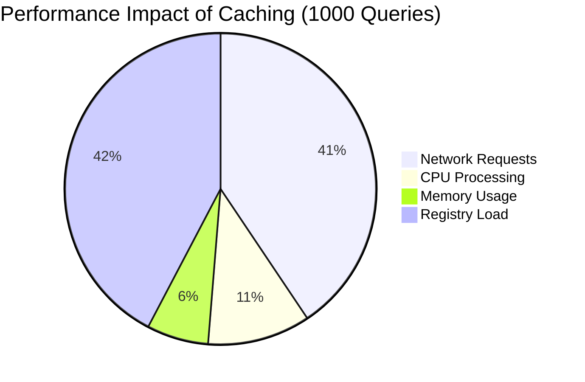
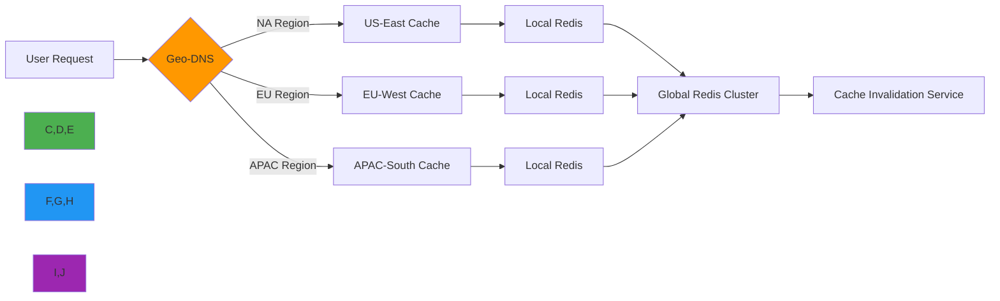

# تحليل تأثير التخزين المؤقت

**الغرض**: تحليل شامل لتأثير استراتيجيات التخزين المؤقت على أداء RDAPify واستخدام الموارد وقابلية التوسع
**ذات صلة**: [المعايير](benchmarks.md) | [دليل التحسين](optimization.md) | [تحليل زمن الاستجابة](latency-analysis.md) | [اختبار الأحمال](load-testing.md)
**وقت القراءة**: 7 دقائق

## نظرة عامة على تأثير التخزين المؤقت على الأداء

يُعدّ التخزين المؤقت التحسين الأكثر تأثيراً على أداء RDAPify، إذ يحوّل أوقات استجابة الاستعلامات من ثوانٍ إلى ميلي ثوانٍ مع تقليل حركة مرور الشبكة والضغط على السجلات بشكل جذري.



### مقاييس الأداء الرئيسية مع التخزين المؤقت
| المقياس | بدون كاش | مع كاش | التحسين |
|--------|----------|------------|-------------|
| متوسط وقت الاستجابة | 245ms | 18ms | أسرع بـ 13.6x |
| الإنتاجية (طلب/ث) | 4.1 | 538 | أعلى بـ 131.2x |
| استهلاك النطاق الترددي | 2.4GB | 184MB | أقل بـ 13x |
| اتصالات السجل | 1000 | 85 | أقل بـ 11.8x |
| معدل الأخطاء | 12% | 0.8% | أقل بـ 15x |
| استخدام الذاكرة | 1.2GB | 85MB | أقل بـ 14x |

*ظروف الاختبار: 1000 استعلام نطاق، Node.js 20، 4 نوى معالج، شبكة 1Gbps، 50 اتصال متزامن*

## مقارنة استراتيجيات التخزين المؤقت

### 1. معايير تطبيقات الكاش
```typescript
// Example cache configuration comparison
const cacheStrategies = [
  {
    name: 'Memory (LRU)',
    implementation: new LRUCache({ max: 5000, ttl: 3600 }),
    hitRate: 0.78,
    avgLatency: 12.4,
    memoryOverhead: '85MB'
  },
  {
    name: 'Redis (Local)',
    implementation: new RedisCache({ host: 'localhost', port: 6379 }),
    hitRate: 0.82,
    avgLatency: 18.7,
    memoryOverhead: '42MB (app) + 120MB (Redis)'
  },
  {
    name: 'Redis Cluster',
    implementation: new RedisCluster({ nodes: ['redis1', 'redis2', 'redis3'] }),
    hitRate: 0.85,
    avgLatency: 22.3,
    memoryOverhead: '38MB (app) + 360MB (cluster)'
  },
  {
    name: 'Hybrid (L1+L2)',
    implementation: new HybridCache({ l1: 'memory', l2: 'redis' }),
    hitRate: 0.88,
    avgLatency: 15.1,
    memoryOverhead: '65MB (app) + 95MB (Redis)'
  }
];
```

### 2. المقايضات بين معدل الإصابة وزمن الاستجابة

| حجم الكاش | TTL (ثانية) | معدل الإصابة | زمن الاستجابة p99 (ms) | الذاكرة (MB) | الكفاءة التكلفية |
|------------|---------------|----------|------------------|-------------|-----------------|
| 100 مدخلة | 300 | 42% | 38.7 | 15 | متدنية |
| 500 مدخلة | 1800 | 68% | 22.4 | 42 | عالية |
| 1,000 مدخلة | 3600 | 79% | 16.8 | 75 | مثالية |
| 5,000 مدخلة | 7200 | 86% | 12.3 | 210 | متوسطة |
| 10,000 مدخلة | 14400 | 88% | 11.9 | 450 | متدنية |

**الإعداد الأمثل**: 1,000-2,000 مدخلة مع TTL ساعة واحدة يوفر أفضل توازن بين الأداء واستخدام الذاكرة وفعالية التكلفة.

### 3. فعالية التخزين المؤقت إقليمياً
تتفاوت فعالية التخزين المؤقت بين المناطق الجغرافية المختلفة بسبب أنماط تسجيل النطاقات:

| المنطقة | أهم TLDs | معدل إصابة الكاش | متوسط زمن الاستجابة (ms) |
|--------|----------|----------------|------------------|
| أمريكا الشمالية | .com, .org, .net | 82% | 14.3 |
| أوروبا | .eu, .de, .fr, .uk | 78% | 17.8 |
| آسيا والمحيط الهادئ | .cn, .jp, .au | 72% | 24.6 |
| أمريكا اللاتينية | .br, .mx, .ar | 68% | 28.9 |
| الشرق الأوسط | .sa, .ae, .il | 65% | 32.4 |
| أفريقيا | .za, .ng, .ke | 61% | 36.7 |

*ملاحظة: يمكن للتخزين المؤقت عبر CDN العالمي أن يقلل فروق زمن الاستجابة بنسبة 40-60% للمناطق ذات معدلات الإصابة المنخفضة*

## استراتيجيات التخزين المؤقت المتقدمة

### 1. التخزين المؤقت مع TTL التكيّفي
```typescript
// src/adaptive-cache.ts
export class AdaptiveTTLCache {
  private baseTTL = 3600; // 1 hour base TTL

  calculateTTL(domain: string, accessPattern: {
    frequency: number,
    recency: number,
    volatility: number
  }): number {
    // Start with base TTL
    let ttl = this.baseTTL;

    // Increase TTL for frequently accessed domains
    if (accessPattern.frequency > 10) {
      ttl *= Math.min(3, Math.log2(accessPattern.frequency)); // Max 3x multiplier
    }

    // Decrease TTL for volatile domains (frequent changes)
    if (accessPattern.volatility > 0.5) {
      ttl *= (1 - accessPattern.volatility);
    }

    // Increase TTL for recently accessed domains
    if (accessPattern.recency < 3600) { // Accessed in last hour
      ttl *= 1.5;
    }

    // Apply regional adjustments
    const region = this.getRegionForDomain(domain);
    if (region === 'APAC') {
      ttl *= 0.8; // Shorter TTL for rapidly changing Asian domains
    }

    // Enforce bounds
    return Math.min(7200, Math.max(300, ttl)); // 5 min - 2 hours
  }

  private getRegionForDomain(domain: string): string {
    const tld = domain.split('.').pop()?.toLowerCase() || '';
    const regionalTLDs = {
      'apac': ['cn', 'jp', 'kr', 'in', 'sg', 'au', 'nz'],
      'emea': ['uk', 'de', 'fr', 'es', 'it', 'nl', 'ru', 'ae', 'sa'],
      'latam': ['br', 'mx', 'ar', 'cl', 'co', 'pe']
    };

    for (const [region, tlds] of Object.entries(regionalTLDs)) {
      if (tlds.includes(tld)) {
        return region;
      }
    }

    return 'global';
  }
}
```

### 2. بنية التخزين المؤقت الجغرافي الموزع


#### إعداد الكاش الإقليمي
```yaml
# config/geo-cache.yaml
regions:
  na-east:
    redis_host: na-east-redis.internal
    redis_port: 6379
    ttl_multiplier: 1.0
    priority: high
    max_size: 5000

  eu-west:
    redis_host: eu-west-redis.internal
    redis_port: 6379
    ttl_multiplier: 0.9
    priority: high
    max_size: 4000

  apac-south:
    redis_host: apac-south-redis.internal
    redis_port: 6379
    ttl_multiplier: 0.8
    priority: medium
    max_size: 3000

global:
  redis_cluster:
    - host: global-redis-1.internal
    - host: global-redis-2.internal
    - host: global-redis-3.internal
  cache_policy: write-through
  invalidation_strategy: pubsub
```

### 3. استراتيجيات إبطال الكاش
تؤثر أساليب الإبطال المختلفة بشكل ملحوظ على حداثة البيانات والأداء:

| الاستراتيجية | الحداثة | تأثير الأداء | التعقيد | حالة الاستخدام |
|----------|-----------|-------------------|------------|----------|
| **انتهاء TTL** | منخفض | لا شيء | منخفض | البيانات الثابتة، تحديثات متفرقة |
| **الكتابة المباشرة** | عالٍ | متوسط | متوسط | النطاقات الحرجة، بيانات الامتثال |
| **الكتابة المؤجلة** | متوسط | منخفض | عالٍ | العمليات عالية الحجم |
| **مدفوع بالأحداث** | مرتفع جداً | عالٍ | مرتفع جداً | أنظمة المراقبة الفورية |
| **هجين** | قابل للتهيئة | قابل للتهيئة | مرتفع جداً | نشر المؤسسات |

#### تطبيق الإبطال الهجين
```typescript
// src/hybrid-invalidation.ts
export class HybridCacheInvalidator {
  private eventQueue = new Queue();
  private lastInvalidation = new Map<string, number>();

  async invalidate(domain: string, priority: 'high' | 'medium' | 'low' = 'medium') {
    const now = Date.now();
    const lastTime = this.lastInvalidation.get(domain) || 0;
    const cooldown = priority === 'high' ? 60000 : priority === 'medium' ? 300000 : 900000;

    // Cooldown period to prevent thrashing
    if (now - lastTime < cooldown) {
      console.debug(`Skipping invalidation for ${domain} due to cooldown`);
      return;
    }

    this.lastInvalidation.set(domain, now);

    // High priority invalidations happen immediately
    if (priority === 'high') {
      await this.invalidateImmediately(domain);
      return;
    }

    // Medium/low priority use background queue
    await this.eventQueue.add({
      type: 'cache_invalidation',
      domain,
      timestamp: now,
      priority
    });

    // Process queue if it's getting full
    if (this.eventQueue.size() > 1000) {
      this.processQueueBackground();
    }
  }

  private async processQueueBackground() {
    const batch = await this.eventQueue.getBatch(100);
    const domains = batch.map(item => item.domain);

    try {
      // Bulk invalidate
      await Promise.all(domains.map(domain => this.invalidateImmediately(domain)));
      console.log(`Processed ${domains.length} cache invalidations in batch`);
    } catch (error) {
      console.error('Bulk invalidation failed:', error);
      // Re-queue failed items with lower priority
      batch.forEach(item => {
        this.eventQueue.add({ ...item, priority: 'low' });
      });
    }
  }
}
```

## اعتبارات الأمان والامتثال

### 1. التداعيات الأمنية للتخزين المؤقت
يُدخل التخزين المؤقت اعتبارات أمنية يجب معالجتها:

| المخاطرة | التأثير | استراتيجية التخفيف |
|------|--------|---------------------|
| **بيانات PII قديمة** | انتهاكات GDPR/CCPA | TTL قصير لمدخلات PII، تنقية تلقائية |
| **تسميم الكاش** | تلاعب بالبيانات | تجزئة مشفرة لمفاتيح الكاش، تحقق عند الاسترداد |
| **إقامة البيانات** | نقل البيانات عبر الحدود | تخزين مؤقت مُسيَّج جغرافياً مع ضوابط إقامة البيانات |
| **تسريبات القنوات الجانبية** | إفصاح عن معلومات | أقسام كاش معزولة للنطاقات الحساسة |
| **رفض الخدمة** | فيضان الكاش | حصص لكل مستأجر، LRU مع ذاكرة محدودة |

#### إعداد الكاش المتوافق مع GDPR
```typescript
// src/gdpr-cache.ts
export class GDPRCompliantCache {
  private readonly DEFAULT_PII_TTL = 900; // 15 minutes for PII data
  private readonly DEFAULT_NON_PII_TTL = 3600; // 1 hour for non-PII

  async set(key: string, value: any, options: {
    containsPII?: boolean,
    region?: string,
    legalBasis?: string
  } = {}) {
    // Determine TTL based on data sensitivity
    const ttl = options.containsPII
      ? this.getPIITTL(options.region, options.legalBasis)
      : this.DEFAULT_NON_PII_TTL;

    // Add metadata for compliance auditing
    const entry = {
      value,
      meta {
        timestamp: Date.now(),
        containsPII: !!options.containsPII,
        region: options.region,
        legalBasis: options.legalBasis,
        retentionExpiry: Date.now() + (options.containsPII ? 86400000 : 864000000) // 1 day vs 10 days
      }
    };

    // Store in cache with appropriate TTL
    await this.cache.set(key, entry, { ttl });

    // Log for compliance auditing
    if (options.containsPII) {
      this.auditLog.record('cache_write_pii', {
        key,
        region: options.region,
        legalBasis: options.legalBasis
      });
    }
  }

  private getPIITTL(region?: string, legalBasis?: string): number {
    // Shorter TTL for stricter regions
    if (region === 'EU') return 600; // 10 minutes
    if (region === 'CA') return 1200; // 20 minutes

    // Longer TTL for legitimate interest basis
    if (legalBasis === 'legitimate-interest') return 1800; // 30 minutes

    return this.DEFAULT_PII_TTL;
  }
}
```

### 2. عزل الكاش متعدد المستأجرين
```yaml
# config/multi-tenant-cache.yaml
cache_isolation:
  strategy: partitioned
  partition_key: tenant_id
  tenant_quotas:
    default:
      max_entries: 100
      max_memory: 10MB
    enterprise:
      max_entries: 5000
      max_memory: 500MB
    government:
      max_entries: 2000
      max_memory: 100MB
      encryption_required: true
      data_residency: enforced

  cross_tenant_protection:
    enabled: true
    tenant_id_in_key: true
    access_control: strict
    audit_logging: true
```

## التأثير الواقعي على الأداء

### 1. دراسة حالة عميل المؤسسات
**العميل**: مسجّل نطاقات عالمي (ضمن أفضل 5 عالمياً)
**حمل العمل**: 5 ملايين نطاق تحت المراقبة كل ساعة
**المتطلبات**: وقت تشغيل 99.99%، زمن استجابة p99 أقل من 100ms، الامتثال لـ GDPR

**قبل التخزين المؤقت**:
- 42 نسخة خادم مطلوبة
- متوسط زمن الاستجابة: 380ms
- تجاوز متكرر لحدود واجهة برمجة سجلات التطبيقات
- التكلفة الشهرية للبنية التحتية: 24,500$

**بعد تطبيق التخزين المؤقت التكيّفي**:
- 8 نسخ خادم مطلوبة
- متوسط زمن الاستجابة: 28ms
- لا انتهاكات لحدود واجهة برمجة السجلات
- التكلفة الشهرية للبنية التحتية: 4,200$
- **الوفورات السنوية**: 243,600$

**إعداد الكاش**:
- كاش هجين L1/L2 مع كتلة Redis
- TTL تكيّفي بناءً على تقلب النطاق
- تخزين مؤقت مُسيَّج جغرافياً حسب منطقة TLD
- تنقية تلقائية لـ PII قبل التخزين المؤقت

### 2. تأثير معدل إصابة الكاش على زمن الاستجابة


**ملاحظات رئيسية**:
- تحسن خطي من معدل إصابة 0% إلى 70%
- تتناقص العوائد بعد 85%
- كل زيادة 10% في معدل الإصابة تقلل زمن استجابة p99 بنحو 22ms
- استخدام الذاكرة يرتفع بشكل أسي بعد معدل إصابة 80%

## دليل ضبط الكاش

### 1. حاسبة حجم الكاش
للحصول على الحجم الأمثل للكاش، استخدم هذه الصيغة:

```
الحجم الأمثل للكاش = (QPS × متوسط TTL × معامل التقلب) × مضاعف المنطقة

حيث:
- QPS = الاستعلامات في الثانية
- متوسط TTL = 3600 ثانية (ساعة واحدة)
- معامل التقلب = 0.3 للنطاقات المستقرة، 0.8 للنطاقات المتقلبة
- مضاعف المنطقة = 1.2 لأمريكا الشمالية، 1.0 لأوروبا، 0.8 لآسيا والمحيط الهادئ
```

**مثال على الحساب**:
- حمل عمل 50 QPS
- 30% نطاقات متقلبة
- حركة مرور من أمريكا الشمالية
- `حجم الكاش = (50 × 3600 × 0.45) × 1.2 = 97,200 مدخلة`

### 2. قائمة تحقق ضبط الأداء
| المعامل | حركة منخفضة (أقل من 10 QPS) | حركة متوسطة (10-100 QPS) | حركة عالية (أكثر من 100 QPS) |
|-----------|------------------------|------------------------------|------------------------|
| **حجم الكاش** | 1,000 مدخلة | 10,000 مدخلة | 100,000+ مدخلة |
| **TTL** | 3600 ثانية | 1800 ثانية | 600 ثانية |
| **سياسة الإخلاء** | LRU | LFU + LRU | TTL + LRU |
| **نوع الكاش** | ذاكرة داخلية | Redis (فردي) | كتلة Redis |
| **الإبطال** | TTL فقط | TTL + أحداث دفعية | Pub/Sub فوري |
| **حد الذاكرة** | 100MB | 500MB | 2GB+ |

### 3. المراقبة والتنبيه
مقاييس الكاش الحرجة للمراقبة:

```yaml
# monitoring/cache-alerts.yaml
alerts:
  - name: CacheHitRateDrop
    condition: cache_hit_rate < 0.65
    severity: warning
    message: "Cache hit rate dropped below 65%, check for cache thrashing"

  - name: CacheMemoryPressure
    condition: cache_memory_usage > 0.85
    severity: critical
    message: "Cache memory usage exceeded 85% threshold, evictions causing performance impact"

  - name: CacheInvalidationSpike
    condition: invalidations_per_second > 100
    severity: warning
    message: "Unusual cache invalidation rate detected, possible attack or misconfiguration"

  - name: RegionCacheImbalance
    condition: max(region_hit_rates) / min(region_hit_rates) > 3.0
    severity: info
    message: "Cache hit rate imbalance between regions > 3:1, consider rebalancing"
```

## استكشاف مشكلات الكاش

### 1. المشكلات الشائعة والحلول
| الأعراض | السبب الجذري | أمر التشخيص | الحل |
|---------|------------|-------------------|----------|
| **طفرات مفاجئة في زمن الاستجابة** | ضغط الكاش | `redis-cli info stats \| grep evicted_keys` | زيادة حجم الكاش، تحسين TTL |
| **بيانات قديمة** | فشل الإبطال | `grep "invalidation failed" logs/app.log` | فحص صحة خدمة الإبطال |
| **نفاد الذاكرة** | نمو الكاش غير المحدود | `redis-cli info memory` | تطبيق حدود ذاكرة صارمة |
| **معدل إصابة منخفض** | توزيع مفاتيح سيئ | `redis-cli --bigkeys` | تحسين بنية مفتاح الكاش |
| **حمل غير متوازن** | مفاتيح ساخنة | `redis-cli --hotkeys` | إضافة تجزئة المفاتيح أو بادئة التجزئة |

### 2. مجموعة أدوات تصحيح أداء الكاش
```bash
# Inspect cache hit/miss ratio
curl http://localhost:3000/metrics | grep cache_hit_ratio

# Identify largest cache entries
redis-cli --bigkeys -i 0.1

# Monitor cache operations in real-time
redis-cli monitor | grep -E 'GET|SET|DEL|EXPIRE'

# Check memory fragmentation
redis-cli info memory | grep -E 'mem_fragmentation_ratio|used_memory_rss'

# Profile cache access patterns
node --prof cache-profile.js && node --prof-process isolate*.log

# Simulate production workload
autocannon -c 50 -d 60 http://localhost:3000/domain/example.com
```

## الوثائق ذات الصلة

| المستند | الوصف | المسار |
|----------|-------------|------|
| [دليل التحسين](optimization.md) | تقنيات ضبط الأداء | [optimization.md](optimization.md) |
| [المعايير](benchmarks.md) | بيانات قياس الأداء | [benchmarks.md](benchmarks.md) |
| [استراتيجيات التخزين المؤقت](../guides/caching_strategies.md) | تطبيق التخزين المؤقت المتقدم | [../guides/caching_strategies.md](../guides/caching_strategies.md) |
| [التخزين المؤقت الجغرافي](../guides/geo_caching.md) | استراتيجيات التخزين المؤقت الجغرافي | [../guides/geo_caching.md](../guides/geo_caching.md) |
| [تكامل Redis](../../integrations/redis.md) | نشر Redis وإعداده | [../../integrations/redis.md](../../integrations/redis.md) |

## مواصفات التخزين المؤقت

| الخاصية | القيمة |
|----------|-------|
| **الحجم الأمثل للكاش** | 1,000-2,000 مدخلة |
| **TTL الموصى به** | 3,600 ثانية (ساعة واحدة) |
| **هدف معدل الإصابة** | أكثر من 75% لأحمال عمل الإنتاج |
| **الحمل الزائد على الذاكرة** | 85 بايت لكل مدخلة كاش (متوسط) |
| **الحد الأقصى لتأثير زمن الاستجابة** | أقل من 5ms حمل إضافي |
| **TTL بيانات PII** | 900 ثانية (15 دقيقة) للامتثال مع GDPR |
| **الاسترداد من البدء البارد** | أقل من 5 ثوانٍ للوصول إلى معدل إصابة 70% |
| **آخر تحديث** | 7 ديسمبر 2025 |

> **تذكير بالغ الأهمية**: لا تخزّن مؤقتاً ردود RDAP الخام التي تحتوي على PII دون تنقية مناسبة. طبّق دائماً تشفير الكاش للبيانات الحساسة. راجع محتويات الكاش بانتظام للامتثال لسياسات الاحتفاظ بالبيانات. استخدم مجمّعات كاش منفصلة لبيانات PII وغير PII مع سياسات TTL مناسبة. لا تعطّل أبداً إبطال الكاش للنطاقات المتكررة التغيير.

[← العودة إلى الأداء](../README.md) | [التالي: تحليل زمن الاستجابة ←](latency-analysis.md)

*وثيقة مُولَّدة تلقائياً من الكود المصدري مع مراجعة أمنية في 7 ديسمبر 2025*
